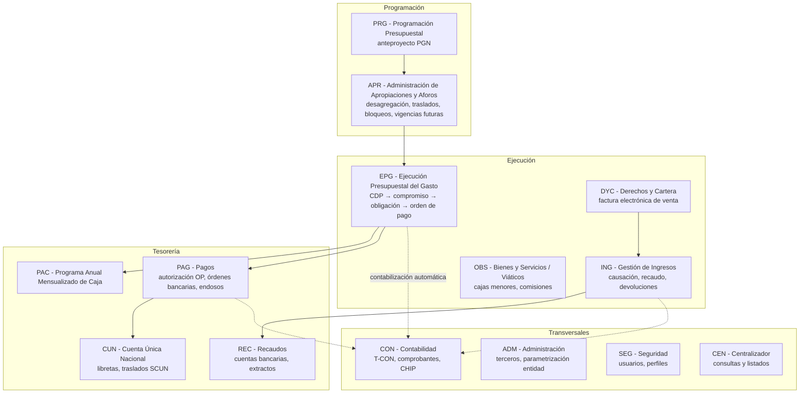
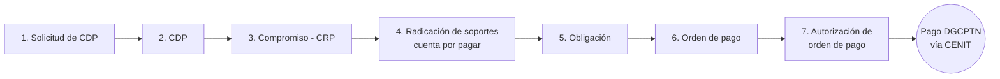
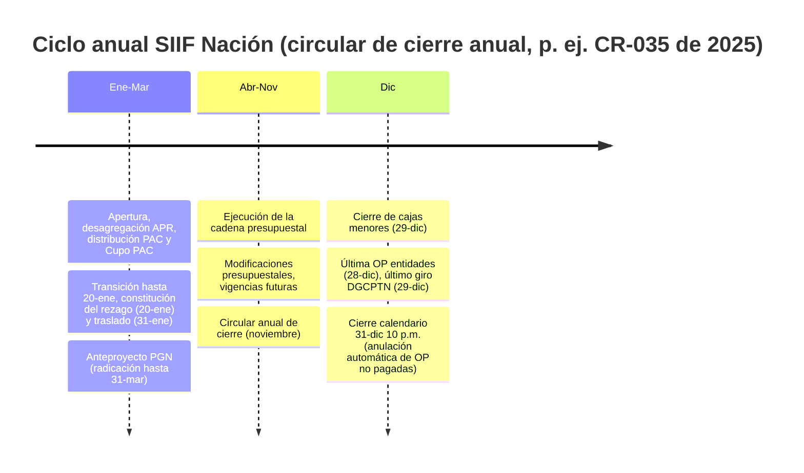

# SIIF NACIÓN — Documento único consolidado (todo lo investigado)

**Sistema Integrado de Información Financiera — Ministerio de Hacienda y Crédito Público de Colombia**

Este documento reúne en un solo archivo **absolutamente toda** la información levantada hasta la fecha (2026-07-03): el modelo general del sistema, los 20 capítulos por módulo/dimensión, la estructura campo a campo de la carga masiva de obligaciones, el curso paso a paso y la verificación de fuentes. Fue construido con más de 120 agentes de investigación sobre el portal oficial de MinHacienda (minhacienda.gov.co/siif), sus instructivos y circulares, la Contaduría General de la Nación y guías oficiales espejo de entidades usuarias (MinDefensa/DIMAR/Armada, DIAN, ICBF, Rama Judicial), con verificación adversarial de las afirmaciones clave.

> Nota: minhacienda.gov.co bloquea la lectura automatizada (Radware); las páginas del MHCP se verificaron vía snapshots de archivo y espejos oficiales (pte.gov.co). Los calendarios, horarios y catálogos cambian cada año por circular externa: para operar, confirme siempre la circular vigente.

## Contenido

- [Modelo detallado del SIIF Nación](#modelo-detallado-del-siif-nación)
- [01. Visión general del SIIF Nación: definición, historia (SIIF I, SIIF II, nueva versión), objetivos, cobertura institucional, definición legal, órgano rector, Comité Directivo, alcance y beneficios](#01-visión-general-del-siif-nación-definición-historia-siif-i-siif-ii-nueva-versi)
- [02. Módulo EPG (Ejecución Presupuestal del Gasto) del SIIF Nación y la cadena presupuestal completa: Solicitud de CDP, CDP, compromiso, radicación de soportes/cuenta por pagar, obligación, orden de pago, autorización y pago](#02-módulo-epg-ejecución-presupuestal-del-gasto-del-siif-nación-y-la-cadena-presu)
- [03. Módulos de Programación Presupuestal (PGN) y Administración de Apropiaciones (APR) en SIIF Nación: anteproyecto de presupuesto, desagregación de apropiaciones, asignación a subunidades, modificaciones presupuestales, bloqueos de apropiación y vigencias futuras](#03-módulos-de-programación-presupuestal-pgn-y-administración-de-apropiaciones-ap)
- [04. Módulo ING (Gestión de Ingresos) del SIIF Nación: causación y recaudo de ingresos, documentos de recaudo por clasificar, carga y contabilización de extractos bancarios, devoluciones de ingresos y ejecución presupuestal de ingresos](#04-módulo-ing-gestión-de-ingresos-del-siif-nación-causación-y-recaudo-de-ingreso)
- [05. Módulo PAC (Programa Anual Mensualizado de Caja) del SIIF Nación](#05-módulo-pac-programa-anual-mensualizado-de-caja-del-siif-nación)
- [06. Módulo de Tesorería / Sistema de Cuenta Única Nacional (SCUN) en SIIF Nación: órdenes de pago presupuestales y no presupuestales, órdenes bancarias, beneficiario final vs traslado a pagaduría, cuentas bancarias de tesorería, SEBRA/CUD, conciliación, títulos y devoluciones, endosos, embargos y retenciones DIAN](#06-módulo-de-tesorería--sistema-de-cuenta-única-nacional-scun-en-siif-nación-órd)
- [07. Módulo CON (Contabilidad) del SIIF Nación: contabilización automática (eventos contables, tablas T-CON), comprobantes contables manuales, catálogo contable de la CGN, cierres contables, relación con el CHIP y estados financieros](#07-módulo-con-contabilidad-del-siif-nación-contabilización-automática-eventos-co)
- [08. Módulo de Gestión de Bienes y Servicios / Plan Anual de Adquisiciones en SIIF Nación: catálogo UNSPSC, plan de adquisiciones, solicitudes, relación con la cadena presupuestal, cajas menores (constitución, ejecución, reembolso, legalización, cierre), viáticos y comisiones](#08-módulo-de-gestión-de-bienes-y-servicios--plan-anual-de-adquisiciones-en-siif)
- [09. Administración de usuarios y seguridad (módulo SEG) del SIIF Nación](#09-administración-de-usuarios-y-seguridad-módulo-seg-del-siif-nación)
- [10. Normatividad del SIIF Nación: Decreto 2789 de 2004, Decreto 2674 de 2012, Decreto 1068 de 2015 (Parte 9), Estatuto Orgánico de Presupuesto (Decreto 111 de 1996), resoluciones y circulares externas del MHCP, obligatoriedad de uso y responsabilidades de usuarios y de la Administración SIIF](#10-normatividad-del-siif-nación-decreto-2789-de-2004-decreto-2674-de-2012-decret)
- [11. Arquitectura técnica y requisitos del SIIF Nación: tecnología, acceso, conectividad, disponibilidad, capacitación, cargas masivas, interoperabilidad y evolución del sistema](#11-arquitectura-técnica-y-requisitos-del-siif-nación-tecnología-acceso-conectivi)
- [12. Entidades usuarias del SIIF Nación: obligados del PGN, estructura Unidad Ejecutora/Subunidad, Establecimientos Públicos, regímenes especiales, cobertura, entidades territoriales y relación con el SPGR](#12-entidades-usuarias-del-siif-nación-obligados-del-pgn-estructura-unidad-ejecut)
- [13. Reportes y consultas del SIIF Nación: ejecución presupuestal, listados por módulo (CDP, compromisos, obligaciones, órdenes de pago), reportes contables, soporte a rendición de cuentas (CGR y CGN), Portal de Transparencia Económica y datos abiertos](#13-reportes-y-consultas-del-siif-nación-ejecución-presupuestal-listados-por-módu)
- [14. Gestión de terceros y cuentas bancarias en SIIF Nación: creación de terceros (naturales, jurídicos, consorcios), validación con Registraduría/DIAN, registro y estados de cuentas bancarias de beneficiarios, beneficiario final y endoso de pagos](#14-gestión-de-terceros-y-cuentas-bancarias-en-siif-nación-creación-de-terceros-n)
- [15. Procesos de cierre de vigencia y apertura en SIIF Nación: cierre presupuestal de fin de año, constitución y cancelación del rezago presupuestal (reservas presupuestales y cuentas por pagar), apertura de nueva vigencia, calendario de cierre (circulares del MHCP) y cierre contable](#15-procesos-de-cierre-de-vigencia-y-apertura-en-siif-nación-cierre-presupuestal)
- [16. Módulo DYC (Derechos y Cartera) y Sistema de Facturación Electrónica del SIIF Nación: catálogo de bienes y servicios, factura electrónica de venta, notas débito/crédito, validación DIAN, deudores/cartera y enlace con ING y contabilidad](#16-módulo-dyc-derechos-y-cartera-y-sistema-de-facturación-electrónica-del-siif-n)
- [17. Catálogo de Clasificación Presupuestal (CCP) y usos presupuestales en SIIF Nación: Resolución 0042 de 2019 DGPPN, estructura del clasificador, usos presupuestales en la obligación y correlación con el catálogo contable de la CGN y clasificadores internacionales (CPC, COFOG)](#17-catálogo-de-clasificación-presupuestal-ccp-y-usos-presupuestales-en-siif-naci)
- [18. Recursos Con Situación de Fondos (CSF) vs Sin Situación de Fondos (SSF), fuentes de financiación (Nación/Propios) y gestión de recursos administrados en el SCUN (libretas, recursos entregados en administración, traslados entre libretas) en el SIIF Nación](#18-recursos-con-situación-de-fondos-csf-vs-sin-situación-de-fondos-ssf-fuentes-d)
- [19. Interoperabilidad del SIIF Nación con otros sistemas del Estado: SECOP II/TVEC (Colombia Compra Eficiente), SUIFP/PIIP-BPIN (DNP), DIAN (facturación electrónica y datos tributarios), CHIP (CGN), SEBRA/CUD/CENIT (Banco de la República) y SPGR (regalías)](#19-interoperabilidad-del-siif-nación-con-otros-sistemas-del-estado-secop-iitvec)
- [20. Novedades y hoja de ruta 2024-2026 del SIIF Nación: actualizaciones de versión, cambios en módulos DYC/EPG, nuevos medios de pago (billeteras digitales/depósitos electrónicos), Gestor de Información Financiera y modernización del sistema](#20-novedades-y-hoja-de-ruta-2024-2026-del-siif-nación-actualizaciones-de-versión)
- [21. Verificación de hallazgos, fuentes y advertencias metodológicas](#21-verificación-de-hallazgos-fuentes-y-advertencias-metodológicas)
- [22. Carga masiva de obligaciones (EPG): estructura oficial campo a campo](#22-carga-masiva-de-obligaciones-epg-estructura-oficial-campo-a-campo)
- [Curso: construye tu carga masiva de obligaciones en SIIF Nación](#curso-construye-tu-carga-masiva-de-obligaciones-en-siif-nación)

---

## Modelo detallado del SIIF Nación

**Sistema Integrado de Información Financiera — Ministerio de Hacienda y Crédito Público de Colombia**

> Documento maestro de síntesis. Cada sección remite a un capítulo detallado (01 a 20) construido a partir de la página oficial de MinHacienda (minhacienda.gov.co/siif), sus instructivos, circulares externas y guías oficiales republicadas por entidades usuarias (MinDefensa/DIMAR, DIAN, ICBF, Rama Judicial, entre otras). La metodología de verificación y las fuentes están en el capítulo [21](21-verificacion-y-fuentes.md).

---

### 1. Qué es el SIIF Nación

El SIIF Nación es la **herramienta modular, transversal y transaccional** mediante la cual las entidades del **Presupuesto General de la Nación (PGN)** realizan su gestión financiera pública de forma estandarizada, segura, **en línea y en tiempo real**. Es una iniciativa del MHCP que consolida la información financiera de las entidades del PGN y controla la ejecución presupuestal y financiera de la Administración Central y Descentralizada (excepto las empresas estatales).

- **Definición legal vigente** (Decreto 2674 de 2012, compilado en la Parte 9 del Decreto 1068 de 2015): sistema que *"coordina, integra, centraliza y estandariza la gestión financiera pública nacional"*.
- **Carácter oficial de la información**: lo registrado en SIIF es fuente válida para CDP, informes presupuestales, contabilidad, rezago e informes a órganos de control. La veracidad de las cifras es responsabilidad exclusiva de las entidades usuarias.
- **Obligatoriedad**: todas las entidades y órganos del PGN (art. 2.9.1.1.3 y 2.9.1.1.5 del Decreto 1068 de 2015). Prohibido adquirir software financiero que duplique al SIIF.

#### Historia y versiones

| Versión | Período | Norma | Características |
|---|---|---|---|
| SIIF I | ~2000–2010 | Ley 298/1996 art. 8; Decretos 178/2003 y 2789/2004 | Integración básica presupuesto-contabilidad; dos niveles (central/descentralizado) |
| SIIF Nación II | 1-ene-2011 → hoy | CONPES 3361/2005; Decreto 2674/2012; Decreto 1068/2015 Parte 9 | 100% web, en línea y tiempo real, pago a beneficiario final, macroprocesos estandarizados |

**No existe una versión oficial "SIIF III"**: la modernización actual es incremental y se canaliza por el Proyecto de Modernización de la Administración Financiera Pública (MAFP) con apoyo BID/CAF (chatbot, portal de pagos, Gestor de Información Financiera con billeteras digitales, interoperabilidad). Ver capítulo [20](20-novedades-2024-2026.md).

#### Gobernanza

| Órgano | Composición / titular | Función |
|---|---|---|
| Comité Directivo | Preside el Viceministro General; Contador General, Directores de Presupuesto (DGPPN), Crédito Público y Tesoro (DGCPTN) y Tecnología | Dirección estratégica; decisiones de obligatorio cumplimiento |
| Comité Operativo y de Seguridad | Preside el Administrador SIIF | Puede deshabilitar usuarios y exceptuar el pago a beneficiario final |
| Administrador SIIF Nación | Funcionario de alto nivel del Viceministerio General del MHCP | Administración funcional y técnica; circulares externas |
| Coordinador SIIF Entidad | Directivo/asesor designado por el Secretario General de cada entidad | Enlace oficial; seguridad y administración de usuarios en la entidad |

---

### 2. Mapa de módulos (macroprocesos)



| Módulo | Capítulo | Función principal |
|---|---|---|
| PRG – Programación Presupuestal | [03](03-programacion-presupuestal-apr.md) | Anteproyecto de PGN por versiones (entidades) y etapas Proyecto/Ley/Decreto (DGPPN) |
| APR – Administración de Apropiaciones y Aforos | [03](03-programacion-presupuestal-apr.md) | Desagregación del Decreto de Liquidación, asignación a subunidades/dependencias, modificaciones, bloqueos, vigencias futuras |
| EPG – Ejecución Presupuestal del Gasto | [02](02-epg-cadena-presupuestal.md) | Cadena presupuestal completa del gasto |
| ING – Gestión de Ingresos | [04](04-ing-ingresos.md) | Causación, recaudo, documentos de recaudo por clasificar, devoluciones |
| PAC | [05](05-pac.md) | Distribución de PAC y Cupo PAC, modificaciones, INPANUT |
| PAG / CUN / REC – Tesorería y SCUN | [06](06-tesoreria-cun.md) | Autorización y pago de órdenes, libretas SCUN, traslados, endosos, embargos, DIAN |
| CON – Contabilidad | [07](07-contabilidad-con.md) | Contabilidad automática (T-CON), comprobantes manuales, cierres, CHIP |
| OBS / Bienes y Servicios | [08](08-bienes-servicios-cajas-menores.md) | PAA/UNSPSC, cajas menores, viáticos y comisiones |
| SEG – Seguridad | [09](09-seguridad-usuarios-seg.md) | Usuarios, perfiles, firma digital, horarios |
| DYC – Derechos y Cartera | [16](16-derechos-cartera-facturacion.md) | Factura electrónica de venta, notas débito/crédito, cartera |
| ADM – Administración | [14](14-terceros-cuentas-bancarias.md) | Terceros, cuentas bancarias, parametrización de la entidad |
| CEN – Centralizador | [13](13-reportes-consultas.md) | Consultas tipo listado transversales |

---

### 3. La cadena presupuestal del gasto (núcleo del sistema)

Cinco etapas oficiales, siete pasos transaccionales. Cada paso tiene perfil y ruta de menú propios (detalle completo en el capítulo [02](02-epg-cadena-presupuestal.md)):



| # | Paso | Perfil | Ruta de transacción |
|---|---|---|---|
| 1 | Solicitud de CDP | Gestión Administrativa / Gestión Presupuesto Gastos | `EPG / Solicitud de CDP / Crear` |
| 2 | CDP | Gestión Presupuesto Gastos | `EPG / CDP / Gastos / Crear` |
| 3 | Compromiso (CRP) | Gestión Presupuesto Gastos | `EPG / Compromiso / Vigencia Actual / Crear` |
| 4 | Radicación de soportes | Central de Cuentas por Pagar | `EPG / Radicación Soportes / Radicar` |
| 5 | Obligación | Gestión Contable | `EPG / Obligación / Crear` |
| 6 | Orden de pago | Pagador Central / Regional | `EPG / Orden de Pago Presupuestal de Gasto / Crear` |
| 7 | Autorización | Pagador Central / Regional | `PAG / Administrar Órdenes de Pago / Autorizar` |

Reglas estructurales:

- **Encadenamiento hacia atrás**: adicionar un compromiso exige adicionar primero la solicitud y el CDP; reducir una solicitud certificada exige reducir primero el CDP. Las reducciones solo proceden sobre saldos no consumidos por la instancia siguiente.
- **Estados de la orden de pago**: Generada → Aprobada / Pendiente de Autorización → Pagada; excepciones Bloqueada y Anulada (una OP *Pagada* puede volver a *Bloqueada* si el banco rechaza el abono).
- **La obligación concentra la lógica contable**: tipo de gasto, tipo de operación (crédito, TCON009), uso contable (débito, TCON007/TCON012) y atributo contable (48 códigos) que define si contabiliza en la obligación (transacción EPG066) o en el pago. Desde el Decreto 412 de 2018 es obligatoria la carpeta **Usos Presupuestales** al máximo nivel del CCP.
- **Pago a beneficiario final** (art. 2.9.1.2.1, Decreto 1068/2015): abono directo a cuenta bancaria registrada y validada; el *Traslado a Pagaduría* es excepcional (nóminas, pensiones, deducciones, servicios públicos) y lo autoriza el Comité Operativo y de Seguridad.

---

### 4. Conceptos transversales

#### Catálogos y clasificadores (capítulo [17](17-catalogo-clasificacion-presupuestal.md))
- **CCP – Catálogo de Clasificación Presupuestal** (Resolución 0042 de 2019 DGPPN): 8 clasificadores principales + 2 auxiliares. Rubros de gasto: `A` funcionamiento, `B` deuda, `C` inversión. Marcas por posición: nivel *Desagregado*, *Afecta Apropiación*, *Requiere Usos Presupuestales*.
- **Catálogo Institucional (PCI)**: Unidad Ejecutora (6 dígitos = sección presupuestal) → Subunidades. Ver capítulo [12](12-entidades-usuarias.md).
- **Fuentes y situación de fondos** (capítulo [18](18-csf-ssf-fuentes.md)): fuente *Nación* o *Propios*; recursos *CSF* (giro del Tesoro) o *SSF*. Determinan quién carga extractos, quién paga (13-01-01-DT para SCUN) y a dónde van los reintegros.

#### PAC y SCUN
- **PAC**: tope mensual de pago aprobado por el CONFIS, distribuido por la DGCPTN a las Unidades Ejecutoras; la UE distribuye **Cupo PAC** a subunidades. Tres vigencias: Actual, Rezago Año Anterior, Rezago Año Siguiente. Indicador **INPANUT** (márgenes 5%/10%) con sanciones por incumplimiento.
- **SCUN**: la DGCPTN administra los recursos trasladados como "banco de las entidades" mediante **libretas** por UE; cuenta 61016986 del Banco de la República; contabilidad en el auxiliar 190801002 (REA DTN-SCUN).

#### Terceros y cuentas bancarias (capítulo [14](14-terceros-cuentas-bancarias.md))
- Terceros universales validados en línea contra **DIAN** (NIT/RUT) y **Registraduría** (cédulas).
- Estados de cuenta bancaria: Registro Previo → Registrada → **Activa** (única que permite pagar) / Inválida; validación por prenotificación **CENIT** (mínimo 3 días hábiles).

#### Contabilidad automática
- Tablas de eventos contables **T-CON** parametrizadas por la Contaduría General de la Nación (TCON01 a TCON99); comprobantes manuales por **tipologías** T01–T80 (TCON95); reportes formales a **CHIP**: CGN2015.001, CGN2015.002, CGN2016.01.

---

### 5. Perfiles y seguridad (capítulo [09](09-seguridad-usuarios-seg.md))

- **Dos familias de perfiles**: *Administrativos* (MHCP, CGN, DGCPTN; sin restricción horaria) y *de Negocio* (`Entidad – …`; horario 6:00 a.m.–12:30 p.m. y 1:00–11:00 p.m., extendido por circular en cierres).
- **Autenticación de triple factor**: usuario + contraseña (teclado virtual, vence cada 30 días) + **certificado de firma digital** en token criptográfico (obligatorio desde el 1-abr-2016, Circular Externa 005 de 2014); se admiten tokens virtuales OTP.
- **Segregación de funciones** (Circulares 013/2021 y 044/2022): no se combinan Gestión Presupuesto Gastos, Central de Cuentas por Pagar, Pagador Central/Regional; ni Programador/Consolidador; ni Autorizador Endoso/Pagador.
- **Gestión de usuarios**: Coordinador SIIF → Registrador de Usuarios → `SEG / Entidades y Usuarios / Trámite de Privilegios / Solicitud de Administración de Usuarios UE`; soportes por la Sede Electrónica del MHCP. Cuentas: expiración a 15 días sin ingreso, eliminación a 90.
- **Acceso**: portal VPN SSL — producción `portal2.siifnacion.gov.co`, capacitación `portal3.siifnacion.gov.co/capacitacion`. Soporte: (601) 602 1270 op. 1 / 01-8000-910071.

---

### 6. Ciclo anual de operación (capítulo [15](15-cierre-vigencia.md))



- **Rezago presupuestal** = reservas (compromisos no obligados a 31-dic) + cuentas por pagar (obligaciones no pagadas a 31-dic); se constituye a más tardar el 20-ene y fenece si no se ejecuta a 31-dic del año siguiente.
- **Cierre contable**: registros hasta mediados de febrero; cierre por la CGN en marzo (clase 7 y grupo 59 en cero, conciliaciones, recíprocas).

---

### 7. Interoperabilidad (capítulo [19](19-interoperabilidad.md))

| Sistema | Entidad | Naturaleza del enlace |
|---|---|---|
| SECOP II / TVEC | Colombia Compra Eficiente | Validación en línea de CDP y RP desde el contrato electrónico (botón "Consultar SIIF") |
| SUIFP / PIIP (BPIN) | DNP | Código BPIN en apropiaciones de inversión; concepto previo DNP en trámites |
| DIAN | DIAN | Sincronización RUT de terceros; factura electrónica (recepción obligatoria desde 1-abr-2021 y FEV propia del SIIF en DYC); pago de retenciones por compensación (MUISCA) |
| CHIP | Contaduría General | Formularios trimestrales CGN2015.001/002, CGN2016.01 |
| SEBRA / CUD / CENIT | Banco de la República | Pagos a beneficiario final (ACH CENIT), traslados al SCUN (SEBRA-CUD), prenotificación de cuentas |
| SPGR | MHCP (regalías) | Plataforma compartida, presupuesto separado; contabilidad única en SIIF |
| PTE / datos abiertos | MHCP | Portal de Transparencia Económica (www.pte.gov.co) alimentado por SIIF |

---

### 8. Catálogo documental oficial

El portal **minhacienda.gov.co/siif** organiza la documentación en: Información General · Formatos · Capacitaciones en Línea · Capacitación · Estadísticas · Acceso Consulta de Pagos · Normativa (Circulares, Comunicados, Decretos) · **Ciclo de Negocios** (guías por macroproceso, incluida la carpeta Cargas Masivas con ~37 estructuras de archivos planos) · **Aspectos Técnicos** (~10 documentos: manual VPN SSL, guía del componente de firma digital, esquema de interconexión, ancho de banda, canales de contingencia, lista de chequeo, configuración de clientes/servidores).

Complementan: las circulares externas anuales (cambios de versión, cierre de vigencia), la *Guía de entrada al SIIF Nación* (v14, mayo 2025) y las guías financieras numeradas del Ministerio de Defensa que documentan procedimientos SIIF estándar (p. ej. Guía 12 – Ejecución presupuestal del gasto, Guía 65 – Perfiles). Cada capítulo de este modelo incluye su tabla de documentos oficiales con enlaces.

#### Normatividad esencial (capítulo [10](10-normatividad.md))

| Norma | Contenido |
|---|---|
| Ley 298 de 1996, art. 8 | Creación legal del SIIF |
| Decreto 111 de 1996 | Estatuto Orgánico del Presupuesto (fundamento sustantivo) |
| Decreto 2674 de 2012 | Reglamento de operación vigente (deroga 2789/2004 y 4318/2006) |
| Decreto 1068 de 2015, Parte 9 | Compilación vigente (DUR Sector Hacienda) |
| Decreto 412 de 2018 | Registro de ejecución y usos presupuestales |
| Resolución 0042 de 2019 DGPPN | Catálogo de Clasificación Presupuestal |
| Circulares externas del Administrador SIIF | Operación: versiones, cierre anual, perfiles, seguridad |

---

### 9. Índice de capítulos

1. [Visión general e historia](01-vision-general.md)
2. [EPG y cadena presupuestal](02-epg-cadena-presupuestal.md)
3. [Programación presupuestal y APR](03-programacion-presupuestal-apr.md)
4. [ING – Ingresos](04-ing-ingresos.md)
5. [PAC](05-pac.md)
6. [Tesorería y SCUN](06-tesoreria-cun.md)
7. [CON – Contabilidad](07-contabilidad-con.md)
8. [Bienes y servicios, cajas menores y viáticos](08-bienes-servicios-cajas-menores.md)
9. [SEG – Seguridad y usuarios](09-seguridad-usuarios-seg.md)
10. [Normatividad](10-normatividad.md)
11. [Arquitectura técnica](11-arquitectura-tecnica.md)
12. [Entidades usuarias](12-entidades-usuarias.md)
13. [Reportes y consultas](13-reportes-consultas.md)
14. [Terceros y cuentas bancarias](14-terceros-cuentas-bancarias.md)
15. [Cierre de vigencia y rezago](15-cierre-vigencia.md)
16. [DYC – Derechos y Cartera / facturación electrónica](16-derechos-cartera-facturacion.md)
17. [Catálogo de Clasificación Presupuestal y usos](17-catalogo-clasificacion-presupuestal.md)
18. [CSF/SSF, fuentes y recursos administrados](18-csf-ssf-fuentes.md)
19. [Interoperabilidad](19-interoperabilidad.md)
20. [Novedades 2024–2026](20-novedades-2024-2026.md)
21. [Verificación y fuentes](21-verificacion-y-fuentes.md)

---

## 01. Visión general del SIIF Nación: definición, historia (SIIF I, SIIF II, nueva versión), objetivos, cobertura institucional, definición legal, órgano rector, Comité Directivo, alcance y beneficios

### Resumen

El SIIF Nación (Sistema Integrado de Información Financiera) es la plataforma transaccional oficial mediante la cual el Estado colombiano gestiona en línea y en tiempo real la ejecución del Presupuesto General de la Nación (PGN). Es una iniciativa del Ministerio de Hacienda y Crédito Público (MHCP) que permite a la Nación consolidar la información financiera de las entidades que conforman el PGN y ejercer el control de la ejecución presupuestal y financiera de la Administración Central y Descentralizada (excepto las empresas estatales), con el fin de propiciar mayor eficiencia en el uso de los recursos públicos y brindar información oportuna y confiable.

Su base legal se remonta al artículo 8 de la Ley 298 de 1996, que definió el SIIF como "un conjunto integrado de procesos automatizados, de base contable, que permite la producción de información para la gestión financiera pública". La primera versión (SIIF I) operó desde comienzos de los años 2000, reglamentada por el Decreto 178 de 2003 y luego por el Decreto 2789 de 2004 (modificado por el Decreto 4318 de 2006), que lo definió como "una herramienta modular automatizada que integra y estandariza el registro de la gestión financiera pública". El documento CONPES 3361 de 2005 declaró la importancia estratégica del proyecto SIIF y dio paso a la construcción de una nueva versión: el SIIF Nación II, que entró en producción el 1 de enero de 2011 con arquitectura orientada a procesos, mayor cobertura y pagos a beneficiario final. El Decreto 2674 de 2012 reglamentó esta nueva versión y definió el sistema como aquel que "coordina, integra, centraliza y estandariza la gestión financiera pública nacional"; esta reglamentación fue compilada en la Parte 9 del Decreto 1068 de 2015 (Decreto Único Reglamentario del Sector Hacienda), vigente hoy. No se encontró en fuentes oficiales una versión formalmente denominada "SIIF III"; la plataforma actual sigue siendo el SIIF Nación (II) con actualizaciones continuas (la Guía de entrada al sistema va en su versión 14, de mayo de 2025).

La administración del sistema corresponde al Viceministerio General del MHCP a través del Administrador del SIIF Nación (Administración SIIF); la dirección estratégica recae en el Comité Directivo del SIIF Nación, presidido por el Viceministro General e integrado por el Contador General de la Nación, los Directores Generales de Presupuesto Público Nacional, de Crédito Público y Tesoro Nacional y de Tecnología, con el Administrador del sistema como secretario técnico. Existe además un Comité Operativo y de Seguridad. El uso del sistema es obligatorio para todas las entidades del PGN; la información registrada tiene carácter oficial y es fuente válida para la gestión presupuestal, contable y de tesorería, y para los informes a los órganos de control.

### Detalle

1. QUÉ ES EL SIIF NACIÓN
- Definición institucional (MHCP, página "Información general de SIIF Nación"): el SIIF Nación "constituye una iniciativa del Ministerio de Hacienda y Crédito Público que permite a la Nación consolidar la información financiera de las Entidades que conforman el Presupuesto General de la Nación y ejercer el control de la ejecución presupuestal y financiera de las Entidades pertenecientes a la Administración Central y Descentralizada (excepto las empresas estatales) y sus subunidades descentralizadas, con el fin de propiciar una mayor eficiencia en el uso de los recursos de la Nación y de brindar información oportuna y confiable".
- Definición de la Contaduría General de la Nación: "herramienta modular, transversal y transaccional" mediante la cual las entidades del PGN realizan su gestión financiera pública de forma estandarizada, segura, conforme a la norma, en línea y en tiempo real.
- Es un sistema web transaccional: los usuarios acceden con certificado de firma digital, usuario y contraseña, gestionados por el Coordinador SIIF de cada entidad.

2. DEFINICIÓN LEGAL (EVOLUCIÓN NORMATIVA)
- Ley 298 de 1996 (que creó la Contaduría General de la Nación), artículo 8: "El Sistema Integrado de Información Financiera -SIIF- es un conjunto integrado de procesos automatizados, de base contable, que permite la producción de información para la gestión financiera pública".
- Decreto 2789 de 2004, art. 2 (derogado): "herramienta modular automatizada que integra y estandariza el registro de la gestión financiera pública", para propiciar eficiencia en el uso de los recursos de la Nación y brindar información oportuna y confiable.
- Decreto 2674 de 2012, art. 2 (definición vigente, compilada en el Decreto 1068 de 2015): sistema que "coordina, integra, centraliza y estandariza la gestión financiera pública nacional, con el fin de propiciar una mayor eficiencia y seguridad en el uso de los recursos del Presupuesto General de la Nación y de brindar información oportuna y confiable".

3. HISTORIA Y VERSIONES
- Antecedentes: la Constitución de 1991 exigió mayor eficiencia en la gestión estatal (contabilidad integral, uso óptimo de los recursos del Tesoro). El objetivo era integrar procesos hasta entonces aislados: presupuesto, contabilidad, Programa Anual Mensualizado de Caja (PAC) y tesorería.
- SIIF I (primera versión): creado a partir de la Ley 298 de 1996; entró en operación a comienzos de la década del 2000. Reglamentado inicialmente por el Decreto 178 de 2003 y después por el Decreto 2789 de 2004 (modificado por el Decreto 4318 de 2006). Se caracterizó por la integración básica de funciones presupuestales y contables, con procesos más manuales y menor capacidad de consulta en línea. Operaba en dos niveles: nivel central (SIIF integrado con unidades ejecutoras) y nivel descentralizado (establecimientos públicos con bases de datos separadas que alimentaban información agregada).
- CONPES 3361 de 2005 ("Proyecto de Importancia Estratégica Sistema Integrado de Información Financiera SIIF"): declaró el proyecto SIIF de importancia estratégica y orientó la actualización del sistema, la ampliación de cobertura, el acceso a todas las entidades ejecutoras del PGN y el desarrollo de nuevas funcionalidades — fundamento de la nueva versión.
- SIIF Nación II: entró en producción el 1 de enero de 2011 (desde esa fecha se habilitaron, por ejemplo, las transacciones del módulo de ingresos y el nuevo catálogo de ingresos definido por la Dirección General del Presupuesto y la Contraloría). Aportó arquitectura más robusta orientada a procesos, mejores controles de seguridad, integración más estrecha entre módulos, ampliación de cobertura (todas las unidades y subunidades ejecutoras en línea), pagos directos a beneficiario final y macroprocesos estandarizados. Fue reglamentado por el Decreto 2674 de 2012 (21 de diciembre de 2012, Diario Oficial 48.658 aprox.), que derogó los Decretos 2789 de 2004 y 4318 de 2006.
- Consolidación normativa: la reglamentación del SIIF Nación quedó compilada en el Decreto 1068 de 2015 (Decreto Único Reglamentario del Sector Hacienda y Crédito Público), Parte 9 "Sistema Integrado de Información Financiera – SIIF Nación", Título 1, Capítulo 1 (Características generales y estructura del SIIF Nación) y Capítulo 2 (Reglas sobre la utilización del SIIF).
- "SIIF Nación III" / nueva versión: NO se encontró en fuentes oficiales del MHCP una versión formalmente denominada "SIIF III" o "SIIF Nación III". El sistema vigente sigue siendo el SIIF Nación (segunda generación tecnológica) con evolución continua mediante actualizaciones funcionales y de versión del aplicativo (p. ej., la "Guía de entrada al SIIF Nación" del MHCP va en la Versión 14, del 15 de mayo de 2025; versión 12 de agosto de 2024), circulares externas anuales de cambios de versión y nuevos módulos (p. ej., cambios en el módulo Derechos y Cartera – DyC, Circular Externa 014). Fuentes secundarias describen las "versiones posteriores" como mejoras de usabilidad, tiempos de respuesta, reportes e interoperabilidad con otros sistemas estatales.

4. OBJETIVOS DEL SISTEMA
- Consolidar la información financiera de las entidades del PGN y ejercer control sobre la ejecución presupuestal y financiera.
- Propiciar mayor eficiencia y seguridad en el uso de los recursos de la Nación.
- Brindar información oportuna, confiable y comparable entre entidades para evaluar el desempeño fiscal, medir cumplimiento de metas y sustentar decisiones de política económica.
- Crear una infraestructura de información para las decisiones de manejo de los recursos públicos, mejorar el funcionamiento de los subsistemas estratégicos del ciclo financiero y apoyar a las entidades del Estado en el cumplimiento de sus responsabilidades constitucionales.
- Registrar la información económica del Estado con reglas homogéneas y en tiempo casi real; fortalecer control interno vía segregación de funciones y trazabilidad; reducir errores manuales y riesgos de manipulación.

5. COBERTURA INSTITUCIONAL / CAMPO DE APLICACIÓN
- Decreto 1068 de 2015, art. 2.9.1.1.3 (antes Decreto 2674 de 2012, art. 3): aplica a TODAS las entidades y órganos que hacen parte del Presupuesto General de la Nación. Para las Corporaciones Autónomas Regionales y las Empresas Industriales y Comerciales del Estado (y sociedades de economía mixta) que reciban recursos de la Nación a través del PGN, solo aplica en lo relacionado con la gestión presupuestal del gasto para el giro de dichos recursos.
- Cubre Administración Central y Descentralizada (excepto empresas estatales) y sus unidades y subunidades ejecutoras; también usan el sistema las Direcciones Generales de Presupuesto Público Nacional y de Crédito Público y Tesoro Nacional del MHCP y la Contaduría General de la Nación como órganos rectores/consolidadores.
- Las entidades territoriales no están obligadas (usan sistemas propios bajo lineamientos nacionales).

6. INFORMACIÓN QUE REFLEJA EL SISTEMA (art. 4, Decreto 2674 de 2012)
Detalle, secuencia y resultado de la gestión financiera pública de las entidades del PGN, en especial: programación presupuestal; liquidación, modificación y ejecución del presupuesto; administración de apropiaciones; administración del Programa Anual Mensualizado de Caja (PAC); gestión de ingresos; gestión de pagos; gestión contable; gestión de comisiones y viáticos; recaudos y pagos realizados por la Cuenta Única Nacional (CUN) y demás tesorerías. Incluye clasificadores presupuestales y contables estructurados, reservas presupuestales y cuentas por pagar, y registro simultáneo de la ejecución presupuestal y la gestión contable.

7. OBLIGATORIEDAD Y VALIDEZ DE LA INFORMACIÓN
- Obligatoriedad (art. 5): las entidades deben efectuar y registrar en el SIIF Nación sus operaciones "en línea y tiempo real", conforme a los instructivos del Administrador del Sistema; se permite la interoperación de aplicativos misionales autorizados en línea y tiempo real.
- Validez/alcance (art. 6): la información registrada es fuente válida para: procesos operativos de gestión de apropiaciones; elaboración de informes presupuestales; evaluación financiera de la inversión pública; generación de información contable; informes a entidades de control; constitución de reservas presupuestales y cuentas por pagar; expedición de certificados de disponibilidad presupuestal (CDP). La información tiene carácter oficial.
- El uso del SIIF no exime del cumplimiento de las normas orgánicas, legales y contables (art. 31). Prohibición de adquirir software financiero que duplique funcionalidades del SIIF, salvo sistemas misionales interoperables autorizados (art. 33). Los entes de control pueden vincularse como usuarios con perfil especial de consulta (art. 32).

8. ÓRGANO RECTOR Y ESTRUCTURA DE GOBERNANZA (Decreto 2674 de 2012 / Decreto 1068 de 2015)
La organización del sistema comprende: (i) Comité Directivo, (ii) Comité Operativo y de Seguridad, (iii) Administrador del Sistema, y (iv) Coordinador SIIF en cada entidad usuaria.
a) COMITÉ DIRECTIVO DEL SIIF NACIÓN (arts. 7-9):
   Composición: Viceministro General de Hacienda (preside), Contador General de la Nación, Director General de Presupuesto Público Nacional, Director General de Crédito Público y Tesoro Nacional, Director de Tecnología del MHCP; el Administrador del SIIF actúa como Secretario Técnico.
   Funciones: aprobar políticas de funcionamiento, seguridad, funcionalidad y cobertura del sistema; aprobar y establecer el Reglamento de Uso del Sistema; aprobar el modelo conceptual y los cambios significativos en funcionalidad, cobertura y aspectos tecnológicos; autorizar la infraestructura tecnológica; determinar qué entidades pueden usar sistemas misionales interconectados (interoperación); establecer mecanismos de coordinación; dictarse su propio reglamento.
b) COMITÉ OPERATIVO Y DE SEGURIDAD (arts. 10-11):
   Composición: Administrador del SIIF (preside), subdirectores/delegados de Presupuesto, Crédito Público y Tesoro, Tecnología y Contaduría; Asesor de Seguridad como secretario (voz sin voto); invitados el Jefe de Control Interno del MHCP y delegados de control.
   Funciones: proponer al Comité Directivo las políticas y estándares del modelo de seguridad del SIIF Nación; determinar pautas de divulgación, implantación y mejoramiento del modelo de seguridad; solicitar informes de seguimiento; evaluar el informe anual de riesgos; mantener informado al Comité Directivo; determinar los eventos/excepciones de pago por mecanismos distintos al abono directo a beneficiario final; tomar medidas ante el mal uso del aplicativo; coordinar parametrizaciones y cierres fiscales; reglamentar el procedimiento y requisitos de creación de usuarios.
c) ADMINISTRADOR DEL SISTEMA – "ADMINISTRACIÓN SIIF" (arts. 12-13): la administración del SIIF Nación corresponde al Viceministerio General del MHCP, cuyo titular designa a un funcionario de alto nivel como Administrador del Sistema, apoyado por un grupo de trabajo (la Administración SIIF). Funciones: ejecutar las decisiones del Comité Directivo; priorizar desarrollos y mejoras; verificar el funcionamiento del sistema; mantener el aplicativo actualizado frente a la normatividad vigente; definir la estrategia de capacitación de usuarios; expedir instructivos y establecer procedimientos de uso (circulares, guías); custodiar el modelo de seguridad; prestar soporte (Call Center/mesa de ayuda); coordinar procesos administrativos del sistema (cierres, aperturas, parametrizaciones); emitir concepto sobre cambios normativos que afecten el sistema; garantizar el servicio dentro de los horarios establecidos.
d) COORDINADOR SIIF ENTIDAD (arts. 14-15): funcionario de nivel directivo o asesor designado por acto administrativo (por el Secretario General o representante legal); puede haber uno por unidad ejecutora. Es el enlace oficial entre la entidad y la Administración SIIF. Responsabilidades: administrar/crear usuarios de la entidad, replicar las comunicaciones del Administrador, verificar restricciones de uso, brindar soporte funcional y técnico de primer nivel, mantener el archivo/documentación de usuarios, capacitar a usuarios nuevos e implementar las políticas de seguridad.

9. PAGOS A BENEFICIARIO FINAL (arts. 16-19)
Los pagos se realizan directamente al beneficiario mediante abono a cuenta bancaria previamente registrada (marca distintiva del SIIF II), salvo excepciones definidas por el Comité Operativo y de Seguridad. El registro de cuentas exige prenotificación a través del sistema CENIT del Banco de la República y certificación bancaria con autorización del ordenador del gasto. Los usuarios responden por la exactitud de los datos de beneficiarios y cuentas; la Dirección General de Crédito Público y Tesoro Nacional no responde por pagos ordenados por las entidades. Solo se paga al beneficiario y cuenta registrados (exclusividad), salvo cesiones autorizadas.

10. CICLO/FLUJO BÁSICO DE EJECUCIÓN DEL GASTO (visión general)
i) Solicitud y expedición del Certificado de Disponibilidad Presupuestal (CDP); ii) registro del compromiso presupuestal; iii) radicación de la cuenta por pagar; iv) registro de la obligación presupuestal; v) generación y autorización de la orden de pago y pago a beneficiario final. El sistema valida automáticamente que no se excedan las apropiaciones disponibles y genera simultáneamente los registros presupuestales, contables y de tesorería (asientos automáticos mediante Tablas de Eventos Contables – TCON).

11. MÓDULOS/MACROPROCESOS PRINCIPALES (visión general)
ADM (Administración/parametrización), APR (Administración de Apropiaciones y Aforos – programación y modificaciones presupuestales), EPG (Ejecución Presupuestal del Gasto), ING (Gestión de Ingresos), PAC (Programa Anual Mensualizado de Caja), REC (Recaudos), PAG/Tesorería – CUN (Cuenta Única Nacional), GES (Gestión contable), Derechos y Cartera (DyC), gestión de caja menor, comisiones y viáticos, cargas masivas. La contabilidad se produce como "macroproceso contable" (conjunto integrado de procesos automatizados de base contable ejecutado a través de SIIF Nación y SPGR, según la CGN).

12. BENEFICIOS
- Información oportuna, confiable y comparable para la toma de decisiones fiscales.
- Gestión estandarizada, en línea y tiempo real, conforme a la norma.
- Evita duplicidad de registros y asegura coherencia entre presupuesto, contabilidad y tesorería.
- Consultas de saldos y obligaciones en tiempo real; anticipación de riesgos de caja.
- Informes estandarizados para órganos de control; transparencia y rendición de cuentas.
- Seguridad: pagos a beneficiario final, firma digital, segregación de funciones, trazabilidad completa de la secuencia de registros.
- Ahorro para la Nación por integración (un solo sistema transversal en lugar de múltiples sistemas por entidad).

13. RESPONSABILIDADES (arts. 26-28, Decreto 2674 de 2012)
- MHCP: administrar el sistema, custodiar la información, gestionar el funcionamiento continuo, actualizarlo ante cambios normativos. No responde por el mal uso de usuarios autorizados ni por la veracidad de los datos registrados por las entidades.
- Entidades y usuarios: registrar la gestión en línea y tiempo real; cumplir el Reglamento de Uso y las políticas de seguridad; mantener equipos y conectividad; custodiar claves y certificados de firma digital; registrar correctamente beneficiarios y cuentas; establecer procedimientos de control interno; el representante legal responde por los controles internos. La Circular Externa 040 de 2015 del MHCP fija las obligaciones de las entidades y de los usuarios del SIIF Nación (los jefes de control interno hacen seguimiento anual a su cumplimiento).

14. RELACIÓN CON OTROS SISTEMAS
El SPGR (Sistema de Presupuesto y Giro de Regalías) es el sistema paralelo para el Sistema General de Regalías; las entidades que operan en ambos deben llevar una sola contabilidad reportando los movimientos del SPGR al SIIF Nación. El SIIF interopera con sistemas misionales autorizados por el Comité Directivo y con el sistema CENIT del Banco de la República para pagos. La CGN consolida la contabilidad pública a partir del SIIF (y el CHIP/SCHIP para entidades no SIIF).

### Roles y perfiles relacionados

- Administrador del SIIF Nación (funcionario de alto nivel del Viceministerio General del MHCP) y su grupo de apoyo (Administración SIIF) – perfiles de tipo Administrativo (mantenimiento, cierres, parametrizaciones, procesos BATCH)
- Coordinador SIIF Entidad (nivel directivo o asesor, designado por acto administrativo; enlace oficial con la Administración SIIF)
- Entidad - Registrador usuarios (crea usuarios y asigna perfiles dentro de la entidad)
- Entidad - Administrador gestión presupuestal
- Entidad - Aprobador Contable
- Entidad - Autorizador Endosos
- Entidad - Beneficiario cuenta
- Entidad - Central de cuentas por pagar
- Entidad - Consolidación Contable
- Entidad - Consolidador programación presupuestal
- Entidad - Consulta
- Entidad - Consulta UE Contable
- Entidad - ESP Control Consulta (perfil especial de consulta para entes de control)
- Entidad - Gestión Administrativa
- Entidad - Gestión caja menor
- Entidad - Gestión cargas masivas EPG
- Entidad - Gestión contable
- Entidad - Gestión modificación presupuestal
- Entidad - Gestión PAC
- Entidad - Gestión presupuesto gastos
- Entidad - Gestión presupuesto ingresos
- Entidad - Pagador central
- Entidad - Pagador regional
- Entidad - Parametrizador Contable
- Entidad - Parametrizador gestión entidad
- Entidad - Parametrizador gestión presupuestal
- Entidad - Programador presupuestal

### Normatividad aplicable

- Constitución Política de 1991 (mandatos de eficiencia en la gestión estatal y contabilidad integral, antecedente conceptual)
- Ley 298 de 1996, artículo 8 – crea la Contaduría General de la Nación y define legalmente el SIIF
- Ley 87 de 1993, artículo 12 – funciones de las oficinas de control interno (base de los informes anuales de seguimiento al SIIF)
- Decreto 178 de 2003 – primera reglamentación del SIIF (derogado)
- Decreto 2789 de 2004 – reglamento del SIIF Nación (SIIF I); Diario Oficial 45.659 (derogado)
- Documento CONPES 3361 de 2005 – declaratoria de importancia estratégica del proyecto SIIF (base del SIIF II)
- Decreto 4318 de 2006 – modificó el Decreto 2789 de 2004 (derogado)
- Decreto 2674 de 2012 (21 de diciembre de 2012) – reglamenta el SIIF Nación II: definición, ámbito, Comité Directivo, Comité Operativo y de Seguridad, Administrador del Sistema, Coordinador SIIF, pagos a beneficiario final; deroga los Decretos 2789/2004 y 4318/2006
- Decreto 1068 de 2015 (26 de mayo) – Decreto Único Reglamentario del Sector Hacienda y Crédito Público, Parte 9 'Sistema Integrado de Información Financiera – SIIF Nación' (arts. 2.9.1.1.1 y siguientes; art. 2.9.1.1.3 campo de aplicación) – norma compilatoria vigente
- Circular Externa 040 de 2015 del MHCP – obligaciones de las entidades y de los usuarios del SIIF Nación (políticas de operación y seguridad)
- Reglamento de Uso del SIIF Nación – aprobado por el Comité Directivo del SIIF Nación
- Circulares externas de la Administración SIIF Nación (p. ej., Circular Externa 035 de 2023 sobre cierre de vigencia 2023 y apertura 2024; circulares sobre firma digital y cambios de versión del aplicativo)
- Decreto 1821 de 2020, art. 2.1.1.3.14 y Resolución 191 de 2020 de la CGN – relación SIIF/SPGR y contabilidad única (contexto)

### Hallazgos clave

- El SIIF Nación fue creado legalmente por el artículo 8 de la Ley 298 de 1996 como 'conjunto integrado de procesos automatizados, de base contable, que permite la producción de información para la gestión financiera pública'.
- Han existido dos generaciones tecnológicas: SIIF I (en operación desde comienzos de los 2000, reglamentado por los Decretos 178 de 2003 y 2789 de 2004) y SIIF Nación II (en producción desde el 1 de enero de 2011, reglamentado por el Decreto 2674 de 2012); el CONPES 3361 de 2005 declaró la importancia estratégica del proyecto y financió la nueva versión.
- No existe en fuentes oficiales una versión denominada formalmente 'SIIF III': el sistema vigente es el SIIF Nación (II) con evolución continua mediante actualizaciones de versión del aplicativo (Guía de entrada Versión 14, mayo de 2025) y circulares externas de cambios.
- La definición reglamentaria vigente (Decreto 2674 de 2012, compilado en la Parte 9 del Decreto 1068 de 2015) es: sistema que 'coordina, integra, centraliza y estandariza la gestión financiera pública nacional' para propiciar eficiencia y seguridad en el uso de los recursos del PGN y brindar información oportuna y confiable.
- Cobertura: obligatorio para todas las entidades y órganos del Presupuesto General de la Nación; para Corporaciones Autónomas Regionales y EICE que reciben recursos del PGN aplica solo la gestión presupuestal del gasto para el giro de esos recursos (art. 2.9.1.1.3 del Decreto 1068 de 2015).
- Órgano rector: la administración corresponde al Viceministerio General del MHCP mediante el Administrador del SIIF Nación (Administración SIIF); la dirección estratégica la ejerce el Comité Directivo presidido por el Viceministro General e integrado por el Contador General de la Nación y los Directores Generales de Presupuesto, de Crédito Público y Tesoro Nacional y de Tecnología, con el Administrador como secretario técnico.
- La gobernanza incluye además un Comité Operativo y de Seguridad y un Coordinador SIIF designado en cada entidad usuaria como enlace oficial con la Administración SIIF.
- La información registrada en el SIIF tiene carácter oficial y es fuente válida para CDP, informes presupuestales, contabilidad, reservas y cuentas por pagar e informes a órganos de control; el registro debe hacerse en línea y en tiempo real.
- Rasgo distintivo del SIIF II: pago directo a beneficiario final mediante abono a cuenta bancaria prerregistrada (prenotificación vía CENIT del Banco de la República), con la Cuenta Única Nacional (CUN) como eje de tesorería.
- La Circular Externa 040 de 2015 del MHCP establece las obligaciones de entidades y usuarios del SIIF Nación, y su cumplimiento es objeto de informe anual de seguimiento por las oficinas de control interno de cada entidad.

### Documentos e instructivos oficiales

| Documento | Descripción | Enlace |
|---|---|---|
| Información general de SIIF Nación – Minhacienda (Aspectos generales) | Página oficial del MHCP con la definición institucional del SIIF Nación, objetivos y cobertura (protegida por filtro anti-bots; contenido citado por buscadores). | [https://www.minhacienda.gov.co/siif/siif-nacion/informacion-general](https://www.minhacienda.gov.co/siif/siif-nacion/informacion-general) |
| Portal SIIF Nación – Minhacienda | Portal oficial del sistema: información general, ciclo de negocios, normativa (circulares), guías y capacitaciones. | [https://www.minhacienda.gov.co/siif](https://www.minhacienda.gov.co/siif) |
| Decreto 2674 de 2012 – Gestor Normativo de Función Pública | Reglamentación del SIIF Nación (II): definición, campo de aplicación, Comité Directivo, Comité Operativo y de Seguridad, Administrador, Coordinador SIIF, pagos a beneficiario final. Deroga Decretos 2789/2004 y 4318/2006. | [https://www.funcionpublica.gov.co/eva/gestornormativo/norma.php?i=51199](https://www.funcionpublica.gov.co/eva/gestornormativo/norma.php?i=51199) |
| Decreto 2674 de 2012 – texto completo (normograma MinTIC) | Texto íntegro artículo por artículo (34 artículos) de la reglamentación del SIIF Nación. | [https://normograma.mintic.gov.co/mintic/compilacion/docs/decreto_2674_...](https://normograma.mintic.gov.co/mintic/compilacion/docs/decreto_2674_2012.htm) |
| Decreto 2789 de 2004 – normograma Mincultura | Reglamento del SIIF I: definición como herramienta modular automatizada, Comité Directivo, Comité de Seguridad, Administrador y Coordinador SIIF (derogado por el Decreto 2674 de 2012). | [https://normograma.mincultura.gov.co/compilacion/docs/decreto_2789_200...](https://normograma.mincultura.gov.co/compilacion/docs/decreto_2789_2004.htm) |
| Decreto 2789 de 2004 – SUIN-Juriscol | Versión oficial del decreto reglamentario del SIIF I en el sistema único de información normativa. | [https://www.suin-juriscol.gov.co/viewDocument.asp?ruta=Decretos/1777126](https://www.suin-juriscol.gov.co/viewDocument.asp?ruta=Decretos/1777126) |
| Ley 298 de 1996 – Gestor Normativo de Función Pública | Ley que crea la Contaduría General de la Nación; su artículo 8 define legalmente el SIIF. | [https://www.funcionpublica.gov.co/eva/gestornormativo/norma.php?i=15071](https://www.funcionpublica.gov.co/eva/gestornormativo/norma.php?i=15071) |
| Decreto 1068 de 2015 (DUR Sector Hacienda) – Gestor Normativo de Función Pública | Decreto Único Reglamentario del Sector Hacienda; la Parte 9 compila la reglamentación vigente del SIIF Nación (características generales, estructura y reglas de utilización). | [https://www.funcionpublica.gov.co/eva/gestornormativo/norma.php?i=72893](https://www.funcionpublica.gov.co/eva/gestornormativo/norma.php?i=72893) |
| CONPES 3361 de 2005 – Proyecto de importancia estratégica SIIF | Documento CONPES que declaró la importancia estratégica del proyecto SIIF y sustentó el desarrollo del SIIF Nación II (actualización, ampliación de cobertura y nuevas funcionalidades). | [https://colaboracion.dnp.gov.co/CDT/Conpes/Econ%C3%B3micos/3361.pdf](https://colaboracion.dnp.gov.co/CDT/Conpes/Econ%C3%B3micos/3361.pdf) |
| Presentación oficial 'SIIF Nación' – MHCP (alojada en DNP) | Presentación del MHCP sobre el SIIF Nación: qué es, cobertura y funcionamiento (servidor con disponibilidad intermitente). | [https://colaboracion.dnp.gov.co/CDT/Inversiones%20y%20finanzas%20pblic...](https://colaboracion.dnp.gov.co/CDT/Inversiones%20y%20finanzas%20pblicas/Sistema_Integrado_de_Informacion_financiera_SIIF.pdf) |
| Preguntas acerca del SIIF y SPGR – Contaduría General de la Nación | Definiciones oficiales del SIIF Nación y del SPGR, información que registra el sistema, campo de aplicación y normatividad (Decreto 1068 de 2015 art. 2.9.1.1.3). | [https://www.contaduria.gov.co/preguntas-acerca-del-siif-y-spgr](https://www.contaduria.gov.co/preguntas-acerca-del-siif-y-spgr) |
| Macroproceso contable SIIF Nación – Contaduría General de la Nación | Descripción del macroproceso contable ejecutado a través del SIIF Nación y las Tablas de Eventos Contables (TCON). | [https://www.contaduria.gov.co/macroproceso-contable-siif-nacion](https://www.contaduria.gov.co/macroproceso-contable-siif-nacion) |
| Guía de entrada al SIIF Nación, Versión 14 (15 de mayo de 2025) – MHCP | Guía oficial vigente de acceso al sistema (requisitos, firma digital, ingreso); evidencia de la actualización continua del aplicativo. | [https://www.minhacienda.gov.co/documents/d/portal/guia-entrada-al-sist...](https://www.minhacienda.gov.co/documents/d/portal/guia-entrada-al-sistema?download=true) |
| Guía de entrada al SIIF Nación, Versión 12 (agosto de 2024) – copia en DNP | Versión anterior de la guía de entrada, alojada por el DNP. | [https://colaboracion.dnp.gov.co/CDT/DNP/Guia-Entrada-al-Sistema.pdf](https://colaboracion.dnp.gov.co/CDT/DNP/Guia-Entrada-al-Sistema.pdf) |
| Instructivo para usuarios SIIF Nación II (febrero de 2014) – DNP | Instructivo de usuario del SIIF Nación II elaborado por el DNP. | [https://colaboracion.dnp.gov.co/CDT/DNP/Instructivo%20SIIF%20V.2.pdf](https://colaboracion.dnp.gov.co/CDT/DNP/Instructivo%20SIIF%20V.2.pdf) |
| Reglamento de uso del SIIF Nación – MHCP | Reglamento de uso del sistema aprobado por el Comité Directivo del SIIF Nación. | [https://www.minhacienda.gov.co/documents/d/portal/reglamento-uso-siif-...](https://www.minhacienda.gov.co/documents/d/portal/reglamento-uso-siif-nacion-1?download=true) |
| Guía Financiera No. 65 – Perfiles SIIF Nación (Ministerio de Defensa/DIMAR) | Guía de entidad usuaria con la lista completa de perfiles de negocio del SIIF Nación, roles, incompatibilidades y asignación. | [https://www.dimar.mil.co/sites/default/files/informes/Gu%C3%ADa%20Fina...](https://www.dimar.mil.co/sites/default/files/informes/Gu%C3%ADa%20Financiera%20No%2065%20-%20Perfiles%20SIIF%20Naci%C3%B3n.pdf) |
| Guía Financiera No. 50 – Administración de usuarios SIIF Nación (Armada Nacional) | Guía de entidad usuaria sobre creación y administración de usuarios y papel del Coordinador SIIF y el Registrador de usuarios. | [https://www.armada.mil.co/sites/default/files/50_guia_financiera_no._5...](https://www.armada.mil.co/sites/default/files/50_guia_financiera_no._50_administracion_de_usuarios_sistema_siif_nacion_fp27jul2023.pdf) |
| Informe de seguimiento al SIIF Nación II – ANI (Oficina de Control Interno, 2022) | Informe de entidad usuaria que documenta el marco normativo vigente (Decreto 1068 de 2015, Parte 9, Capítulos 1 y 2), usuarios, firma digital, segregación de funciones y pagos a beneficiario final. | [https://www.ani.gov.co/sites/default/files/seguimiento_al_siif_nacion_...](https://www.ani.gov.co/sites/default/files/seguimiento_al_siif_nacion_ii_1.pdf) |
| Informe de Evaluación y Seguimiento SIIF Nación 2024 – Defensoría del Pueblo | Informe anual de control interno sobre cumplimiento de la Circular Externa 040 de 2015 del MHCP y del Reglamento de Uso del SIIF Nación. | [https://www.defensoria.gov.co/documents/20123/1398825/Informe+de+Evalu...](https://www.defensoria.gov.co/documents/20123/1398825/Informe+de+Evaluaci%C3%B3n+y+Seguimiento+SIIF+NACI%C3%93N+2024.pdf) |
| Glosario Función Pública – Sistema Integrado de Información Financiera (SIIF) | Definición del SIIF conforme a la Ley 298 de 1996. | [https://www1.funcionpublica.gov.co/glosario/-/wiki/Glosario+2/Sistema+...](https://www1.funcionpublica.gov.co/glosario/-/wiki/Glosario+2/Sistema+Integrado+de+Informaci%C3%B3n+Financiera+%3COPEN_PARENTHESIS%3ESIIF%3CCLOSE_PARENTHESIS%3E) |
| Glosario ANI – Sistema Integrado de Información Financiera – SIIF | Definición institucional del SIIF Nación usada por entidades usuarias. | [https://www.ani.gov.co/glosario/sistema-integrado-de-informacion-finan...](https://www.ani.gov.co/glosario/sistema-integrado-de-informacion-financiera-siif) |
| Presentación 'El Sistema Integrado de Información Financiera SIIF Nación' (SlideToDoc) | Presentación con antecedentes constitucionales, niveles de operación del SIIF I, módulos integrados y ventajas/limitaciones. | [https://slidetodoc.com/el-sistema-integrado-de-informacion-financiera-...](https://slidetodoc.com/el-sistema-integrado-de-informacion-financiera-siif-nacion/) |
| SIIF Nación Colombia: guía de uso (contabilidadfinanzas.com) | Fuente secundaria con síntesis de historia/versiones, objetivos, módulos, cobertura y beneficios del sistema. | [https://contabilidadfinanzas.com/contabilidad-gubernamental/siif-nacio...](https://contabilidadfinanzas.com/contabilidad-gubernamental/siif-nacion-colombia/) |
| Circulares SIIF Nación 2025 – Minhacienda | Sección de normativa del portal SIIF con las circulares externas vigentes emitidas por la Administración SIIF. | [https://www.minhacienda.gov.co/siif/normativa/circulares/2025](https://www.minhacienda.gov.co/siif/normativa/circulares/2025) |

---

## 02. Módulo EPG (Ejecución Presupuestal del Gasto) del SIIF Nación y la cadena presupuestal completa: Solicitud de CDP, CDP, compromiso, radicación de soportes/cuenta por pagar, obligación, orden de pago, autorización y pago

### Resumen

El módulo EPG (Ejecución Presupuestal del Gasto) del SIIF Nación es el componente transaccional mediante el cual las Unidades y Subunidades Ejecutoras del Presupuesto General de la Nación (PGN) ejecutan el presupuesto de gastos, desde la manifestación de la necesidad hasta el pago al beneficiario final. La cadena presupuestal del gasto se compone de siete instancias secuenciales, cada una asociada a un perfil de usuario y a una ruta de transacción específica: (1) Solicitud de Certificado de Disponibilidad Presupuestal (perfil Gestión Administrativa o Gestión Presupuesto de Gastos, ruta EPG / Solicitud de CDP / Crear / Sin Bienes y Servicios); (2) expedición del CDP por el Jefe de Presupuesto (perfil Gestión Presupuesto Gastos, ruta EPG / CDP / Gastos / Crear), documento que garantiza apropiación disponible y afecta preliminarmente el presupuesto; (3) Registro Presupuestal del Compromiso – CRP (mismo perfil, ruta EPG / Compromiso / Vigencia Actual / Crear), que perfecciona el contrato o acto administrativo, afecta definitivamente la apropiación y vincula al tercero beneficiario, el ordenador del gasto, el medio de pago, la cuenta bancaria y el plan de pagos ajustado al Cupo PAC; (4) Radicación de Soportes / cuenta por pagar (perfil Central de Cuentas por Pagar, ruta EPG / Radicación Soportes / Radicar / Radicar), donde se registran factura y documentos de cumplimiento y se selecciona el tipo de cuenta por pagar que determina las deducciones propuestas; (5) Registro de la Obligación (perfil Gestión Contable, ruta EPG / Obligación / Crear), que reconoce el monto adeudado, genera el registro contable automático (transacción EPG066) según tipo de gasto, tipo de operación, uso contable y atributo contable, e incorpora deducciones y usos presupuestales; (6) Generación de la Orden de Pago (perfil Pagador Central o Regional, ruta EPG / Orden de Pago Presupuestal de Gasto / Crear / Sin Instrucciones Adicionales de Pago), con tipo de beneficiario "Beneficiario Final" o "Traslado a Pagaduría"; y (7) Autorización de la Orden de Pago (mismo perfil, ruta PAG / Administrar Órdenes de Pago / Autorizar), proceso batch que valida esquema de banco agente, tope de pago, fecha límite (fecha del sistema + 2 días hábiles), estado de la cuenta bancaria y marcas de autorización adicional. El pago lo materializa la DGCPTN (recursos CSF y recursos SSF/Propios en el SCUN) mediante órdenes bancarias por el sistema CENIT del Banco de la República. Cada documento tiene estados propios (Generado/a, Con compromiso u obligación asociada, Anulado; la orden de pago: Generada, Aprobada, Pendiente de Autorización, Bloqueada, Anulada, Pagada) y operaciones de adición, reducción y anulación encadenadas hacia atrás (para reducir una solicitud de CDP ya certificada primero se reduce el CDP; para adicionar un compromiso primero se adiciona la solicitud y el CDP). La trazabilidad se garantiza mediante los reportes de comprobante (Reportes / EPG), los listados del módulo CEN / EPG, el reporte Relación de Pagos por tercero y el log de auditoría de toda transacción. El marco normativo principal es el Decreto 1068 de 2015 (Decreto Único del Sector Hacienda, pago a beneficiario final, art. 2.9.1.2.1), el Decreto 111 de 1996 (Estatuto Orgánico del Presupuesto), el Decreto 412 de 2018 y la Resolución 0010 de 2018 (Catálogo de Clasificación Presupuestal – CCP).

### Detalle

FLUJO COMPLETO DE LA CADENA PRESUPUESTAL EPG (fuente principal: Guía Financiera No. 12 "Ejecución presupuestal del gasto" del MDN, basada en el SIIF Nación de Minhacienda, versión vigente 2019; complementada con Guía No. 65 "Perfiles SIIF Nación").

CONFIGURACIONES PREVIAS a la cadena: definición de roles de la Unidad/Subunidad (Tesorería y/o Administradora de Bienes); creación de dependencias de afectación de gasto y ordenadores del gasto (Guías 1 y 2); creación de terceros y vinculación de cuentas bancarias (Guía 4); desagregación de apropiaciones por rubro (Guía 5); distribución y asignación de PAC y Cupo PAC.

1) SOLICITUD DE CDP
- Perfil: Entidad - Gestión Administrativa o Entidad - Gestión Presupuesto de Gastos. Ruta: EPG / Solicitud de CDP / Crear / Sin Bienes y Servicios.
- Campos: Fecha de registro (automática); Apertura de Caja Menor (NO salvo caja menor); Dependencia de Bienes y Servicios; Posiciones del Catálogo de Gastos (rubro a nivel normativo "Desagregado" del catálogo SIIF, valor por posición; el sistema suma el "Valor Total Solicitud de CDP"); Observaciones (justificación); Datos Administrativos (documento soporte; el sistema valida que la fecha del soporte sea anterior o igual a la fecha de registro).
- Al guardar: número consecutivo, estado "Generada". No tiene afectación contable ni presupuestal (es la manifestación de la necesidad). Se recomienda verificar antes la apropiación disponible por la ruta de reportes APR / Apropiaciones de Gasto / Informes / Informe Situación de Apropiaciones de Gasto.
- Operaciones: Adición (EPG / Solicitud de CDP / Adicionar / Sin bienes y servicios: nuevos ítems o incremento de valores); Reducción (EPG / Solicitud de CDP / Reducir / Sin bienes y servicios; si ya se generó CDP, primero reducir el CDP); Anulación (EPG / Solicitud de CDP / Anular; solo si no se ha generado CDP, o anulando primero el CDP vinculado). No existe transacción para modificar el texto de justificación: si hay error debe anularse. Solo se expide para la vigencia fiscal actual. Comprobante: Reportes / EPG / Solicitud de CDP / Solicitud de Certificado de Disponibilidad Presupuestal – Comprobante (se imprime para firma del Ordenador del Gasto).

2) CERTIFICADO DE DISPONIBILIDAD PRESUPUESTAL (CDP)
- Documento expedido por el Jefe de Presupuesto a solicitud del Ordenador del Gasto; garantiza apropiación disponible y libre de afectación y afecta PRELIMINARMENTE el presupuesto mientras se perfecciona el compromiso. Efecto presupuestal: disminuye la apropiación disponible. Contablemente no genera registro.
- Perfil: Entidad - Gestión Presupuesto Gastos. Ruta: EPG / CDP / Gastos / Crear.
- Campos: Fecha de registro (automática); Vigencia Presupuestal ("Vigencia Actual"); Solicitud de CDP (número o búsqueda con filtros); Dependencia para Afectación del Gasto (el sistema trae la dependencia y posiciones de la solicitud; se seleccionan ítems y se hace clic en "Registrar"); Ítems para afectación de gasto (valor en pesos por posición, igual al de la solicitud y sin exceder el saldo de apropiación disponible; regla: el CDP no puede ser por menor ni mayor valor que la solicitud que lo soporta); Valor Total CDP automático; Texto justificativo (objeto del gasto, sin código de rubro); Datos Administrativos (tipo, número, fecha del soporte = solicitud de CDP, expedidor, firmante).
- Al guardar: consecutivo, estado "Generado". Puede incluir varios rubros y fuentes de financiación (CSF/SSF). Reglas: un único CDP por proceso contractual; para adición de contratos en ejecución se adiciona el CDP inicial (no se expide uno nuevo); CDP no utilizados deben ANULARSE (nunca reducirse a valor cero).
- Operaciones (requieren acto administrativo firmado por el Jefe de Presupuesto): Reducción (EPG / CDP / Gastos / Reducir; solo ítems con saldo certificado no comprometido > 0; después se reduce la solicitud); Adición (EPG / CDP / Gastos / Adicionar; antes debe adicionarse la solicitud; permite nuevos rubros de funcionamiento e inversión y diferentes fuentes); Anulación (EPG / CDP / Anular; solo en estado "Generado"). No existe modificación del texto justificativo (ante error: anular). Comprobante: Reportes / EPG / CDP / Certificado de Disponibilidad Presupuestal – Comprobante (muestra valor bloqueado y si es constitución/reembolso de caja menor; firma y posfirma del Jefe de Presupuesto; se recomienda exportar a PDF; el sistema registra el usuario que imprime).

3) REGISTRO PRESUPUESTAL DEL COMPROMISO (CRP)
- Perfecciona presupuestalmente el contrato o acto administrativo y afecta en forma DEFINITIVA la apropiación, garantizando que no se desvíe a otro fin. Debe indicar beneficiario, valor y plazo mediante plan de pagos ajustado al Cupo PAC mensualizado. Debe registrarse antes de iniciar la ejecución del contrato (evitar hechos cumplidos). Para servicios públicos se expide al recibir la factura; para impuestos, con la liquidación oficial.
- Requisitos previos: tercero y cuenta bancaria creados en SIIF (Guía 4; Circular Externa 002 de 2016 MHCP: la cuenta debe registrarse previamente para prenotificación por CENIT); acto administrativo/contrato firmado y fechado; concordancia del objeto con el CCP y el CDP; cuenta bancaria en estado distinto de inactiva/cancelada.
- Perfil: Entidad - Gestión Presupuesto Gastos. Ruta: EPG / Compromiso / Vigencia Actual / Crear.
- Campos: Fecha de registro; CDP que respalda; "Requiere mecanismo multimoneda": NO (salvo moneda extranjera); Ítems para afectación del gasto (con saldo disponible en el CDP; valor a comprometer ≤ valor del CDP); Plan de pagos (por cada combinación de PAC se definen líneas de pago según la forma de pago del contrato; la sumatoria de líneas debe igualar el valor total del compromiso; botones Continuar/Aceptar); carpeta "Compromiso Presupuestal": Identificación del Tercero contratista (persona natural, jurídica, consorcio o unión temporal); Ordenador del Gasto (debe existir, si no, lo actualiza el perfil Parametrizador Entidad según Guía 1); Medio de Pago ("Abono en Cuenta" para pago a beneficiario final; "Giro" solo excepcional: servicios públicos, impuestos, consorcios/uniones temporales con pagos proporcionales, endosos, FMS, contribuciones de nómina; el medio de pago SOLO se puede modificar en el compromiso; el medio "Títulos" no aplica al sector defensa); Cuenta Bancaria (con abono en cuenta; puede estar Registrada, Activa o en Registro Previo para crear el compromiso, pero debe estar ACTIVA desde la obligación para poder pagar); Texto Justificativo (objeto contractual); Datos Administrativos (contrato, nómina, planilla; fecha del acto administrativo).
- Al guardar: consecutivo; afecta la apropiación certificada. Estado inicial "Generado". Comprobante: Reportes / EPG / Compromiso / Compromiso Presupuestal – Comprobante (firma del Jefe de Presupuesto).
- VINCULACIÓN DE TERCEROS: el compromiso exige tercero previamente creado (Guía Financiera No. 4 "Creación terceros y vinculación cuentas bancarias"); para consorcios/uniones temporales el CRP se hace a nombre del consorcio/UT (NIT propio exigido, documento de constitución con forma de facturación, beneficiario y cuenta) con medio de pago abono en cuenta, pudiendo seleccionar la cuenta de cualquiera de los miembros vinculada al crearse el consorcio; la radicación de soportes se hace luego a nombre del tercero TITULAR de la cuenta seleccionada. Contribuciones de nómina: NIT de las Cajas de Compensación, SENA, ICBF, ESAP, FNA; fondos de cesantías/pensiones/EPS/ARL: compensación de deducciones o giro con traslado a pagaduría. Gastos de nacionalización: compromiso a nombre de la DIAN. FMS: beneficiario Gobierno de EE.UU., tipo de documento "Otro", identificación 00003801, medio de pago Giro. Verificación de responsabilidades tributarias del tercero: ruta ADM / Terceros y cuentas.
- Operaciones (requieren acto administrativo firmado por Ordenador del Gasto y el tercero si es contrato): Modificación (EPG / Compromiso / Modificar: ajusta tercero beneficiario, ordenador del gasto, medio de pago y cuenta bancaria, solo si NO tiene obligaciones asociadas); Modificación Plan de Pagos (EPG / Compromiso / Vigencia Actual / Modificar Plan de Pagos: sobre valores pendientes por obligar); Adición (EPG / Compromiso / Adicionar: requiere adicionar antes la solicitud de CDP y el CDP); Reducción (EPG / Compromiso / Reducir: ítems con saldo comprometido no obligado > 0); Anulación (EPG / Compromiso / Anular: estado "Generado"). Regla: ningún compromiso puede superar el valor del CDP que lo ampara; un único CRP por proveedor por proceso; anulación/reducción de contrato exige anular/reducir en cadena compromiso → CDP → solicitud, liberando apropiación. Si no se perfecciona compromiso en la vigencia, la apropiación se pierde (principio de anualidad).

4) RADICACIÓN DE SOPORTES (CUENTA POR PAGAR)
- Perfil: Entidad - Central de Cuentas por Pagar. Ruta: EPG / Radicación Soportes / Radicar / Radicar.
- Campos: Fecha de registro (automática); Tercero Beneficiario de Pago (el mismo del compromiso, excepto consorcios/UT donde se selecciona el titular de la cuenta); Compromiso (si el tercero tiene uno solo, se propone automáticamente); Tipo de Cuenta por Pagar (crítico: determina las deducciones que el sistema propondrá en la obligación; catálogo "Catálogo No Presupuestal de Deducciones, Tipos de Cuentas por Pagar Soporte" publicado en www.minhacienda.gov.co, ruta logo SIIF / Ciclos de negocio / Gestión de gasto, pestaña Catálogo); Documentos soporte; Valor en pesos (≤ saldo "Comprometido no obligado" del compromiso); Valor total del IVA (0 si no aplica); Valor antes de IVA (calculado; base gravable de las demás deducciones); Nota de texto libre; Datos Administrativos (expedidor: Entidad, Proveedor, Dependencia Interna...).
- Al guardar: consecutivo de la cuenta por pagar. Si el tipo de cuenta por pagar es erróneo, debe ANULARSE (no es modificable). Comprobante: Reportes / EPG / Radicar Cuenta por Pagar (también Reportes / EPG / Cuenta por Pagar / Cuenta por Pagar – Comprobante).
- Requisitos documentales típicos (adquisición de bienes/servicios e inversión): copia del contrato/acto administrativo, aprobación de garantía única, CRP, certificado de cumplimiento, acta de recibo a satisfacción, factura con requisitos tributarios, entrada de almacén, certificaciones de aportes a pensiones/salud/parafiscales, informe de avance, acto administrativo de reconocimiento y ordenación del pago.

5) REGISTRO DE OBLIGACIÓN PRESUPUESTAL
- Monto adeudado producto de compromisos: bienes recibidos, servicios prestados, anticipos y pagos anticipados. Condiciones para reconocerla: recepción de bienes/obras/servicios; vencimiento de fecha de pago (intereses); anticipos/pagos anticipados pactados; obligaciones por norma legal, sentencia o conciliación.
- Perfil: Entidad - Gestión Contable. Ruta: EPG / Obligación / Crear.
- Reglas: por cada radicación de soportes se registra UNA obligación por el mismo valor; solo se pueden crear obligaciones con UNA línea de pago (Circular 041 de 2015): si el compromiso tiene varias líneas de pago o mezcla rubros (p. ej. funcionamiento e inversión) se registran varias obligaciones.
- Campos/carpetas: Cuenta por Pagar aprobada (número de radicación); Compromiso vinculado (automático); Tipo y número de cuenta bancaria (validación contra lo registrado en el compromiso cuando el medio es abono en cuenta); Tipo DIP (solo pagos en moneda extranjera por cuenta de compensación; en pesos se deja "seleccione"); Tipo de Gasto (catálogo de 54 códigos, p. ej. 6 Materiales y suministros, 7 PPYE-Bienes muebles en bodega, 8 Activos intangibles-software, 15-22 gastos de administración y operación, 23-27 transferencias/subvenciones/gasto público social, 31-45 costos y gastos por distribuir, etc.; define la cuenta débito cuando el rubro contabiliza por matriz directa – tabla TCON007); Atributo Contable (determina el MOMENTO de la contabilización: "NINGUNO" contabiliza en la obligación; atributos como 01 Anticipo adquisición ByS, 02 ByS pagados por anticipado, 07 Caja menor, 31 Cesantías, 34 Prima de servicios, 40 Bienes y servicios causados, 41 Ejecución rezago presupuestal sin flujo, 43/44 otros beneficios a empleados, etc. difieren la afectación contable al momento del pago de la orden de pago; catálogo de 48 atributos; desde Circular Externa 022 de 2018 se permiten obligaciones con más de un atributo si todos son distintos de NINGUNO); Ítem para afectación del gasto (rubros con saldo por obligar > 0 del compromiso); Plan de pagos / Líneas de pago de la obligación (selección de fecha de pago; consultar cupo PAC por Reportes / PAC / Distribución Cupo PAC / Situación Cupo PAC Detallada; si no hay cupo PAC en el mes, coordinar con tesorería y usar anticipo de cupo PAC – Guías 44 y 45); Carpeta Deducciones (clasificador regional ciudad/región de prestación del servicio; el sistema propone deducciones según el tipo de cuenta por pagar; botones Agregar/Excluir/Definir para modificar base gravable; ICA se retiene según territorio de ejecución del contrato, deducción 2-02-03-01); Carpeta Carga Deducciones (carga masiva por archivo plano Txt comprimido y firmado, p. ej. descuentos de nómina – Guía 6); Carpeta Beneficiario (consulta de beneficiario y cuenta bancaria; la cuenta debe estar Activa a más tardar para el pago); Carpeta Usos Presupuestales (obligatoria por Decreto 412 de 2018: registro del gasto al máximo nivel de desagregación del CCP por cada bien/servicio recibido; para inversión muestra los usos definidos según productos del proyecto en el DNP); Carpeta Datos Contables (verificar/ajustar atributo contable, tipo de operación, tipo de gasto y uso contable con sus cuentas contables débito; el tipo de operación –tabla TCON009– define la cuenta crédito del pasivo; el uso contable –tabla TCON12– define la débito cuando hay varias alternativas); Datos Administrativos (factura, cuenta de cobro, nómina, planilla, resolución; si el pago requerirá endoso, anotar "ESTE PAGO REQUIERE ENDOSO").
- Registro contable automático (transacción EPG066): p. ej., adquisición de ByS con atributo NINGUNO: débito 1635/1514/1970/5111/589701/589723 y crédito 2401/2490 (bienes y servicios por pagar) y 2436 (retención en la fuente). Gastos de personal (sueldos): débito 5101, crédito 2511 y 243615/2424. Con atributos de devengo previo (40, 31, 34, 43, 44) no contabiliza en la obligación sino al pago (ver TCON9-PAGOS PRESUPUESTALES).
- Estado inicial: "Generada". Operaciones: Adición (EPG / Obligación / Adicionar); Reducción (EPG / Obligación / Reducir: sobre valor no ordenado para pago); Anulación (EPG / Obligación / Anular: estado "Generada"); Modificar deducciones (EPG / Obligación / Modificar deducciones: incluir/eliminar/modificar deducciones y también el atributo contable si es distinto de "ninguno", en estado "Generada"; Circular Externa 024 de 2017). Comprobante: Reportes / EPG / Obligación / Obligación Presupuestal – Comprobante (firmada por Ordenador del Gasto y contador; muestra usos presupuestales).
- Modificar fecha de pago de obligación u orden de pago: perfil Pagador Central/Regional, ruta PAC / Administración de PAC por Ejecución Presupuestal / Intercambio de Fechas de Pago (selección de vigencia "Actual" o "Reservas Presupuestales y Cuentas por Pagar", posición PAC, instancia Obligación u Orden de pago, año fiscal, mes, bloques origen/destino y nueva fecha).

6) GENERACIÓN DE ORDEN DE PAGO
- Perfil: Entidad - Pagador Central o Pagador Regional. Ruta: EPG / Orden de Pago Presupuestal de Gasto / Crear / Sin Instrucciones Adicionales de Pago. Verificación previa: obligación y soportes, datos del beneficiario, valor, deducciones, cuenta bancaria (igual a la del compromiso).
- Campos/carpetas: Obligación presupuestal (número); Carpeta Línea de Pago (automática desde la obligación); Carpeta Ítems de Afectación de Gasto (verificar valor ordenado); Carpeta Deducciones (verificación de conceptos y montos: retefuente, ICA, IVA; si hay error se cancela y se devuelve al área contable); Carpeta Información de Pago: Tipo de beneficiario ("Beneficiario Final" o "Traslado a Pagaduría"), Tipo de cuenta (Ahorro, Corriente o Depósito Electrónico, si abono en cuenta y beneficiario final), número de cuenta (igual a la del compromiso; para traslado a pagaduría se elige una cuenta "Pagadora" de tesorería con atributo "Autorizada"), Fecha límite de pago (fecha del sistema + mínimo 2 días hábiles); Datos Administrativos (si requiere endoso anotar "ESTA ORDEN DE PAGO REQUIERE ENDOSO"; endoso según Guía 37).
- Pago a beneficiario final es la regla (Decreto 1068 de 2015 art. 2.9.1.2.1); traslado a pagaduría solo en casos autorizados por el Comité Operativo y de Seguridad del SIIF (nóminas, contribuciones de nómina, algunos servicios públicos, deducciones con beneficiario distinto a la DIAN, entidades del extranjero sin cuentas en Colombia, gastos reservados, etc.); si se usa indebidamente, la DGCPTN bloquea las órdenes o reduce PAC. Con traslado a pagaduría, la tesorería receptora culmina el proceso con una Orden de Pago no Presupuestal del módulo PAG (Guía 14; transacción contable PAG049 para la orden extensiva).
- Tesorerías pagadoras: DGCPTN para recursos CSF y para SSF/Propios en el SCUN (tesorería 13-01-01 DT); validación del valor contra el saldo de la libreta SCUN al autorizar. Esquema de Banco Agente: parametrización de bancos habilitados (ruta REC / Esquema Banco Agente / Creación y Administración, Guía 24); sin esa relación no se puede generar la orden de pago; la DGCPTN paga solo por entidades financieras con convenio CENIT.
- Comprobante: Reportes / EPG / Orden de Pago / Orden de Pago Presupuestal – Comprobante; se imprime solo cuando esté en estado "Pagada" (firma del tesorero).
- ESTADOS DE LA ORDEN DE PAGO: "Generada" (al crearse; en este estado se puede modificar la fecha límite de pago dentro del mismo mes por PAG / Administrar órdenes de pago / Modificar fecha pago; si es de meses anteriores, por PAC / Intercambio de Fechas de Pago); "Aprobada" (resultado exitoso de la autorización); "Pendiente de Autorización" (requiere segunda autorización: endoso u otros conceptos con marca "Requiere Autorización de Pagos" = SI, aprobada por funcionario directivo con perfil Autorizador Endoso); "Bloqueada" (por DGCPTN o tesorería ante inconsistencias; la entidad debe desbloquear, corregir y autorizar de nuevo); "Anulada" (anulable en estado generada o bloqueada; si está pendiente de autorización o aprobada, primero bloquear por PAG / Administrar Orden de Pago / Bloquear y luego anular por EPG / Orden de Pago Presupuestal del Gasto / Anular, con soporte); "Pagada" (pago realizado; puede revertir a "Bloqueada" si el banco rechaza en la validación posterior, proceso que tarda 3 a 5 días hábiles; se recomienda no programar pagos los últimos 2 días del mes).

7) AUTORIZACIÓN DE ORDEN DE PAGO
- Perfil: Entidad - Pagador Central o Regional. Ruta: PAG / Administrar Órdenes de Pago / Autorizar (también citada como PAG / Administración de Órdenes de pago / Autorizar). Se filtran órdenes tipo "Egresos", se marca "Aprobar"; el sistema genera un número de tarea; es un proceso automático (batch) cuyo resultado se consulta con el botón "Avance de Procesamiento" (mínimo 5 minutos después).
- Validaciones: entidad financiera del beneficiario dentro del Esquema de Banco Agente; valor neto ≤ Tope de Control de Pago de la tesorería; fecha límite de pago = fecha del sistema + 2 días hábiles (pesos, CSF/SSF/Propios en SCUN); cuenta bancaria del beneficiario en estado "Activa"; marca "Requiere Autorización de Pagos" (pasa a Pendiente de Autorización para endosos y devolución de recaudos). Registro contable del pago a beneficiario final: transacción PAG047 (débito 2401/25XX/1906/1905, crédito 4705 Fondos recibidos para CSF, o crédito 190801002 "En Administración DTN - SCUN" para recursos en SCUN).
- Incidente de seguridad (giro a beneficiario sin derecho): informar al superior, al banco (bloquear pago), bloquear proceso y usuarios, informar a entes de control, denunciar ante Fiscalía, informar a DGCPTN y Administrador SIIF.

REZAGO PRESUPUESTAL: al 31 de diciembre, compromisos no obligados constituyen reservas presupuestales (solo casos excepcionales de fuerza mayor) y obligaciones no pagadas constituyen cuentas por pagar; registros contables específicos según atributo.

TRAZABILIDAD Y REPORTES: (a) Comprobantes por documento en la web de reportes: Reportes / EPG / Solicitud de CDP, / CDP, / Compromiso, / Cuenta por Pagar, / Obligación, / Orden de Pago; (b) Listados agregados del módulo Centralizador: CEN / EPG / (CDP, Compromisos con cabecera e ítems, Compromisos de Vigencias Futuras, Plan de pagos de compromisos, Obligaciones, Órdenes de pago), exportables a Excel con filtros por fechas; (c) CEN / EPG / Listado Compromisos Consolidado / consolidado (consolida subunidades, muestra caja menor y compromiso de vigencias futuras vinculado para trazabilidad; perfiles: Gestión Presupuesto Gastos, Entidad Consulta, ESP Control Consulta, ESP Consulta Agregados; se ingresa por Unidad Ejecutora de 6 dígitos); (d) Reportes / EPG / Relación de Pagos / Relación de Pagos (por tercero y vigencia: radicaciones, obligaciones, órdenes de pago con valores bruto/deducciones/neto, medio de pago, atributo anticipo/pago anticipado; para consorcios muestra pagos a los integrantes); (e) todo el sistema deja log de auditoría por transacción; los reportes exportados no deben modificarse (falsedad ideológica en documento público, art. 286 Código Penal).

PERFILES SIIF (Guía 65): perfiles de negocio "Entidad – ...": Gestión Administrativa (solicitud de CDP sin bienes y servicios); Gestión Presupuesto Gastos (CDP, CRP, compromisos de vigencias futuras, traslado de compromisos/obligaciones, creación de terceros y ordenadores de gasto); Central de Cuentas por Pagar (radicación y aprobación de cuentas por pagar); Gestión Contable (obligación presupuestal, comprobantes contables manuales, cuentas por pagar no presupuestales, caja menor); Gestión Cargas Masivas EPG (carga masiva de la obligación); Pagador Central (generar/autorizar orden de pago, pago de orden bancaria, calendario de pagos, intercambio fechas de pago, reintegro presupuestal, causación de deducciones, gestión de cupo PAC, cuentas bancarias de tesorería); Pagador Regional (similar sin algunas funciones centrales); Autorizador Endosos (autoriza órdenes en estado pendiente de autorización); Beneficiario Cuenta (visto bueno de cuentas/beneficiarios antes de la validación CENIT; debe ser directivo/asesor/ejecutivo); Gestión PAC; Gestión Modificación Presupuestal (CDP de tipo modificación presupuestal, traslados); Consulta y ESP Control Consulta. INCOMPATIBILIDADES: no se pueden combinar dos de {Gestión Presupuesto de Gastos, Gestión Contable, Pagador Central, Pagador Regional}; Autorizador Endoso es incompatible con Pagador Central/Regional; el Coordinador SIIF no debe asignar a un usuario perfiles con secuencia en la cadena presupuestal. Horario de negocio: 6:00–12:30 y 13:00–23:00.

REGLAS DE NEGOCIO TRANSVERSALES: encadenamiento de saldos (saldo de apropiación disponible → saldo certificado no comprometido → saldo comprometido no obligado → saldo obligado no pagado); las modificaciones se propagan hacia atrás (adición: solicitud → CDP → compromiso; reducción/anulación: compromiso → CDP → solicitud); toda adición/reducción/anulación exige acto administrativo; pago a beneficiario final con abono en cuenta como regla general; cuenta bancaria del beneficiario prenotificada y validada vía CENIT; plan de pagos sujeto a Cupo PAC mensualizado; usos presupuestales obligatorios en la obligación al máximo nivel del CCP (Decreto 412/2018); documentación contractual en SECOP II.

### Roles y perfiles relacionados

- Entidad - Gestión Administrativa (solicitud de CDP sin bienes y servicios)
- Entidad - Gestión Presupuesto Gastos (CDP, registro presupuestal del compromiso, vigencias futuras, creación de terceros y ordenadores del gasto)
- Entidad - Central de Cuentas por Pagar (radicación y aprobación de cuentas por pagar)
- Entidad - Gestión Contable (registro de la obligación presupuestal, comprobantes contables, aprobación de cuenta por pagar)
- Entidad - Gestión Cargas Masivas EPG (carga masiva de obligaciones)
- Entidad - Pagador Central (generar y autorizar órdenes de pago, pago de orden bancaria, intercambio de fechas de pago, reintegros, gestión de cupo PAC y cuentas de tesorería)
- Entidad - Pagador Regional (generar y autorizar órdenes de pago a nivel regional)
- Entidad - Autorizador Endosos (autoriza órdenes de pago en estado Pendiente de Autorización)
- Entidad - Beneficiario Cuenta (visto bueno de cuentas bancarias y beneficiarios antes de validación CENIT; nivel directivo/asesor/ejecutivo)
- Entidad - Gestión PAC y Entidad - Gestión Modificación Presupuestal (soporte a PAC y modificaciones/CDP de tipo modificación presupuestal)
- Entidad - Parametrizador Gestión Entidad (ordenadores del gasto, dependencias de afectación)
- Entidad - Consulta / ESP Control Consulta / Entidad Consulta UE Contable (consulta, control interno y entes de control)
- Entidad - Registrador Usuarios y Coordinador SIIF de la Entidad (administración de usuarios y seguridad)
- Ordenador del Gasto y Jefe de Presupuesto (roles funcionales que firman solicitud de CDP, CDP y CRP)

### Normatividad aplicable

- Decreto 111 de 1996 – Estatuto Orgánico del Presupuesto (compila Leyes 38/1989, 179/1994 y 225/1995)
- Decreto 1068 de 2015 – Decreto Único Reglamentario del Sector Hacienda y Crédito Público (Parte 9: SIIF Nación; art. 2.9.1.2.1 pago a beneficiario final; art. 2.9.1.2.2 registro de cuentas bancarias; art. 2.9.1.2.17 solicitud de información por entes de control; art. 2.3.2.2 PAC; art. 2.3.1.1 SCUN)
- Decreto 412 de 2018 – modifica el Decreto 1068 de 2015 (régimen presupuestal y SIIF Nación; art. 2.8.1.7.6 ejecución de compromisos presupuestales y obligación de registrar el gasto al máximo nivel del CCP: usos presupuestales)
- Resolución 0010 de 2018 de la DGPPN – establece el Catálogo de Clasificación Presupuestal (CCP)
- Resolución 036 de 1998 – normas y procedimientos sobre registros presupuestales y suministro de información del PGN
- Ley 80 de 1993 y Ley 1150 de 2007 – Estatuto General de Contratación (contexto de CDP y registro presupuestal)
- Ley 819 de 2003 – normas orgánicas de presupuesto, responsabilidad y transparencia fiscal
- Ley Anual de Presupuesto y Decreto de Liquidación del Presupuesto de cada vigencia
- Circular 043 de 2011 MHCP – Pago a Beneficiario Final
- Circular Externa 041 de 2015 MHCP – obligaciones con una sola línea de pago
- Circular Externa 002 de 2016 MHCP – registro previo de cuentas bancarias y pago a beneficiario final
- Circular Externa 024 de 2017 MHCP – modificación de deducciones y atributo contable de la obligación
- Circular Externa 022 de 2018 MHCP – obligaciones con más de un atributo contable
- Circulares externas anuales de cierre de vigencia y apertura (p. ej. Circular Externa 035 de 2023, CR-035 cierre 2025/apertura 2026) del Administrador SIIF Nación
- Resoluciones 533 de 2015, 620 de 2015, 468 de 2016, 484 de 2017 y 156 de 2018 de la Contaduría General de la Nación – marco normativo contable y Catálogo General de Cuentas aplicables a los registros automáticos de la cadena
- Circular CGN 001 de 2019 – parametrización contable de las clasificaciones A-02 y A-05 en la obligación (matriz directa y usos contables)

### Hallazgos clave

- La cadena presupuestal EPG consta de 7 pasos con perfil y ruta de menú propios: 1) Solicitud de CDP (Gestión Administrativa/Gestión Presupuesto de Gastos, EPG / Solicitud de CDP / Crear / Sin Bienes y Servicios); 2) CDP (Gestión Presupuesto Gastos, EPG / CDP / Gastos / Crear); 3) Compromiso-CRP (mismo perfil, EPG / Compromiso / Vigencia Actual / Crear); 4) Radicación de soportes (Central de Cuentas por Pagar, EPG / Radicación Soportes / Radicar / Radicar); 5) Obligación (Gestión Contable, EPG / Obligación / Crear); 6) Orden de pago (Pagador Central/Regional, EPG / Orden de Pago Presupuestal de Gasto / Crear / Sin Instrucciones Adicionales de Pago); 7) Autorización (Pagador Central/Regional, PAG / Administrar Órdenes de Pago / Autorizar).
- Cada documento nace en estado 'Generado/a' y las órdenes de pago tienen ciclo de estados completo: Generada → Aprobada (o Pendiente de Autorización cuando requiere segunda autorización, p. ej. endoso) → Pagada; con estados de excepción Bloqueada y Anulada; una orden 'Pagada' puede volver a 'Bloqueada' si el banco rechaza el abono durante la validación (3-5 días hábiles).
- Las modificaciones se encadenan: para adicionar un compromiso hay que adicionar primero la Solicitud de CDP y luego el CDP; para reducir una solicitud con CDP expedido primero se reduce el CDP; la anulación de un contrato exige anular/reducir compromiso → CDP → solicitud para liberar apropiación. Reducciones solo proceden sobre saldos no consumidos por la instancia siguiente (saldo certificado no comprometido > 0, saldo comprometido no obligado > 0, valor no ordenado para pago).
- Transacciones de operación documentadas: EPG / Solicitud de CDP / {Adicionar, Reducir, Anular}; EPG / CDP / Gastos / {Adicionar, Reducir} y EPG / CDP / Anular; EPG / Compromiso / {Modificar, Adicionar, Reducir, Anular} y EPG / Compromiso / Vigencia Actual / Modificar Plan de Pagos; EPG / Obligación / {Adicionar, Reducir, Anular, Modificar deducciones}; EPG / Orden de Pago Presupuestal del Gasto / Anular (previo bloqueo por PAG / Administrar Orden de Pago / Bloquear).
- Vinculación de terceros: el tercero y su cuenta bancaria deben existir en SIIF antes del compromiso (Guía 4); la cuenta se prenotifica vía CENIT del Banco de la República; para crear el compromiso la cuenta puede estar 'Registrada' o 'Registro Previo', pero debe estar 'Activa' para obligar/pagar; los consorcios/uniones temporales se registran con NIT propio y el pago se radica a nombre del miembro titular de la cuenta seleccionada; el medio de pago (Abono en Cuenta regla general; Giro excepcional) solo puede modificarse en el compromiso.
- El tipo de cuenta por pagar elegido en la radicación de soportes determina las deducciones que el sistema propone en la obligación (catálogo oficial 'Catálogo No Presupuestal de Deducciones, Tipos de Cuentas por Pagar Soporte' en minhacienda.gov.co); si se elige mal, la cuenta por pagar debe anularse porque no es modificable.
- La obligación concentra la lógica contable: tipo de gasto (54 códigos), tipo de operación (cuenta crédito, tabla TCON009), uso contable (cuenta débito, tabla TCON12/TCON007) y atributo contable (48 códigos) que determina si contabiliza en la obligación (atributo NINGUNO, transacción EPG066) o al pago (anticipos, ByS pagados por anticipado, cesantías, ByS causados, etc.); desde el Decreto 412 de 2018 es obligatoria la pestaña 'Usos Presupuestales' al máximo nivel de desagregación del CCP.
- La autorización de órdenes de pago es un proceso batch con validaciones: banco del beneficiario dentro del Esquema de Banco Agente, tope de control de pago, fecha límite = fecha sistema + 2 días hábiles, cuenta bancaria 'Activa' y marca 'Requiere Autorización de Pagos' (endosos/devoluciones pasan a 'Pendiente de Autorización' y las aprueba el perfil Autorizador Endoso, incompatible con el perfil Pagador).
- El pago lo realiza la DGCPTN a beneficiario final (regla del art. 2.9.1.2.1 del Decreto 1068 de 2015) tanto para recursos CSF como SSF/Propios en el SCUN (tesorería 13-01-01 DT, validación contra libreta SCUN); el 'Traslado a Pagaduría' es excepcional, requiere culminar con Orden de Pago no Presupuestal del módulo PAG y puede ser bloqueado por la DGCPTN.
- Existen incompatibilidades de perfiles para segregación de funciones: un mismo usuario no puede combinar dos de {Gestión Presupuesto de Gastos, Gestión Contable, Pagador Central, Pagador Regional}, ni Autorizador Endoso con Pagador; toda transacción deja log de auditoría.
- Trazabilidad: reportes de comprobante por documento (Reportes / EPG / ...), listados agregados CEN / EPG (CDP, compromisos, plan de pagos, obligaciones, órdenes de pago) exportables a Excel, Listado Compromisos Consolidado (con vínculo a caja menor y vigencias futuras) y Relación de Pagos por tercero; modificar la información exportada constituye falsedad ideológica en documento público (art. 286 Código Penal).
- Al cierre de vigencia (31 de diciembre) los compromisos no obligados constituyen reservas presupuestales (solo fuerza mayor) y las obligaciones no pagadas constituyen cuentas por pagar (rezago presupuestal); la apropiación amparada con CDP no comprometida se pierde por el principio de anualidad.

### Documentos e instructivos oficiales

| Documento | Descripción | Enlace |
|---|---|---|
| Guía Financiera No. 12 – Ejecución presupuestal del gasto (Ministerio de Defensa Nacional / DIMAR, guía de operación de la cadena presupuestal EPG en SIIF Nación, 70 páginas) | Fuente principal: desarrolla transacción por transacción la cadena presupuestal completa (solicitud CDP, CDP, CRP, radicación de soportes, obligación, orden de pago, autorización), con rutas de menú EPG, campos, estados, operaciones de adición/reducción/anulación, registros contables (EPG066, PAG047, PAG049), perfiles y controles. | [https://www.dimar.mil.co/sites/default/files/informes/Gu%C3%ADa%20Fina...](https://www.dimar.mil.co/sites/default/files/informes/Gu%C3%ADa%20Financiera%20No.%2012%20Ejecuci%C3%B3n%20presupuestal%20del%20gasto.pdf) |
| Guía Financiera No. 65 – Perfiles SIIF Nación (Ministerio de Defensa Nacional / DIMAR) | Catálogo de perfiles de negocio 'Entidad –', gestión asociada a cada perfil, incompatibilidades de perfiles en la cadena presupuestal y procedimiento de asignación. | [https://www.dimar.mil.co/sites/default/files/informes/Gu%C3%ADa%20Fina...](https://www.dimar.mil.co/sites/default/files/informes/Gu%C3%ADa%20Financiera%20No%2065%20-%20Perfiles%20SIIF%20Naci%C3%B3n.pdf) |
| Guías para gestión de gasto – documentos y procesos (Minhacienda, sección SIIF Nación / Ciclo de Negocios / Gestión de gasto) | Página oficial del Administrador SIIF Nación con las guías de operación del ciclo de gasto (creación de CDP, compromiso, cuenta por pagar, obligación, orden de pago) y el Catálogo No Presupuestal de Deducciones y Tipos de Cuentas por Pagar Soporte. (Protegida por control anti-bot; consultar desde navegador.) | [https://www.minhacienda.gov.co/siif/ciclo-de-negocios/gestion-gasto](https://www.minhacienda.gov.co/siif/ciclo-de-negocios/gestion-gasto) |
| Guía para Parametrizaciones y Catálogos en Gestión de Entidades: Ciclo de Negocios (Minhacienda) | Índice oficial del ciclo de negocios SIIF Nación: gestión de gasto, tesorería, ingresos, PAC, cargas masivas, catálogos presupuestales. | [https://www.minhacienda.gov.co/siif/ciclo-de-negocios](https://www.minhacienda.gov.co/siif/ciclo-de-negocios) |
| Capacitaciones SIIF Nación, manuales y enlaces (Minhacienda) | Página oficial con manuales, capacitaciones y enlaces del SIIF Nación. | [https://www.minhacienda.gov.co/siif/siif-nacion/capacitacion](https://www.minhacienda.gov.co/siif/siif-nacion/capacitacion) |
| Guía de entrada al SIIF Nación, versión 14 (Minhacienda, 15 de mayo de 2025) | Guía oficial de acceso al sistema (requisitos técnicos, autenticación, navegación por módulos). | [https://www.minhacienda.gov.co/documents/d/portal/guia-entrada-al-sist...](https://www.minhacienda.gov.co/documents/d/portal/guia-entrada-al-sistema?download=true) |
| Circular Externa 035 – Cierre vigencia 2023 y apertura año 2024 (Administración SIIF Nación, Minhacienda) | Circular anual de cierre/apertura: plazos para expedición de CDP, compromisos, obligaciones, órdenes de pago y constitución del rezago presupuestal. | [https://minhacienda.gov.co/documents/d/portal/cr-035-cierre-vigencia-2...](https://minhacienda.gov.co/documents/d/portal/cr-035-cierre-vigencia-2023-y-apertura-ano-2024?download=true) |
| PROCEDIMIENTO CADENA PRESUPUESTAL GRFN_PR_06 v6 (Parques Nacionales Naturales de Colombia) | Procedimiento de entidad usuaria: cadena presupuestal desde la solicitud de CDP hasta órdenes de pago en estado pagado, para todas las fuentes Nación y Propios. | [https://old.parquesnacionales.gov.co/portal/wp-content/uploads/2022/10...](https://old.parquesnacionales.gov.co/portal/wp-content/uploads/2022/10/grfn_pr_06_procedimiento-cadena-presupuestal_v6.pdf) |
| Instructivo para generación de reportes de ejecución presupuestal SIIF Nación IT8.P3.GF v2 (ICBF) | Instructivo de entidad usuaria para reportes de ejecución presupuestal (comprobantes y listados CEN/EPG). | [https://www.icbf.gov.co/system/files/procesos/it8.p3.gf_instructivo_pa...](https://www.icbf.gov.co/system/files/procesos/it8.p3.gf_instructivo_para_generacion_reportes_de_ejecucion_presupuestal_siif_nacion_v2.pdf) |
| Guía Gestión de Gasto con Factura Electrónica v1.0 (Rama Judicial, basada en documentación Minhacienda, 2021) | Guía de integración de la factura electrónica DIAN con la radicación de cuenta por pagar y la obligación en EPG. | [https://intrajud.ramajudicial.gov.co/DC/Documents/Gu%C3%ADa%20Gesti%C3...](https://intrajud.ramajudicial.gov.co/DC/Documents/Gu%C3%ADa%20Gesti%C3%B3n%20de%20Gasto%20con%20Factura%20Electr%C3%B3nica_Version_1.0%20(1).pdf) |
| Preguntas acerca del SIIF y SPGR (Contaduría General de la Nación) | FAQ oficial sobre parametrización contable de la cadena presupuestal (tablas TCON, atributos contables, tipos de operación). | [https://www.contaduria.gov.co/preguntas-acerca-del-siif-y-spgr](https://www.contaduria.gov.co/preguntas-acerca-del-siif-y-spgr) |
| Presentación SIIF Nación – Ministerio de Hacienda y Crédito Público (alojada en DNP) | Documento oficial de Minhacienda que describe la arquitectura del SIIF Nación y sus módulos, incluido EPG. | [https://colaboracion.dnp.gov.co/CDT/Inversiones%20y%20finanzas%20pblic...](https://colaboracion.dnp.gov.co/CDT/Inversiones%20y%20finanzas%20pblicas/Sistema_Integrado_de_Informacion_financiera_SIIF.pdf) |
| Guía Consulta de Pagos y/o Generar Certificado de Ingresos y Retenciones para contratistas del SIIF Nación (Minhacienda) | Guía oficial para que terceros/contratistas consulten el estado de sus órdenes de pago y retenciones (trazabilidad del pago para el beneficiario). | [https://www.minhacienda.gov.co/documents/d/portal/guia-consulta-de-pag...](https://www.minhacienda.gov.co/documents/d/portal/guia-consulta-de-pagos-y_o-generar-certificado-de-ingresos-y-retenciones-para-contratista-del-siif-nacion?download=true) |

---

## 03. Módulos de Programación Presupuestal (PGN) y Administración de Apropiaciones (APR) en SIIF Nación: anteproyecto de presupuesto, desagregación de apropiaciones, asignación a subunidades, modificaciones presupuestales, bloqueos de apropiación y vigencias futuras

### Resumen

El SIIF Nación (Ministerio de Hacienda y Crédito Público – MHCP) es una herramienta modular, transversal y transaccional mediante la cual las entidades del Presupuesto General de la Nación (PGN) realizan su gestión financiera pública. Dos módulos estructuran la fase inicial del ciclo presupuestal: (1) Programación Presupuestal (PGN), que soporta la etapa de Anteproyecto de PGN a cargo de las entidades y las etapas de Proyecto, Ley y Decreto de PGN a cargo de la Dirección General del Presupuesto Público Nacional (DGPPN); y (2) Administración de Apropiaciones y Aforos (APR), donde se gestionan la desagregación de apropiaciones conforme al Catálogo de Clasificación Presupuestal (CCP, Resolución 010 de 2018), la asignación interna a Subunidades y Dependencias de Afectación de Gasto, las modificaciones presupuestales (traslados, adiciones, reducciones, distribuciones), los bloqueos de apropiación y la desagregación de aforos de ingresos. En el anteproyecto, el perfil "Entidad – Programador presupuestal" crea y modifica versiones de programación presupuestal (ingresos y gastos) y el perfil "Entidad – Consolidador programación presupuestal" oficializa la versión definitiva (reporte REP_PRG023 Versiones de Programación); el anteproyecto se radica ante la DGPPN a más tardar el 31 de marzo/primera semana de abril mediante el trámite electrónico "21. Presentación del Anteproyecto de Presupuesto – ANTEPGN", con formularios F1-F5 y de planta de personal. En APR, tras el registro del anexo del Decreto de Liquidación por la DGPPN (antes del 31 de diciembre, art. 2.9.1.2.6 del Decreto 1068 de 2015), el perfil "Administrador Gestión Presupuestal" desagrega la apropiación (ruta APR / Apropiaciones de Gasto / Desagregación de Apropiaciones / Registrar Apropiación a Posiciones Desagregadas), la asigna a Subunidades y a Dependencias de Afectación, de forma transaccional o por carga masiva de archivos planos firmados digitalmente. Las modificaciones presupuestales operan en dos niveles: a nivel desagregado (traslados entre Subunidades o entre Dependencias, reducciones, y registro de créditos/contracréditos al interior de la UE, sin afectar el Decreto) y a nivel de Decreto de Liquidación (requieren CDP de modificación presupuestal – EPG / CDP / Modificación Presupuestal / Crear –, solicitud de traslado presupuestal por APR y aprobación de la DGPPN, con concepto DNP si es inversión); las adiciones que modifican la Ley de PGN requieren Proyecto de Ley, y existe la adición por convenio interadministrativo (APR / Solicitud de Adición por Convenio / Crear). Los bloqueos de apropiación (APR condicionado por distribución, condicionado normativo, REC de financiamiento, por reducción/aplazamiento) impiden ejecutar o trasladar la apropiación y su desbloqueo corresponde a la DGPPN. Las vigencias futuras (ordinarias, excepcionales y APP, con atributo de aval fiscal) se gestionan con transacciones de solicitud, asignación de cupo a Subunidades, compromiso, traslado de compromisos, reprogramación y sustitución, bajo autorización del CONFIS/DGPPN (Ley 819 de 2003, Decreto 1068 de 2015).

### Detalle

══════════════════════════════════════
1. MÓDULO DE PROGRAMACIÓN PRESUPUESTAL (PGN) – ANTEPROYECTO DE PRESUPUESTO
══════════════════════════════════════
• Cobertura funcional: la Programación Presupuestal para el Anteproyecto de PGN comprende la funcionalidad requerida en SIIF Nación para programar el Presupuesto General de la Nación. Abarca: (a) etapa de Anteproyecto de PGN, realizada por las entidades que conforman el Presupuesto; (b) etapas de Proyecto, Ley y Decreto de PGN, elaboradas por la DGPPN del MHCP. El Minhacienda publica en su portal (sección SIIF Nación) la "Guía de operación anteproyecto de presupuesto" y Manuales de Usuario por perfil.
• Concepto normativo: el anteproyecto son las "propuestas básicas de gasto elaboradas por la Entidad y registradas en el SIIF Nación"; se radica en la DGPPN a más tardar el 31 de marzo de cada año (algunos procedimientos citan la primera semana de abril conforme al EOP). La formulación inicia en febrero del año anterior al que se programa.
• Funcionalidad de VERSIONES: el sistema permite crear múltiples versiones de programación presupuestal (ingresos y gastos) para el anteproyecto, modificarlas y designar cuál es la definitiva ("Versión Oficial"). Evidencia documental: reporte SIIF "REP_PRG023_VersionesProgramacion" (ingresos y gastos), marcado "OFICIAL", que las entidades anexan al trámite de presentación.
• Perfiles y separación de funciones (Guía Financiera No. 65 – Perfiles SIIF Nación, Mindefensa/DIMAR):
  – Entidad – Programador presupuestal (Rol de negocio: Gestión de Programación Presupuestal): creación de versiones de programación presupuestal para el anteproyecto de PGN, modificación de versiones, asignar apropiación a dependencias de afectación.
  – Entidad – Consolidador programación presupuestal (Rol: Gestión programación presupuestal): oficializar versiones de programación presupuestal para el anteproyecto de PGN y quitar el atributo de "Versión Oficial".
  – Regla de control interno: el mismo usuario NO puede tener simultáneamente los perfiles Programador Presupuestal y Consolidador Presupuestal.
• Presentación formal a la DGPPN: trámite electrónico "21. Presentación del Anteproyecto de Presupuesto – ANTEPGN" en la Sede Electrónica del MHCP (sedeelectronica.minhacienda.gov.co), firmado digitalmente. Documentos requeridos (ejemplo real Supersociedades, anteproyecto 2025, radicado 1-2024-027232 del 27/03/2024): Anexo 2.10 Formularios de programación de anteproyecto en Excel (ingresos y gastos: F1, F3, F4, F5), Anexo 2.11 Formularios de planta de personal (formularios nómina 2, 2A, 2B; supernumerarios); opcionales: justificación de ingresos y gastos (PDF), reporte SIIF de versión oficial de programación de ingresos y de gastos (REP_PRG023).
• Interacción con inversión: los proyectos de inversión se formulan/actualizan en el SUIFP del DNP (viabilidad a más tardar el 30 de abril del año anterior); el anteproyecto debe guardar correspondencia con la ficha BPIN. El MGMP/PMP (Marco de Gasto de Mediano Plazo / Propuesta de Mediano Plazo) se elabora conforme al CCP.
• Flujo institucional del anteproyecto: 1) lineamientos y cuotas comunicadas por MHCP/DNP; 2) elaboración del documento justificatorio y formularios Excel del MHCP; 3) registro del gasto por rubro de funcionamiento y por proyecto de inversión en la plataforma del MHCP (SIIF); 4) aprobación interna y firma del jefe de planeación; 5) cargue/radicación ANTEPGN antes del 31 de marzo; 6) sustentación en Comité Sectorial (segundo trimestre) ante MHCP y DNP; 7) DGPPN consolida los anteproyectos como base del Proyecto de Ley de PGN.

══════════════════════════════════════
2. MÓDULO ADMINISTRACIÓN DE APROPIACIONES Y AFOROS (APR) – APROPIACIÓN INICIAL
══════════════════════════════════════
(Fuente principal: Guía Financiera No. 5 "Apropiación Presupuestal Inicial", Mindefensa, código 95.1 PF-MDNSGDF-G005-07, v.07 de 04/04/2019; Circular Externa SIIF 035 de cierre/apertura de vigencia)
• Marco: la apropiación presupuestal es el monto máximo de gasto autorizado a una Unidad Ejecutora (UE) para asumir compromisos durante la vigencia. La DGPPN registra en SIIF el anexo del Decreto de Liquidación antes del 31 de diciembre (art. 2.9.1.2.6, Decreto 1068/2015). Luego las Oficinas de Planeación desagregan el presupuesto conforme al CCP (Resolución 010 de 2018 DGPPN). Estructura del rubro: Tipo (A-Funcionamiento, B-Servicio de la Deuda, C-Inversión) / Cuenta-Programa / Subcuenta-Subprograma / Objeto-Proyecto / Ordinal-Subproyecto / Subordinal (desde el subordinal se activa el "Uso presupuestal"). Atributos del ítem de afectación de gasto: Situación de Fondos (01 CSF, 02 SSF), Fuente de Financiación (01 Nación, 02 Propios) y Recurso Presupuestal (códigos 10 a 53: 10 recursos corrientes, 11 otros recursos del tesoro, 13 crédito externo previa autorización, 14 préstamos destinación específica, 15 donaciones, 16 fondos especiales, 17 rentas parafiscales, 20 ingresos corrientes, 21 otros recursos tesorería, 26 fondos especiales, 27 rentas parafiscales, 50 fondo defensa nacional, etc.).
• TRANSACCIÓN 1 – Desagregación de apropiación al máximo nivel:
  – Perfil: Administrador Gestión Presupuestal. Ingreso por la UE (PCI de 6 dígitos).
  – Ruta: APR / Apropiaciones de Gasto / Desagregación de Apropiaciones / Registrar Apropiación a Posiciones Desagregadas.
  – Campos/pasos: check "Registro operaciones año fiscal siguiente" (habilita desagregar el año siguiente si ya se cargó el Decreto de Liquidación); Período contable; Fecha de registro; carpeta "Posiciones de Gasto" (rubros con apropiación disponible; si no se despliegan es porque ya fueron desagregados); seleccionar ítem (SF/FF/REC); botón "Desagregar"; carpeta "Desagregaciones": seleccionar posición de gasto dependiente, digitar "Valor a desagregar" (no puede superar el disponible); "Desagregar" → "Aceptar"; carpeta Datos Administrativos (fecha del acto administrativo, tipo y número de documento soporte, nombre y cargo del funcionario firmante, expedidor, notas); "Guardar". Mensaje: "La desagregación de la apropiación se registró correctamente…" con consecutivo, año y UE.
• TRANSACCIÓN 2 – Asignación de apropiación a Subunidades:
  – Perfil: Administrador Gestión Presupuestal, por la UE (6 dígitos).
  – Ruta: APR / Apropiaciones de Gasto / Asignación Interna de Apropiaciones a Subunidades / Asignar Apropiación a Subunidades.
  – Pasos: seleccionar rubro con saldo disponible y combinación SF/FF/REC → botón "Asignar" → carpeta "Asignaciones": seleccionar Subunidad, ingresar "Valor a Asignar" → "Modificar" (actualiza el disponible) → "Aceptar" → Datos Administrativos → "Guardar".
  – Regla: las UE deben asignar a las Subunidades desde el comienzo del año el presupuesto Nación CSF y SSF y Propios para poder asumir compromisos. La asignación de apropiación debe preceder a la distribución de PAC y Cupo PAC (de lo contrario los saldos quedan en cero).
• TRANSACCIÓN 3 – Asignación a Dependencias de Afectación de Gasto:
  – Perfil: Administrador Gestión Presupuestal, por la Subunidad (9 dígitos) o la UE si no hay subunidades.
  – Ruta: APR / Apropiaciones de Gasto / Asignación Interna de Apropiaciones a Dependencias de Afectación / Asignar Apropiación a Dependencias de Afectación.
  – Pasos análogos (rubro → atributos → "Asignar" → Dependencia → valor → "Modificar" → "Aceptar" → Datos Administrativos → "Guardar").
• CARGAS MASIVAS (alternativa a la transacción en línea) para: desagregación de apropiaciones a UE, asignar apropiaciones a Subunidades y asignar a Dependencias de Afectación. Proceso: consultar estructura → organizar datos → generar archivo plano (separador "|", decimales con coma, sin separador de miles; archivo Maestro con: consecutivo, año fiscal, PCI, posición de gasto, recurso, fuente, situación de fondos, valor, datos administrativos [solo obligatorios en el primer registro]; archivo Detalle con posiciones/subunidades/dependencias y valores) → comprimir (ZIP) → firmar digitalmente (certificado digital; extensión .zip.p7z; máx. 100 MB) → ingresar al aplicativo (web de carga masiva) → cargar (rutas: APR / Desagregación de apropiación de gastos en la Unidad / Desagregar apropiación en la Unidad; APR / Asignación interna de apropiación a Subunidades / Asignar apropiación a Subunidades; APR / Asignación interna de Dependencias de afectación / Asignar apropiación a Dependencias de afectación) → revisar log → corregir errores (no recargar registros exitosos: se duplican). El proceso iniciado no se puede cancelar.
• Aforos de ingresos: las UE con recursos propios, fondos especiales y contribuciones parafiscales deben desagregar aforos y asignar aforos a Subunidades (art. 2.8.1.5.7 Decreto 1068/2015), en el mismo módulo APR.
• REPORTES DE SEGUIMIENTO (Web de Reportes):
  – APR / Apropiaciones de Gasto / Informes / Informe Situación de Apropiaciones de Gasto. Filtros: año fiscal, UE/Subunidades, nivel de apropiación (Solo UE / Todas), nivel de ley (A/B/C/Todos), nivel normativo (Decreto/Desagregado/Todas), posición de gasto, recurso, fuente, situación de fondos. Columnas: Apropiación Inicial, Valor Adiciones, Valor Reducciones, Valor Créditos, Valor Contracréditos, Apropiación Vigente, Apropiación Desagregada, Apropiación Asignada, bloqueos (ver sección 4), Valor Aplazado Disponible, Valor Aplazado Bloqueado, Apropiación Certificada (afectada por CDP sin compromiso), Apropiación Disponible (no bloqueada, lista para ejecutar), Valor Bloqueo de CDPs, Modificaciones aprobadas CDP, Valor Solicitudes de Distribución Acumuladas, Valor Solicitudes sin Aprobación. Exportable a Excel.
  – APR / REPORTES / Apropiaciones de Gasto / Documento / Registro para desagregación de apropiaciones; Registro de asignación interna de apropiación a subunidades; Registro de asignación interna de apropiación a dependencia de afectación; Aforo de Ingresos / Listado de registro de desagregación de Aforo (y a subunidades).
• Calendario tipo (Circular Externa 035 de 2025, cierre 2025/apertura 2026): desagregación y asignación posible desde la expedición del Decreto de Liquidación, recomendada antes del inicio de la Ley de Garantías (26/01/2026); acompañamiento de la Administración SIIF última semana de diciembre y primera de enero (línea soporte 6021270).

══════════════════════════════════════
3. MODIFICACIONES PRESUPUESTALES (Guía Financiera No. 53, Mindefensa, 95.1 PF-MDNSGDF-G053-05, v.05 de 04/04/2019; Guías 55 y 40/48)
══════════════════════════════════════
Tipología general: (a) modificaciones internas a nivel desagregado (ordinal/subordinal) que NO afectan el Decreto de Liquidación; (b) modificaciones a nivel del Decreto de Liquidación aprobadas por el MHCP-DGPPN (resolución del jefe del órgano o acuerdo de Junta Directiva en establecimientos públicos; concepto favorable del DNP si es inversión); (c) modificaciones a nivel del Congreso (adiciones y reducciones de la Ley de PGN vía Proyecto de Ley); (d) adiciones por convenios interadministrativos autorizadas por el MHCP. El campo "Registro operaciones año fiscal siguiente" permite registrar traslados para el año siguiente cuando ya se cargó el anexo del Decreto.
3.1 NIVEL DESAGREGADO (no afecta Decreto):
  – Traslado de apropiaciones entre Subunidades: Perfil Administración Gestión Presupuestal, UE 6 dígitos. Ruta: APR / Apropiaciones de Gasto / Asignación Interna de Apropiaciones a Subunidades / Trasladar apropiación entre Subunidades. Requiere apropiación disponible a nivel desagregado no asignada a dependencia. Pestañas "Origen del Traslado" (contracrédito) y "Destino del Traslado" (créditos); el sistema valida créditos = contracréditos; "Confirmar traslado" + datos administrativos + "Guardar".
  – Traslado entre Dependencias de Afectación de la misma Subunidad: Perfil Administración Gestión Presupuestal o Gestión Presupuesto de Gasto, Subunidad 9 dígitos. Ruta: APR / Apropiaciones de Gasto / Asignación Interna de Apropiaciones a Dependencia de Afectación / Trasladar Apropiaciones entre Dependencias de Afectación.
  – Reducción de apropiación a Dependencias de Afectación: mismo perfil, Subunidad 9 dígitos. Ruta: APR / … / Reducir Apropiación a Dependencias de Afectación (botón "Reducir" → valor → "Modificar" → "Aceptar" → guardar; el sistema informa que se afecta el PAC; la apropiación queda disponible en la UE/Subunidad).
  – Reducción de apropiación a Subunidades: UE 6 dígitos. Ruta: APR / … Asignación Interna de Apropiaciones a Subunidades / Reducir Apropiación a Subunidades.
  – Registro de créditos y contracréditos al interior de la UE (traslados entre rubros desagregados de la misma cuenta): Perfil Administración Gestión Presupuestal, UE 6 dígitos. Ruta: APR / Registro de Créditos Contracréditos al Interior de la Unidad Ejecutora / Crear. Carpetas CONTRACRÉDITOS y CRÉDITOS ("Adicionar Posición"; el sistema solo ofrece rubros desagregados que dependan de la misma cuenta presupuestal); requiere acto administrativo. Reporte: APR / Apropiación de gasto / Documentos / Registro de Créditos y Contracréditos al interior de una Unidad Ejecutora.
3.2 NIVEL DE DECRETO DE LIQUIDACIÓN (traslados ante la DGPPN):
  Secuencia completa (cuando la apropiación a contracreditar está desagregada y asignada): a) reducir apropiación a dependencia de afectación; b) reducir a Subunidades; c) reducir apropiación a posiciones desagregadas (Ruta: APR / Apropiaciones de Gasto / Desagregación de Apropiaciones / Reducir Apropiación a Posiciones Desagregadas, perfil Administración Gestión Presupuestal o Gestión Presupuesto de Gasto, UE 6 dígitos); d) crear/asumir Dependencia de Afectación de Gastos a nivel de UE (perfil Parametrizador gestión entidad; Ruta: ADM / Parametrización / Roles / Dependencias de Afectación de Saldos; opciones Adicionar/Asumir; función de catálogo "Gastos", código, descripción; la dependencia 000 Gestión General se "asume"); e) asignar apropiación a esa dependencia (APR / … / Asignar Apropiación a Dependencias de Afectación); f) generar CDP de Modificación Presupuestal: Perfil "(Entidad Gestión) Modificación Presupuestal", UE 6 dígitos, Ruta: EPG / CDP / Modificación Presupuestal / Crear (selecciona rubros a nivel de anexo del Decreto con apropiación disponible en dependencia; valor en pesos; observaciones; datos administrativos); g) registrar la Solicitud de Traslado Presupuestal: perfil Modificación Presupuestal, Ruta: APR / Solicitud de Traslado / Al interior de la Misma Sección Presupuestal / Crear (selecciona el CDP de modificación; tipo de traslado "Entre Unidades Ejecutoras" o "Al interior de la Unidad Ejecutora"; pestaña Contracréditos con monto; pestaña Créditos "Adicionar Posición" con rubros a nivel de Decreto + SF/FF/REC; validación créditos = contracréditos; guardar → "Solicitud de traslados Presupuestales para aprobación del órgano rector"); h) aprobación por el Órgano Rector (DGPPN): al aprobar se actualizan saldos de adiciones/apropiaciones en rubros acreditados, reducciones y CDP de modificación en los contracreditados, y se actualiza el PAC (la DGCPTN ajusta el PAC); si se niega, la UE debe anular el CDP para liberar la apropiación, desagregarla y reasignarla; i) desagregar la apropiación recibida (Registrar Apropiación a Posiciones Desagregadas si el rubro no estaba desagregado; Adicionar Apropiación a Posiciones Desagregadas si ya lo estaba: Ruta APR / Apropiaciones de Gasto / Desagregación de Apropiaciones / Adicionar Apropiación a Posiciones Desagregadas); j) Asignar o Adicionar apropiación a Subunidades (rutas …/Asignar Apropiación a Subunidades o …/Adicionar Apropiación a Subunidades) y k) Asignar o Adicionar apropiación a Dependencias de Afectación (rutas homólogas), según tengan o no apropiación inicial.
  ESTADOS del CDP de modificación según la solicitud de traslado: Solicitud "Registrada" → CDP "Solicitado para Modificación"; Solicitud "Anulada" → CDP "Generado"; Solicitud "Aprobada" → CDP "Aprobado"; Solicitud "Negada" → CDP "Generado".
  Documentación exigida por la DGPPN: oficio con justificación de créditos y contracréditos, reporte SIIF del movimiento, CDP de modificación a nivel de Decreto (funcionamiento) o por proyecto (inversión), cifras en pesos sin centavos, expedición no mayor a 3 días, y concepto de viabilidad del DNP para inversión. Reglas especiales: acreditar Cesantías/Prestaciones exige listado de funcionarios beneficiados; contracreditar "Contribuciones inherentes a la nómina" e "Impuestos" exige certificación del jefe de presupuesto de cobertura a 31 de diciembre.
  – Traslados entre UE de diferente sección presupuestal (Guía Financiera No. 40/48): la UE que contracredita crea la solicitud con perfil "Entidad Gestión Modificación Presupuestal" por la Ruta: APR / Modificaciones al Decreto de Liquidación del PGN / Solicitud de Traslado / Entre Unidades Ejecutoras de diferente sección presupuestal / Crear, previo CDP de modificación (EPG / CDP / Modificación Presupuestal / Crear). Si la apropiación está bloqueada, debe solicitarse el desbloqueo a la DGPPN antes del traslado.
3.3 ADICIONES PRESUPUESTALES: las que modifican la Ley de PGN van al Congreso vía Proyecto de Ley; las transacciones asociadas en SIIF (solicitud de modificación, estudio para proyecto de ley, versiones del proyecto de ley, carta modificatoria, proyecto de anexo de decreto de liquidación de la ley de modificación) las opera la DGPPN.
3.4 ADICIÓN POR CONVENIO INTERADMINISTRATIVO (Guía Financiera No. 55, 95.1 PF-MDNSGDF-G055-02): aplica entre entidades del PGN; los recursos deben ejecutarse en la misma vigencia de la aprobación. Flujo: 1) la entidad con la apropiación inicial ejecuta la cadena presupuestal del convenio (solicitud CDP → CDP → compromiso cuyo tercero es la UE conveniada → radicación soportes → obligación sin deducciones y atributo contable "Ninguno" → orden de pago a beneficiario final → autorización → orden bancaria → pago); 2) la entidad receptora crea la Solicitud de Adición por Convenio: Perfil "Entidad Gestión Modificación Presupuestal", Ruta: APR / Solicitud de Adición por Convenio / Crear (período contable, PCI de la entidad conveniada, monto, número del registro presupuestal del compromiso —el tercero del compromiso debe ser la UE solicitante, de lo contrario error—, carpeta Gastos con "Adicionar Ítems de Gasto" a nivel de Decreto + FF/REC/SF y montos; para Nación-SSF o Propios-CSF además carpeta Ingresos con ítems de aforo y montos iguales al gasto; datos administrativos; guardar → estado "Registrado"); 3) remisión a la DGPPN: convenio suscrito, solicitud SIIF, resolución o acuerdo de Junta de incorporación, concepto favorable del DNP (inversión) y certificación de ejecución en la vigencia (tesorero y director financiero); la DGPPN aprueba o rechaza (si rechaza, se crea nueva solicitud); con la aprobación el sistema adiciona automáticamente el PAC en la vigencia "Rezago Año Siguiente" (se debe hacer anticipo de PAC para ejecutar en vigencia actual); 4) incorporación de la apropiación (desagregación y asignación según Guía 5); 5) cadena presupuestal del contrato con el proveedor. Validaciones: el compromiso no puede estar vinculado a otra solicitud registrada/aprobada del mismo año; el recurso presupuestal debe ser compatible con FF/SF e ítems de ingreso; sumatoria de ítems = monto de la solicitud; total gastos = total ingresos. Reporte: APR / Apropiaciones de gasto / Documentos / Solicitud de adición por convenio interadministrativo (estados de la solicitud).
3.5 Otras modificaciones frecuentes: distribuciones, incorporaciones, reducciones y aplazamientos (medida temporal por Decreto del Gobierno, previo aval CONFIS y concepto DIFP-DNP para inversión), y "vigencias expiradas".

══════════════════════════════════════
4. BLOQUEOS DE APROPIACIÓN (módulo APR)
══════════════════════════════════════
• Los bloqueos impiden ejecutar o modificar la apropiación bloqueada; son registrados/administrados por el órgano rector (DGPPN). Si una apropiación a trasladar está bloqueada, la entidad debe solicitar a la DGPPN del MHCP su desbloqueo.
• Tipos visibles en el Informe Situación de Apropiaciones de Gasto:
  – Valor Bloqueo APR condicionado por Distribución: apropiación bloqueada en el módulo APR sujeta a distribución para desbloquearla (típico de partidas que la UE debe distribuir/regionalizar previamente).
  – Valor Bloqueo APR condicionado: bloqueada sujeta a disposición normativa para su desbloqueo.
  – Valor Bloqueo REC de financiamiento: bloqueo de recursos de financiamiento cuando cae el recaudo de ingresos y se requiere disminuir la apropiación del gasto (se bloquea la apropiación a disminuir).
  – Valor Bloqueo Est Red / Aplazam: bloqueos sujetos a modificaciones de la ley que deben aprobarse por el Congreso (reducciones/aplazamientos).
  – Mayor valor de bloqueo: cuando un rubro está bloqueado por varios conceptos se muestra el mayor.
  – Valor Bloqueo de CDPs: CDP respaldados con apropiación bloqueada (caso excepcional, previa coordinación DGPPN-entidad).
  – Valores asociados: Valor Aplazado Disponible y Valor Aplazado Bloqueado (apropiaciones aplazadas por decreto).
• La Apropiación Disponible se define como la apropiación NO bloqueada, disponible para ejecución presupuestal del gasto.

══════════════════════════════════════
5. VIGENCIAS FUTURAS (Guía Financiera No. 16 "Vigencias Futuras", Mindefensa, 95.1 PF-MDNSGDF-G016-06, v.06 de 26/12/2018; Circular Externa 035)
══════════════════════════════════════
• Fundamento: excepción al principio de anualidad (art. 14 Decreto 111/1996). Autoriza el CONFIS o su delegado (DGPPN).
• TIPOS: (1) Ordinarias (art. 10 Ley 819/2003): la ejecución inicia afectando el presupuesto de la vigencia en curso; requisitos: monto máximo consultando el Marco Fiscal de Mediano Plazo; mínimo 15% de apropiación en la vigencia en que se autorizan (apropiación del rubro a nivel de Decreto de Liquidación); concepto previo y favorable del DNP y del Ministerio del ramo para proyectos de inversión nacional; la autorización no puede superar el período de gobierno salvo proyectos declarados de importancia estratégica por el CONPES. (2) Excepcionales (art. 11 Ley 819/2003): sin apropiación en el año en que se concede la autorización; solo para obras de infraestructura, energía, comunicaciones, aeronáutica, defensa y seguridad y garantías a concesiones; la DGPPN (secretaría ejecutiva del CONFIS) informa trimestralmente al Congreso. (3) Asociación Público-Privada (Ley 1508/2012; el CONPES define el límite anual de autorizaciones, art. 26). Atributo adicional: "Aval Fiscal" (art. 2.8.1.7.1.3 Decreto 1068/2015; VF excepcionales de inversión que superen el período de gobierno de EICE y SEM no financieras requieren aval fiscal del CONFIS antes de la declaratoria de importancia estratégica del CONPES).
• Caducidad: los cupos anuales autorizados no utilizados a 31 de diciembre del año de la autorización caducan sin excepción. Con el cierre definitivo del año, las solicitudes de VF en estado "Generadas" pasan a estado "ANULADAS".
• TRANSACCIONES (nota: aunque el tema pertenece a la gestión de apropiaciones, las transacciones residen en el módulo EPG; los perfiles corresponden al rol Gestión de Administración de Apropiaciones):
  1) Solicitud de Autorización de VF: Perfil Administrador Gestión Presupuestal y/o Programador Presupuestal, desde la UE (6 dígitos). Ruta: EPG / Vigencias Futuras / Solicitud / Crear. Campos: tipo de VF (Ordinaria/Excepcional/APP), atributo Aval Fiscal, botón "Buscar CDPs" (solo Ordinarias: selecciona CDP en estado "Generado" expedidos específicamente para la VF —uno por Subunidad—; en sustitución presupuestal el CDP está "Con compromiso"), carpeta Registrar: año fiscal futuro, posición de gasto a nivel de Decreto de Liquidación coherente con los CDP, fuente de financiación (Nación/Propios), recurso y situación de fondos opcionales (se sugiere dejarlos vacíos para no dificultar el traslado futuro de compromisos), valor en pesos; datos administrativos; guardar. Modificaciones mientras esté en estado "Generada": Adicionar (EPG/Vigencias futuras/Solicitud/Adicionar), Reducir (…/Reducir), Anular (…/Anular). Si se marcó mal el tipo/atributo hay que anular y volver a crear. En período de transición NO se pueden registrar solicitudes ni autorizaciones de VF. Estados de la solicitud: "Generada" o "Tramitada".
  2) Autorización: la registra la DGPPN (documento "Autorización de Vigencias Futuras").
  3) Asignar Cupo de Autorización de VF a Subunidades (equivale a asignar apropiación): Perfil Administrador Gestión Presupuestal, UE 6 dígitos. Ruta: EPG / Vigencias Futuras / Asignar / Crear. Selecciona número de autorización; asignación "Total" o "Parcial" (Subunidad, año fiscal, posiciones de gasto, valor); botones "Definir Otro Año" y "Definir Otro SUE"; datos administrativos con fecha y número del oficio DGPPN. Adicionar/Reducir/Anular por EPG / Vigencias futuras / Asignar / (Adicionar|Reducir|Anular), siempre que no haya compromisos que la afecten. Si la UE no tiene Subunidades no se opera. En período de transición SÍ se pueden registrar asignaciones.
  4) Registrar Compromiso de VF: Perfil Gestión Presupuesto Gastos, desde la Subunidad (9 dígitos). Ruta: EPG / Compromiso / Vigencias Futuras / Crear. Se registra por el valor total del documento soporte para los años futuros (el año actual va en compromiso de vigencia actual, registrado de forma simultánea/concomitante); campos: contrato (No), selección del cupo VF asignado, años y posiciones de gasto ("Gastos posición seleccionar"), tercero contratista, ordenador del gasto, cuenta bancaria, texto justificativo (máx. 270 caracteres), datos administrativos. Modificar (adicionar/reducir) por EPG / Vigencias futuras / Modificar: solo con años futuros vinculados y con cargo a autorizaciones de la vigencia en curso. En período de transición NO se registran compromisos de VF. Plazo límite típico: 31 de diciembre (ej. 31/12/2025, 10 p.m., Circular 035); tras esa fecha las autorizaciones aprobadas no comprometidas no se pueden adicionar, reducir ni comprometer.
  5) Traslado de compromisos de VF (al iniciar cada año futuro): Perfil Gestión Presupuesto Gastos, Subunidad (9 dígitos). Ruta: EPG / Compromiso / Traslado de Vigencias Futuras. Crea automáticamente 3 documentos: solicitud de CDP, CDP y compromiso de la vigencia en curso con base en el compromiso de VF; se seleccionan ítems al máximo nivel de desagregación (CCP vigente), objeto del compromiso, afectación de PAC y plan de pagos. Requiere apropiación disponible en la vigencia del traslado. Disponible a partir del 1 de enero.
  6) Reprogramación de VF: variar el plazo sin modificar el monto total (efecto neto cero entre rubros y años; solo años mayores al actual). Solicitud: Ruta EPG / Vigencias Futuras / Reprogramación / Solicitud, perfiles Administrador Gestión Presupuestal o Programador Presupuestal, desde la UE. Dos casos: (a) autorización sin compromisos vinculados (se reprograma el saldo; si no hay saldo por existir asignaciones a Subunidades, primero anular o reducir las asignaciones); (b) autorización con compromisos vinculados (el sistema pregunta si se reprograman los compromisos; carpetas "Compromisos" y "Autorización Vigencia Futura"; ventana "Editar compromiso" con créditos y contracréditos por año/rubro; botón "Agregar" permite acreditar rubros nuevos a nivel de Decreto con FF/REC/SF). Suma créditos = suma contracréditos antes de "Actualizar"; "Guardar" genera consecutivo. Si la DGPPN aprueba, el sistema actualiza automáticamente solicitud, autorización, asignación y compromisos de VF. Anulación: EPG / Vigencias Futuras / Reprogramación / Anular (solo si la DGPPN no la ha tramitado).
  7) Sustitución de VF (art. 2.8.1.7.1.1 Decreto 1068/2015): para ampliar el plazo de contratos en ejecución sin aumentar el monto, se sustituye la apropiación que respalda el compromiso por autorización de VF; las apropiaciones sustituidas quedan libres y disponibles; no requiere nuevo CDP para adicionar contratos en ejecución. Requisitos: contrato en ejecución; ampliación de plazo no de monto; el plazo supera la vigencia en curso; viabilidad de sustituir la apropiación por la de la vigencia siguiente. Se registra como una solicitud de VF (numeral 3.1) con CDP en estado "Con compromiso".
• REPORTES/CONSULTAS de VF: Web de Reportes EPG / Vigencias Futuras / Solicitud de Vigencias Futuras (estado Generada/Tramitada, CDP asociado, autorizaciones); EPG / Vigencias Futuras / Autorización de Vigencias Futuras (número, valores por año y rubro); EPG / Compromiso / Compromiso de vigencias futuras – comprobante; EPG / Compromiso / Compromiso presupuestal de gasto – comprobante (para el traslado); CEN / EPG / Listado Compromisos Vigencias Futuras (perfiles: Administrador gestión presupuestal, Consolidador programación presupuestal, Gestión modificación presupuestal, Gestión presupuesto gastos; filtros: año, semestre, estado, tipo de gasto, año futuro; exportable a Excel); CEN / EPG / Consulta Ejecución Vigencias Futuras (valores aprobados vs. comprometidos).
• Trámite administrativo (sede electrónica MHCP, trámite "19. Vigencias Futuras Ordinarias"): oficio del jefe del órgano con justificación técnico-económica y legal, CDP por el monto del compromiso de la vigencia, concepto técnico-económico favorable de la cabeza de sector (Oficina de Planeación), y copia del registro de la solicitud en SIIF (número de registro).

══════════════════════════════════════
6. PERFILES SIIF RELACIONADOS Y REGLAS DE SEGREGACIÓN (Guía Financiera No. 65)
══════════════════════════════════════
• Entidad – Administrador gestión presupuestal (Rol: Gestión de Administración de Apropiaciones): gestión de VF, solicitud de autorización de VF, asignar cupo de VF a subunidad, reducir apropiación a posiciones desagregadas, reducir apropiaciones a dependencias de afectación y en la subunidad, modificaciones presupuestales a nivel desagregado, asignar presupuesto a dependencias.
• Entidad – Gestión modificación presupuestal (Rol: Gestión de Administración de Apropiaciones): distribución de apropiación, modificación presupuestal sin trámite de Ley, registrar CDP tipo modificación presupuestal, registrar solicitud de traslado presupuestal.
• Entidad – Programador presupuestal: creación/modificación de versiones de programación presupuestal para el anteproyecto de PGN; asignar apropiación a dependencias de afectación.
• Entidad – Consolidador programación presupuestal: oficializar versiones del anteproyecto y quitar atributo "Versión Oficial".
• Entidad – Gestión presupuesto gastos: compromisos de VF, traslado de compromisos de VF, reportes de compromisos VF, cadena de ejecución del gasto.
• Entidad – Parametrizador gestión presupuestal / Parametrizador gestión entidad: crear relación de dependencias de afectación de gastos (ADM / Parametrización / Roles / Dependencias de Afectación de Saldos).
• Restricción: un mismo usuario no puede tener a la vez los perfiles Programador Presupuestal y Consolidador Presupuestal; el Coordinador SIIF de la entidad no debe asignar perfiles con secuencia en la cadena presupuestal a un mismo usuario.

══════════════════════════════════════
7. REGLAS DE NEGOCIO Y ADVERTENCIAS CLAVE (transversales)
══════════════════════════════════════
• No se pueden asumir compromisos con cargo a apropiaciones del año que se cierra; los saldos no comprometidos caducan (anualidad).
• La desagregación puede registrarse para el año siguiente desde que la DGPPN cargue el anexo del Decreto de Liquidación (check "Registro operaciones año fiscal siguiente").
• Asignar apropiación antes de distribuir PAC/Cupo PAC.
• Donaciones en efectivo a favor de la Nación se incorporan al PGN (por decreto si son de cooperación internacional; por ley en los demás casos).
• Toda modificación requiere acto administrativo soporte y registro de datos administrativos con los atributos del ítem de afectación (SF, FF, REC).
• En traslados a nivel de Decreto la apropiación a contracreditar debe estar disponible a nivel del anexo del Decreto en la UE y no bloqueada (si está bloqueada, pedir desbloqueo a la DGPPN).
• Con la aprobación de la solicitud de traslado se actualizan automáticamente saldos y PAC; solicitudes de modificación no entregadas en plazos se devuelven para reprogramación.
• Período de transición (1–20 de enero): no se registran solicitudes/autorizaciones ni compromisos de VF; sí asignaciones de VF; no compromisos ni obligaciones contra el año cerrado; sí reducciones/anulaciones y reintegros con fecha 31 de diciembre.

### Roles y perfiles relacionados

- Entidad - Administrador gestión presupuestal (rol Gestión de Administración de Apropiaciones): desagregación, asignaciones internas, reducciones, traslados a nivel desagregado, solicitud y asignación de cupos de vigencias futuras
- Entidad - Gestión modificación presupuestal: distribuciones, CDP de modificación presupuestal, solicitud de traslado presupuestal, solicitud de adición por convenio
- Entidad - Programador presupuestal (rol Gestión de Programación Presupuestal): crear y modificar versiones de programación presupuestal del anteproyecto de PGN; asignar apropiación a dependencias de afectación; solicitudes y reprogramaciones de VF (junto con Administrador)
- Entidad - Consolidador programación presupuestal: oficializar versiones del anteproyecto y retirar el atributo 'Versión Oficial' (incompatible con el perfil Programador en el mismo usuario)
- Entidad - Gestión presupuesto gastos: compromisos de vigencias futuras, traslado de compromisos de VF, reducciones a nivel desagregado (alterno), consultas de VF
- Entidad - Gestión presupuesto ingresos: gestión de aforos
- Entidad - Parametrizador gestión entidad / Parametrizador gestión presupuestal: creación y asunción de Dependencias de Afectación de Saldos (ADM / Parametrización / Roles)
- Entidad - Gestión administrativa: solicitudes de CDP (cadena de gasto asociada a convenios y VF)
- Órgano rector DGPPN (perfiles de administración del sistema): registro del anexo del Decreto de Liquidación, aprobación/negación de solicitudes de traslado, autorización de vigencias futuras, registro y levantamiento de bloqueos de apropiación
- Coordinador SIIF de la Entidad y Registrador de usuarios: administración de cuentas y perfiles, con reglas de segregación de funciones

### Normatividad aplicable

- Decreto 111 de 1996 – Estatuto Orgánico del Presupuesto (arts. 14 anualidad, 93 seguimiento presupuestal)
- Ley 819 de 2003 – arts. 10 (vigencias futuras ordinarias) y 11 (vigencias futuras excepcionales)
- Ley 1508 de 2012 – régimen de Asociaciones Público-Privadas (art. 26, límite anual de VF para APP)
- Decreto 1068 de 2015 – Decreto Único Reglamentario del Sector Hacienda (arts. 2.8.1.5.3 desagregación de gastos; 2.8.1.5.7 desagregación de ingresos; 2.8.1.7.1.1 VF ordinarias en ejecución de contratos y sustitución; 2.8.1.7.1.3 aval fiscal; 2.8.1.7.1.10 caducidad de VF y avales fiscales; 2.8.1.7.3.1 y 2.8.1.7.3.2 reservas y cuentas por pagar; 2.9.1.2.6 registro del anexo del decreto de liquidación; 2.9.1.2.7 desagregación para ejecución a través del SIIF; 2.9.1.2.15 período de transición)
- Decreto 1082 de 2015 – Decreto Único Reglamentario del Sector Planeación (trámites de inversión, reprogramación de VF en APP)
- Decreto 2674 de 2012 – por el cual se reglamenta el SIIF Nación
- Decreto 4836 de 2011 – normas orgánicas de presupuesto (modificaciones)
- Resolución 010 del 7 de marzo de 2018 (DGPPN) – Catálogo de Clasificación Presupuestal (CCP)
- Ley 489 de 1998 – convenios interadministrativos (art. 95)
- Ley Anual de Presupuesto y Decreto anual de Liquidación del PGN (disposiciones generales de cada vigencia)
- Circulares Externas de la Administración SIIF Nación: Circular 035 anual de cierre y apertura de vigencia; Circular Externa 030 de 2011 (gestión de vigencias futuras); Circular Externa 02 de 2012 (trámite solicitud de VF); Circular Externa 010 de 2018 DGPPN
- Ley 137 de 1994 y art. 213 C.P. (adiciones en estados de excepción, referencia Circular Externa 016 de 2025 MHCP-DNP)

### Hallazgos clave

- El anteproyecto de PGN se gestiona en SIIF mediante VERSIONES de programación presupuestal de ingresos y gastos: el perfil Entidad-Programador presupuestal las crea/modifica y el perfil Entidad-Consolidador programación presupuestal las oficializa (atributo 'Versión Oficial'); un mismo usuario no puede tener ambos perfiles.
- La presentación formal del anteproyecto se hace por el trámite electrónico '21. Presentación del Anteproyecto de Presupuesto – ANTEPGN' de la Sede Electrónica del MHCP, a más tardar el 31 de marzo/primera semana de abril, adjuntando formularios de programación (F1, F3, F4, F5), formularios de planta y el reporte SIIF REP_PRG023 de la versión oficial.
- La cadena de apropiación inicial en APR es: registro del anexo del Decreto de Liquidación por la DGPPN (antes del 31 de diciembre) → desagregación al máximo nivel del CCP (APR / Apropiaciones de Gasto / Desagregación de Apropiaciones / Registrar Apropiación a Posiciones Desagregadas, perfil Administrador Gestión Presupuestal, UE 6 dígitos) → asignación a Subunidades → asignación a Dependencias de Afectación de Gasto (donde se ejecuta el presupuesto); todo puede hacerse por carga masiva de archivos planos comprimidos y firmados digitalmente (.zip.p7z).
- Las modificaciones a nivel desagregado (traslados entre Subunidades, entre Dependencias, reducciones y créditos/contracréditos al interior de la UE) no afectan el Decreto de Liquidación y se registran directamente en APR; las modificaciones a nivel de Decreto requieren CDP de modificación presupuestal (EPG / CDP / Modificación Presupuestal / Crear) + Solicitud de Traslado Presupuestal (APR / Solicitud de Traslado / Al interior de la Misma Sección Presupuestal / Crear) + aprobación de la DGPPN (y concepto DNP en inversión).
- Estados vinculados: solicitud de traslado Registrada → CDP 'Solicitado para Modificación'; Aprobada → CDP 'Aprobado'; Negada o Anulada → CDP vuelve a 'Generado'; con la aprobación se actualizan automáticamente apropiaciones y PAC.
- Las adiciones que modifican la Ley de PGN requieren Proyecto de Ley ante el Congreso; la adición por convenio interadministrativo entre entidades del PGN se registra por APR / Solicitud de Adición por Convenio / Crear (perfil Entidad Gestión Modificación Presupuestal), exige que el tercero del compromiso de la entidad pagadora sea la UE receptora, y para Nación-SSF o Propios-CSF exige registrar ítems de ingresos por igual monto.
- Los bloqueos de apropiación del módulo APR son de varios tipos (condicionado por distribución, condicionado normativo, REC de financiamiento por menor recaudo, y por reducción/aplazamiento sujetos a ley) y su desbloqueo debe solicitarse a la DGPPN; la 'Apropiación Disponible' es por definición la no bloqueada.
- Las vigencias futuras tienen tres tipos en SIIF (Ordinaria, Excepcional, APP) más el atributo Aval Fiscal; la solicitud ordinaria exige CDP en estado 'Generado' expedido específicamente (mínimo 15% de apropiación en la vigencia) y el flujo completo es: Solicitud (EPG / Vigencias Futuras / Solicitud / Crear) → Autorización DGPPN/CONFIS → Asignación de cupo a Subunidades (EPG / Vigencias Futuras / Asignar / Crear) → Compromiso VF (EPG / Compromiso / Vigencias Futuras / Crear) → Traslado de compromisos VF en cada año futuro (EPG / Compromiso / Traslado de Vigencias Futuras, que genera automáticamente solicitud de CDP, CDP y compromiso de la nueva vigencia).
- La reprogramación de VF permite variar plazos sin cambiar el monto total (créditos = contracréditos, solo años futuros), con o sin compromisos vinculados, y su aprobación por la DGPPN actualiza en cascada solicitud, autorización, asignaciones y compromisos; la sustitución de VF libera la apropiación que respaldaba un contrato en ejecución cuando solo se amplía el plazo.
- Los cupos de VF no utilizados caducan sin excepción el 31 de diciembre del año de autorización; el compromiso de VF debe registrarse a más tardar el 31 de diciembre y de manera concomitante con el compromiso de vigencia actual; en período de transición (1–20 de enero) no se registran solicitudes ni compromisos de VF, pero sí asignaciones de cupo.

### Documentos e instructivos oficiales

| Documento | Descripción | Enlace |
|---|---|---|
| Guía Financiera No. 5 – Apropiación Presupuestal Inicial (Ministerio de Defensa Nacional, código 95.1 PF-MDNSGDF-G005-07, v.07, 2019) | Desagregación de apropiaciones, asignación a Subunidades y Dependencias de Afectación, cargas masivas (estructuras de archivos planos) y reporte Informe Situación de Apropiaciones de Gasto, con rutas y perfiles del módulo APR. | [https://www.dimar.mil.co/sites/default/files/informes/Gu%C3%ADa%20Fina...](https://www.dimar.mil.co/sites/default/files/informes/Gu%C3%ADa%20Financiera%20No.%205%20-%20Apropiaci%C3%B3n%20Presupuestal%20Inicial.pdf) |
| Guía Financiera No. 53 – Modificaciones Presupuestales (Ministerio de Defensa Nacional, 95.1 PF-MDNSGDF-G053-05, v.05, 2019) | Traslados a nivel desagregado y a nivel de Decreto, CDP de modificación presupuestal, solicitud de traslado, aprobación DGPPN, estados del CDP, adiciones presupuestales y reportes. | [https://www.dimar.mil.co/sites/default/files/informes/Guia%20Financier...](https://www.dimar.mil.co/sites/default/files/informes/Guia%20Financiera%20No.%2053%20Modificaciones%20Presupuestales.pdf) |
| Guía Financiera No. 55 – Modificación presupuestal: solicitud de adición por convenio (MDN, 95.1 PF-MDNSGDF-G055-02) | Adición de apropiación por convenios interadministrativos: cadena presupuestal, transacción APR / Solicitud de Adición por Convenio / Crear, aprobación DGPPN e incorporación. | [https://www.fac.mil.co/sites/default/files/guias%20financieras/guia_fi...](https://www.fac.mil.co/sites/default/files/guias%20financieras/guia_financiera_no._55_-_modificacion_presupuestal_solicitud_de_adicion_por_convenio.pdf) |
| Guía Financiera No. 16 – Vigencias Futuras (MDN, 95.1 PF-MDNSGDF-G016-06, v.06, 2018) | Tipos de vigencias futuras, solicitud, asignación de cupo a subunidades, compromiso, traslado de compromisos, reprogramación y sustitución, con rutas, perfiles, estados y reportes. | [https://www.dimar.mil.co/sites/default/files/informes/Gu%C3%ADa%20Fina...](https://www.dimar.mil.co/sites/default/files/informes/Gu%C3%ADa%20Financiera%20No.%2016%20-%20Vigencias%20Futuras.pdf) |
| Guía Financiera No. 14 – Vigencias Futuras (versión Armada Nacional, 2023) | Versión actualizada de la guía de vigencias futuras del sector Defensa. | [https://www.armada.mil.co/sites/default/files/14_guia_financiera_no._1...](https://www.armada.mil.co/sites/default/files/14_guia_financiera_no._14_vigencias_futurasfp25jul2023.pdf) |
| Guía Financiera No. 40/48 – Traslados presupuestales entre UE de diferente sección presupuestal | Solicitud de traslado por la ruta APR / Modificaciones al Decreto de Liquidación del PGN / Solicitud de Traslado / Entre UE de diferente sección presupuestal / Crear, con CDP de modificación previo y desbloqueo de apropiaciones. | [https://www.armada.mil.co/sites/default/files/40_guia_financiera_no._4...](https://www.armada.mil.co/sites/default/files/40_guia_financiera_no._40_traslados_presupuestales_entre_ue_de_diferente_seccion_presupuestal_fp27jul2023.pdf) |
| Guía Financiera No. 65 – Perfiles SIIF Nación | Roles de negocio y perfiles (Administrador gestión presupuestal, Gestión modificación presupuestal, Programador y Consolidador programación presupuestal, etc.) y reglas de segregación de funciones. | [https://www.dimar.mil.co/sites/default/files/informes/Gu%C3%ADa%20Fina...](https://www.dimar.mil.co/sites/default/files/informes/Gu%C3%ADa%20Financiera%20No%2065%20-%20Perfiles%20SIIF%20Naci%C3%B3n.pdf) |
| Circular Externa 035 – Cierre de vigencia 2025 y apertura del año 2026 en SIIF Nación (MHCP, Administración SIIF) | Instrucciones y fechas del módulo APR (desagregación, asignación, aforos, cargas masivas, reportes), plazos de compromisos de vigencias futuras, período de transición y anulación de solicitudes de VF. | [https://operaciones.colombiacompra.gov.co/sites/cce_public/files/docum...](https://operaciones.colombiacompra.gov.co/sites/cce_public/files/documentos_adicionales_oc/cr-035_cierre_vigencia_2025_y_apertura_ano_2026.pdf) |
| Circular Externa 035 (2023) – Cierre vigencia 2023 y apertura 2024 (MHCP) | Versión anterior de la circular anual de cierre/apertura con reglas equivalentes. | [https://www.minhacienda.gov.co/documents/d/portal/cr-035-cierre-vigenc...](https://www.minhacienda.gov.co/documents/d/portal/cr-035-cierre-vigencia-2023-y-apertura-ano-2024?download=true) |
| Portal SIIF Nación – Ministerio de Hacienda y Crédito Público | Sección oficial con Aspectos Generales, Ciclos de Negocio (Parametrizaciones y Catálogos, Cargas Masivas, Gestión de Gasto), guías de operación (incluida la Guía de operación anteproyecto de presupuesto) y manuales de usuario de Programación Presupuestal. | [https://www.minhacienda.gov.co/siif](https://www.minhacienda.gov.co/siif) |
| Trámite 15. Traslado Presupuestal – Sede Electrónica MHCP | Ficha oficial del trámite de traslado presupuestal ante la DGPPN. | [https://sedeelectronica.minhacienda.gov.co/SedeElectronica/tramites/tr...](https://sedeelectronica.minhacienda.gov.co/SedeElectronica/tramites/tramite.do?formAction=btShow&t=50050&s=0) |
| Trámite 19. Vigencias Futuras Ordinarias – Sede Electrónica MHCP | Requisitos documentales de la solicitud de vigencias futuras ordinarias (oficio, CDP, concepto de la cabeza de sector, registro SIIF). | [https://sedeelectronica.minhacienda.gov.co/SedeElectronica/tramites/tr...](https://sedeelectronica.minhacienda.gov.co/SedeElectronica/tramites/tramite.do?formAction=btShow&t=50055&s=0) |
| Ejemplo de radicación del trámite 21. Presentación del Anteproyecto de Presupuesto – ANTEPGN (Supersociedades, 2024) | Evidencia del trámite ANTEPGN: formularios de programación (F1, F3, F4, F5), formularios de planta y reportes SIIF REP_PRG023 de versión oficial de programación de ingresos y gastos. | [https://www.supersociedades.gov.co/documents/107391/7471066/Instancia_...](https://www.supersociedades.gov.co/documents/107391/7471066/Instancia_firmada1159451.pdf/80c64e2d-f075-8a49-d5c7-c05e687079e2?version=1.0&t=1715096406816) |
| Instructivo para usuarios SIIF Nación II (DNP, febrero 2014) | Instructivo general de una entidad usuaria sobre los módulos y transacciones del SIIF Nación II. | [https://colaboracion.dnp.gov.co/CDT/DNP/Instructivo%20SIIF%20V.2.pdf](https://colaboracion.dnp.gov.co/CDT/DNP/Instructivo%20SIIF%20V.2.pdf) |
| Aspectos Generales del Proceso Presupuestal Colombiano (MHCP) | Documento del MHCP sobre el ciclo presupuestal: programación (anteproyecto), aprobación, liquidación, ejecución y modificaciones. | [https://colaboracion.dnp.gov.co/CDT/Normograma/Lineamiento%20Ministeri...](https://colaboracion.dnp.gov.co/CDT/Normograma/Lineamiento%20Ministerio%20de%20Hacienda%20y%20Credito%20P%C3%BAblico.pdf) |
| Guía de entrada al SIIF Nación, versión 14 (MHCP, 15/05/2025) | Guía oficial de acceso al sistema (usuarios externos con certificado digital). | [https://www.minhacienda.gov.co/documents/d/portal/guia-entrada-al-sist...](https://www.minhacienda.gov.co/documents/d/portal/guia-entrada-al-sistema?download=true) |
| Procedimiento DET-P-11 Programación presupuestal (Minvivienda) | Procedimiento de entidad usuaria: formulación del anteproyecto, registro en el aplicativo del MHCP, plazo del 31 de marzo, definiciones de anteproyecto, aplazamiento y traslados. | [https://spg.minvivienda.gov.co/files/mod_documentos/documentos/DET-P-1...](https://spg.minvivienda.gov.co/files/mod_documentos/documentos/DET-P-11/versiones//DET-P-11_V11_copia_controlada.pdf) |

---

## 04. Módulo ING (Gestión de Ingresos) del SIIF Nación: causación y recaudo de ingresos, documentos de recaudo por clasificar, carga y contabilización de extractos bancarios, devoluciones de ingresos y ejecución presupuestal de ingresos

### Resumen

El macroproceso ING (Gestión de Ingresos) del SIIF Nación es el conjunto de funcionalidades con las que las entidades del Presupuesto General de la Nación (PGN) registran la ejecución de su presupuesto de ingresos: el reconocimiento del derecho de cobro (causación), la recepción efectiva de los recursos (recaudo), la clasificación de las consignaciones recibidas y las devoluciones de recursos a terceros. El ciclo operativo típico es: (1) los recursos son consignados en cuentas bancarias de tesorería de la Unidad Ejecutora (recursos Nación SSF o Propios) o en las cuentas de la Dirección General de Crédito Público y Tesoro Nacional – DGCPTN (recursos Nación CSF); (2) la tesorería carga el extracto bancario en el módulo REC (carga manual o automática) y luego lo contabiliza por el módulo CNT, lo que genera automáticamente un Documento de Recaudo por Clasificar (DRxC) por cada movimiento crédito con la marca "Afecta Ingresos" (contabilidad automática: débito 111005 Cuenta corriente / crédito 240720001 Recaudos por clasificar, transacción CNT051); (3) con cargo al DRxC, el perfil Gestión Presupuesto de Ingresos aplica en el módulo ING las transacciones de recaudo básico (contra una causación previa), recaudo y causación simultánea, recaudo anticipado (y su posterior causación), o recaudo de vigencias anteriores; el DRxC también puede usarse para reintegros presupuestales (macroproceso EPG) y devoluciones no presupuestales (macroproceso PAG). Las etapas conceptuales son: causación (reconocimiento de la cuenta por cobrar: débito 13xx / crédito 4xx, transacción ING001), recaudo básico (ING015), recaudo y causación simultánea (ING016), recaudo anticipado (ING019, acredita 2910 Ingresos recibidos por anticipado), causación a partir de recaudo anticipado (ING020), anulación de recaudo (ING022) y devolución. Las devoluciones se tramitan por dos vías: si los recursos NO han sido clasificados, mediante una cadena no presupuestal del módulo PAG (radicación de cuenta por pagar no presupuestal con DRxC, constitución de acreedor vario, orden de pago no presupuestal, orden bancaria); si ya fueron clasificados como ingreso, mediante la cadena de devolución de ingresos del módulo ING (solicitud de devolución, acreedor de ingresos presupuestales ING027, orden de pago de ingresos, autorización y orden bancaria), la cual afecta el informe de ejecución presupuestal de ingresos disminuyendo el recaudo efectivo neto. La ejecución presupuestal de ingresos se controla con reportes como "Informe de Ejecución Presupuestal Agregada" (aforo, causaciones, recaudos y saldo por recaudar), "Informe de Ejecución Presupuestal de Ingresos para un Rango de Fechas" y "Saldos por Imputar de Ingresos Presupuestales". Las fuentes más detalladas y públicas son las guías financieras del Ministerio de Defensa (Guías 7, 20 y 11), basadas en las guías y circulares del Administrador SIIF del Ministerio de Hacienda, cuyo portal oficial (minhacienda.gov.co/siif, ciclo de negocios "Gestión de Ingresos") publica las guías de carga de extractos bancarios (versión 3.0 de junio de 2025), recaudos de vigencias anteriores, reclasificación de ingresos y estructuras de cargas masivas.

### Detalle

1. CONCEPTOS Y ETAPAS DE LA GESTIÓN DE INGRESOS (Guía Financiera No. 7 MDN, basada en el macroproceso ING de SIIF Nación)

- Causación: reconocimiento de la cuenta por cobrar a favor de la entidad cuando se genera el derecho, con recaudo posterior.
- Recaudo básico: reconocimiento de la recepción de recursos (abono en cuentas de la entidad o de la DGCPTN), parcial o total frente a la causación.
- Recaudo anticipado: recepción de recursos antes de que se genere el derecho.
- Causación y recaudo simultáneo: derecho y recaudo ocurren en el mismo momento (ej. pago de certificaciones).
- Devolución: restitución de recursos a terceros (consignación errada, mayor valor, no corresponde a la entidad, servicio no prestado).
- Ingresos Nación CSF: consignados directamente en cuentas de la DGCPTN (no administrados por la entidad). Ingresos Nación SSF: recaudados por las entidades cuya administración les fue encargada por norma (ej. Fondos Especiales, código 6 del clasificador). Recursos Propios: Establecimientos Públicos (código 3). Clasificador de ingresos CCP (Resolución 0010 de 2018 DGPPN): 1 Ingresos corrientes de la Nación, 2 Recursos de capital, 3 Recursos propios de establecimientos públicos, 5 Contribuciones parafiscales, 6 Fondos especiales.
- Los rubros de ingresos se usan al máximo nivel de desagregación y deben relacionarse previamente con Dependencias de Afectación de Ingresos mediante la transacción ING "Relación PCY - Dependencia de Ingresos - Crear o Actualizar" (parametrización, ver Guía Financiera No. 18 MDN).
- Los reintegros no aplicados a la cadena de gasto dentro de la vigencia se aplican por ING con el rubro-concepto "ingreso presupuestal – Reintegro y otros recursos no apropiados".
- Parametrización contable consultable en: CON / Parametrizaciones / T-CON-010 "Tabla de eventos contables Causación y Acreedores de Ingresos" y T-CON-011 "Tabla de eventos contables recaudo" (perfil Gestión Contable).

2. CARGA Y CONTABILIZACIÓN DE EXTRACTOS BANCARIOS (Guía Financiera No. 20 MDN; Guía Carga de Extractos Bancarios Minhacienda V3.0, 18-jun-2025)

Prerrequisitos: cuenta bancaria de tesorería en estado "Activa"; conceptos del banco homologados al "Concepto SIIF" (homologación que solo registra la Administración SIIF Nación; se solicita por la línea soporte 6021270 / 01-8000-910071); marca "Afecta Ingresos" definida para los movimientos crédito que deben generar DRxC (clasificación de ingresos, devoluciones no presupuestales, reintegros presupuestales). Las transferencias entre tesorerías se registran con movimientos crédito que NO afectan ingresos. Cuentas "Autorizadas" que reciben recursos de la DGCPTN no cargan extractos.

Paso a paso (perfiles y rutas exactas):
a) Verificar conceptos homologados: Reportes / REC / Extractos Bancarios / Relacionar Conceptos de Movimiento (perfil Pagador Central o Regional).
b) Delimitar relaciones de conceptos de movimiento por cuenta: REC / Cuentas Bancarias / Administrar / Modificar; se seleccionan los conceptos aplicables y se marca/desmarca "Afecta Ingreso"; si el extracto trae un concepto no delimitado, no se puede cargar.
c) Verificar saldos previos: Reportes / REC / Extracto Bancario / Control de Extractos Bancarios.
d) Carga manual del extracto: REC / Extractos Bancarios / Carga Manual (Pagador Central o Regional). Campos: cuenta bancaria, fecha extracto inicio/fin (diario, semanal o mensual), saldo inicial (automático, igual al saldo final del último extracto), total débitos, total créditos, saldo final (= saldo inicial + créditos − débitos), relación de conceptos con "Fecha Valor" y "Valor" por movimiento. La carga no permite adicionar movimientos después: si falta algo se elimina el extracto (solo si no está contabilizado). No se puede cargar un extracto con fecha anterior a la fecha "Fin" del último cargado. Existe también carga automática de extractos (estructura de archivo definida por Minhacienda).
e) Contabilización del extracto: CNT / Gestión Contable / Procesos Especiales / Extractos Bancarios en Pesos / Crear Documentos Recaudo por Clasificar (Pagador Central o Regional). La fecha de registro determina la afectación contable (debe ser período contable abierto). Datos Administrativos obligatorios. Genera un DRxC por cada movimiento crédito con marca "Afecta Ingresos". Registro contable automático (transacción CNT051): Débito 111005001 Cuenta corriente / Crédito 240720001 Recaudos por clasificar. Si ningún movimiento crédito afecta ingresos, no se genera DRxC.

3. DOCUMENTOS DE RECAUDO POR CLASIFICAR (DRxC)

- Usos del DRxC: imputación de ingresos (ING), reintegro presupuestal de vigencia actual (EPG), reintegro de vigencia anterior (ING), devoluciones no presupuestales (PAG).
- Orígenes/tipos de DRxC: "Bancos" (contabilización de extractos, macroproceso CNT), "Títulos" (títulos valores, macroproceso ING), "Compensación de deducciones" (funcionalidad que evita flujo de efectivo entre entidades del PGN, debita la libreta de una UE y acredita otra; ej. Aportes al Sistema de Salud de las FF.MM.), "Derechos y Cartera" (macroproceso DYC).
- Para recursos Nación CSF la DGCPTN carga/contabiliza el extracto y asigna el DRxC a la Unidad Ejecutora; ésta lo reasigna a la Subunidad mediante: ING / Recaudo de Ingresos / Asignación de Recaudo por Clasificar (perfil Pagador Central; botones "Vincular PCI" y "Guardar"). Para SSF/propios lo hace la propia Unidad/Subunidad.
- Administración del DRxC (reducir por saldo no imputado o aumentar después de reducido): REC / Recaudos por Clasificar / Administrar (perfil Pagador). Contabilidad automática de la reducción (transacción REC040): Débito 240720001 / Crédito 111005001. Reglas de fecha: no anterior a la creación del documento, período contable abierto, no anterior a la última modificación.
- Consultas: Reportes ING / Informes / Saldos por Imputar de Ingresos Presupuestales (filtros: rango de fechas, tipo de fecha, saldo por imputar mayor a cero, origen Bancos/Títulos/Compensación; muestra tesorería que asignó, entidad destino, consecutivo, estado, fuente de financiación, situación de fondos, cuenta recaudadora, valor total − valor aplicado = saldo por imputar); Reportes ING / Informes / Detalle Documentos de Recaudo por Clasificar (transacciones que afectaron el DRxC; aplica desde 2015); CEN / ING / Consulta Documentos de Recaudos por Clasificar por Unidad Ejecutora (filtros año fiscal, rango ≤3 meses, tipo de recaudo, entidad Origen/Destino; exportable a Excel).

4. TRANSACCIONES DE CAUSACIÓN (módulo ING)

- Causación básica: perfil Gestión Presupuesto de Ingresos, ruta ING / Causación de Ingresos / Causación Básica. Carpetas: Datos Básicos (fecha de registro que define afectación presupuestal y contable, año fiscal, año de la obligación, vigencia fiscal, Documento de Destinación Específica opcional para proyectos con crédito externo), Datos Administrativos (documento soporte, obligatorio), Datos Tercero (permite crear tercero ligero), Valor Total en pesos, Ítems de Afectación de Ingresos (Fuente de Financiación Nación/Propios; Situación de Fondos CSF/SSF; Dependencia de afectación de ingresos; Posiciones del catálogo de ingresos; acciones Adicionar Ítems / Editar / Actualizar / Eliminar; Total pesos colombianos debe igualar el valor total). Contabilidad automática (ING001): Débito 13xx Cuentas por cobrar / Crédito 4xx Ingresos.
- Modificaciones a la causación: Adicionar (ING / Causación de Ingresos / Adicionar Causación; requiere nuevo acto administrativo; permite nuevos ítems o incrementos), Reducir (ING / Causación de Ingresos / Reducir), Anular (ING / Causación de Ingresos / Anular; solo si no tiene recaudos; irreversible), Sanear (modifica/ajusta solo datos administrativos, sin efecto presupuestal ni contable).

5. TRANSACCIONES DE RECAUDO (módulo ING)

- Recaudo básico (contra causación previa): perfil Gestión Presupuesto de Ingresos, ruta ING / Recaudo de Ingresos / Recaudo Básico. Antes, consultar Saldos por Imputar. Se selecciona el DRxC (el sistema hereda fuente de financiación y situación de fondos), luego el documento de causación, se digita "valor a imputar en pesos", botón "Generar Recaudo"; carpetas Datos Básicos (fecha ≥ fecha del documento de causación y ≥ fecha de asignación del DRxC), Datos Tercero (no modificables), Valor Total, Ítems de Afectación de Ingresos; Datos Administrativos y Guardar → Documento de Recaudo Presupuestal. Contabilidad (ING015): SSF: Débito 240720001 Recaudos por clasificar / Crédito 13xx Cuentas por cobrar; CSF: Débito 572080 Recaudos (operaciones interinstitucionales) / Crédito 13xx.
- Recaudo y causación simultánea: ruta ING / Recaudo de Ingresos / Rec. y Caus. Simultánea. Requiere DRxC (de bancos o de compensación de deducciones). Carpetas: Datos Básicos, Datos Administrativos, Datos Tercero, Valor Total (con mecanismo multimoneda si el DRxC está en dólares: fecha, relación, valor en unidades de moneda, tasa de cambio, botón Calcular; si falta la relación aparece el mensaje "La relación no se ha creado para la transacción ING016" y debe pedirse parametrización a la Administración SIIF), Ítems de Afectación de Ingresos (un ítem por combinación fuente de financiación + situación de fondos + dependencia + posición de ingresos). Genera simultáneamente documento de causación y documento de recaudo. Contabilidad (ING016): causación Débito 13xx / Crédito 4xx; recaudo SSF Débito 240720001 / Crédito 13xx; recaudo CSF Débito 572080 / Crédito 13xx; con DRxC de compensación de deducciones el recaudo debita 190801 En administración / acredita 13xx.
- Anulación del recaudo básico y del recaudo-causación simultánea: ING / Recaudo de Ingresos / Anulación Recaudo (se digita el consecutivo del documento de recaudo, no del DRxC). Reversa efectos presupuestales y contables; ambos documentos quedan en estado ANULADO con saldo cero. Contabilidad (ING022): Débito 13xx / Crédito 240720001 (Recaudos) y Débito 4xx Ingresos / Crédito 13xx.
- Recaudo anticipado: ING / Recaudo de Ingresos / Recaudo Anticipado / Creación Recaudo Ant. Se selecciona el DRxC, valor ≤ saldo por imputar; hereda fuente y situación de fondos. Contabilidad (ING019): Débito 240720001 / Crédito 2910xx Ingresos recibidos por anticipado.
- Causación a partir de recaudo anticipado: ING / Recaudo de Ingresos / Recaudo Anticipado / Causación Rec. Ant. Hereda tercero, valor e ítems del recaudo anticipado; valor a causar ≤ saldo recaudado no causado. Contabilidad (ING020): Débito 2910xx / Crédito 4xx Ingresos.
- Recaudo de ingresos con DRxC de vigencia anterior: ING / Recaudo de Ingresos / Recaudo Vigencia Anterior. SIN efecto presupuestal (no se refleja en la ejecución de ingresos ni permite proyección de gastos); solo contabilización automática. Requisitos: cierre presupuestal del año anterior surtido y período contable abierto. Modalidades: clasificación con causación previa (recaudo básico) e imputación/causación simultánea; también anulación de recaudos de vigencias anteriores. Filtros por tipo de DRxC: Bancos, Títulos o Compensación de Deducciones. Norma contable asociada: Resolución 15 de 2017 CGN (saldos CSF no reclasificados al cierre se registran manualmente débito 572080 contra 24072001; saldos por clasificar excepcionales se reconocen manualmente en 240720).
- Reclasificación al nuevo CCP (catálogo vigente hasta 31-dic-2018 → catálogo 2019): ING / Reclasificación / Documentos de Causación (y su Reversar) e ING / Reclasificación / Documentos de Recaudo / Catálogo Anterior (y Reversar); perfil Gestión Ingresos. Transacción de recalificación de recaudo referenciada como ING086.
- Cargas masivas de ingresos: opción "CARGA" con archivos planos para causación básica, recaudo básico y recaudo y causación simultánea; estructuras publicadas en www.minhacienda.gov.co / SIIF Nación / Ciclos de negocio / Cargas masivas. La carga masiva de recaudo básico admite terceros con documentos alfanuméricos.

6. DEVOLUCIONES (Guía Financiera No. 11 MDN "Devolución de Recaudos e Ingresos Presupuestales")

Documentos soporte: solicitud del interesado bajo gravedad de juramento, cédula/poder, certificado de existencia y representación (personas jurídicas, ≤1 mes), recibo de consignación, acto administrativo de reconocimiento firmado por el Ordenador del Gasto, providencias judiciales/conciliaciones cuando aplique, certificación bancaria (≤30 días). NICSP: la devolución es menor valor del ingreso si corresponde al período contable; es gasto (cuentas 5893 devoluciones ingresos fiscales, 5894 venta de bienes, 5895 venta de servicios) si corresponde a períodos anteriores.

A) Devolución de recaudos NO clasificados (cadena no presupuestal, módulo PAG):
1. Radicación cuenta por pagar no presupuestal: PAG / Pagos no Presupuestales / Radicar Cuenta por Pagar / Conceptos de Pagos no Presupuestales (perfil Gestión Contable o Central de Cuentas por Pagar). Tipo de cuenta por pagar "22 - Pago no Presupuestal"; marcar "Requiere documento de recaudo por clasificar"; tipo de DRxC "CNT" (nacido de extracto bancario); seleccionar tesorería pagadora y DRxC (disminuye su saldo por imputar); beneficiario y cuenta bancaria activa; medio de pago abono en cuenta (para bancos beneficiarios usar "Giro" por validación CUD); posición no presupuestal 2-40-01-01 "Por consignaciones en exceso".
2. Constitución acreedor vario: PAG / Pagos No Presupuestales / Constitución de Acreedor / Conceptos de Pagos no Presupuestales (perfil Gestión Contable). Contabilidad (PAG011): Débito 240720001 Recaudos por clasificar / Crédito 249040001 Saldos a favor de beneficiarios.
3. Orden de pago no presupuestal: PAG / Pagos no Presupuestales / Órdenes de Pago no Presupuestal / Crear (Pagador Central o Regional), a partir de uno o más acreedores del mismo tercero y medio de pago; fecha límite de pago.
4. Autorización: PAG / Administrar Órdenes de Pago / Autorizar (Pagador; estado Generada → Pendiente de Autorización) y PAG / Administrar Órdenes de Pago / Autorizar Orden de Pago Pendiente de Autorización (perfil Entidad – Autorizador Endosos; estado → Aprobada).
5. Orden bancaria y pago: PAG / Orden Bancaria y PAG / Orden Bancaria / Pago Orden Bancaria (Pagador). Contabilidad al quedar pagada (PAG049): reversa 249040001 contra banco.

B) Devolución de ingresos presupuestales (recursos ya clasificados, módulo ING):
0. Reclasificación de terceros (si el ingreso se clasificó con NIT genérico 999999999): ING / Devolución de Ingresos / Reclasificación de Terceros (perfil Gestión Presupuesto de Ingresos); genera nuevos documentos de causación y recaudo a nombre del tercero real, sin efecto presupuestal ni contable; errores se corrigen anulando el recaudo por ING / Recaudo de Ingresos / Anulación de Recaudo.
1. Creación solicitud de devolución: ING / Devolución Ingresos / Solicitud Devolución / Creación Solicitud (Gestión Presupuesto de Ingresos). Causal "02 Pagos de lo no debido"; sin impacto contable/presupuestal; requiere causación y recaudo en estado Generado a nombre del mismo tercero; tipo beneficiario "Beneficiario Final", medio de pago abono en cuenta.
2. Constitución acreedor de ingresos presupuestales: ING / Devolución Ingresos / Acreedor Ingresos / Acreedor Pago No Debido (perfil Gestión Contable). Vincula solicitud, documento de recaudo y causación; ítems de afectación con valores a devolver (el sistema no valida igualdad con la solicitud, pero no puede superar lo recaudado); carpeta Deducciones opcional (los Establecimientos Públicos del sector defensa no retienen GMF). Contabilidad (ING027): Débito 4x95xx Devoluciones y descuentos (vigencia actual, menor valor del ingreso: 4195xx fiscales, 4295xx bienes, 4395xx servicios) o Débito 5893/5894/5895 (vigencias anteriores, gasto) / Crédito 249040001 Saldos a favor de beneficiarios.
3. Orden de pago de ingresos: ING / Devolución Ingresos / Orden de Pago Ingresos / Creación Orden Pago (Pagador Central o Regional); filtros por consecutivo, tercero, causal, tipo de beneficiario, medio de pago; fecha límite de pago.
4. Autorización: PAG / Administrar Órdenes de Pago / Autorizar (filtro tipo "Orden de Pago Ingresos") y luego Autorizar Orden de Pago Pendiente de Autorización (perfil Autorizador Endoso).
5. Generación y pago de orden bancaria: PAG / Orden Bancaria / Abono en Cuenta y PAG / Orden Bancaria / Pago Orden Bancaria abono en cuenta (Pagador). Contabilidad con la orden de pago pagada (PAG047): Débito 249040001 / Crédito 111005xxx Cuenta corriente. Las devoluciones pagadas se reflejan en los informes de ejecución presupuestal de ingresos afectando el recaudo efectivo neto.
- Homologación/reclasificación de acreedores de ingresos al nuevo CCP: ING / Reclasificación / Documentos de Acreedor / Catálogo Anterior (y Reversar), perfil Gestión Ingresos; la reclasificación en sí no genera efecto contable, pero habilita adiciones/reducciones/anulaciones que sí lo generan.
- Devoluciones de recursos CSF con tesorería DGCPTN: trámite coordinado con la DGCPTN (casos: beneficiario banco comercial con cuenta en Banco de la República; recursos que debieron consignarse a la UE). La DGCPTN no hace devoluciones con recursos en la libreta de la UE (SCUN): la entidad debe descontar el valor antes de trasladar a la CUN o esperar saldo en su cuenta. Devoluciones a banco comercial requieren "Vincular instrucciones adicionales de pago". Consignaciones a cuentas DGCPTN: Guía Financiera No. 25.

7. EJECUCIÓN PRESUPUESTAL DE INGRESOS – REPORTES

- Informe de Ejecución Presupuestal Agregada: Reportes / ING / Informes / Informe de Ejecución Presupuestal (por Unidad Ejecutora de 6 dígitos). Filtros: año fiscal, mes, ámbito, tipo de reporte Saldos, nivel jerárquico Decreto de Liquidación, vigencia actual, fuente Nación y Propios, CSF-SSF. Muestra aforo inicial, modificaciones, causaciones (derechos), recaudos y pendiente por recaudar; incluye en el recaudo en efectivo las imputaciones por compensación de deducciones.
- Informe de Ejecución Presupuestal de Ingresos para un Rango de Fechas: Reportes / ING / Informes / Informe de Ejecución Presupuestal de Ingresos para un Rango de Fechas (rango ≤180 días; perfil Consulta o Presupuesto de Ingresos); aforo según separata presupuestal, desagregación por rubro.
- Reporte documento Causación: Reportes / ING / Documentos / Causación de Ingresos (tipos Detalle/Saldos; documentos de referencia, documento soporte, movimientos; valores negativos entre paréntesis).
- Reporte documento Recaudo: Reportes / ING / Documentos / Recaudo de Ingresos Presupuestales; el campo "Atributo" indica si nació de causación básica, recaudo-causación simultánea o recaudo anticipado.
- Consulta listado documentos de ingresos: CEN / ING / Consulta Documentos de Ingreso (perfiles Gestión Ingreso y Entidad Consulta; tipos: Documento de Causación, Documento de Recaudo, Solicitud de Devolución, Documento Acreedor, Documento Orden de Pago, Documento Acto Administrativo; rango ≤3 meses; exportable a Excel; columnas Valor Base Pesos vs Valor Actual Pesos).
- Consultas contables de conciliación bancaria: CON / Consultas / Consulta Movimientos Bancarios Vs Auxiliar Contable Bancos (Consolidado y Detallado; perfiles Aprobador Contable y Pagador Central; el detallado incluye No. Extracto, Id/código movimiento, Consecutivo DRxC, comprobante contable, valores debe/haber) y CON / Consultas / Consulta Saldos y Movimientos por Unidad Ejecutora (perfil Consulta UE Contable, de aprobación reservada por la Administración SIIF).

8. REGLAS DE NEGOCIO DESTACADAS
- La fecha de registro define la afectación presupuestal y contable; debe ser período contable abierto y coordinarse con contabilidad, en especial al cierre de vigencia.
- No se pueden hacer imputaciones con fecha de registro inferior a la fecha de asignación del DRxC.
- La sumatoria de ítems debe igualar el valor total del documento; un ítem por combinación fuente/situación/dependencia/posición.
- Al cierre mensual los saldos por clasificar deben tenderse a cero; los DRxC deben clasificarse dentro de la vigencia (en la siguiente solo procede "Recaudo Vigencia Anterior", sin efecto presupuestal).
- Los recaudos en cuentas de tesorería (creadas como "pagadoras") se trasladan a la DGCPTN por el Sistema de Cuenta Única Nacional (SCUN).
- No registrar como ingresos recursos de Fondos Especiales Oficiales/Particulares (no hacen parte del PGN) ni reconocer como ingresos SSF operaciones CSF de la DGCPTN.
- Impuestos incluidos en conceptos de ingreso (ej. IVA): la gestión de ingresos se hace solo por el derecho de la entidad; el impuesto se ajusta manualmente (111005 DB / 244502 CR).
- Uso de NIT genérico sujeto a evaluación del contador; obliga a reclasificar tercero antes de devolver.
- Circular Externa 019 de 2011 (Administración SIIF): módulo de ingresos habilitado desde 1-ene-2011; la DTN carga y genera DRxC para ingresos Nación CSF y las tesorerías de las entidades para Nación SSF y propios; delimitación de rubros por "Relación PCY-Dependencia de Afectación de Ingresos".

9. TRANSACCIONES/CÓDIGOS IDENTIFICADOS: ING001 (crear causación), ING015 (recaudo básico), ING016 (recaudo y causación simultánea), ING019 (recaudo anticipado), ING020 (causación de recaudo anticipado), ING022 (anulación de recaudo), ING027 (acreedor de ingresos presupuestales), ING086 (recalificación/reclasificación de recaudo), CNT051 (contabilización de extracto / creación DRxC), REC040 (administración/reducción de DRxC), PAG011 (constitución acreedor vario), PAG047 (pago orden de pago de ingresos), PAG049 (pago orden bancaria no presupuestal).

### Roles y perfiles relacionados

- Entidad - Gestión Presupuesto Ingresos (rol de negocio: Gestión de Ingresos): crear/consultar DRxC, causación básica y sus adiciones/reducciones/anulaciones, recaudo básico, recaudo y causación simultánea, recaudo anticipado y su causación, anulación de recaudos, solicitud de devolución, reclasificación de terceros
- Gestión Ingresos: reclasificación de documentos de causación, recaudo y acreedor al nuevo CCP; consultas CEN/ING
- Pagador Central / Pagador Regional: delimitación de conceptos de movimiento, carga manual del extracto, contabilización del extracto (creación de DRxC), asignación de DRxC a subunidades, administración (reducción/aumento) del DRxC, creación y autorización de órdenes de pago, generación y pago de órdenes bancarias
- Gestión Contable (Entidad - Gestión Contable): radicación de cuenta por pagar no presupuestal, constitución de acreedor vario y de acreedor de ingresos presupuestales, consulta de comprobantes contables y tablas T-CON-010/T-CON-011
- Entidad - Central de Cuentas por Pagar: radicación de cuentas por pagar no presupuestales
- Entidad - Autorizador Endosos (Autorizador Endoso): segunda autorización de órdenes de pago (pendiente de autorización → aprobada)
- Aprobador Contable: consultas de movimientos bancarios vs. auxiliar contable
- Consulta / Entidad - Consulta: reportes de ejecución presupuestal de ingresos y consultas CEN
- Consulta UE Contable: consulta de saldos y movimientos por Unidad Ejecutora (aprobación reservada a la Administración SIIF)
- Entidad - Registrador Usuarios: administración de usuarios y perfiles (habilitar/deshabilitar transacciones como ING001)

### Normatividad aplicable

- Decreto 111 de 1996 – Estatuto Orgánico del Presupuesto (clasificación de los ingresos del PGN, art. 35)
- Decreto 1068 de 2015 – Decreto Único Reglamentario del Sector Hacienda, Parte 9: Sistema Integrado de Información Financiera SIIF Nación
- Decreto 412 de 2018 – modifica el Decreto 1068 de 2015 (Partes 8 y 9, régimen presupuestal y SIIF Nación)
- Decreto 2674 de 2012 – reglamentación anterior del SIIF Nación (compilado en el Decreto 1068 de 2015)
- Decreto anual de liquidación del Presupuesto General de la Nación
- Resolución 0010 del 7 de marzo de 2018 (DGPPN – Minhacienda) – Catálogo de Clasificación Presupuestal (CCP)
- Resolución 533 de 2015 (CGN) – Marco normativo contable para entidades de gobierno (NICSP)
- Resolución 620 de 2015 (CGN) – Catálogo General de Cuentas del Marco Normativo para Entidades de Gobierno
- Resolución 468 de 2016 (CGN) – modifica el Catálogo General de Cuentas
- Resolución 484 de 2017 (CGN) – modifica el anexo de la Resolución 533 de 2015
- Resolución 15 del 24 de enero de 2017 (CGN) – catálogo y procedimiento contable de operaciones interinstitucionales (tratamiento de recaudos por clasificar al cierre)
- Procedimiento contable CGN del 31 de mayo de 2017 – registro de operaciones interinstitucionales en el SIIF Nación
- Procedimiento contable CGN del 5 de junio de 2017 – funcionalidad de imputación de recaudo de vigencias anteriores
- Circular Externa 043 de 2010 (Minhacienda) – nuevo catálogo de ingresos
- Circulares Externas 039 y 045 de 2010 (Minhacienda) – extractos bancarios / gestión SIIF
- Circular Externa 019 del 25 de febrero de 2011 (Administración SIIF Nación) – Gestión de Ingresos: habilitación del módulo y responsables de la generación de DRxC
- Circular Externa 024 del 22 de agosto de 2012 (Minhacienda) – Gestión de Ingresos en el SIIF Nación
- Circular Externa 045 del 13 de noviembre de 2012 (Minhacienda) – modificación estructura de cargas masivas
- Circular Externa 052 de 2014, 015 y 036 de 2015, 041 de 2015, 07 de 2016, 057 de 2016 (Minhacienda) – actualizaciones de versión y nuevas funcionalidades SIIF
- Circular Externa 006 del 13 de febrero de 2017 (Minhacienda) – Recaudo Vigencia Anterior
- Circulares Externas 024 y 037 de 2017, 022, 037 y 052 de 2018 (Minhacienda) – cambios y mejoras de versión del SIIF Nación
- Guía recaudos vigencias anteriores del 8 de febrero de 2017 (Minhacienda) y Guía para reclasificación de ingresos del 21 de enero de 2019 (Minhacienda)

### Hallazgos clave

- El ciclo operativo del módulo ING arranca en la tesorería: carga del extracto bancario (REC / Extractos Bancarios / Carga Manual) y su contabilización (CNT / Gestión Contable / Procesos Especiales / Extractos Bancarios en Pesos / Crear Documentos Recaudo por Clasificar), que genera automáticamente un Documento de Recaudo por Clasificar (DRxC) por cada movimiento crédito con la marca 'Afecta Ingresos' (asiento CNT051: DB 111005 Cuenta corriente / CR 240720001 Recaudos por clasificar).
- El DRxC es el documento pivote: sirve para imputar ingresos (ING), aplicar reintegros presupuestales de vigencia actual (EPG) y anterior (ING), y hacer devoluciones no presupuestales (PAG); sus orígenes son Bancos, Títulos, Compensación de Deducciones y Derechos y Cartera (DYC).
- Para recursos Nación CSF la DGCPTN carga los extractos y asigna el DRxC a la Unidad Ejecutora, que lo reasigna a sus Subunidades (ING / Recaudo de Ingresos / Asignación de Recaudo por Clasificar); para recursos SSF y propios la propia entidad carga y contabiliza.
- Transacciones núcleo con código y contabilidad automática: ING001 causación básica (DB 13xx/CR 4xx), ING015 recaudo básico (SSF: DB 240720001/CR 13xx; CSF: DB 572080/CR 13xx), ING016 recaudo y causación simultánea, ING019 recaudo anticipado (CR 2910 Ingresos recibidos por anticipado), ING020 causación de recaudo anticipado, ING022 anulación de recaudo, ING027 acreedor de ingresos (devoluciones), REC040 administración del DRxC.
- La causación puede adicionarse, reducirse, anularse (solo sin recaudos; irreversible) o sanearse (solo datos administrativos, sin efecto presupuestal/contable); la fecha de registro determina el período de afectación presupuestal y contable y debe corresponder a un período abierto.
- Las devoluciones tienen dos cadenas distintas: recaudos NO clasificados se devuelven por la cadena no presupuestal del módulo PAG (cuenta por pagar tipo 22 con DRxC, posición 2-40-01-01 'Por consignaciones en exceso', acreedor vario PAG011, orden de pago no presupuestal, orden bancaria); ingresos YA clasificados se devuelven por el módulo ING (solicitud de devolución causal '02 Pagos de lo no debido', acreedor de ingresos ING027, orden de pago de ingresos, autorización y orden bancaria), afectando el recaudo efectivo neto de la ejecución presupuestal.
- Bajo NICSP la devolución es menor valor del ingreso si corresponde al período contable (4x95xx) y gasto (5893/5894/5895) si corresponde a períodos anteriores.
- Los DRxC deben quedar clasificados dentro de la vigencia; en la vigencia siguiente solo procede la transacción 'Recaudo Vigencia Anterior', que NO tiene efecto presupuestal (no aparece en la ejecución de ingresos) y solo genera contabilidad, conforme a la Resolución 15 de 2017 de la CGN y la Circular Externa 006 de 2017 de Minhacienda.
- La ejecución presupuestal de ingresos se controla con los reportes 'Informe de Ejecución Presupuestal Agregada' (aforo, modificaciones, causaciones, recaudos, por recaudar) e 'Informe de Ejecución Presupuestal de Ingresos para un Rango de Fechas' (máx. 180 días), más 'Saldos por Imputar de Ingresos Presupuestales' y las consultas CEN/ING.
- El SIIF permite cargas masivas por archivo plano solo para causación básica, recaudo básico y causación-recaudo simultáneo; las estructuras están publicadas en el portal SIIF de Minhacienda (Ciclos de negocio / Cargas masivas).
- El perfil transaccional clave es 'Entidad - Gestión Presupuesto Ingresos'; la carga/contabilización de extractos y las órdenes de pago corresponden al 'Pagador Central o Regional', los acreedores al perfil 'Gestión Contable' y la segunda autorización de órdenes de pago al 'Autorizador Endosos'.
- Con el nuevo Catálogo de Clasificación Presupuestal (Resolución 0010 de 2018) los ingresos se codifican: 1 ingresos corrientes Nación, 2 recursos de capital, 3 recursos propios de establecimientos públicos, 5 contribuciones parafiscales, 6 fondos especiales; los documentos del catálogo anterior debieron reclasificarse mediante ING / Reclasificación.
- El portal minhacienda.gov.co (sección SIIF) bloquea el acceso automatizado (bot manager), pero las guías espejo del sector defensa (dimar.mil.co, armada.mil.co) reproducen fielmente el paso a paso oficial con pantallas, rutas y perfiles.

### Documentos e instructivos oficiales

| Documento | Descripción | Enlace |
|---|---|---|
| Portal SIIF Nación – Ministerio de Hacienda y Crédito Público (sección Ciclo de Negocios / Gestión de Ingresos) | Página oficial del SIIF Nación; en Ciclo de negocios > Gestión de Ingresos se publican el catálogo presupuestal de ingresos, guías (carga de extractos, recaudos vigencias anteriores, reclasificación de ingresos) y estructuras de cargas masivas. El sitio bloquea acceso automatizado; navegar manualmente. | [https://www.minhacienda.gov.co/siif](https://www.minhacienda.gov.co/siif) |
| Guía Carga de Extractos Bancarios, Versión 3.0 (18 de junio de 2025) – Minhacienda / Administración SIIF Nación | Guía oficial vigente: carga manual del extracto bancario, generación de documento de recaudo por clasificar en pesos y carga automática de extractos. | [https://www.minhacienda.gov.co/documents/d/portal/guia-carga-extractos...](https://www.minhacienda.gov.co/documents/d/portal/guia-carga-extractos-bancarios?download=true) |
| Guía Financiera No. 7 – Gestión Presupuestal de Ingresos (Ministerio de Defensa Nacional / DIMAR, 90 págs., v15 2019) | Guía transaccional completa del macroproceso ING: causación básica (ING001) y sus modificaciones, recaudo básico (ING015), recaudo y causación simultánea (ING016), recaudo anticipado (ING019/ING020), anulaciones (ING022), recaudo vigencia anterior, reclasificación CCP, cargas masivas, reportes de ejecución presupuestal de ingresos y registros contables automáticos. | [https://www.dimar.mil.co/sites/default/files/informes/Guia%20Financier...](https://www.dimar.mil.co/sites/default/files/informes/Guia%20Financiera%20No.%207%20Gesti%C3%B3n%20Presupuestal%20de%20Ingresos.pdf) |
| Guía Financiera No. 20 – Carga y Contabilización de Extractos Bancarios (Ministerio de Defensa Nacional / DIMAR, v12 2018) | Procedimiento detallado: homologación de conceptos bancarios al Concepto SIIF, marca Afecta Ingresos, carga manual, contabilización (CNT051), generación/asignación/administración de DRxC (REC040) y consultas de conciliación bancaria. | [https://www.dimar.mil.co/sites/default/files/informes/Gu%C3%ADa%20Fina...](https://www.dimar.mil.co/sites/default/files/informes/Gu%C3%ADa%20Financiera%20No.%2020%20Carga%20y%20contabilizaci%C3%B3n%20de%20extractos%20bancarios..pdf) |
| Guía Financiera No. 11 – Devolución de Recaudos e Ingresos Presupuestales (Ministerio de Defensa Nacional / Armada, v1 2019, 57 págs.) | Devoluciones de recaudos sin clasificar (cadena no presupuestal PAG con PAG011) y devoluciones de ingresos clasificados (solicitud de devolución, acreedor de ingresos ING027, orden de pago de ingresos, orden bancaria PAG047), reclasificación de terceros, devoluciones CSF vía DGCPTN, devoluciones a banco comercial y de vigencias anteriores. | [https://www.armada.mil.co/sites/default/files/guia_financiera_11_devol...](https://www.armada.mil.co/sites/default/files/guia_financiera_11_devolucion_de_recaudos_e_ingresos_presupuestales_0.pdf) |
| Circular Externa No. 019 de 2011 – Administración SIIF Nación: Gestión de Ingresos | Circular del Administrador SIIF (25-feb-2011): habilitación del módulo de ingresos, responsables de carga de extractos y generación de DRxC (DTN para CSF; tesorerías de entidades para SSF/propios), tratamiento de recaudos no clasificados a 31-dic-2010. | [https://www.mincit.gov.co/ministerio/normograma-sig/procesos-de-apoyo/...](https://www.mincit.gov.co/ministerio/normograma-sig/procesos-de-apoyo/gestion-de-recursos-financieros/circulares/circular-externa-n%C2%B0019.aspx) |
| Circular Externa No. 024 de 2012 – Gestión de Ingresos en el SIIF Nación (Minhacienda) | Circular del Administrador SIIF sobre la gestión de ingresos, citada como documento asociado en las guías financieras del sector defensa. | [https://www.minhacienda.gov.co/webcenter/ShowProperty?nodeId=%2FConexi...](https://www.minhacienda.gov.co/webcenter/ShowProperty?nodeId=%2FConexionContent%2FWCC_CLUSTER-015896%2F%2FidcPrimaryFile&revision=latestreleased) |
| Guía Financiera No. 25 – Consignaciones a Cuentas de la DGCPTN (MDN/DIMAR) | Lineamientos para consignar recursos CSF en cuentas de la Dirección General de Crédito Público y del Tesoro Nacional, prerrequisito de la clasificación de ingresos CSF. | [https://www.dimar.mil.co/sites/default/files/informes/Guia%20Financier...](https://www.dimar.mil.co/sites/default/files/informes/Guia%20Financiera%20No.%2025%20Consignaciones%20a%20Cuentas%20de%20la%20DGCPTN.pdf) |
| Guía Financiera No. 25 (Armada) – Aplicación de Reintegros en el SIIF Nación | Uso de los DRxC para reintegros presupuestales; distingue reintegro de vigencia actual (EPG) y de vigencia anterior que se reconoce por el macroproceso ING. | [https://www.armada.mil.co/sites/default/files/25_guia_financiera_no._2...](https://www.armada.mil.co/sites/default/files/25_guia_financiera_no._25_aplicacion_de_reintegros_en_el_siif_nacion_fp27jul2023.pdf) |
| Guía Financiera No. 65 – Perfiles SIIF Nación (MDN/DIMAR) | Describe el perfil Entidad - Gestión Presupuesto Ingresos (rol de negocio Gestión de Ingresos) y sus transacciones asociadas, además de los demás perfiles del sistema. | [https://www.dimar.mil.co/sites/default/files/informes/Gu%C3%ADa%20Fina...](https://www.dimar.mil.co/sites/default/files/informes/Gu%C3%ADa%20Financiera%20No%2065%20-%20Perfiles%20SIIF%20Naci%C3%B3n.pdf) |
| Instructivo DIAN IN-ADF-0115 – Contabilización de Rentas Propias | Ejemplo de instructivo de entidad usuaria sobre contabilización de rentas propias con carga de extractos y clasificación de ingresos en SIIF. | [https://www.dian.gov.co/atencionciudadano/LMDP/Administrativo-y-Financ...](https://www.dian.gov.co/atencionciudadano/LMDP/Administrativo-y-Financiero/Funcion-Pagadora/Instructivos/IN-ADF-0115.pdf) |
| Capacitación virtual SIIF Nación – Aprende Virtual Minhacienda (categoría SIIF Nación) | Plataforma oficial de capacitación del MHCP con cursos por macroproceso, incluida la gestión de ingresos. | [https://aprendevirtual.minhacienda.gov.co/aprendevirtual/course/index....](https://aprendevirtual.minhacienda.gov.co/aprendevirtual/course/index.php?categoryid=38) |
| Guía de Usuarios SIIF Nación – Superintendencia de Notariado y Registro | Guía de entidad usuaria que resume la operación del SIIF Nación, incluida la gestión de ingresos y extractos bancarios. | [https://servicios.supernotariado.gov.co/files/portal/sgc-204-202209139...](https://servicios.supernotariado.gov.co/files/portal/sgc-204-2022091392741.pdf) |

---

## 05. Módulo PAC (Programa Anual Mensualizado de Caja) del SIIF Nación

### Resumen

El PAC (Programa Anual Mensualizado de Caja) es el instrumento mediante el cual se define el monto máximo mensual de fondos disponibles en la Cuenta Única Nacional (cuentas de la Dirección General de Crédito Público y del Tesoro Nacional, DGCPTN) para los órganos financiados con recursos de la Nación, y el monto máximo mensual de pagos de los establecimientos públicos del orden nacional con sus ingresos propios, con el fin de cumplir sus compromisos (art. 2.3.2.2 del Decreto 1068 de 2015). El PAC lo aprueba el CONFIS (o las Juntas/Consejos Directivos en establecimientos públicos, con base en las metas globales del CONFIS) tanto para recursos Con Situación de Fondos (CSF) como Sin Situación de Fondos (SSF).

En SIIF Nación el módulo PAC es transversal al ciclo de negocios (macroproceso compuesto por: Parametrización, Meta de Pago, Distribución de PAC, Distribución de Cupo PAC y Administración de PAC y Cupo PAC). Una vez aprobado el PAC, la DGCPTN —como Administradora del Nivel de Agrupación PAC (ANA) para recursos Nación CSF y SSF— lo distribuye entre las Unidades Ejecutoras (asignación de PAC, en 24 meses que generan las vigencias PAC Actual y Rezago Año Siguiente). Cada Unidad Ejecutora distribuye a su vez el PAC entre sus Subunidades/Regionales, distribución denominada Cupo PAC, mediante la creación y aprobación de escenarios de distribución (perfil Pagador Central o Gestión PAC). El PAC y el Cupo PAC son dinámicos: admiten adiciones, reducciones, anticipos y aplazamientos. Las Subunidades (perfil Pagador Regional) radican solicitudes de modificación al Cupo PAC (Disponible o Gestionado); la Unidad Ejecutora las evalúa y aprueba, y cuando requiere más PAC del vigente registra solicitudes de modificación al PAC ante la ANA (DGCPTN para recursos Nación; la misma entidad para recursos propios). Los aplazamientos deben registrarse a más tardar el último día hábil del mes anterior para no afectar el Indicador de PAC No Utilizado (INPANUT), cuyos márgenes admisibles son 5% (gastos de personal y transferencias) y 10% (gastos generales e inversión); superarlos por más de un mes acarrea la no aprobación de solicitudes de modificación e incluso reducción de apropiaciones (art. 73, Decreto 111/96).

El módulo maneja tres vigencias de PAC: Vigencia Actual (pagos del año en curso), Rezago Año Siguiente (diferencia entre apropiación y PAC de la vigencia; monto máximo por el cual pueden constituirse reservas presupuestales y cuentas por pagar) y Rezago Año Anterior (respalda los pagos del rezago presupuestal —reservas y cuentas por pagar— constituido con presupuesto del año anterior; desde 2018 su distribución de Cupo PAC se aprueba automáticamente con la distribución de PAC de la DGCPTN, según Circular Externa 047 de 2017). Está prohibido disciplinariamente asumir compromisos u ordenar pagos que superen los montos aprobados en el PAC.

### Detalle

1. CONCEPTOS Y DEFINICIONES DEL MÓDULO PAC
- PAC: monto máximo mensual de fondos disponibles en cuentas de la DGCPTN para órganos financiados con recursos Nación y monto máximo mensual de pagos de establecimientos públicos con ingresos propios (Decreto 1068/2015, art. 2.3.2.2). Aprobado por el CONFIS para el PGN, para recursos CSF y SSF.
- Cupo PAC: valor mensual y anual del "PAC asignado" en las "Dependencias para Afectación de PAC" para una posición del catálogo de PAC "Control PAC", en una vigencia PAC y un año fiscal; es la distribución del PAC de la Unidad Ejecutora (6 dígitos) entre sus Subunidades (9 dígitos)/Regionales, según Orden Administrativa o Separata de Presupuesto.
- Vigencias PAC: (a) Vigencia Actual: gestión asumida en el año en curso que se estima pagar en el mismo año; (b) Rezago Año Siguiente: gestión asumida en el año en curso que se pagará el año siguiente = diferencia entre apropiación y PAC vigencia actual = monto máximo para constituir reservas presupuestales y cuentas por pagar; (c) Rezago Año Anterior: valor constituido como rezago presupuestal (reservas + cuentas por pagar) con presupuesto del año anterior; no distingue entre PAC de reservas y PAC de cuentas por pagar. El PAC de la vigencia fiscal se distribuye en 24 meses (Vigencia Actual + Rezago Año Siguiente).
- Saldos/instancias de PAC y Cupo PAC: PAC/Cupo PAC Vigente (aprobado en la distribución más modificaciones), Gestionado (vinculado a obligaciones -y órdenes de pago- antes del pago), Pagado (girado por tesorería), Reintegrado (liberado por reintegro presupuestal; aumenta el disponible del mes del reintegro), Disponible = Vigente - Gestionado - Pagado + Reintegrado. PAC No Asignado = PAC asignado en la UE - sumatoria de Cupo PAC asignado en dependencias - Cupo PAC Reservado. PAC Asignado = % de PAC asignado x apropiación disponible. Cupo PAC Reservado: monto del PAC aprobado en la UE para una posición PAC no distribuido a Subunidades, guardado para futuras necesidades de pago. Además existen PAC Reservado General, PAC Reservado Futuro, PAC Reservado Específico Disponible (% x apropiación disponible) y Bloqueado (% x apropiación bloqueada), y Meta de Pago (valor límite anual/mensual definido por el CONFIS para la distribución de PAC).
- Catálogo de PAC: las posiciones agrupan rubros presupuestales por tipo de gasto, fuente de financiación y situación de fondos. Niveles: Control Meta (valor global CONFIS), Control PAC (agrupado por tipo de gasto), Programación PAC (nivel más desagregado). Posiciones típicas: 1-1 ANC Gastos de Personal Nación CSF; 1-2 ANC Gastos Generales Nación CSF; 1-3 ANC Transferencias Ctes y Gtos Comercialización Nación CSF; 3-8 CNC Inversión Ordinaria Nación CSF; 4-1/4-2/4-3/4-4 ANS Gastos Personal/Generales/Transferencias Ctes/Transferencia Capital Nación SSF; 4-32 Cuota Auditaje; 6-8 Inversión Ordinaria Nación SSF; 7-1 a 7-4 y 9-1 recursos Propios CSF.
- ANA (Administradora del Nivel de Agrupación PAC): entidad que asigna y modifica PAC. Para recursos Nación CSF/SSF es la DGCPTN (División/Grupo PAC del MHCP); para recursos propios, la misma Unidad Ejecutora. Nivel de agrupación PAC: agrupación de cuentas, rubros, recursos y situación de fondos que permite a la DGCPTN control agregado del PAC por órgano ejecutor.

2. DISTRIBUCIÓN Y ASIGNACIÓN DE PAC/CUPO PAC AL INICIO DE VIGENCIA (Guía 33 MinDefensa, espejo de la Guía de Distribución de Cupo PAC del MHCP vigente desde 30/01/2014). Perfil: Pagador Central o Gestión PAC.
- Prerrequisito: el área de presupuesto debe desagregar el presupuesto y distribuir apropiación a Subunidades y dependencias de afectación de gastos; si el Cupo PAC se distribuye antes, queda en cero y debe modificarse por transacciones de administración de Cupo PAC.
- Distribución de Cupo PAC "Rezago Año Anterior": respalda pagos del rezago presupuestal (reservas y cuentas por pagar constituidas). Desde 2018, con la aprobación de la distribución de PAC de Rezago Año Anterior por la DGCPTN, el sistema aprueba automáticamente la distribución de Cupo PAC (Circular Externa 047 del 15/11/2017, num. 6.2 lit. d).
- Creación de escenario Cupo PAC Reservado "Vigencia Actual": Ruta: PAC / Distribución Cupo PAC / Cupo PAC Reservado. Botón "Crear Versión"; campos: Año fiscal, Vigencia PAC = Vigencia Actual, Posición del catálogo de PAC (una transacción por cada posición parametrizada), Datos Administrativos. El sistema muestra las Subunidades con meses enero-diciembre para registrar valor o % de Cupo PAC a reservar (≤ PAC asignado por posición). Si no se reserva, dejar en cero y "Guardar".
- Creación escenario distribución Cupo PAC "Vigencia Actual": Ruta: PAC / Distribución Cupo PAC / Crear Escenario de Distribución / Vigencia PAC Actual. Campos: Año fiscal, Posición del catálogo de PAC, Versión de Cupo PAC reservado (creada antes), Datos Administrativos. El sistema propone valores mensuales según la apropiación de las dependencias de afectación; son modificables sin exceder el valor por asignar de la UE ni la apropiación por Subunidad. Regla: la sumatoria de meses y dependencias debe ser igual al monto asignado por posición PAC; solo se puede asignar Cupo PAC en meses donde la ANA asignó PAC.
- Creación de escenario Cupo PAC Reservado y escenario de distribución "Rezago Año Siguiente": mismas rutas seleccionando Vigencia PAC "Rezago Año Siguiente" (ruta escenario: PAC / Distribución Cupo PAC / Crear Escenario de Distribución / Vigencia PAC Rezago Año Siguiente). No es necesario asignar en todos los meses, pero la sumatoria debe igualar el monto por posición.
- Aprobación de escenarios: Ruta: PAC / Distribución Cupo PAC / Aprobar Escenarios de Distribución de PAC / Vigencia PAC Actual (o Rezago Año Siguiente). Campos: Año fiscal, Posición PAC, Versión de escenario, "Aceptar", verificar y "Guardar". Una vez aprobado el escenario no se puede eliminar. Con la aprobación queda el Cupo PAC habilitado para ejecutar gasto. Debe aprobarse por cada posición del catálogo.
- Reporte: Reportes / PAC / Distribución de Cupo PAC / Saldos de Cupo PAC detallado (por vigencia: Rezago Año Anterior, Actual, Rezago Año Siguiente).

3. ADMINISTRACIÓN DEL PAC Y CUPO PAC EN LA UNIDAD EJECUTORA (Guía 45 MinDefensa, basada en la Guía de Operación PAC Administración y el Manual PAC Modificaciones 2011 del MHCP). Perfil: Pagador Central y/o Gestión PAC. Permite: a) modificar saldos de PAC y Cupo PAC; b) parametrizar solicitudes de modificación de Cupo PAC de Subunidades; c) solicitar modificaciones al PAC Disponible/Gestionado; d) intercambio de fechas. Diferencia clave: las UE con recursos Propios modifican sus propios saldos de PAC y aprueban sus solicitudes (son su propia ANA); las UE con recursos Nación NO modifican saldos de PAC ni aprueban solicitudes de modificación al PAC (lo hace la DGCPTN).
- 3.1 Parametrizaciones: (i) Marca de aplicación automática (Ruta: PAC / Solicitudes de Modificación al Cupo PAC / Definición Marca de Aplicación Automática): define qué tipos de modificación al Cupo PAC de las Subunidades se aprueban automáticamente al crearse; aplica solo a Aplazamientos (los Anticipos siempre requieren aprobación DGCPTN). Campos: Año fiscal, Vigencia PAC (Actual o Rezago Año Anterior), check por tipo de modificación, Guardar. (ii) Definición de fecha máxima de recepción de solicitudes de modificación de Cupo PAC (Ruta: PAC / Solicitudes de Modificación al Cupo PAC / Definición de Fecha Máxima): botón "Crear Fecha Máxima"; campos: Tipo de modificación (check), Posición(es) del catálogo PAC, Dependencias para afectación de PAC; carpetas "Asignación Masiva" (una fecha límite por mes para todas las dependencias) y "Fecha Máxima por Dependencia". La fecha debe ser ≥ fecha del sistema.
- 3.2 Modificación de saldos de PAC (solo recursos Propios). Ruta: PAC / Modificaciones al PAC y Cupo PAC / Modificación Saldos de PAC. Campos: Posición PAC para Control Meta, para Control PAC y para Programación PAC; Unidad Ejecutora. Saldos modificables (valor positivo aumenta, negativo disminuye): PAC Reservado General, PAC Reservado Futuro, Meta de Pago; y a nivel Programación PAC (botón "Modificar Saldos Programación"): PAC Vigente, PAC Reservado Específico Disponible y Bloqueado. Reglas: sumatoria de modificaciones al PAC Vigente = 0, vertical (entre saldos de un mes) y horizontal (entre mes de Vigencia Actual y mes de Rezago Año Siguiente); no se puede modificar meta de pago de Vigencia Actual/Rezago Año Anterior si la entidad tiene seguimiento financiero (definido por CONFIS); con marca de seguimiento financiero los reservados anuales no pueden quedar < 0; se requiere saldo > 0 en Rezago Año Siguiente.
- 3.3 Trámite de solicitudes de modificación al Cupo PAC (radicadas por las Subunidades): (i) Evaluación de solicitudes de Cupo PAC Disponible (perfil Pagador Central; Ruta: PAC / Solicitudes de Modificación al Cupo PAC / Cupo PAC Disponible / Evaluación): sobre solicitudes en estado "Registrada" el evaluador puede Rechazar, Disminuir el valor solicitado o crear la versión de evaluación en estado "En evaluación". (ii) Aprobar versión de evaluación (Ruta: PAC / Solicitudes de Modificación al Cupo PAC / Aprobar Evaluaciones): requiere versiones en estado "En evaluación"; campos: Solicitud de modificación (tipo), Vigencia PAC, Posición PAC, Versión de evaluación; al aprobar se afectan los saldos de Cupo PAC y Cupo PAC Reservado. Si la UE tiene todo el Cupo PAC asignado no podrá aprobar y deberá hacer solicitud de modificación al PAC. Una versión de evaluación puede eliminarse mientras no esté aprobada. (iii) Evaluación de solicitudes de Cupo PAC Gestionado (Ruta: PAC / Solicitudes de Modificación al Cupo PAC / Cupo PAC Gestionado / Evaluación): filtros Vigencia PAC (Actual o Rezago Año Anterior), Posición PAC, Mes; muestra solicitudes "Registrada" por Dependencia y Subunidad con líneas de pago de obligaciones; estados posibles "En evaluación" o "Rechazada"; líneas de pago pueden marcarse "No tenida en cuenta" para excluirlas. (iv) Aprobación de evaluaciones de Cupo PAC Gestionado: igual que (ii).
- 3.4 Modificación a los saldos de Cupo PAC. Ruta: PAC / Modificaciones al PAC y Cupo PAC / Modificación al Cupo PAC (perfil Pagador Central). Campos: Vigencia PAC (Actual, Rezago Año Anterior, Rezago Año Siguiente), Mes actual o mayor, Posición PAC. Muestra PAC Vigente, Cupo PAC Asignado, PAC No Asignado, Cupo PAC Reservado, Cupo PAC Disponible. Permite modificar Cupo PAC Reservado (recalcula PAC No Asignado) y Cupo PAC Vigente por dependencia. Reglas: lo adicionado al Cupo PAC Vigente no puede superar el PAC No Asignado; máximo a adicionar = Apropiación Vigente - Cupo PAC Vigente Anual; lo disminuido debe ser ≤ Cupo PAC Disponible del mes; permite traslados entre Dependencias de PAC (reducir en una, adicionar en otra).
- 3.5 Intercambio de Fechas (administración de PAC por ejecución presupuestal). Ruta: PAC / Administración de PAC por Ejecución Presupuestal / Intercambio de Fechas de Pago (perfil Pagador Central o Gestión PAC). Actualiza fechas de pago de Obligaciones u Órdenes de Pago rezagadas. Requisitos: calendario de pagos parametrizado; Obligación en estado "Generada" sin instrucciones adicionales de pago; Orden de Pago en estado "Generado" sin instrucciones adicionales (para OP además valor neto > 0 y sin atributo "endosada"). Campos: Vigencia presupuestal ("Actual" o "Reservas Presupuestales y Cuentas por Pagar"), Posición PAC, Bloque Origen (instancia, año, mes, líneas) y Bloque Destino, Nueva Fecha de Pago Origen/Destino (≥ fecha del sistema y habilitada en el calendario de pagos). Para solo aplazar, no marcar líneas en destino pero debe existir al menos una línea apuntando al mes futuro.
- 3.6 Solicitudes de modificación al PAC (de la UE hacia la ANA). PAC Disponible = valores respaldados en apropiación no ejecutada hasta obligación; PAC Gestionado = respaldados en apropiación obligada u ordenada. Tipos: Aplazamiento y Anticipo. (i) PAC Disponible - Aplazamiento: Ruta: PAC / Solicitudes de Modificación al PAC / PAC Disponible / Aplazamientos (perfil Pagador Central y Gestión PAC); botón "Crear Solicitud Modificaciones"; Vigencia PAC (Actual o Rezago Año Anterior), Posición PAC (muestra PAC No Asignado de los 24 meses), Posición Programación PAC; grilla con PAC Vigente/Valor de la modificación/Acumulados; registrar negativo el mes presente que se aplaza y positivo el mes futuro; Datos Administrativos con justificación; total de modificaciones = 0; el mes que se reduce debe ser anterior al mes al que se aplaza; el valor a reducir ≤ PAC No Asignado del mes; aplazar a un mes de la vigencia siguiente reduce el PAC de la Vigencia Actual; si la marca de aplicación automática está definida por la ANA queda en estado "Aprobada", si no, "Registrada". (ii) PAC Disponible - Anticipo: Ruta: PAC / Solicitudes de Modificación al PAC / PAC Disponible / Anticipos (perfil Entidad-Pagador Central y/o Entidad-Gestión PAC); solo vigencia Actual; positivo el mes presente a anticipar, negativo el mes futuro que se reduce; total = 0; valor a anticipar ≤ PAC No Asignado del mes; queda "Registrado" y la evalúa/aprueba la ANA (DGCPTN para recursos Nación; en Notas de Datos Administrativos debe ir justificación detallada, so pena de aprobación en ceros). (iii) PAC Gestionado - Aplazamiento y Anticipo: Ruta: PAC / Solicitudes de Modificación al PAC / PAC Gestionado / Anticipos - Aplazamientos (perfil Pagador Central); consolida solicitudes de Cupo PAC Gestionado en estado "en evaluación" hechas por Subunidades; campos: Vigencia PAC (Actual o Rezago Año Anterior), Tipo de modificación (Aplazamiento/Anticipo), Posición PAC, Meses disponibles; requiere fecha de recepción de solicitudes definida y respetar la "Fecha máxima solicitudes de modificación PAC" de la ANA. (iv) Anulación: solicitudes en estado "Registrada" se anulan por Ruta: PAC / Solicitudes de Modificación al PAC / Anular Solicitudes de Modificación.
- Cargas masivas: estructura publicada en minhacienda.gov.co (SIIF / Ciclo de negocios / Cargas Masivas) para: Modificación Saldos Cupo PAC, Ritmo de ejecución de PAC para UE, Modificación Saldos PAC Vigente. Pasos: generar archivo, comprimir, firmar digitalmente, cargar y revisar errores.
- Reportes y consultas: Reporte Solicitudes de Modificaciones de PAC (Ruta web de reportes: PAC / Modificaciones PAC y Cupo PAC / Solicitudes de Modificaciones de PAC; filtros obligatorios Fecha Solicitud, Vigencia PAC, Situación de Fondos; muestra estado "en evaluación"/"aprobada"); Saldos de PAC detallada (Reportes / PAC / Distribución PAC / Saldos de PAC detallada); Situación Actual de Cupo PAC detallada (Reportes / PAC / Distribución Cupo PAC / Situación Actual de Cupo PAC detallada); Consulta Movimientos de Cupo PAC (CEN / PAC / Consulta Movimientos de Cupo PAC); Consulta Movimientos de PAC (CEN / PAC / Consulta Movimientos de PAC: PAC aprobado por ANA, cierre mensual, reintegros); Consulta PAC No Utilizado (CEN / PAC / PAC no utilizado: columnas "PAC no utilizado" e "INPANUT (%)"); Consulta solicitudes Cupo PAC Gestionado (CEN / PAC / Consulta solicitudes Cupo PAC Gestionado); Reporte Solicitudes de Modificaciones de Cupo PAC (PAC / Modificaciones PAC y Cupo PAC / Solicitudes de Modificaciones de Cupo PAC, filtro obligatorio Vigencia PAC).

4. RADICACIÓN DE SOLICITUDES DESDE LA SUBUNIDAD (Guía 44 MinDefensa - Administración del Cupo PAC en la Subunidad, 9 dígitos). Perfil: Pagador Regional (también Pagador Central). Las solicitudes se registran en las fechas del calendario de modificaciones de PAC de la DGCPTN.
- Cupo PAC Disponible - Anticipo: Ruta: PAC / Solicitudes de Modificación al Cupo PAC / Cupo PAC Disponible / Anticipos. Solo vigencia Actual; grilla de 24 meses (Actual + Rezago Año Siguiente); registrar negativo el mes futuro que se anticipa y positivo el mes presente; total = 0; el mes que recibe debe ser anterior al mes que se disminuye; valor a anticipar ≤ Cupo PAC Disponible del mes; queda "Registrada" para evaluación de la UE; tras aprobación de la DGCPTN, el Nivel Central distribuye el PAC entre Subunidades.
- Cupo PAC Disponible - Aplazamiento: Ruta: PAC / Solicitudes de Modificación al Cupo PAC / Cupo PAC Disponible / Aplazamientos. Negativo el mes presente, positivo el mes futuro (misma vigencia o siguiente); total = 0; valor ≤ Cupo PAC Disponible del mes; queda "Registrada". Aplazamiento oportuno = realizado el mes anterior al de ejecución (recomendación MDN: antepenúltimo día hábil del mes anterior); pueden aprobarse automáticamente según la marca de "Aplicación Automática" de la UE.
- Cupo PAC Gestionado - Anticipo/Aplazamiento: Ruta: PAC / Solicitudes de Modificación al Cupo PAC / Cupo PAC Gestionado / Anticipos - Aplazamientos. Vigencias Actual o Rezago Año Anterior. Requisitos: Obligaciones en estado "Generado" sin instrucciones adicionales de pago y no incluidas en otra solicitud; Órdenes de pago en "Generada", valor neto > 0, sin atributo "endosada", sin instrucciones adicionales; fecha de recepción de solicitudes definida para la Subunidad. Campos: Vigencia PAC, Tipo de modificación (Anticipo/Aplazamiento), Instancia ejecución gasto (Obligación u Orden de Pago), Posición PAC, Mes; ventana con "Líneas de Planes de Pago"; Fecha Máxima Masiva o Nueva Fecha de Pago individual (para anticipo: mes anterior al de origen y > fecha del sistema; para aplazamiento: mes posterior). Queda "Registrada"; la evalúa el Pagador Central de la UE y la aprueba la DGCPTN (recursos Nación CSF), aunque si existe Cupo PAC Disponible el Pagador Central puede aprobar el anticipo en cualquier momento.
- Intercambio de Fechas en la Subunidad: misma transacción PAC / Administración de PAC por Ejecución Presupuestal / Intercambio de Fechas de Pago (se ejecuta en la Subunidad cuando allí se registran las obligaciones). Estados consultables por CEN: Listado de Obligación / Listado de Órdenes de Pago.

5. REZAGO PRESUPUESTAL Y SU PAC
- Rezago presupuestal = reservas presupuestales (compromisos - obligaciones; solo pueden usarse para cancelar los compromisos que las originaron) + cuentas por pagar (obligaciones - pagos). Se constituye a 31 de diciembre de cada vigencia en SIIF Nación.
- La apropiación del año en curso respalda el PAC de la vigencia actual y el PAC rezago año siguiente; las reservas y cuentas por pagar constituidas respaldan el PAC rezago año anterior. Las reservas y cuentas por pagar no ejecutadas a 31 de diciembre del año de su constitución fenecen sin excepción.
- En el módulo PAC: la vigencia "Rezago Año Siguiente" limita el monto máximo de constitución del rezago; la vigencia "Rezago Año Anterior" es la que se ejecuta para pagarlo (distribución de Cupo PAC aprobada automáticamente desde 2018); dentro del PAC Rezago Año Anterior no se diferencia PAC de reservas y PAC de cuentas por pagar. Las solicitudes de modificación de Cupo PAC/PAC Gestionado y el intercambio de fechas admiten la vigencia Rezago Año Anterior / "Reservas Presupuestales y Cuentas por Pagar".
- INPANUT (Indicador de PAC No Utilizado) = (PAC no utilizado - Aplazamiento oportuno) / PAC aprobado mes. PAC no utilizado = PAC aprobado del mes menos pagos del mes; PAC aprobado mes = PAC asignado por DGCPTN + reintegros aplicados. Se calcula para vigencia actual y rezago año anterior, aplica a PAC y Cupo PAC. Márgenes admisibles de no ejecución: 5% Gastos de Personal y Transferencias Corrientes; 10% Gastos Generales e Inversión Ordinaria. Superarlo más de un mes: no aprobación de solicitudes de modificación ("castigos" de la DGCPTN); mala ejecución puede llevar a no aprobación total del Cupo PAC y a reducción de apropiaciones (art. 73 Decreto 111/96).
- Otras reglas de negocio: los desembolsos de contratos deben pactarse hasta la cuantía de los montos aprobados en el PAC; las entidades presentan antes del 20 de diciembre la propuesta de Distribución de PAC de la siguiente vigencia (art. 29, Decreto 568/96); el Código Disciplinario Único prohíbe asumir compromisos que superen el PAC u ordenar pagos por encima de su saldo disponible.

6. PERFILES SIIF NACIÓN RELACIONADOS (Guía 65 - Perfiles SIIF Nación)
- Entidad - Pagador Central: rol de negocio Tesorería Pagos. Gestión asociada: generar/autorizar órdenes de pago, pago de orden bancaria, calendario de pagos, cargas y contabilización de extractos, reintegro presupuestal, intercambio de fechas de pago; en PAC: crear/modificar/eliminar Propuesta de Distribución de PAC de la UE, crear/modificar/eliminar Cupo PAC Reservado, crear escenario de distribución de Cupo PAC entre dependencias de afectación de PAC, eliminar versión de escenario para vigencias Rezago Año Anterior/Actual/Rezago Año Siguiente, aprobar escenarios de distribución para las tres vigencias; además modificar estado de cuentas bancarias y crear cuentas de tesorería DGCPTN y de Recursos Nación CSF.
- Entidad - Pagador Regional: rol Tesorería Pagos en Subunidades. Generar orden de pago, autorizar pago, traslados de compromisos/obligaciones, calendario de pagos, extractos, reintegro presupuestal, cuentas bancarias; en PAC: radicar solicitudes de modificación de Cupo PAC Disponible y Gestionado (anticipos y aplazamientos) de su Subunidad.
- Entidad - Gestión PAC: rol de negocio Gestión PAC. Registro de la distribución de Cupo PAC; crear y eliminar escenarios de distribución de PAC para vigencia actual, rezago año anterior y rezago año siguiente; crear/modificar/eliminar la versión de propuesta de distribución de PAC de las UE para vigencia actual.
- Incompatibilidades: no puede combinarse ningún par entre Gestión Presupuesto de Gastos, Gestión Contable, Pagador Central y Pagador Regional; ni Autorización Endoso con Pagador Central/Regional; Pagador Central o Regional con Beneficiario Cuenta solo con justificación previa del ordenador del gasto.
- Actores organizacionales: Administrador de PAC del Nivel Central de cada UE (seguimiento de ejecución, gestiona anticipos/aplazamientos ante la ANA); División/Coordinación Grupo PAC de la DGCPTN-MHCP (aprueba solicitudes, distribuye PAC, define calendario de modificaciones de PAC y fecha máxima de recepción de solicitudes).

### Roles y perfiles relacionados

- Entidad - Pagador Central (rol Tesorería Pagos: distribución de Cupo PAC, escenarios y aprobaciones, evaluación/aprobación de solicitudes, modificación de saldos, intercambio de fechas, solicitudes de modificación al PAC)
- Entidad - Pagador Regional (rol Tesorería Pagos en Subunidad: radicación de solicitudes de modificación de Cupo PAC Disponible y Gestionado)
- Entidad - Gestión PAC (rol Gestión PAC: distribución de Cupo PAC, escenarios de distribución para las tres vigencias, propuesta de distribución de PAC)
- Administrador de PAC de la Unidad Ejecutora (función del Nivel Central, ejercida con perfiles Pagador Central / Gestión PAC)
- ANA - Administradora del Nivel de Agrupación PAC (DGCPTN - División/Grupo PAC del MHCP para recursos Nación CSF y SSF; la propia UE para recursos propios)
- Perfiles incompatibles con Pagador Central/Regional: Entidad - Gestión Presupuesto de Gastos, Entidad - Gestión Contable, Entidad - Autorización Endoso, y entre sí; con Entidad - Beneficiario Cuenta solo con justificación del ordenador del gasto

### Normatividad aplicable

- Decreto 111 de 1996 (Estatuto Orgánico del Presupuesto; art. 73: reducción de apropiaciones por inadecuada ejecución del PAC; compila Leyes 38/1989, 179/1994 y 225/1995)
- Decreto 568 de 1996 (reglamentario de las leyes orgánicas de presupuesto; art. 29: presentación de la propuesta de distribución de PAC antes del 20 de diciembre)
- Decreto 4730 de 2005 (normas orgánicas de presupuesto)
- Decreto 1068 de 2015, Decreto Único Reglamentario del Sector Hacienda (art. 2.3.2.2: definición del PAC; Parte 9 regula el SIIF Nación)
- Decreto 2674 de 2012 (reglamenta el SIIF Nación: cobertura, obligatoriedad, perfiles de usuario)
- Decreto 2789 de 2004 (reglamento anterior del SIIF Nación)
- Ley 734 de 2002, Código Disciplinario Único (prohibición de asumir compromisos u ordenar pagos que superen el PAC)
- Circular Externa 028 del 30/12/2011 del MHCP (modificaciones de PAC en SIIF Nación)
- Circular Externa 052 del 20/08/2014 del MHCP (actualización de versión SIIF Nación, transacciones de Cupo PAC)
- Circular Externa 030 del 04/08/2017 del MHCP
- Circular Externa 047 del 15/11/2017 del MHCP (cierre vigencia 2017 y apertura 2018; num. 6.2.d: aprobación automática de la distribución de Cupo PAC Rezago Año Anterior)
- Comunicado del Administrador SIIF Nación del 04/08/2017 (registro de solicitud de modificación de PAC Disponible - Aplazamiento para Rezago Año Anterior)

### Hallazgos clave

- El PAC define el monto máximo mensual de pagos (Decreto 1068/2015 art. 2.3.2.2); lo aprueba el CONFIS y lo distribuye la DGCPTN a las Unidades Ejecutoras; la distribución del PAC de la UE entre sus Subunidades se denomina Cupo PAC
- El módulo PAC del SIIF Nación maneja tres vigencias: Actual, Rezago Año Anterior (respalda reservas y cuentas por pagar constituidas) y Rezago Año Siguiente (tope para constituir el rezago presupuestal); el PAC de la vigencia se distribuye en 24 meses
- Saldos clave: PAC/Cupo PAC Vigente, Gestionado, Pagado, Reintegrado y Disponible (Disponible = Vigente - Gestionado - Pagado + Reintegrado); PAC No Asignado = PAC asignado - Cupo PAC asignado - Cupo PAC Reservado
- La distribución de Cupo PAC al inicio de vigencia se hace creando y aprobando escenarios de distribución y versiones de Cupo PAC Reservado por cada posición del catálogo de PAC (rutas PAC / Distribución Cupo PAC / ...); una vez aprobado un escenario no se puede eliminar; desde 2018 la distribución de Cupo PAC Rezago Año Anterior se aprueba automáticamente (Circular Externa 047 de 2017)
- Las modificaciones al PAC y Cupo PAC son de dos tipos: Anticipos (traer PAC de un mes futuro al presente) y Aplazamientos (llevar PAC del mes presente a meses futuros); toda solicitud debe sumar cero y los aplazamientos son oportunos solo si se registran a más tardar el último día hábil del mes anterior; los extemporáneos afectan el INPANUT
- INPANUT = (PAC no utilizado - aplazamiento oportuno) / PAC aprobado mes; márgenes admisibles: 5% en Gastos de Personal y Transferencias, 10% en Gastos Generales e Inversión; su incumplimiento por más de un mes conlleva no aprobación de modificaciones y puede llevar a reducción de apropiaciones (art. 73 Decreto 111/96)
- Flujo de radicación: la Subunidad (perfil Pagador Regional) registra la solicitud de modificación de Cupo PAC (estado Registrada) -> la UE (Pagador Central/Gestión PAC) la evalúa (En evaluación / Rechazada, puede reducir valores o excluir líneas de pago) y aprueba la evaluación -> si se requiere más PAC, la UE radica solicitud de modificación al PAC ante la ANA (DGCPTN para recursos Nación), que la aprueba o la aprueba en ceros si no hay justificación en los Datos Administrativos
- Las UE con recursos propios son su propia ANA: pueden modificar directamente los saldos de PAC (transacción Modificación Saldos de PAC) y autoaprobar solicitudes (o usar la marca de aplicación automática); las UE con recursos Nación solo pueden solicitar, nunca aprobar
- Los anticipos siempre requieren aprobación de la DGCPTN; solo los aplazamientos pueden parametrizarse con marca de aplicación automática
- El Intercambio de Fechas de Pago (PAC / Administración de PAC por Ejecución Presupuestal) permite mover fechas de Obligaciones u Órdenes de Pago en estado Generado(a) sin instrucciones adicionales de pago, tanto en vigencia Actual como en Reservas Presupuestales y Cuentas por Pagar
- Perfiles: Entidad-Pagador Central (tesorería central: distribución/aprobación de escenarios de Cupo PAC, evaluación y aprobación de solicitudes, intercambio de fechas), Entidad-Pagador Regional (tesorería de Subunidad: radica solicitudes de Cupo PAC) y Entidad-Gestión PAC (distribución de Cupo PAC y escenarios); Pagador Central y Pagador Regional son incompatibles entre sí y con Gestión Contable, Gestión Presupuesto de Gastos, Autorización Endoso y (salvo justificación) Beneficiario Cuenta
- Está prohibido disciplinariamente comprometer u ordenar pagos por encima del PAC aprobado; los desembolsos de contratos deben pactarse hasta la cuantía del PAC y la propuesta de distribución de PAC de la siguiente vigencia se presenta antes del 20 de diciembre (art. 29 Decreto 568/96)
- Existen cargas masivas para Modificación Saldos Cupo PAC, Ritmo de ejecución de PAC y Modificación Saldos PAC Vigente, con estructuras publicadas por el MHCP
- El portal minhacienda.gov.co (sección SIIF Nación > Ciclo de Negocios > 4. Programación Anual de Caja y el documento 'Administración PAC') está protegido por captcha Radware y no fue accesible directamente; las guías financieras del sector Defensa (DIMAR/Armada, códigos MDNSGDF G033, G044, G045, G065) reproducen fielmente las guías de operación oficiales del MHCP y fueron la fuente transaccional principal

### Documentos e instructivos oficiales

| Documento | Descripción | Enlace |
|---|---|---|
| Minhacienda - SIIF Nación, Ciclo de Negocios: 4. Programación Anual de Caja (página oficial del módulo PAC con guías de distribución y administración de PAC; protegida por captcha) | Página oficial del MHCP que agrupa las guías de operación del módulo PAC: distribución de PAC, distribución de Cupo PAC, administración de PAC y Cupo PAC, meta de pago y parametrización | [https://www.minhacienda.gov.co/siif/ciclo-de-negocios/programacion-anu...](https://www.minhacienda.gov.co/siif/ciclo-de-negocios/programacion-anual-de-caja) |
| Minhacienda - Guía Administración PAC (documento oficial descargable) | Guía de operación oficial 'PAC Administración' del MHCP referenciada por todas las guías sectoriales; bloqueada por captcha Radware durante esta investigación | [https://www.minhacienda.gov.co/documents/d/portal/administracion-pac?d...](https://www.minhacienda.gov.co/documents/d/portal/administracion-pac?download=true) |
| Guía Financiera No. 33 - Distribución del Cupo PAC al inicio de vigencia (MinDefensa/DIMAR, código 95.1 PF-MDNSGDF-G033-03) | Procedimiento transaccional completo de creación y aprobación de escenarios de distribución de Cupo PAC y Cupo PAC Reservado para las vigencias Actual y Rezago Año Siguiente, con rutas de menú, INPANUT y posiciones del catálogo de PAC | [https://www.dimar.mil.co/sites/default/files/informes/Gu%C3%ADa%20Fina...](https://www.dimar.mil.co/sites/default/files/informes/Gu%C3%ADa%20Financiera%20No.%2033%20-%20Distribuci%C3%B3n%20del%20Cupo%20PAC%20al%20inicio%20de%20Vigencia.pdf) |
| Guía Financiera No. 45 - Administración del PAC y Cupo PAC en la Unidad Ejecutora (MinDefensa/DIMAR, código 95.1 PF-MDNSGDF-G045-04) | Parametrizaciones (marca de aplicación automática, fecha máxima), modificación de saldos de PAC y Cupo PAC, evaluación/aprobación de solicitudes, intercambio de fechas, solicitudes de modificación al PAC Disponible/Gestionado (anticipos y aplazamientos), cargas masivas y reportes | [https://www.dimar.mil.co/sites/default/files/informes/Gu%C3%ADa%20Fina...](https://www.dimar.mil.co/sites/default/files/informes/Gu%C3%ADa%20Financiera%20No.%2045%20-%20Administraci%C3%B3n%20del%20PAC%20y%20Cupo%20PAC%20en%20la%20Unidad%20Ejecutora.pdf) |
| Guía Financiera No. 44 - Administración del Cupo PAC en la Subunidad (MinDefensa/DIMAR, código 95.1 PF-MDNSGDF-G044-05) | Radicación de solicitudes de modificación de Cupo PAC Disponible y Gestionado (anticipos y aplazamientos) por el perfil Pagador Regional e intercambio de fechas en la Subunidad | [https://www.dimar.mil.co/sites/default/files/informes/Gu%C3%ADa%20Fina...](https://www.dimar.mil.co/sites/default/files/informes/Gu%C3%ADa%20Financiera%20%20No.%2044%20-%20Administraci%C3%B3n%20del%20Cupo%20PAC%20en%20la%20Subunidad.pdf) |
| Guía Financiera No. 65 - Perfiles SIIF Nación (MinDefensa/DIMAR, código 95.1 PF-MDNSGDF-G065-03) | Descripción de los perfiles Entidad-Pagador Central, Entidad-Pagador Regional y Entidad-Gestión PAC, sus transacciones asociadas e incompatibilidades | [https://www.dimar.mil.co/sites/default/files/informes/Gu%C3%ADa%20Fina...](https://www.dimar.mil.co/sites/default/files/informes/Gu%C3%ADa%20Financiera%20No%2065%20-%20Perfiles%20SIIF%20Naci%C3%B3n.pdf) |
| Guía Financiera No. 37/39 - Administración PAC y Cupo PAC en UE (Armada Nacional, versión actualizada jul-2023) | Versión 2023 de la guía de administración del PAC y Cupo PAC en Unidades Ejecutoras (el servidor devolvió 503 durante la investigación; contenido equivalente a la Guía 45) | [https://www.armada.mil.co/sites/default/files/37_guia_financiera_no._3...](https://www.armada.mil.co/sites/default/files/37_guia_financiera_no._37_administracion_pac_y_cupo_pac_en_ue_fp27jul2023.pdf) |
| Instructivo para usuarios SIIF Nación II (DNP, feb-2014) | Describe el macroproceso PAC: Parametrización, Meta de Pago, Distribución de PAC, Distribución de Cupo PAC y Administración de PAC y Cupo PAC, con alternativas de distribución | [https://colaboracion.dnp.gov.co/CDT/DNP/Instructivo%20SIIF%20V.2.pdf](https://colaboracion.dnp.gov.co/CDT/DNP/Instructivo%20SIIF%20V.2.pdf) |
| DIAN - Procedimiento PR-ADF-0260 Administración del Programa Anual Mensualizado de Caja - PAC | Procedimiento de entidad usuaria para administración del PAC en SIIF Nación (función pagadora) | [https://www.dian.gov.co/atencionciudadano/LMDP/Administrativo-y-Financ...](https://www.dian.gov.co/atencionciudadano/LMDP/Administrativo-y-Financiero/Funcion-Pagadora/Procedimientos/PR-ADF-0260.pdf) |
| ANT - GEFIN-P-005 Procedimiento Gestión de Administración del PAC | Procedimiento de la Agencia Nacional de Tierras para programación, ejecución y modificaciones del PAC en SIIF Nación | [https://www.ant.gov.co/sites/default/files/2024-06/documentos/archivos...](https://www.ant.gov.co/sites/default/files/2024-06/documentos/archivos/GEFIN-P-005-GESTIoN-DE-ADMINISTRACIoN-DEL-PAC-V-2.pdf) |
| IGAC - PC-PCF-04 Gestión de Programa Anual Mensualizado de Caja | Procedimiento de entidad usuaria: solicitud, distribución y modificaciones de PAC | [https://www.igac.gov.co/sites/default/files/listadomaestro/pc-pcf-04_g...](https://www.igac.gov.co/sites/default/files/listadomaestro/pc-pcf-04_gestion_de_programa_anual_mensualizado_de_caja.pdf) |
| IGAC - PC-PCF-09 Constitución, Ejecución y Seguimiento Rezago Presupuestal | Constitución del rezago presupuestal (reservas y cuentas por pagar) en SIIF Nación y su relación con el PAC | [https://www.igac.gov.co/sites/default/files/listadomaestro/PC-PCF-09%2...](https://www.igac.gov.co/sites/default/files/listadomaestro/PC-PCF-09%20Rezago%20Presupuestal_0.pdf) |
| FAC - Guía Financiera No. 40 Cancelación Rezago Presupuestal | Cancelación de reservas presupuestales y cuentas por pagar en SIIF Nación | [https://www.fac.mil.co/sites/default/files/guias%20financieras/guia_fi...](https://www.fac.mil.co/sites/default/files/guias%20financieras/guia_financiera_no._40_-_cancelacion_rezago_presupuestal_0.pdf) |
| Minhacienda - FAQ PAC (preguntas frecuentes SIIF Nación) | Preguntas frecuentes oficiales sobre el módulo PAC (bloqueada por captcha durante la investigación) | [https://minhacienda.gov.co/atencion-y-servicio-a-la-ciudadania/pregunt...](https://minhacienda.gov.co/atencion-y-servicio-a-la-ciudadania/preguntas-frecuentes/faq-siif-nacion/faq-pac) |
| Contaduría General de la Nación - GFI-PRC03 Plan Anual Mensualizado de Caja y sus modificaciones, constitución de reservas y cuentas por pagar | Procedimiento de entidad usuaria que integra PAC, sus modificaciones y la constitución del rezago presupuestal | [https://www.contaduria.gov.co/documents/20127/35861/GFI-PRC03.pdf/5348...](https://www.contaduria.gov.co/documents/20127/35861/GFI-PRC03.pdf/53482dad-243e-43e7-4849-3b9980b56205?t=1571249327761&download=true) |
| Supernotariado - Guía de Usuarios SIIF Nación | Guía de usuario de entidad que documenta perfiles y transacciones SIIF Nación, incluido PAC | [https://servicios.supernotariado.gov.co/files/portal/sgc-204-202209139...](https://servicios.supernotariado.gov.co/files/portal/sgc-204-2022091392741.pdf) |

---

## 06. Módulo de Tesorería / Sistema de Cuenta Única Nacional (SCUN) en SIIF Nación: órdenes de pago presupuestales y no presupuestales, órdenes bancarias, beneficiario final vs traslado a pagaduría, cuentas bancarias de tesorería, SEBRA/CUD, conciliación, títulos y devoluciones, endosos, embargos y retenciones DIAN

### Resumen

El módulo de Tesorería del SIIF Nación (módulos PAG, REC, ING, CUN y CEN del aplicativo) soporta la gestión de pagos del Presupuesto General de la Nación bajo el modelo de Cuenta Única Nacional. El SCUN está definido en el artículo 2.3.1.1 del Decreto 1068 de 2015 como "el conjunto de procesos de recaudo, traslado, administración y giro de recursos realizados por los órganos que conforman el Presupuesto General de la Nación"; los recursos trasladados son administrados por la Dirección General de Crédito Público y Tesoro Nacional (DGCPTN), que actúa como banco de las entidades y paga en su nombre. Cada Unidad Ejecutora tiene una "libreta" (PCI a 6 dígitos) donde se acumulan saldos y movimientos; la tesorería pagadora de las órdenes de pago con recursos Nación CSF, SSF y Propios en SCUN es la 13-01-01-DT.

El ciclo de pago comprende: generación de la orden de pago presupuestal de gasto (EPG / Orden de Pago Presupuestal de Gasto / Crear), autorización (PAG / Administrar Órdenes de Pago / Autorizar), y generación y pago de la orden bancaria por la DGCPTN (o por la tesorería de la entidad en pagos no presupuestales) por PAG / Orden Bancaria con medios de pago Abono en cuenta, Giro o Cheque. Los estados de la orden de pago son Generada, Aprobada, Pendiente de Autorización, Bloqueada, Anulada y Pagada. Por regla general (art. 2.9.1.2.1 y 2.9.1.2.4 del Decreto 1068 de 2015 y Circular Externa 002 de 2016 del MHCP) los pagos se hacen a "Beneficiario Final" con abono en cuenta vía ACH/CENIT del Banco de la República; el "Traslado a Pagaduría" es excepcional (nóminas, pensiones, contribuciones de nómina, servicios públicos, deducciones) y obliga a culminar con una orden de pago no presupuestal "extensiva" por el módulo PAG (códigos 2-60-02 y 2-60-04).

El traslado de recursos recaudados al SCUN se ejecuta con una cadena no presupuestal (radicación de cuenta por pagar, acreedor, orden de pago no presupuestal, doble autorización, orden bancaria con medio Giro) y la transferencia física vía SEBRA a la cuenta de depósito (CUD) del Banco de la República No. 61016986 DGCPTN – Cuenta Única Nacional, con el NIT del MHCP 899.999.090-2 y el código de portafolio de la entidad. Las cuentas bancarias de tesorería se administran por REC / Cuentas Bancarias (autorizadas para CSF, registradas para SSF/propios, reportadas para exención del GMF) y requieren el atributo "Autorizada" para recibir traslados a pagaduría. La conciliación incluye la carga y contabilización de extractos bancarios, los documentos de recaudo por clasificar y la conciliación mensual de saldos SCUN con la DGCPTN. Complementan el módulo: endoso de órdenes de pago (PAG / Administrar Órdenes de Pago / Endosar), registro de embargos (EPG / Embargos, código de deducción 2-20-01-05), devoluciones de recaudos e ingresos (ING / Devolución Ingresos), y el pago por compensación de retenciones DIAN (EPG / Pago por compensación retenciones DIAN), habilitado por la Resolución DIAN 000033 de 2018 como canal de pago electrónico sin disposición de fondos conectado al MUISCA.

### Detalle

1. MARCO GENERAL DEL SCUN
- Definición: Decreto 1068 de 2015, art. 2.3.1.1. La DGCPTN administra los recursos trasladados hasta efectuar los giros. SCUN centraliza recursos propios, administrados y fondos especiales; ámbito: entidades del PGN y las que administre la DGCPTN por ley (art. 149 Ley 1753 de 2015; art. 261 Ley 1450 de 2011).
- Ventajas para el Estado: racionaliza fondos, transparencia del Estado pagador, optimiza programación financiera, centraliza recursos en DGCPTN, estandariza procesos de tesoreros y pagadores, elimina cheques (pago electrónico con abono en cuenta). Para entidades: desaparece administración de portafolios, reconocimiento mensual de intereses sobre saldos diarios, facilita conciliación (cuentas con vocación recaudadora, pagadora o de caja menor), garantiza pago a beneficiario final.
- Libreta: tabla por Unidad Ejecutora (PCI 6 dígitos) donde se acumulan saldos/movimientos; conceptos de saldo: "Saldo Disponible", "Autorizado no Girado" y "Saldo Total CUN". El saldo aumenta cuando la DGCPTN carga y contabiliza el extracto (traslado en efectivo) o al clasificar ingresos por compensación de deducciones; disminuye cuando la DGCPTN paga órdenes bancarias.
- Contabilidad: operaciones SCUN generan registros automáticos a nivel de UE en la subcuenta 190801002 RECURSOS ENTREGADOS EN ADMINISTRACIÓN DTN-SCUN (no se permiten registros manuales). Asientos automáticos al pagar: Beneficiario Final: débito 2XXXX Cuentas por Pagar / crédito 190801002; Traslado a Pagaduría: débito 111005 Bancos / crédito 190801002.
- Fases de implementación: (1) recaudo y clasificación de ingresos (cuentas recaudadoras; vinculación de rubro de ingreso por REC / Cuentas Bancarias / Solicitudes de Autorización / Vinculación de Posiciones de Catálogos para causación y recaudo simultáneo automático); (2) traslado de recursos a la DGCPTN y control por libretas; (3) pagos por la DGCPTN contra Cupo PAC y disponibilidad de libreta; (4) conciliación bancaria.

2. CUENTAS BANCARIAS DE TESORERÍA (Guía Financiera MDN No. 32)
- Tipos: Autorizadas (recursos Nación CSF y compensación; aprobación del MHCP: registro de solicitud de apertura, autorización, creación y confirmación), Registradas (recursos Nación SSF y Propios; creación y confirmación por la entidad) y Reportadas (para exención del Gravamen a los Movimientos Financieros, GMF/4x1000).
- Rutas: REC / Cuentas Bancarias / Administración / Creación; .../Confirmación; .../Cambio de Estado; REC / Cuentas Bancarias / Solicitudes Autorización (incluye Habilitación Atributo Autorizada y Vinculación de Posiciones de Catálogos). Perfil: Pagador Central o Regional.
- La cuenta se crea con "Uso cuenta bancaria" = Pagadora para poder trasladar a SCUN aunque su vocación práctica sea recaudadora. Estados de cuenta bancaria (sección 8.1 de la guía) y cambio manual de estado; el SIIF solo activa cuentas contra respuesta del banco (prenotificación vía CENIT, cifrada y firmada digitalmente); el sistema elimina cuentas no utilizadas en un periodo.
- Atributo "Autorizada": necesario para que la DGCPTN sitúe recursos de traslados a pagaduría. Solicitud por REC / Cuentas Bancarias / Solicitudes de Autorización / Habilitación Atributo Autorizada, indicando PCI 13-01-01-DT Dirección del Tesoro Nacional, la cuenta, el motivo y las posiciones de PAC vinculadas; luego se informa al MHCP para aprobación. Existe guía oficial de Minhacienda "Guía para Vincular el Atributo de Autorizada a las Cuentas Bancarias de Tesorería".

3. PARAMETRIZACIÓN DE TESORERÍAS (Guía MDN No. 24)
- Rol o proceso de tesorería de la UE (consulta: Reportes / ADM / Roles o Procesos / Roles o Procesos de Negocio de Entidad).
- Esquema de Banco Agente: REC / Esquema de Banco Agente / Creación y Administración (necesario para dispersión de fondos en órdenes bancarias con abono en cuenta; solo se listan OP cuyos bancos estén vinculados como banco relacionado del esquema).
- Medios de pago: PAG / Configuración Tesorería / Definición Medio de Pago (Abono en cuenta, Giro, Cheque). Calendario de pagos: PAG / Configuración Tesorería / Calendario de Pagos. Tope de Control de Pago: PAG / Configuración Tesorería / Tope de Control de Pago. Días de adquisición de moneda: PAG / Configuración Tesorería / Días Adquisición de Moneda. Chequeras: PAG / Cheques / Títulos Valores / Creación Chequeras.

4. ÓRDENES DE PAGO PRESUPUESTALES DE GASTO (Guía MDN No. 12)
- Cadena: 1) Solicitud CDP (EPG / Solicitud de CDP / Crear / Sin Bienes y Servicios; perfil Gestión Administrativa o Gestión Presupuesto Gastos); 2) CDP (EPG / CDP / Gastos / Crear; Gestión Presupuesto Gastos); 3) Compromiso (EPG / Compromiso / Vigencia Actual / Crear); 4) Radicación de soportes (EPG / Radicación Soportes / Radicar; Central de Cuentas por Pagar); 5) Obligación (EPG / Obligación / Crear; Gestión Contable); 6) Orden de Pago (EPG / Orden de Pago Presupuestal de Gasto / Crear / Sin Instrucciones Adicionales de Pago; Pagador Central o Regional); 7) Autorización (PAG / Administrar Órdenes de Pago / Autorizar); 8-9) Generación y pago de Orden Bancaria (DGCPTN para CSF y SSF/Propios en SCUN).
- Registro contable automático de la OP: transacción EPG066; pago a beneficiario final: transacción PAG047; OP no presupuestal extensiva: PAG047/PAG049.
- Estados de la orden de pago: Generada (permite modificar fecha límite de pago dentro del mismo mes por PAG / Administrar Órdenes de Pago / Modificar Fecha de Pago; si es de meses anteriores, por PAC / Administración de PAC por Ejecución Presupuestal / Intercambio de Fechas de Pago); Aprobada (autorización exitosa); Pendiente de Autorización (requiere segunda autorización, p. ej. endosos); Bloqueada (por DGCPTN o tesorería ante inconsistencias; se debe desbloquear, corregir y reautorizar); Anulada (solo desde Generada o Bloqueada; si está Aprobada/Pendiente, primero bloquear); Pagada.
- Validaciones al autorizar: valor neto > 0; tope de control de pago de la tesorería; calendario de pagos; fecha límite de pago >= fecha del sistema; cuenta bancaria del beneficiario en estado "Activa". En SCUN además: saldo disponible en libreta por el valor bruto, fecha de aprobación 2 días antes de la fecha límite de pago y tope de giro de la DGCPTN.
- Después del pago: la DGCPTN envía archivo al Banco de la República; los bancos responden pagos fallidos en 3 a 5 días hábiles; una OP "Pagada" puede pasar a "Bloqueada" si la cuenta del tercero fue cerrada/inactivada; se recomienda no programar pagos en los últimos 2 días del mes.
- Medidas de seguridad para pago a beneficiario final: acto administrativo de procesos y procedimientos, registro de terceros y cuentas contra soportes, perfil Beneficiario Cuenta en funcionario de nivel directivo/asesor/ejecutivo, log de auditoría, prohibición de préstamo de claves y firma digital, control de compatibilidad de perfiles. Incidente de seguridad (giro a quien no tiene derecho): informar al superior y al banco, bloquear pago y usuarios, informar a entes de control, denunciar en Fiscalía, informar a DGCPTN y Administrador SIIF.

5. BENEFICIARIO FINAL VS TRASLADO A PAGADURÍA
- Regla: pagos directamente al beneficiario con abono a cuenta bancaria previamente registrada y validada en SIIF (art. 2.9.1.2.1 Decreto 1068 de 2015; art. 2.9.1.2.2 registro previo de cuentas y prenotificación vía CENIT; art. 2.9.1.2.4 exclusividad del pago a beneficiario final; Circular Externa No. 002 del 8 de enero de 2016 del MHCP). El traslado a pagaduría solo procede en los casos que determine el Comité Operativo y de Seguridad del SIIF Nación; la DGCPTN puede bloquear OP con traslado a pagaduría o reducir el PAC.
- Excepciones aprobadas (casos en que NO aplica beneficiario final): nóminas (salvo entidades que ya pagan nómina a beneficiario final), nómina de pensiones, contribuciones inherentes a nómina, pagos a empresas prestadoras de servicios públicos (excepto EPM Bogotá, Colombia Telecomunicaciones S.A. ESP y Empresa de Teléfonos de Bogotá, que se pagan a beneficiario final). Las deducciones nunca se pagan a beneficiario final: siempre traslado a pagaduría.
- Semántica: Beneficiario final = la tesorería que tiene los recursos (DGCPTN 13-01-01-DT) abona directamente a la cuenta del tercero. Traslado a pagaduría = la DGCPTN sitúa los recursos en la cuenta de tesorería autorizada de la Unidad/Subunidad, que luego paga al beneficiario.
- Pagos de la DGCPTN: abono en cuenta a través del sistema ACH/CENIT del banco agente (Banco de la República); si el banco del tercero no tiene convenio CENIT, se usa traslado a pagaduría.
- GMF: las cuentas autorizadas que reciben traslados a pagaduría de Recursos Propios NO están exentas del 4x1000; se debe tramitar una cadena presupuestal paralela por el valor del GMF (mismo rubro de gasto, tercero DIAN NIT 800.197.268-4, sin deducciones, tipo beneficiario traslado a pagaduría).

6. ORDEN DE PAGO NO PRESUPUESTAL EXTENSIVA POR TRASLADO A PAGADURÍA (Guía MDN No. 14)
- Obligatoria para culminar el pago cuando la OP presupuestal o de deducciones se generó con traslado a pagaduría (vigencia y rezago); si no se registra, en SIIF los recursos aparecen como ingresados a la tesorería pero nunca girados al beneficiario. Debe registrarse en el momento del desembolso efectivo.
- Consulta de pendientes: CEN / PAG / Consulta Traslados Pendientes por Legalizar (en el módulo CUN: Sistema de Cuenta Única Nacional CUN / Consultas / Órdenes de Pago / Traslados pendientes por legalizar).
- Generación: PAG / Pagos no Presupuestales / Órdenes de Pago No Presupuestal / Crear Orden de Pago No Presupuestal (perfil Pagador Central o Regional). Tipo de documento origen: "Orden de pago presupuestal y no presupuestal de deducciones"; se busca la OP en estado "Pagada" pendiente de legalizar. Carpeta Beneficiario: fecha límite de pago, medio de pago (Abono en cuenta con cuenta bancaria del tercero en estado Activo; Giro; Cheque). Carpeta Ítems de Afectación: código no presupuestal 2-60-02 "Pagos no presupuestales originados en orden de pago de gastos presupuestales" (extensivas de cadenas presupuestales) o 2-60-04 "Cancelación de pasivos originados en deducciones por traslado a pagaduría". Carpeta Datos Administrativos y Guardar.
- Autorización: PAG / Administrar Órdenes de Pago / Autorizar; proceso batch ~5 minutos, verificación por "Avance de Procesamiento" (tarea "Finalizado", OP en "Aprobada").
- Orden bancaria según medio: PAG / Orden Bancaria / Abono en Cuenta | Giro | Cheque, y pago por PAG / Orden Bancaria / Pago de Orden Bancaria Medio de Pago Abono en Cuenta | Giro | Cheque (Cheque y Abono: perfil Pagador Central). Pasos adicionales: Abono en cuenta: descarga de archivos de pago por ADM / Intercambio de Información / Mecanismos Entrada-Salida / Cargar o Descargar Archivo(s) y construcción de archivo plano por entidad financiera; Giro: generación de archivo para dispersión por tercero (típico de nóminas e impuestos: la OP presupuestal se registra al NIT de la Subunidad con traslado a pagaduría y la extensiva al mismo NIT); Cheque: Asignar Cheque (PAG / Cheques / Títulos Valores / Asignar Cheques), Entregar Cheque (PAG / Cheques / Títulos Valores / Entregar Cheques) y Anulación de Cheque.

7. ÓRDENES BANCARIAS
- Documento con el que la tesorería agrupa órdenes de pago aprobadas para su giro. Campos: tipo de moneda, fecha de pago (trae OP con fecha límite <= a la seleccionada), cuenta bancaria o Esquema de Banco Agente, carpeta Órdenes de Pago. Con el pago de la orden bancaria el sistema afecta presupuesto, contabilidad y PAC, y disminuye definitivamente la libreta/cuenta.
- En SCUN, la generación y pago de la orden bancaria de OP presupuestales CSF/SSF/Propios la realiza la DGCPTN; la entidad la realiza para pagos no presupuestales propios (extensivas, devoluciones, traslados a SCUN). Reporte: Web de Reportes / PAG / Orden Bancaria (perfil Pagador Central o Regional); reporte de Entrega de Cheques.

8. TRASLADO DE RECURSOS EN EFECTIVO A SCUN (Guía MDN No. 52) — ESQUEMA SEBRA/CUD
- Cadena (acceso por UE 6 dígitos, pasos 1-5; orden bancaria por Subunidad 9 dígitos): 1) Radicación de Cuenta por Pagar No Presupuestal sin documento de recaudo por clasificar (perfil Central de Cuentas por Pagar; PAG / Pagos no Presupuestales / Radicar Cuenta por Pagar / Concepto de Pago No Presupuestales); 2) Constitución del Acreedor (Gestión Contable; PAG / Pagos No Presupuestales / Constitución de Acreedor / Concepto de Pagos No Presupuestales); 3) Generación de OP No Presupuestal (Pagador Central/Regional; PAG / Pagos No Presupuestales / Órdenes de Pago No Presupuestal / Crear); 4) Autorización (PAG / Administrar Órdenes de Pago / Autorizar); 5) Segunda autorización (perfil Autorizador Endosos; PAG / Administrar Órdenes de Pago / Autorizar Orden de Pago Pendiente de Autorización); 6) Generación de Orden Bancaria con medio Giro (PAG / Orden Bancaria / Giro); 7) Pago (PAG / Orden Bancaria / Pago de Orden Bancaria con medio de pago Giro). Luego la DGCPTN carga y contabiliza el extracto y aumenta la libreta.
- Reglas de tiempo: identificar el recaudo con corte 2 días antes del giro; la OP no presupuestal debe quedar autorizada (estado Aprobada tras la segunda autorización) 2 días antes de la fecha límite de pago; el día del giro: primero pagar la orden bancaria en SIIF y después hacer la transferencia vía SEBRA. La única evidencia de éxito es la OP en estado "PAGADA". Las operaciones SIIF y la transferencia deben quedar en el mismo mes.
- SEBRA/CUD: la transferencia se hace por SEBRA (Servicios Electrónicos del Banco de la República) a la cuenta de depósito (CUD) del Banco de la República No. 61016986 "DGCPTN – Cuenta Única Nacional", relacionando el NIT del MHCP 899.999.090-2 y el código de portafolio asignado a la Unidad Ejecutora (así la DGCPTN identifica la entidad y carga la libreta). El tesorero diligencia el formato de transacciones SEBRA del banco correspondiente (Banco de la República, Banco Popular, Banco Agrario). Este traslado se hace por cada cuenta pagadora con vocación recaudadora. Los procesos de traslado y de clasificación de ingresos son independientes (se puede trasladar sin haber clasificado el 100%).
- Compensación de deducciones entre entidades del PGN (evita flujo de efectivo): la unidad que paga lista deducciones (CEN / EPG / Consulta Deducciones) y crea el Documento de Recaudo por Clasificar por ING / Compensaciones / Compensación Deducciones / Creación (transacción ING077; anulación ING079); la unidad receptora consulta el Informe Mensual de Operaciones CUN (CEN / PAG / Informe Mensual de Operaciones CUN) o el reporte Saldos por Imputar de Ingresos Presupuestales (Reportes / ING / Informes) y clasifica con Recaudo y Causación Simultánea (ING / Recaudo de Ingresos / Rec. y Caus. Simultánea; perfil Gestión Presupuesto Ingresos).
- Rendimientos financieros de recursos en SCUN: reconocimiento presupuestal mediante consulta de saldos pendientes por imputar (UE 6 dígitos) y recaudo y causación simultánea.
- Reintegros presupuestales en SCUN: se consignan a la cuenta de la Unidad/Subunidad que generó la OP; esta genera el Documento de Recaudo por Clasificar y aplica el reintegro (los recursos quedan pendientes de trasladar a SCUN). El reintegro disminuye la bolsa de deducciones (menor base gravable).
- Devoluciones en fase 1 de SCUN: las gestiona y paga la tesorería de cada Subunidad con recursos recaudados no trasladados; si un valor ya trasladado corresponde a una devolución, se disminuye el siguiente traslado.
- Consultas/reportes SCUN: CEN / PAG / Recursos Administrados en CUN / Consolidado (UE) (saldo disponible y OP autorizadas no giradas contra la libreta; movimientos con rango máximo de un mes) y / Detallado; CEN / PAG / Informe Mensual de Operaciones CUN; Web de reportes / ING / Informes / Detalle Documento de Recaudo por Clasificar; Web de reportes / PAG / Pagos no Presupuestales – documentos de acreedores / Radicación cuentas por pagar y / Órdenes de pago conceptos de pagos no presupuestales; Web de Reportes / PAG / Orden Bancaria; Reportes / ING / Informes / Saldos por Imputar de Ingresos Presupuestales. Existe además la guía oficial de Minhacienda "Guía para Traslado de Recursos Entre Libretas SCUN".
- Conciliación SCUN: mensualmente tesorería y contabilidad concilian los saldos CUN contra la información de la DGCPTN y del SIIF, en el formato de conciliación dispuesto por la DGCPTN, firmado y remitido a la DGCPTN (y en el MDN a la Dirección de Finanzas).

9. CONCILIACIÓN BANCARIA Y EXTRACTOS (Guía MDN No. 20)
- Carga del extracto bancario (archivo del banco o carga manual), contabilización del extracto (registro automático transacción CNT051), homologación de conceptos de movimiento banco-SIIF, consulta cuenta bancaria y delimitación de relaciones de conceptos, generación/consulta/asignación/administración de Documentos de Recaudo por Clasificar (registro automático REC040). Consultas de conciliación: Movimientos Bancarios vs. Auxiliar Contable de bancos (consolidado y detallado) y Saldos y Movimientos por Unidad Ejecutora. En cuentas CSF la carga y contabilización del extracto la hace la DGCPTN; en SSF/Propios la hace la propia Unidad/Subunidad.

10. CONSIGNACIONES A CUENTAS DE LA DGCPTN (Guía MDN No. 27)
- Recursos CSF (reintegros, ingresos Nación, devoluciones): consignación a cuentas autorizadas de la DGCPTN en Banco de la República, Banco Popular y Banco Agrario; en el comprobante deben especificarse ciudad, fecha, entidad y concepto; por transferencia electrónica se diligencia el formato SEBRA del banco. La DGCPTN no reclasifica consignaciones erradas (la devolución de consignaciones erradas se tramita con cadena no presupuestal PAG por la posición 2-04-01-03 "Por consignaciones erradas"). Cheques devueltos por causa del librador generan sanción del 20% del importe. Los Acreedores Varios Sujetos a Devolución solo se consignan a la cuenta del Banco de la República definida por el MHCP. Recursos SSF y Propios: traslado a la CUD 61016986 DGCPTN-CUN vía SEBRA (numeral 4 de la Guía 52).

11. DEVOLUCIONES Y TÍTULOS (Guía MDN No. 11 "Devolución de recaudos e ingresos presupuestales")
- Devolución de recaudo por clasificar (recursos que no constituyen ingreso): cadena no presupuestal: Radicación Cuenta por Pagar No Presupuestal (PAG) → Constitución de Acreedor Vario → Generación OP No Presupuestal → Autorización → (Autorización pendiente) → Generación Orden Bancaria → Pago Orden Bancaria. Base: Circular Externa 015 del 18 de mayo de 2012 del SIIF Nación y procedimiento de devoluciones de ingresos del MHCP.
- Devolución de ingresos presupuestales (ya clasificados): Reclasificación de terceros cuando se requiera (ING / Devolución Ingresos / Reclasificación Terceros); Creación Solicitud de Devolución (ING / Devolución Ingresos / Solicitud Devolución / Creación Solicitud); Constitución de Acreedor (ING / Devolución Ingresos / Acreedor Ingresos / Acreedor Pago No Debido); Generación Orden de Pago de Ingresos (ING / Devolución Ingresos / Orden de Pago Ingresos / Creación Orden Pago); Autorización (PAG / Administrar Órdenes de Pago / Autorizar y Autorizar Orden de Pago Pendiente de Autorización); Generación y pago de Orden Bancaria (PAG / Orden Bancaria / Abono en cuenta y Pago Orden Bancaria).
- Títulos: la gestión de cheques y títulos valores de tesorería se opera por PAG / Cheques / Títulos Valores (creación de chequeras, asignación, entrega y anulación de cheques). En el módulo CUN, la DGCPTN gestiona pagos de tesorería (p. ej. CUN / Pagos / Pagos de tesorería / Radicar Cuentas, perfiles Gestión Contable o Central de Cuentas por Pagar) y las consultas de traslados pendientes por legalizar. Los embargos judiciales decretados sobre pagos suelen materializarse con deducción y giro a títulos de depósito judicial a favor del juzgado.

12. ENDOSO DE ÓRDENES DE PAGO (Guía MDN No. 37)
- Concepto: cambiar el tercero beneficiario del pago de una OP presupuestal de gasto sin cambiar el contratista responsable (diferente de la cesión de contrato, Guía 23, que modifica el compromiso). La información exógena y el certificado de ingresos y retenciones siguen en cabeza del contratista.
- Casos: anticipos a fiducia/patrimonio autónomo (art. 91 Ley 1474 de 2011), autorización del beneficiario para pagar a otro tercero (si es parcial, registrar dos obligaciones), compras por Bolsa Mercantil de Colombia, cesión de derechos económicos a patrimonio autónomo con NIT/RUT propio, sentencias (pago al apoderado con o sin contrato de mandato), servicios públicos/recaudadores que ordenen pago a una fiducia.
- Condiciones: OP en estado "Generada"; medio de pago Giro o Abono en cuenta (sentencias y conciliaciones: Giro); tipo de beneficiario "Beneficiario final"; posiciones de gasto sin atributo "Requiere instrucciones adicionales de pago"; valor neto > 0; tercero y cuenta del endosatario creados y activos.
- Flujo: 1) Endosar: PAG / Administrar Órdenes de Pago / Endosar Orden de Pago (tipo de operación Endosar; perfil Pagador Central/Regional); si hay error, Desendosar (misma ruta, operación Desendosar); 2) Autorizar OP en estado Generada (PAG / Administrar Órdenes de Pago / Autorizar) — queda en "Pendiente de Autorización"; 3) Segunda autorización por el perfil "Autorizador Endoso": PAG / Administrar Órdenes de Pago / Autorizar Orden de Pago Pendiente de Autorización. Si en la obligación aparece la nota "ESTE PAGO REQUIERE ENDOSO" debe aplicarse este procedimiento. Segregación de funciones: el perfil Entidad-Autorizador Endosos es incompatible con Entidad-Pagador Central/Regional.

13. EMBARGOS (Guía MDN No. 67 "Registro de Embargos en SIIF Nación")
- Concepto: retención económica al pago de un tercero por orden judicial; la guía lista bienes inembargables (arts. 63 CP, 684 CPC, Ley 258/96, etc.).
- Precondiciones: orden judicial soporte; terceros demandante y beneficiario del pago creados en SIIF (Guía 4).
- Creación: perfil Pagador Central y/o Regional, RUTA: EPG / Embargos. Campos: tipo y número de identificación del embargado; botón Crear Embargo; tipo/número de identificación del demandante; número del juzgado; número y fecha del oficio; fecha de radicación del oficio; valor del embargo (saldo inicial y valor actual automáticos); código de deducción por defecto 2-20-01-05 "Embargos" (parametrizado por el Administrador SIIF); tipo de embargo: ejecutivo, laboral, alimentos, cobro coactivo, multa, sanción; identificación del beneficiario de pago (a favor de quien se gira el embargo); justificación; selección de las Unidades/Subunidades que podrán aplicar la deducción.
- Efecto: al registrar el embargo se activa una validación en la cadena presupuestal que muestra mensaje informativo al generar la obligación, para que Gestión Contable registre la deducción del embargo; genera registro contable en la obligación. Modificación: misma ruta EPG / Embargos (solo si no tiene gestión; campos grises no editables). Reportes: Consulta de Embargo, Obligación Presupuestal y Comprobantes Contables.

14. DEDUCCIONES Y RETENCIONES DIAN (Guías MDN No. 62, 69, 3 y 66)
- Bolsa de deducciones: cada código no presupuestal de deducción registrado en la obligación acumula saldos cuando se pagan las OP presupuestales; disminuye con el pago de la deducción, con reintegros presupuestales y con devolución de deducciones practicadas en exceso (Guía 3, devolución de deducciones pagadas en exceso CSF-SSF; Guía 66, modificación de deducciones practicadas).
- Pago de deducciones vía OP no presupuestal (Guía 62): Consulta Consolidada de Deducciones (CEN / EPG / Consulta Deducciones) → Generación OP No Presupuestal de Deducciones (en el campo Tipo de Beneficiario siempre "Traslado a Pagaduría"; ninguna deducción se paga a beneficiario final) → Autorización → Orden Bancaria. Requiere parametrizar el medio de pago "Abono en cuenta" a cada pagaduría (PAG / Configuración Tesorería / Medio de Pago).
- Pago de deducciones por compensación (Guía 62 secc. 3.3): generación del Documento de Recaudo por Clasificar por ING / Compensaciones (transacción ING077; anulación ING079), con consideraciones para unidad origen y destino.
- Pago por compensación de retenciones DIAN (Guía 69): mecanismo establecido por DGCPTN, Administrador SIIF y DIAN; la Resolución DIAN 000033 del 25 de mayo de 2018 habilitó en MUISCA un canal de pago electrónico sin disposición de fondos: el SIIF reporta el pago de la declaración de retención en la fuente (renta, IVA, timbre) a la DIAN. Desde entonces las entidades del PGN deben pagar las retenciones DIAN únicamente por compensación en SIIF (la declaración se sigue presentando en los Servicios Informáticos de la DIAN con Instrumento de Firma Electrónica). Flujo transaccional: 1) Elaborar documento de pago por compensación (perfil Gestión Contable; EPG / Pago por compensación retenciones DIAN / Elaborar); 2) Verificar (Pagador Central o Regional; .../Verificar); si hay error, Anular (Gestión Contable; .../Anular); 3) Diligenciar declaración en MUISCA y generar recibos; 4) Pre aprobar; 5) Aprobar (con controles; posibilidad de Rechazar documento verificado). La declaración se entiende pagada en la fecha de aprobación del documento de compensación. Compensación por cada NIT obligado a declarar (consolidada a 6 dígitos cuando un NIT agrupa subunidades). Retenciones con recursos del Sistema General de Regalías no pasan por SIIF (se pagan con recibo en bancos o PSE). Marco tributario: art. 580-1 ET (ineficacia de declaraciones sin pago total) y art. 804 ET (prelación de imputación de pagos).

15. MÓDULO CUN Y CIERRE
- El módulo CUN del SIIF es usado por la DGCPTN y por las pagadurías receptoras de traslados: CUN / Pagos / Pagos de tesorería / Radicar Cuentas; CUN / Consultas / Órdenes de Pago / Traslados Pendientes por Legalizar. El procedimiento de cierre mensual de tesorería (perfil Pagador) exige verificar OP pendientes, traslados por legalizar, deducciones y conciliaciones antes del cierre.

16. PERFILES SIIF RELACIONADOS (Guía MDN No. 65)
- Entidad-Pagador Central y Entidad-Pagador Regional (OP, órdenes bancarias, cuentas bancarias, embargos, endosos operativos, reportes de OP presupuestales y no presupuestales); Entidad-Autorizador Endosos (segunda autorización; incompatible con Pagador Central/Regional); Entidad-Beneficiario Cuenta (autoriza cuentas de terceros para validación); Entidad-Gestión Contable (obligaciones, acreedores, elaboración de compensación DIAN); Entidad-Central de Cuentas por Pagar (radicaciones); Entidad-Gestión Presupuesto Ingresos (clasificación, recaudo y causación); Entidad-Consulta (reportes). Archivos: /tmp/claude-0/-home-user-Jh/dd877a42-f222-530e-8f39-674b39430681/scratchpad (g52_scun.txt, g14_traslados.txt, g37_endoso.txt, g67_embargos.txt, g69_dian.txt, g62_deducciones.txt, g32_ctasbanc.txt, g27_consig.txt, g24_tesorerias.txt, guia12.txt, guia11.txt, guia20.txt, guia65.txt).

### Roles y perfiles relacionados

- Entidad - Pagador Central
- Entidad - Pagador Regional
- Entidad - Autorizador Endosos (incompatible con Pagador Central/Regional)
- Entidad - Beneficiario Cuenta
- Entidad - Gestión Contable
- Entidad - Central de Cuentas por Pagar
- Entidad - Gestión Presupuesto Gastos
- Entidad - Gestión Presupuesto Ingresos
- Entidad - Gestión Administrativa
- Entidad - Consulta / Consulta UE Contable
- Registrador de usuarios / Coordinador SIIF Entidad
- DGCPTN (tesorería 13-01-01-DT, administrador de recursos SCUN)

### Normatividad aplicable

- Decreto 1068 de 2015 (Decreto Único Reglamentario del Sector Hacienda): art. 2.3.1.1 (definición del SCUN), arts. 2.9.1.2.1 (pago a beneficiario final), 2.9.1.2.2 (registro previo de cuentas bancarias y prenotificación CENIT), 2.9.1.2.4 (exclusividad del pago a beneficiario final), art. 2.9.1.2.4 sobre traslados a pagaduría excepcionales
- Decreto 2674 de 2012 (reglamenta el SIIF Nación: obligatoriedad, perfiles, Comité Operativo y de Seguridad, Comité Directivo)
- Ley 1450 de 2011, art. 261 y Ley 1753 de 2015, art. 149 (ámbito del SCUN, Plan Nacional de Desarrollo)
- Circular Externa No. 002 del 8 de enero de 2016 del MHCP (pago a beneficiario final a través del SIIF Nación)
- Circular Externa No. 041 del 6 de noviembre de 2015 del MHCP (una sola línea de pago en la obligación en SCUN)
- Circular Externa No. 015 del 18 de mayo de 2012 del SIIF Nación (devoluciones de ingresos)
- Circular Externa No. 019 de 2020 del MHCP (lineamientos operación tesorería/SIIF)
- Instrucción 43046 de 2015 del MHCP (DGCPTN se abstiene de girar a beneficiarios de gastos de establecimientos públicos y fondos especiales sin disponibilidad de recursos en SIIF)
- Resolución DIAN No. 000033 del 25 de mayo de 2018 (canal de pago electrónico sin disposición de fondos en MUISCA para compensación de retenciones desde SIIF)
- Estatuto Tributario: art. 580-1 (ineficacia de declaraciones de retención presentadas sin pago total) y art. 804 (imputación proporcional de pagos)
- Ley 1474 de 2011, art. 91 (anticipos a fiducia o patrimonio autónomo, causal de endoso)
- Ley 258 de 1996, art. 63 Constitución Política y art. 684 Código de Procedimiento Civil (bienes inembargables)

### Hallazgos clave

- El SCUN (Decreto 1068 de 2015, art. 2.3.1.1) centraliza recaudo, traslado, administración y giro de los recursos del PGN en la DGCPTN, que actúa como tesorería pagadora 13-01-01-DT; cada Unidad Ejecutora controla su disponibilidad mediante una 'libreta' (PCI 6 dígitos) y la contabilidad automática usa la subcuenta 190801002 Recursos Entregados en Administración DTN-SCUN.
- La regla general es el pago a Beneficiario Final con abono en cuenta vía ACH/CENIT del Banco de la República (arts. 2.9.1.2.1 y 2.9.1.2.4 del Decreto 1068 de 2015 y Circular Externa 002 de 2016 del MHCP); el Traslado a Pagaduría es excepcional (nóminas, pensiones, contribuciones de nómina, servicios públicos y todas las deducciones) y exige culminar con una orden de pago no presupuestal 'extensiva' por el módulo PAG (códigos 2-60-02 y 2-60-04), con consulta de pendientes en CEN/PAG/Consulta Traslados Pendientes por Legalizar.
- Los estados de la orden de pago en SIIF son Generada, Aprobada, Pendiente de Autorización, Bloqueada, Anulada y Pagada; en SCUN la autorización valida saldo disponible en libreta por el valor bruto, aprobación 2 días antes de la fecha límite de pago y tope de giro de la DGCPTN; una OP 'Pagada' puede volver a 'Bloqueada' si el banco reporta pago fallido (validación de 3 a 5 días hábiles).
- El traslado de recursos en efectivo a SCUN combina una cadena no presupuestal en SIIF (radicar cuenta por pagar → acreedor → OP no presupuestal → doble autorización, la segunda con perfil Autorizador Endosos → orden bancaria con medio Giro) y la transferencia física vía SEBRA a la cuenta de depósito (CUD) del Banco de la República No. 61016986 DGCPTN–Cuenta Única Nacional, con NIT del MHCP 899.999.090-2 y código de portafolio de la entidad; primero se paga en SIIF y el mismo día se gira por SEBRA.
- Las cuentas bancarias de tesorería se administran por REC/Cuentas Bancarias y se clasifican en Autorizadas (recursos Nación CSF, con aprobación del MHCP), Registradas (SSF y propios) y Reportadas (exención del GMF); para recibir traslados a pagaduría requieren el atributo 'Autorizada' vinculado a la PCI 13-01-01-DT, y las cuentas autorizadas de recursos propios en SCUN no están exentas del 4x1000, lo que obliga a una cadena presupuestal paralela a favor de la DIAN.
- Desde la Resolución DIAN 000033 de 2018, las retenciones en la fuente a favor de la DIAN se pagan únicamente por compensación en SIIF (EPG/Pago por compensación retenciones DIAN: Elaborar→Verificar→declaración MUISCA→Pre aprobar→Aprobar), canal electrónico sin disposición de fondos: la declaración se entiende pagada en la fecha de aprobación del documento de compensación.
- El endoso de la orden de pago (PAG/Administrar Órdenes de Pago/Endosar) cambia solo el beneficiario del pago (no el contratista) y exige OP en estado Generada, beneficiario final, medio Giro o Abono en cuenta y una segunda autorización del perfil Autorizador Endosos, incompatible por segregación de funciones con los perfiles Pagador; los embargos judiciales se registran por EPG/Embargos con el código de deducción 2-20-01-05 y tipos ejecutivo, laboral, alimentos, cobro coactivo, multa y sanción.
- Las devoluciones se tramitan según su naturaleza: recaudos no clasificados por cadena no presupuestal PAG (acreedor vario) y devoluciones de ingresos presupuestales por ING/Devolución Ingresos (solicitud, acreedor pago no debido, orden de pago de ingresos, autorización y orden bancaria); la conciliación comprende la carga y contabilización de extractos bancarios (documentos de recaudo por clasificar) y la conciliación mensual de saldos SCUN con formato de la DGCPTN.

### Documentos e instructivos oficiales

| Documento | Descripción | Enlace |
|---|---|---|
| Guía Financiera No. 52 - Sistema de Cuenta Única Nacional (MDN, aplica SIIF Nación) | Guía completa del SCUN: libretas, traslado de recursos en efectivo vía SEBRA a la CUD 61016986, compensación de deducciones, pagos con cargo a SCUN, conciliación mensual y reportes, con rutas de menú y perfiles. | [https://www.dimar.mil.co/sites/default/files/informes/Gu%C3%ADa%20Fina...](https://www.dimar.mil.co/sites/default/files/informes/Gu%C3%ADa%20Financiera%20No.%2052%20-%20Sistema%20de%20Cuenta%20%C3%9Anica%20Nacional.pdf) |
| Guía Financiera No. 12 - Ejecución presupuestal del gasto | Cadena CDP-compromiso-obligación-orden de pago-orden bancaria; estados y controles de órdenes de pago; beneficiario final vs traslado a pagaduría; medidas de seguridad e incidentes. | [https://www.dimar.mil.co/sites/default/files/informes/Gu%C3%ADa%20Fina...](https://www.dimar.mil.co/sites/default/files/informes/Gu%C3%ADa%20Financiera%20No.%2012%20Ejecuci%C3%B3n%20presupuestal%20del%20gasto.pdf) |
| Guía Financiera No. 14 - Generación orden de pago no presupuestal originada en traslados a pagaduría | Orden de pago extensiva: rutas PAG, códigos 2-60-02 y 2-60-04, órdenes bancarias por abono en cuenta, giro y cheque, y pasos adicionales por medio de pago. | [https://www.dimar.mil.co/sites/default/files/informes/Gu%C3%ADa%20Fina...](https://www.dimar.mil.co/sites/default/files/informes/Gu%C3%ADa%20Financiera%20No.%2014%20-%20Generaci%C3%B3n%20Orden%20de%20Pago%20no%20Presupuestal%20Originada%20en%20Traslados%20a%20Pagadur%C3%ADa.pdf) |
| Guía Financiera No. 37 - Endoso de Orden de Pago | Casos, condiciones y transacciones de endoso/desendoso y doble autorización con perfil Autorizador Endosos. | [https://www.dimar.mil.co/sites/default/files/informes/Gu%C3%ADa%20Fina...](https://www.dimar.mil.co/sites/default/files/informes/Gu%C3%ADa%20Financiera%20No.%2037%20-%20Endoso%20de%20Orden%20de%20Pago.pdf) |
| Guía Financiera No. 67 - Registro de Embargos en SIIF Nación | Creación y modificación de embargos por EPG/Embargos, código de deducción 2-20-01-05, tipos de embargo y validación en la obligación. | [https://www.dimar.mil.co/sites/default/files/informes/Gu%C3%ADa%20Fina...](https://www.dimar.mil.co/sites/default/files/informes/Gu%C3%ADa%20Financiera%20No.%2067%20Registro%20de%20Embargos%20en%20SIIF%20Naci%C3%B3n%20.pdf) |
| Guía Financiera No. 69 - Pago por compensación de deducciones DIAN | Flujo Elaborar-Verificar-MUISCA-Pre aprobar-Aprobar del pago por compensación de retenciones DIAN; Resolución 000033 de 2018 y marco del Estatuto Tributario. | [https://www.dimar.mil.co/sites/default/files/informes/Gu%C3%ADa%20Fina...](https://www.dimar.mil.co/sites/default/files/informes/Gu%C3%ADa%20Financiera%20No.%2069%20Pago%20por%20compensaci%C3%B3n%20de%20deducciones%20DIAN_.pdf) |
| Guía Financiera No. 62 - Pago Deducciones | Bolsa de deducciones, pago vía órdenes de pago no presupuestales (siempre traslado a pagaduría) y compensación de deducciones (transacciones ING077/ING079). | [https://www.dimar.mil.co/sites/default/files/informes/Gu%C3%ADa%20Fina...](https://www.dimar.mil.co/sites/default/files/informes/Gu%C3%ADa%20Financiera%20No.%2062%20-%20Pago%20Deducciones.pdf) |
| Guía Financiera No. 32 - Creación y Administración de cuentas bancarias de tesorería | Cuentas autorizadas, registradas y reportadas; apertura, sustitución y terminación; estados y atributo 'Autorizada'; rutas REC/Cuentas Bancarias. | [https://www.dimar.mil.co/sites/default/files/informes/Gu%C3%ADa%20Fina...](https://www.dimar.mil.co/sites/default/files/informes/Gu%C3%ADa%20Financiera%20No.%2032%20-%20Creaci%C3%B3n%20y%20Administraci%C3%B3n%20de%20cuentas%20bancarias.pdf) |
| Guía Financiera No. 24 - Parametrización Tesorerías Recursos Nación SSF y Recursos Propios | Esquema de Banco Agente, medios de pago, calendario de pagos, tope de control de pago, chequeras y días de adquisición de moneda. | [https://www.dimar.mil.co/sites/default/files/informes/Gu%C3%ADa%20Fina...](https://www.dimar.mil.co/sites/default/files/informes/Gu%C3%ADa%20Financiera%20No.%2024%20Parametrizaci%C3%B3n%20Tesorer%C3%ADas%20Recursos%20Naci%C3%B3n%20SSF%20y%20Recursos%20Propios.pdf) |
| Guía Financiera No. 27 - Consignación a cuentas de la DGCPTN | Consignaciones CSF a cuentas autorizadas (Banco de la República, Popular, Agrario), formato SEBRA, y traslado SSF/propios a la CUD 61016986 DGCPTN-CUN. | [https://www.dimar.mil.co/sites/default/files/informes/Gu%C3%ADa%20Fina...](https://www.dimar.mil.co/sites/default/files/informes/Gu%C3%ADa%20Financiera%20No.%2027%20-%20Consignaci%C3%B3n%20%20a%20cuentas%20de%20la%20DGCPTN..pdf) |
| Guía Financiera No. 11 - Devolución de recaudos e ingresos presupuestales | Devolución de recaudos por clasificar (cadena PAG con acreedor vario) y de ingresos presupuestales (ING/Devolución Ingresos), con órdenes de pago y órdenes bancarias. | [https://www.dimar.mil.co/sites/default/files/informes/Gu%C3%ADa%20Fina...](https://www.dimar.mil.co/sites/default/files/informes/Gu%C3%ADa%20Financiera%20No.%2011%20-%20Devoluci%C3%B3n%20de%20recaudos%20e%20ingresos%20presupuestales.pdf) |
| Guía Financiera No. 20 - Carga y contabilización de extractos bancarios | Base de la conciliación bancaria en SIIF: carga y contabilización de extractos, documentos de recaudo por clasificar y consultas de movimientos vs auxiliar contable. | [https://www.dimar.mil.co/sites/default/files/informes/Gu%C3%ADa%20Fina...](https://www.dimar.mil.co/sites/default/files/informes/Gu%C3%ADa%20Financiera%20No.%2020%20Carga%20y%20contabilizaci%C3%B3n%20de%20extractos%20bancarios..pdf) |
| Guía Financiera No. 65 - Perfiles SIIF Nación | Descripción de perfiles (Pagador Central/Regional, Autorizador Endosos, Beneficiario Cuenta, Gestión Contable, etc.) y reglas de compatibilidad. | [https://www.dimar.mil.co/sites/default/files/informes/Gu%C3%ADa%20Fina...](https://www.dimar.mil.co/sites/default/files/informes/Gu%C3%ADa%20Financiera%20No%2065%20-%20Perfiles%20SIIF%20Naci%C3%B3n.pdf) |
| Minhacienda - Ciclo de Negocios: Gestión de Tesorería (biblioteca de guías oficiales SIIF) | Página oficial con guías del Administrador SIIF: Pago No Presupuestal de Sentencias, Pago de Servicios Públicos a Beneficiario Final, Vincular Atributo Autorizada, Traslado de Recursos entre Libretas SCUN, Creación de Cuentas Bancarias de Tesorería (Propios y SSF), Registro de deducciones consignadas por el contratista. | [https://www.minhacienda.gov.co/siif/ciclo-de-negocios/gestion-de-tesor...](https://www.minhacienda.gov.co/siif/ciclo-de-negocios/gestion-de-tesoreria) |
| Minhacienda - Cuenta Única Nacional (Tesoro Nacional) | Página institucional de la DGCPTN sobre el modelo de Cuenta Única Nacional. | [https://www.minhacienda.gov.co/tesoro-nacional/cun](https://www.minhacienda.gov.co/tesoro-nacional/cun) |
| Minhacienda - Portal SIIF Nación | Portal oficial del SIIF Nación: información general, guías, circulares externas y acceso a consulta de pagos. | [https://www.minhacienda.gov.co/siif](https://www.minhacienda.gov.co/siif) |
| Guía Consulta de Pagos y/o Certificado de Ingresos y Retenciones (Minhacienda) | Guía oficial del sistema de consulta de pagos SIIF para contratistas y beneficiarios. | [https://www.minhacienda.gov.co/documents/d/portal/guia-consulta-de-pag...](https://www.minhacienda.gov.co/documents/d/portal/guia-consulta-de-pagos-y_o-generar-certificado-de-ingresos-y-retenciones-para-contratista-del-siif-nacion?download=true) |
| INPEC - Procedimiento para cierre mensual SIIF Nación, perfil Pagador | Guía de entidad usuaria sobre el cierre mensual de tesorería en SIIF (verificación de OP, traslados por legalizar y conciliaciones). | [https://inpec.gov.co/documents/d/guest/guia_cierre_mensual_tesoreria?d...](https://inpec.gov.co/documents/d/guest/guia_cierre_mensual_tesoreria?download=true) |
| Guía Financiera No. 42 (Armada) - Sistema de Cuenta Única Nacional (versión 2023) | Versión actualizada 2023 de la guía SCUN publicada por la Armada Nacional (mismo contenido MDN, numeración distinta). | [https://www.armada.mil.co/sites/default/files/42_guia_financiera_no._4...](https://www.armada.mil.co/sites/default/files/42_guia_financiera_no._42_sistema_de_cuenta_unica_nacional_fp27jul2023.pdf) |

---

## 07. Módulo CON (Contabilidad) del SIIF Nación: contabilización automática (eventos contables, tablas T-CON), comprobantes contables manuales, catálogo contable de la CGN, cierres contables, relación con el CHIP y estados financieros

### Resumen

El módulo CON (Contabilidad) del SIIF Nación es el componente transversal mediante el cual las entidades del Presupuesto General de la Nación (Entidades Contables Públicas – ECP) producen su contabilidad en línea y tiempo real, conforme al Régimen de Contabilidad Pública expedido por la Contaduría General de la Nación (CGN). Su característica central es la contabilización automática desde la gestión: los registros presupuestales y de tesorería (causación/obligación del gasto, causación y recaudo de ingresos, pagos presupuestales y no presupuestales) generan comprobantes contables automáticos a través de las Tablas de Eventos Contables (T-CON), que relacionan rubros presupuestales, tipos de operación, atributos contables y usos contables con códigos del Catálogo General de Cuentas. Estas tablas (TCON01 Catálogo Contable, TCON05/06 auxiliares, TCON07 causación de gastos, TCON08 pagos no presupuestales, TCON09 pagos presupuestales, TCON10 causación de ingresos, TCON11 recaudos, TCON12 tipos de operación, TCON14 otros pagos, TCON94/95 asientos tipificados, TCON97/98 códigos de consolidación, TCON99 cierre y apertura) son parametrizadas y administradas por la CGN, que actúa como parametrizador contable del sistema. Para hechos económicos sin efecto presupuestal (estimaciones, ajustes, reclasificaciones, depreciaciones, deterioros, bajas, provisiones), el módulo dispone de comprobantes contables manuales basados en "tipologías contables" (T01 a T80, definidas en la tabla TCON95), documentadas en la Guía de Tipologías Contables de la CGN (v1 de 2024, actualizada a v2.0 en mayo de 2026); los comprobantes pueden registrarse en línea o mediante carga masiva de comprobantes tipificados. Los comprobantes tienen numeración automática, se elaboran en pesos colombianos y siguen un flujo de creación, verificación y aprobación con perfiles diferenciados (Entidad – Gestión Contable, Entidad – Aprobador Contable, Entidad – Consolidación Contable, etc.). El módulo soporta cierres contables mensuales (fechas límite de registro por periodo definidas por la CGN, quien puede modificarlas transaccionalmente) y el cierre de vigencia, regulado cada año por Circular Externa del Administrador SIIF (p. ej. Circular Externa 035 de 2025-2026), con validaciones como el cierre en cero de la clase 7 y del grupo 59, conciliación bancaria y depuración de recaudos por clasificar; el asiento de cierre y apertura lo ejecuta la CGN (tabla T-CON-099). La relación con el CHIP (Consolidador de Hacienda e Información Pública) se materializa en los reportes formales CGN2015.001 (Saldos y Movimientos Convergencia), CGN2015.002 (Operaciones Recíprocas Convergencia) y CGN2016_01 (Variaciones Significativas), previa distribución de saldos corriente/no corriente mediante procesos especiales del módulo. Finalmente, el módulo genera libros (Diario, Mayor, auxiliares) y estados financieros bajo convergencia a NICSP (Estado de Situación Financiera, Estado de Resultados, Estado de Cambios en el Patrimonio) con guías específicas publicadas por Minhacienda en SIIF Nación / Gestión contable / Guías y Manuales.

### Detalle

1. CONTABILIZACIÓN AUTOMÁTICA DESDE LA GESTIÓN (EVENTOS CONTABLES, TABLAS T-CON)

- Principio de funcionamiento: en SIIF Nación los comprobantes contables se generan automáticamente a partir de la gestión presupuestal y de tesorería, mediante Tablas de Eventos Contables que "relacionan tipos de registro con catálogos de ingresos y gastos" y definen automáticamente el registro contable (código contable débito/crédito) en los momentos de causación, recaudo y pago. La definición de las tablas resulta de combinar: norma presupuestal + norma contable (CGN) + norma de negocio + funcionalidad del sistema.
- Tablas de Eventos Contables identificadas (administradas/parametrizadas por la CGN; consultables por los usuarios en CON / Parametrización y CON / Catálogo Contable):
  • T-CON-001 (TCON01): Catálogo Contable / Catálogo General de Cuentas, con marcas por código contable ("imputable", marca "Manual" SI/NO que habilita o no su uso en comprobantes manuales).
  • T-CON-005: Auxiliares Contables.
  • T-CON-006: Relación Códigos Contables – Auxiliares.
  • T-CON-007: Tabla de Eventos Contables Causación de Gasto (registro contable de la causación de obligaciones para cada rubro; incluye "tipos de gasto").
  • T-CON-008: Tabla de Eventos Contables Pagos No Presupuestales.
  • T-CON-009: Tabla de Eventos Contables Pagos Presupuestales de Gasto. Insumos/requisitos definidos en la tabla: Tipo de Operación, medio de pago, tipo de título, atributo contable definido en la obligación, tipo de beneficiario y marca "Misma ECP".
  • T-CON-010: Tabla de Eventos Contables Causación y Acreedores de Ingresos.
  • T-CON-011: Tabla de Eventos Contables Recaudos.
  • T-CON-012: Tipos de Operación; T-CON-012-4: Relación Uso Contable – Código Contable.
  • T-CON-014: Tabla de Eventos Contables Otros Pagos.
  • T-CON-016: Hoja de Trabajo por ECP para definir estados contables (TCON016).
  • T-CON-017: Auxiliares Externos.
  • TCON093: HT Balance General Análisis Vertical – Horizontal.
  • TCON094: Tabla de Eventos – Lista de asientos tipificados ("Registro de tipos de asientos de interoperabilidad").
  • TCON095: Tabla de Eventos – Relación de códigos contables con cada asiento tipificado ("Registro de relaciones de tipos de asientos de interoperabilidad y códigos contables"): aquí se definen las tipologías de comprobantes manuales.
  • TCON097: Relación Códigos de consolidación con NIT – entidades NO SIIF; TCON098: ídem – entidades del ámbito SIIF (usadas para validar terceros en operaciones recíprocas; si un tercero ECP no existe se solicita su creación en TCON097 al Call Center SIIF indicando código de consolidación y NIT).
  • T-CON-099: Procesos de cierre y apertura contable (asientos de cierre de vigencia ejecutados por la CGN).
- Atributo contable: se define en la obligación presupuestal y determina si esta tiene o no efecto contable. El atributo "05-Ninguno" implica que no se genera registro contable en la obligación (el devengo ya fue registrado manualmente); el atributo "40-Bienes, Servicios, Impuestos y Transferencias Causados" cancela pasivos constituidos previamente por comprobante manual (p. ej. tipología T72). Regla de cierre: al obligar en la vigencia siguiente la reserva presupuestal inducida por ausencia de PAC, se debe seleccionar un atributo contable diferente a "5-Ninguno" según la parametrización de la tabla TCON09, para que no se duplique el registro contable (el hecho económico debió registrarse en diciembre del año anterior mediante ajuste manual).
- Características de los comprobantes: contienen registro contable y detalle de auxiliares; numeración automática no gestionable por la ECP; se elaboran en pesos colombianos; identifican entidad, fecha, número, descripción del hecho económico, cuantía, códigos y denominaciones de cuentas, y trazabilidad (quién elaboró y aprobó), conforme a la Norma de Proceso Contable y Sistema Documental Contable.

2. COMPROBANTES CONTABLES MANUALES Y TIPOLOGÍAS (T01–T80)

- Para hechos económicos "no transaccionales" (sin efecto presupuestal) el SIIF implementó la funcionalidad de Tipologías de comprobantes manuales, que asocia códigos contables a hechos económicos concretos y da mayor control y calidad a los registros. Están definidas en TCON094/TCON095.
- Formas de registro: en línea (transacción de comprobante contable manual, perfil Entidad – Gestión Contable, ruta módulo CON) o por carga masiva mediante archivo plano ("Guía Carga Comprobantes Contables Tipificados"/"Carga Comprobantes Contables Manuales" de Minhacienda). Flujo típico: crear → verificar → aprobar (perfiles de gestión y aprobación diferenciados).
- Guía de Tipologías Contables CGN (CEN18-FOR02, v1 del 12/09/2024; Subcontaduría de Centralización de la Información, GIT SIIN; actualizada a v2.0 en mayo 2026). Lista completa de tipologías y uso (resumen):
  • Reconocimientos (aplicación de devengo/esencia sobre forma cuando el reconocimiento difiere de la obligación presupuestal): T01 PPYE bienes muebles en bodega; T07 construcciones en curso; T09 maquinaria en montaje; T11 PPYE en tránsito; T18 Bienes de Uso Público (BUP) en construcción; T19 BUP en servicio; T20 Bienes Históricos y Culturales; T25 Recursos Naturales No Renovables; T28 Activos Intangibles; T32 Propiedades de Inversión y Activos Biológicos; T36 Inventarios; T38/T39 reconocimiento y baja de bienes en cuentas de orden deudoras/acreedoras; T43 Inversiones e Instrumentos Derivados; T57 Beneficios a empleados; T68 Ingresos; T72 Reconocimiento de pasivos previo a la ejecución presupuestal del gasto (se cancela luego en la obligación con atributo 40); T77 activos en concesión; T80 Impuestos DIAN.
  • Medición posterior, ajustes y reclasificaciones: T02 traslado de bodega al servicio; T03 reconocimiento/traslado de edificaciones, semovientes, plantas, ductos y túneles; T04 depreciación acumulada PPYE; T05 deterioro PPYE; T06 baja en cuentas PPYE; T08/T10/T12 traslados al activo; T13 PPYE en mantenimiento; T14–T17 materiales de BUP e históricos y culturales (reconocimiento, traslado, en tránsito); T21 BUP representados en bienes de arte y cultura; T22 depreciación BUP; T23 deterioro BUP y en concesión; T24 baja BUP e históricos; T26 agotamiento RNNR; T27 baja RNNR; T29 amortización intangibles; T30 deterioro intangibles; T31 baja intangibles; T33/T34/T35 depreciación/deterioro/baja de propiedades de inversión y activos biológicos; T37 salida al consumo de inventarios; T40 amortización de bienes y servicios pagados por anticipado y legalización de avances y anticipos (incluye viáticos); T41 ajustes entre cuentas bancarias (incluye traslados DGCPTN, caja menor, cuenta cajero); T42 gastos bancarios; T44 ajustes de cuentas por cobrar (clasificación 13); T45 deudas de difícil recaudo y baja; T46 deterioro de cuentas por cobrar; T47 ajustes de préstamos por cobrar; T48 préstamos de difícil recaudo (cuentas 1415/1416); T49 deterioro de préstamos; T50 plan de activos para beneficios a empleados; T51 recursos entregados/recibidos en administración; T52 depósitos en garantía; T53 activos diferidos; T54 derechos de reembolso; T55 financiamiento interno y externo; T56 recaudos a favor de terceros (saldos no identificados al cierre); T58 reclasificación de retenciones e impuestos (cuenta 2436, a nivel de auxiliar y tercero); T59 procesos judiciales, arbitrajes, conciliaciones y embargos (provisiones, fallos, sentencias); T62 cuentas por pagar y otros pasivos; T63 provisiones; T64 ingresos recibidos por anticipado; T65 otros pasivos diferidos; T66/T67 cuentas de orden deudoras/acreedoras; T69 reclasificaciones en cuentas de gastos (clase 5); T70 constitución de acreedores (pago no presupuestal, acreedores varios sujetos a devolución); T74 reclasificación de costos y gastos por distribuir (cuenta 5897 debe quedar en cero al cierre de cada mes); T76 deterioro de inventarios; T78 excedentes financieros; T79 combinación y traslado de operaciones.
  • Tipologías de uso exclusivo/restringido: T60 (Fondo Pasivo Social FFNN de Colombia – recursos SGSSS a favor de ADRES); T61 (FPS FFNN, Mindefensa, Policía Nacional, DGCPTN); T71 entidades en liquidación (se habilita por acto administrativo); T73 agregación de información contable del SPGR (entidades que ejecutan PGN y regalías y reportan al CHIP como una sola ECP); T75 procesos controlados de operaciones interinstitucionales (grupos 47 y 57; habilitación temporal de la marca "Manual"=SI en TCON01 mediante proceso controlado); T77 (exclusiva ANI y Aerocivil, art. 7 Resolución 602 de 2018); T80 (exclusiva DIAN, con base en MUISCA).
  • Regla de negocio: no es procedente usar las tipologías para hechos distintos de los descritos (la CGN detectó uso inadecuado de códigos contables).
  • Los cambios de políticas contables, cambios en estimaciones y corrección de errores de años anteriores NO se hacen con tipologías, sino mediante la "Guía Comprobantes Contables de Ajustes a Períodos Bajo Convergencia" y la "Guía comprobante de corrección de Errores de Años anteriores" de Minhacienda (funcionalidad específica de ajustes a periodos).
  • En 2024 se crearon las tipologías T76 a T80 y se renombraron/redescribieron varias (T18, T19, T23, T24, T40, T43, T44, T58, T60, T61, T62, T68, entre otras).

3. CATÁLOGO CONTABLE Y MARCO NORMATIVO (RÉGIMEN DE CONTABILIDAD PÚBLICA, NICSP)

- El Catálogo General de Cuentas (CGC) para entidades de gobierno es expedido por la CGN (Resolución 620 de 2015 y modificaciones) dentro del Marco Normativo para Entidades de Gobierno (Resolución 533 de 2015, convergencia con NICSP/IPSAS), que integra: Marco Conceptual; Normas de reconocimiento, medición, revelación y presentación; Procedimientos Contables; Guías de Aplicación; Catálogo General de Cuentas; y Doctrina Contable Pública. Para las entidades del ámbito SIIF Nación, la CGN definió el procedimiento de cargue de saldos iniciales en el sistema (guía "Cargue de Saldos Iniciales SIIF II Nación").
- En SIIF el catálogo se refleja en la tabla TCON01; la CGN parametriza los códigos (marca imputable, marca manual, auxiliares asociados). Consulta de usuarios: CON / Catálogo Contable / Consulta Códigos Contables, y CON / Parametrización / Parámetros Contables (tablas de eventos aprobadas). Las entidades deben consultar las parametrizaciones que la CGN realiza para los catálogos de ingresos y gastos; la creación/parametrización contable de conceptos de ingresos se solicita a la CGN (en cierre de vigencia, a más tardar el 18 de diciembre según Circular 035).

4. CIERRES CONTABLES MENSUALES Y DE VIGENCIA

- Cierre mensual: la CGN define fechas límite de registro para cada periodo contable; existe transacción/funcionalidad "Modificar Fecha Límite Al Ámbito De Cada Periodo Contable – Por Parte De La CGN" (con guía publicada). Ejemplo (Circular 035 de 2025): registros contables de noviembre de 2025 hasta el 2 de enero de 2026, 11:00 p.m.
- Cierre de vigencia (Circular Externa 035, cierre 2025 – apertura 2026, fechas típicas): fecha límite para que las entidades del PGN realicen registros contables con corte a 31 de diciembre de 2025: viernes 13 de febrero de 2026, 10:00 p.m.; los "ASPECTOS RELACIONADOS CON EL MÓDULO DE CONTABILIDAD" tienen fecha máxima 10 de febrero de 2026; cierre contable del año 2025 por parte de la CGN: 10 de marzo de 2026; inicio del año contable: 17 de marzo de 2026 (la CGN puede cambiar estas fechas). El asiento de cierre y apertura se ejecuta con la tabla T-CON-099.
- Actividades contables de cierre (Circular 035): a) seguir lineamientos del instructivo de cierre que la CGN expide en diciembre (dirigido a representantes legales, jefes financieros, control interno, jefes de contabilidad y contadores); b) ajustes contables manuales por ausencia de PAC (registrar el devengo manualmente en diciembre y al obligar la reserva en el año siguiente usar atributo contable distinto de 5-Ninguno según TCON09); c) depurar operaciones recíprocas (evitar saldos negativos, terceros genéricos; validar terceros contra TCON097/TCON098; usar consulta "Documento – Operaciones Recíprocas – Provisional Convergencia"; validaciones de circulares CGN 017 y 023 de 2012); d) imputar documentos de recaudo por clasificar de la DGCPTN dentro del mismo año (si quedan saldos Nación/CSF: cerrar la recíproca con DGCPTN 572080 y crear pasivo 240720 Recaudos de Terceros por Clasificar, antes del 20 de enero); e) validaciones de cierre: códigos de la clase 7 (costos de producción) y del grupo 59 (cierre de ingresos, gastos y costos) deben cerrar en saldo cero a nivel de cada código imputable; cuentas bancarias conciliadas; reclasificación de saldos por imputar. La cuenta 5897-Costos y gastos por distribuir debe quedar en cero al cierre de cada mes (T74).

5. RELACIÓN CON EL CHIP DE LA CONTADURÍA

- Reportes formales al CHIP generados desde el módulo: ruta CON / Reportes / Reportes formales a CHIP: Reporte CGN2015.001 – Saldos y Movimientos Convergencia; Reporte CGN2015.002 – Operaciones Recíprocas Convergencia; Reporte CGN 2016_01 – Variaciones Significativas (guías: "Guía Reporte CGN 2016_1 Variaciones Significativas", "Guía Reporte RCON031 3 CGN 2016 1"). (Antes de convergencia: CGN2005.001 y CGN2005.002, trimestrales.)
- Proceso previo obligatorio de distribución de saldos: CON / Procesos Especiales / Distribución Saldo Corriente – No Corriente / Distribución Saldos para CGN.2015.001 (crear, verificar y aprobar el documento) y, con el CGN2015.001 en estado "aprobado", CON / Procesos Especiales / Distribución Saldo Corriente – No Corriente / Distribución Saldos para CGN.2015.002 (recíprocas). Instructivo: "Instructivo Distribución Corriente y no Corriente" y "Guía Crear Documentos de Distribución de Saldos Corrientes y No Corrientes y Saldos Recíprocos – y sus Reportes CHIP" (Minhacienda, Gestión contable / Guías y Manuales).
- La información se transmite trimestralmente al CHIP (Consolidador de Hacienda e Información Pública) dentro de las fechas que establece la CGN; los registros contables del SPGR deben incorporarse al SIIF (tipología T73) observando las fechas de transmisión al CHIP.
- Operaciones recíprocas: el sistema solo reconoce terceros que identifiquen ECP activas, SIIF o no SIIF (tablas TCON097 y TCON098).

6. ESTADOS FINANCIEROS, LIBROS, CONSULTAS Y REPORTES DEL MÓDULO (rutas exactas según Circular 035)

- Consulta de comprobantes: CON / Consulta / … (Guía Consulta Comprobantes Contables – R CON 059; Guía Reporte Comprobantes Contables – R CON 062; Reporte de Comprobantes Contables Aprobados; Guía Documentos Contables Manuales – R CON 061).
- CON / Consulta / Consulta Saldos Contables por Subunidad: Consulta Saldos y Movimientos por PCI; Auxiliar Contable por PCI; Auxiliar Contable Detallado; Consulta Saldos Contables y Auxiliar Unidad/Subunidad; Consulta de Saldos Negativos Códigos Contables de la Subunidad; Consulta Saldos Negativos Auxiliares Contables por Subunidad; Consulta Saldos y Movimiento Código Contable Subunidad; Consulta Saldos y Movimiento Auxiliares Código Contable Subunidad.
- CON / Consulta / Consulta Saldos Contables por Unidad Ejecutora: Saldos y Movimientos por UE; Saldos y Movimientos Auxiliar Contable de las Subunidades por UE; Saldos y Movimientos Código Contable UE.
- CON / Consulta / Consulta Saldos Contables por ECP: Saldos y Movimientos por ECP; Saldos Contables y Auxiliar ECP; Saldos Negativos Códigos Contables ECP; Saldos y Movimiento Código Contable ECP; Saldos y Movimiento Auxiliares Contables ECP.
- CON / Consulta / Operaciones recíprocas provisionales: Documento – Operaciones Recíprocas – Provisional Convergencia.
- CON / Reportes / Libros: Consolidado del Libro Diario; Libro Mayor. (Libro Diario: movimiento cronológico débito/crédito; Libro Mayor: saldos mensuales por cuenta; auxiliares por PCI y detallado son complementarios.)
- CON / Reportes / Estados Contables antes de convergencia: Balance General; Estado de Actividad Financiera; Estado de Cambios en el Patrimonio; Hoja de Trabajo por ECP (TCON016); Notas Generales; Notas Específicas.
- Estados financieros bajo convergencia NICSP: guías de Minhacienda "Guía Estructura Estado de Resultados", "Guía Estructura Estado Situación Financiera", "Guía Reporte Estado Situación Financiera", "Guía Reporte Estado de Resultados", "Guía Reporte Estado de Cambios en el Patrimonio Individual", "Guía TCON093 HT Balance General Análisis Vertical–Horizontal", "Guía Revelaciones de Estados Contables". Las "tablas de reportes contables" permiten definir el estado de situación financiera, el estado de cambios en el patrimonio y el estado de flujos de efectivo.
- CON / Procesos Especiales: Distribución saldos para CGN2015.001; Distribución saldos para CGN2015.002; HT Balance General Análisis Vertical–Horizontal.
- Consultas de conciliación (Sistema CUN): Movimientos Bancarios vs Auxiliar Contable Bancos (y detallada); Cuenta Bancaria con saldo vs extractos; Libretas CUN / REA vs RRA Consolidado y Detallado. Guías asociadas: "Guía para Conciliación Recursos Entregados en Administración – SIIF Nación" y "Guía para Conciliación Cuentas Bancarias SIIF Nación".

7. PERFILES (según Guía Financiera No. 65 – Perfiles SIIF Nación, Mindefensa/DIMAR)

- Rol de negocio "Gestión Contable" agrupa los perfiles: Entidad – Gestión Contable (registro de la obligación presupuestal, crear comprobante contable manual, radicar cuenta por pagar para pago no presupuestal, generar reporte de cuentas por pagar, aprobar la cuenta por pagar, consulta de comprobantes contables, Reporte Auxiliar Contable por PCI, Auxiliar Detallado, legalización de egresos de caja menor, cierre presupuestal de caja menor); Entidad – Aprobador Contable (consulta de comprobantes contables y reportes auxiliares; aprueba); Entidad – Consolidación Contable (consultas de comprobantes y auxiliares); Entidad – Consulta UE Contable (consultas de saldos y movimientos por UE y por código contable de subunidades); Entidad – Parametrizador Contable (reporte consolidado exógena de pagos y retenciones); Entidad – ESP Control Consulta. Restricción de segregación: no se puede combinar Entidad – Gestión Contable con Entidad – Pagador Central o Pagador Regional. Los perfiles los asigna el Registrador de Usuarios de cada entidad. La CGN, como administradora funcional contable, parametriza las tablas de eventos y ejecuta cierres.

8. REGLA GENERAL DE OFICIALIDAD: conforme al Decreto 1068 de 2015, la información registrada en SIIF Nación tiene carácter oficial; la coherencia y veracidad de las cifras es responsabilidad exclusiva de las entidades usuarias y de las autoridades presupuestales, contables y de tesorería.

### Roles y perfiles relacionados

- Entidad - Gestión Contable (crear comprobante contable manual, registrar obligación presupuestal, radicar/aprobar cuentas por pagar no presupuestales, consultas y reportes auxiliares, gestión contable de caja menor)
- Entidad - Aprobador Contable (aprobación y consulta de comprobantes contables, reportes Auxiliar Contable por PCI y Auxiliar Detallado)
- Entidad - Consolidación Contable (consultas de comprobantes y auxiliares para consolidación)
- Entidad - Consulta UE Contable (consultas de saldos y movimientos por Unidad Ejecutora y por código contable de subunidades)
- Entidad - Parametrizador Contable (reporte consolidado exógena de pagos y retenciones)
- Entidad - ESP Control Consulta (consulta para establecimientos públicos)
- Registrador de usuarios de la entidad (asigna perfiles y restringe transacciones)
- CGN - Parametrizador/Administrador contable del sistema (tablas de eventos T-CON, catálogo contable, fechas límite de periodos contables, cierre y apertura de vigencia)
- Restricción de segregación: el perfil Entidad - Gestión Contable no puede combinarse con Entidad - Pagador Central ni Entidad - Pagador Regional

### Normatividad aplicable

- Decreto 1068 de 2015 (Parte 9 – SIIF Nación): oficialidad de la información registrada; responsabilidades de entidades y autoridades presupuestales, contables y de tesorería
- Ley 298 de 1996: crea la Contaduría General de la Nación y le asigna la regulación contable pública
- Resolución CGN 533 de 2015: Marco Normativo para Entidades de Gobierno (convergencia con NICSP), incorporado al Régimen de Contabilidad Pública; ordena a la CGN definir el cargue de saldos iniciales en SIIF Nación
- Resolución CGN 620 de 2015: Catálogo General de Cuentas para entidades de gobierno (base de la tabla TCON01)
- Resolución CGN 602 de 2018 (art. 7): reconocimiento de activos en concesión (fundamento de la tipología T77)
- Resolución CGN 354 de 2007: Régimen de Contabilidad Pública (marco previo a convergencia; estados contables 'antes de convergencia' del módulo)
- Instrucción CGN 019 de 2012: gestión contable en SIIF Nación (tablas de eventos, comprobantes, libros, reportes CGN2005.001/002 al CHIP)
- Circulares CGN 017 del 15 de junio de 2012 y 023 del 21 de agosto de 2012: validaciones de operaciones recíprocas
- Circulares Externas anuales del Administrador SIIF Nación de cierre de vigencia y apertura (p. ej. Circular Externa 035 de 2023, 2024 y 2025), con el capítulo de aspectos del módulo de contabilidad
- Instructivos anuales de la CGN de cierre e inicio del periodo contable (expedidos en diciembre, dirigidos a representantes legales, jefes financieros, de control interno y contadores)
- Norma de Proceso Contable y Sistema Documental Contable (Régimen de Contabilidad Pública): requisitos mínimos de los comprobantes de contabilidad

### Hallazgos clave

- La contabilidad en SIIF Nación se genera principalmente de forma automática desde la gestión presupuestal y de tesorería mediante Tablas de Eventos Contables (T-CON) parametrizadas por la CGN: TCON01 (catálogo contable), TCON05/06 (auxiliares), TCON07 (causación de gastos), TCON08 (pagos no presupuestales), TCON09 (pagos presupuestales), TCON10 (causación de ingresos), TCON11 (recaudos), TCON12/12-4 (tipos de operación y usos contables), TCON14 (otros pagos), TCON94/95 (asientos tipificados), TCON97/98 (códigos de consolidación-NIT), TCON99 (cierre y apertura).
- El atributo contable seleccionado en la obligación presupuestal (p. ej. '05-Ninguno' o '40-Bienes, Servicios, Impuestos y Transferencias Causados') determina si la obligación genera o no registro contable, y es el mecanismo para articular devengos registrados manualmente con la ejecución presupuestal posterior.
- Los comprobantes contables manuales se elaboran mediante 'tipologías contables' (T01 a T80) definidas en la tabla TCON95; la Guía oficial de la CGN (v1 de sept. 2024, v2.0 de mayo 2026) describe cada tipología, sus reglas y las de uso exclusivo (T60, T61, T71, T73, T75, T77-ANI/Aerocivil, T78, T79, T80-DIAN); su uso para hechos distintos a los descritos está prohibido.
- Los cambios de políticas contables y la corrección de errores de años anteriores no se registran con tipologías sino con la funcionalidad y 'Guía Comprobantes Contables de Ajustes a Períodos Bajo Convergencia' de Minhacienda.
- Los comprobantes tienen numeración automática no gestionable por la entidad, se elaboran en pesos colombianos y garantizan trazabilidad (quién elaboró y aprobó); existe carga masiva por archivo plano de comprobantes tipificados.
- El cierre de vigencia se regula cada año por Circular Externa del Administrador SIIF (p. ej. Circular 035): registros contables de la vigencia hasta mediados de febrero, cierre contable por la CGN en marzo, validaciones de clase 7 y grupo 59 en cero, conciliación bancaria, depuración de recaudos por clasificar (recíproca 572080 / pasivo 240720) y de operaciones recíprocas; el cierre mensual se controla con fechas límite por periodo contable que la CGN puede modificar transaccionalmente.
- La relación con el CHIP se concreta en los reportes formales CGN2015.001 (Saldos y Movimientos Convergencia), CGN2015.002 (Operaciones Recíprocas Convergencia) y CGN2016_01 (Variaciones Significativas), generados en CON/Reportes tras ejecutar los procesos especiales de Distribución de Saldos Corriente–No Corriente (crear, verificar, aprobar).
- El módulo CON genera libros Diario y Mayor, auxiliares por PCI y detallado, consultas de saldos por Subunidad/Unidad Ejecutora/ECP, y estados financieros bajo convergencia NICSP (Estado de Situación Financiera, Estado de Resultados, Estado de Cambios en el Patrimonio) con guías específicas, además de la consulta provisional de operaciones recíprocas.
- Los perfiles contables del sistema son: Entidad – Gestión Contable (crea comprobantes manuales y obligaciones), Entidad – Aprobador Contable, Entidad – Consolidación Contable, Entidad – Consulta UE Contable, Entidad – Parametrizador Contable y ESP Control Consulta; está prohibido combinar Gestión Contable con perfiles de Pagador Central/Regional (segregación de funciones).
- La CGN actúa como administradora contable del sistema: expide el Régimen de Contabilidad Pública y el Catálogo General de Cuentas (Res. 533/2015 y 620/2015), parametriza las tablas de eventos, define fechas límite de los periodos contables, ejecuta el cierre/apertura (T-CON-099) y expide el instructivo anual de cierre; la información del SIIF es oficial conforme al Decreto 1068 de 2015.

### Documentos e instructivos oficiales

| Documento | Descripción | Enlace |
|---|---|---|
| Guía de Tipologías Contables en el SIIF-Nación (CGN, CEN18-FOR02 v1, 12/09/2024) – texto completo con las 80 tipologías | Guía oficial de la Subcontaduría de Centralización de la Información (GIT SIIN) con la definición, reglas de uso y descripción de las tipologías T01–T80 para comprobantes contables manuales definidas en la tabla TCON95. | [https://www.contaduria.gov.co/documents/20127/0/GU%C3%8DA+DE+TIPOLOG%C...](https://www.contaduria.gov.co/documents/20127/0/GU%C3%8DA+DE+TIPOLOG%C3%8DAS+DE+COMPROBANTES+MANUALES+PARA+SIIF+NACI%C3%93N.pdf/44a3ba3d-c45c-d18d-424e-6b1ef9646c9f?version=1.0&t=1726678736322&download=true) |
| Tipologías de comprobantes manuales y sus descripciones (CGN, nov. 2023) | Listado original de tipologías de comprobantes manuales del SIIF Nación publicado por la CGN. | [https://www.contaduria.gov.co/documents/20127/5698477/Relaci%C3%B3n+de...](https://www.contaduria.gov.co/documents/20127/5698477/Relaci%C3%B3n+de+Tipolog%C3%ADas+comprobantes+manuales++y+sus+descripciones) |
| Circular Externa 035 – Cierre vigencia 2025 y apertura año 2026 (Administración SIIF Nación, Minhacienda) | Circular anual de cierre con el capítulo 'Aspectos relacionados con el módulo de contabilidad': fechas de cierre contable, validaciones (clase 7 y grupo 59 en cero), operaciones recíprocas, rutas exactas de consultas/reportes/procesos especiales del módulo CON y listado de guías contables de Minhacienda. | [https://operaciones.colombiacompra.gov.co/sites/cce_public/files/docum...](https://operaciones.colombiacompra.gov.co/sites/cce_public/files/documentos_adicionales_oc/cr-035_cierre_vigencia_2025_y_apertura_ano_2026.pdf) |
| Circular Externa 035 – Cierre vigencia 2023 y apertura año 2024 (Minhacienda) | Versión anterior de la circular de cierre de vigencia con el mismo esquema de actividades contables. | [https://www.minhacienda.gov.co/documents/d/portal/cr-035-cierre-vigenc...](https://www.minhacienda.gov.co/documents/d/portal/cr-035-cierre-vigencia-2023-y-apertura-ano-2024?download=true) |
| Preguntas acerca del SIIF y SPGR – Contaduría General de la Nación | FAQ oficial de la CGN: generación de comprobantes por tablas de eventos, tipologías, tablas T-CON-001, T-CON-007 a 011, T-CON-099, cierres y transmisión al CHIP. | [https://www.contaduria.gov.co/preguntas-acerca-del-siif-y-spgr](https://www.contaduria.gov.co/preguntas-acerca-del-siif-y-spgr) |
| Macroproceso contable SIIF Nación – CGN | Sección de la CGN con planeación del proceso contable (fechas límite de registros), implementación de normas/procedimientos y funcionalidades en SIIF y SPGR. | [https://www.contaduria.gov.co/macroproceso-contable-siif-nacion](https://www.contaduria.gov.co/macroproceso-contable-siif-nacion) |
| Implementación de funcionalidades – CGN | Publicaciones de la CGN sobre parametrizaciones en tablas de eventos contables del SIIF (ej. actualización de tipos de gastos en TCON07). | [https://www.contaduria.gov.co/implementacion-de-funcionalidades](https://www.contaduria.gov.co/implementacion-de-funcionalidades) |
| Actualización de tipos de gastos en la Tabla de Eventos Contables TCON07 – Causación Gastos (CGN) | Documento de parametrización de la TCON07 (causación del gasto) en SIIF Nación. | [https://www.contaduria.gov.co/documents/d/guest/actualizacion-tipos-de...](https://www.contaduria.gov.co/documents/d/guest/actualizacion-tipos-de-gastos-en-la-tabla-de-eventos-contables-tcon07-causacion-gastos-del-sistema-integrado-de-informacion-financiera-siif-nacion?download=true) |
| Instrucción CGN 019 de 2012 – Gestión contable en SIIF Nación | Instructivo de la CGN que describe las tablas de eventos contables (TCON01, 05, 06, 07, 08, 09, 10, 11, 12, 12-4, 14, 17), comprobantes automáticos y manuales, libros Diario/Mayor/auxiliares y reportes CGN2005.001/002 al CHIP. | [https://normativa.colpensiones.gov.co/colpens/docs/i_cgn_0019_2012.htm](https://normativa.colpensiones.gov.co/colpens/docs/i_cgn_0019_2012.htm) |
| Guía Carga Comprobantes Contables Tipificados (Minhacienda / SIIF Nación) | Guía oficial para la carga masiva (archivo plano) de comprobantes contables manuales tipificados en el módulo CON (el portal usa protección anti-bot; descargar desde navegador). | [https://www.minhacienda.gov.co/documents/d/portal/guia-carga-comproban...](https://www.minhacienda.gov.co/documents/d/portal/guia-carga-comprobantes-contables-tipificados?download=true) |
| Guías y Manuales de Gestión Contable SIIF Nación (Minhacienda) | Repositorio oficial: Guía corrección de errores de años anteriores; Guía comprobantes de ajustes a períodos bajo convergencia; Guías estructura/reporte Estado de Situación Financiera, Estado de Resultados y Cambios en el Patrimonio; Guía TCON093; Guía Revelaciones; Guías R CON 059/061/062; Cargue de Saldos Iniciales; Guía modificar fecha límite del periodo contable (CGN); guías de conciliación bancaria y de recursos entregados en administración; Instructivo Distribución Corriente y No Corriente. | [https://www.minhacienda.gov.co/webcenter/portal/SIIFNacion/pages_ciclo...](https://www.minhacienda.gov.co/webcenter/portal/SIIFNacion/pages_ciclodenegocios/p14gestincontable/guasymanuales) |
| Guía Financiera No. 65 – Perfiles SIIF Nación (Ministerio de Defensa / DIMAR) | Describe los perfiles del SIIF Nación por rol de negocio, incluidos los perfiles contables (Entidad – Gestión Contable, Aprobador Contable, Consolidación Contable, Consulta UE Contable, Parametrizador Contable) y sus transacciones. | [https://www.dimar.mil.co/sites/default/files/informes/Gu%C3%ADa%20Fina...](https://www.dimar.mil.co/sites/default/files/informes/Gu%C3%ADa%20Financiera%20No%2065%20-%20Perfiles%20SIIF%20Naci%C3%B3n.pdf) |
| Resolución 533 de 2015 CGN – Marco Normativo para Entidades de Gobierno (convergencia NICSP) | Incorpora al Régimen de Contabilidad Pública el marco normativo aplicado por las entidades SIIF; ordena que la CGN defina el cargue de saldos iniciales en SIIF Nación. | [https://www.cancilleria.gov.co/normograma/compilacion/docs/resolucion_...](https://www.cancilleria.gov.co/normograma/compilacion/docs/resolucion_contaduria_0533_2015.htm) |
| Catálogo General de Cuentas – CGN | Página oficial del CGC (Resolución 620 de 2015 y actualizaciones), base del catálogo contable parametrizado en la tabla TCON01 del SIIF. | [https://www.contaduria.gov.co/catalogo-general-de-cuentas](https://www.contaduria.gov.co/catalogo-general-de-cuentas) |
| Procedimiento Gestión Contable INS (POE-A09.2022-001) – entidad usuaria | Procedimiento de una entidad usuaria que documenta el ciclo operativo mensual/trimestral en el módulo CON: comprobantes manuales, distribución de saldos corrientes/no corrientes, operaciones recíprocas provisionales, formatos CGN2015-001/002 y transmisión al CHIP. | [https://www.ins.gov.co/conocenos/sig/SIG/POE-A09.2022-001.pdf](https://www.ins.gov.co/conocenos/sig/SIG/POE-A09.2022-001.pdf) |
| SIIF Nación – presentación general (DNP) | Presentación del sistema y sus módulos, incluido el de contabilidad. | [https://colaboracion.dnp.gov.co/CDT/Inversiones%20y%20finanzas%20pblic...](https://colaboracion.dnp.gov.co/CDT/Inversiones%20y%20finanzas%20pblicas/Sistema_Integrado_de_Informacion_financiera_SIIF.pdf) |
| Actualizada guía de tipologías contables en el SIIF Nación (Ámbito Jurídico) | Nota sobre la versión 2.0 (mayo 2026) de la Guía de Tipologías Contables, con ajustes a TCON094 y TCON095. | [https://www.ambitojuridico.com/noticias/contable/actualizada-guia-de-t...](https://www.ambitojuridico.com/noticias/contable/actualizada-guia-de-tipologias-contables-en-el-siif-nacion) |

---

## 08. Módulo de Gestión de Bienes y Servicios / Plan Anual de Adquisiciones en SIIF Nación: catálogo UNSPSC, plan de adquisiciones, solicitudes, relación con la cadena presupuestal, cajas menores (constitución, ejecución, reembolso, legalización, cierre), viáticos y comisiones

### Resumen

El SIIF Nación es la herramienta modular, transversal y transaccional del Ministerio de Hacienda y Crédito Público (MHCP) mediante la cual las entidades del Presupuesto General de la Nación (PGN) realizan su gestión financiera pública. La gestión de bienes y servicios (BYS) atraviesa varios módulos: en EPG (Ejecución Presupuestal del Gasto) la cadena presupuestal puede iniciarse con una Solicitud de CDP "Con Bienes y Servicios" o "Sin Bienes y Servicios", vinculada a una "Dependencia de Bienes y Servicios" de la entidad; el área que registra la solicitud debe verificarla contra la programación de bienes y servicios y/o el Plan Anual de Adquisiciones (PAA). El PAA como tal se elabora y publica en el SECOP (a más tardar el 31 de enero de cada año, con actualización mínima en julio), codificando cada bien o servicio con el Clasificador UNSPSC (niveles Segmento, Familia, Clase y Producto; mínimo nivel "Clase"), conforme al Decreto 1082 de 2015. SECOP II interopera con SIIF Nación: valida en línea la existencia y saldo del CDP y del registro presupuestal (RP) para entidades registradas en SIIF, y las líneas del PAA se asocian a cada proceso de contratación. Dentro de SIIF existe además el "Catálogo de Bienes y Servicios del Estado Colombiano" (consultable por DYC / Reportes / Parametrización), cuyas posiciones se relacionan con rubros de ingreso (venta de BYS y facturación electrónica) y cuya actualización se solicita a la Administración SIIF. En la obligación presupuestal, los objetos de gasto de "Adquisición de Bienes y Servicios" con marca "requiere uso presupuestal" habilitan la carpeta "Usos Presupuestales" para detallar al máximo nivel del CCP los bienes y servicios adquiridos (par. 2, art. 2.8.1.7.6, Decreto 1068 de 2015). Las cajas menores (Decreto 1068 de 2015, arts. 2.8.5.1 a 2.8.5.18) se constituyen por resolución anual y se gestionan íntegramente en SIIF: apertura mediante cadena presupuestal con marca "Apertura Caja Menor" (transacciones EPG020, EPG031, EPG139, compromiso, radicación, obligación y orden de pago), gestión por el cuentadante con perfil "Gestión Caja Menor" (ingreso apertura, pago sin egreso/fondeo, egresos-pagos con deducciones, reintegros, legalización de egresos pendientes, solicitud de reembolso al 70% o mensual) y cierre definitivo antes del 29 de diciembre (cierre presupuestal, pago de deducciones, reintegro de sobrantes, radicación y aprobación de cuenta por pagar tipo "cierre", legalización contable de egresos y reducción del compromiso). Los viáticos y comisiones al interior se gestionan en el módulo OBS / Viáticos: solicitud, verificación y autorización de comisión con perfiles segregados (Gestión Administrativa, Gestión Control Viáticos y Gestión Autorizar Viáticos, incompatibles entre sí), y pago por tres modalidades: reconocimiento (masivo hasta compromiso), avance (masivo hasta orden de pago, con legalización posterior y reintegro en máximo 3 días hábiles) o registro individual (cadena EPG básica). Rubros típicos: A-02-02-02-010 (viáticos funcionarios) y A-02-02-02-006 (gastos de viaje de contratistas).

### Detalle

========================================
1. GESTIÓN DE BIENES Y SERVICIOS (BYS) Y PLAN ANUAL DE ADQUISICIONES (PAA)
========================================

1.1 Concepto y ubicación en SIIF Nación
- El SIIF Nación organiza su operación por "ciclos de negocio" publicados por el MHCP: 1. Parametrizaciones y Catálogos de Gestión; ... 6. Gestión de Tesorería; 7. Gestión de Cajas Menores; 8. Derechos y Cartera; 10. Interoperación con SECOP; además Gestión del Gasto (EPG). La guía oficial del MHCP para este tema es el documento "Gestión Presupuestal BYS" (minhacienda.gov.co/documents/d/portal/gestion-presupuestal-bys).
- En EPG la Solicitud de CDP tiene dos variantes de transacción: "EPG / Solicitud de CDP / Crear / Con Bienes y Servicios" y "EPG / Solicitud de CDP / Crear / Sin Bienes y Servicios" (código de pantalla EPG020). También existen las operaciones: Adicionar (EPG / Solicitud de CDP / Adicionar / Sin (Con) bienes y servicios), Reducir y Anular.
- Campos de la Solicitud de CDP: Fecha de registro (automática); marca "Apertura de Caja Menor" (SI/NO); "Dependencia de Bienes y Servicios" (se debe seleccionar una dependencia de bienes y servicios relacionada con la dependencia de afectación de gastos con apropiación disponible); "Posiciones del Catálogo de Gastos" (rubro a nivel normativo "Desagregado"); Valor; Observaciones (justificación); Datos Administrativos (documento soporte, cuya fecha debe ser anterior o igual al registro). Al guardar, la solicitud queda en estado "Generada".
- Regla de negocio de control: el funcionario responsable del registro en SIIF verifica la solicitud contra la "programación de bienes y servicios y/o el Plan de Adquisiciones" para confirmar que el ítem y el objeto del gasto coincidan antes de expedir el CDP (procedimientos de entidades usuarias, p. ej. IDEAM GF-P001, INPEC PA-GF-P18).
- Reporte: Web Reportes / EPG / Solicitud de CDP / Solicitud de Certificado de Disponibilidad Presupuestal – Comprobante (para firma del Ordenador del Gasto).
- "Dependencias de Bienes y Servicios": catálogo interno de la entidad (parametrización) que identifica qué dependencias pueden solicitar bienes y servicios; también aparece en la creación de caja menor ("Dependencias que podrán solicitar BYS con cargo a Caja Menor", transacción EPG139).

1.2 Catálogo de Bienes y Servicios en SIIF (UNSPSC)
- SIIF Nación administra el "Catálogo de Bienes y Servicios del Estado Colombiano". Consultas/reportes oficiales: Derechos y Cartera (DYC) / Reportes / Parametrización / Catálogo de Bienes y Servicios del Estado Colombiano; y DYC / Consultas / Listado de relaciones entre posiciones del catálogo de bienes y servicios y rubros conceptos de ingresos.
- Las entidades pueden solicitar a la Administración SIIF Nación la creación/modificación de posiciones del catálogo BYS y de relaciones entre posiciones del catálogo y rubros concepto de ingresos (a máximo nivel de desagregación); en el cierre de vigencia 2025 la fecha máxima fue el 30 de diciembre de 2025 (Circular Externa 035 de 2025).
- El catálogo BYS se usa en el módulo DYC para venta de bienes y servicios y facturación electrónica (DYC / Venta de bienes y servicios / Factura electrónica de venta), y en la gestión del gasto para detallar lo adquirido a través de los "usos presupuestales".
- Clasificador UNSPSC (Colombia Compra Eficiente – CCE): sistema de clasificación de bienes y servicios de Naciones Unidas con 4 niveles: Segmento, Familia, Clase y Producto (commodity). En el PAA cada bien/servicio debe codificarse mínimo al tercer nivel ("Clase"). CCE publica el clasificador navegable y la "Guía para la codificación de bienes y servicios de acuerdo con el UNSPSC".
- Usos presupuestales: los objetos de gasto a nivel Sub Ordinal de las cuentas "Adquisición de Bienes y Servicios" y "Gastos de Comercialización y Producción" quedan definidos con la marca "requiere uso presupuestal"; al registrar una obligación con esos objetos, SIIF habilita la carpeta "Usos Presupuestales" para seleccionar el máximo nivel de desagregación del Catálogo de Clasificación Presupuestal (CCP) donde se detallen los bienes y/o servicios adquiridos (Parágrafo 2, Artículo 2.8.1.7.6 del Decreto 1068 de 2015). Las entidades pueden pedir la desvinculación de objetos de gasto al máximo nivel que no utilicen. Igual mecanismo aplica a Transferencias Corrientes con marca de uso.

1.3 Plan Anual de Adquisiciones (PAA)
- Definición: instrumento de planeación para que las entidades estatales identifiquen, registren, programen y divulguen sus necesidades de bienes, obras y servicios y diseñen estrategias de contratación basadas en agregación de demanda (Decreto 1082 de 2015; guía CCE).
- Contenido mínimo: descripción de bienes/servicios, códigos UNSPSC, valor estimado, modalidad de selección, fecha estimada de inicio, duración estimada del contrato, entre otros.
- Plazos: publicación en el SECOP y en la página web de la entidad a más tardar el 31 de enero de cada año; actualización por lo menos una vez al año, en julio, y cuando haya ajustes (solo debe quedar visible el plan actualizado).
- En SECOP II el PAA se crea y gestiona en línea (módulo Plan Anual de Adquisiciones); al crear un proceso de contratación se asocian las líneas del PAA relacionadas con los códigos UNSPSC del proceso y con la modalidad de selección.

1.4 Interoperación SECOP II – SIIF Nación (relación PAA / cadena presupuestal)
- Objetivo declarado por MHCP (ciclo de negocio "10. Interoperación con SECOP"): que SECOP II, SIIF y SUIFP sean sistemas interoperables para articular el presupuesto total con la contratación mediante la cual se ejecuta, y obtener la contabilidad automáticamente desde el proceso de adquisición por tipo de bien o servicio adquirido, alimentando los usos presupuestales con el nivel del catálogo central de productos.
- Funcionamiento práctico: si la entidad está registrada en SIIF, en SECOP II debe indicarlo ("¿Entidad registrada en SIIF? Sí"); SECOP II verifica en línea que el CDP digitado exista y tenga saldo suficiente al crear el proceso, y hace lo propio con el registro presupuestal (RP/compromiso) al gestionar el contrato electrónico, completando automáticamente el saldo a comprometer.
- La documentación soporte de la ejecución contractual debe cargarse en SECOP II (la suben los proveedores), mientras la cadena presupuestal se registra en SIIF.

1.5 Cadena presupuestal del gasto en SIIF (marco de todas las adquisiciones) — Guía Financiera No. 12 "Ejecución presupuestal del gasto" (MinDefensa, espejo de la operación estándar SIIF):
1) Solicitud de CDP — Perfil: Gestión Administrativa o Gestión Presupuesto de Gastos — Ruta: EPG / Solicitud de CDP / Crear / Sin (Con) Bienes y Servicios (EPG020).
2) CDP — Perfil: Gestión Presupuesto de Gastos — Ruta: EPG / CDP / Gastos / Crear (EPG031); rubros al máximo nivel de desagregación del catálogo de gastos; texto justificativo.
3) Registro Presupuestal del Compromiso — Perfil: Gestión Presupuesto de Gastos — Ruta: EPG / Compromiso / Vigencia Actual / Crear (tercero contratista, línea de pago, medio de pago).
4) Radicación de Soportes (cuenta por pagar) — Perfil: Central de Cuentas por Pagar — Ruta: EPG / Radicación Soportes / Radicar / Radicar. Para Adquisición de Bienes y Servicios e Inversión se exige copia del acta de recibo a satisfacción/factura.
5) Obligación Presupuestal — Perfil: Gestión Contable — Ruta: EPG / Obligación / Crear (tipo de gasto, atributo contable: p. ej. 01 anticipo adquisición BYS, 02 bienes y servicios pagados por anticipado, 40 bienes y servicios causados, NINGUNO para pago contra entrega; usos presupuestales si aplica; deducciones).
6) Orden de Pago — Perfil: Pagador Central o Regional — Ruta: EPG / Orden de Pago Presupuestal de Gasto / Crear / Sin Instrucciones Adicionales de Pago.
7) Autorización de la Orden de Pago — Perfil: Pagador Central o Regional — Ruta: PAG / Administrar Órdenes de Pago / Autorizar. (Si el tipo de beneficiario es "traslado a pagaduría", la tesorería culmina con orden de pago no presupuestal por PAG — Guía No. 14).

========================================
2. CAJAS MENORES EN SIIF NACIÓN
========================================
Marco: Decreto 1068 de 2015 (DUR Hacienda), Parte 8, Título 5 (arts. 2.8.5.1 a 2.8.5.18): constitución por vigencia fiscal mediante resolución del jefe del órgano que indica cuantía total, desagregación por rubro presupuestal, responsable (cuentadante), finalidad, unidad ejecutora y clase de gastos; gastos con carácter URGENTE y pago de viáticos y gastos de viaje solo con autorización del Ordenador del Gasto. Antecedente: Decreto 2768 de 2012. Ciclo de negocio oficial: minhacienda.gov.co/siif/ciclo-de-negocios/gestion-de-cajas-menores. El proceso se documenta en las guías MHCP (Guía de operación de Cajas Menores – proceso de gestión; Guía Cierre Caja Menor Cuentadante) y en las Guías Financieras MinDefensa No. 57 (Apertura), 58 (Gestión), 59 (Reembolso) y 60 (Cierre).

Reglas generales:
- Manejo solo en pesos (nunca divisas); recursos en efectivo máximo 5 SMLMV; el resto en cuenta corriente de tesorería abierta A NOMBRE DE LA ENTIDAD (nunca del cuentadante), con chequera creada en SIIF (Guía Financiera No. 32).
- La caja menor debe contener rubros de la misma Fuente de Financiación y Situación de Fondos: si la resolución contempla recursos CSF y SSF deben abrirse DOS cajas menores en el sistema.
- Legalización de gastos y dineros para viáticos dentro de los 5 días siguientes al gasto; no se entregan nuevos recursos a un funcionario con gasto anterior sin legalizar; reintegro de viáticos no ejecutados dentro del mes siguiente al acto administrativo.
- Prohibiciones (Decreto 1068/2015): fraccionar compras; desembolsos a otros órganos; pagos de contratos que deban constar por escrito; servicios personales y contribuciones de nómina; cambiar cheques o hacer préstamos; adquirir elementos con existencia en almacén; servicios públicos (salvo seccionales con urgencia evaluada); gastos sin documentos soporte.
- Reembolsos: en la cuantía de los gastos realizados, en forma MENSUAL o cuando se haya agotado más del 70% de algunos o todos los rubros, lo que ocurra primero (art. 2.8.5.14: monto para reembolso = 70%).
- Cambio temporal de responsable (vacaciones/licencia/comisión): resolución de encargo a funcionario afianzado, arqueo, y cambio del tercero cuentadante por la ruta EPG / Gestión Caja Menor / Modificar. Cambio definitivo: NO exige cerrar la caja; el saliente legaliza a la fecha de corte y se expide nueva resolución con el nuevo cuentadante.
- El cuentadante debe estar creado como tercero "Activo" y afianzado mediante póliza (puede incluirse en póliza global); puede pedir el perfil Gestión Presupuesto de Gastos habilitado únicamente para crear terceros (el perfil Gestión Caja Menor no crea terceros).
- Perfiles incompatibles (Circular 044 de 2022): Gestión Presupuesto de Gastos / Central de Cuentas por Pagar / Pagador Central / Pagador Regional no pueden concurrir en un mismo usuario, entre otras combinaciones.

2.1 CONSTITUCIÓN / APERTURA (Guía Financiera No. 57 — transacciones previas):
Requisitos: resolución de constitución; cuentadante creado y afianzado; cuenta bancaria y chequera creadas en SIIF.
1) Solicitud de CDP — Perfil: Gestión Administrativa — Ruta: EPG / Solicitud de CDP / Crear / Sin Bienes y Servicios (pantalla EPG020), marcando "Apertura de caja menor = SI". El CDP se solicita por la proyección de consumo MENSUAL, no por el monto total de la caja (para conservar presupuesto para los reembolsos).
2) CDP — Perfil: Gestión Presupuesto de Gastos — Ruta: EPG / CDP / Gastos / Crear (EPG031), rubros al máximo nivel de desagregación.
3) Registro de Creación de la Caja Menor — Perfil: Gestión Presupuesto de Gastos — Ruta: EPG / Gestión Caja Menor / Crear (pantalla EPG139), con tres carpetas: (a) Registrar Información Presupuestal: tercero responsable (cuentadante), CDP, dependencias que podrán solicitar BYS con cargo a la caja, ítems de afectación del gasto, valor total; (b) Póliza: tercero asegurador, fecha de expedición, monto afianzado, vigencia; (c) Registrar Información General: cuenta bancaria (de la entidad), marca "Caja menor para trámite de viáticos y gastos de viaje" (SI/NO), Ordenador del Gasto, Porcentaje para reembolso (70% según resolución). Al guardar, el sistema asigna el consecutivo de la caja menor.
4) Compromiso — Perfil: Gestión Presupuesto de Gastos — Ruta: EPG / Compromiso / Vigencia Actual / Crear.
5) Radicación de Soportes — Perfil: Central de Cuentas — Ruta: EPG / Radicación de soportes / Radicar / Radicar.
6) Obligación — Perfil: Gestión Contable — Ruta: EPG / Obligación / Crear.
7) Orden de Pago y Autorización — Perfil: Pagador Central o Regional — Rutas: EPG / Orden de Pago Presupuestal de Gasto / Crear y PAG / Administrar Órdenes de Pago / Autorizar. Los comprobantes contables se generan automáticamente.

2.2 GESTIÓN / EJECUCIÓN (Guía Financiera No. 58, todas con Perfil "Gestión Caja Menor" salvo indicación):
- Ingreso Apertura Caja Menor — Ruta: EPG / Gestión Caja Menor / Ingreso Apertura / Registrar. Requiere orden de pago en estado "Pagada"; registra el saldo inicial vinculando la(s) orden(es) de pago; el sistema valida que el tercero cuentadante de la caja sea el mismo usuario conectado (si no coincide, no permite gestionar). El ingreso de apertura se puede ANULAR en estado "Generado" si el saldo de la caja es igual al valor del ingreso. Campos: número de caja, valor total del ingreso, medio para administrar recursos (Cuenta Bancaria), carpeta Orden de Pago Presupuestal del Gasto, Datos Administrativos (resolución).
- Pago Sin Egreso — Ruta: EPG / Gestión Caja Menor / Pagos / Sin Egreso. Tres usos: (a) fondear efectivo (marca "Manejo de Efectivo"; valor inferior al saldo en bancos y hasta 5 SMLMV; disminuye bancos, aumenta caja); (b) generar VALES PROVISIONALES (sin marca de efectivo; tercero beneficiario = funcionario que hará la compra; el vale se anula cuando se registra el egreso-pago definitivo con la factura); (c) consignación de sobrantes para cierre (tercero beneficiario = tesorería que giró los recursos). No afecta rubros presupuestales, solo saldos caja/bancos. Si el fondeo es con cheque, el Pagador Central/Regional crea la chequera por PAG / Cheques / Títulos Valores / Creación de Chequeras.
- Egresos – Pago Caja Menor — Ruta: EPG / Gestión Caja Menor / Egreso-Pago / Registrar. Campos: marca "Pendiente para Legalización" (SI solo cuando se entregan recursos que se legalizan después, p. ej. transporte urbano o viáticos; NO en caso contrario); tercero beneficiario (puede crearse como "tercero ligero"; si el pago es abono en cuenta se requiere tercero y cuenta según Guía No. 4); carpeta Lista de Ítems de Afectación del Gasto (muestra rubros de la caja con saldo por ejecutar; un egreso solo puede incluir ítems de la misma posición PAC — no puede mezclar Gastos Generales e Inversión); carpeta Lista de Deducciones (tipo de cuenta por pagar según documento soporte —base para las deducciones—, valor antes de IVA, IVA, clasificador regional/ciudad, botones Agregar/Definir/Excluir para base gravable, tarifa, tercero de la deducción); carpeta Medio de Pago (abono en cuenta, cheque —trae el siguiente cheque disponible—, efectivo). Al guardar crea simultáneamente "Egreso sin referencia" y "Pago con egreso". Al llegar al porcentaje de reembolso (70%) el sistema muestra alerta pero permite continuar.
- Reintegro Caja Menor — Ruta: EPG / Gestión Caja Menor / Reintegro / Registrar. Aplica cuando un beneficiario devuelve recursos (p. ej. comisión no realizada o realizada en menos días); se selecciona el egreso pagado, ítems y "Valor a Reintegrar", con ajuste de deducciones si las hubo; aumenta saldo (bancos o efectivo) y la apropiación disponible del rubro. El reintegro se consigna a la cuenta de la caja menor o se entrega en efectivo, NUNCA a la cuenta de la tesorería. Anulable en estado "Generado" si no está en una solicitud de reembolso. Si la caja ya se cerró, el reintegro debe ser PRESUPUESTAL (Guía No. 28).
- Legalización de Egresos con marca "pendiente por legalizar" — Ruta: EPG / Gestión Caja Menor / Legalización Egreso / Registrar. Obligatoria para que el egreso pueda entrar a una solicitud de reembolso; anulable mientras el egreso no esté en una solicitud de reembolso. Si hubo reintegro de sobrantes, se legaliza la totalidad del egreso y luego se aplica el reintegro.
- Carga masiva de egresos y pagos — para gestión de viáticos por caja menor o alto volumen: estructura publicada en la web MHCP (SIIF / Ciclos de negocio / Cargas Masivas); carga por Web de Carga / EPG / Gestión Caja Menor / Egresos / Sin Referencia.

2.3 REEMBOLSO (Guías 58 y 59):
- Solicitud de Reembolso — Perfil: Gestión Caja Menor — Ruta: EPG / Gestión Caja Menor / Reembolso / Registrar Solicitud. El sistema solo incluye egresos pagados LEGALIZADOS (no pendientes) y no incluidos en otra solicitud; agrupa por posición PAC (si la caja tiene rubros de diferente posición PAC, se tramita una solicitud por cada una). Carpetas: Lista de Egresos, Lista de Reintegros (siempre incluir los reintegros para descontarlos), Lista de Ítems de Afectación de Gasto (resumen no editable). Genera consecutivo de solicitud de reembolso.
- Requisitos de formalización: gastos agrupados por rubro y autorizados en la resolución; documentos originales firmados por acreedores (nombre/razón social, identificación o NIT, objeto y cuantía); fecha del comprobante dentro de la vigencia fiscal objeto de reembolso; egresos legalizados dentro de los 5 días; gastos posteriores a la constitución o al último reembolso; resolución de reconocimiento del gasto (art. 110 Estatuto Orgánico del Presupuesto); fin de mes o 70% agotado.
- "Relación de Gastos" elaborada por el responsable, autorizada por el Ordenador del Gasto, agrupada por rubro al máximo nivel de desagregación; los recursos de deducciones NO se consignan (permanecen en la cuenta de la caja); establecimientos públicos que asumen GMF incluyen egreso-pago a favor de la DIAN.
- Tras la solicitud se surte la CADENA PRESUPUESTAL de reembolso (CDP ya existente/compromiso, radicación de la cuenta por pagar tipo "Reembolso caja menor", obligación, orden de pago) que finaliza con giro a la cuenta bancaria de la caja por el monto de gastos menos deducciones; el cuentadante registra después un "ingreso por reembolso" (numeral 2.1.6, Guía Financiera No. 59).
- Consultas/reportes: EPG/Caja Menor/Ejecución de una Caja Menor; EPG/Caja Menor/Movimientos Caja Menor; EPG/Caja Menor/Deducciones; EPG/Caja Menor/Egreso Caja Menor Comprobante; EPG/Caja Menor/Pago Caja Menor Comprobante; Reportes/EPG/Caja Menor/Comprobante solicitud reembolso – Cierre de Caja menor; Reportes/EPG/Caja Menor/Solicitud de Reembolso de una Caja Menor; CEN/EPG/Consulta egresos pagos Caja Menor; CEN/EPG/Listado Cajas Menores (perfiles: Gestión Caja Menor, Presupuesto de Gasto, Gestión Contable, Pagador Central y Regional); CEN/EPG/Consulta Reintegros a Egresos de Caja Menor.
- Incidentes (Circular Externa 050 de 2011): indicar código presupuestal y nombre de la entidad, consecutivo de la caja, nombre y ruta de la transacción, consecutivo del documento (egreso, pago, reintegro, solicitud de reembolso), pantallazo del error y descripción completa.

2.4 CIERRE / LEGALIZACIÓN DEFINITIVA (Guía Financiera No. 60 y Circular Externa de cierre de vigencia, p. ej. 035 de 2025):
Plazo legal: la legalización definitiva de las cajas constituidas en la vigencia se hará ANTES DEL 29 DE DICIEMBRE (art. 2.8.5.13, Decreto 1068/2015); los sobrantes se consignan a las cuentas del tesoro 2 días antes de la legalización; se recomienda iniciar el cierre la primera semana de diciembre (riesgo de constituir rezago presupuestal inapropiado y observaciones de entes de control). Tiene tres componentes: legalización de gastos, reintegro de sobrantes y reintegro de deducciones practicadas después del último reembolso. Requiere acto administrativo que reconozca los gastos contra los montos autorizados (con No. consecutivo, rubro, concepto, valor constituido, valor del gasto, concepto y valor de retenciones, valor sobrantes). Para recursos Nación CSF los reintegros van a cuentas de la DGCPTN; para Nación SSF y Propios CSF, a cuentas de la tesorería de la entidad.
Fase cuentadante (Perfil: Gestión Caja Menor):
1) Cierre Presupuestal de la Caja Menor — Ruta: EPG / Gestión Caja Menor / Cierre Presupuestal / Registrar. Muestra valor de egresos, reintegros y valor neto del cierre (gestión del último mes, carpetas Lista de Egresos, Lista de Reintegros, Lista de Ítems de Afectación de Gasto). Al guardar, los egresos y reintegros vinculados quedan "Solicitado para legalización definitiva" y la caja queda "Cerrada presupuestalmente"; a partir de allí no se pueden registrar nuevos gastos.
2) Pago de Deducciones — Ruta: EPG / Gestión Caja Menor / Pagos / Deducciones. Selección automática de egresos/reintegros no incluidos en reembolsos previos; se elige la tesorería (la misma que giró los recursos; Nación CSF → DGCPTN); carpetas Lista de Egresos, Lista de Reintegros, Lista de Deducciones a Pagar y Medio de Pago (abono en cuenta, cheque, efectivo). Si no hay deducciones el sistema informa "No existen egresos de caja menor para incluir el pago de deducciones".
3) Reintegro de recursos a la tesorería — Ruta: EPG / Gestión Caja Menor / Pagos / Sin Egreso, SIN marca "Manejo de efectivo" (opción Traslado de Recursos a Cuenta): consigna sobrantes y deducciones dejando en ceros la cuenta y la caja; el tercero beneficiario del pago sin egreso es el NIT de la propia entidad.
Fase contable:
4) Radicación de soportes para el cierre — Perfil: (Gestión) Central de Cuentas por Pagar — Ruta: EPG / Radicación de soportes / Radicar / Caja Menor, con "Tipo de cuenta por pagar" = "Cierre de caja menor" (la otra opción es "Reembolso caja menor"), vinculando el consecutivo del cierre presupuestal, documentos soporte (acto administrativo/resolución) y nota de texto libre; genera cuenta por pagar.
5) Aprobación de la cuenta por pagar — Perfil: Gestión Central de Cuentas por Pagar — Ruta: EPG / Radicación de Soportes / Aprobar / Presupuestal.
6) Legalización Egresos Caja Menor — Perfil: Gestión Contable — Ruta: EPG / Legalizaciones / Egresos Caja Menor: selecciona la cuenta por pagar aprobada, tipo de gasto por ítem (p. ej. 21-Gastos de administración y operación), Datos Contables por ítem (consultar tablas de parametrización contable TCON07 y TCON12-4); lanza el proceso de legalización y genera comprobantes contables automáticos (documento fuente EPG3055E; ej. débito 511119001 Viáticos y gastos de viaje / crédito 249027001).
Fase pagador (Perfil: Pagador Central o Regional):
7) Causación Deducciones Caja Menor — Ruta: EPG / Causación de Deducciones de Caja Menor / Causar (tras la consignación, con carga y contabilización de extracto bancario — Guía No. 20 — que genera el documento de recaudo por clasificar).
8) Aplicación del Reintegro presupuestal — Ruta: EPG / Reintegro / Presupuestal / Crear, registrando como valor a reintegrar por rubro el "saldo por ejecutar" del reporte de ejecución de la caja.
9) El proceso culmina con la REDUCCIÓN DEL COMPROMISO presupuestal que soportó la constitución (área de presupuesto).
Casos especiales: recursos embargados por juez → pago sin egreso para dejar la cuenta en cero, novedad en el acto administrativo y registro contable; al desembargo en la siguiente vigencia se registra causación y recaudo simultáneo contra el rubro de ingreso "Reintegros Gastos de Funcionamiento e Inversión". Si la caja no se legaliza y registra el gasto en el sistema, la situación NO es subsanable en la vigencia siguiente.

========================================
3. VIÁTICOS Y COMISIONES EN SIIF NACIÓN (Guía Financiera No. 70 – Gestión de Viáticos y Gastos de Viaje al Interior; Circulares Externas MHCP 020/2018 y 052/2018)
========================================
Conceptos: "viáticos" solo para personal con vinculación laboral directa; "gastos de viaje" para contratistas de prestación de servicios. Desde el 1° de enero de 2019 la gestión de pago de viáticos al interior tiene tres modalidades: POR RECONOCIMIENTO (pago posterior a la comisión; documentos masivos hasta el compromiso), POR AVANCE (pago previo; documentos masivos hasta la orden de pago, con legalización posterior) y REGISTRO INDIVIDUAL (excepcional, un solo tercero, cadena presupuestal básica EPG). Si la comisión no se ejecuta total o parcialmente, el reintegro debe hacerse en máximo 3 días hábiles. Perfiles creados para el proceso: "Gestión Control Viáticos" y "Gestión Autorizar Viáticos", con restricción de asignación al mismo usuario: quien solicita, quien verifica y quien autoriza deben ser personas diferentes (incompatibilidad Gestión Administrativa / Gestión Control Viáticos / Gestión Autorizador Viáticos, Circular 044 de 2022 y 055 de 2018).
Requisitos previos: CDP que respalde comisiones (rubro acorde al tipo de comisión); terceros y cuentas bancarias de los comisionados creados, activos y vinculados a la Unidad/Subunidad; un funcionario con solicitud en estado solicitada/verificada/autorizada sin trámite de pago (avance) o sin compromiso (reconocimiento/individual) NO puede incluirse en una nueva solicitud; no tener comisiones por avance pendientes de legalizar; acto administrativo de reconocimiento según políticas internas.
Rubros (CCP): A-02-02-02-010 "Viáticos de los funcionarios en comisión" (funcionamiento); A-02-02-02-006 para contratistas (servicios de alojamiento A-02-02-02-006-003-01, suministro de comidas ...-003-03, bebidas ...-003-04, apoyo al transporte por carretera ...-007-04, vía acuática ...-007-05, aéreo ...-007-06). Contratistas: SOLO modalidad por reconocimiento. Inversión: rubro del proyecto según ficha BPIN. Los gastos de transporte NO se pagan por el módulo de viáticos (cadena básica). Escalas: decreto anual de viáticos del DAFP (Decreto 333 de 2018, modificado por Decreto 128 de 2019, y sucesivos).
Parametrización previa para pagos masivos (una sola vez, Perfil: Parametrizador Gestión Entidad): (1) Crear dependencia de pago masivo — ADM / Parametrización / Listas de criterio (lista "dependencia de nómina" → "concepto pago masivo"); (2) Crear relación dependencia origen–dependencia de afectación de gasto — EPG / Parametrización / Relación Dependencia Origen / Crear; (3) Crear concepto para pagos masivos — ADM / Parametrización / Listas de Criterio (lista "Concepto de Nómina" → "CONCEPTOS DE PAGOS MASIVOS", código = rubro sin espacios, p. ej. "A020202010"); (4) Relación concepto origen–posición del catálogo de gasto — EPG / Parametrización / Relación concepto Origen / Crear.
Flujo transaccional (módulo OBS de SIIF):
1) Registrar Solicitud de Comisión — Perfil: Gestión Administrativa o Gestión Presupuesto de Gastos — Ruta: OBS / Viáticos / Comisiones al interior del país / Solicitud de comisión / Crear. Campos: fecha de estado; fecha de inicio de la comisión (no anterior al día de registro salvo festivos/fines de semana: registro el primer día hábil siguiente, y el sistema no permite luego fechas anteriores); dependencia solicitante (la del CDP); área u oficina; tipo de comisión; marca "Genera viáticos SI/NO" (SI habilita Ordenador del Gasto, CDP de viáticos y rubro); objeto (máx. 150 caracteres); transporte por vía (aéreo, marítimo, terrestre, fluvial, ferroviario, multimodal); requiere pasajes aéreos SI/NO; "Aplica decreto de viáticos" SI/NO y porcentaje de liquidación. Terceros comisionados: manuales (identificación, cuenta bancaria activa, fechas inicial/final, marca "pernocta el último día" —si NO, se reconoce hasta el 50% del valor diario del último día—, país/departamento/ciudad, objeto particular, múltiples destinos/trayectos) o CARGUE MASIVO por archivo Excel sin encabezados (consecutivo, tipo y número de documento, cuenta bancaria, cargo, base liquidación, % decreto, viático diario, gastos de viaje, departamento, ciudad, fechas, pernocta, objeto; fechas año/mes/día en texto). Con "Editar (E)" se registra cargo y base de liquidación y el sistema calcula automáticamente el viático diario (ajustable manualmente); Datos Administrativos y Guardar → número de solicitud.
2) Operaciones: Modificar (estado "solicitada") — OBS / ... / Solicitud de comisión / Modificar; Agregar terceros — / Agregar terceros; Eliminar terceros — / Eliminar terceros; Anular (con justificación) — / Anular. Estados de la solicitud: solicitada, verificada, autorizada, rechazada (y anulada).
3) Verificar Solicitud de Comisión — Perfil: (Gestión) Control de Viáticos — Ruta: OBS / Viáticos / Comisiones al interior del país / Solicitud de comisión / Verificar (valida liquidación, información presupuestal, fechas, destinos, cédulas, cuentas activas y soportes).
4) Autorizar Solicitud de Comisión — Perfil: Gestión Autorizar Viáticos — Ruta: OBS / ... / Solicitud de comisión / Autorizar (Ordenador del Gasto/pago o delegado formal; opciones Autorizar/Rechazar; el reporte de Autorización se firma; si equivale a la resolución de comisión, la firman ordenador del gasto y del pago).
PAGO POR RECONOCIMIENTO:
5) Crear documento masivo de pago viáticos — Perfil: Gestión Control Viáticos o Gestión Presupuesto de Gastos — Ruta: OBS / Viáticos / Comisiones al interior del país / Documento pago masivo viáticos / Crear, con solicitud "autorizada"; en "Trámite" elegir "Hasta el Compromiso"; verificar "Código del concepto de Origen" en "Ir a conceptos".
6) Registro información a proceso masivo — Perfil: Gestión Presupuesto de Gastos — Ruta: EPG / Ejecución Masiva Documentos / Registro información a proceso masivo documentos (Fuente de Financiación, Situación de Fondos, Recurso Presupuestal coincidentes con el CDP; tipo de gasto por defecto "Por ítem de afectación"; atributo contable por defecto "23-Avances para viáticos" — pero en la obligación una a una se define tipo de gasto 21 y atributo NINGUNO; botón "Aplicar a todos").
7) Generación masiva de documentos — Perfil: Gestión Presupuesto de Gastos — Ruta: EPG / Ejecución masiva documentos / Generación masiva documentos (ordenador del gasto, fecha de pago, posición PAC; genera UN COMPROMISO POR CADA TERCERO). Verificación con "Ver Batch" (estado "Completada"/"Fallida").
8) Pago: radicación de soportes por tercero (vincula automáticamente la autorización de viáticos al vincular el compromiso), obligación (Gestión Contable, atributo NINGUNO, uso presupuestal si aplica), orden de pago y autorización (Pagador Central/Regional) según Guía No. 12.
PAGO POR AVANCE:
5') Documento masivo con "Trámite = Hasta Orden de Pago" (misma ruta OBS). La DGCPTN requiere al menos 2 días para pagar: planear para pagar antes del inicio de la comisión.
6') Adicionar información al Documento Masivo — Perfil: Gestión Presupuesto de Gastos — Ruta: EPG / Procesamiento Masivo / Adicionar Información al Documento Masivo (Tipo de proceso "03 Viáticos"; carga automática del atributo contable "23 Avance para Viáticos"; fuente, situación de fondos y recurso acordes al CDP).
7') Generar Documentos — Perfil: Pagador Central o Regional — Ruta: EPG / Procesamiento Masivo / Generar Documentos (03 Viáticos; CDP; ordenador del gasto; fecha de pago; verifica Cupo PAC): genera UN compromiso y "n" obligaciones y "n" órdenes de pago (una por tercero). Verificación "Ver Batch".
8') Autorizar órdenes de pago — PAG / Administrar Órdenes de Pago / Autorizar.
9') Legalización de avances (tras la comisión; soportes en máx. 3 días hábiles): (a) Radicación de soportes de legalización — Perfil: Gestión Administrativa, Central de Cuentas o Gestión Contable — Ruta: EPG / Radicación de Soportes / Radicar / Anticipo, P. anticipado o avance (tercero, orden de pago del giro, tipo de cuenta por pagar → "legalizaciones", valores); (b) Legalización — Perfil: Gestión Contable — Ruta: EPG / Legalizaciones / Anticipo, P. anticipado o avance (cuenta por pagar, ítems de afectación, tipo de gasto "21 – Gastos de administración y operación-Generales", datos contables). Reintegros por menor ejecución: Guía No. 28 "Reintegros Presupuestales". Contabilidad automática del avance: débito 190603001 "Avance para viáticos y gastos de viaje"; legalización: débito 51XXXXXX contra crédito 190603001. Reconocimiento/individual: obligación débito 511119001 / crédito 249027001 (funcionarios) o 51XXXX001 / 249055001 (contratistas).
PAGO POR REGISTRO INDIVIDUAL: solicitud de CDP y CDP (Guía 12, num. 3.1-3.2) → solicitud, verificación y autorización de comisión → compromiso a nombre del comisionado → radicación de soportes (vincula automáticamente la autorización de comisión) → obligación → orden de pago → autorización.
Reportes y consultas: Web de Reportes: OBS / Documentos / Solicitud de Comisión al interior del País (exige nombre y cargo del jefe inmediato) y OBS / Documentos / Autorización de Comisión al interior del País; consulta CEN / EPG / Listado Ejecución Viáticos por tercero (todos los perfiles; filtros por rango de fechas máx. 1 mes, tercero, estado; exportable a Excel con 46 columnas: unidad, solicitud, ordenador, dependencia, tipo de comisión, tercero, estado, cargo, cuenta, días, destino, base, tarifa decreto, %, viático diario, valores, rubro, CDP, compromiso, documento masivo, radicación, obligación, atributo contable, orden de pago, estado y fecha de pago, legalización, reintegro, objeto).
Viáticos por CAJA MENOR: el pago de viáticos y gastos de viaje por caja menor solo requiere autorización del Ordenador del Gasto (Decreto 1068/2015); las comisiones con recursos de caja menor deben tramitarse previamente por el módulo de viáticos del SIIF con el respectivo acto administrativo; se registran como egresos-pagos con marca "Pendiente para Legalización = SI" y se legalizan con la transacción de Legalización de Egresos; existe carga masiva de egresos-pagos para viáticos.

========================================
4. RELACIÓN ENTRE PAA/BYS Y LA CADENA PRESUPUESTAL — SÍNTESIS
========================================
- PAA (SECOP II, UNSPSC) → verificación de la solicitud de CDP contra el PAA → Solicitud de CDP (Con/Sin BYS, dependencia de bienes y servicios) → CDP → proceso contractual en SECOP II (validación en línea del CDP contra SIIF) → contrato → compromiso/RP en SIIF (validación en SECOP II) → recepción de bienes/servicios → radicación de soportes (factura/acta) → obligación (con USOS PRESUPUESTALES que detallan el bien/servicio al máximo nivel del CCP) → orden de pago → autorización y pago (SCUN/DGCPTN).
- Gastos urgentes menores → caja menor (constitución con marca en la solicitud de CDP; ejecución, reembolso y cierre descritos arriba).
- Comisiones → módulo OBS de viáticos, conectado a EPG mediante los procesos masivos y la cadena presupuestal.

### Roles y perfiles relacionados

- Entidad - Gestión Administrativa (solicitud de CDP, solicitud de comisión de viáticos, radicación de soportes de legalización)
- Entidad - Gestión Presupuesto de Gastos (CDP, compromiso, creación de caja menor, documentos masivos de viáticos, creación de terceros)
- Entidad - Central de Cuentas por Pagar / Gestión Central de Cuentas por Pagar (radicación y aprobación de cuentas por pagar, incluida la de cierre de caja menor)
- Entidad - Gestión Contable (obligación presupuestal, legalizaciones de egresos de caja menor y de avances de viáticos)
- Entidad - Pagador Central / Pagador Regional (órdenes de pago y su autorización, chequeras, causación de deducciones de caja menor, reintegros presupuestales, generación masiva de documentos de viáticos por avance)
- Entidad - Gestión Caja Menor (cuentadante: ingreso apertura, pagos sin egreso, egresos-pagos, reintegros, legalización de egresos, solicitud de reembolso, cierre presupuestal, pago de deducciones)
- Entidad - Gestión Control Viáticos (verificar solicitud de comisión; incompatible con los otros perfiles de viáticos)
- Entidad - Gestión Autorizar Viáticos (autorizar/rechazar solicitud de comisión)
- Entidad - Parametrizador Gestión Entidad (listas de criterio, dependencias y conceptos de pago masivo, relaciones dependencia/concepto origen)
- Entidad - Consulta (control interno/seguimiento)
- Otros perfiles referenciados: Programador Presupuestal, Consolidador Presupuestal, Beneficiario Cuenta, Autorizador Endoso (con reglas de incompatibilidad de la Circular 044 de 2022)

### Normatividad aplicable

- Decreto 1068 de 2015 (Decreto Único Reglamentario del Sector Hacienda): Parte 8, Título 5, arts. 2.8.5.1–2.8.5.18 (cajas menores: constitución art. 2.8.5.3, cuentas corrientes art. 2.3.2.5, reembolso 70% art. 2.8.5.14, cambio de responsable art. 2.8.5.15, legalización definitiva antes del 29 de diciembre art. 2.8.5.13); Parte 9 (SIIF Nación); art. 2.8.1.7.6 par. 2 (usos presupuestales)
- Decreto 412 de 2018 (modifica el Decreto 1068 de 2015 en régimen presupuestal y SIIF Nación)
- Decreto 111 de 1996 – Estatuto Orgánico del Presupuesto (arts. 35 y 110)
- Decreto 1082 de 2015 (sector Planeación – contratación): Plan Anual de Adquisiciones, arts. 2.2.1.1.1.4.1 a 2.2.1.1.1.4.4; publicación en SECOP antes del 31 de enero y actualización en julio
- Ley 1150 de 2007 (eficiencia y transparencia en la contratación; SECOP)
- Decreto 333 de 2018 y Decreto 128 de 2019 (escalas de viáticos, DAFP; se actualizan anualmente)
- Decreto 2768 de 2012 (régimen anterior de cajas menores)
- Circular Externa 050 de 2011 – Administración SIIF Nación (requisitos para creación de incidentes, literal e: cajas menores)
- Circular Externa 020 del 16 de abril de 2018 – MHCP (nuevas transacciones gestión de viáticos)
- Circular Externa 052 del 26 de noviembre de 2018 – MHCP (cambios y mejoras en actualización de versión SIIF Nación)
- Circular Externa 055 del 12 de diciembre de 2018 – MHCP (compatibilidad de perfiles de usuario)
- Circular CIR2019-4 del 3 de enero de 2019 (procedimiento para ejecución presupuestal de viáticos)
- Circular 044 de 2022 – Administración SIIF Nación (incompatibilidad de perfiles, incluidas las combinaciones Gestión Administrativa / Gestión Control Viáticos / Gestión Autorizador Viáticos)
- Circulares externas anuales de cierre de vigencia y apertura de año del SIIF Nación (p. ej. Circular Externa 035 de 2025: cierre vigencia 2025 y apertura 2026; Circular Externa 015 de 2025)
- Resoluciones CGN 533 de 2015, 620 de 2015 y 468 de 2016 (marco normativo contable y Catálogo General de Cuentas para entidades de gobierno)
- Circular Externa Única de Colombia Compra Eficiente (PAA y clasificador UNSPSC)

### Hallazgos clave

- El PAA se elabora y publica en SECOP (antes del 31 de enero, actualización mínima en julio) con codificación UNSPSC mínimo a nivel 'Clase'; en SIIF Nación su reflejo operativo es la verificación previa de las solicitudes de CDP contra el PAA y la interoperabilidad SECOP II–SIIF que valida en línea CDP y registro presupuestal (compromiso).
- En EPG la Solicitud de CDP tiene variantes 'Con Bienes y Servicios' y 'Sin Bienes y Servicios' (pantalla EPG020) y exige seleccionar una 'Dependencia de Bienes y Servicios'; SIIF administra el 'Catálogo de Bienes y Servicios del Estado Colombiano' (reportes por DYC/Reportes/Parametrización) cuyas posiciones se relacionan con rubros de ingreso, y las actualizaciones se solicitan a la Administración SIIF del MHCP.
- Los 'usos presupuestales' conectan la contabilidad con el detalle de bienes y servicios: al registrar obligaciones sobre objetos de gasto de 'Adquisición de Bienes y Servicios' con marca 'requiere uso presupuestal', SIIF habilita la carpeta 'Usos Presupuestales' al máximo nivel del CCP (par. 2, art. 2.8.1.7.6, Decreto 1068 de 2015).
- La caja menor se constituye por resolución anual y su apertura en SIIF es una cadena presupuestal completa con marca 'Apertura Caja Menor = SI' en la solicitud de CDP (EPG020), CDP (EPG031), creación de la caja (EPG139 con carpetas presupuestal, póliza e información general: cuenta bancaria de la entidad, marca de viáticos, ordenador del gasto y porcentaje de reembolso 70%), compromiso, radicación, obligación y orden de pago.
- La gestión de caja menor por el perfil 'Gestión Caja Menor' incluye: ingreso apertura, pago sin egreso (fondeo de efectivo hasta 5 SMLMV, vales provisionales y consignación de sobrantes), egresos-pagos con deducciones y marca 'pendiente por legalizar' (obligatoria para viáticos), reintegros, legalización de egresos y solicitud de reembolso agrupada por posición PAC (solo egresos legalizados); el reembolso procede mensualmente o al agotar el 70% de los rubros.
- El cierre definitivo de cajas menores debe hacerse antes del 29 de diciembre (art. 2.8.5.13, Decreto 1068/2015) y comprende: cierre presupuestal (EPG/Gestión Caja Menor/Cierre Presupuestal/Registrar, que deja la caja 'Cerrada presupuestalmente'), pago de deducciones, reintegro de sobrantes vía pago sin egreso, radicación y aprobación de cuenta por pagar tipo 'Cierre de caja menor', legalización contable de egresos (EPG/Legalizaciones/Egresos Caja Menor, documento fuente EPG3055E), causación de deducciones y reintegro presupuestal por el pagador, y culmina con la reducción del compromiso.
- Los viáticos al interior se gestionan desde 2019 en el módulo OBS/Viáticos con tres transacciones administrativas segregadas por perfiles incompatibles (solicitar: Gestión Administrativa; verificar: Gestión Control Viáticos; autorizar: Gestión Autorizar Viáticos) y tres modalidades de pago: por reconocimiento (masivo hasta el compromiso, un compromiso por tercero), por avance (masivo hasta la orden de pago con atributo contable '23-Avances para viáticos' y legalización posterior) y registro individual (cadena EPG básica).
- En la modalidad por avance el comisionado debe radicar soportes y legalizar en máximo 3 días hábiles, y los recursos no ejecutados se reintegran presupuestalmente (Guía 28); los rubros típicos son A-02-02-02-010 (viáticos de funcionarios) y A-02-02-02-006 (gastos de viaje de contratistas, únicos elegibles y solo por reconocimiento).
- Las páginas del MHCP (minhacienda.gov.co/siif) están protegidas por firewall anti-bot (Radware), pero las guías financieras del Ministerio de Defensa Nacional (Guías 12, 57, 58, 59, 60, 65 y 70, espejo fiel de las guías de operación SIIF del MHCP, publicadas en dimar.mil.co, armada.mil.co y fac.mil.co) documentan las transacciones SIIF con rutas exactas, perfiles y pantallas.
- La circular externa anual de cierre de vigencia del SIIF (p. ej. Circular 035 de 2025) fija el cronograma obligatorio de cierre: legalización definitiva de cajas menores antes del 29 de diciembre, consignación de sobrantes 2 días antes, actualización del catálogo de bienes y servicios hasta el 30 de diciembre, y reglas de incompatibilidad de perfiles (Circular 044 de 2022).

### Documentos e instructivos oficiales

| Documento | Descripción | Enlace |
|---|---|---|
| SIIF Nación – Portal oficial (aspectos generales, ciclos de negocio, guías) | Sección oficial del MHCP con información general, ciclos de negocio (incluye 7. Gestión de Cajas Menores y 10. Interoperación con SECOP), guías de operación y circulares externas. Protegida por firewall anti-bot; acceso desde navegador. | [https://www.minhacienda.gov.co/siif](https://www.minhacienda.gov.co/siif) |
| Guía Gestión Presupuestal BYS (Bienes y Servicios) – MHCP SIIF Nación | Guía oficial del MHCP sobre la gestión presupuestal de bienes y servicios en SIIF Nación (solicitudes de CDP con bienes y servicios, dependencias BYS, catálogo). | [https://www.minhacienda.gov.co/documents/d/portal/gestion-presupuestal...](https://www.minhacienda.gov.co/documents/d/portal/gestion-presupuestal-bys) |
| Ciclo de negocio: Gestión de Cajas Menores – SIIF Nación | Página oficial con las guías de operación de cajas menores del MHCP (apertura, gestión, reembolso, cierre cuentadante). | [https://www.minhacienda.gov.co/siif/ciclo-de-negocios/gestion-de-cajas...](https://www.minhacienda.gov.co/siif/ciclo-de-negocios/gestion-de-cajas-menores) |
| Ciclo de negocio: Interoperación con SECOP – SIIF Nación | Describe la interoperabilidad SECOP II–SIIF–SUIFP para articular presupuesto y contratación y derivar contabilidad automática por tipo de bien o servicio (UNSPSC/catálogo central de productos). | [https://www.minhacienda.gov.co/siif/ciclo-de-negocios/interoperacion-c...](https://www.minhacienda.gov.co/siif/ciclo-de-negocios/interoperacion-con-secop) |
| Guía de entrada al SIIF Nación, versión 14 (mayo 2025) | Guía oficial de acceso al sistema SIIF Nación. | [https://www.minhacienda.gov.co/documents/d/portal/guia-entrada-al-sist...](https://www.minhacienda.gov.co/documents/d/portal/guia-entrada-al-sistema?download=true) |
| Guía Financiera No. 57 – Apertura de Caja Menor (MinDefensa, espejo guías SIIF) | Transacciones previas a la gestión de caja menor: solicitud CDP con marca apertura (EPG020), CDP (EPG031), creación de la caja (EPG139), compromiso, radicación, obligación, orden de pago; perfiles y reglas. | [https://www.dimar.mil.co/sites/default/files/informes/Gu%C3%ADa%20Fina...](https://www.dimar.mil.co/sites/default/files/informes/Gu%C3%ADa%20Financiera%20No.%2057%20Apertura%20de%20Caja%20Menor.pdf) |
| Guía Financiera No. 58 – Gestión Caja Menor (MinDefensa) | Ingreso apertura, pago sin egreso, egresos-pagos, reintegros, legalización de egresos, carga masiva, solicitud de reembolso y reportes, con rutas SIIF y perfil Gestión Caja Menor. | [https://www.dimar.mil.co/sites/default/files/informes/Gu%C3%ADa%20Fina...](https://www.dimar.mil.co/sites/default/files/informes/Gu%C3%ADa%20Financiera%20No.%2058%20-%20Gesti%C3%B3n%20Caja%20Menor.pdf) |
| Guía Financiera No. 59 – Reembolso Caja Menor (MinDefensa) | Cadena presupuestal del reembolso de caja menor (cuenta por pagar tipo reembolso, obligación, orden de pago, ingreso por reembolso). | [https://www.dimar.mil.co/sites/default/files/informes/Gu%C3%ADa%20Fina...](https://www.dimar.mil.co/sites/default/files/informes/Gu%C3%ADa%20Financiera%20No.%2059%20-%20Reembolso%20Caja%20Menor.pdf) |
| Guía Financiera No. 60 – Cierre Caja Menor (MinDefensa) | Cierre definitivo: cierre presupuestal, pago de deducciones, reintegro a tesorería, radicación/aprobación de cuenta por pagar de cierre, legalización contable (EPG3055E), causación de deducciones y reintegro presupuestal. | [https://www.dimar.mil.co/sites/default/files/informes/Gu%C3%ADa%20Fina...](https://www.dimar.mil.co/sites/default/files/informes/Gu%C3%ADa%20Financiera%20No.%2060%20-%20Cierre%20Caja%20Menor.pdf) |
| Guía Financiera No. 70 – Gestión de Viáticos y Gastos de Viaje al Interior (MinDefensa) | Módulo OBS/Viáticos: solicitud, verificación y autorización de comisión; modalidades reconocimiento, avance y registro individual; parametrización de pagos masivos; legalización de avances; registros contables y reportes. | [https://www.dimar.mil.co/sites/default/files/informes/Gu%C3%ADa%20Fina...](https://www.dimar.mil.co/sites/default/files/informes/Gu%C3%ADa%20Financiera%20No.%2070%20Gesti%C3%B3n%20de%20Viaticos%20y%20Gastos%20de%20Viaje%20al%20interior.pdf) |
| Guía Financiera No. 12 – Ejecución Presupuestal del Gasto (MinDefensa) | Cadena presupuestal completa en SIIF (solicitud de CDP con/sin bienes y servicios, CDP, compromiso, radicación, obligación con atributos contables y usos presupuestales, orden de pago y autorización). | [https://www.dimar.mil.co/sites/default/files/informes/Gu%C3%ADa%20Fina...](https://www.dimar.mil.co/sites/default/files/informes/Gu%C3%ADa%20Financiera%20No.%2012%20Ejecuci%C3%B3n%20presupuestal%20del%20gasto.pdf) |
| Guía Financiera No. 65 – Perfiles SIIF Nación (MinDefensa) | Definición y alcance de los perfiles de usuario del SIIF Nación. | [https://www.dimar.mil.co/sites/default/files/informes/Gu%C3%ADa%20Fina...](https://www.dimar.mil.co/sites/default/files/informes/Gu%C3%ADa%20Financiera%20No%2065%20-%20Perfiles%20SIIF%20Naci%C3%B3n.pdf) |
| Circular Externa 035 – Cierre vigencia 2025 y apertura 2026 (Administración SIIF Nación, MHCP) | Cronograma de cierre: legalización definitiva de cajas menores antes del 29-dic, reintegros de sobrantes, actualización del catálogo de bienes y servicios (30-dic), usos presupuestales, incompatibilidad de perfiles y desagregación de apropiaciones. | [https://operaciones.colombiacompra.gov.co/sites/cce_public/files/docum...](https://operaciones.colombiacompra.gov.co/sites/cce_public/files/documentos_adicionales_oc/cr-035_cierre_vigencia_2025_y_apertura_ano_2026.pdf) |
| Guía práctica para publicar el Plan Anual de Adquisiciones – Colombia Compra Eficiente | Elaboración y publicación del PAA en SECOP: contenido mínimo, codificación UNSPSC, plazos (31 de enero y actualización en julio) y normatividad (Decreto 1082/2015, Ley 1150/2007). | [https://operaciones.colombiacompra.gov.co/sites/cce_public/files/cce_d...](https://operaciones.colombiacompra.gov.co/sites/cce_public/files/cce_documentos/guia_plan_anual_adquisiciones_vf.pdf) |
| Guía para la codificación de bienes y servicios según UNSPSC – Colombia Compra Eficiente | Manual del clasificador UNSPSC: niveles Segmento, Familia, Clase y Producto; regla de codificar el PAA mínimo a nivel Clase. | [https://operaciones.colombiacompra.gov.co/sites/cce_public/files/cce_c...](https://operaciones.colombiacompra.gov.co/sites/cce_public/files/cce_clasificador/manualclasificador.pdf) |
| Clasificador de Bienes y Servicios – Colombia Compra Eficiente | Versión navegable del clasificador UNSPSC usado en el PAA y en los procesos de contratación. | [https://operaciones.colombiacompra.gov.co/clasificador-de-bienes-y-ser...](https://operaciones.colombiacompra.gov.co/clasificador-de-bienes-y-servicios) |
| Plan Anual de Adquisiciones – SECOP II (base de conocimiento CCE) | Gestión del PAA en SECOP II y asociación de líneas del PAA a los procesos de contratación; interoperabilidad con SIIF para validar CDP/RP. | [https://www.colombiacompra.gov.co/base-conocimiento/plan-anual-de-adqu...](https://www.colombiacompra.gov.co/base-conocimiento/plan-anual-de-adquisiciones-secop-ii) |
| Preguntas acerca del SIIF y SPGR – Contaduría General de la Nación | Descripción general del SIIF Nación, ciclos contables y funcionalidades (incluye gestión de comisiones y viáticos). | [https://www.contaduria.gov.co/preguntas-acerca-del-siif-y-spgr](https://www.contaduria.gov.co/preguntas-acerca-del-siif-y-spgr) |
| Decreto 2768 de 2012 – Gestor Normativo Función Pública | Régimen anterior de constitución y funcionamiento de cajas menores (hoy compilado en el Decreto 1068 de 2015, arts. 2.8.5.1 a 2.8.5.18). | [https://www.funcionpublica.gov.co/eva/gestornormativo/norma.php?i=51141](https://www.funcionpublica.gov.co/eva/gestornormativo/norma.php?i=51141) |
| Guía para el Manejo de las Cajas Menores – ICBF (G1.P19.GF, entidad usuaria SIIF) | Ejemplo de guía de entidad usuaria que operacionaliza constitución, ejecución, reembolso, legalización y cierre de cajas menores en SIIF Nación. | [https://www.icbf.gov.co/system/files/procesos/G1.P19.GF_Gu%C3%ADa_Mane...](https://www.icbf.gov.co/system/files/procesos/G1.P19.GF_Gu%C3%ADa_Manejo_Cajas_Menores_V7.pdf) |
| Guía Financiera No. 70 (espejo FAC) | Copia de la guía de gestión de viáticos al interior publicada por la Fuerza Aérea Colombiana. | [https://www.fac.mil.co/sites/default/files/guias%20financieras/guia_fi...](https://www.fac.mil.co/sites/default/files/guias%20financieras/guia_financiera_no._70_gestion_de_viaticos_y_gastos_de_viaje_al_interior.pdf) |

---

## 09. Administración de usuarios y seguridad (módulo SEG) del SIIF Nación

### Resumen

El módulo SEG (Seguridad) del SIIF Nación soporta la administración de usuarios, entendida como "el conjunto de procedimientos y sus responsabilidades asociadas que permiten, mediante decisión de la entidad, validar la legitimidad de la operación en el aplicativo SIIF Nación, garantizando que el usuario es quien dice ser y hace lo que le sea permitido por quien está autorizado". El marco normativo es el Decreto 2674 de 2012, compilado en la Parte 9 del Decreto 1068 de 2015 (Decreto Único Reglamentario del Sector Hacienda), complementado por el Reglamento de Uso del SIIF Nación (2013), las Políticas de Seguridad de la Información (2013) y circulares externas de la Administración SIIF del MHCP.

El esquema descansa en cuatro figuras por entidad: (1) el Coordinador SIIF Entidad, funcionario del nivel directivo o asesor designado por el Secretario General (art. 2.9.1.1.14 del Decreto 1068/2015), enlace oficial entre la entidad y el Administrador del Sistema, responsable de la implantación de las medidas de seguridad y de la administración de los usuarios; (2) su Delegado, que lo suple en ausencias temporales; (3) el usuario con perfil "Entidad - Registrador de Usuarios", designado por el Coordinador, quien registra en el aplicativo las solicitudes de creación/modificación/eliminación de usuarios por la ruta SEG / Entidades y Usuarios / Trámite de privilegios / Solicitud de Administración de Usuarios UE; y (4) el Soporte Técnico SIIF de la entidad.

El acceso exige cuenta de usuario + contraseña (teclado virtual) + certificado digital de firma digital tipo "función pública" almacenado en token criptográfico, obligatorio para todos los usuarios desde el 1 de abril de 2016 (Circular Externa 005 de 2014). Cada usuario recibe uno o varios perfiles de negocio (los que inician por "Entidad -"), con una matriz de incompatibilidades derivada de la segregación de funciones (Circulares 013 de 2021 y 044 de 2022): por ejemplo, no pueden combinarse Gestión Presupuesto Gastos, Gestión Contable/Central de Cuentas por Pagar, Pagador Central y Pagador Regional. Los perfiles de negocio operan con restricción horaria (históricamente 6:00 a.m.–12:30 p.m. y 1:00–11:00 p.m.; en cierres de año el MHCP extiende el horario, p. ej. 9:00 a.m.–11:50 p.m. en la tercera y cuarta semana de diciembre según Circular 035 de 2025), mientras los perfiles administrativos (MHCP, CGN, DGCPTN) no tienen restricción. Las cuentas expiran automáticamente a los 15 días sin ingreso y se eliminan a los 90 días; la contraseña vence cada 30 días. El soporte se presta por la Línea de Atención SIIF Nación: Bogotá (601) 602 1270 opción 1 y nacional 01-8000-910071 opción 1, de 7 a. m. a 7 p. m. en jornada continua, chat del MHCP (8 a. m.–5 p. m.), el correo atencioncliente@minhacienda.gov.co y la Sede Electrónica del MHCP, donde hoy se radican los soportes de administración de usuarios.

### Detalle

1. MARCO CONCEPTUAL Y DEFINICIONES (Guía Financiera 61/65 MDN; procedimiento UARIV 2024; instructivo DIAN IN-ADF-0144)
- Perfil de usuario: conjunto de transacciones y opciones de operación (consultar, crear, modificar, eliminar) que permiten ejercer un rol dentro de la gestión financiera pública.
- Cuenta de usuario: información de la persona (perfil, restricciones, entidad, tipo de información y entidades que puede gestionar). Pueden ser usuarios los funcionarios o contratistas de servicios cuyas funciones u objeto contractual lo requieran; el contrato del contratista debe tener cláusula de confidencialidad.
- Fecha de expiración: fecha máxima hasta la cual el usuario puede operar; se fija al crearlo y es prorrogable.
- Coordinador SIIF Entidad: funcionario del nivel Directivo o Asesor (numeral/artículo 2.9.1.1.14 del Decreto 1068 de 2015; antes numeral 15 del Decreto 2674 de 2012), enlace oficial entidad–Administrador del Sistema.
- Delegado Coordinador SIIF: designado por el Coordinador para suplirlo en ausencia temporal.
- Registrador de usuarios: usuario con perfil "Entidad - Registrador Usuarios" designado por el Coordinador SIIF; la Administración SIIF solo tramita solicitudes registradas por este perfil (o de perfiles cuya administración se reserva el MHCP).
- Soporte técnico: colaborador o grupo que atiende instalación/configuración de componentes técnicos.

2. TIPOS DE PERFILES Y ROLES DE NEGOCIO (Guía Financiera No. 65 MDN, 2016)
- Perfil Administrativo: usado por el Administrador SIIF del MHCP, la CGN y la DGCPTN para mantenimiento, cierres, parametrizaciones y procesos BATCH; sin restricción de horario.
- Perfil de Negocio: usuarios de Unidades/Subunidades Ejecutoras y Establecimientos Públicos; nombres inician con "Entidad -"; con restricción de horario (solo cuando el sistema está habilitado: mañana 6:00 a.m.–12:30 p.m., tarde 1:00 p.m.–11:00 p.m.).
- Roles del negocio a los que se asocian los perfiles: Administración Funcional del Sistema; Gestión Consulta; Gestión Contable; Gestión de Administración; Gestión de Administración de Apropiaciones; Gestión de Bienes y Servicios; Gestión de Gastos; Gestión de Gestor de Trámites; Gestión de Ingresos; Gestión de Obtención de Bienes y Servicios; Gestión de PAC; Gestión de Programación Presupuestal; Gestión Facturación; Servicios Web; Tesorería Pagos; Tesorería Recaudos.

3. PERFILES DE NEGOCIO ESTABLECIDOS (lista Guía 65) Y GESTIÓN ASOCIADA
- Entidad - Administrador gestión presupuestal (rol: Gestión Administración de Apropiaciones): vigencias futuras (gestión, solicitud de autorización, cupos a subunidades), reducciones de apropiación (posiciones desagregadas, dependencias de afectación, subunidad), modificaciones presupuestales a nivel desagregado, asignar presupuesto a dependencias.
- Entidad - Aprobador Contable (Gestión Contable): consulta de comprobantes contables, reporte Auxiliar Contable por PCI y Auxiliar Detallado.
- Entidad - Autorizador Endosos (Tesorería Pagos): autorizar orden de pago en estado pendiente de autorización.
- Entidad - Beneficiario cuenta (Gestión Gastos): visto bueno de cuentas y beneficiarios antes de la validación de consistencia con bancos vía CENIT del Banco de la República. Debe asignarse a funcionario de nivel directivo, asesor o ejecutivo (o al de más alta jerarquía de la dependencia).
- Entidad - Central de cuentas por pagar (Gestión Gastos): radicación y aprobación de cuentas por pagar.
- Entidad - Consolidación Contable (Gestión Contable): consultas de comprobantes y auxiliares.
- Entidad - Consolidador programación presupuestal: oficializar/desoficializar versiones de programación presupuestal del anteproyecto de PGN.
- Entidad - Consulta (Gestión Consulta): conocer la gestión financiera de las Unidades/Subunidades en línea; perfil indicado para Oficinas de Control Interno y entes de control/seguimiento (art. 2.9.1.2.17 Decreto 1068/2015: los entes de control pueden vincularse como usuarios con perfil de consulta).
- Entidad - Consulta UE Contable: saldos y movimientos por Unidad Ejecutora y por código contable de subunidades.
- Entidad - ESP Control Consulta (Gestión Consulta): consultas en módulos ADM, APR y EPG; NO combinable con ningún otro perfil.
- Entidad - Gestión Administrativa (Gestión Bienes y Servicios): solicitud de CDP sin bienes y servicios.
- Entidad - Gestión caja menor (Gestión Gastos): apertura, egresos-pago, pago sin egreso, reintegro, legalización de egreso, solicitud y ingreso por reembolso.
- Entidad - Gestión cargas masivas EPG: carga masiva de la obligación.
- Entidad - Gestión contable (Gestión Contable): registro de la obligación presupuestal, comprobante contable manual, radicar/aprobar cuenta por pagar (incl. no presupuestal), consultas de comprobantes y auxiliares, legalización egresos y cierre presupuestal de caja menor.
- Entidad - Gestión modificación presupuestal: distribución de apropiación, modificación presupuestal sin trámite de ley, CDP tipo modificación presupuestal, solicitud de traslado presupuestal.
- Entidad - Gestión PAC: distribución de cupo PAC, escenarios de distribución (vigencia actual, rezago año anterior/siguiente), versiones de propuesta de distribución.
- Entidad - Gestión presupuesto gastos (Gestión Gastos): CDP, registro presupuestal de compromiso, compromisos de vigencias futuras (registrar/reducir/adicionar), traslado de compromisos con saldo por obligar y obligaciones con saldo por pagar, creación de terceros y ordenadores de gasto.
- Entidad - Gestión presupuesto ingresos (Gestión Ingresos): documento de recaudo por clasificar, causación de ingresos (crear/adicionar/reducir/anular), causación y recaudo simultáneo, recaudo anticipado.
- Entidad - Pagador central (Tesorería Pagos): generar y autorizar orden de pago, pago de orden bancaria, calendario de pagos, reportes de pagos/retenciones por tercero, carga y contabilización de extracto bancario, asignar recaudo por clasificar, reintegro presupuestal, intercambio de fechas de pago, causación de deducciones, gestión de PAC de la UE (propuestas, cupo reservado, escenarios y aprobaciones), administración de cuentas bancarias (modificar estado, crear cuentas de tesorería DGCPTN y de Recursos Nación CSF).
- Entidad - Pagador regional (Tesorería Pagos): similar al central en su ámbito (orden de pago, autorización de pago, extractos, reintegros, cuentas bancarias).
- Entidad - Parametrizador Contable: reporte consolidado exógena pagos y retenciones.
- Entidad - Parametrizador gestión entidad (Gestión Administración): crear subunidades en el catálogo institucional, roles/procesos de la entidad, dependencias de afectación (saldos, ingresos, contable), parametrización del flujo de pagos, ordenadores del gasto (crear, vincular tercero al cargo, modificaciones/revocación de la delegación, ámbito institucional).
- Entidad - Parametrizador gestión presupuestal: relación de dependencias de afectación de gastos y bienes y servicios.
- Entidad - Programador presupuestal: creación/modificación de versiones de programación presupuestal del anteproyecto de PGN, asignar apropiación a dependencias de afectación.
- Entidad - Registrador usuarios (Administración Funcional del Sistema): crear solicitudes de cuenta de usuario, consultar estado del trámite, consultar datos y restricciones de cuentas, modificar datos, anular solicitudes, consultar funcionalidades por perfil, generar reporte del log de auditoría.
- Perfiles adicionales posteriores mencionados en circulares recientes: Entidad - Gestión Control Viáticos, Entidad - Gestión Autorizador Viáticos, UNV - Gestión Pagador Universidades, UNV - Gestión Presupuestal Universidades (Circular Externa 035 de 2025). Además existen perfiles de facturación electrónica (rol Gestión Facturación) y de servicios web para interoperabilidad.
- La funcionalidad de cada perfil se consulta con el reporte "Perfiles de usuario de Negocio": web de reportes, ruta SEG / Perfiles de Usuarios / Perfil de usuario de negocio (búsqueda por "Transacción del Sistema"; el nombre de la transacción aparece en la parte superior izquierda de cada pantalla; exportable a Excel; si la transacción existe en varios perfiles se muestra en hojas separadas; filtrar por perfiles "Entidad" activos).

4. INCOMPATIBILIDAD DE PERFILES (segregación de funciones)
Versión Guía 65 (2016, Circular 039/2010): (1) ninguna combinación entre dos de: Entidad-Gestión Presupuesto de Gastos, Entidad-Gestión Contable, Entidad-Pagador Central, Entidad-Pagador Regional; (2) Autorizador Endoso incompatible con Pagador Central/Regional; (3) Programador Presupuestal incompatible con Consolidador Presupuestal; (4) salvo justificación previa del ordenador del gasto: Pagador Central+Beneficiario Cuenta o Pagador Regional+Beneficiario Cuenta; (5) el perfil Registrador se puede combinar respetando las demás restricciones; (6) ESP Control Consulta no se combina con ningún otro.
Versión vigente (Circular 013 de 2021 —vigente desde el 1 de marzo de 2021, que erige la segregación de funciones como pilar del modelo de control interno—, ajustada por Circular 044 de 2022 y reiterada en la Circular 035 de 2025): no se permite para el mismo usuario ninguna combinación que involucre: (a) Entidad-Gestión Presupuesto de Gastos, Entidad-Central de Cuentas por Pagar, Entidad-Pagador Central, Entidad-Pagador Regional; (b) Entidad-Programador Presupuestal y Entidad-Consolidador Presupuestal; (c) Entidad-Beneficiario Cuenta con Entidad-Pagador Central; (d) Entidad-Beneficiario Cuenta con Entidad-Pagador Regional; (e) Entidad-Autorizador Endoso con Entidad-Pagador Central; (f) Entidad-Autorizador Endoso con Entidad-Pagador Regional; (g) Entidad-Gestión Administrativa, Entidad-Gestión Control Viáticos y Entidad-Gestión Autorizador Viáticos; (h) UNV-Gestión Pagador Universidades con UNV-Gestión Presupuestal Universidades. El perfil Entidad-Consulta debe asignarse a usuarios de control interno o seguimiento. La Administración del SIIF Nación rechaza las solicitudes con combinaciones no permitidas y las que registren correos no institucionales.

5. FLUJO DE CREACIÓN DE USUARIOS (transacción y trámite)
- Solicitud: el jefe inmediato o supervisor solicita por escrito/correo al Coordinador SIIF Entidad la creación, indicando perfil y funciones; adjunta documento de identidad (fotocopia legible, en DIAN al 150%), resolución de nombramiento/acta de posesión o contrato, certificación laboral vigente y formato de solicitud de creación de cuenta de usuario (en MDN: Mis.3.13.Pro.5.FR.6 "Solicitud creación cuenta de usuario SIIF Nación II"; modificación: Mis.3.13.Pro.5.FR.8), firmado por usuario, jefe inmediato y Coordinador SIIF.
- Validación: el Coordinador SIIF verifica que las funciones sean consistentes con el perfil, que el usuario tenga correo institucional, capacitación previa y (contratistas) cláusula de confidencialidad; autoriza la solicitud.
- Registro transaccional: el perfil Entidad-Registrador Usuarios ingresa por la RUTA: SEG / Entidades y Usuarios / Trámite de Privilegios / Solicitud de Administración de Usuarios UE; botón "Adicionar" (crear) o búsqueda + "Modificar". La pantalla tiene cinco pestañas: "Datos personales", "Acceso al sistema" (se define la Unidad/Subunidad del catálogo institucional, ej. 2401-01, y se agregan posiciones del catálogo para definir el ámbito de acceso), "Perfiles" (botón "Administrar perfiles" para buscar y seleccionar uno o varios perfiles compatibles; en Datos administrativos se justifica el perfil Consulta), "Tipo de usuario" (p. ej. Funcional) y "Solicitud". Al "Guardar", el sistema genera un número consecutivo de solicitud.
- Radicación de soportes: actualmente se radica la solicitud firmada (reporte PDF de la solicitud generado desde el sistema, opción Ver/Imprimir solicitud) junto con los documentos en la SEDE ELECTRÓNICA del MHCP (sedeelectronica.minhacienda.gov.co, trámite "Solicitud Creación cuenta usuarios SIIF Nación"); históricamente se enviaba al correo atencioncliente@minhacienda.gov.co con asunto "132 - Solicitudes al SIIF Nación". Los soportes deben remitirse en un lapso no mayor a 3 días (calendario según Guía 39 MDN; el formato caduca a los 3 días hábiles según Mintransporte); de lo contrario el MHCP rechaza la solicitud y se reinicia el trámite.
- Aprobación: la Administración SIIF Nación del MHCP valida la creación (en la práctica ~24 horas). El usuario recibe por correo electrónico institucional el usuario (ej. formato "MHplozano") y la contraseña, que debe cambiar en el primer ingreso (el primer ingreso tiene fecha límite). Las modificaciones de cuentas (fecha de expiración, perfiles, subunidad) distintas del perfil ESP-Control Consulta no requieren envío de soportes al administrador; las de ESP-Control Consulta, la administración de perfiles y la administración de Coordinadores SIIF sí se tramitan ante el MHCP.
- Seguimiento: reporte "Estado solicitud de usuarios" (Reportes SEG / Usuarios / Estado de solicitud de usuarios) y reporte "Usuarios del sistema" (Seguridad SEG / Reportes / Usuarios / Usuarios del sistema, filtro "fecha de expiración de los privilegios").

6. RESTRICCIONES DE TRANSACCIONES EN EL PERFIL
Al crear la cuenta se asocia el perfil con TODAS sus transacciones; si el usuario no debe acceder a algunas, el Registrador ingresa por la misma ruta SEG, pestaña "Perfiles": en la parte superior aparecen los perfiles del usuario y abajo las transacciones del perfil; se inhabilitan marcando la casilla a la izquierda de cada transacción y "Guardar" (genera solicitud). Ejemplo de código de transacción: ING001 "Crear Causación de Ingresos presupuestales". Verificación mediante reporte: Reportes / SEG / Usuarios / Estado Restricción de transacciones al Usuario (filtros: código de usuario, nombres, apellidos, tipo y número de documento; muestra código y nombre de transacción y si está activa; exportable a Excel). Perfiles habilitados para generarlo: Entidad-Consulta y Entidad-Registrador Usuarios.

7. MODIFICACIÓN, INACTIVACIÓN, ELIMINACIÓN Y EXPIRACIÓN
- Modificables: fecha de vencimiento de privilegios, perfiles, subunidad ejecutora, datos del usuario. El jefe inmediato/supervisor reporta novedades al Coordinador (en UARIV con 8 días calendario de antelación); el Registrador verifica compatibilidad de perfiles antes de registrar.
- Inactivación: ausencias temporales (vacaciones, licencias); se puede anticipar cambiando la fecha de expiración de privilegios.
- Obligación del usuario: solicitar eliminación inmediata de la cuenta cuando por licencias >= 3 meses, cambio de funciones o retiro definitivo no requiera el sistema (también consta en los Términos y Condiciones de ingreso).
- Expiración/eliminación automática (Circular 035 de 2025): usuarios sin ingreso en los últimos 15 días calendario son expirados automáticamente (requiere solicitud de modificación para reactivar); sin ingreso en 90 días calendario son eliminados automáticamente (requiere nuevo trámite de creación). El aplicativo avisa la expiración de la cuenta con 30 días de antelación. Se recomienda revisar fechas de expiración al menos mensualmente, ampliarlas mínimo 3 días hábiles antes de expirar, no asignar la misma fecha de vencimiento a todos los usuarios y que el propio Registrador mantenga activa su cuenta. La vigencia del usuario contratista va hasta la fecha de terminación del contrato.

8. COORDINADOR SIIF ENTIDAD: RESPONSABILIDADES (Decreto 1068/2015 arts. 2.9.1.1.14 y 2.9.1.1.15; Guía 39 MDN)
- Implementar y cumplir las políticas y estándares de seguridad señalados por el Comité Operativo y de Seguridad (art. 2.9.1.1.15).
- Responder por la creación y administración de usuarios de su entidad; designar al Registrador de Usuarios y su sustituto; firmar las solicitudes de administración de usuarios debidamente soportadas; autorizar más de un perfil solo si no hay incompatibilidad.
- Velar por los recursos tecnológicos, garantizar capacitación previa de todo nuevo usuario, verificar correo institucional de cada usuario, supervisar cuentas activas/inhabilitadas, definir mecanismos para que solo acceda personal autorizado, tramitar oportunamente novedades (cambios de funciones, retiros temporales o definitivos) ante el SIIF y las entidades certificadoras.
- Verificar periódicamente fechas de expiración de usuarios y de certificados digitales; administrar y contratar oportunamente los certificados de firma digital (token) conforme a la Circular Externa 004 de 2017; reasignar certificados no utilizados.
- Replicar a los usuarios las comunicaciones del Administrador del Sistema; mantener archivo documental físico o virtual de usuarios creados y modificados; brindar soporte funcional y coordinar soporte técnico; verificar restricciones de uso; mantener actualizado ante el MHCP al Coordinador, Delegado y Soporte Técnico (formatos de designación tipo Mis.3.13.Pro.5.Fr.1 a Fr.4). Las solicitudes de administración de usuarios enviadas por personas distintas del Coordinador SIIF son rechazadas (Circular 035 de 2025).
- Archivo documental por usuario: solicitud de creación, solicitudes de modificación, cédula, certificado de funciones, certificación laboral, contrato con cláusula de confidencialidad (contratistas).

9. MEDIDAS DE SEGURIDAD PARA USUARIOS (Guía 39 MDN)
- La cuenta y contraseña son personales e intransferibles; el titular responde por todos los registros hechos con su cuenta y su certificado de firma digital (responsabilidad disciplinaria, administrativa, fiscal y penal); la información registrada tiene carácter oficial.
- Deber de reserva de la información (falta gravísima permitir acceso a no autorizados; art. 48 num. 43 Ley 734 de 2002: alterar o introducir información que afecte el funcionamiento del sistema); acceso solo a las transacciones necesarias (el jefe inmediato solicita restricciones al Coordinador).
- Registrar la gestión financiera en línea y en tiempo real; asistir a capacitaciones; conocer el Reglamento de Uso del SIIF Nación (aprobado en sesión del 26/02/2013, acta 16) y las políticas de seguridad.
- Al ingresar, el sistema presenta los "Términos y condiciones de uso del SIIF Nación" que el usuario debe aceptar (marco: Decreto 1068/2015, reglamento de uso y Código Disciplinario Único, arts. 34 y 35 Ley 734/2002).
- Derechos del usuario: trato respetuoso, asistencia funcional y técnica, capacitación por la Coordinación SIIF, consultar el estado de sus solicitudes en la mesa de ayuda del MHCP y recibir respuesta, usar la documentación publicada.

10. CONTRASEÑAS
- Autenticación con usuario + contraseña usando teclado virtual (vocales y números por teclado virtual, que reordena los números y los enmascara; consonantes y símbolos por teclado físico; no se permite pegar).
- Cambio obligatorio: al primer ingreso y cada 30 días (el sistema controla día y hora del último cambio; si no se cambia, bloquea y hay que pedir nueva contraseña a la Administración SIIF). Requisitos: mínimo 8 caracteres, combinación de consonantes, vocales, números, mayúsculas, minúsculas y al menos un carácter especial (@, ?, -), sin repetir las últimas 5 contraseñas; evitar contraseñas triviales, palabras de diccionario o secuencias de teclado.
- Autogestión: usuarios activos, habilitados y no expirados pueden restablecer contraseña en la página de acceso ("Usuarios externos – Recupera contraseña") autenticándose con el certificado digital del token (PIN); si los datos no coinciden muestra acceso no autorizado.
- Nunca suministrar usuario/contraseña por teléfono o correo; ante dudas contactar el Call Center de la Administración SIIF (602 1270).

11. CERTIFICADOS DIGITALES / FIRMA DIGITAL
- Uso: identificar al usuario que ingresa y firmar digitalmente todas las transacciones y cargas de archivos planos, garantizando autenticidad, integridad y no repudio (atributos del art. 28 Ley 527 de 1999: única, verificable, bajo control exclusivo, ligada al mensaje, conforme a la reglamentación). Equivale a la firma manuscrita.
- Tipo: certificado de firma digital "Función Pública" emitido por una entidad de certificación digital abierta (según Circular 14 de 2025: Andes, Camerfirma, Certicámara, GSE, Thomas Signe, Olimpia), almacenado en token criptográfico (dispositivo USB) protegido por PIN; PUK para desbloqueo tras más de 3 intentos fallidos.
- Obligatoriedad: Circular Externa 005 de noviembre de 2014: desde el 1 de abril de 2016 es de uso obligatorio para todos los usuarios SIIF el certificado digital almacenado en token criptográfico. Especificaciones técnicas de adquisición: Circular Externa 004 del 26 de enero de 2017 "Firma digital en el aplicativo SIIF Nación". Antecedentes: Circulares 005 y 006 de 2012.
- Trámite: requisitos ser usuario SIIF y tener perfil que requiera firma; el Coordinador SIIF gestiona ante el proveedor/ente certificador la expedición del token adjuntando documentos de vinculación y formato de responsabilidad de uso de firma digital; entrega personal por correo certificado únicamente al titular (~5 días hábiles); clave inicial debe cambiarse de inmediato; el soporte técnico de la entidad instala el driver del token.
- Custodia: el token es personal; no dejarlo conectado al ausentarse; no compartir el PIN; los tokens son bienes devolutivos inventariados; al retiro o cambio de funciones se entrega (en MDN al almacén, máx. 5 días hábiles) para revocación y reasignación.
- Revocación: ante retiro, pérdida, daño o bloqueo se solicita a la entidad certificadora (a través del encargado/Coordinador) de forma inmediata. Reasignación/cambio de titular: un token revocado con vigencia amplia puede reasignarse presentando los mismos documentos; el certificado vale por el tiempo restante.
- El componente de firma digital usa tecnología Java (mantener actualizada); guías del MHCP: "Guía para actualizar componente de firma digital", "Guía de instalación prerrequisitos para el uso de certificados digitales" (09/07/2018), "Guía de uso Certificados y Firma Digital en el SIIF Nación" (09/07/2018), "Guía firma digital – problemas frecuentes" (16/09/2013).

12. INGRESO AL SISTEMA E INFRAESTRUCTURA
- Ingreso: www.minhacienda.gov.co > portal SIIF Nación > "Usuarios externos con certificado digital"; validación de credenciales (teclado virtual), reconocimiento del token, "Aceptar y firmar digitalmente" con PIN. Módulo de seguridad en el menú: Seguridad (SEG) > Entidades y Usuarios.
- Arquitectura: sistema centralizado web administrado por el MHCP; acceso por Portal Seguro con VPN SSL (datos cifrados) a través de Internet o de la Intranet Gubernamental GNAP (canal principal recomendado, obligatorio para entidades en Bogotá); canal de contingencia definido por el Administrador; equipos con protector de pantalla con clave (máx. 5 minutos), antivirus institucional actualizado; prohibido operar desde computadores públicos o personales; documentos técnicos del MHCP: Lista de Chequeo para las Entidades, Lineamientos de Ancho de Banda, Esquema de Interconexión, Manual Técnico VPNSSL, Recomendaciones Configuración Entidades, Actualización Conectividad, Canales de Contingencia, Instructivo Configuración Clientes.

13. HORARIO DEL SISTEMA
- Perfiles de negocio: sistema habilitado en la mañana de 6:00 a.m. a 12:30 p.m. y en la tarde de 1:00 p.m. a 11:00 p.m. (Guía 65, 2016). Perfiles administrativos: cualquier horario.
- En cierre de vigencia el MHCP extiende horarios por circular: p. ej. Circular Externa 035 del 10/11/2025 (cierre 2025/apertura 2026): extensión del horario operativo entre 9:00 a.m. y 11:50 p.m. durante la tercera y cuarta semana de diciembre; cierre de calendario el 31 de diciembre a las 10:00 p.m.; período de transición del 1 al 20 de enero hasta las 11:00 p.m. (art. 2.9.1.2.15 Decreto 1068/2015). En contingencia pueden establecerse turnos de gestión de obligaciones y órdenes de pago y restringirse temporalmente reportes.

14. CANALES DE COMUNICACIÓN Y MESA DE AYUDA
- Línea de Atención SIIF Nación: Bogotá (601) 602 1270 opción 1; línea gratuita nacional 01-8000-910071 opción 1; horario lunes a viernes 7:00 a.m. a 7:00 p.m. jornada continua.
- Chat del Ministerio de Hacienda (minhacienda.gov.co): lunes a viernes 8:00 a.m. a 5:00 p.m.
- Correo de la Administración SIIF: atencioncliente@minhacienda.gov.co (radicación histórica de solicitudes; asunto "132 - Solicitudes al SIIF Nación"); correo general: relacionciudadano@minhacienda.gov.co; conmutador MHCP (57) 601 3811700.
- Sede Electrónica del MHCP (sedeelectronica.minhacienda.gov.co): radicación de soportes de administración de usuarios SIIF Nación y seguimiento de radicados (trámite 50104 "Solicitud Creación cuenta usuarios SIIF Nación"); genera código de radicado (ej. 21XPYPLU).
- Documentación oficial: página web del SIIF Nación (minhacienda.gov.co/siif), sección "Ciclos de Negocio / Administración de Usuarios" y "Administración de Seguridad"; capacitación en aprendevirtual.minhacienda.gov.co (categoría SIIF Nación); la mesa de ayuda registra solicitudes de servicio cuyo estado puede consultar el usuario.

15. GOBIERNO DEL SISTEMA Y SEGUIMIENTO
- Comité Directivo del SIIF Nación (presidido por el Viceministro General de Hacienda): aprueba políticas y estándares de seguridad.
- Comité Operativo y de Seguridad: conformado por el Administrador del SIIF Nación, el Subdirector de Análisis y Consolidación Presupuestal (DGPPN), el Subdirector de Operaciones (DGCPTN), el Subdirector de Ingeniería de Software (Dirección de Tecnología MHCP), el Subcontador de Centralización de la Información (CGN) y el Asesor de Seguridad del SIIF; propone políticas/estándares del modelo de seguridad, pautas de divulgación e implantación, solicita informes de seguimiento y evalúa el informe anual de riesgos. Define los perfiles de acceso.
- Administración SIIF Nación (MHCP): valida/aprueba la creación de usuarios, rechaza combinaciones no permitidas y correos no institucionales, elimina combinaciones de perfiles no permitidas antes de aperturas.
- Oficinas de Control Interno: usuarias con perfil Entidad-Consulta; validan cumplimiento de medidas de seguridad, asignación y uso de certificados digitales, forma de vinculación, consistencia funciones-perfil, restricciones, capacitación, condiciones técnicas y actividad de las cuentas; en el sector defensa presentan informe anual de seguimiento a las medidas de seguridad.
- Incidente de seguridad en pago a beneficiario final (giro a quien no tiene derecho): informar al superior inmediato, informar al banco para bloquear el pago, bloquear el proceso, bloquear a los usuarios que intervinieron, informar a entes de control interno/externo, denunciar ante la Fiscalía, e informar a la DGCPTN y a la Administración del SIIF Nación.
- El incumplimiento de las medidas de seguridad acarrea sanciones disciplinarias (Código Único Disciplinario) sin perjuicio de otras acciones legales; aplica también Ley 1273 de 2009 (delitos informáticos).

### Roles y perfiles relacionados

- Entidad - Administrador gestión presupuestal
- Entidad - Aprobador Contable
- Entidad - Autorizador Endosos
- Entidad - Beneficiario cuenta
- Entidad - Central de cuentas por pagar
- Entidad - Consolidación Contable
- Entidad - Consolidador programación presupuestal
- Entidad - Consulta
- Entidad - Consulta UE Contable
- Entidad - ESP Control Consulta
- Entidad - Gestión Administrativa
- Entidad - Gestión caja menor
- Entidad - Gestión cargas masivas EPG
- Entidad - Gestión contable
- Entidad - Gestión modificación presupuestal
- Entidad - Gestión PAC
- Entidad - Gestión presupuesto gastos
- Entidad - Gestión presupuesto ingresos
- Entidad - Pagador central
- Entidad - Pagador regional
- Entidad - Parametrizador Contable
- Entidad - Parametrizador gestión entidad
- Entidad - Parametrizador gestión presupuestal
- Entidad - Programador presupuestal
- Entidad - Registrador usuarios
- Entidad - Gestión Control Viáticos (posterior, Circular 044/2022-035/2025)
- Entidad - Gestión Autorizador Viáticos (posterior)
- UNV - Gestión Pagador Universidades
- UNV - Gestión Presupuestal Universidades
- Roles institucionales no transaccionales: Coordinador SIIF Entidad, Delegado Coordinador SIIF Entidad, Soporte Técnico SIIF Entidad
- Perfiles administrativos (MHCP, CGN, DGCPTN): mantenimiento, cierres, parametrización, procesos BATCH

### Normatividad aplicable

- Decreto 2674 de 2012 (21/12/2012) - Reglamenta el SIIF Nación: definiciones, Coordinador SIIF Entidad, comités, obligaciones de entidades usuarias
- Decreto 1068 de 2015 (26/05/2015), Parte 9 (arts. 2.9.1.1.1 y ss.): art. 2.9.1.1.3 entidades usuarias; art. 2.9.1.1.14 Coordinador SIIF Entidad; art. 2.9.1.1.15 implantación de políticas y estándares de seguridad; art. 2.9.1.2.15 período de transición/ajustes previos al cierre; art. 2.9.1.2.17 solicitud de información por entes de control
- Ley 527 de 1999 - Firmas digitales y entidades de certificación (art. 28: equivalencia con firma manuscrita)
- Decreto Ley 19 de 2012, arts. 160-163 - Firmas digitales
- Decreto 1074 de 2015 - Reglamentario único del sector Comercio (certificación digital)
- Ley 734 de 2002 (Código Disciplinario Único), arts. 34-35 y art. 48 num. 43 (falta gravísima alterar información de sistemas oficiales)
- Ley 1273 de 2009 - Delitos informáticos (protección de la información y de los datos)
- Reglamento de uso del SIIF Nación (aprobado sesión 26/02/2013, acta No. 16; versión 15/02/2013) - MHCP
- Políticas de Seguridad de la Información del SIIF Nación (15/08/2013) - MHCP
- Circular Externa 039 de 2010 (19/11/2010) - Actividades de creación, eliminación y modificación de usuarios SIIF; primeras restricciones de perfiles
- Circular Externa 043 de 2011 - Pago a beneficiario final SIIF Nación
- Circulares Externas 005 y 006 de 2012 - Prerrequisitos y firma digital en el aplicativo SIIF Nación
- Circular Externa 023 de 2013 - Reglamento de uso del SIIF Nación
- Circular Externa 005 de 2014 (noviembre) - Uso obligatorio del certificado digital en token criptográfico para todos los usuarios desde el 1 de abril de 2016
- Circular Externa 040 de 2015 - Disposiciones SIIF Nación (cierre de vigencia)
- Circular Externa 038 de 2016 - Cambio de contraseña
- Circular Externa 004 de 2017 (26/01/2017) - Firma digital en el aplicativo SIIF Nación (especificaciones técnicas del certificado Función Pública)
- Circular Externa 013 de 2021 (25/02/2021) - Segregación de funciones y restricciones de combinaciones de perfiles (vigente desde 01/03/2021)
- Circular Externa 044 de 2022 - Actualización de incompatibilidades de perfiles
- Circular Externa 014 de 2025 - Entidades certificadoras autorizadas (Andes, Camerfirma, Certicámara, GSE, Thomas Signe, Olimpia)
- Circular Externa 035 de 2025 (10/11/2025) - Cierre vigencia 2025 y apertura 2026: administración de usuarios, expiración/eliminación automática, horarios extendidos, líneas de atención

### Hallazgos clave

- La transacción central del módulo SEG para administración de usuarios es: SEG / Entidades y Usuarios / Trámite de Privilegios / Solicitud de Administración de Usuarios UE (perfil Entidad - Registrador Usuarios), con cinco pestañas: Datos personales, Acceso al sistema, Perfiles, Tipo de usuario y Solicitud; al guardar genera un número de solicitud que aprueba la Administración SIIF del MHCP (~24 horas).
- Los soportes (solicitud firmada en PDF, documento de identidad, certificación laboral/contrato, acta de posesión) se radican hoy en la Sede Electrónica del MHCP; antes se enviaban a atencioncliente@minhacienda.gov.co con asunto '132 - Solicitudes al SIIF Nación'; si no se remiten dentro de ~3 días la solicitud se rechaza.
- El Coordinador SIIF Entidad (nivel directivo o asesor, art. 2.9.1.1.14 Decreto 1068/2015) es el enlace oficial con el Administrador del Sistema, responsable de las medidas de seguridad y de la administración de usuarios; designa un Delegado, un Registrador de Usuarios y un Soporte Técnico; las solicitudes enviadas por personas distintas al Coordinador son rechazadas.
- Existen ~25+ perfiles de negocio 'Entidad -' definidos por el Comité Operativo y de Seguridad; la incompatibilidad clave (segregación de funciones, Circulares 013/2021 y 044/2022) prohíbe combinar Gestión Presupuesto de Gastos, Central de Cuentas por Pagar, Pagador Central y Pagador Regional, además de Programador/Consolidador Presupuestal, Beneficiario Cuenta/Pagador, Autorizador Endoso/Pagador, y los perfiles de viáticos y universidades entre sí; ESP Control Consulta no se combina con ninguno.
- Desde el 1 de abril de 2016 (Circular Externa 005 de 2014) todos los usuarios deben usar certificado digital de firma digital tipo 'Función Pública' almacenado en token criptográfico, con PIN (bloqueo a los 3 intentos) y PUK; proveedores autorizados en 2025: Andes, Camerfirma, Certicámara, GSE, Thomas Signe y Olimpia.
- Horario del sistema para perfiles de negocio: 6:00 a.m.-12:30 p.m. y 1:00-11:00 p.m. (los perfiles administrativos del MHCP/CGN/DGCPTN no tienen restricción); en diciembre el MHCP extiende el horario por circular de cierre (2025: 9:00 a.m.-11:50 p.m. en la 3.ª y 4.ª semana).
- Controles automáticos de cuentas: contraseña vence cada 30 días (mínimo 8 caracteres con carácter especial, sin repetir las últimas 5, teclado virtual); aviso de expiración de cuenta con 30 días; expiración automática a los 15 días sin ingreso y eliminación automática a los 90 días sin ingreso (Circular 035/2025); solo se aceptan correos institucionales.
- Reportes SEG clave: 'Estado solicitud de usuarios' (Reportes SEG/Usuarios), 'Estado Restricción de transacciones al Usuario' (muestra código y nombre de transacción, ej. ING001), 'Perfil de usuario de negocio' (SEG/Perfiles de Usuarios) y 'Usuarios del sistema' (filtro fecha de expiración de privilegios); el Registrador puede además generar el log de auditoría.
- Mesa de ayuda / canal de comunicación: Línea de Atención SIIF Nación Bogotá (601) 602 1270 opción 1 y nacional 01-8000-910071 opción 1 (lunes a viernes 7 a.m.-7 p.m. jornada continua), chat de minhacienda.gov.co (8 a.m.-5 p.m.), correo atencioncliente@minhacienda.gov.co y Sede Electrónica; el Coordinador SIIF replica las comunicaciones de la Administración a los usuarios de su entidad.
- El perfil Entidad - Consulta es el previsto para Oficinas de Control Interno y entes de control externo (art. 2.9.1.2.17 Decreto 1068/2015); las OCI deben hacer seguimiento a medidas de seguridad, certificados digitales y consistencia funciones-perfil, y las entidades deben mantener archivo documental de usuarios (formatos de designación y hojas de vida de usuarios).

### Documentos e instructivos oficiales

| Documento | Descripción | Enlace |
|---|---|---|
| Guía Financiera No. 65 - Perfiles SIIF Nación (Ministerio de Defensa Nacional / DIMAR, 2016) | Lista completa de perfiles de negocio, roles, gestión asociada a cada perfil, incompatibilidades, asignación y restricción de perfiles (ruta SEG), reportes de perfiles y de restricción de transacciones. | [https://www.dimar.mil.co/sites/default/files/informes/Gu%C3%ADa%20Fina...](https://www.dimar.mil.co/sites/default/files/informes/Gu%C3%ADa%20Financiera%20No%2065%20-%20Perfiles%20SIIF%20Naci%C3%B3n.pdf) |
| Guía Financiera No. 39 - Medidas de seguridad Sistema Integrado de Información Financiera (Ministerio de Defensa Nacional / DIMAR, 2018) | Medidas de seguridad para Coordinador SIIF, usuarios, ingreso, tokens/certificados digitales, infraestructura, equipos, contraseñas, administración de usuarios, pago a beneficiario final e incidentes; lista extensa de circulares del MHCP. | [https://www.dimar.mil.co/sites/default/files/informes/Gu%C3%ADa%20Fina...](https://www.dimar.mil.co/sites/default/files/informes/Gu%C3%ADa%20Financiera%20No.%2039%20-%20Medidas%20de%20seguridad%20Sistema%20Integrado%20de%20Informaci%C3%B3n%20Financiera.pdf) |
| Instructivo IN-ADF-0144 Creación de usuarios SIIF y gestión de firma digital (DIAN) | Definiciones (token, PIN, PUK, revocación), procedimiento de creación/modificación de usuarios, ruta SEG, radicación a atencioncliente@minhacienda.gov.co, solicitud/renovación/revocación/reasignación de firma digital. | [https://www.dian.gov.co/atencionciudadano/LMDP/Administrativo-y-Financ...](https://www.dian.gov.co/atencionciudadano/LMDP/Administrativo-y-Financiero/Funcion-Pagadora/Instructivos/IN-ADF-0144.pdf) |
| Manual del Registrador de Usuarios SIIF Nación (Ministerio de Transporte, sep. 2021) | Paso a paso con pantallas: ingreso con token, módulo SEG > Entidades y Usuarios > Trámite de Privilegios > Solicitud de Administración de Usuarios UE, pestañas de la solicitud, ámbito de acceso, impresión de la solicitud y radicación en Sede Electrónica. | [https://web.mintransporte.gov.co/jspui/bitstream/001/10455/1/MANUAL-DE...](https://web.mintransporte.gov.co/jspui/bitstream/001/10455/1/MANUAL-DEL-REGISTRADOR-USUARIOS-SIIF-NACION.pdf) |
| Procedimiento Administración de Usuario SIIF Nación (Unidad para las Víctimas, oct. 2024) | Definiciones actualizadas (Coordinador art. 2.9.1.1.14 Decreto 1068/2015, Sede Electrónica), criterios de operación, flujos de creación, modificación/eliminación/activación/inactivación y seguimiento de expiración. | [https://www.unidadvictimas.gov.co/wp-content/uploads/2024/11/Procedimi...](https://www.unidadvictimas.gov.co/wp-content/uploads/2024/11/Procedimiento-Administracion-de-usuarios-SIIF-V1.pdf) |
| Circular Externa 035 de 2025 - Cierre vigencia 2025 y apertura 2026 SIIF Nación (MHCP) | Capítulo de Administración de usuarios: incompatibilidades vigentes (Circular 044 de 2022), expiración automática a 15 días y eliminación a 90 días, actualización de coordinadores, entidades certificadoras (Circular 14 de 2025), líneas de atención y extensión de horario en diciembre. | [https://www.minhacienda.gov.co/documents/d/portal/cr-035-cierre-vigenc...](https://www.minhacienda.gov.co/documents/d/portal/cr-035-cierre-vigencia-2023-y-apertura-ano-2024?download=true) |
| Portal SIIF Nación - Administración de usuarios (Minhacienda, Ciclo de negocios) | Página oficial con los procedimientos, guías de operación del Registrador de Usuarios y formatos vigentes (protegida por control anti-bot; acceso desde navegador). | [https://www.minhacienda.gov.co/siif/ciclo-de-negocios/administracion-d...](https://www.minhacienda.gov.co/siif/ciclo-de-negocios/administracion-de-usuarios) |
| Documento 'Administración de Usuarios' SIIF Nación (MHCP) | Documento oficial del MHCP sobre el proceso de administración de usuarios del SIIF Nación. | [https://www.minhacienda.gov.co/documents/d/portal/administracionusuari...](https://www.minhacienda.gov.co/documents/d/portal/administracionusuarios?download=true) |
| FAQ Seguridad SIIF Nación (Minhacienda) | Preguntas frecuentes oficiales sobre seguridad, usuarios y contraseñas del SIIF Nación. | [https://www.minhacienda.gov.co/atencion-y-servicio-a-la-ciudadania/pre...](https://www.minhacienda.gov.co/atencion-y-servicio-a-la-ciudadania/preguntas-frecuentes/faq-siif-nacion/faq-seguridad) |
| Decreto 2674 de 2012 (Gestor Normativo - Función Pública) | Reglamenta el SIIF Nación: definiciones de usuario, perfil, Coordinador SIIF Entidad, comités Directivo y Operativo y de Seguridad, obligaciones de las entidades usuarias (compilado en el Decreto 1068 de 2015, Parte 9). | [https://www.funcionpublica.gov.co/eva/gestornormativo/norma.php?i=51199](https://www.funcionpublica.gov.co/eva/gestornormativo/norma.php?i=51199) |
| Trámite Sede Electrónica MHCP - Solicitud Creación cuenta usuarios SIIF Nación | Trámite en línea para radicar solicitudes de creación de cuentas de usuario SIIF Nación con sus soportes. | [https://sedeelectronica.minhacienda.gov.co/SedeElectronica/tramites/tr...](https://sedeelectronica.minhacienda.gov.co/SedeElectronica/tramites/tramite.do?formAction=btShow&t=50104&s=0) |
| Guía de Usuarios SIIF Nación (Superintendencia de Notariado y Registro, 2024) | Guía de entidad usuaria que aplica la Circular Externa 013 de 2021 sobre segregación de funciones y restricciones de combinación de perfiles. | [https://servicios.supernotariado.gov.co/files/portal/sgc-355-202411181...](https://servicios.supernotariado.gov.co/files/portal/sgc-355-20241118144124.pdf) |
| Circular Externa 013 de 2021 SIIF Nación (repositorio CIJUF) | Circular del 25/02/2021: segregación de funciones como pilar del modelo de control interno; restricciones de combinaciones de perfiles vigentes desde el 1 de marzo de 2021. | [https://cijuf.org.co/normatividad/circular-externa/2021/circular-exter...](https://cijuf.org.co/normatividad/circular-externa/2021/circular-externa-013.html) |
| Aula virtual MHCP - Cursos SIIF Nación | Plataforma oficial de capacitación del MHCP con cursos, guías y manuales del SIIF Nación (incluye facturación electrónica y administración de usuarios). | [https://aprendevirtual.minhacienda.gov.co/aprendevirtual/course/index....](https://aprendevirtual.minhacienda.gov.co/aprendevirtual/course/index.php?categoryid=38) |
| Guía No. 50 Administración de usuarios Sistema SIIF Nación (Armada Nacional / MDN, 2023) | Versión 2023 de la guía financiera de administración de usuarios del sector defensa (creación, modificación, eliminación y soportes). | [https://www.armada.mil.co/sites/default/files/50_guia_financiera_no._5...](https://www.armada.mil.co/sites/default/files/50_guia_financiera_no._50_administracion_de_usuarios_sistema_siif_nacion_fp27jul2023.pdf) |
| Guía No. 33 Medidas de seguridad SIIF Nación (Armada Nacional / MDN, 2023) | Versión 2023 de las medidas de seguridad del SIIF Nación para el sector defensa. | [https://www.armada.mil.co/sites/default/files/33_guia_financiera_no._3...](https://www.armada.mil.co/sites/default/files/33_guia_financiera_no._33_medidas_de_seguridad_siif_nacion_fp27jul2023.pdf) |

---

## 10. Normatividad del SIIF Nación: Decreto 2789 de 2004, Decreto 2674 de 2012, Decreto 1068 de 2015 (Parte 9), Estatuto Orgánico de Presupuesto (Decreto 111 de 1996), resoluciones y circulares externas del MHCP, obligatoriedad de uso y responsabilidades de usuarios y de la Administración SIIF

### Resumen

El marco normativo del SIIF Nación ha evolucionado en tres etapas. Primero, el Decreto 2789 del 31 de agosto de 2004 (Diario Oficial 45.659, que a su vez derogó el Decreto 178 de 2003) definió el SIIF como "herramienta modular automatizada que integra y estandariza el registro de la gestión financiera pública", creó el Comité Directivo, el Comité de Seguridad, el Administrador del Sistema y el Coordinador SIIF Entidad, y estableció el pago directo a beneficiario final. Segundo, el Decreto 2674 del 21 de diciembre de 2012 (Diario Oficial 48.651) derogó los Decretos 2789 de 2004 y 4318 de 2006 y es el reglamento de operación vigente: define el SIIF Nación como el sistema que "coordina, integra, centraliza y estandariza la gestión financiera pública nacional"; su campo de aplicación cubre todas las entidades y órganos del Presupuesto General de la Nación (PGN); consagra la obligatoriedad de registro en línea y tiempo real (art. 5), la estructura administrativa (Comité Directivo, Comité Operativo y de Seguridad, Administrador del Sistema, Coordinador SIIF Entidad, arts. 7-15), el pago a beneficiario final (arts. 16-19), las obligaciones del MHCP como Administrador (art. 26), las obligaciones (art. 27) y responsabilidades (art. 28) de entidades y usuarios, la prohibición de adquirir software financiero que duplique el SIIF (art. 33) y los períodos de transición presupuestal y contable (art. 30). Tercero, el Decreto Único Reglamentario 1068 del 26 de mayo de 2015 (sector Hacienda) compiló el Decreto 2674 de 2012 en su Parte 9 ("Sistema Integrado de Información Financiera SIIF Nación"), con artículos 2.9.1.1.1 y siguientes: destaca el 2.9.1.1.4 (información del sistema), 2.9.1.1.5 (obligatoriedad de utilización), 2.9.1.1.7 (estructura), 2.9.1.1.15 (responsabilidades de la coordinación SIIF en la entidad), 2.9.1.2.7 (desagregación del presupuesto), 2.9.1.2.9 (registro de ingresos), 2.9.1.2.12 (obligaciones de entidades y usuarios), 2.9.1.2.13 (responsabilidades de entidades y usuarios) y 2.9.1.2.15 (período de ajustes previos al cierre definitivo). El Decreto 111 de 1996 (Estatuto Orgánico del Presupuesto, compila las Leyes 38/1989, 179/1994 y 225/1995, en desarrollo del art. 352 de la Constitución) es el fundamento sustantivo: la gestión que se registra en SIIF (programación, liquidación, modificación y ejecución presupuestal, PAC, seguimiento financiero del PGN a cargo del MHCP-DGPPN, art. 93 EOP) se rige por él. El Decreto 412 de 2018 modificó la Parte 8 del Decreto 1068 e incluye el artículo 2.8.1.7.5 sobre el registro de la ejecución presupuestal en el sistema integrado de información financiera. La operación se detalla mediante circulares externas de la Administración SIIF Nación del MHCP (publicadas en minhacienda.gov.co/siif/normativa/circulares), entre ellas la Circular Externa 040 de 2015 (cumplimiento de políticas de operación y seguridad, Reglamento de uso), la Circular 044 de 2022 (incompatibilidad de perfiles), la 013 de 2024 (capacitación virtual en seguridad de la información), la 014 de 2025 (entidades certificadoras digitales) y las circulares anuales de cierre de vigencia y apertura de año (por ejemplo, Circular Externa 035 del 10 de noviembre de 2025 para el cierre 2025/apertura 2026). La información registrada en el SIIF Nación tiene carácter oficial y la responsabilidad sobre la coherencia y veracidad de las cifras recae exclusivamente en las entidades usuarias y en las autoridades presupuestales, contables y de tesorería.

### Detalle

1. DECRETO 2789 DE 2004 (derogado; base histórica del reglamento)
- Expedido el 31/08/2004, publicado en Diario Oficial 45.659 del 02/09/2004; derogó el Decreto 178 de 2003; fue derogado íntegramente por el art. 34 del Decreto 2674 de 2012. Fue modificado por el Decreto 4318 de 2006 (también derogado en 2012).
- Definía el SIIF Nación como herramienta modular automatizada que integra y estandariza el registro de la gestión financiera pública.
- Art. 4: obligatoriedad de registro en línea para órganos ejecutores del PGN, Direcciones Generales de Presupuesto Público Nacional y de Crédito Público y Tesoro Nacional, Contaduría General de la Nación, y EICE/SEM cuando actúan como unidades ejecutoras.
- Art. 5: los representantes legales debían garantizar procedimientos de control interno que aseguraran oportunidad, veracidad, confiabilidad, confidencialidad e integridad; las irregularidades en los registros debían reportarse a las autoridades competentes.
- Órganos: Comité Directivo (art. 8, presidido por el Viceministro General de Hacienda), Comité de Seguridad (art. 10, presidido por el Administrador SIIF), Administrador del Sistema (art. 12), Coordinador SIIF Entidad (art. 13, enlace oficial designado por el representante legal a nivel directivo/asesor/ejecutivo).
- Art. 15-16: pago directo a beneficiario final mediante abono a cuenta bancaria previamente registrada y validada (excepciones vía endoso definidas por el Comité de Seguridad); art. 16-1 permitía registro controlado previo de cuentas por órganos cabeza de sector.
- Art. 20: requisitos para ser usuario: ser funcionario o contratista activo, solicitud escrita del superior inmediato, perfil consistente con las funciones del cargo, capacitación previa en seguridad y funcionalidad, cláusula de confidencialidad para contratistas.
- Art. 21: la DGPPN registraba el anexo del decreto de liquidación antes del 28 de diciembre. Art. 23: todo registro soportado en documentos legalmente expedidos. Art. 28: órganos fuera de línea entregaban informes mensuales dentro de los 5 días hábiles siguientes. Art. 30: períodos de transición presupuestal y contable. Art. 31: el uso del SIIF no exime de responsabilidades. Art. 34: el Administrador podía deshabilitar usuarios que incumplieran medidas de seguridad. Art. 35: prohibición de software financiero paralelo (desmonte antes del 31/12/2004). Art. 36: el Coordinador SIIF debía coordinar con oficinas de personal la deshabilitación inmediata ante retiros, cambios de funciones o licencias.

2. DECRETO 2674 DE 2012 (reglamento de operación vigente, compilado en el DUR 1068 de 2015)
- Expedido 21/12/2012, Diario Oficial 48.651; deroga Decretos 2789/2004 y 4318/2006.
- Art. 1 (objeto): marco para administración, implantación, operatividad, uso y aplicabilidad del SIIF Nación.
- Art. 2 (definición): sistema que coordina, integra, centraliza y estandariza la gestión financiera pública nacional, para mayor eficiencia y seguridad en el uso de los recursos del PGN y para brindar información oportuna y confiable. Compilado como art. 2.9.1.1.2 del Decreto 1068.
- Art. 3 (campo de aplicación): todas las entidades y órganos del PGN; para Corporaciones Autónomas Regionales y Empresas Industriales y Comerciales del Estado que reciban recursos de la Nación, aplica solo a la gestión presupuestal del gasto de esos recursos.
- Art. 4 (información del sistema; compilado como 2.9.1.1.4): el SIIF refleja el detalle, la secuencia y el resultado de la gestión financiera pública, especialmente programación, liquidación, modificación y ejecución presupuestal; programación, modificación y ejecución del PAC; gestión contable; y recaudos y pagos por la Cuenta Única Nacional y demás tesorerías.
- Art. 5 (obligatoriedad de uso; compilado como 2.9.1.1.5): las entidades y órganos ejecutores del PGN, las Direcciones Generales del Presupuesto Público Nacional y de Crédito Público y Tesoro Nacional del MHCP y la Contaduría General de la Nación deberán efectuar y registrar en el SIIF Nación las operaciones y la información asociada con su área de negocio, dentro del horario establecido, conforme a los instructivos que expida el Administrador del Sistema. El Comité Directivo puede autorizar aplicativos misionales que interoperen en línea y tiempo real con seguridad homologada.
- Art. 6 (alcance de la información): sirve para procesos operativos presupuestales, información presupuestal básica, reportes contables, informes de tesorería, evaluación de la inversión pública y reportes a entes de control.
- Art. 7 (estructura; compilado como 2.9.1.1.7): Comité Directivo, Comité Operativo y de Seguridad, Administrador del Sistema y un funcionario responsable en cada entidad (Coordinador SIIF).
- Art. 8-9 (Comité Directivo): integrado por el Viceministro General de Hacienda (preside), Contador General de la Nación, Director General del Presupuesto Público Nacional, Director General de Crédito Público y Tesoro Nacional, Director de Tecnología del MHCP y el Administrador SIIF (secretario técnico). Funciones: aprobar políticas de funcionamiento y seguridad, establecer el reglamento de uso, aprobar el modelo conceptual y sus cambios, autorizar infraestructura tecnológica, determinar entidades con aplicativos misionales interconectados, reglamentar la coordinación de nuevas funcionalidades. Sus decisiones son de obligatorio cumplimiento para todas las entidades usuarias.
- Art. 10-11 (Comité Operativo y de Seguridad): presidido por el Administrador SIIF; integran el Subdirector de Análisis y Consolidación Presupuestal, el Subdirector de Operaciones (Crédito Público y Tesoro), el Subdirector de Ingeniería de Software, el Subcontador de Centralización de la Información y el Asesor de Seguridad (secretario, sin voto); con voz sin voto participan un delegado de la Contraloría y el Jefe de Control Interno del MHCP. Funciones: proponer políticas y estándares de seguridad, divulgarlos, evaluar el informe anual de riesgos, determinar los casos exceptuados de pago directo a beneficiario final, tomar medidas por mal uso del aplicativo, coordinar la parametrización y los cierres de año, aprobar cambios que no modifiquen el modelo conceptual, deshabilitar usuarios.
- Art. 12-13 (Administración del sistema): el Viceministerio General de Hacienda administra el SIIF Nación; el Viceministro designa un funcionario de alto nivel como Administrador del Sistema con grupo de apoyo. Funciones mínimas del Administrador: ejecutar las decisiones del Comité Directivo, priorizar desarrollos conforme a la normatividad, definir funcionalidades de integración, verificar la correcta operación, proponer mejoras, evaluar propuestas de las entidades, definir la estrategia de capacitación, establecer procedimientos de buen uso, velar por la seguridad, prestar soporte funcional y conceptual, emitir conceptos sobre cambios conceptuales, hacer propuestas normativas.
- Art. 14-15 (Coordinador SIIF Entidad; compilados como 2.9.1.1.14 y 2.9.1.1.15): los Secretarios Generales (o quien haga sus veces) designan un funcionario del nivel directivo o asesor como Coordinador SIIF Entidad, enlace oficial con el Administrador; puede haber un coordinador por unidad ejecutora. Responsabilidades de la coordinación: a) responder por la creación de usuarios; b) replicar las comunicaciones del Administrador; c) verificar restricciones de uso; d) brindar soporte funcional y técnico a los usuarios; e) mantener informado al Administrador; f) capacitar a los usuarios nuevos antes de su creación en el aplicativo; g) mantener un archivo documental de los usuarios; h) cumplir las políticas y estándares de seguridad. Las entidades deben conformar equipos de soporte.
- Art. 16-19 (pago a beneficiario final): las entidades pagan sus obligaciones directamente a los beneficiarios mediante abono a cuenta bancaria previamente registrada y prenotificada al Banco de la República a través del sistema CENIT; salvo excepciones definidas por el Comité Operativo y de Seguridad. Todo pago se hace conforme al acto administrativo que lo ordena; los usuarios responden por las imprecisiones de la información registrada; el Secretario General debe adoptar medidas para mitigar pagos no debidos; la DGCPTN no responde por pagos ordenados por las entidades, ni las tesorerías por pagos ordenados por otros funcionarios. El pago se hace exclusivamente al beneficiario y a la cuenta registrada; las entidades responden por las modificaciones de beneficiario autorizadas por el ordenador del gasto.
- Art. 20: el Comité Operativo y de Seguridad reglamenta el procedimiento y requisitos para crear usuarios.
- Art. 21: la DGPPN registra los anexos del decreto de liquidación antes del 31 de diciembre; las modificaciones conforme al Decreto 4836 de 2011 (hoy compilado en el 1068).
- Art. 22 (compilado como 2.9.1.2.7, desagregación para la ejecución del presupuesto): las entidades desagregan el presupuesto al máximo nivel del plan/catálogo de cuentas; mayores detalles se solicitan al Administrador del Sistema.
- Art. 23: la DGCPTN registra la distribución inicial del PAC antes de iniciar la ejecución; la apropiación soporta el PAC de vigencia actual y el rezago año siguiente; las reservas soportan el rezago año anterior.
- Art. 24 (compilado como 2.9.1.2.9, registro de ingresos): los órganos deben reconocer y clasificar los recaudos por conceptos conforme a las normas presupuestales y contables.
- Art. 25: todo registro debe estar soportado en documentos legalmente expedidos, que son parte integral del acto administrativo o contrato.
- Art. 26 (obligaciones del MHCP como Administrador del SIIF): administrar adecuadamente el sistema conforme al reglamento; custodiar la información registrada; gestionar el funcionamiento ininterrumpido; poner el sistema a disposición de los usuarios; informar sobre problemas y fallas; actualizarlo conforme a los cambios normativos. NO responde por: el mal uso que hagan los usuarios autorizados, el registro de datos efectuado por los usuarios, la veracidad de los datos, el uso no autorizado de claves, las aperturas de períodos autorizadas por órganos rectores, ni actividades de usuarios ajenas a su competencia.
- Art. 27 (obligaciones de entidades y usuarios; compilado como 2.9.1.2.12): con el fin de propender por un registro de la gestión financiera pública basado en criterios de oportunidad, veracidad, confiabilidad, confidencialidad e integridad, deben: a) registrar la gestión en línea y tiempo real acorde con la operación realizada; b) cumplir el decreto/título y los reglamentos del Comité Directivo; c) acatar las instrucciones del Administrador; d) mantener equipos, canales y redes en funcionamiento; e) usar adecuadamente la aplicación, claves y mecanismos de seguridad; f) cumplir las condiciones técnicas; g) cumplir las directrices de seguridad; h) establecer controles internos administrativos.
- Art. 28 (responsabilidades de entidades y usuarios; compilado como 2.9.1.2.13): el representante legal, el coordinador y los usuarios son responsables por: la creación de usuarios, el uso adecuado del sistema, la veracidad de los datos, el registro oportuno, el uso de claves y firmas digitales, y el registro de beneficiarios y cuentas bancarias.
- Art. 29: entidades autorizadas a interoperar con aplicativos misionales deben adoptar el modelo de seguridad del Comité Directivo.
- Art. 30 (compilado como 2.9.1.2.15, período de ajustes previos al cierre definitivo): período de transición presupuestal al inicio de año para ajustar compromisos y obligaciones de la vigencia cerrada (sin asumir nuevos compromisos) y período de transición contable para ajustes antes del reporte a la Contaduría General de la Nación.
- Art. 31: el uso del SIIF Nación NO exime a los usuarios de las responsabilidades propias del cumplimiento de las disposiciones orgánicas, legales y reglamentarias de la gestión financiera pública.
- Art. 32: cuando los entes de control soliciten información, las entidades la extraen del SIIF; los entes de control pueden vincularse como usuarios con perfil especial de consulta.
- Art. 33: prohibición de adquirir o usar software financiero que duplique funcionalidades del SIIF (excepto sistemas misionales autorizados que interoperen en línea y tiempo real).

3. DECRETO 1068 DE 2015 – PARTE 9 (Decreto Único Reglamentario del Sector Hacienda y Crédito Público, 26 de mayo de 2015)
- Compila el Decreto 2674 de 2012 en el Libro 2, Parte 9 "Sistema Integrado de Información Financiera SIIF Nación", con numeración 2.9.x.x.x. Correspondencias documentadas: 2.9.1.1.2 definición del sistema; 2.9.1.1.4 información del sistema; 2.9.1.1.5 obligatoriedad de utilización del sistema; 2.9.1.1.7 estructura del sistema; 2.9.1.1.14 funcionario responsable en la entidad; 2.9.1.1.15 responsabilidades de la coordinación del SIIF en la entidad (equivale al art. 15 del D. 2674/2012); 2.9.1.2.7 desagregación para la ejecución del presupuesto a través del SIIF Nación; 2.9.1.2.9 registro de los ingresos en el SIIF Nación; 2.9.1.2.12 obligaciones de las entidades y de los usuarios del SIIF Nación; 2.9.1.2.13 responsabilidades de las entidades y de los usuarios del SIIF Nación; 2.9.1.2.15 período de ajustes previos al cierre definitivo del sistema SIIF Nación.
- Por virtud del Decreto 1068, la información registrada en el SIIF Nación tiene CARÁCTER OFICIAL: las cifras deben ser consistentes con la documentación que respalda las operaciones; la responsabilidad sobre la coherencia y veracidad recae exclusivamente en las entidades usuarias y en las autoridades presupuestales, contables y de tesorería (así lo reitera la Circular Externa 035 de 2025).
- El Decreto 412 de 2018 modificó la Parte 8 del Decreto 1068 (régimen presupuestal): artículos conexos usados por la Administración SIIF en sus circulares: 2.8.1.7.1.1 (autorizaciones de vigencias futuras ordinarias en ejecución de contratos), 2.8.1.7.3.1 (reservas presupuestales y cuentas por pagar), 2.8.3.1.2 (presupuesto de gastos), 2.8.1.2.3 (sistema de clasificación presupuestal), 2.8.1.2.4 (clasificación económica), 2.8.1.5.3 (desagregación de gastos), 2.8.1.5.6 (modificaciones al detalle del gasto), 2.8.1.5.7 (clasificación de los ingresos), 2.8.1.5.8 (administración del Catálogo de Clasificación Presupuestal CCP), 2.8.1.5.11 (normas transitorias del CCP), 2.8.1.7.5 (registro de la ejecución presupuestal en el sistema integrado de información financiera, modificado por el art. 14 del Decreto 412 de 2018), 2.8.1.7.6 (ejecución de compromisos presupuestales; su parágrafo 2 fundamenta la carpeta "Usos Presupuestales" en el registro de obligaciones), 2.8.1.7.1.10 (caducidad de vigencias futuras y avales fiscales), 2.8.1.7.3.2 (constitución de reservas presupuestales y cuentas por pagar), 2.8.1.8.1 (seguimiento y evaluación presupuestal), 2.8.1.7.2.7 (solicitud de PAC a la Dirección del Tesoro antes del 20 de diciembre).

4. DECRETO 111 DE 1996 – ESTATUTO ORGÁNICO DEL PRESUPUESTO (EOP)
- Compila las Leyes 38 de 1989, 179 de 1994 y 225 de 1995; constituye el Estatuto Orgánico del Presupuesto General de la Nación previsto en el artículo 352 de la Constitución Política.
- Es el fundamento sustantivo de la gestión que se registra en el SIIF: programación, liquidación, modificación y ejecución del PGN, principios presupuestales, CDP/compromisos/obligaciones/pagos, PAC, reservas y cuentas por pagar.
- Art. 93 EOP: el MHCP–Dirección General del Presupuesto Público Nacional hace el seguimiento financiero del PGN, del presupuesto de las EICE y de las SEM con régimen de EICE dedicadas a actividades no financieras, y de las entidades territoriales respecto de aportes fiscales y participación municipal en ingresos corrientes; el DNP evalúa la gestión y hace seguimiento a los proyectos de inversión pública. El SIIF Nación es el instrumento operativo de ese seguimiento.
- Las leyes anuales de presupuesto y sus decretos de liquidación complementan el marco cada vigencia (p. ej., el art. 11 de la Ley de Presupuesto vigencia 2025 fija el cierre definitivo de ingresos; el Decreto 1621 del 30 de diciembre de 2024, decreto de liquidación del presupuesto 2025, arts. 23, 29, 33, 40 y 54, citados en la circular de cierre).

5. CIRCULARES EXTERNAS DE LA ADMINISTRACIÓN SIIF NACIÓN (MHCP)
- Se publican en minhacienda.gov.co > SIIF > Normativa > Circulares (organizadas por año). Van dirigidas a representantes legales, secretarios generales, ordenadores del gasto, coordinadores y usuarios del SIIF Nación. Los registros en el aplicativo deben efectuarse conforme a los instructivos y circulares que expida el MHCP (art. 2.9.1.1.5).
- Circular Externa 040 de 2015: "Cumplimiento de políticas de operación y seguridad SIIF Nación". Recoge las Políticas de Seguridad de la Información y el Reglamento de Uso del SIIF Nación (aprobados por el Comité Directivo y el Comité Operativo y de Seguridad). Puntos clave: la responsabilidad de la seguridad e integridad de la información contenida en el SIIF corresponde a los dueños de la información (las entidades), quienes en el marco del autocontrol deben establecer los mecanismos para garantizar el cumplimiento de las políticas; invita a las Oficinas de Control Interno a incluir en sus programas de auditoría la evaluación del cumplimiento de las obligaciones de los usuarios del SIIF Nación y a remitir copia del informe de seguimiento a la Administración SIIF (de allí los informes anuales de seguimiento que publican las OCI de las entidades).
- Circular 044 de 2022 (incompatibilidad de perfiles): prohíbe combinaciones de perfiles en un mismo usuario: Entidad-Gestión Presupuesto de Gastos / Entidad-Central de Cuentas por Pagar / Entidad-Pagador Central / Entidad-Pagador Regional; Entidad-Programador Presupuestal / Entidad-Consolidador Presupuestal; Entidad-Beneficiario Cuenta con Entidad-Pagador Central o Pagador Regional; Entidad-Autorizador Endoso con Pagador Central o Pagador Regional; Entidad-Gestión Administrativa / Entidad-Gestión Control Viáticos / Entidad-Gestión Autorizador Viáticos; UNV-Gestión Pagador Universidades / UNV-Gestión Presupuestal Universidades. El perfil Entidad-Consulta debe asignarse a usuarios de control interno o seguimiento. La Administración SIIF rechaza solicitudes con combinaciones no permitidas y solicitudes con correos no institucionales.
- Circular Externa 013 de 08/05/2024: capacitación virtual en seguridad de la información para usuarios SIIF.
- Circular 014 de 2025: entidades certificadoras digitales autorizadas para certificado de firma digital de usuarios SIIF (Andes, Camerfirma, Certicámara, GSE, Thomas Signe, Olimpia).
- Circulares anuales de cierre/apertura (p. ej. Circular Externa 035 del 10/11/2025, "Aspectos para considerar en el cierre de la vigencia 2025 y apertura del año 2026", 42 páginas): (a) Aspectos legales: carácter oficial de la información (D. 1068/2015), responsabilidad exclusiva de las entidades sobre coherencia y veracidad de cifras, validaciones de consistencia previas al cierre. (b) Fechas clave del cierre 2025: legalización definitiva de cajas menores hasta 29/12/2025; último día para generar y autorizar órdenes de pago presupuestales y no presupuestales 28/12/2025; último día de giro DGCPTN 29/12/2025; cierre de calendario 31/12/2025 10:00 p.m.; período de transición (art. 2.9.1.2.15) del 1 al 20 de enero de 2026 11:00 p.m.; cierre definitivo de ingresos 20/01/2026; reintegro de sobrantes 05/01/2026; registro de compromisos de vigencias futuras hasta 31/12/2025; constitución de reservas presupuestales y cuentas por pagar 20/01/2026; traslado de compromisos y obligaciones que constituyen rezago hasta 31/01/2026; registros contables con corte a 31/12/2025 hasta 13/02/2026; cierre contable CGN 10/03/2026. (c) Medidas de contingencia operativa en diciembre: ampliación de infraestructura, horario extendido 9:00 a.m.–11:50 p.m. en la 3.ª y 4.ª semana de diciembre, turnos para obligaciones y órdenes de pago, restricción temporal de reportes para priorizar operaciones críticas. (d) Nuevas parametrizaciones: desagregación de proyectos/subproyectos de inversión por Productos según ficha BPIN del DNP y Clasificador por Objeto de Gasto (solicitudes de proyectos nuevos al DNP: objetogasto@dnp.gov.co); usos presupuestales para Adquisición de Bienes y Servicios, Gastos de Comercialización y Producción, Transferencias Corrientes y proyectos de inversión (carpeta "Usos Presupuestales" al registrar la obligación, parágrafo 2 del art. 2.8.1.7.6); envíos a siifsoporte@minhacienda.gov.co. (e) Módulo de Seguridad (SEG): revisar fecha de expiración de usuarios al menos 3 días hábiles antes; reporte por la ruta Seguridad SEG / Reportes / Usuarios / Usuarios del sistema con filtro "fecha de expiración de los privilegios" (perfil Entidad-Registrador de Usuarios) y Seguridad SEG / Usuarios / Estado de solicitud de usuarios; eliminación automática de usuarios sin ingreso en los últimos 90 días calendario y expiración automática de usuarios sin ingreso en los últimos 15 días; actualización de Coordinadores SIIF ante la Administración (solicitudes enviadas por personas distintas al Coordinador se rechazan); verificación de expiración del certificado digital; Ley de Garantías (elecciones 2026): verificación de perfiles y certificados y registro de CDP/contratación directa a más tardar el 26–30 de enero de 2026. (f) Módulo de Administración de Apropiaciones (APR): desagregación de gastos de funcionamiento y deuda, proyectos de inversión, asignación a subunidades y dependencias de afectación; cargas masivas; aforos de ingresos (art. 2.8.1.5.7); reportes por rutas ADMINISTRACIÓN DE APROPIACIONES Y AFOROS (APR)/REPORTES/Apropiaciones de Gasto/Informes/Informe Situación de Apropiación de Gasto, .../Documento/Registro para desagregación de apropiaciones, .../Registro de asignación interna de apropiación a subunidades y a dependencia de afectación, .../Aforo de Ingresos/Listado de registro de desagregación de aforo (y a subunidades). (g) Módulo PAC: propuesta de distribución de PAC Nación CSF y SSF antes del 20/12/2025 (art. 2.8.1.7.2.7) al correo pac@minhacienda.gov.co con el FORMATO ÚNICO DISTRIBUCIÓN DE PAC; cierre automático del PAC el 31/12 igualando PAC vigente al PAC pagado real; distribución del PAC 2026 por la DGCPTN desde el 1.º de enero (vigencia actual, rezago año siguiente y rezago año anterior); distribución de cupo PAC del 3 al 22 de enero; reportes: PROGRAMA ANUAL MENSUALIZADO CAJA (PAC)/Reportes/Administración PAC/Saldos de PAC detallado y .../Administración Cupo PAC/Saldos de Cupo PAC detallado. Soporte: Línea SIIF Bogotá 601 602 1270, nacional 01-8000-910071, 7 a.m.–7 p.m.
- Otras circulares localizadas: Circular Externa 022 (disponibilidad de la transacción de generación de documentos soporte para no obligados a facturar, facturación electrónica), Circular Externa 050, Circular Externa 015 de 2025 y Circular 016 de 2025 del MHCP.

6. POLÍTICAS DE OPERACIÓN Y DEBERES DE LOS USUARIOS (Reglamento de uso y políticas de seguridad, según los documentos de la Administración SIIF divulgados vía Circular 040/2015 y página SIIF, Ciclos de Negocio / Administración de Seguridad y Administración de Usuarios)
- Todas las solicitudes de administración de Coordinadores SIIF Entidad deben ser presentadas por el Secretario General o quien haga sus veces.
- Todas las solicitudes de administración de usuarios deben tramitarlas el Coordinador SIIF Entidad o su delegado ante la Administración SIIF Nación (excepción: entidades recién creadas o en fuerza mayor pueden acudir directamente al Administrador).
- La clave de acceso es personal e intransferible y debe entregarse de manera segura.
- El usuario, a través del Coordinador, debe tramitar oportunamente las novedades cuando cambien sus funciones o deje de laborar temporal o permanentemente.
- Es responsabilidad de la entidad usuaria, a través del Coordinador SIIF, implantar las medidas de seguridad señaladas por el Comité Operativo y de Seguridad (art. 2.9.1.1.15 del D. 1068/2015).
- Deberes del usuario: conocer las responsabilidades e implicaciones de la aceptación de la cuenta de usuario que firma al solicitarla; conocer los conceptos teóricos de las funcionalidades que utilizará; asumir la responsabilidad de todos los registros hechos con su cuenta; propender por la oportunidad, veracidad, confiabilidad, confidencialidad e integridad de los datos que registre.
- Para contratistas se exige cláusula de confidencialidad; el formato oficial de solicitud de creación de cuentas de usuario es el "Solicitud Creación Cuentas de Usuario" código MIS.3.13.PRO.5.FR.6 (procedimiento Mis.3.13.Pro.5 Administración de Usuarios del MHCP); la creación de cuenta es además un trámite en la Sede Electrónica del MHCP.
- Las Oficinas de Control Interno elaboran informes anuales de evaluación y seguimiento al cumplimiento de las obligaciones de los usuarios SIIF (ejemplos: Defensoría del Pueblo, Minvivienda/Fonvivienda, Unidad para las Víctimas).

7. DEFINICIÓN OFICIAL VIGENTE (página "Información general de SIIF Nación" del MHCP): el SIIF Nación es una herramienta modular, transversal y transaccional, a través de la cual las entidades que hacen parte del PGN realizan su gestión financiera pública de manera estandarizada, segura, conforme a la norma, en línea y tiempo real, generando información consistente, confiable y oportuna; permite a la Nación consolidar la información financiera de las entidades del PGN y ejercer control de la ejecución presupuestal y financiera de la administración central y descentralizada (excepto empresas estatales) y sus subunidades.

### Roles y perfiles relacionados

- Coordinador SIIF Entidad (y su delegado / soporte técnico) – enlace oficial con la Administración SIIF, designado por el Secretario General
- Registrador de Usuarios (perfil Entidad - Registrador de Usuarios) – gestiona solicitudes y consulta fechas de expiración por SEG/Reportes/Usuarios
- Entidad - Gestión Presupuesto de Gastos
- Entidad - Central de Cuentas por Pagar
- Entidad - Pagador Central
- Entidad - Pagador Regional
- Entidad - Programador Presupuestal
- Entidad - Consolidador Presupuestal
- Entidad - Beneficiario Cuenta
- Entidad - Autorizador Endoso
- Entidad - Gestión Administrativa
- Entidad - Gestión Control Viáticos
- Entidad - Gestión Autorizador Viáticos
- Entidad - Consulta (reservado a usuarios de control interno o seguimiento)
- UNV - Gestión Pagador Universidades
- UNV - Gestión Presupuestal Universidades
- Perfil especial de consulta para entes de control (art. 32 D. 2674/2012)
- Ordenador del gasto (valida pagos, autoriza modificaciones de beneficiario)
- Secretario General (designa Coordinador SIIF y adopta medidas contra pagos no debidos)
- Administrador del Sistema SIIF (MHCP - Viceministerio General de Hacienda)

### Normatividad aplicable

- Constitución Política, art. 352 (fundamento del Estatuto Orgánico del Presupuesto)
- Decreto 111 de 1996 – Estatuto Orgánico del Presupuesto (compila Leyes 38/1989, 179/1994 y 225/1995); art. 93 seguimiento financiero del PGN por el MHCP-DGPPN
- Decreto 178 de 2003 (primer reglamento SIIF, derogado por el Decreto 2789 de 2004)
- Decreto 2789 de 2004 (reglamento SIIF Nación, derogado)
- Decreto 4318 de 2006 (modificó el Decreto 2789 de 2004, derogado)
- Decreto 2674 de 2012 (reglamento de operación del SIIF Nación vigente, compilado en el DUR 1068 de 2015)
- Decreto 1068 de 2015, Libro 2, Parte 9 (arts. 2.9.1.1.1 a 2.9.1.2.15): definición, campo de aplicación, obligatoriedad (2.9.1.1.5), estructura (2.9.1.1.7), coordinación SIIF entidad (2.9.1.1.14 y 2.9.1.1.15), desagregación (2.9.1.2.7), ingresos (2.9.1.2.9), obligaciones (2.9.1.2.12), responsabilidades (2.9.1.2.13), período de ajustes previos al cierre (2.9.1.2.15)
- Decreto 1068 de 2015, Parte 8 (régimen presupuestal): arts. 2.8.1.7.5 (registro de la ejecución presupuestal en el SIIF), 2.8.1.7.6 (ejecución de compromisos, usos presupuestales), 2.8.1.7.2.7 (solicitud de PAC antes del 20 de diciembre), 2.8.1.7.3.1 y 2.8.1.7.3.2 (reservas y cuentas por pagar), 2.8.1.5.3 a 2.8.1.5.11 (desagregación, CCP), 2.8.1.8.1 (seguimiento presupuestal)
- Decreto 412 de 2018 (modificó la Parte 8 del Decreto 1068 de 2015; art. 14 modificó el registro de la ejecución presupuestal en el SIIF)
- Decreto 4836 de 2011 (modificaciones al detalle del gasto, referido por el art. 21 del D. 2674/2012, hoy compilado)
- Decreto de liquidación anual del PGN (p. ej. Decreto 1621 del 30/12/2024 para la vigencia 2025, arts. 23, 29, 33, 40 y 54) y ley anual de presupuesto (p. ej. art. 11 Ley de Presupuesto 2025 – cierre definitivo de ingresos)
- Circular Externa 040 de 2015 MHCP – cumplimiento de políticas de operación y seguridad SIIF Nación (Reglamento de uso y Políticas de seguridad de la información)
- Circular 044 de 2022 MHCP – incompatibilidad de perfiles de usuario SIIF
- Circular Externa 013 de 2024 MHCP – capacitación virtual en seguridad de la información
- Circular 014 de 2025 MHCP – entidades certificadoras de firma digital autorizadas (Andes, Camerfirma, Certicámara, GSE, Thomas Signe, Olimpia)
- Circulares Externas 015 y 016 de 2025 MHCP
- Circular Externa 022 – disponibilidad de transacción de documento soporte para no obligados a facturar (facturación electrónica SIIF)
- Circular Externa 035 (anual) – cierre de vigencia y apertura de año (versiones 2023/2024 y 10/11/2025 para cierre 2025/apertura 2026)
- Circular Externa 050 MHCP (SIIF Nación)
- Ley 1952 de 2019 (Código General Disciplinario, modificada por Ley 2094 de 2021), art. 38 núm. 42 – deber de capacitarse (citado en informes OCI respecto de usuarios SIIF)

### Hallazgos clave

- El reglamento de operación vigente del SIIF Nación es el Decreto 2674 de 2012, compilado sin cambios sustanciales en la Parte 9 del Decreto Único Reglamentario 1068 de 2015 del sector Hacienda; el Decreto 2789 de 2004 y su modificatorio 4318 de 2006 están derogados (art. 34 del D. 2674/2012).
- La obligatoriedad de uso está en el art. 5 del D. 2674/2012 (art. 2.9.1.1.5 del D. 1068/2015): entidades y órganos ejecutores del PGN, DGPPN, DGCPTN y Contaduría General de la Nación deben efectuar y registrar en el SIIF las operaciones de su área de negocio, dentro del horario establecido y conforme a los instructivos y circulares del MHCP.
- La información registrada en el SIIF Nación tiene carácter oficial (Decreto 1068 de 2015) y la responsabilidad por la coherencia y veracidad de las cifras recae exclusivamente en las entidades usuarias y en las autoridades presupuestales, contables y de tesorería; el MHCP como Administrador no responde por el mal uso, la veracidad de los datos ni el uso no autorizado de claves (art. 26 D. 2674/2012).
- Obligaciones de entidades y usuarios (art. 27 D. 2674/2012 = 2.9.1.2.12 D. 1068/2015): registrar la gestión en línea y tiempo real, cumplir reglamentos del Comité Directivo, acatar instrucciones del Administrador, mantener la infraestructura, usar adecuadamente claves y mecanismos de seguridad y establecer controles internos, bajo criterios de oportunidad, veracidad, confiabilidad, confidencialidad e integridad.
- Responsabilidades (art. 28 D. 2674/2012 = 2.9.1.2.13 D. 1068/2015): el representante legal, el Coordinador SIIF y los usuarios responden por la creación de usuarios, el uso adecuado, la veracidad de los datos, el registro oportuno, el uso de claves y firmas digitales y el registro de beneficiarios y cuentas bancarias; el uso del SIIF no exime de las responsabilidades legales de la gestión financiera (art. 31).
- La estructura de gobierno del sistema es: Comité Directivo (preside el Viceministro General de Hacienda; sus decisiones son de obligatorio cumplimiento), Comité Operativo y de Seguridad (preside el Administrador SIIF; puede deshabilitar usuarios y exceptuar el pago directo), Administrador del Sistema (funcionario de alto nivel del Viceministerio General) y Coordinador SIIF Entidad (designado por el Secretario General, enlace oficial y responsable de la administración de usuarios en la entidad, art. 2.9.1.1.15).
- Rige el principio de pago a beneficiario final: los pagos se abonan directamente a la cuenta bancaria del beneficiario, previamente registrada y prenotificada al Banco de la República por el sistema CENIT, salvo excepciones del Comité Operativo y de Seguridad (arts. 16-19 D. 2674/2012).
- Las entidades del PGN no pueden adquirir ni usar software financiero que duplique funcionalidades del SIIF; solo se admiten aplicativos misionales autorizados por el Comité Directivo que interoperen en línea y tiempo real con seguridad homologada (arts. 5 y 33).
- La operación anual se regula mediante circulares externas de la Administración SIIF (minhacienda.gov.co/siif/normativa/circulares): destaca la circular anual de cierre/apertura (Circular 035 de 2025 para el cierre 2025: cierre de calendario 31/12 10 p.m., período de transición del 1 al 20 de enero según art. 2.9.1.2.15, constitución de rezago el 20 de enero, cierre contable CGN en marzo).
- Reglas de seguridad operativas clave: usuarios sin ingreso en 90 días calendario se eliminan automáticamente y sin ingreso en 15 días expiran automáticamente; existen combinaciones de perfiles prohibidas (Circular 044 de 2022), el perfil Entidad-Consulta se reserva a control interno, solo se aceptan correos institucionales, y las solicitudes de usuarios solo las puede tramitar el Coordinador SIIF Entidad (las de coordinadores, el Secretario General).
- La Circular Externa 040 de 2015 traslada a las entidades (dueñas de la información) la responsabilidad de la seguridad e integridad de la información y pide a las Oficinas de Control Interno auditar anualmente el cumplimiento de las obligaciones de los usuarios SIIF y remitir el informe a la Administración SIIF, práctica verificada en informes de la Defensoría del Pueblo, Minvivienda y otras entidades.
- El Decreto 111 de 1996 (EOP) es el marco orgánico sustantivo: el SIIF es el instrumento con el que se materializa la programación, liquidación, modificación y ejecución del PGN y el seguimiento financiero del art. 93 EOP; los artículos presupuestales operativos aplicables al SIIF están hoy en la Parte 8 del D. 1068/2015, modificada por el Decreto 412 de 2018 (incluido el art. 2.8.1.7.5 sobre registro de la ejecución presupuestal en el sistema).

### Documentos e instructivos oficiales

| Documento | Descripción | Enlace |
|---|---|---|
| Decreto 2674 de 2012 (texto completo) – Gestor Normativo Función Pública | Reglamento de operación vigente del SIIF Nación (34 artículos); deroga Decretos 2789/2004 y 4318/2006 | [https://www.funcionpublica.gov.co/eva/gestornormativo/norma.php?i=51199](https://www.funcionpublica.gov.co/eva/gestornormativo/norma.php?i=51199) |
| Decreto 2789 de 2004 – Normograma JEP (compilación) | Primer reglamento integral del SIIF Nación, derogado por el Decreto 2674 de 2012 | [https://jurinfo.jep.gov.co/normograma/compilacion/docs/decreto_2789_20...](https://jurinfo.jep.gov.co/normograma/compilacion/docs/decreto_2789_2004.htm) |
| Decreto 1068 de 2015 – Gestor Normativo Función Pública | Decreto Único Reglamentario del Sector Hacienda; la Parte 9 compila el reglamento del SIIF Nación | [https://www.funcionpublica.gov.co/eva/gestornormativo/norma.php?i=72893](https://www.funcionpublica.gov.co/eva/gestornormativo/norma.php?i=72893) |
| Decreto 1068 de 2015 – SUIN-Juriscol | Texto oficial del DUR 1068 de 2015 en el sistema único de información normativa | [https://www.suin-juriscol.gov.co/viewDocument.asp?ruta=Decretos/30019934](https://www.suin-juriscol.gov.co/viewDocument.asp?ruta=Decretos/30019934) |
| Decreto 111 de 1996 (Estatuto Orgánico del Presupuesto) – Secretaría del Senado | EOP con vigencia expresa y control de constitucionalidad; fundamento sustantivo de la gestión registrada en SIIF | [http://www.secretariasenado.gov.co/senado/basedoc/decreto_0111_1996.html](http://www.secretariasenado.gov.co/senado/basedoc/decreto_0111_1996.html) |
| Decreto 111 de 1996 – Gestor Normativo Función Pública | Compila Leyes 38/1989, 179/1994 y 225/1995 | [https://www.funcionpublica.gov.co/eva/gestornormativo/norma.php?i=5306](https://www.funcionpublica.gov.co/eva/gestornormativo/norma.php?i=5306) |
| Portal SIIF Nación – Minhacienda | Página oficial del SIIF Nación (ciclos de negocio, normativa, administración de usuarios y seguridad) | [https://www.minhacienda.gov.co/siif](https://www.minhacienda.gov.co/siif) |
| Circulares SIIF Nación – Minhacienda | Repositorio oficial de circulares externas de la Administración SIIF Nación, organizado por año (p. ej. /2025) | [https://www.minhacienda.gov.co/siif/normativa/circulares](https://www.minhacienda.gov.co/siif/normativa/circulares) |
| Información general de SIIF Nación – Minhacienda | Definición oficial, cobertura y ámbito del sistema | [https://www.minhacienda.gov.co/siif/siif-nacion/informacion-general](https://www.minhacienda.gov.co/siif/siif-nacion/informacion-general) |
| Circular Externa 035 de 2025 – Cierre vigencia 2025 y apertura 2026 (copia Colombia Compra) | Circular anual de cierre: aspectos legales, fechas máximas, seguridad, apropiaciones, PAC, rutas de reportes | [https://operaciones.colombiacompra.gov.co/sites/cce_public/files/docum...](https://operaciones.colombiacompra.gov.co/sites/cce_public/files/documentos_adicionales_oc/cr-035_cierre_vigencia_2025_y_apertura_ano_2026.pdf) |
| Circular Externa 035 – Cierre vigencia 2023 y apertura 2024 – Minhacienda | Versión de la circular anual de cierre para la vigencia 2023 | [https://www.minhacienda.gov.co/documents/d/portal/cr-035-cierre-vigenc...](https://www.minhacienda.gov.co/documents/d/portal/cr-035-cierre-vigencia-2023-y-apertura-ano-2024?download=true) |
| Circular 40 de 2015 MHCP – Normograma Cancillería | Cumplimiento de políticas de operación y seguridad SIIF Nación; base de los informes de las Oficinas de Control Interno | [https://www.cancilleria.gov.co/sites/default/files/Normograma/docs/cir...](https://www.cancilleria.gov.co/sites/default/files/Normograma/docs/circular_minhacienda_0040_2015.htm) |
| SIIF Nación – Administración de Usuarios (documento MHCP) | Procedimiento oficial de administración de usuarios del SIIF Nación | [https://www.minhacienda.gov.co/documents/d/portal/administracionusuari...](https://www.minhacienda.gov.co/documents/d/portal/administracionusuarios?download=true) |
| Trámite: Solicitud creación cuenta usuarios SIIF Nación – Sede Electrónica MHCP | Trámite oficial para creación de cuentas de usuario SIIF | [https://sedeelectronica.minhacienda.gov.co/SedeElectronica/tramites/tr...](https://sedeelectronica.minhacienda.gov.co/SedeElectronica/tramites/tramite.do?formAction=btShow&t=50104&s=0) |
| Guía de entrada al SIIF Nación, Versión 14 (15/05/2025) – Minhacienda | Guía oficial de acceso al sistema | [https://www.minhacienda.gov.co/documents/d/portal/guia-entrada-al-sist...](https://www.minhacienda.gov.co/documents/d/portal/guia-entrada-al-sistema?download=true) |
| Aspectos técnicos para acceder a la solución de software del SIIF Nación – Minhacienda | Requisitos técnicos de acceso (navegador, certificado digital, etc.) | [https://www.minhacienda.gov.co/siif/aspectos-tecnicos](https://www.minhacienda.gov.co/siif/aspectos-tecnicos) |
| Informe de Evaluación y Seguimiento SIIF Nación 2024 – Defensoría del Pueblo (OCI) | Ejemplo de informe de OCI que verifica el cumplimiento de los arts. 2.9.1.1.5, 2.9.1.1.15, 2.9.1.2.12 y 2.9.1.2.13 del D. 1068/2015 y de la Circular 040 de 2015; transcribe las políticas de operación y los deberes de los usuarios | [https://www.defensoria.gov.co/documents/20123/1398825/Informe+de+Evalu...](https://www.defensoria.gov.co/documents/20123/1398825/Informe+de+Evaluaci%C3%B3n+y+Seguimiento+SIIF+NACI%C3%93N+2024.pdf) |
| GUÍA USUARIOS SIIF NACIÓN II (Supernotariado) | Guía de entidad usuaria sobre administración de usuarios SIIF | [https://servicios.supernotariado.gov.co/files/portal/sgc-355-202411181...](https://servicios.supernotariado.gov.co/files/portal/sgc-355-20241118144124.pdf) |
| Procedimiento Administración de Usuarios SIIF – Unidad para las Víctimas | Procedimiento de entidad usuaria basado en la normatividad SIIF | [https://www.unidadvictimas.gov.co/wp-content/uploads/2024/11/Procedimi...](https://www.unidadvictimas.gov.co/wp-content/uploads/2024/11/Procedimiento-Administracion-de-usuarios-SIIF-V1.pdf) |
| Informe seguimiento políticas SIIF Nación 2021 MVCT-Fonvivienda | Informe de OCI sobre cumplimiento de políticas SIIF | [https://www.minvivienda.gov.co/sites/default/files/documentos/informe-...](https://www.minvivienda.gov.co/sites/default/files/documentos/informe-seguimiento-politicas-siif-nacion-2021-mvct-fonvivienda.pdf) |
| Presentación SIIF Nación – DNP | Presentación institucional del sistema | [https://colaboracion.dnp.gov.co/CDT/Inversiones%20y%20finanzas%20pblic...](https://colaboracion.dnp.gov.co/CDT/Inversiones%20y%20finanzas%20pblicas/Sistema_Integrado_de_Informacion_financiera_SIIF.pdf) |
| Decreto 2674 de 2012 – Normograma MINTIC | Compilación alternativa del texto del reglamento | [https://normograma.mintic.gov.co/mintic/compilacion/docs/decreto_2674_...](https://normograma.mintic.gov.co/mintic/compilacion/docs/decreto_2674_2012.htm) |
| FAQ Seguridad SIIF Nación – Minhacienda | Preguntas frecuentes oficiales sobre seguridad del SIIF | [https://www.minhacienda.gov.co/atencion-y-servicio-a-la-ciudadania/pre...](https://www.minhacienda.gov.co/atencion-y-servicio-a-la-ciudadania/preguntas-frecuentes/faq-siif-nacion/faq-seguridad) |

---

## 11. Arquitectura técnica y requisitos del SIIF Nación: tecnología, acceso, conectividad, disponibilidad, capacitación, cargas masivas, interoperabilidad y evolución del sistema

### Resumen

El SIIF Nación (Sistema Integrado de Información Financiera) del Ministerio de Hacienda y Crédito Público (MHCP) de Colombia es una herramienta modular, transversal y transaccional 100% web, mediante la cual las entidades del Presupuesto General de la Nación realizan su gestión financiera pública en línea y en tiempo real. La versión en producción es SIIF Nación II (en operación desde 2011, sucesora del SIIF I de finales de los años 90 financiado con crédito externo autorizado por CONPES 3096 de 2000 y CONPES 3361 de 2005). El acceso se hace por Internet a través de un portal seguro publicado detrás de un gateway VPN SSL Juniper/Pulse Secure-Ivanti (rutas "dana-na") en el dominio *.siifnacion.gov.co: producción en https://portal2.siifnacion.gov.co (opciones /produccionexternos, /produccionmhcp y /recuperar) y ambiente de capacitación en https://portal3.siifnacion.gov.co/capacitacion. La autenticación es de triple elemento: usuario + contraseña (con teclado virtual anti-keylogger para vocales y números) + certificado digital de firma digital almacenado en token criptográfico, obligatorio para todos los usuarios desde el 1 de abril de 2016 (Circular Externa 005 de noviembre de 2014); hoy también se admiten tokens virtuales/centralizados con doble factor OTP (p. ej. Viafirma Fortress de Thomas Signe con Google Authenticator). El componente de generación y verificación de firma digital estuvo implementado históricamente en Java (con Internet Explorer como navegador de referencia); tras el fin de soporte de IE el MHCP publicó la "Guía para Actualizar Componente de Firma Digital" (actualizada en 2025) y guías técnicas de configuración de clientes. La sección "Aspectos Técnicos" del portal SIIF de Minhacienda concentra 10 documentos técnicos oficiales: lineamientos de ancho de banda, canales de contingencia, actualización de conectividad, esquema de interconexión, lista de chequeo para entidades, manual técnico VPN SSL, recomendaciones de configuración de servidores, instructivo de configuración de clientes y guía del componente de firma digital. El sistema opera en horarios definidos por el Administrador (MHCP); en cierres de vigencia se extiende (p. ej. 9:00 a.m.–11:50 p.m. en la tercera y cuarta semana de diciembre) y algunos perfiles tienen franjas restringidas. El sistema ofrece "Cargas Masivas" mediante archivos planos delimitados por pipe "|", comprimidos y firmados digitalmente, con estructuras publicadas por módulo (APR, EPG, ING, terceros, cuentas bancarias, DIPs de nómina, usuarios VFE). La interoperabilidad está prevista en el Decreto 1068 de 2015 (Parte 9): aplicativos misionales pueden interoperar en línea y en tiempo real con el SIIF previa aprobación del Comité Directivo, adoptando su modelo de seguridad; existen intercambios con la DIAN (facturación electrónica/VFE), Banco de la República (pagos/CUN) y el proyecto de modernización MAFP desarrolla interoperabilidad del sistema de Flujo de Caja con el SIIF. No se encontró evidencia oficial de una versión denominada "SIIF Nación III"; la evolución actual se canaliza a través del Proyecto de Modernización de la Administración Financiera Pública (MAFP), con apoyo de banca multilateral (BID/CAF) en interoperabilidad y ciberseguridad.

### Detalle

1. ARQUITECTURA Y TECNOLOGÍA
- SIIF Nación II es una aplicación 100% web, modular (módulos/ciclos de negocio: ADM/Administración, SEG/Seguridad, APR/Administración de Apropiaciones, PAC, EPG/Ejecución Presupuestal del Gasto, ING/Ingresos, DyC/Derechos y Cartera, REC, PAG/Pagos-Tesorería, CNT/Contabilidad, Facturación Electrónica, Comisiones y Viáticos, CUN/Cuenta Única Nacional). Es transaccional y en tiempo real; opera con base contable y automatismos (tablas de eventos contables TCON que derivan asientos débito/crédito de las operaciones presupuestales).
- Además del aplicativo transaccional existe la "Web de Reportes" (sitio de reportes; ej. ruta ING / Documentos / Causación de Ingresos; ING/REPORTES/Informes/Saldos por imputar de ingresos presupuestales).
- El front de acceso está publicado detrás de un gateway VPN SSL Juniper/Pulse Secure (hoy Ivanti Connect Secure): las URLs de login usan rutas "/dana-na/auth/.../welcome.cgi", con cookies DSSIGNIN/DSSignInURL, hoja de estilos "juniper.css" y teclado virtual JavaScript propio (customVirtualKeyboard.js, jquery.keyboard.js). Verificado en vivo: portal2.siifnacion.gov.co y portal3.siifnacion.gov.co responden con este stack (Bootstrap, jQuery 3.5.1, FontAwesome).
- La lógica de generación/verificación de firma digital del SIIF está implementada en tecnología Java (Guía 39 MinDefensa, 2018): las estaciones debían tener instalada la última versión de la plataforma Java y el driver del token antes de firmar transacciones o hacer cargas masivas. Históricamente el navegador de referencia era Microsoft Internet Explorer con configuraciones específicas dispuestas por el MHCP ("Se deben adelantar las configuraciones dispuestas por el MHCP para el Navegador Internet Explorer"). Tras el fin de soporte de IE (jun-2022), el MHCP publicó la "SIIF - Guía para Actualizar Componente de Firma Digital" (última actualización ~abril de 2025, visible en la sección Aspectos Técnicos) para el nuevo componente de firma compatible con navegadores modernos.
- Identificación del sitio: el certificado TLS del sitio identifica a O = MINISTERIO DE HACIENDA Y CREDITO PUBLICO, NIT (SERIALNUMBER) 8999990902, dominio *.siifnacion.gov.co. La guía instruye verificar HTTPS + candado + certificado para evitar phishing.

2. URLs DE ACCESO
- Ingreso recomendado: www.minhacienda.gov.co > ícono/portal SIIF Nación (https://www.minhacienda.gov.co/siif).
- Direcciones directas equivalentes (Guía de entrada al sistema): https://portal2.siifnacion.gov.co/produccionexternos (usuarios de entidades externas), https://portal2.siifnacion.gov.co/produccionmhcp (usuarios del MHCP), https://portal2.siifnacion.gov.co/recuperar (autoservicio de recuperación de contraseña para usuarios externos, requiere autenticarse con el certificado digital del token y firmar digitalmente la solicitud - no repudio).
- Ambiente de capacitación: https://portal3.siifnacion.gov.co/capacitacion (gateway idéntico al de producción). Plataforma de formación e-learning: https://aprendevirtual.minhacienda.gov.co/aprendevirtual/ (Moodle; categoría SIIF Nación categoryid=38, incluye carpetas de guías del Sistema de Facturación Electrónica SIIF).
- Página institucional: secciones del portal Minhacienda: /siif, /siif/siif-nacion/informacion-general, /siif/siif-nacion/capacitacion, sección "Aspectos Técnicos", "Ciclo de Negocios", "Estadísticas", "Acceso Consulta de Pagos", "Normativa (Circulares, Comunicados, Decretos)", "Formatos", "Capacitaciones en Línea".
- Trámites de usuarios por Sede Electrónica: sedeelectronica.minhacienda.gov.co (trámite 50104 Solicitud Creación cuenta usuarios SIIF Nación; 50105 Solicitud modificación cuenta usuarios).

3. AUTENTICACIÓN, CONTRASEÑAS Y SESIÓN (Guía de entrada al sistema, v8 2017 y v14 del 15-may-2025)
- Autenticación: usuario + contraseña + certificado digital (PIN del token). Teclado virtual obligatorio para vocales (mayúsculas/minúsculas) y números; los números cambian de posición aleatoriamente y se enmascaran con * al acercar el cursor; consonantes y símbolos con teclado físico; no se permite copiar/pegar la contraseña.
- Reglas de contraseña: mínimo 8 caracteres; mayúsculas, minúsculas, números y al menos un carácter especial (@, ?, -, *, !); no repetir ninguna de las últimas 5; expira a los 30 días (el sistema controla día y hora del último cambio; si expira, el usuario se bloquea y debe pedir desbloqueo a la línea de soporte). El sistema exige cambio: 1) primer ingreso, 2) tras generación de nueva contraseña, 3) a los 30 días.
- Al ingresar se firman digitalmente los "Términos y condiciones de uso del SIIF Nación" (aceptar y firmar digitalmente = no repudio). Luego, si el usuario tiene varios perfiles y varias unidades/subunidades ejecutoras, selecciona uno de cada uno. Opciones de cabecera: Manual de usuario, Cambio de contraseña (usuarios externos), Salir.
- Tiempo de sesión: si permanece inactiva se muestra aviso y se debe salir y volver a autenticarse. Recomendaciones: no dejar el aplicativo abierto, retirar el token del equipo, bloquear el PC (CTRL-ALT-DEL).
- Certificado digital: emitido por entidades de certificación digital abiertas autorizadas (ONAC); uso personal e intransferible; PIN y PUK (desbloqueo tras 3 intentos fallidos); revocación ante la autoridad certificadora al retiro, pérdida, daño o bloqueo; renovación antes del vencimiento a través del Coordinador SIIF de la entidad. Obligatorio en token criptográfico para TODOS los usuarios desde el 1-abr-2016 (Circular Externa 005 de nov-2014 de la Administración SIIF). Guías de entidades (Supernotariado, 2024) documentan el uso de certificado digital tipo "token virtual" (ej. Viafirma Fortress Desktop de Thomas Signe, con doble factor OTP vía Google Authenticator).

4. CONECTIVIDAD DE ENTIDADES Y DOCUMENTOS TÉCNICOS OFICIALES (sección "Aspectos Técnicos" del portal SIIF, snapshot jun-2025)
Documentos publicados (10): 
- "SIIF - LineamientosEstablecerAnchoBandaAccederSIIFNacion": consideraciones para que los administradores de red dimensionen el ancho de banda necesario.
- "SIIF - CanalesContingencia": canales de contingencia de acceso.
- "SIIF - ActualizarConectividad" y "SIIF - ActualizarConectividad Nov 2022": instrucciones a ejecutar al interior de las entidades para actualizar la conectividad hacia el SIIF (cambios de direccionamiento/publicación).
- "SIIF - Esquema de Interconexión para Acceder al SIIF Nación": esquemas de interconexión que deben tener las redes de datos de las entidades usuarias (acceso por Internet, canal principal y contingencia).
- "SIIF - Lista de Chequeo para las Entidades": verificación guiada para los soportes técnicos de cada entidad.
- "SIIF - Manual Técnico VPNSSL": configuraciones requeridas para acceder al sistema a través del túnel VPN SSL.
- "SIIF - Recomendaciones Configuración Entidades": recomendaciones de configuración en los servidores de las entidades (proxys, firewalls, filtrado).
- "SIIF - Instructivo Configuracion Clientes": configuraciones que deben realizar los administradores técnicos en los equipos cliente (también existe "Instructivo para Verificar la configuración de Clientes del SIIF Nación" y "Requerimientos Mínimos Infraestructura Usuarios SIIF Nación", cód. Apo.1.1Inst.008).
- "SIIF - Guía para Actualizar Componente de Firma Digital" (actualizada 2025).
- Los usuarios y entidades deben "mantener en adecuado funcionamiento los equipos de cómputo, los canales de comunicaciones y las redes internas" (Decreto 2674/2012 art. 27; compilado en Decreto 1068/2015 Parte 9). El soporte técnico de cada entidad es responsable de aplicar estas guías; no está permitido usar el SIIF desde computadores públicos o personales no asignados por la entidad (Guía 39).

5. HORARIOS Y DISPONIBILIDAD
- El horario de operación lo define el Administrador del Sistema (MHCP, Administración SIIF) mediante instructivos/circulares; las entidades deben registrar sus operaciones "dentro del horario establecido".
- En cierre de vigencia (Circular de cierre 2025/apertura 2026): extensión del horario operativo entre 9:00 a.m. y 11:50 p.m. durante la tercera y cuarta semana de diciembre; posibilidad de turnos para obligaciones y órdenes de pago ante lentitud; restricción temporal de reportes de ejecución presupuestal y contable para priorizar operaciones críticas; hitos con hora límite (p. ej. registro de CDP hasta 11:00 p.m., traslados hasta 10:00 p.m.).
- Guías de entidades reportan franjas por perfil: usuarios de entidad habilitados en la mañana desde 6:00 a.m. a 12:30 p.m. y en la tarde desde la 1:00 p.m. (perfiles restringidos); en contingencia el MHCP comunica horarios según perfiles.
- Soporte SIIF: Línea de Atención lunes a viernes 7:00 a.m.–7:00 p.m. jornada continua, Bogotá (601) 602 1270 opción 1, línea gratuita nacional 01-8000-910071 opción 1; chat de soporte lunes a viernes 8:00 a.m.–5:00 p.m.
- Procesos batch con horario fijo (facturación electrónica): acumulación de facturas a plazos 4 p.m., recaudos de facturas a plazos 5 p.m., facturas de contado 6 p.m.

6. CARGA MASIVA DE DATOS (archivos planos)
- Funcionalidad "Cargas Masivas" del aplicativo: alternativa de registro masivo mediante archivos planos. Flujo estándar: 1) consultar la estructura del archivo y las consideraciones del proceso, 2) generar el archivo de datos, 3) comprimirlo (ZIP), 4) firmarlo digitalmente (requiere driver del token instalado), 5) ingresar al SIIF, 6) ejecutar la carga, 7) revisar resultados y 8) corregir errores.
- Formato: separador de campos barra vertical "|"; los campos sin información se dejan vacíos respetando el separador; la columna "REQ" de la estructura con "S" indica campo obligatorio.
- Estructuras oficiales publicadas (carpeta "Manual cargas masivas" / "SIIF Nación extendido", 37 elementos): Manual cargas masivas; Estructura Carga Masiva Lista Usuarios Autorizados Validador de Factura Electrónica (VFE); Tercero Natural Ligero; Tercero Jurídico Ligero; Cuenta Bancaria; APR - Desagregaciones Posiciones Presupuestales; APR - Adicionar Apropiación Dependencias de Gasto; EPG - Registrar Compromiso Presupuestal de Gasto; DIPs Nómina (Documentos de Instrucción de Pago); ING - Recaudo y Causación Simultánea, Recaudo Básico de Ingresos y Causación Básica de Ingresos (el sistema solo permite carga masiva de causación básica, recaudo básico y causación-recaudo simultáneo en ingresos; admite terceros con documentos alfanuméricos y NIT genérico 999999999 bajo evaluación del contador de la unidad).
- Las estructuras se publican en www.minhacienda.gov.co / SIIF Nación / Cargas masivas / Manual Gestión Financiera.

7. SERVICIOS WEB E INTEROPERABILIDAD
- Marco normativo: Decreto 2674/2012 (arts. 5 y 29, compilado en Decreto 1068/2015 Parte 9): las entidades pueden registrar su gestión mediante aplicativos misionales que "interoperen en línea y tiempo real" con el SIIF Nación, previa aprobación del Comité Directivo del SIIF y adoptando el modelo de seguridad definido; definición oficial de Web Service como tecnología de intercambio de datos entre aplicaciones mediante protocolos y estándares.
- Intercambios operativos: DIAN - facturación electrónica (Sistema de Facturación Electrónica SIIF y Validador de Factura Electrónica VFE, con lista de usuarios autorizados cargada masivamente); Banco de la República y tesorerías (órdenes bancarias, recaudos, Sistema de Cuenta Única Nacional - SCUN); CGN (información contable); integración futura/en curso con sistemas de contratación (SECOP), nómina y control fiscal.
- Proyecto MAFP (Proyecto de Modernización de la Administración Financiera Pública, dirigido por el Viceministerio General del MHCP): incluye la interoperabilidad del Sistema de Flujo de Caja con el SIIF y con otros sistemas internos y externos (contratos de gestión de nuevas funcionalidades, SECOP CO1.NTC.2586990, 2022). Organismos multilaterales (BID, CAF, CEPAL, OCDE, ONU) apoyan en interoperabilidad y ciberseguridad. La PIIP (Plataforma Integrada de Inversión Pública, 2023, DNP) consolida sistemas del ciclo de inversión y se articula con el SIIF.

8. VERSIONES Y EVOLUCIÓN ("SIIF Nación III")
- SIIF I: desarrollado desde finales de los 90 (CONPES 3096 de 2000 autorizó crédito externo para la fase II del programa de modernización; CONPES 3361 de 2005 delineó la solución para los requerimientos del SIIF Nación).
- SIIF Nación II: en producción desde 2011; es la versión vigente (los formatos y FAQ oficiales siguen refiriéndose a "SIIF Nación II", p. ej. "Solicitud creación cuenta de usuario SIIF Nación II"). Evoluciona mediante versiones/releases informados por Circulares Externas de "cambios y mejoras" (p. ej. CR-014 cambios módulo Derechos y Cartera) y actualizaciones anuales de licencias e infraestructura (documentadas en las circulares de cierre de vigencia).
- NO se encontró en fuentes oficiales una versión denominada "SIIF Nación III"; la modernización tecnológica en curso se enmarca en el proyecto MAFP (interoperabilidad, nuevo sistema de flujo de caja/tesorería, fortalecimiento de autenticación y protección de datos). El hostname portal3.siifnacion.gov.co existe pero corresponde al ambiente de CAPACITACIÓN, no a una tercera versión. Cambios tecnológicos recientes verificables: fin del esquema IE+applet Java hacia nuevo componente de firma digital multiplataforma (guía actualizada 2025), tokens virtuales con OTP, actualización de conectividad (nov-2022), asistente virtual "Iris" en el portal (2026) y ampliación de infraestructura en cada cierre.

9. NORMAS DE SEGURIDAD TÉCNICA (Guía 39 MinDefensa/DIMAR; FAQ Seguridad MHCP)
- Todo usuario del SIIF Nación II debe tener certificado digital en token criptográfico; el usuario, contraseña y certificado son personales e intransferibles; el sistema registra logs de auditoría y evidencia digital (fecha/hora) para funcionalidades con firma.
- Prohibido el uso desde cafés Internet o equipos personales; procedimientos formales de administración de equipos; JavaScript debe estar habilitado en el navegador; el navegador no debe guardar/autocompletar contraseñas.
- Roles administrativos del esquema: Administrador del Sistema (MHCP - Administración SIIF), Coordinador SIIF Entidad y su delegado (gestión de usuarios y certificados), Registrador de usuarios, Soporte técnico de la entidad (aplicación de guías técnicas), y perfiles funcionales de negocio por módulo.
- Base legal técnica: Decreto 1068/2015 Parte 9 (reglamento SIIF, políticas de seguridad de la información), Decreto 2674/2012, Ley 527/1999 (firma digital), Ley 1273/2009 (delitos informáticos), Ley 734/2002 (disciplinario).

### Roles y perfiles relacionados

- Coordinador SIIF Entidad (y su delegado): administra usuarios, perfiles y certificados digitales de la entidad
- Registrador de usuarios SIIF (gestiona solicitudes de creación/modificación de cuentas)
- Soporte técnico de la entidad (aplica guías de conectividad, configuración de clientes, VPN SSL, componente de firma)
- Administrador del Sistema SIIF Nación (MHCP - Administración SIIF: define horarios, publica circulares, estructuras de carga y documentación técnica)
- Usuarios finales con perfiles funcionales por módulo (gestión presupuestal, ingresos, pagador/tesorería, contable, consulta, etc.), todos con certificado digital en token; perfiles que requieren firma digital para transacciones y cargas masivas
- Perfiles de entidad con franjas horarias restringidas definidas por la Administración (según guías de entidades usuarias)

### Normatividad aplicable

- Decreto 1068 de 2015, Parte 9 (Decreto Único Reglamentario del Sector Hacienda) - reglamento vigente del SIIF Nación: definición, cobertura, obligatoriedad, Comité Directivo, políticas de seguridad de la información, horario definido por el Administrador del Sistema, aplicativos misionales interoperables
- Decreto 2674 de 2012 - reglamentó el SIIF Nación (arts. 2, 3, 5, 27, 29: definición, ámbito, obligatoriedad, deberes sobre equipos/canales/redes, interoperabilidad de aplicativos misionales); compilado en el Decreto 1068/2015
- Ley 527 de 1999 - acceso y uso de mensajes de datos, comercio electrónico y firmas digitales; entidades de certificación
- Ley 1273 de 2009 - protección de la información y de los datos (delitos informáticos)
- Ley 734 de 2002 - Código Disciplinario Único (aplicable al uso indebido del sistema)
- Circular Externa 005 de noviembre de 2014 (Administración SIIF Nación) - obligatoriedad del certificado digital almacenado en token criptográfico para todos los usuarios desde el 1 de abril de 2016
- Circular Externa del 25 de noviembre de 2022 (Administración SIIF Nación) - política de seguridad sobre compatibilidad de perfiles de usuario
- Circular Externa 014 - cambios definidos en el módulo Derechos y Cartera (DyC) (ejemplo de circulares de cambios y mejoras de versión)
- Circular Externa 035 (CR-035) - cierre vigencia 2023 y apertura 2024; circulares anuales de cierre con horarios extendidos y medidas de infraestructura
- Circular 040 de 2015 (Minhacienda) - lineamientos SIIF Nación a entidades (referenciada por Presidencia/DAPRE)
- CONPES 3096 de 2000 - autorizó financiamiento con crédito externo de la fase II del programa de modernización de la administración financiera pública
- CONPES 3361 de 2005 - desarrollo de la solución para los requerimientos del SIIF Nación (base del SIIF Nación II)
- Decreto 1068 de 2015 - Políticas de Seguridad de la Información del SIIF Nación y Reglamento de uso del SIIF Nación (documentos derivados citados en la Guía de entrada)

### Hallazgos clave

- La versión vigente es SIIF Nación II (desde 2011); no existe evidencia oficial de un 'SIIF Nación III': la modernización actual se canaliza por el Proyecto de Modernización de la Administración Financiera Pública (MAFP) del Viceministerio General, con apoyo de BID/CAF en interoperabilidad y ciberseguridad.
- URLs de acceso directo documentadas oficialmente: https://portal2.siifnacion.gov.co/produccionexternos, /produccionmhcp y /recuperar; el ambiente de capacitación está en https://portal3.siifnacion.gov.co/capacitacion; ambos portales corren sobre gateway VPN SSL Juniper/Pulse Secure-Ivanti (rutas /dana-na/) con teclado virtual anti-keylogger.
- Autenticación de triple factor: usuario + contraseña (mín. 8 caracteres, expira a 30 días, teclado virtual, sin copiar/pegar) + certificado digital de firma en token criptográfico, obligatorio para todos los usuarios desde el 1-abr-2016 (Circular Externa 005 de nov-2014); hoy se admiten también tokens virtuales con OTP (p. ej. Viafirma Fortress/Thomas Signe + Google Authenticator).
- El componente de firma digital del SIIF estaba implementado en Java con Internet Explorer como navegador de referencia; tras el fin de IE, el MHCP publicó la 'Guía para Actualizar Componente de Firma Digital' (actualizada en 2025) dentro de la sección 'Aspectos Técnicos'.
- La sección 'Aspectos Técnicos' del portal SIIF contiene 10 documentos oficiales de conectividad: ancho de banda, canales de contingencia, actualización de conectividad (nov-2022), esquema de interconexión, lista de chequeo, manual técnico VPN SSL, recomendaciones de configuración de servidores, instructivo de configuración de clientes y guía del componente de firma.
- Cargas masivas: archivos planos delimitados por '|', campos obligatorios marcados 'S' en la columna REQ, archivo comprimido y FIRMADO DIGITALMENTE antes de cargarse; estructuras oficiales para APR (desagregaciones, apropiaciones), EPG (compromiso), ING (recaudo/causación), DIPs nómina, terceros ligeros, cuentas bancarias y usuarios VFE.
- Horarios: los define el Administrador del Sistema; en cierre de vigencia se extiende de 9:00 a.m. a 11:50 p.m. (semanas 3 y 4 de diciembre) con turnos y restricción de reportes; guías de entidades reportan franjas restringidas por perfil (6:00 a.m.–12:30 p.m. y desde 1:00 p.m.); soporte telefónico L-V 7 a.m.–7 p.m. (Bogotá 601 602 1270 op.1 / 01-8000-910071 op.1).
- Interoperabilidad: el Decreto 1068/2015 Parte 9 permite que aplicativos misionales interoperen en línea y en tiempo real con el SIIF previa aprobación del Comité Directivo y adopción de su modelo de seguridad; intercambios operativos con DIAN (facturación electrónica/VFE), tesorerías/Banco de la República (SCUN) y proyecto de interoperabilidad del Sistema Flujo de Caja con el SIIF (MAFP).
- El certificado TLS del sitio identifica a O=MINISTERIO DE HACIENDA Y CREDITO PUBLICO, NIT 8999990902, dominio *.siifnacion.gov.co: es el mecanismo oficial anti-phishing indicado en la Guía de entrada.
- El portal principal minhacienda.gov.co está protegido por un bot manager (Radware) que impide la descarga automatizada de sus PDF; los mismos documentos están espejados en DNP (colaboracion.dnp.gov.co), Función Pública, pte.gov.co y entidades usuarias (DIMAR, Armada, ICBF, Supernotariado, DIAN).

### Documentos e instructivos oficiales

| Documento | Descripción | Enlace |
|---|---|---|
| Guía de entrada al SIIF Nación - Versión 14 (15 de mayo de 2025) | Guía oficial vigente de ingreso al aplicativo: requisitos, URLs, certificado digital, contraseñas, sesión. | [https://www.minhacienda.gov.co/documents/d/portal/guia-entrada-al-sist...](https://www.minhacienda.gov.co/documents/d/portal/guia-entrada-al-sistema?download=true) |
| Guía de entrada al SIIF Nación - Versión 12 (agosto 2024, espejo DNP) | Copia de la guía de entrada publicada por el DNP. | [https://colaboracion.dnp.gov.co/CDT/DNP/Guia-Entrada-al-Sistema.pdf](https://colaboracion.dnp.gov.co/CDT/DNP/Guia-Entrada-al-Sistema.pdf) |
| Guía Entrada al Sistema - Versión 8.0 (26-10-2017, espejo Función Pública) [texto completo extraído] | Versión histórica completa: URLs portal2 (produccionexternos/recuperar/produccionmhcp), teclado virtual, reglas de contraseña, firma de términos, recuperación de contraseña, tiempo de sesión. | [https://www1.funcionpublica.gov.co/documents/28587410/28587899/Guia+En...](https://www1.funcionpublica.gov.co/documents/28587410/28587899/Guia+Entrada+al+Sistema.pdf/a9f95824-d4b9-581d-8da2-0b22d6a879b0) |
| SIIF Nación - Portal oficial Minhacienda | Página principal del SIIF: ingreso al aplicativo, secciones Información General, Capacitación, Aspectos Técnicos, Ciclo de Negocios, Normativa. | [https://www.minhacienda.gov.co/siif](https://www.minhacienda.gov.co/siif) |
| Aspectos técnicos para acceder a la solución de software del SIIF Nación | Carpeta con 10 documentos: ancho de banda, canales de contingencia, actualizar conectividad (2022), esquema de interconexión, lista de chequeo, manual técnico VPNSSL, recomendaciones de configuración, instructivo configuración clientes, guía actualizar componente de firma digital (2025). | [https://www.minhacienda.gov.co/siif (sección Aspectos Técnicos)](https://www.minhacienda.gov.co/siif (sección Aspectos Técnicos)) |
| Instructivo para la configuración de Clientes del SIIF Nación | Configuraciones que deben realizar los administradores técnicos en los equipos cliente. | [https://www.minhacienda.gov.co/webcenter/ShowProperty?nodeId=/Conexion...](https://www.minhacienda.gov.co/webcenter/ShowProperty?nodeId=/ConexionContent/WCC_CLUSTER-115783//idcPrimaryFile&revision=latestreleased) |
| CR-016 Uso de Certificado digital en el SIIF Nación | Circular sobre uso de certificado digital en el SIIF Nación. | [https://www.minhacienda.gov.co/webcenter/ShowProperty?nodeId=%2FConexi...](https://www.minhacienda.gov.co/webcenter/ShowProperty?nodeId=%2FConexionContent%2FWCC_CLUSTER-016200%2F%2FidcPrimaryFile&revision=latestreleased) |
| Guía de uso Certificados y Firma Digital en el SIIF Nación | Requisitos de uso de certificados digitales y firma digital (no repudio) en el sistema. | [https://www.minhacienda.gov.co/webcenter/ShowProperty?nodeId=/Conexion...](https://www.minhacienda.gov.co/webcenter/ShowProperty?nodeId=/ConexionContent/WCC_CLUSTER-204447//idcPrimaryFile&revision=latestreleased) |
| Estructura archivo carga masiva Recaudo y Causación Simultánea | Estructura de archivo plano (separador '/', columna REQ) para carga masiva del módulo ING. | [https://www.minhacienda.gov.co/documents/d/portal/estructura-archivo-c...](https://www.minhacienda.gov.co/documents/d/portal/estructura-archivo-carga-masiva-recaudo-y-causacion-simultanea?download=true) |
| Estructura carga masiva Registrar Compromiso Presupuestal del Gasto | Estructura de archivo plano para carga masiva de compromisos (módulo EPG). | [https://www.minhacienda.gov.co/documents/d/portal/3-estructura-carga-m...](https://www.minhacienda.gov.co/documents/d/portal/3-estructura-carga-masiva-registrar-compromiso-presupuestal-del-gasto-1?download=true) |
| Estructura carga masiva DIPs Nómina | Estructura para carga masiva de Documentos de Instrucción de Pago de nómina (espejo Portal de Transparencia Económica). | [https://pte.gov.co/documents/d/portal/5-estructura-carga-masiva-dips-n...](https://pte.gov.co/documents/d/portal/5-estructura-carga-masiva-dips-nomina?download=true) |
| FAQ Seguridad SIIF Nación - Minhacienda | Preguntas frecuentes: obligatoriedad del certificado digital en token para todos los usuarios del SIIF Nación II. | [https://www.minhacienda.gov.co/atencion-y-servicio-a-la-ciudadania/pre...](https://www.minhacienda.gov.co/atencion-y-servicio-a-la-ciudadania/preguntas-frecuentes/faq-siif-nacion/faq-seguridad) |
| Decreto 2674 de 2012 (Gestor Normativo Función Pública) | Reglamento del SIIF Nación: definición, cobertura, obligatoriedad, aplicativos misionales interoperables, deberes de equipos y canales (compilado en Decreto 1068/2015 Parte 9). | [https://www.funcionpublica.gov.co/eva/gestornormativo/norma.php?i=51199](https://www.funcionpublica.gov.co/eva/gestornormativo/norma.php?i=51199) |
| Preguntas acerca del SIIF y SPGR - Contaduría General de la Nación | Qué es el SIIF, requisitos de acceso (firma digital, usuario gestionado por Coordinador SIIF), diferencias con SPGR, tablas TCON. | [https://www.contaduria.gov.co/preguntas-acerca-del-siif-y-spgr](https://www.contaduria.gov.co/preguntas-acerca-del-siif-y-spgr) |
| Guía Financiera No. 39 - Medidas de seguridad SIIF Nación (MinDefensa/DIMAR) | Medidas de seguridad: tecnología Java del componente de firma, configuración IE, driver del token para firmas y cargas masivas, prohibición de equipos públicos. | [https://www.dimar.mil.co/sites/default/files/informes/Gu%C3%ADa%20Fina...](https://www.dimar.mil.co/sites/default/files/informes/Gu%C3%ADa%20Financiera%20No.%2039%20-%20Medidas%20de%20seguridad%20Sistema%20Integrado%20de%20Informaci%C3%B3n%20Financiera.pdf) |
| IN-ADF-0144 Creación de usuarios SIIF y gestión de firma digital (DIAN) | Definiciones de firma digital, token, PIN/PUK, revocación; Circular Externa 005/2014 y obligatoriedad del token desde 1-abr-2016. | [https://www.dian.gov.co/atencionciudadano/LMDP/Administrativo-y-Financ...](https://www.dian.gov.co/atencionciudadano/LMDP/Administrativo-y-Financiero/Funcion-Pagadora/Instructivos/IN-ADF-0144.pdf) |
| Guía Usuarios SIIF Nación II (Supernotariado, nov-2024) | Gestión de usuarios y certificados: token virtual Viafirma Fortress (Thomas Signe) con OTP Google Authenticator, horarios de contingencia por perfil, compatibilidad de perfiles (Circular Externa 25-nov-2022). | [https://servicios.supernotariado.gov.co/files/portal/sgc-355-202411181...](https://servicios.supernotariado.gov.co/files/portal/sgc-355-20241118144124.pdf) |
| Capacitaciones SIIF Nación, manuales y enlaces - Minhacienda | Manuales, enlaces a los aplicativos y presentaciones de capacitación. | [https://www.minhacienda.gov.co/siif/siif-nacion/capacitacion](https://www.minhacienda.gov.co/siif/siif-nacion/capacitacion) |
| Aprende Virtual - Ministerio de Hacienda (categoría SIIF Nación) | Plataforma Moodle con cursos y carpetas de guías (incluye Sistema de Facturación Electrónica SIIF Nación). | [https://aprendevirtual.minhacienda.gov.co/aprendevirtual/course/index....](https://aprendevirtual.minhacienda.gov.co/aprendevirtual/course/index.php?categoryid=38) |
| Ambiente de capacitación SIIF Nación | Gateway VPN SSL del ambiente de capacitación/pruebas del SIIF Nación. | [https://portal3.siifnacion.gov.co/capacitacion](https://portal3.siifnacion.gov.co/capacitacion) |
| Portal de producción SIIF Nación (usuarios externos) | URL directa de acceso al ambiente de producción para entidades (gateway Ivanti/Pulse Secure). | [https://portal2.siifnacion.gov.co/produccionexternos](https://portal2.siifnacion.gov.co/produccionexternos) |
| Circular de cierre de vigencia 2023 / apertura 2024 (CR-035) | Circular externa con fechas límite, horarios extendidos y medidas de infraestructura para el cierre. | [https://www.minhacienda.gov.co/documents/d/portal/cr-035-cierre-vigenc...](https://www.minhacienda.gov.co/documents/d/portal/cr-035-cierre-vigencia-2023-y-apertura-ano-2024?download=true) |
| Trámite: Solicitud Creación cuenta usuarios SIIF Nación (Sede Electrónica MHCP) | Trámite electrónico oficial para creación de cuentas de usuario SIIF. | [https://sedeelectronica.minhacienda.gov.co/SedeElectronica/tramites/tr...](https://sedeelectronica.minhacienda.gov.co/SedeElectronica/tramites/tramite.do?formAction=btShow&t=50104&s=0) |
| Presentación SIIF Nación (DNP, 2005) - arquitectura funcional SIIF I | Presentación histórica del modelo conceptual y modular del SIIF (módulos de presupuesto, tesorería, contabilidad, seguridad). | [https://colaboracion.dnp.gov.co/CDT/Inversiones%20y%20finanzas%20pblic...](https://colaboracion.dnp.gov.co/CDT/Inversiones%20y%20finanzas%20pblicas/Sistema_Integrado_de_Informacion_financiera_SIIF.pdf) |

---

## 12. Entidades usuarias del SIIF Nación: obligados del PGN, estructura Unidad Ejecutora/Subunidad, Establecimientos Públicos, regímenes especiales, cobertura, entidades territoriales y relación con el SPGR

### Resumen

El SIIF Nación (Sistema Integrado de Información Financiera) es la herramienta oficial, modular, transversal y transaccional del Ministerio de Hacienda y Crédito Público (MHCP) a través de la cual las entidades que hacen parte del Presupuesto General de la Nación (PGN) realizan su gestión financiera pública de manera estandarizada, en línea y en tiempo real. Su ámbito de aplicación está definido hoy en el artículo 2.9.1.1.3 del Decreto 1068 de 2015 (Decreto Único Reglamentario del Sector Hacienda, Parte 9, que compiló el Decreto 2674 de 2012): aplica a TODAS las entidades y órganos que hacen parte del PGN, es decir, la Rama Ejecutiva del orden nacional (ministerios, departamentos administrativos, unidades administrativas especiales, superintendencias y sus fondos especiales), los establecimientos públicos nacionales (administración descentralizada), la Rama Legislativa, la Rama Judicial, los órganos de control (Contraloría, Procuraduría, Defensoría), la organización electoral y demás órganos autónomos incluidos como secciones presupuestales. Existe un régimen especial para las Corporaciones Autónomas Regionales (CAR) y las Empresas Industriales y Comerciales del Estado y Sociedades de Economía Mixta sujetas a su régimen que reciben recursos de la Nación vía PGN: a ellas el SIIF solo les aplica para la gestión presupuestal del gasto necesaria para el giro de dichos recursos, no para su gestión con recursos propios. Dentro del sistema, cada entidad se identifica como Unidad Ejecutora (código de 6 dígitos equivalente a la sección presupuestal del PGN) y puede desagregarse en Subunidades Ejecutoras (regionales o dependencias con tren administrativo-financiero, con o sin NIT propio), conformando el Catálogo Institucional (PCI). Los establecimientos públicos nacionales usan el SIIF tanto para recursos Nación como para sus recursos propios administrados en el Sistema de Cuenta Única Nacional, y la DGCPTN solo les paga si hay disponibilidad registrada en SIIF. Las entidades territoriales (departamentos, municipios) y sus descentralizadas NO usan SIIF Nación: ejecutan sus propios presupuestos con sus sistemas y reportan a través del CHIP de la Contaduría General de la Nación. Los recursos del Sistema General de Regalías se gestionan en un sistema hermano, el SPGR (administrado también por el MHCP, Decreto 1082 de 2015), y las entidades que operan ambos presupuestos deben llevar contabilidad única, trasladando la gestión del SPGR al SIIF según los lineamientos de la CGN. En cuanto a cobertura, el PGN comprende del orden de 159 secciones presupuestales (el sector Ambiente concentra 35 por las CAR) y el PGN 2025 asciende a $511 billones; el MHCP no publica en fuentes indexadas una cifra oficial consolidada de usuarios activos del sistema.

### Detalle

1. ÁMBITO DE APLICACIÓN Y ENTIDADES OBLIGADAS
- Norma vigente: Decreto 1068 de 2015 (DUR Sector Hacienda), Parte 9 "Sistema Integrado de Información Financiera – SIIF Nación", que compiló el Decreto 2674 de 2012 (antes Decreto 2789 de 2004, hoy derogado). Art. 2.9.1.1.3 (= art. 3 del D.2674/2012): "El presente título aplica a todas las entidades y órganos que hacen parte del Presupuesto General de la Nación".
- Régimen especial (mismo artículo): para las Corporaciones Autónomas Regionales y las Empresas Industriales y Comerciales del Estado y Sociedades de Economía Mixta sujetas a su régimen, que reciban recursos de la Nación a través del PGN, el SIIF solo aplica "en relación con la gestión presupuestal del gasto para el giro de dichos recursos". Es decir, registran la cadena presupuestal para recibir el giro, pero su gestión con recursos propios queda por fuera.
- Categorías de obligados (secciones presupuestales del PGN): Rama Ejecutiva del orden nacional (ministerios, departamentos administrativos y fondos especiales); administración descentralizada nacional: establecimientos públicos, superintendencias y unidades administrativas especiales con personería jurídica; Rama Legislativa (Senado, Cámara); Rama Judicial (Consejo Superior de la Judicatura, Fiscalía); órganos de control (Contraloría General, Procuraduría, Defensoría del Pueblo); organización electoral (Registraduría); otros órganos autónomos incluidos en la ley anual de presupuesto. Las empresas estatales (EICE no societarias con recursos propios, SEM) NO ejecutan su presupuesto en SIIF salvo el régimen especial de giro.
- Gestión que se registra (D.2674/2012 y página Minhacienda): programación presupuestal, administración de apropiaciones, PAC (Programa Anual Mensualizado de Caja), gestión de ingresos, gestión de gastos/pagos, gestión contable, comisiones y viáticos, recaudos y pagos por la Cuenta Única Nacional (CUN) y otras tesorerías. Obligatoriedad de registro: los órganos ejecutores "deberán efectuar y registrar en el SIIF Nación las operaciones" en la fecha de su ocurrencia y dentro del horario establecido por el Administrador del Sistema (art. 5 D.2674/2012). La información del SIIF tiene carácter oficial y sirve para informes de seguimiento presupuestal, estados contables, informes a entes de control y expedición de CDP.
- Pago a beneficiario final: art. 2.9.1.2.1 del D.1068/2015 obliga a que las entidades paguen directamente al beneficiario a cuenta bancaria registrada y validada en SIIF. La DGCPTN se abstiene de girar recursos propios de establecimientos públicos nacionales y fondos especiales si no hay disponibilidad de los mismos registrada en SIIF.

2. ESTRUCTURA UNIDAD EJECUTORA / SUBUNIDAD (Catálogo Institucional – PCI)
- Unidad Ejecutora (UE): dependencia interna con autonomía administrativa y financiera sin personería jurídica (fundamento: literal j, art. 54, Ley 489 de 1998; art. 2.8.1.5.2 del Decreto 1068 de 2015). En SIIF se identifica con un código de 6 dígitos que equivale a la sección presupuestal del PGN (ej. sección 15-01 Ministerio de Defensa). Cada UE recibe apropiación en la ley anual de presupuesto y PAC de la DGCPTN.
- Subunidad Ejecutora: desagregación de la Posición del Catálogo Institucional (PCI) de la UE, usada para reflejar la gestión financiera de regionales o dependencias (ej. ACOFA de la Fuerza Aérea, Establecimientos de Sanidad Militar). Código consecutivo de dependencia organizacional: 000 la primera, 001 la segunda, etc. Puede tener NIT propio o compartir el NIT de la UE. Las UE distribuyen a sus subunidades la apropiación (desagregación) y el Cupo PAC.
- Creación de una Unidad Ejecutora (flujo): (1) acto administrativo de creación (decreto ministerial); (2) trámite ante la DIAN para NIT y RUT (NIT provisional con vigencia de 15 días hábiles para abrir cuenta bancaria de tesorería; 45 días para formalización); (3) oficio a la Dirección General de Presupuesto Público Nacional (DGPPN) del MHCP solicitando la creación en la sección presupuestal, citando norma soporte, NIT y código de consolidación contable; (4) la Administración SIIF crea la UE en el sistema.
- Creación de una Subunidad (flujo): (1) acto administrativo (resolución); (2) oficio a la Administración SIIF Nación del MHCP indicando UE, norma soporte, NIT (si lo tiene) y código de consolidación contable. Regla de negocio clave: SOLO durante los primeros diez (10) días hábiles de diciembre se puede solicitar a la Administración SIIF la creación de subunidades nuevas para la siguiente vigencia.
- Parametrización en el aplicativo (transacciones exactas, guía MDN G-002):
  a) Crear la UE o Subunidad con NIT propio como tercero: PERFIL "Parametrizador Gestión Entidad", RUTA: ADM / Terceros y Cuentas / Persona Jurídica UE. Campos: Naturaleza Jurídica "Persona Jurídica Nacional", documento NIT (valida contra base DIAN), Tipo de organización "Ente Público", Tipo de capital "Público", Tipo de entidad pública: "Entidades ACN" (Administración Central Nacional) o "Estapúblico" (Establecimientos Públicos), Orden "Nacional", Tipo de administración: "Administración Central" (UE) o "Administración Descentralizada" (establecimientos públicos), código de consolidación contable (operaciones recíprocas), código interno de la organización; carpetas Información Tributaria (CIIU automático DIAN), Ubicación y Representante Legal (con opción de crear "tercero ligero").
  b) Subunidad sin NIT propio: se agrega como "Dependencia Organizacional" del tercero jurídico de la UE, misma ruta, tipo "Subunidad", código y descripción.
  c) Creación de la subunidad en el Catálogo Institucional y cambio de estado "Provisional" → "Activo": transacciones exclusivas del Administrador del Sistema SIIF Nación del MHCP.
  d) Roles o procesos: PERFIL "Parametrizador Gestión Entidad", RUTA: ADM / Parametrización / Roles / Roles o Procesos de una Entidad; se define por PCI el rol "Administrador de Bienes" (actúa como Almacén: entradas, salidas, traslados, inventario físico) o "Tesorería" (devoluciones presupuestales de ingresos y pagos no presupuestales; en "Validar Cupo giro" y "Autorizadora de Cuentas" seleccionar siempre NO).
  e) Dependencias de Afectación de Saldos: PERFIL "Parametrizador Gestión Entidad", RUTA: ADM / Parametrización / Roles / Dependencias de Afectación de Saldos (crear, modificar estado Activo/Inactivo, Asumir, Dejar de Asumir). Tipos por función de catálogo: Gastos, Ingresos, PAC, Contabilidad, Bienes y Servicios, Pagos No Presupuestales. Reglas: solo puede existir UNA dependencia activa para Contabilidad, PAC y Pagos no Presupuestales; pueden existir varias para Gastos, Ingresos y Bienes y Servicios; el código de dependencia no se puede repetir por función en la UE; al crear la subunidad el sistema crea por defecto las dependencias básicas con el mismo código de la subunidad.
  f) Relación Gastos–Bienes y Servicios: PERFIL "Administración Gestión Presupuestal", RUTA: EPG / Parametrización / Relaciones / Dependencia de Afectación de Gastos y Bienes y Servicios; sin esta relación no se pueden crear CDP. Una dependencia de Bienes y Servicios solo puede vincularse a una de Gastos. Reporte de verificación: Web de reportes, EPG / Parametrización / Relación Dependencias Origen–Dependencias para afectación de Gastos.
  g) Complementos: parametrizar ordenadores del gasto (Guía Financiera No. 1), terceros y cuentas bancarias de terceros (Guía No. 4), cuentas bancarias de tesorería (Guía No. 32; recaudos que se trasladan a la CUN, "Traslado a Pagaduría"), apropiación inicial (Guía No. 5) o modificaciones (Guía No. 53), distribución del Cupo PAC (Guía No. 33).

3. GOBIERNO DEL SISTEMA Y EQUIPO EN CADA ENTIDAD (D.2674/2012 / D.1068/2015)
- Estructura de administración (art. 7 D.2674/2012): Comité Directivo (presidido por el Viceministro General de Hacienda, con el Contador General, Directores de Presupuesto, Crédito Público y Tesoro, y Director de Tecnología), Comité Operativo y de Seguridad (presidido por el Administrador SIIF), Administrador del Sistema (MHCP) y funcionario responsable del SIIF en cada entidad.
- Coordinador SIIF Entidad (arts. 2.9.1.1.14 y 2.9.1.1.15 D.1068/2015): designado por el Secretario General entre funcionarios de nivel directivo o asesor; enlace oficial con el Administrador; responsable de la creación de usuarios, medidas de seguridad, réplica de comunicaciones, soporte funcional/técnico, capacitación de usuarios nuevos y archivo documental. Lo acompañan un delegado, un Soporte Técnico (condiciones tecnológicas de acceso) y el Registrador de Usuarios (perfil que registra solicitudes de creación/modificación/eliminación de cuentas, con aval del Coordinador; opera solo cuando la UE/Subunidad ya existe en el aplicativo).
- Usuarios: funcionarios o contratistas de las entidades usuarias que requieren funcionalidades del sistema; acceso con certificado digital. Los entes de control tienen perfil especial de consulta (art. 32 D.2674/2012). El Comité Operativo regula los requisitos de creación de usuarios (art. 20).

4. ESTABLECIMIENTOS PÚBLICOS
- Hacen parte del PGN como administración descentralizada nacional y son usuarios plenos del SIIF: ejecutan tanto Aportes Nación como recursos propios. En el sistema se tipifican como "Estapúblico" / "Administración Descentralizada". El PAC define el monto máximo mensual de pagos con recursos Nación (CSF y SSF) y también el monto máximo de pagos de los establecimientos públicos nacionales respecto de sus ingresos propios trasladados al Sistema de Cuenta Única Nacional (SCUN). La DGCPTN se abstiene de efectuar pagos financiados con recursos propios de establecimientos públicos y fondos especiales si no hay disponibilidad registrada en SIIF.

5. COBERTURA / CIFRAS
- El PGN se divide en secciones presupuestales (una por órgano): del orden de 159 secciones (documento "Aspectos generales del proceso presupuestal colombiano" y análisis del PGN); el sector Ambiente y Desarrollo Sostenible concentra 35 secciones por la inclusión de las CAR (régimen especial de giro). PGN 2025: $511 billones. Cada sección equivale a una Unidad Ejecutora de 6 dígitos en SIIF, y bajo ellas existen cientos de subunidades (p. ej., el sector Defensa opera con UE como Ministerio de Defensa, Comando General, Ejército, Armada, Fuerza Aérea, Policía Nacional y decenas de subunidades regionales). No se encontró en fuentes públicas indexadas una cifra oficial reciente publicada por el MHCP del número total de usuarios activos ni de entidades conectadas; la página oficial "Información general de SIIF Nación" (minhacienda.gov.co/siif) describe cobertura cualitativa: consolida la información financiera de las entidades de la Administración Central y Descentralizada nacional (excepto empresas) y sus subunidades. Para cifras exactas debe consultarse al Administrador SIIF del MHCP o los informes de gestión del Ministerio.

6. ENTIDADES TERRITORIALES (NO USAN SIIF)
- Departamentos, distritos, municipios y sus entidades descentralizadas NO hacen parte del PGN y por tanto no ejecutan su presupuesto en SIIF Nación; usan sus propios sistemas financieros y reportan información a la Contaduría General de la Nación mediante el CHIP (Consolidador de Hacienda e Información Pública), incluyendo el FUT. Los recursos que la Nación les transfiere (p. ej. SGP) se registran en SIIF solo hasta el giro por parte de la entidad nacional que los administra; la ejecución territorial ocurre en el presupuesto territorial. Los recursos propios de los establecimientos públicos territoriales se rigen por las normas presupuestales de la respectiva entidad territorial.

7. RELACIÓN CON EL SPGR (SISTEMA DE PRESUPUESTO Y GIRO DE REGALÍAS)
- El SPGR es un sistema separado, también administrado por el MHCP (ámbito definido en el Decreto 1082 de 2015), de uso obligatorio para los órganos del Sistema General de Regalías (SGR), las entidades beneficiarias y las ejecutoras de proyectos de inversión con regalías (incluidas entidades territoriales). Gestiona liquidación, recaudo y transferencia de regalías, distribución de recursos, ejecución y pago de proyectos, reintegros y administración de fondos de ahorro y estabilización; el giro se hace directamente al beneficiario final.
- Regla de integración contable (CGN): las entidades que ejecutan tanto PGN (en SIIF) como SGR (en SPGR) deben llevar UNA sola contabilidad y presentar información financiera única, "independientemente de ejecutar dos presupuestos y gestionar dos sistemas de información"; deben trasladar las operaciones del SPGR al SIIF Nación respetando el devengo y los plazos de la CGN. Ambos sistemas usan Tablas de Eventos Contables (TCON) y la CGN publica anualmente las fechas límite de registro en SIIF y SPGR.

### Roles y perfiles relacionados

- Coordinador SIIF Entidad (funcionario de nivel directivo o asesor, enlace oficial con el Administrador del Sistema) y su delegado
- Soporte Técnico de la entidad
- Registrador de Usuarios SIIF (perfil 'Registrador Usuarios')
- Parametrizador Gestión Entidad (creación de terceros UE, roles/procesos, dependencias de afectación de saldos)
- Administración Gestión Presupuestal / Administrador Gestión Presupuestal (relaciones de dependencias de gastos y bienes y servicios)
- Administrador del Sistema SIIF Nación (MHCP: crea UE y subunidades en el Catálogo Institucional y cambia estados Provisional/Activo)
- Perfil especial de consulta para entes de control (Contraloría, entre otros)
- Ordenador del Gasto (parametrizado por UE/Subunidad)
- Roles de PCI: Administrador de Bienes (almacén) y Tesorería

### Normatividad aplicable

- Decreto 1068 de 2015 (Decreto Único Reglamentario del Sector Hacienda y Crédito Público), Parte 9 'Sistema Integrado de Información Financiera – SIIF Nación': arts. 2.9.1.1.1 y ss. (características y ámbito, art. 2.9.1.1.3), 2.9.1.1.14 y 2.9.1.1.15 (Coordinador SIIF en la entidad), 2.9.1.2.1 (pago a beneficiario final); art. 2.8.1.5.2 (unidades ejecutoras).
- Decreto 2674 de 2012 (reglamenta el SIIF Nación; compilado en el D.1068/2015): arts. 2 (definición), 3 (ámbito y régimen especial de CAR/EICE/SEM), 5 (obligatoriedad de registro), 7-10 (Comité Directivo y Comité Operativo y de Seguridad), 14 (Coordinador SIIF Entidad), 20 (creación de usuarios), 32 (perfil de consulta de entes de control).
- Decreto 2789 de 2004 (reglamento SIIF anterior, derogado; antecedente junto con el Decreto 1674 de 2012).
- Ley 489 de 1998, art. 54 literal j (dependencias internas con autonomía administrativa y financiera sin personería jurídica: fundamento de las Unidades Ejecutoras).
- Decreto 111 de 1996 (Estatuto Orgánico del Presupuesto: conformación del PGN y sus secciones presupuestales).
- Decreto 1082 de 2015 (ámbito de aplicación del SPGR – Sistema de Presupuesto y Giro de Regalías, obligatorio para órganos del SGR y ejecutores de regalías).
- Ley 2276 de 2022 (regulación relacionada con recursos y presupuesto citada en materia de recursos propios).
- Circulares externas del Administrador SIIF Nación del MHCP (p. ej. Circular Externa 035 de cierre de vigencia y apertura de año) e instructivos de la CGN sobre fechas límite de registro en SIIF y SPGR.

### Hallazgos clave

- Obligados: todas las entidades y órganos del PGN (art. 2.9.1.1.3 del Decreto 1068 de 2015, que compiló el art. 3 del Decreto 2674 de 2012): ramas Ejecutiva, Legislativa y Judicial, órganos de control, organización electoral y establecimientos públicos nacionales.
- Régimen especial: a las Corporaciones Autónomas Regionales y a las EICE/Sociedades de Economía Mixta que reciben recursos del PGN, el SIIF solo les aplica para la gestión presupuestal del gasto necesaria para el giro de esos recursos.
- La Unidad Ejecutora es una dependencia con autonomía administrativa y financiera sin personería jurídica (Ley 489/1998 art. 54-j; art. 2.8.1.5.2 D.1068/2015), identificada con código de 6 dígitos equivalente a la sección presupuestal del PGN; se desagrega en Subunidades (códigos 000, 001, ...) dentro del Catálogo Institucional (PCI).
- La creación de UE/Subunidades exige acto administrativo, NIT/RUT ante la DIAN, oficio a la DGPPN o a la Administración SIIF del MHCP; las subunidades nuevas para la siguiente vigencia solo se pueden solicitar en los primeros 10 días hábiles de diciembre.
- Parametrización con transacciones y perfiles precisos: 'Parametrizador Gestión Entidad' (ADM / Terceros y Cuentas / Persona Jurídica UE; ADM / Parametrización / Roles) y 'Administración Gestión Presupuestal' (EPG / Parametrización / Relaciones); dependencias de afectación de saldos de Gastos, Ingresos, PAC, Contabilidad, Bienes y Servicios y Pagos No Presupuestales, con regla de una sola dependencia activa para Contabilidad, PAC y Pagos no presupuestales.
- Cada entidad debe tener un equipo SIIF: Coordinador SIIF Entidad (nivel directivo/asesor) y delegado, Soporte Técnico y Registrador de Usuarios; los entes de control tienen perfil especial de consulta.
- Los establecimientos públicos nacionales usan SIIF para recursos Nación y recursos propios (trasladados al SCUN); la DGCPTN no paga gastos con recursos propios si no hay disponibilidad registrada en SIIF.
- El PGN tiene del orden de 159 secciones presupuestales (35 en el sector Ambiente por las CAR) y el PGN 2025 asciende a $511 billones; el MHCP no publica en fuentes indexadas cifras oficiales de usuarios activos del SIIF.
- Las entidades territoriales NO usan SIIF Nación: ejecutan sus presupuestos en sistemas propios y reportan a la CGN vía CHIP/FUT.
- Las regalías se gestionan en el SPGR (Decreto 1082 de 2015), sistema hermano administrado por el MHCP y obligatorio para órganos del SGR y ejecutores (incluidas entidades territoriales); las entidades que operan PGN y SGR deben llevar contabilidad única trasladando la gestión del SPGR al SIIF según lineamientos de la CGN.

### Documentos e instructivos oficiales

| Documento | Descripción | Enlace |
|---|---|---|
| Decreto 2674 de 2012 (reglamenta el SIIF Nación, compilado en el D.1068/2015) – Función Pública, Gestor Normativo | Texto completo del decreto que rige el SIIF: ámbito de aplicación (art. 3), obligatoriedad de registro (art. 5), estructura de administración (arts. 7-10), Coordinador SIIF Entidad (art. 14), usuarios (art. 20) y perfil de consulta de entes de control (art. 32). | [https://www.funcionpublica.gov.co/eva/gestornormativo/norma.php?i=51199](https://www.funcionpublica.gov.co/eva/gestornormativo/norma.php?i=51199) |
| Decreto 1068 de 2015 – DUR Sector Hacienda (Parte 9: SIIF Nación) – Función Pública | Compilación vigente: arts. 2.9.1.1.3 (ámbito), 2.9.1.1.14-2.9.1.1.15 (coordinación SIIF en la entidad), 2.9.1.2.1 (pago a beneficiario final) y art. 2.8.1.5.2 (unidades ejecutoras). | [https://www.funcionpublica.gov.co/eva/gestornormativo/norma.php?i=72893](https://www.funcionpublica.gov.co/eva/gestornormativo/norma.php?i=72893) |
| Información general de SIIF Nación – Minhacienda | Página oficial del MHCP: definición del sistema, alcance, entidades usuarias y acceso (protegida por verificación de navegador; consultar directamente). | [https://www.minhacienda.gov.co/siif/siif-nacion/informacion-general](https://www.minhacienda.gov.co/siif/siif-nacion/informacion-general) |
| Portal SIIF Nación – Minhacienda | Portal oficial con guías del ciclo de negocios, circulares externas, administración de usuarios y aspectos técnicos. | [https://www.minhacienda.gov.co/siif](https://www.minhacienda.gov.co/siif) |
| Guía Financiera No. 2 – Creación y parametrización de una Unidad o Subunidad Ejecutora (MDN/DIMAR) | Guía paso a paso (32 págs.) con flujogramas, transacciones, rutas de menú, perfiles y reglas de negocio para crear y parametrizar UE y subunidades en SIIF; contenido extraído íntegramente en esta investigación. | [https://www.dimar.mil.co/sites/default/files/informes/Gu%C3%ADa%20Fina...](https://www.dimar.mil.co/sites/default/files/informes/Gu%C3%ADa%20Financiera%20No.%202%20Creaci%C3%B3n%20y%20parametrizaci%C3%B3n%20de%20una%20Unidad%20o%20Subunidad%20Ejecutora.pdf) |
| Guía de entrada al SIIF Nación, Versión 14 (15 de mayo de 2025) – Minhacienda | Guía oficial de ingreso al sistema (requisitos técnicos, certificado digital, conexión por UE/subunidad). | [https://www.minhacienda.gov.co/documents/d/portal/guia-entrada-al-sist...](https://www.minhacienda.gov.co/documents/d/portal/guia-entrada-al-sistema?download=true) |
| Guía Financiera No. 65 – Perfiles SIIF Nación (MDN/DIMAR) | Catálogo de perfiles de usuario del SIIF y transacciones asociadas. | [https://www.dimar.mil.co/sites/default/files/informes/Gu%C3%ADa%20Fina...](https://www.dimar.mil.co/sites/default/files/informes/Gu%C3%ADa%20Financiera%20No%2065%20-%20Perfiles%20SIIF%20Naci%C3%B3n.pdf) |
| Guía Financiera No. 50 – Administración de usuarios sistema SIIF Nación (Armada Nacional) | Procedimiento de creación, modificación y eliminación de cuentas de usuario y rol del Registrador y Coordinador SIIF. | [https://www.armada.mil.co/sites/default/files/50_guia_financiera_no._5...](https://www.armada.mil.co/sites/default/files/50_guia_financiera_no._50_administracion_de_usuarios_sistema_siif_nacion_fp27jul2023.pdf) |
| Preguntas acerca del SIIF y SPGR – Contaduría General de la Nación | FAQ oficial de la CGN: usuarios obligatorios de SIIF y de SPGR, diferencias, contabilidad única para entidades que operan ambos sistemas y tablas de eventos contables (TCON). | [https://www.contaduria.gov.co/preguntas-acerca-del-siif-y-spgr](https://www.contaduria.gov.co/preguntas-acerca-del-siif-y-spgr) |
| Fechas límite para hacer registros en SIIF y SPGR 2025 – CGN | Calendario oficial de la CGN para registros en ambos sistemas. | [https://contaduria.gov.co/documents/20127/0/FECHAS+L%C3%8DMITE+PARA+HA...](https://contaduria.gov.co/documents/20127/0/FECHAS+L%C3%8DMITE+PARA+HACER+REGISTROS+EN+SIIF+Y+SPGR+2025) |
| Circular Externa 035 – Cierre de vigencia 2023 y apertura del año 2024 en SIIF Nación (Minhacienda) | Ejemplo de circular externa del Administrador SIIF dirigida a las entidades usuarias (constitución de reservas y cuentas por pagar por sección presupuestal). | [https://www.minhacienda.gov.co/documents/d/portal/cr-035-cierre-vigenc...](https://www.minhacienda.gov.co/documents/d/portal/cr-035-cierre-vigencia-2023-y-apertura-ano-2024?download=true) |
| SIIF Nación – Administración de Usuarios (Minhacienda) | Documento oficial del MHCP sobre administración de cuentas de usuario del SIIF. | [https://www.minhacienda.gov.co/documents/d/portal/administracionusuari...](https://www.minhacienda.gov.co/documents/d/portal/administracionusuarios?download=true) |
| Manual del Registrador de Usuarios SIIF Nación (Mintransporte, sep. 2021) | Manual de entidad usuaria con el detalle operativo del perfil Registrador. | [https://web.mintransporte.gov.co/jspui/bitstream/001/10455/1/MANUAL-DE...](https://web.mintransporte.gov.co/jspui/bitstream/001/10455/1/MANUAL-DEL-REGISTRADOR-USUARIOS-SIIF-NACION.pdf) |
| Decreto 2789 de 2004 (reglamento SIIF anterior) – SUIN-Juriscol | Antecedente normativo del reglamento del SIIF Nación (derogado por el D.2674/2012). | [https://www.suin-juriscol.gov.co/viewDocument.asp?ruta=Decretos/1777126](https://www.suin-juriscol.gov.co/viewDocument.asp?ruta=Decretos/1777126) |
| Generalidades del CHIP – Contaduría General de la Nación | Sistema por el cual reportan las entidades territoriales (que no usan SIIF Nación). | [https://www.contaduria.gov.co/generalidades_del_chip](https://www.contaduria.gov.co/generalidades_del_chip) |
| Sistema Integrado de Información Financiera – SIIF (presentación DNP) | Presentación del MHCP/DNP sobre el SIIF: consolidación de información de la Administración Central y Descentralizada (excepto empresas) y sus subunidades. | [https://colaboracion.dnp.gov.co/CDT/Inversiones%20y%20finanzas%20pblic...](https://colaboracion.dnp.gov.co/CDT/Inversiones%20y%20finanzas%20pblicas/Sistema_Integrado_de_Informacion_financiera_SIIF.pdf) |
| Aspectos generales del proceso presupuestal colombiano (MHCP/DNP) | Documento de referencia sobre secciones presupuestales del PGN (base de la cifra de ~159 secciones y 35 del sector Ambiente por las CAR). | [https://colaboracion.dnp.gov.co/CDT/Normograma/Lineamiento%20Ministeri...](https://colaboracion.dnp.gov.co/CDT/Normograma/Lineamiento%20Ministerio%20de%20Hacienda%20y%20Credito%20P%C3%BAblico.pdf) |

---

## 13. Reportes y consultas del SIIF Nación: ejecución presupuestal, listados por módulo (CDP, compromisos, obligaciones, órdenes de pago), reportes contables, soporte a rendición de cuentas (CGR y CGN), Portal de Transparencia Económica y datos abiertos

### Resumen

El SIIF Nación ofrece dos vías principales de salida de información: (1) la "Web de Reportes", que genera comprobantes e informes formales por documento y por agregados (rutas que inician con "Reportes /" o dentro de cada módulo con "/ Reportes"), exportables a PDF y Excel; y (2) las consultas tipo "Listado" del módulo CEN (Centralizador) y de las opciones "Consultas" de cada módulo (EPG, APR, CON, PAC, ING), que devuelven datos tabulares filtrables y exportables a Excel. El reporte insignia de seguimiento es la "Ejecución Presupuestal Agregada" (ruta GESTION DE GASTOS (EPG) / Reportes / Ejecución / Ejecución Presupuestal Agregada), que muestra toda la cadena presupuestal —Apropiación Inicial, Adiciones, Reducciones, Apropiación Vigente, Bloqueada y Disponible, CDP, Compromisos, Obligaciones, Órdenes de Pago y Pagos— para vigencia actual, reservas presupuestales o cuentas por pagar, a nivel Decreto de liquidación o desagregado. Se complementa con el Informe de Situación de Apropiaciones (módulo APR), la consulta de ejecución por dependencia de afectación de gastos, los comprobantes individuales de cada documento (Solicitud de CDP, CDP, Compromiso, Cuenta por Pagar, Obligación y Orden de Pago) y los listados por documento (Listado de CDP, de Compromisos, de Obligaciones, de Órdenes de Pago, de Compromisos de Vigencias Futuras, Cajas Menores, deducciones, embargos, relación de pagos por tercero). En lo contable, el módulo CON ofrece consultas de comprobantes contables, saldos y movimientos por PCI/Subunidad/Unidad Ejecutora/ECP, auxiliares contables (por PCI y detallado), libros (Diario consolidado y Mayor), estados contables y, crucialmente, los "Reportes formales a CHIP" (CGN2015.001 Saldos y Movimientos, CGN2015.002 Operaciones Recíprocas, CGN2016.01 Variaciones Trimestrales Significativas), con los cuales las entidades transmiten trimestralmente su información a la Contaduría General de la Nación a través del CHIP. Para la rendición de cuentas, la información registrada en SIIF es fuente válida y oficial (Decreto 2674 de 2012, art. 6; hoy compilado en el Decreto 1068 de 2015), y cuando los entes de control (CGR, etc.) solicitan información, la entidad la extrae del sistema o el ente se vincula como usuario con perfil de consulta (art. 2.9.1.2.17 del Decreto 1068 de 2015); la CGR complementa con el SIRECI para la cuenta anual consolidada. La transparencia ciudadana se materializa en el Portal de Transparencia Económica (www.pte.gov.co), creado mediante la Circular Externa 048 de 2011 del SIIF, que publica con base en datos del SIIF la ejecución del PGN a nivel general, por sectores y entidades, los mayores contratos/compromisos, clasificadores y trazadores presupuestales; además hay conjuntos de datos abiertos en datos.gov.co y una consulta pública de pagos para contratistas y proveedores (minhacienda.gov.co/siif/acceso-consulta-de-pagos) que incluye la generación del certificado de ingresos y retenciones. Los perfiles determinan qué reportes puede generar cada usuario (Entidad-Gestión Presupuesto Gastos, Entidad-Consulta, Entidad-Consulta UE Contable, ESP Control Consulta, Pagador Central/Regional, entre otros) y rige la regla de que los reportes exportados no pueden ser alterados, so pena de falsedad ideológica en documento público.

### Detalle

1. ARQUITECTURA DE SALIDAS DE INFORMACIÓN
- El sistema tiene dos tipos de salidas (Guía Financiera No. 12 MDN, cap. 5 "Análisis de Reportes"):
  a) Reportes de Comprobante (Web de Reportes): detallan un documento específico de la cadena presupuestal. Rutas exactas:
     • Reportes / EPG / Solicitud de CDP / Solicitud de Certificado de Disponibilidad Presupuestal – Comprobante
     • Reportes / EPG / CDP / Certificado de Disponibilidad Presupuestal – Comprobante (impresión del CDP; perfil Presupuesto / "Entidad – Gestión Presupuesto Gastos")
     • Reportes / EPG / Compromiso / Compromiso Presupuestal de Gasto – Comprobante (obligatorio diligenciar número de compromiso o fechas)
     • Reportes / EPG / Cuenta por Pagar / Cuenta por Pagar – Comprobante (radicación de soportes)
     • Reportes / EPG / Obligación / Obligación Presupuestal – Comprobante
     • Reportes / EPG / Orden de Pago / Orden de Pago Presupuestal – Comprobante (perfiles "Entidad – Pagador Central" y/o "Entidad – Pagador Regional"; también existe Orden de Pago no Presupuestal – Comprobante)
     • Reportes / PAC / … (plan de pagos del compromiso)
     • Reportes / SEG / Usuarios / Estado Restricción (estado de usuarios; perfiles Entidad-Consulta o Entidad-Registrador Usuarios)
  b) Listados del módulo CEN (Centralizador): ruta CEN / EPG / con opciones de listado de: Certificados de Disponibilidad Presupuestal, Compromisos, Compromisos de Vigencias Futuras, Plan de pagos de los compromisos (líneas de pago), Obligaciones y Órdenes de Pago. Se exige diligenciar al menos fecha de registro inicial y final; permiten filtros adicionales campo-operador-valor con conectores Y/O y exportación a Excel.
     • CEN / EPG / Listado Compromisos Consolidado / consolidado: compromisos de todas las Subunidades de la Unidad Ejecutora (se ingresa por la UE de 6 dígitos); columnas adicionales de Caja Menor y compromiso de vigencias futuras; filtro por tipo de documento soporte; perfiles: Gestión Presupuesto Gastos, Entidad Consulta, ESP - Control Consulta, ESP Consulta Agregados.
     • CEN / EPG / Consulta deducciones y CEN / EPG / Consulta Consolidada de Deducciones (perfiles Pagador Central/Regional, Gestión Contable): control de retenciones practicadas (DIAN, impuestos distritales).
     • CEN / EPG / Consulta Embargos: embargos en un rango de fechas.
     • CEN / EPG / Listado Ejecución Viáticos por tercero (habilitado para todos los perfiles).

2. REPORTES DE EJECUCIÓN PRESUPUESTAL (Instructivo ICBF IT8.P3.GF v2, basado en el estándar Minhacienda)
- Módulo APR – Reporte Situación de Apropiación de Gastos. Ruta: ADMINISTRACION DE APROPIACIONES Y AFOROS (APR) / Reportes / Apropiaciones de Gasto / Informes / Informe situación de apropiaciones de gasto. Perfil 2: Entidad - Gestión Presupuesto Gastos. Muestra saldos de apropiación a nivel rubro Decreto y desagregado en instancias: Apropiación Inicial, Adición, Reducción, Contracréditos, Créditos, Apropiación Vigente, Desagregada, Bloqueada, Certificada, Disponible, Valor Bloqueo CDP, Modificaciones Aprobadas CDP, Valor solicitud de Distribución Acumulada, Valor Solicitud sin Aprobación. Filtros: año fiscal, catálogo institucional, unidad/subunidad, nivel de apropiación, nivel de ley, nivel normativo, posiciones de gasto, recurso presupuestal, fuente de financiación, situación de fondos.
- Reporte Ejecución Presupuestal Agregada – Vigencia Actual. Ruta: GESTION DE GASTO (EPG) / Reportes / Ejecución / Ejecución Presupuestal Agregada. Perfil 2: Entidad - Gestión Presupuesto Gastos. Instancias: Apropiación Inicial, Adiciones, Reducciones, Apropiación Vigente, Bloqueada, Disponible, CDP, Compromisos, Obligaciones, Órdenes de Pago, Pagos. Filtros: nivel institucional (UE/Subunidad), catálogo institucional, año, mes, tipo de reporte (Acumulado), vigencia presupuestal (Vigencia actual), nivel normativo (Nivel Decreto de liquidación o Desagregado), posiciones del catálogo de gastos, fuente de financiación, recurso presupuestal, tipo de situación de fondos.
- Reporte Ejecución Presupuestal Agregada – Rezago Presupuestal (Reserva Presupuestal): misma ruta seleccionando Vigencia presupuestal = "Reservas Presupuestales". Muestra Compromisos, Obligaciones, Órdenes de Pago y Pagos de la reserva constituida en la vigencia anterior.
- Reporte Ejecución Presupuestal Desagregada – Rezago Presupuestal: misma ruta con nivel normativo "Desagregado" (a nivel de cuenta por rubro).
- Ejecución Presupuestal Agregada – Cuentas por Pagar: misma ruta con Vigencia presupuestal = "Cuentas por Pagar Presupuestales".
- Reporte/Consulta Ejecución Presupuestal por Dependencia de Afectación de Gastos. Ruta: EPG / Consultas / Consulta Ejecución Presupuestal Por dependencia de Gasto. Filtros: año; vigencia (Actual, Cuentas por pagar o Reserva presupuestal). Exporta a XLS.
- Reporte Relación de Pagos (usado p. ej. para liquidación de contratos). Ruta: Reportes / EPG / Relación de Pagos / Relación de Pagos, perfil "Entidad - Consulta" (o Entidad-Gestión Presupuesto Gastos según instructivo ICBF). Filtros: año, tercero (búsqueda por NIT/identificación/razón social), compromisos (uno o "Todos"). Muestra radicación de soportes, obligación, atributo Anticipo/Pago Anticipado, órdenes de pago (número, fechas, valor bruto, deducciones, neto, moneda), medio de pago y documentos soporte; si el compromiso es de un Consorcio/Unión Temporal muestra los pagos a sus integrantes.

3. CONSULTAS TIPO LISTADO DEL MÓDULO EPG (rutas de la Circular Externa 035 de cierre e instructivo ICBF)
- EPG / Consultas / Listado de CDP: número de CDP, fecha de registro y creación, tipo, estado actual, dependencia de gastos, rubro con recurso-fuente-situación de fondos, valor inicial con operaciones, valor actual, saldo por comprometer y documentos vinculados. Filtros obligatorios: fecha de registro inicial y final; tipo de gasto; rango ("Todos" o "Con saldo por comprometer"). Uso en cierre: identificar CDP susceptibles de reducir o anular.
- EPG / Consultas / Listado de Compromisos: número, fechas, estado, dependencia de afectación, rubro/recurso/fuente/situación de fondos, valor inicial y actual, saldo por obligar, tercero beneficiario, medio de pago y cuenta bancaria, documentos vinculados, datos administrativos y objeto del compromiso. Filtros: rango de fechas, tipo de gasto, rango ("Todos"/"Con saldo por obligar"), vigencia ("Actual" o "Reserva Presupuestal"). Con vigencia Reserva muestra los compromisos trasladados como reservas (consecutivo del año anterior). Regla: Reservas Presupuestales = Compromisos – Obligaciones.
- EPG / Consultas / Listado de Obligaciones: filtros de fechas, tipo de gasto, rango ("Todos"/"Con saldo por ordenar"), vigencia ("Cuentas por Pagar"), detalle usos presupuestales (Sí/No). Regla: Cuentas por Pagar = Obligaciones – Pagos.
- EPG / Consultas / Listado de Órdenes de Pago: usada en cierre para identificar órdenes "en estado diferente a pagada y anulada" pendientes de gestionar (estados de la orden de pago: Generada, Aprobada, Pagada, Anulada, etc.).
- EPG / Consultas / Listado de Compromisos de Vigencias Futuras y EPG / Consultas / Consulta Ejecución Vigencias Futuras; reporte de Autorización de Vigencias Futuras por GESTION DE GASTOS (EPG) / Reportes / Vigencias Futuras / Autorización Vigencias Futuras.
- EPG / Consultas / Listado Cajas Menores: cajas menores pendientes de cierre presupuestal.
- EPG / Consultas / Consultas Exógenas / Impuestos Distritales / Pagos por Terceros / Retenciones por tercero (información exógena tributaria).

4. REPORTES Y CONSULTAS CONTABLES (módulo CON; Circular Externa 035 de cierre, numeral contable)
- Consulta de comprobantes contables: CON / Consulta / Consulta Comprobante Contable; Reporte de Comprobantes Contables Aprobados (guías Minhacienda asociadas: "Guía Documentos Contables Manuales - R CON 061", "Guía Consulta Comprobantes Contables - R CON 059", "Guía Reporte Comprobantes Contables - R CON 062").
- Consultas por Subunidad (CON / Consulta / Consulta Saldos Contables por Subunidad): Consulta Saldos y Movimientos Por PCI; Auxiliar Contable por PCI; Auxiliar Contable Detallado; Consulta Saldos Contables y Auxiliar Unidad/Subunidad; Consulta de Saldos Negativos Códigos Contables de la Sub_Unidad; Consulta Saldos Negativos Auxiliares Contables por Subunidad; Consulta Saldos y Movimiento Código Contable Sub Unidad; Consulta Saldos y Movimiento Auxiliares Código Contable SubUnidad.
- Consultas por Unidad Ejecutora (CON / Consulta / Consulta Saldos Contables por Unidad Ejecutora): Consulta Saldos y Movimientos Por Unidad Ejecutora; Consulta Saldos y Movimientos Auxiliar Contable de las Subunidades por UE; Consulta Saldos y Movimientos Código Contable UE. Perfil: Entidad – Consulta UE Contable.
- Consultas por Entidad Contable Pública (CON / Consulta / Consulta Saldos Contables por ECP): Consulta Saldos y Movimientos Por ECP; Consulta Saldos Contables y Auxiliar ECP; Consulta Saldos Negativos Códigos Contables ECP; Consulta Saldos y Movimiento Código Contable ECP; Consulta Saldos y Movimiento Auxiliares Contables ECP.
- Operaciones recíprocas provisionales: CON / Consulta / Operaciones recíprocas provisionales / Documento - operaciones recíprocas – provisional convergencia.
- Reportes formales a CHIP: CON / Reportes / Reportes formales a CHIP: Reporte CGN2015.001 – Saldos y Movimientos Convergencia; Reporte CGN2015.002 – Operaciones Recíprocas Convergencia; Reporte CGN 2016 01 Variaciones Significativas.
- Libros: CON / Reportes / Libros: Consolidado del Libro Diario; Libro Mayor.
- Estados contables (antes de convergencia): CON / Reportes / Estados Contables: Balance General; Estado de Actividad Financiera; Estado de Cambios en el Patrimonio; Hoja de Trabajo por ECP para definir estados contables (TCON016); Notas Generales; Notas Específicas.
- Procesos Especiales (CON / Procesos Especiales): Distribución saldos para CGN2015.001; Distribución saldos para CGN2015.002; HT Balance General Análisis Vertical - Horizontal.
- Conciliación bancaria y CUN: CON / Consultas / Consulta Movimientos Bancarios Vs Auxiliar Contable Bancos / Consolidado y Detallado (Guía Financiera No. 20 MDN); Cuenta Bancaria con saldo Vs extractos bancarios; CUN / Consultas / Libretas CUN / REA VS RRA Consolidado y Detallado (conciliación de recursos administrados en el Sistema de Cuenta Única Nacional).
- Parametrizaciones consultables: CON / Parametrizaciones / T-CON-010 Tabla de eventos contables Causación y Acreedores de Ingresos / Consultar Catálogo; T-CON-011 Tabla de eventos contables recaudo (perfil Gestión Contable).

5. RENDICIÓN DE CUENTAS A LA CONTADURÍA GENERAL DE LA NACIÓN (CGN)
- Las entidades del PGN elaboran en SIIF los formularios que transmiten trimestralmente por el CHIP (Consolidador de Hacienda e Información Pública), categoría "Información Contable Pública": CGN2015_001_SALDOS_Y_MOVIMIENTOS, CGN2015_002_OPERACIONES_RECIPROCAS, CGN2016_01_VARIACIONES_TRIMESTRALES_SIGNIFICATIVAS y CGN2025_005_CAMBIOS_RELEVANTES_ESTADISTICAS_GFP (procedimiento ICBF P9.GF v4, 2026).
- Flujo tipo (procedimiento ICBF): 1) verificar que el saldo inicial del periodo = saldo final del periodo anterior (reporte Saldos y Movimientos de la ECP); 2) clasificar saldos en corriente y no corriente; 3) validar el formato CGN2015_001 (punto de control); 4) elaborar informe de Operaciones Recíprocas consolidado de las PCI; 5) clasificar cifras corriente/no corriente; 6) validar CGN2015_002; 7) elaborar variaciones significativas; 8) validar y transmitir por CHIP en las fechas definidas por la CGN. Reglas de formato CHIP: valores en pesos, sin separadores de miles, decimal con punto, máximo 2 decimales.
- El formulario CGN Saldos y Movimientos incluye saldo inicial, movimientos débito y crédito y saldo final discriminado en porción corriente y no corriente.
- La CGN mantiene una página de "Implementación de normas, procedimientos y doctrina SIIF" y un FAQ "Preguntas acerca del SIIF y SPGR": el SIIF es herramienta modular, transversal y transaccional de gestión financiera pública estandarizada, en línea y tiempo real; entidades con doble presupuesto (PGN y SGR) llevan contabilidad única y presentan información financiera unificada; la periodicidad de traslados de información se alinea con los plazos de transmisión CHIP y publicación CGN.

6. RENDICIÓN DE CUENTAS A LA CONTRALORÍA GENERAL DE LA REPÚBLICA (CGR)
- La información registrada en SIIF Nación es fuente válida y oficial de la gestión financiera pública (Decreto 2674 de 2012, arts. 5 y 6: generación de información presupuestal básica, informes de seguimiento presupuestal, información contable básica y obtención de consultas, reportes e informes contables), hoy compilado en el Decreto 1068 de 2015 (Parte 9, Régimen del SIIF Nación).
- Art. 2.9.1.2.17 del Decreto 1068 de 2015 ("Solicitud de información"): cuando los entes de control y seguimiento soliciten información registrada en SIIF, la entidad la extrae del sistema para su presentación; los entes de control pueden solicitar su vinculación como usuarios con perfil de consulta. Las Oficinas de Control Interno deben ser usuarias con perfil "Entidad - Consulta" para seguimiento y auditoría (Guía Financiera No. 65).
- Normativa histórica de la CGR eximió de rendir por formularios la información de ejecución presupuestal (ingresos, gastos, reservas, PAC) a las entidades "en línea" en SIIF, excepto DIAN, Dirección del Tesoro Nacional y entidades que no hubieran reclasificado ingresos, pues la CGR la toma directamente del sistema.
- La rendición electrónica formal se hace por el SIRECI (Sistema de Rendición Electrónica de la Cuenta e Informes, Resolución Orgánica 6289 de 2011 CGR): la "Cuenta o Informe Anual Consolidado" de los sujetos de control del PGN incorpora la información presupuestal y contable cuyo origen es el SIIF Nación; con base en la ejecución del SIIF la CGR elabora la Cuenta General del Presupuesto y del Tesoro y el informe de auditoría del Balance General de la Nación.

7. CONSULTA PÚBLICA DE PAGOS (proveedores/contratistas y ciudadanos)
- Aplicación "Consulta de Pagos" en https://www.minhacienda.gov.co/siif/acceso-consulta-de-pagos (se llega por minhacienda.gov.co > SIIF Nación > Consulta de Pagos). Primera vez: opción "Inscripción"; luego se ingresa con tipo de documento, número de identificación y clave.
- El reporte muestra todos los pagos recibidos por el proveedor/contratista en el intervalo de fechas consultado, a las cuentas bancarias reportadas a la Unidad Ejecutora (órdenes de pago, fechas, valores, deducciones).
- Existe la "Guía Consulta de Pagos y/o Generar Certificado de Ingresos y Retenciones para Contratistas del SIIF Nación" (Minhacienda), que además permite generar el certificado de ingresos y retenciones. Entidades usuarias (p. ej. INVIAS) publican guías propias del "Sistema de Consulta de Pagos SIIF Nación".

8. PORTAL DE TRANSPARENCIA ECONÓMICA (PTE) Y DATOS ABIERTOS
- Creado/anunciado mediante la Circular Externa 048 del 15 de agosto de 2011 del Administrador SIIF Nación ("Página de Transparencia Económica"): portal para que ciudadanos, academia e investigadores accedan a la gestión financiera pública de las entidades del PGN; permite ver el ritmo de la ejecución presupuestal a nivel general, por sectores y por entidades, y compararla con años anteriores.
- URL actual: https://www.pte.gov.co (operado por Minhacienda). Fuente primaria: SIIF Nación (los pagos de las entidades nacionales se gestionan en línea por el SIIF). Secciones: Presupuesto General de la Nación (programación, ejecución mensual, documentos de ley), Contratos (top 100 contratos, listados de compromisos), Sistema General de Regalías, Clasificadores Presupuestales (programático, funcional, económico) y Trazadores Presupuestales (p. ej. equidad de la mujer, construcción de paz). Visualizaciones tipo top-10 de sectores por participación en apropiación y ejecución; cifras actualizadas periódicamente (informes de ejecución mensuales; el informe de ejecución del gasto está disponible al mes vencido).
- Datos abiertos: en www.datos.gov.co existen conjuntos de datos de ejecución presupuestal con origen SIIF (p. ej. "DNP-DNH_SIIF", categoría Economía y Finanzas); el PTE permite descargar los datos de ejecución. Complementa la Ley 1712 de 2014 (transparencia y acceso a la información pública).

9. PERFILES RELACIONADOS CON REPORTES Y CONSULTAS (Guía Financiera No. 65 - Perfiles SIIF Nación)
- Entidad – Consulta (rol Gestión consulta): permite conocer la gestión financiera de las Unidades/Subunidades en línea; perfil indicado para Oficinas de Control Interno y entes de control.
- Entidad – Consulta UE Contable: consultas de Saldos y Movimientos por UE y por código contable de las Subunidades.
- ESP Control Consulta: consultas en módulos ADM, APR y EPG; NO se puede combinar con ningún otro perfil.
- ESP Consulta Agregados: consultas agregadas (habilitado p. ej. para el Listado Compromisos Consolidado).
- Entidad – Gestión Presupuesto Gastos (perfil 2): genera reportes CDP-Comprobante y Compromiso-Comprobante y los reportes de ejecución.
- Entidad – Pagador Central / Pagador Regional: reportes Orden de Pago Presupuestal y no Presupuestal – Comprobante; consultas de deducciones.
- Entidad – Gestión Contable / Consulta UE Contable: reportes y consultas del módulo CON, reportes CHIP.
- Regla: los usuarios de control y/o seguimiento deben usar las consultas de listados del módulo CEN.

10. REGLAS DE NEGOCIO TRANSVERSALES
- Todos los reportes pueden exportarse a Excel o PDF, pero está prohibido ajustar o modificar su contenido: hacerlo invalida el documento como soporte y constituye falta gravísima y falsedad ideológica en documento público (art. 286 del Código Penal) — Nota 41, Guía Financiera No. 12.
- En listados es obligatorio diligenciar fecha de registro inicial y final; los filtros adicionales operan con campo/operador/valor y conectores lógicos Y/O.
- Para reportes consolidados se ingresa por la Unidad Ejecutora de 6 dígitos; para gestión detallada, por la Subunidad donde se registró la gestión.
- La "fecha de registro" determina la vigencia fiscal del documento (se pueden registrar documentos de la vigencia inmediatamente anterior); la "fecha del sistema" no es modificable.
- Fórmulas de rezago: Reservas Presupuestales = Compromisos – Obligaciones; Cuentas por Pagar = Obligaciones – Pagos.
- En el cierre de vigencia (Circulares Externas de cierre, p. ej. 035) los reportes/consultas prescritos para control son: Reporte de Ejecución Presupuestal Agregada (vigencia actual y rezago), Listado de CDP con saldo por comprometer, Listado de Compromisos con saldo por obligar, Listado de Obligaciones con saldo por ordenar, Listado de Órdenes de Pago en estado diferente a pagada/anulada, Listados de Vigencias Futuras y Cajas Menores, y las consultas contables de saldos y movimientos.

### Roles y perfiles relacionados

- Entidad - Gestión Presupuesto Gastos (perfil 2: reportes de ejecución, CDP-comprobante, compromiso-comprobante, listados EPG)
- Entidad - Consulta (gestión consulta: todos los reportes; perfil indicado para Oficinas de Control Interno y entes de control; Relación de Pagos)
- Entidad - Consulta UE Contable (saldos y movimientos por Unidad Ejecutora y por código contable de las subunidades)
- ESP - Control Consulta (consultas en módulos ADM, APR y EPG; no combinable con ningún otro perfil)
- ESP Consulta Agregados (consultas/listados consolidados, p. ej. Listado Compromisos Consolidado)
- Entidad - Pagador Central y Entidad - Pagador Regional (reportes Orden de Pago Presupuestal y no Presupuestal - Comprobante; consultas de deducciones CEN/EPG)
- Entidad - Gestión Contable (consultas de comprobantes contables, auxiliar contable por PCI, auxiliar detallado, reportes formales a CHIP, parametrizaciones T-CON)
- Entidad - Registrador Usuarios y Coordinador SIIF Entidad (administración de usuarios; reporte Reportes/SEG/Usuarios/Estado Restricción)
- Entidad - Beneficiario Cuenta (reporte de terceros y cuentas bancarias, junto con Gestión Presupuesto Gastos y Pagadores)
- Usuarios externos no registrados: proveedores/contratistas mediante la aplicación pública Consulta de Pagos; ciudadanía mediante el Portal de Transparencia Económica

### Normatividad aplicable

- Decreto 2674 de 2012 (Minhacienda) – reglamenta el SIIF Nación: obligación de registro (art. 5), información del sistema como fuente válida para informes presupuestales y contables (art. 6), solicitud de información por entes de control (art. 32)
- Decreto 1068 de 2015, Parte 9 (Decreto Único Reglamentario del Sector Hacienda) – régimen vigente del SIIF Nación; art. 2.9.1.2.17 'Solicitud de información' (entes de control y perfil de consulta)
- Circular Externa 048 del 15 de agosto de 2011 (Administrador SIIF Nación) – Página/Portal de Transparencia Económica con base en información del SIIF
- Circulares Externas anuales de cierre de vigencia y apertura del año siguiente del Administrador SIIF Nación (p. ej. Circular Externa 035, versiones 2023-2024 y 2025-2026) – prescriben los reportes y consultas de seguimiento para el cierre presupuestal y contable
- Resolución Orgánica 6289 de 2011 de la CGR – establece el SIRECI para la rendición electrónica de cuenta e informes (cuenta anual consolidada de entidades del PGN)
- Resoluciones de la CGR sobre rendición de información de ejecución presupuestal que exceptúan de presentación por formularios a las entidades en línea en SIIF (la CGR toma la información directamente del sistema), salvo DIAN, Dirección del Tesoro Nacional y entidades sin reclasificación de ingresos
- Resolución 706 de 2016 de la Contaduría General de la Nación – reporte de información financiera a la CGN a través del CHIP (formularios CGN2015_001, CGN2015_002 y complementarios)
- Ley 1712 de 2014 – Ley de Transparencia y del Derecho de Acceso a la Información Pública (marco del PTE y datos abiertos)
- Decreto 111 de 1996 (Estatuto Orgánico del Presupuesto) – marco de la ejecución presupuestal cuyas instancias reflejan los reportes (art. 71 citado en gestión del GMF)
- Artículo 286 del Código Penal – falsedad ideológica en documento público, aplicable a la alteración de reportes exportados del SIIF

### Hallazgos clave

- El SIIF Nación tiene dos canales de salida de información: la Web de Reportes (comprobantes e informes formales por documento y agregados, exportables a PDF/Excel) y las consultas tipo 'Listado' del módulo CEN (Centralizador) y de las opciones 'Consultas' de cada módulo, orientadas a análisis en Excel con filtros campo/operador/valor.
- El reporte central de seguimiento es 'Ejecución Presupuestal Agregada' (ruta GESTION DE GASTOS (EPG) / Reportes / Ejecución / Ejecución Presupuestal Agregada), que muestra toda la cadena: Apropiación Inicial, Adiciones, Reducciones, Apropiación Vigente/Bloqueada/Disponible, CDP, Compromisos, Obligaciones, Órdenes de Pago y Pagos, con variantes para vigencia actual, reservas presupuestales y cuentas por pagar, a nivel Decreto o desagregado.
- Cada documento de la cadena presupuestal tiene reporte-comprobante propio: Solicitud de CDP, CDP, Compromiso, Cuenta por Pagar, Obligación y Orden de Pago (rutas Reportes / EPG / ...), y listados por módulo: EPG/Consultas/Listado de CDP, de Compromisos, de Obligaciones y de Órdenes de Pago, con campos de saldo por comprometer/obligar/ordenar y estados.
- El módulo contable CON ofrece consultas de saldos y movimientos por PCI, Subunidad, Unidad Ejecutora y ECP, auxiliares contables (por PCI y detallado), libros Diario y Mayor, estados contables, y los 'Reportes formales a CHIP' (CGN2015.001 Saldos y Movimientos, CGN2015.002 Operaciones Recíprocas, CGN2016.01 Variaciones Significativas) con los que se rinde trimestralmente a la Contaduría General de la Nación vía CHIP.
- La información registrada en SIIF es fuente válida y oficial (Decreto 2674 de 2012, compilado en el Decreto 1068 de 2015); el art. 2.9.1.2.17 del Decreto 1068/2015 ordena que la información pedida por entes de control se extraiga del SIIF, y permite que la CGR y otros entes se vinculen como usuarios con perfil de consulta; la rendición formal a la CGR se canaliza por SIRECI (Res. Orgánica 6289 de 2011).
- El Portal de Transparencia Económica (www.pte.gov.co), anunciado por la Circular Externa 048 de 2011 del SIIF, publica con base en datos del SIIF la ejecución del PGN a nivel general, por sectores y entidades, top de contratos, SGR, clasificadores y trazadores presupuestales; se complementa con datos abiertos en datos.gov.co y con la consulta pública de pagos para contratistas (con certificado de ingresos y retenciones).
- Los reportes exportados a Excel/PDF no pueden ser modificados: alterarlos invalida el soporte y constituye falsedad ideológica en documento público (art. 286 Código Penal) y falta gravísima (Nota 41, Guía Financiera No. 12 MDN).
- Los perfiles condicionan el acceso a reportes: Entidad-Gestión Presupuesto Gastos (reportes de ejecución, CDP y compromiso), Pagador Central/Regional (órdenes de pago), Entidad-Consulta (todos los reportes, indicado para control interno), Entidad-Consulta UE Contable y ESP Control Consulta (no combinable con otros perfiles); los usuarios de control deben usar los listados del módulo CEN.
- Fórmulas operativas soportadas por los listados: Reservas Presupuestales = Compromisos – Obligaciones y Cuentas por Pagar = Obligaciones – Pagos; en el cierre de vigencia las circulares exigen generar los listados con saldo por comprometer/obligar/ordenar y las órdenes de pago en estado diferente a pagada/anulada.

### Documentos e instructivos oficiales

| Documento | Descripción | Enlace |
|---|---|---|
| Instructivo para generar reportes presupuestales en SIIF Nación (ICBF IT8.P3.GF v2) | Instructivo detallado (36 págs.) con rutas, filtros y pantallas de los reportes APR (situación de apropiaciones), EPG (ejecución agregada vigencia actual/rezago, dependencia de afectación, comprobantes y listados de CDP, compromisos, reservas, cuentas por pagar, vigencias futuras, relación de pagos). Copia archivada: https://web.archive.org/web/20240809103215/https://www.icbf.gov.co/system/files/procesos/it8.p3.gf_instructivo_para_generacion_reportes_de_ejecucion_presupuestal_siif_nacion_v2.pdf | [https://www.icbf.gov.co/system/files/procesos/it8.p3.gf_instructivo_pa...](https://www.icbf.gov.co/system/files/procesos/it8.p3.gf_instructivo_para_generacion_reportes_de_ejecucion_presupuestal_siif_nacion_v2.pdf) |
| Guía Financiera No. 12 – Ejecución presupuestal del gasto (Ministerio de Defensa Nacional) | Capítulo 5 'Análisis de Reportes': reportes de comprobante (rutas Reportes/EPG/...), listados CEN/EPG, Listado Compromisos Consolidado (perfiles habilitados) y Reporte Relación de Pagos; Nota 41 sobre prohibición de alterar reportes exportados. | [https://www.dimar.mil.co/sites/default/files/informes/Gu%C3%ADa%20Fina...](https://www.dimar.mil.co/sites/default/files/informes/Gu%C3%ADa%20Financiera%20No.%2012%20Ejecuci%C3%B3n%20presupuestal%20del%20gasto.pdf) |
| Guía Financiera No. 65 – Perfiles SIIF Nación (Ministerio de Defensa Nacional) | Describe los perfiles de consulta (Entidad-Consulta, Entidad-Consulta UE Contable, ESP Control Consulta), qué reportes exige cada perfil, restricciones de combinación y el uso del SIIF por oficinas de control interno y entes de control (Decreto 1068/2015, art. 2.9.1.2.17). | [https://www.dimar.mil.co/sites/default/files/informes/Gu%C3%ADa%20Fina...](https://www.dimar.mil.co/sites/default/files/informes/Gu%C3%ADa%20Financiera%20No%2065%20-%20Perfiles%20SIIF%20Naci%C3%B3n.pdf) |
| Circular Externa 035 – Cierre de vigencia y apertura del año siguiente (Administración SIIF Nación, Minhacienda) | Prescribe los reportes y consultas de seguimiento y control para el cierre: listados EPG (CDP, compromisos, obligaciones, órdenes de pago, VF, cajas menores) y el inventario completo de consultas/reportes del módulo contable CON, incluidos los reportes formales a CHIP, libros y estados contables. Versión 2025-2026: https://operaciones.colombiacompra.gov.co/sites/cce_public/files/documentos_adicionales_oc/cr-035_cierre_vigencia_2025_y_apertura_ano_2026.pdf | [https://www.minhacienda.gov.co/documents/d/portal/cr-035-cierre-vigenc...](https://www.minhacienda.gov.co/documents/d/portal/cr-035-cierre-vigencia-2023-y-apertura-ano-2024?download=true) |
| Procedimiento generación de informes en SIIF Nación para reportar a través del CHIP (ICBF P9.GF v4) | Flujo paso a paso para elaborar y transmitir trimestralmente a la CGN vía CHIP los formularios CGN2015_001 Saldos y Movimientos, CGN2015_002 Operaciones Recíprocas, CGN2016_01 Variaciones Trimestrales Significativas y CGN2025_005 Cambios Relevantes Estadísticas GFP, con reglas de formato (pesos, 2 decimales). | [https://www.icbf.gov.co/system/files/procesos/P9.GF_%20Procedimiento_G...](https://www.icbf.gov.co/system/files/procesos/P9.GF_%20Procedimiento_Generaci%C3%B3n_Informes_SIIF_Naci%C3%B3n_Para_Reportar_A_Trav%C3%A9s_Del_Chip_V4.pdf) |
| Preguntas acerca del SIIF y SPGR – Contaduría General de la Nación | FAQ oficial CGN: naturaleza del SIIF, qué se registra, contabilidad única para entidades con doble presupuesto y alineación de la información con los plazos de transmisión CHIP. | [https://www.contaduria.gov.co/preguntas-acerca-del-siif-y-spgr](https://www.contaduria.gov.co/preguntas-acerca-del-siif-y-spgr) |
| Portal de Transparencia Económica – PTE | Portal oficial (Minhacienda) alimentado con datos del SIIF Nación: ejecución del PGN por sectores y entidades, top de contratos/compromisos, SGR, clasificadores y trazadores presupuestales, con visualizaciones y descarga de datos. | [https://www.pte.gov.co/](https://www.pte.gov.co/) |
| Circular Externa 048 de 2011 – Página de Transparencia Económica (Administrador SIIF Nación) | Circular que dio a conocer el portal de transparencia económica basado en SIIF para consulta ciudadana del ritmo de ejecución presupuestal a nivel general, por sectores y entidades. | [https://www.minhacienda.gov.co/documents/d/portal/cr-048-pagina-de-tra...](https://www.minhacienda.gov.co/documents/d/portal/cr-048-pagina-de-transparencia?download=true) |
| Acceso consulta de pagos – Minhacienda (SIIF Nación) | Página oficial de la aplicación pública de consulta de pagos para proveedores y contratistas (inscripción, ingreso con documento y clave, reporte de pagos recibidos). | [https://www.minhacienda.gov.co/siif/acceso-consulta-de-pagos](https://www.minhacienda.gov.co/siif/acceso-consulta-de-pagos) |
| Guía Consulta de Pagos y/o Generar Certificado de Ingresos y Retenciones para Contratistas del SIIF Nación | Guía oficial Minhacienda con el paso a paso de la consulta pública de pagos y la generación del certificado de ingresos y retenciones. | [https://www.minhacienda.gov.co/documents/d/portal/guia-consulta-de-pag...](https://www.minhacienda.gov.co/documents/d/portal/guia-consulta-de-pagos-y_o-generar-certificado-de-ingresos-y-retenciones-para-contratista-del-siif-nacion?download=true) |
| Decreto 2674 de 2012 (Gestor Normativo, Función Pública) | Reglamenta el SIIF Nación: obligación de registro (art. 5), la información del sistema como fuente válida para informes presupuestales y contables (art. 6) y solicitud de información por entes de control (art. 32). | [https://www.funcionpublica.gov.co/eva/gestornormativo/norma.php?i=51199](https://www.funcionpublica.gov.co/eva/gestornormativo/norma.php?i=51199) |
| Resolución Orgánica 6289 de 2011 CGR – SIRECI (Gestor Normativo, Función Pública) | Establece el Sistema de Rendición Electrónica de la Cuenta e Informes (SIRECI) a la CGR, por el cual las entidades del PGN rinden la cuenta anual consolidada con información presupuestal y contable originada en SIIF. | [https://www.funcionpublica.gov.co/eva/gestornormativo/norma.php?i=41758](https://www.funcionpublica.gov.co/eva/gestornormativo/norma.php?i=41758) |
| Presentación SIIF Nación – Ministerio de Hacienda (alojada en DNP) | Presentación oficial del sistema: objetivos, módulos, consolidación de información financiera del PGN y control de la ejecución presupuestal y financiera. | [https://colaboracion.dnp.gov.co/CDT/Inversiones%20y%20finanzas%20pblic...](https://colaboracion.dnp.gov.co/CDT/Inversiones%20y%20finanzas%20pblicas/Sistema_Integrado_de_Informacion_financiera_SIIF.pdf) |
| Guía de Usuarios SIIF Nación (Supernotariado) | Guía de entidad usuaria con transacciones y consultas por módulo del SIIF Nación. | [https://servicios.supernotariado.gov.co/files/portal/sgc-204-202209139...](https://servicios.supernotariado.gov.co/files/portal/sgc-204-2022091392741.pdf) |
| Conjunto de datos DNP-DNH_SIIF – Datos Abiertos Colombia | Conjunto de datos de ejecución presupuestal con origen SIIF publicado en el portal nacional de datos abiertos (categoría Economía y Finanzas). | [https://www.datos.gov.co/Econom-a-y-Finanzas/DNP-DNH_SIIF/f85n-h38d](https://www.datos.gov.co/Econom-a-y-Finanzas/DNP-DNH_SIIF/f85n-h38d) |
| Guía Financiera No. 20 – Carga y contabilización de extractos bancarios (MDN) | Incluye las consultas de conciliación: Movimientos Bancarios vs Auxiliar Contable Bancos (consolidado y detallado, ruta CON/Consultas) y Consulta Saldos y Movimientos por Unidad Ejecutora. | [https://www.dimar.mil.co/sites/default/files/informes/Gu%C3%ADa%20Fina...](https://www.dimar.mil.co/sites/default/files/informes/Gu%C3%ADa%20Financiera%20No.%2020%20Carga%20y%20contabilizaci%C3%B3n%20de%20extractos%20bancarios..pdf) |
| Portal SIIF Nación – Minhacienda | Sección oficial del SIIF Nación en el sitio del Ministerio de Hacienda: ciclo de negocios, guías por macroproceso (gestión del gasto, gestión contable), circulares externas y accesos (consulta de pagos, web de reportes). | [https://www.minhacienda.gov.co/siif](https://www.minhacienda.gov.co/siif) |

---

## 14. Gestión de terceros y cuentas bancarias en SIIF Nación: creación de terceros (naturales, jurídicos, consorcios), validación con Registraduría/DIAN, registro y estados de cuentas bancarias de beneficiarios, beneficiario final y endoso de pagos

### Resumen

La gestión de terceros y cuentas bancarias es un proceso transversal del SIIF Nación (módulo ADM - Administración) que habilita el pago a beneficiario final ordenado por el Decreto 1068 de 2015 (arts. 2.9.1.2.1 a 2.9.1.2.4). Todo tercero (persona natural nacional/extranjera, persona jurídica nacional/extranjera, o consorcio/unión temporal) con el que una entidad del Presupuesto General de la Nación tenga obligaciones debe crearse en el sistema, y la cuenta bancaria a la que se abonarán los pagos debe registrarse previamente y ser validada (prenotificada) a través del sistema CENIT del Banco de la República antes de poder usarse en la cadena presupuestal.

Los terceros son universales: cualquier Unidad o Subunidad Ejecutora puede consultarlos y usarlos, por lo que antes de crear se debe verificar su existencia. La creación la realizan los perfiles "Gestión Presupuesto de Gastos" o "Administrador Gestión Presupuestal" por las rutas ADM / Terceros y Cuentas / Persona Natural UE, Persona Jurídica UE, Consorcios UE y Cuenta Bancaria. El sistema valida en línea contra bases de datos externas: para personas jurídicas y naturales con NIT consulta la DIAN (trae razón social, actividad económica CIIU y responsabilidades tributarias, y valida el dígito de verificación); para personas naturales con cédula de ciudadanía o extranjería coteja nombres y apellidos con la Registraduría Nacional del Estado Civil (botones "Actualizar DIAN", "Actualizar Inf. Tributaria" y "Actualizar Inf. Básica").

Las cuentas bancarias nacen en estado "Registro Previo"; el perfil "Beneficiario Cuenta" las confirma (REC / Cuentas Bancarias / Administración / Confirmación) pasándolas a "Registrada"; luego un proceso automático cifrado y firmado digitalmente las envía a validación al sistema financiero (validando tipo y número de documento del titular, entidad financiera, clase y número de cuenta). Si coinciden, la cuenta queda "Activa" (única condición para pagar); si no, queda "Inválida". Existen además los estados "Inactiva" y "Cancelada", y una transacción de cambio manual de estado para el perfil Pagador Central/Regional. El proceso de validación toma como mínimo 3 días hábiles.

El pago a beneficiario final es exclusivo al beneficiario y a la cuenta registrada; el "Traslado a Pagaduría" solo procede en los casos excepcionales definidos por el Comité Operativo y de Seguridad del SIIF Nación (Circular Externa 002 de 2016). El endoso de la orden de pago permite sustituir únicamente el tercero beneficiario del pago (no el contratista responsable), con doble autorización: Pagador Central/Regional (PAG / Administrar Órdenes de Pago / Endosar Orden de Pago y Autorizar) y el perfil "Autorizador Endoso" (Autorizar Orden de Pago Pendiente de Autorización).

### Detalle

1. MARCO NORMATIVO Y CONCEPTOS
- Decreto 1068 de 2015 (Decreto Único Reglamentario del Sector Hacienda), Libro 2, Parte 9, Título 1, Capítulo 2:
  * Art. 2.9.1.1.4 (Información del Sistema) y 2.9.1.1.6 (Alcance): la información registrada en SIIF es fuente válida para tramitar órdenes de pago con abono en cuenta por la Cuenta Única Nacional.
  * Art. 2.9.1.2.1 Pago a beneficiario final: las entidades pagan sus obligaciones directamente a los beneficiarios con abono a una cuenta bancaria previamente registrada y VALIDADA en el sistema; solo en casos que determine el Comité Operativo y de Seguridad del SIIF Nación el pago se hará por la pagaduría de la entidad.
  * Art. 2.9.1.2.2 Registro de cuentas bancarias de beneficiarios: registro previo obligatorio de la cuenta para que sea PRENOTIFICADA a través del sistema CENIT del Banco de la República; la cuenta se requiere para cumplir el acto administrativo que afecta apropiaciones. El Comité Directivo del SIIF reglamenta procedimiento y requisitos.
  * Art. 2.9.1.2.3 Responsabilidad del pago: los usuarios que intervienen son responsables por imprecisiones/inexactitudes; para pagos en el exterior (deuda o proveedores) la validación de cuentas es responsabilidad del ordenador del gasto. El Secretario General debe mitigar pagos no debidos; la DGCPTN no responde por pagos ordenados por las entidades con cargo al SCUN.
  * Art. 2.9.1.2.4 Exclusividad del pago a beneficiario final: se paga únicamente al beneficiario y a la cuenta registrada, salvo eventos definidos por el Comité Operativo y de Seguridad; las modificaciones al beneficiario de un compromiso (cesión de contrato u otros eventos legales) requieren autorización del ordenador del gasto.
  * Art. 2.9.1.2.13: responsabilidad del usuario por la veracidad de los datos; alterar información es falta gravísima (art. 48 num. 43, Ley 734 de 2002).
- Circular Externa MHCP 002 del 8 de enero de 2016: reitera el pago a beneficiario final a través del SIIF Nación e instruye que el traslado a pagaduría es excepcional.
- Circular MHCP 061 del 18 de octubre de 2011: endoso de órdenes de pago.
- Circular Externa MHCP 010 de 2009: longitudes/estructuras de cuentas bancarias por banco. Circulares Externas 015 de 2015, 041 de 2015, 057 de 2014, 037 de 2018: actualizaciones de versión que afectaron terceros/cuentas.
- Ley 1474 de 2011, art. 91: anticipos en contratos de obra/concesión/salud/licitación deben girarse a fiducia o patrimonio autónomo (caso típico de endoso).
- CR-013 (Circular MinHacienda) "Actualización datos de terceros en el SIIF Nación" y CR-032 "Nuevas funcionalidades en versión SIIF Nación": disponibles en minhacienda.gov.co (documentos del portal SIIF).

2. TIPOS DE TERCEROS Y PERFILES
- Naturalezas jurídicas (códigos de carga masiva): 01 Persona Jurídica Nacional, 02 Persona Jurídica Extranjera, 03 Persona Natural Nacional, 04 Persona Natural Extranjera, 05 Consorcio, 06 Unión Temporal. Tipos de documento asociados: 01 NIT, 02 Otro, 03 Cédula de Ciudadanía, 04 Registro Civil, 05 Tarjeta de Identidad, 06 Pasaporte, 07 Cédula de Extranjería.
- Perfiles autorizados para crear terceros y registrar sus cuentas: "Gestión Presupuesto de Gastos" o "Administrador Gestión Presupuestal" (Unidades y Subunidades Ejecutoras). Perfil "Beneficiario Cuenta" (debe ser funcionario de nivel directivo, asesor o ejecutivo) confirma/autoriza cuentas para validación. Perfil "Pagador Central/Regional" cambia estados de cuentas y gestiona endosos. Perfil "Entidad - Autorizador Endoso" da la segunda autorización de órdenes endosadas. Perfil "Gestión Presupuesto de Ingresos" puede crear terceros ligeros desde ING.
- Los terceros son universales (visibles para todas las entidades); la cuenta bancaria creada solo se muestra a la Unidad/Subunidad que la creó; si otra entidad ya la creó, el sistema la VINCULA a la Unidad ("La cuenta bancaria ya existe, se vinculará a esta Unidad o Subunidad Ejecutora"), quedando en el estado en que se encuentre.
- Solo la Unidad/Subunidad que creó el tercero o la cuenta puede modificarlos o eliminarlos (si no tienen gestión asociada); las demás solo pueden vincular/desvincular cuentas e inactivar el tercero para su entidad.
- Atributos inmodificables por las entidades (solo el Administrador Funcional MHCP): código interno del tercero, naturaleza jurídica, tipo y número de documento, razón social, cámara de comercio, matrícula mercantil, CIIU, objeto del consorcio/UT.

3. DOCUMENTOS SOPORTE EXIGIDOS
- Persona jurídica nacional/extranjera: fotocopia de cédula del representante legal, certificado de Cámara de Comercio, RUT, certificación bancaria y formato "Datos Básicos Creación Beneficiario Cuenta SIIF Nación" (en MinDefensa formato 47-PFMDNSGDF-F022; en DIAN formato FT-ADF-1507 "Registro de Terceros").
- Persona natural nacional/extranjera: documento de identidad (CC, pasaporte, registro civil, tarjeta de identidad; extranjeros: cédula de extranjería o licencia), certificación bancaria, RUT si es contratista, formato de datos básicos.
- Consorcios/Uniones Temporales: NIT propio del consorcio/UT, documento de constitución (que indique forma de facturación, beneficiario y cuenta de pagos), cédula del representante legal, Cámara de Comercio, RUT, certificación bancaria del o los miembros autorizados según contrato/acuerdo.
- Certificación bancaria: original, expedida por la entidad financiera, cuenta en estado "Activa", con fecha de expedición no mayor a 30 días calendario, indicando nombre e identificación del titular, número de cuenta, tipo (corriente/ahorros) y estado.

4. CREACIÓN DE TERCERO JURÍDICO (RUTA: ADM / Terceros y Cuentas / Persona Jurídica UE)
Flujo: buscar primero (naturaleza jurídica + tipo doc NIT + número con dígito de verificación); si "No se encontraron resultados", clic en "Adicionar Tercero". Al crear, el sistema busca el tercero en la base de datos de la DIAN por tipo/número de documento + dígito de verificación, valida la consistencia del dígito de verificación y que no exista otro tercero con el mismo documento.
Carpetas y campos:
- Información Básica: naturaleza jurídica, tipo doc (NIT), número (carga datos de la DIAN), Cámara de Comercio (código por ciudad), número de matrícula mercantil, estado (queda "Activo" automático).
- Información General: tipo de organización empresarial (S.A., colectiva, economía mixta, unipersonal, etc.), tipo de capital (privado/público/mixto), "entidad en proceso liquidatorio" (solo si capital público/mixto; el atributo Sí/No cambia las cuentas contables afectadas en procesos especiales y cierres), porcentajes de participación si capital mixto.
- Información Tributaria: actividad económica CIIU (entidades financieras: código 6512 "Actividades de los bancos diferentes del Banco Central"), tipo de responsabilidad tributaria (01 Renta, 02 IVA, 03 Timbre, 04 ICA-Bogotá, 14 Información Exógena), régimen tributario (Entidad del Estado, Gran Contribuyente, Régimen Común, Simplificado, No Contribuyente, Régimen Tributario Especial, Ordinario, Responsable/No Responsable), autoretenedor Sí/No; botón "Agregar" por cada responsabilidad. Estos atributos determinan la liquidación de deducciones/retención en la fuente en la obligación.
- Ubicación: el sistema muestra la dirección registrada en la DIAN; tipos de dirección: Dirección Procesal (art. 564 E.T.), Domicilio Civil (art. 78 C.C.), Domicilio Contractual (art. 85 C.C.), Domicilio Fiscal (art. 579-1 E.T.), Residencia; con nomenclatura DIAN estandarizada (CL, CR, DG, TV, AP, OF, etc.) para la información exógena.
- Representante Legal: tipo de representante, cargo, tercero (previamente creado o creado como tercero ligero dentro de la transacción).
- Datos Administrativos (recomendado): fecha, tipo y número de documento soporte, nombre y cargo del funcionario firmante, expeditor = Entidad, notas. Botón "Guardar".
- Jurídicas departamentales/municipales: seleccionar el código de consolidación de la Contaduría General de la Nación (para operaciones recíprocas).
Modificación (misma ruta, botón "Modificar"): antes de modificar una PJ nacional dar clic en "Actualizar DIAN" (actualiza razón social, actividad económica, responsabilidades tributarias con la base DIAN). La entidad puede cambiar el estado del tercero para la entidad Activo/Inactivo, complementar cámara de comercio, direcciones, representante legal, responsabilidades tributarias. Una entidad no puede modificar terceros creados por otra.

5. CREACIÓN DE TERCERO PERSONA NATURAL (RUTA: ADM / Terceros y Cuentas / Persona Natural UE)
- Búsqueda previa por naturaleza, tipo/número de documento, código interno o nombres/apellidos; luego "Adicionar Tercero".
- Información Básica: naturaleza (natural nacional/extranjera), tipo y número de documento, primer/segundo apellido, primer/segundo nombre, estado Activo por defecto.
- Información General: fecha de expedición del documento, profesión, número de matrícula (tarjeta profesional).
- Información Tributaria: se diligencia si el tercero está inscrito en el RUT y tiene establecimiento de comercio; al digitar el NIT el sistema trae automáticamente CIIU y responsabilidades tributarias desde la DIAN.
- Ubicación y Datos Administrativos: análogos al jurídico. "Aceptar" y "Guardar" dejan el tercero "Activo".
- VALIDACIÓN REGISTRADURÍA: para cédulas de ciudadanía o extranjería, el sistema coteja/crea/actualiza nombres y apellidos contra la entidad externa pertinente (Registraduría Nacional del Estado Civil) mediante el botón "Actualizar Inf. Básica". La DIAN además reporta en el RUT el código 87 "persona natural fallecida según Registraduría" que impacta la gestión de terceros.
- VALIDACIÓN DIAN: botón "Actualizar Inf. Tributaria" actualiza nombre, actividad económica y responsabilidades tributarias con la base de la DIAN (requiere NIT con dígito de verificación registrado; el dígito puede consultarse en https://muisca.dian.gov.co/WebRutMuisca/DefConsultaEstadoRUT.faces). Si los datos DIAN no coinciden con los soportes, el tercero debe actualizar su RUT ante la DIAN. Si no es posible actualizar, se solicita corrección a la línea de soporte SIIF del MHCP ((601) 6021270) adjuntando soportes. Adicionalmente, un Web Service actualiza de la DIAN la responsabilidad de facturación electrónica de proveedores/contratistas.
- Datos mínimos del tercero natural: naturaleza jurídica, tipo de documento, nombres y apellidos completos, fecha de expedición del documento, y ubicación (dirección, país, región, ciudad).

6. CREACIÓN DE CONSORCIO O UNIÓN TEMPORAL (RUTA: ADM / Terceros y Cuentas / Consorcios UE)
- Conforme Circular Externa 002 de 2016: al crear el consorcio/UT se deben VINCULAR los integrantes (previamente creados como terceros jurídicos o naturales) y el miembro que recibirá los pagos debe tener vinculada su cuenta bancaria. Así, al registrar el compromiso con medio de pago abono en cuenta, el sistema dispone las cuentas de los integrantes para seleccionar la que corresponda según el contrato.
- Deben estar inscritos en el RUT; su información se carga directamente desde la DIAN; el sistema valida dígito de verificación y unicidad.
- Información Básica: naturaleza (Consorcio o Unión Temporal), tipo doc 01-NIT, número con dígito, razón social (la del RUT); cámara de comercio y matrícula no aplican; estado Activo automático.
- Carpeta Participantes: objeto de la unión (según documento de constitución), código interno de cada tercero integrante (botón de búsqueda), porcentaje de participación de cada uno hasta sumar 100%.
- Información Tributaria, Ubicación análogas. Representante Legal: tipo "Representante legal de personas jurídicas", persona natural previamente creada (o tercero ligero).
- Modificación: solo estado Activo/Inactivo en Información Básica; en Participantes se puede vincular/excluir integrantes y modificar porcentajes; responsabilidades tributarias y representante legal modificables.

7. TERCERO LIGERO (numeral 3.1.4 Guía 4)
- Tercero con solo datos básicos (documento y ubicación) para referenciar en trámites sin pagos (ordenadores del gasto, representantes legales, consignantes en cuentas de fondos internos).
- Creación desde transacciones del macroproceso de Ingresos (p. ej., PERFIL Gestión Presupuesto de Ingresos, RUTA: ING / Causación de Ingresos / Causación Básica, carpeta Datos de Tercero, botón "Adicionar Tercero") o por ADM diligenciando solo Información Básica (+ Ubicación).

8. CREACIÓN Y VINCULACIÓN DE CUENTAS BANCARIAS (RUTA: ADM / Terceros y Cuentas / Cuenta Bancaria)
- Perfil: Gestión Presupuesto de Gastos o Administrador Gestión Presupuestal. Botón "Adicionar Cuenta".
- Campos carpeta Cuenta Bancaria: código interno del tercero (búsqueda), fecha de creación (automática), entidad financiera, tipo de cuenta (Ahorro, Corriente o Depósito Electrónico), número (según certificación bancaria), nombre de la cuenta, tipo de moneda (Pesos, o Dólares para cuentas en el exterior), fecha de vigencia (a futuro, mínimo la vigencia del contrato para que no se deshabilite), estado inicial "Registro Previo" (automático). Guardar genera consecutivo.
- REGLA CLAVE: la cuenta debe estar abierta en el banco con el MISMO tipo y número de documento con que el tercero está identificado en SIIF; al enviar a validación se verifica identificación del titular, entidad bancaria, tipo y número de cuenta; si todo coincide queda "Activa".
- Estructuras/longitudes de cuenta por banco parametrizadas por el MHCP (Circular Externa 010 de 2009): p. ej., Bancolombia y Bogotá 9 dígitos, BBVA/Davivienda 12 (Davivienda red Bancafé 9), Agrario 12, Citibank 10, Occidente 12, GNB Sudameris y BCSC con esquemas nuevos/antiguos, etc. Si el banco no está parametrizado o la longitud no coincide (p. ej., cuentas del exterior), se solicita parametrización al Call Center del MHCP.
- Vinculación de cuentas de tesorería (numeral 4.1/4.2): cuando dos entidades usuarias del SIIF con códigos de consolidación diferentes se pagan entre sí, el sistema inactiva la carpeta "Cuenta Bancaria" y habilita "Cuenta Bancaria Tesorería"; solo se vincula la cuenta existente con su fecha de vigencia.
- Confirmación de cuentas (numeral 4.3): PERFIL "Beneficiario Cuenta", RUTA: REC / Cuentas Bancarias / Administración / Confirmación; buscar la cuenta, verificar y "Guardar" para dejarla disponible para el proceso de validación.
- Desvincular / Eliminar (numeral 4.4): misma ruta ADM / Terceros y Cuentas / Cuenta Bancaria; seleccionar tercero y cuenta; botones "Desvincular" (la Unidad ya no puede iniciar trámites de pago con esa cuenta; puede revincularse) y "Eliminar"; solo procede si la cuenta no tiene gestión en el sistema. Restricción horaria de la transacción: 9:30-10:30 am, 12:00 m-2:00 pm y después de las 6:00 pm.

9. ESTADOS DE LAS CUENTAS BANCARIAS Y VALIDACIÓN
- Registro Previo: cuenta creada, aún no enviada a validar (estado temporal hasta la validación definitiva).
- Registrada: resultado de la confirmación por la Unidad/Subunidad (perfil Beneficiario Cuenta).
- Activa: superó la validación bancaria; única condición para realizar pagos.
- Inválida: los datos registrados en SIIF no corresponden a los de la entidad financiera ("DATOS INVÁLIDOS").
- Inactiva o Cancelada: por proceso automático que inactiva cuentas no utilizadas/vinculadas durante cierto período (incluso registradas no enviadas a validación), o por decisión del pagador.
- Cambio manual de estado (numeral 4.4.1/4.5.1): PERFIL Entidad-Pagador Central o Regional, RUTA: REC / Cuentas Bancarias / Administración / Cambios de Estado. Transiciones permitidas: Registro Previo→Cancelada; Activa→Inactiva o Cancelada; Inválida→Registro Previo o Cancelada; Inactiva→Registro Previo o Cancelada. Si una cuenta pasa de Inválida a Registro Previo debe surtir nuevamente la validación para quedar Activa.
- Proceso de validación: automático contra el sistema financiero, mediante prenotificación por CENIT (Compensación Electrónica Nacional Interbancaria) del Banco de la República; el proceso está cifrado y firmado digitalmente; SIIF solo activa cuentas contra respuesta del banco; requiere mínimo 3 días hábiles, por lo que el tercero y su cuenta deben crearse inmediatamente se firme el contrato/acto administrativo. Datos validados: tipo de documento, número de identificación del beneficiario, clase de cuenta y número de cuenta.

10. CARGAS MASIVAS (numeral 6 Guía 4)
- Menú CARGA, RUTA: ADM / Terceros y Cuentas, opciones: Tercero Jurídico Ligero, Tercero Natural Ligero y Cuentas Bancarias. Perfil Gestión Presupuesto de Gastos.
- Archivo plano separado por barra vertical "|" (Alt+124), campos obligatorios según estructura; tercero natural: 33 campos (naturaleza 03/04, tipo doc, número, NIT, nombres, apellidos, fecha expedición aaaa-mm-dd, localización, código país, tipo dirección, dirección, teléfonos, ciudad, departamento, CIIU, correo, y ternas responsabilidad/régimen/autoretenedor _04, _05, _08, _11, _12); tercero jurídico: 27 campos (naturaleza 01/02, tipo doc, número, dígito de chequeo, razón social, país, dirección, teléfonos, ciudad, departamento, CIIU, correo, responsabilidades). Los códigos se consultan en reportes del módulo ADM: "Listas de criterio de selección" y "Relaciones entre listas de criterio".
- El archivo se genera en Excel → texto (.txt), se comprime (.zip), se firma digitalmente con token del usuario que carga (.zip.p7z, máx. 100 MB); si no está comprimido y firmado se rechaza. Restricción horaria de carga: antes de 8:30 am, 12:30-1:30 pm y después de 5:00 pm. Una vez iniciada la carga no se puede cancelar; el resultado se revisa con "Ver log"/"Guardar log" y se corrigen errores recargando.

11. REPORTES
- Reporte cuentas bancarias de terceros: web de reportes, RUTA: web ADM / Terceros / Cuentas Bancarias; filtros: número de cuenta, tipo de cuenta (Ahorro/Corriente/Depósito Electrónico), tipo de moneda, estado, entidad financiera, tercero titular. Sirve para detectar beneficiarios duplicados (mismo nombre, diferente identificación).

12. BENEFICIARIO FINAL vs TRASLADO A PAGADURÍA (Guía 12 Ejecución presupuestal del gasto)
- En la orden de pago presupuestal (carpeta Información de Pago) se selecciona "Tipo de beneficiario": "Beneficiario Final" (la DGCPTN abona directamente a la cuenta del tercero, prenotificada vía CENIT) o "Traslado a Pagaduría" (los recursos van a una cuenta de tesorería "Pagadora" con atributo "Autorizada" de la Unidad, que culmina el pago con una Orden de Pago no Presupuestal del módulo PAG - ver Guía Financiera 14).
- El medio de pago "Abono en Cuenta" se requiere para pagos a beneficiario final; "Giro" solo para casos excepcionales (servicios públicos, impuestos, pago a consorcios/UT con distribución porcentual entre miembros, sentencias y conciliaciones).
- Excepciones al pago a beneficiario final definidas por el Comité Operativo y de Seguridad del SIIF: nóminas (salvo entidades que ya pagan a beneficiario final), nómina de pensiones, contribuciones inherentes a nómina/parafiscales (pensión y salud), pago a empresas de servicios públicos (con excepciones como EPM Bogotá, Colombia Telecomunicaciones, ETB, Claro), gastos reservados (pago de informantes, recompensas y operaciones de inteligencia, exceptuados por seguridad desde Circular 06-48 de 2006 en Defensa). Si se usa traslado a pagaduría en conceptos que deben ir a beneficiario final, la DGCPTN puede bloquear las órdenes de pago o reducir el PAC.
- Medidas de seguridad del pago a beneficiario final: en la entidad (acto administrativo de procesos/procedimientos, registrar terceros y cuentas solo con validación documental, designar directivo/asesor/ejecutivo para el perfil Beneficiario Cuenta, registrar solo cuentas que se usarán en compromisos, registros contra soportes, responsabilidad del ordenador del gasto y usuarios); en el aplicativo (activación de cuentas solo contra respuesta del banco, prenotificación cifrada y firmada, eliminación automática de cuentas no usadas, log de auditoría de toda transacción, prohibición de préstamo de claves y firmas digitales, compatibilidad de perfiles, verificación por Control Interno).
- Incidente de seguridad (giro a beneficiario sin derecho): informar al superior, avisar al banco para bloquear el pago, bloquear el proceso y los usuarios, informar a entes de control, denunciar ante la Fiscalía, informar a la DGCPTN y al Administrador SIIF.

13. ENDOSO DE ÓRDENES DE PAGO (Guía Financiera 37 MinDefensa; Circular MHCP 061 de 2011)
- Definición: sustitución del tercero para efectos de pago en la orden de pago presupuestal del gasto; el tercero de la obligación (contratista) permanece; solo cambia el beneficiario del pago (cesión de derechos económicos). Diferencia con la cesión de contrato: en la cesión cambia el tercero contratista (modifica el registro presupuestal o requiere nuevo compromiso, ver Guía 23 Cesión de Contratos); en el endoso no.
- Eventos que dan lugar al endoso: (a) anticipos que deben girarse a fiducia o patrimonio autónomo (art. 91 Ley 1474 de 2011); (b) autorización del beneficiario para pagar a otro tercero (si es parcial se registran dos obligaciones, una por el valor a endosar y otra por el resto); (c) compras por la Bolsa Mercantil de Colombia (Guía 19); (d) cesión de derechos económicos a patrimonio autónomo del mismo tercero (el patrimonio autónomo requiere NIT y RUT propios y se crea como persona jurídica nacional con su cuenta); (e) pagos de sentencias a beneficiarios de la resolución o al apoderado sin contrato de mandato; (f) apoderado con contrato de mandato que solicita pago a un tercero; (g) empresas de servicios públicos o recaudadoras que ordenan el pago a una fiducia.
- Condiciones para endosar: orden de pago en estado "Generada"; medio de pago "Giro" o "Abono en cuenta" (sentencias y conciliaciones: "Giro"); tipo de beneficiario "Beneficiario final"; posiciones de gasto sin el atributo "Requiere instrucciones adicionales de pago"; valor neto mayor a cero. El tercero del endoso y su cuenta bancaria deben estar previamente creados y ACTIVOS (Guía 4). En el compromiso se define medio de pago "Giro" y al endosar se selecciona "Abono en cuenta" con la cuenta del endosatario. Se requiere documentación soporte (oficio/solicitud/acto administrativo y autorización del Ordenador del Gasto).
- Transacción de endoso: PERFIL Pagador Central y/o Regional, RUTA: PAG / Administrar Órdenes de Pago / Endosar Orden de Pago; campos: fecha del sistema, tipo de operación "Endosar", número de orden de pago (o búsqueda), carpeta Beneficiario (beneficiario del pago, medio de pago Abono en cuenta, cuenta bancaria del endosatario) y carpeta Valor total (bruto, deducciones, neto); Guardar.
- Reversión: misma ruta con tipo de operación "Desendosar".
- Primera autorización: RUTA: PAG / Administrar Órdenes de Pago / Autorizar (perfil Pagador Central/Regional); tras "Aprobar" el proceso corre en ~5 minutos ("Avance Procesamiento", "Ver Detalles Proceso") y la orden endosada queda en estado "Pendiente de Autorización".
- Segunda autorización (por seguridad): PERFIL "Autorizador Endoso" (asignado por el Coordinador SIIF a un usuario distinto del área de pagaduría, con rol de coordinación en el área financiera, que revisa los soportes), RUTA: PAG / Administrar Órdenes de Pago / Autorizar Orden de Pago Pendiente de Autorización; operación "Aprobar" (queda "Aprobada" y disponible para pago por la DGCPTN) o "No aprobar" (regresa a "Generada"). Este mismo perfil también autoriza órdenes de pago no presupuestales de PAG y devoluciones de ingresos de ING, que igualmente quedan "Pendiente de Autorización".
- Efecto tributario/reportes: el SIIF NO cambia el tercero de la información exógena ni del certificado de ingresos y retenciones, que siguen en cabeza del contratista (tercero del compromiso), no del cesionario del pago. Reportes de verificación: web de reportes EPG / Orden de pago / Orden de pago presupuestal / Comprobante (muestra tercero de la OP y beneficiario del endoso) y CON / Consultas / Consulta comprobante contable.

14. OTRAS REGLAS DE NEGOCIO RELEVANTES
- Una vez creado el tercero no es posible modificar tipo/número de documento ni nombre/razón social; el tercero puede eliminarse por la entidad creadora solo si no tiene registros asociados.
- Persona natural inscrita en RUT con establecimiento de comercio se crea como persona natural registrando el RUT en la carpeta de información tributaria (no como jurídica).
- Entidades financieras se crean como personas jurídicas con CIIU 6512; para crear cuentas asociadas a una entidad financiera nueva, generar incidente a la línea de soporte SIIF (6021270) para parametrizar longitudes.
- Se recomienda que el registro de terceros lo hagan las áreas con contacto permanente con proveedores/beneficiarios (administrativas, contratos, prestaciones sociales, personal); las áreas donde nacen los actos administrativos son responsables del registro.
- Trámites administrativos ante MinHacienda relacionados: "Solicitud Creación cuenta usuarios SIIF Nación" y "Solicitud modificación cuenta usuarios SIIF Nación" en la sede electrónica del MHCP.

### Roles y perfiles relacionados

- Gestión Presupuesto de Gastos (crea terceros naturales, jurídicos, consorcios/UT y registra/vincula/desvincula cuentas bancarias; realiza cargas masivas)
- Administrador Gestión Presupuestal (mismas facultades de creación de terceros y cuentas en Unidades y Subunidades Ejecutoras)
- Beneficiario Cuenta (confirma las cuentas bancarias creadas para que surtan el proceso de validación; debe asignarse a funcionario de nivel directivo, asesor o ejecutivo)
- Entidad - Pagador Central / Pagador Regional (cambio manual de estados de cuentas bancarias; registra el endoso y la primera autorización de la orden de pago; genera órdenes de pago)
- Entidad - Autorizador Endoso (segunda autorización de órdenes de pago endosadas, no presupuestales de PAG y devoluciones de ingresos de ING; usuario distinto del área de pagaduría, con rol de coordinación financiera, asignado por el Coordinador SIIF)
- Gestión Presupuesto de Ingresos (creación de terceros ligeros desde transacciones del macroproceso ING)
- Coordinador SIIF Entidad (asigna perfiles, incluido el Autorizador Endoso)
- Ordenador del Gasto (solicita documentos a contratistas, autoriza endosos y cesiones; responsable de los pagos y de la validación de cuentas en pagos al exterior)
- Administrador Funcional del Sistema - MHCP (único que modifica atributos únicos del tercero; parametriza longitudes de cuentas por banco)

### Normatividad aplicable

- Decreto 1068 de 2015 (Decreto Único Reglamentario del Sector Hacienda y Crédito Público), Libro 2, Parte 9, Título 1: arts. 2.9.1.1.4, 2.9.1.1.6, 2.9.1.1.11, 2.9.1.2.1 (pago a beneficiario final), 2.9.1.2.2 (registro de cuentas bancarias de beneficiarios y prenotificación CENIT), 2.9.1.2.3 (responsabilidad del pago), 2.9.1.2.4 (exclusividad del pago a beneficiario final), 2.9.1.2.13 (veracidad de datos)
- Decreto 2674 de 2012 (reglamentación anterior del SIIF Nación, compilada en el Decreto 1068 de 2015)
- Ley 1474 de 2011, art. 91 (anticipos a fiducia o patrimonio autónomo - fundamento del endoso de anticipos)
- Ley 734 de 2002, art. 48 num. 43 (falta gravísima por alterar información del sistema)
- Estatuto Tributario: arts. 564 (dirección procesal), 579-1 (domicilio fiscal), 571, 572 lit. c) y 606 num. 4 (responsabilidades tributarias)
- Código Civil: arts. 78 (domicilio civil) y 85 (domicilio contractual)
- Circular Externa MHCP 002 del 8 de enero de 2016 - Pago a beneficiario final a través del SIIF Nación
- Circular MHCP 061 del 18 de octubre de 2011 - Endoso de órdenes de pago
- Circular Externa MHCP 010 del 5 de mayo de 2009 - Longitudes/estructuras de cuentas bancarias por banco
- Circular Externa MHCP 015 del 10 de abril de 2015 - Actualizaciones del aplicativo (tipos de cuenta bancaria)
- Circular Externa MHCP 041 del 6 de noviembre de 2015 y 057 del 28 de octubre de 2014 - Cambios y mejoras de versión SIIF Nación
- Circular Externa MHCP 037 del 31 de agosto de 2018 - Cambios y mejoras en actualización de versión SIIF Nación
- Circular MHCP CR-013 - Actualización datos de terceros en el SIIF Nación
- Circular única de rueda y mercado de compras públicas del 18 de marzo de 2011 (Bolsa Mercantil - endoso)
- Decreto 1625 de 2016, art. 1.6.1.2.15 (actualización de oficio del RUT por fallecimiento reportado por la Registraduría - código 87)

### Hallazgos clave

- Los terceros en SIIF Nación son universales (cualquier entidad los consulta y usa) y solo la entidad creadora puede modificarlos o eliminarlos; las cuentas bancarias, en cambio, se crean/vinculan por Unidad o Subunidad Ejecutora.
- Perfiles clave: 'Gestión Presupuesto de Gastos' o 'Administrador Gestión Presupuestal' crean terceros y cuentas (rutas ADM / Terceros y Cuentas / Persona Natural UE, Persona Jurídica UE, Consorcios UE, Cuenta Bancaria); 'Beneficiario Cuenta' confirma la cuenta (REC / Cuentas Bancarias / Administración / Confirmación); 'Pagador Central/Regional' cambia estados y endosa; 'Autorizador Endoso' da la segunda autorización.
- Validación externa en línea: personas jurídicas y NIT contra la base de datos de la DIAN (razón social, CIIU, responsabilidades tributarias, dígito de verificación) mediante los botones 'Actualizar DIAN' / 'Actualizar Inf. Tributaria'; personas naturales con cédula de ciudadanía o extranjería contra la Registraduría Nacional del Estado Civil mediante 'Actualizar Inf. Básica'.
- Estados de la cuenta bancaria: Registro Previo → Registrada (confirmación) → Activa (validación bancaria exitosa) o Inválida (datos no coinciden con el banco); además Inactiva/Cancelada; transiciones manuales por el Pagador vía REC / Cuentas Bancarias / Administración / Cambios de Estado.
- La validación de cuentas es automática vía prenotificación por el sistema CENIT del Banco de la República (cifrada y firmada digitalmente), valida tipo y número de documento del titular, entidad financiera, clase y número de cuenta, y tarda mínimo 3 días hábiles; solo cuentas 'Activas' permiten pagar.
- El pago a beneficiario final es exclusivo (Decreto 1068 de 2015, arts. 2.9.1.2.1-2.9.1.2.4; Circular Externa MHCP 002 de 2016): se paga únicamente al beneficiario y cuenta registrada; el 'Traslado a Pagaduría' solo procede en excepciones del Comité Operativo y de Seguridad del SIIF (nóminas, pensiones, parafiscales, algunos servicios públicos, gastos reservados) y la DGCPTN puede bloquear órdenes que lo usen indebidamente.
- Para consorcios y uniones temporales se exige NIT y RUT propios, documento de constitución con forma de facturación y cuenta de pagos, y la vinculación de los integrantes (previamente creados) con porcentajes de participación que sumen 100%; el miembro que recibe el pago debe tener su cuenta bancaria vinculada.
- El endoso (PAG / Administrar Órdenes de Pago / Endosar Orden de Pago) sustituye solo el beneficiario del pago de una orden de pago en estado 'Generada' con tipo de beneficiario 'Beneficiario final' y valor neto mayor a cero; exige doble autorización (Pagador y perfil Autorizador Endoso, quedando la orden 'Pendiente de Autorización' entre ambas) y no altera la información exógena ni el certificado de ingresos y retenciones, que siguen a nombre del contratista.
- La cuenta bancaria del tercero debe estar abierta en el banco con el mismo tipo y número de documento con que el tercero fue creado en SIIF; las longitudes de cuenta por banco están parametrizadas por el MHCP (Circular Externa 010 de 2009).
- Existe creación por carga masiva (menú CARGA, ADM / Terceros y Cuentas: Tercero Natural Ligero, Tercero Jurídico Ligero, Cuentas Bancarias) con archivo plano separado por '|', comprimido y firmado digitalmente (.zip.p7z), con restricciones horarias; y la figura del 'tercero ligero' (solo datos básicos) para terceros sin pagos.
- Existen restricciones horarias transaccionales: desvincular/eliminar cuentas bancarias solo de 9:30-10:30 am, 12:00 m-2:00 pm y después de 6:00 pm; cargas masivas antes de 8:30 am, 12:30-1:30 pm y después de 5:00 pm.

### Documentos e instructivos oficiales

| Documento | Descripción | Enlace |
|---|---|---|
| Guía Financiera No. 4 - Creación terceros y vinculación cuentas bancarias (MinDefensa, código 95.1 PF-MDNSGDF-G004-11, alineada con lineamientos del Administrador SIIF Nación del MHCP) | Guía de 65 páginas con el desarrollo transaccional completo: creación y modificación de terceros jurídicos, naturales, consorcios/UT y terceros ligeros; creación, vinculación, confirmación, desvinculación y estados de cuentas bancarias; cargas masivas; controles y reportes. | [https://www.dimar.mil.co/sites/default/files/informes/Gu%C3%ADa%20Fina...](https://www.dimar.mil.co/sites/default/files/informes/Gu%C3%ADa%20Financiera%20No.%204%20Creaci%C3%B3n%20terceros%20y%20vinculaci%C3%B3n%20cuentas.pdf) |
| Guía Financiera No. 4 - Creación terceros y vinculación de cuentas bancarias (versión Armada Nacional, 67 páginas) | Versión más reciente de la misma guía MinDefensa, con rutas actualizadas (ADM - Terceros y Cuentas / Persona Jurídica UE AF). | [https://www.armada.mil.co/sites/default/files/04_guia_financiera_no._4...](https://www.armada.mil.co/sites/default/files/04_guia_financiera_no._4_creacion_terceros_y_vinculacion_cuentas_0.pdf) |
| Guía Financiera No. 37 - Endoso de Orden de Pago (MinDefensa/DIMAR, código 95.1 PF-MDNSGDF-G037-04) | Guía transaccional del endoso: eventos que lo justifican, condiciones, rutas PAG / Administrar Órdenes de Pago / Endosar Orden de Pago, Autorizar y Autorizar Orden de Pago Pendiente de Autorización, perfil Autorizador Endoso, reportes de verificación. | [https://www.dimar.mil.co/sites/default/files/informes/Gu%C3%ADa%20Fina...](https://www.dimar.mil.co/sites/default/files/informes/Gu%C3%ADa%20Financiera%20No.%2037%20-%20Endoso%20de%20Orden%20de%20Pago.pdf) |
| IN-ADF-0150 - Creación de Terceros y Cuentas Bancarias para Pagos (DIAN, versión 2, 2021) | Instructivo de entidad usuaria: formato FT-ADF-1507 Registro de Terceros, revisión de certificación bancaria, ingreso con certificado digital, rutas ADM/Terceros y Cuentas Bancarias, remisión para cambio a estado registrado, referencia a la Guía de Operación Parametrización Gestión Entidad del MHCP. | [https://www.dian.gov.co/atencionciudadano/LMDP/Administrativo-y-Financ...](https://www.dian.gov.co/atencionciudadano/LMDP/Administrativo-y-Financiero/Funcion-Pagadora/Instructivos/IN-ADF-0150.pdf) |
| Guía Financiera No. 12 - Ejecución presupuestal del gasto (MinDefensa/DIMAR, código 95.1 PF-MDNSGDF-G012-16) | Contiene tipos de beneficiario (Beneficiario Final vs Traslado a Pagaduría), medios de pago, excepciones del Comité Operativo y de Seguridad, medidas de seguridad para el pago a beneficiario final y procedimiento ante incidentes de seguridad. | [https://www.dimar.mil.co/sites/default/files/informes/Gu%C3%ADa%20Fina...](https://www.dimar.mil.co/sites/default/files/informes/Gu%C3%ADa%20Financiera%20No.%2012%20Ejecuci%C3%B3n%20presupuestal%20del%20gasto.pdf) |
| CR-013 - Actualización datos de terceros en el SIIF Nación (Circular MinHacienda) | Circular oficial del MHCP sobre actualización de datos de terceros (portal protegido por verificación de bots; descargar desde navegador). | [https://www.minhacienda.gov.co/documents/d/portal/cr-013-actualizacion...](https://www.minhacienda.gov.co/documents/d/portal/cr-013-actualizacion-datos-de-terceros-en-el-siif-nacion-1?download=true) |
| Portal SIIF Nación - Ministerio de Hacienda y Crédito Público | Sección oficial con aspectos generales, guías de operación (incl. Parametrización Gestión Entidad y manuales de cargas masivas), circulares externas, formatos y acceso al aplicativo. | [https://www.minhacienda.gov.co/siif](https://www.minhacienda.gov.co/siif) |
| Circulares del Ministerio de Hacienda - SIIF Nación | Repositorio oficial de circulares externas del SIIF Nación (incluye la Circular Externa 002 de 2016 sobre pago a beneficiario final). | [https://www.minhacienda.gov.co/siif/normativa/circulares](https://www.minhacienda.gov.co/siif/normativa/circulares) |
| Guía Financiera No. 65 - Perfiles SIIF Nación (DIMAR) | Describe los perfiles del sistema, incluidos Gestión Presupuesto de Gastos, Beneficiario Cuenta, Pagador Central/Regional y Autorizador Endoso. | [https://www.dimar.mil.co/sites/default/files/informes/Gu%C3%ADa%20Fina...](https://www.dimar.mil.co/sites/default/files/informes/Gu%C3%ADa%20Financiera%20No%2065%20-%20Perfiles%20SIIF%20Naci%C3%B3n.pdf) |
| PD-GF-12 Órdenes de pago con Endoso (Agencia de Renovación del Territorio, V5) | Procedimiento de entidad usuaria para órdenes de pago con endoso, con definición del endoso como instrucción de pago a un tercero distinto del obligacional. | [https://www.renovacionterritorio.gov.co/sites/default/files/2026-01/PD...](https://www.renovacionterritorio.gov.co/sites/default/files/2026-01/PD-GF-12.V5%20Ordenes%20de%20pago%20con%20Endoso.pdf) |
| GF-G02 - Guía para solicitar creación y vinculación de terceros y cuentas bancarias (Club Militar) | Guía de entidad usuaria sobre requisitos documentales para solicitar creación de terceros y cuentas. | [https://clubmilitar.gov.co/home/wp-content/uploads/2019/09/GF-G02-GUIA...](https://clubmilitar.gov.co/home/wp-content/uploads/2019/09/GF-G02-GUIA-PARA-SOLICITAR-CREACION-DE-TERCEROS-Y-CUENTAS.pdf) |
| IN-GFI-02 - Instructivo Creación de Cuentas Bancarias en SIIF Nación (MinAgricultura) | Instructivo de entidad usuaria para el registro de cuentas bancarias, estados y validación por el perfil Beneficiario Cuenta. | [https://www.minagricultura.gov.co/SIG/DocumentosSIG/21GESTION_FINANCIE...](https://www.minagricultura.gov.co/SIG/DocumentosSIG/21GESTION_FINANCIERA/IN-GFI-02%20Creacion%20de%20cuentas%20bancarias%20en%20SIIF%20Nacio%CC%81n%20V1.pdf) |
| Trámite: Solicitud Creación cuenta usuarios SIIF Nación (Sede Electrónica MHCP) | Trámite oficial ante el MHCP para creación de cuentas de usuario del SIIF Nación (relacionado con los perfiles que gestionan terceros y cuentas). | [https://sedeelectronica.minhacienda.gov.co/SedeElectronica/tramites/tr...](https://sedeelectronica.minhacienda.gov.co/SedeElectronica/tramites/tramite.do?formAction=btShow&t=50104&s=0) |
| Guía No. 12 Armada - Generación orden de pago no presupuestal originada en traslados a pagaduría | Guía del proceso complementario cuando el tipo de beneficiario es Traslado a Pagaduría (casos excepcionales, Circular Externa 002 de 2016 y art. 2.9.1.2.4 del Decreto 1068 de 2015). | [https://www.armada.mil.co/sites/default/files/12_guia_financiera_no._1...](https://www.armada.mil.co/sites/default/files/12_guia_financiera_no._12_generacion_orden_de_pago_no_presupuestal_originada_en_traslados_a_pagaduria.docx_fp27jul2023.pdf) |
| Decreto 2674 de 2012 - reglamentación anterior del SIIF Nación (Función Pública, Gestor Normativo) | Norma antecedente del Decreto 1068 de 2015 sobre el SIIF Nación, pago a beneficiario final y registro de cuentas bancarias. | [https://www.funcionpublica.gov.co/eva/gestornormativo/norma.php?i=51199](https://www.funcionpublica.gov.co/eva/gestornormativo/norma.php?i=51199) |

---

## 15. Procesos de cierre de vigencia y apertura en SIIF Nación: cierre presupuestal de fin de año, constitución y cancelación del rezago presupuestal (reservas presupuestales y cuentas por pagar), apertura de nueva vigencia, calendario de cierre (circulares del MHCP) y cierre contable

### Resumen

El cierre de vigencia en SIIF Nación es un proceso anual normado principalmente por el Decreto 1068 de 2015 (modificado por el Decreto 412 de 2018) y operacionalizado cada año mediante una Circular Externa de cierre emitida por la Administración del SIIF Nación del Ministerio de Hacienda y Crédito Público (MHCP), típicamente en noviembre. Para el cierre de la vigencia 2025 y apertura de 2026 rige la Circular Externa 035 del 10 de noviembre de 2025, que fija el calendario por módulos (SEG, APR, PAC, CUN, ING, DYC, EPG, CON).

El ciclo tiene fases claras: (1) Antes del 31 de diciembre: legalización definitiva de cajas menores (hasta 29-dic), última generación/autorización de órdenes de pago por entidades (28-dic), último giro de la DGCPTN (29-dic), registro de compromisos de vigencias futuras (31-dic) y cierre calendario el 31 de diciembre a las 10:00 p.m., momento en que el sistema anula automáticamente las órdenes de pago no pagadas y cierra el PAC. (2) Período de transición (art. 2.9.1.2.15 del Decreto 1068 de 2015), del 1 al 20 de enero: se permiten ajustes (reducir/anular compromisos y obligaciones con fecha de registro 31-dic, aplicar reintegros, imputar ingresos consignados en el año que cierra) pero NO asumir nuevos compromisos ni obligaciones contra el presupuesto que cierra. (3) Constitución del rezago presupuestal a más tardar el 20 de enero (arts. 2.8.1.7.3.1 y 2.8.1.7.3.2): las reservas presupuestales se constituyen con los compromisos no obligados a 31-dic y las cuentas por pagar con las obligaciones no pagadas a 31-dic; el rezago es la suma de ambas. (4) Traslado del rezago para su ejecución en la nueva vigencia (hasta el 31 de enero) mediante las transacciones EPG / Rezago / Registrar Compromiso (perfil Gestión Presupuesto de Gastos) y EPG / Rezago / Registrar Obligación (perfil Pagador Central/Regional), que exigen cupo PAC de "rezago año anterior" y nueva fecha de pago. (5) Cierre contable: registros con corte a 31-dic hasta mediados de febrero (13-feb-2026 para el cierre 2025), cierre contable por la CGN (10-mar-2026) e inicio del nuevo año contable (17-mar-2026), con validaciones como cuentas clase 7 y grupo 59 en cero, conciliaciones bancarias y depuración de operaciones recíprocas. (6) Apertura de la nueva vigencia: desagregación de apropiaciones y aforos (módulo APR), asignación a subunidades y dependencias, distribución de PAC y cupo PAC, y traslado de compromisos de vigencias futuras que genera automáticamente solicitud de CDP, CDP y compromiso contra el nuevo presupuesto.

La cancelación o reducción del rezago durante su año de ejecución se hace con acta suscrita por el Ordenador del Gasto y el Jefe de Presupuesto (art. 2.8.1.7.3.4) mediante EPG/Compromiso/Anular o Reducir (reservas) y EPG/Obligación/Anular o Reducir (cuentas por pagar); son operaciones irreversibles. El rezago no ejecutado a 31 de diciembre del año de su constitución fenece (expira) sin excepción, y los recursos Nación deben reintegrarse a la DGCPTN en los primeros 5 días del mes siguiente. Además, el Gobierno reduce el presupuesto en el 100% de las reservas que excedan el 2% de funcionamiento y el 15% de inversión (Ley 225/1995 art. 9 y Ley 344/1996 art. 31).

### Detalle

1. MARCO CONCEPTUAL Y LEGAL
- Rezago presupuestal = Reservas presupuestales + Cuentas por pagar (con corte a 31 de diciembre de cada vigencia fiscal, definido por sección presupuestal del PGN a través del SIIF Nación).
- Reservas presupuestales: diferencia entre compromisos y obligaciones (compromisos legalmente contraídos no obligados a 31-dic). Solo pueden usarse para cancelar los compromisos que les dieron origen. Proceden únicamente en casos excepcionales o de fuerza mayor (Decreto 1068/2015 art. 2.8.1.7.3.1).
- Cuentas por pagar: diferencia entre obligaciones y pagos (obligaciones no pagadas a 31-dic, con bienes/servicios recibidos a satisfacción o anticipos pactados). Requieren contar con PAC de la vigencia; de lo contrario deben ajustarse los registros y constituirse como reservas (art. 28 de la ley anual de presupuesto).
- Constitución: a más tardar el 20 de enero de cada año, con los saldos registrados a 31 de diciembre en SIIF (art. 2.8.1.7.3.2). En ese plazo se pueden hacer ajustes al rezago sin registrar nuevos compromisos.
- Fenecimiento: las reservas y cuentas por pagar no ejecutadas a 31 de diciembre de la vigencia en que se constituyeron EXPIRAN SIN EXCEPCIÓN. Recursos Nación no ejecutados deben reintegrarse a la DGCPTN dentro de los primeros 5 días del mes siguiente a la expiración.
- Castigo por reservas excesivas (art. 2.8.1.7.3.5 Dec. 1068/2015; Ley 225/1995 art. 9; Ley 344/1996 art. 31): el Gobierno reduce el presupuesto del año siguiente en el 100% de las reservas constituidas que excedan el 2% de apropiaciones de funcionamiento y el 15% de apropiaciones de inversión (no aplica a transferencias del art. 357 C.P.).
- Extinción del compromiso u obligación fundamento del rezago (art. 2.8.1.7.3.4): si desaparece el fundamento, se cancela con acta del Ordenador del Gasto y Jefe de Presupuesto.
- Vigencia expirada: mecanismo para atender compromisos de vigencias anteriores sin rezago constituido o cuyo rezago feneció.
- Casos que NO deben constituir reserva (práctica MDN): caja menor, servicios públicos, contribuciones de nómina de diciembre, nóminas, impuestos y contribuciones, viáticos, gastos reservados.
- Casos típicos que sí constituyen reserva (IGAC PC-PCF-09): bienes/servicios no recibidos antes de 31-dic por fuerza mayor; contratos que vencen el 31-dic con entrega el último día; honorarios sin trámite de pago oportuno; contratos terminados en nov-dic sin liquidar; saldos en proceso sancionatorio/conciliatorio; documentos de pago no obligados por falta de cupo PAC (reserva "inducida por la ley"); contratos con vigencias futuras.

2. CALENDARIO DE CIERRE VIGENCIA 2025 / APERTURA 2026 (Circular Externa 035 del 10-nov-2025, "Aspectos para considerar en el cierre de la vigencia 2025 y apertura del año 2026"):
- Legalización definitiva de cajas menores, consignación de sobrantes y acto administrativo: hasta lunes 29-dic-2025 (sobrantes consignados 2 días antes; Decreto 1068/2015 art. 2.8.5.13).
- Último día para generar y autorizar Órdenes de Pago presupuestales y no presupuestales por las entidades: domingo 28-dic-2025.
- Último día de giro de órdenes de pago por la DGCPTN (tesorería 13-01-01-DT), vigencia y rezago 2025: lunes 29-dic-2025.
- Inactivación de transacciones de generación de órdenes de pago: 30-dic-2025 10 p.m.
- Confirmación de órdenes bancarias (tesorerías distintas al Tesoro Nacional): 30-dic-2025; no hay período de transición para pagos — si no se confirma, queda obligación por pagar y no se registra salida de bancos.
- Órdenes de pago de valor líquido cero CSF: el Pagador debe marcarlas PAGADO antes del 29-dic; si no, el cierre del 31-dic las anula.
- Cierre calendario: miércoles 31-dic-2025, 10:00 p.m. El sistema: anula automáticamente órdenes de pago presupuestales no pagadas; cierra el PAC (iguala PAC vigente al PAC pagado real); actualiza la fecha de pago de compromisos y obligaciones pendientes al 2-ene-2026; inactiva el traslado de cuentas bancarias de tesorería entre PCIs hasta el inicio del año contable.
- Período de transición (art. 2.9.1.2.15 Dec. 1068/2015): jueves 1-ene a martes 20-ene-2026 11:00 p.m. (inicia 1-ene 6 a.m.).
- Cierre definitivo de ingresos: martes 20-ene-2026 11:00 p.m. (art. 11 ley de presupuesto 2025).
- Reintegro de sobrantes de cuentas por pagar y reservas no ejecutadas recursos Nación CSF y de vigencia 2025: lunes 5-ene-2026.
- Registro de compromisos de vigencias futuras: hasta 31-dic-2025 10 p.m. (después, las VF aprobadas no comprometidas no se pueden adicionar, reducir ni comprometer; solicitudes de VF en estado "generadas" pasan a ANULADAS con el cierre definitivo).
- Constitución de reservas presupuestales y cuentas por pagar: martes 20-ene-2026.
- Traslado de compromisos y obligaciones que constituyen el rezago: hasta sábado 31-ene-2026, 10 p.m.
- CDP y firma de contratos de contratación directa antes de Ley de Garantías (elección presidencial 2026): viernes 30-ene-2026 11 p.m.
- Registros contables de noviembre 2025: hasta 2-ene-2026 11 p.m.
- Registros contables con corte a 31-dic-2025: hasta viernes 13-feb-2026, 10 p.m.
- Cierre contable año 2025 por la CGN: martes 10-mar-2026 (fecha sujeta a cambio por la CGN).
- Inicio del año contable por la CGN: martes 17-mar-2026.
- Carga de extractos de diciembre 2025: entre el 2 y el 16-ene-2026.
- Reintegros: consignar recursos a más tardar el 28-dic-2025 para aplicarlos en 2025; consignaciones de 2026 se registran como ingreso de 2026 (concepto "Reintegros y otros recursos no apropiados").
- Traslado de recursos a la SCUN para pagar el 29-dic: hasta 22-dic-2025.
- Órdenes de pago no presupuestales de deducciones causadas a 31-dic-2025: a partir del 2-ene-2026.
- Distribución de PAC 2026: propuesta a la DGCPTN antes del 20-dic-2025 (formato Excel a pac@minhacienda.gov.co, art. 2.8.1.7.2.7); PAC asignado disponible el 1-ene-2026 para vigencia actual, rezago año siguiente y rezago año anterior; distribución de PAC recursos propios tras el decreto de liquidación según autorización CONFIS; distribución cupo PAC del 3 al 22-ene-2026. La distribución de PAC rezago año anterior 2026 es NUEVA (no es igual a la mensualización del rezago año siguiente de 2025) — las fechas de pago del traslado del rezago deben corresponder a esa nueva mensualización.
- Gestiones pendientes consultables en: minhacienda.gov.co / SIIF Nación / Ciclos de Negocios / Cierre e Inicio de Año (archivos Excel actualizados diariamente desde el 1-dic).
- Contingencia operativa de diciembre: horario extendido 9:00 a.m.–11:50 p.m. en 3ª y 4ª semana de diciembre, posibles turnos para obligaciones/órdenes de pago y restricción temporal de reportes.

3. PROCESO DE CONSTITUCIÓN DEL REZAGO (mecánica SIIF)
- Cierre provisional: el primer día hábil del año la Administración SIIF genera un proceso de cierre provisional que constituye los TOPES de rezago (total saldo por obligar de compromisos = reserva; total saldo por pagar de obligaciones = cuenta por pagar), por rubro a nivel de decreto y por Unidad/Subunidad Ejecutora.
- Ajustes (1 al 20 de enero): reducir/anular compromisos (EPG/Compromiso/Reducir o Anular seleccionando fecha de registro 31-dic-2025), reducir/anular obligaciones, reducir CDPs, aplicar reintegros presupuestales (con consignación efectuada en el año que cierra), sin registrar nuevos compromisos.
- Cierre definitivo (después del 20-ene): la Administración SIIF constituye los topes definitivos del rezago. El sistema controla que no se trasladen más documentos de los que soporta el tope constituido.
- Traslado de compromisos (reservas): Perfil Gestión Presupuesto de Gastos, Ruta EPG / Rezago / Registrar Compromiso. Pasos: fecha de registro por defecto; buscar compromisos con saldo por obligar filtrando por Posición PAC asociada a la línea de pago; botón "Ver Cupo PAC" para verificar mes con cupo PAC disponible (vigencia rezago año anterior); seleccionar planes de pago en columna "Aplicar Fecha" (misma posición PAC); registrar nueva fecha de pago contenida en mes con cupo PAC disponible, atributo de línea de pago "NINGUNO"; botón Aplicar; Datos Administrativos; Guardar. El sistema crea nuevos compromisos con vigencia "Reserva Presupuestal", conservando el mismo consecutivo, ítems de afectación, deducciones, tercero, medio de pago y datos administrativos, por el valor del saldo por obligar. Nota: el sistema NO valida cupo PAC para el mes de las nuevas fechas en el traslado de compromisos (sí lo valida en obligaciones).
- Traslado de obligaciones (cuentas por pagar): Perfil Pagador Central o Regional (en algunas entidades Central de Cuentas por Pagar), Ruta EPG / Rezago / Registrar Obligación. Campos: fecha de registro; "fecha máxima para constituir cuentas por pagar" (mostrada por el sistema; el Administrador SIIF puede fijar fecha posterior al 20-ene para permitir el traslado tras la transición); búsqueda de obligaciones con saldo por pagar por Posición PAC; permite trasladar hasta 150 obligaciones simultáneamente con "Seleccionar Todos"; verificar cupo PAC disponible; nueva fecha de pago en mes con cupo PAC de rezago año anterior (el sistema valida cupo PAC vigencia año anterior); Datos Administrativos; Guardar. Crea nuevas obligaciones con vigencia "Cuentas por Pagar", mismo consecutivo y datos, por el saldo por pagar.
- Regla crítica: para gestionar el pago de reservas o cuentas por pagar es OBLIGATORIO haber trasladado el documento. Una vez trasladados, no se pueden hacer cambios de ningún tipo.
- Prerrequisito: disponibilidad de cupo PAC "Rezago Año Anterior" (con la aprobación de la distribución de PAC rezago año anterior el sistema aprueba automáticamente la distribución de cupo PAC de esa vigencia).
- GMF (4x1000): compromisos y obligaciones constituidos en rezago contra recursos del SCUN no deben incluir valor por GMF (los pagos se hacen a beneficiario final por la DGCPTN); si en la nueva vigencia se paga con traspaso a pagaduría, el GMF se atiende con presupuesto del nuevo año. El GMF de fin de año debe quedar obligado a 31-dic (constituido como cuenta por pagar).
- Guías oficiales MHCP: "Guía para trasladar compromisos que constituyen Reservas Presupuestales" y "Guía para trasladar obligaciones que constituyen Cuentas por Pagar" (Ciclos de Negocio / Gestión de Gasto); comunicado CR-004 "Traslado de Compromisos para Constituir Reserva Presupuestal".
- Reportes de verificación: EPG/CONSULTAS/Listado de Compromisos (opción "saldo por obligar") para reservas a constituir; EPG/CONSULTAS/Listado de Obligaciones ("saldo por pagar"/"saldo por ordenar") para cuentas por pagar; CEN / EPG / Listado de compromisos (rango "Con saldo por obligar") y CEN / EPG / Listado de obligaciones ("Con saldo por ordenar"); CEN / EPG / Listado de Compromisos / Reservas presupuestales (perfil Consulta); EPG/REPORTES/Reporte de Ejecución Presupuestal Agregada (vigencia "reservas y cuentas por pagar" y vigencia actual).

4. CANCELACIÓN O REDUCCIÓN DEL REZAGO (guías financieras MDN/FAC Guía 40, Armada Guías 34/35, DIMAR Guía 40)
- Soporte: Acta de cancelación (art. 2.8.1.7.3.4 Dec. 1068/2015) elaborada por Ordenador del Gasto y Jefe de Presupuesto con: marco legal; resumen del valor constituido, pagado y saldo a cancelar con motivos; cuadro histórico del proceso contractual; número de compromiso u obligación; rubro presupuestal con fuente de financiación (Nación/Propios, CSF/SSF); nombre e identificación del tercero; valor a cancelar. Las actas de cancelación de cuentas por pagar requieren visto bueno del Tesorero. En el sector defensa se remiten a la Dirección de Finanzas MDN y luego a la DGCPTN para ajustes; establecimientos públicos las envían directamente a la DGCPTN.
- Cancelación total de reserva: Perfil Gestión Presupuesto de Gastos, Ruta EPG / Compromiso / Anular (el sistema advierte "el compromiso es de reserva presupuestal, ¿desea continuar?"). Sin efecto contable. Irreversible.
- Cancelación parcial de reserva: Perfil Gestión Presupuesto de Gastos, Ruta EPG / Compromiso / Reducir (modo "Unidades en la Moneda Original"; seleccionar ítems de afectación, digitar "Valor a reducir en pesos", ajustar Plan de Pagos, Datos Administrativos, Guardar). Sin efecto contable. Irreversible.
- Cancelación total de cuenta por pagar: Ruta EPG / Obligación / Anular (perfil Gestión Contable según FAC; Pagador Central/Regional en flujograma de otras guías). Irreversible.
- Cancelación parcial de cuenta por pagar: Perfil Gestión Contable, Ruta EPG / Obligación / Reducir (digitar obligación, el sistema trae el compromiso vinculado; seleccionar ítems, "Valor en Pesos" a reducir; botón "Reducir Plan de Pagos de la Obligación"; ajustar deducciones si las hay; Guardar). Irreversible.
- Efecto contable de la anulación/reducción de la cuenta por pagar (traza automática de la transacción EPG071): Débito 240101 Cuentas por pagar (Adquisición de bienes y servicios) y 2436XX Retención en la fuente; Crédito 1635XX PPyE en bodega, 1514XX Materiales y suministros; también puede debitar/acreditar 1970XX Intangibles, 5111XXXXXX Gastos generales, 589701XXX/589723XXX según el caso. Para anticipos/pagos anticipados se ajustan manualmente cuentas de orden (939090 / 991590).
- Si se cancela por error, el gasto deberá atenderse por Vigencias Expiradas afectando el presupuesto de la vigencia actual o siguiente.
- Comprobante contable consultable por CON / EPG / Consulta / Consultas Comprobantes Contables (perfiles Gestión Contable, Entidad Consulta, ESP-Control Consulta).

5. EJECUCIÓN DEL REZAGO EN LA NUEVA VIGENCIA
- Se ejecuta con vigencia presupuestal "Reserva Presupuestal" o "Cuenta por Pagar" y PAC/cupo PAC de vigencia "rezago año anterior", desde su constitución hasta el 31-dic del año siguiente.
- Fenecimiento anticipado operativo: para el rezago constituido en 2024 y ejecutado en 2025, la circular recomendó registrar las últimas obligaciones de compromisos de reservas a más tardar el 26-dic-2025 para pagarlas el 29-dic; lo no obligado y pagado a 31-dic expira automáticamente.
- Procedimiento contable CGN para ejecución del rezago con pago líquido cero (documento CGN "Ejecución rezago presupuestal atributo 41", 28-12-2022): la obligación se registra con atributo contable "41 - EJECUCIÓN REZAGO PRESUPUESTAL SIN FLUJO"; orden de pago no presupuestal con valor líquido cero usando la posición de pago no presupuestal 2-70-07 "Otros descuentos – ejecución rezago sin flujo"; documento de recaudo por clasificar por compensación de deducciones; constitución del acreedor no presupuestal en la DTN con PPNP 2-40-01-10 "Por ejecución rezago sin flujo"; orden de pago no presupuestal final; registro del patrimonio autónomo/encargo fiduciario/convenio interadministrativo. Base: prohibición de girar a fiducias sin cumplimiento del objeto del gasto (decretos de liquidación).

6. CIERRE CONTABLE (módulo CON)
- Seguir lineamientos de la CGN de diciembre sobre cambio de período contable, dirigidos a representantes legales, jefes financieros, control interno y contadores.
- Reserva inducida por ley (falta de PAC para obligar): el área contable registra manualmente el hecho económico en diciembre; al obligar la reserva en el año siguiente se selecciona en TCON09 un atributo contable diferente a "5-Ninguno" para no duplicar el registro.
- Validaciones de cierre: códigos contables clase 7 (costos) con saldo cero a nivel imputable; grupo 59 (cierre de ingresos, gastos y costos) con saldo cero; cuentas bancarias conciliadas; reclasificación de saldos por imputar de documentos de recaudo por clasificar de la DGCPTN (Nación CSF: cerrar recíproca con DGCPTN 572080 y crear pasivo 240720 "Recaudos de terceros por clasificar"; Propios CSF o Nación SSF: gestión obligatoria para cuadrar libretas vs. recursos entregados en administración SCUN).
- Operaciones recíprocas: depurar terceros (solo se reconocen ECP activas SIIF o no SIIF de tablas TCON097 y TCON098); consulta "Documento - Operaciones Recíprocas – Provisional Convergencia" (CON/Consulta); validaciones de circulares CGN 017 (15-jun-2012) y 023 (21-ago-2012).
- Reportes formales a CHIP: CGN2015.001 Saldos y Movimientos Convergencia, CGN2015.002 Operaciones Recíprocas Convergencia, CGN2016.01 Variaciones Significativas (CON / Reportes / Reportes formales a CHIP). Previamente: distribución de saldos corriente/no corriente por CON / Procesos Especiales / Distribución Saldo Corriente - No Corriente / Distribución Saldos para CGN.2015.001 (crear, verificar, aprobar) y luego CGN.2015.002 a partir del 001 aprobado ("Instructivo Distribución Corriente y no Corriente").
- Consultas de saldos por Subunidad (CON/Consulta/Consulta Saldos Contables por Subunidad: saldos y movimientos por PCI, auxiliar contable por PCI, auxiliar detallado, saldos negativos, etc.), por Unidad Ejecutora y por ECP; Libros (Consolidado del Libro Diario, Libro Mayor); Estados contables (Balance General, Estado de Actividad Financiera, Estado de Cambios en el Patrimonio, hoja de trabajo TCON016, notas generales y específicas); conciliaciones CUN (Movimientos bancarios vs. auxiliar contable bancos; REA vs. RRA consolidado/detallado).
- Parametrización contable (tablas de eventos, CON/Parametrización): T-CON-005 auxiliares, T-CON-006 relación códigos-auxiliares, T-CON-007 causación gasto, T-CON-008 pagos no presupuestales, T-CON-009 pagos presupuestales de gasto, T-CON-010 causación/acreedores de ingresos, T-CON-011 recaudos, T-CON-012 tipos de operación, T-CON-014 otros pagos, TCON094/TCON095 asientos tipificados, TCON097/TCON098 códigos de consolidación-NIT.
- Guías contables MHCP (Gestión contable/Guías y Manuales): comprobante de corrección de errores de años anteriores; documentos contables manuales R CON 061; consulta comprobantes R CON 059; reporte comprobantes R CON 062; carga de comprobantes tipificados; cargue de saldos iniciales SIIF II; modificar fecha límite del período contable (CGN); conciliación de recursos entregados en administración; conciliación de cuentas bancarias.

7. APERTURA DE LA NUEVA VIGENCIA
- Módulo APR: tras el decreto de liquidación del PGN, desagregar apropiaciones de funcionamiento y deuda por objeto de gasto; desagregar proyectos/subproyectos de inversión por Productos (ficha BPIN del DNP) y cuenta de gasto del Clasificador por Objeto de Gasto (solicitudes de proyectos nuevos a objetogasto@dnp.gov.co; rubros que continúan mantienen la desagregación); recursos REC-14 (préstamos destinación específica) se desagregan además por componentes de contratos con banca multilateral; asignar presupuesto a subunidades y dependencias de afectación (cargas masivas con instructivos en Ciclos de Negocios/Cargas Masivas); desagregar aforos de ingresos y asignarlos a subunidades (art. 2.8.1.5.7).
- Usos presupuestales: desde 2026 los objetos de gasto de Adquisición de Bienes y Servicios, Gastos de Comercialización y Producción, transferencias corrientes marcadas y proyectos de inversión quedan con marca "requiere uso presupuestal"; al registrar la obligación el sistema habilita la carpeta "Usos Presupuestales" (parágrafo 2, art. 2.8.1.7.6 Dec. 1068/2015); relaciones se solicitan a siifsoporte@minhacienda.gov.co.
- PAC: distribución inicial de PAC 2026 asignada por la DGCPTN el 1-ene (Nación CSF/SSF) para las tres vigencias PAC (actual, rezago año siguiente, rezago año anterior); recursos propios tras decreto de liquidación con autorización CONFIS; distribución de cupo PAC del 3 al 22-ene (requiere desagregación previa del presupuesto, si no queda en cero); soporte con reporte PAC/Reportes/Administración PAC/Saldos de PAC detallado.
- Traslado de compromisos de vigencias futuras: desde el 1-ene, transacción que crea automáticamente Solicitud de CDP, CDP y Compromiso afectando las apropiaciones del nuevo año ("Guía para crear compromisos de Vigencia Actual a partir de Compromisos de Vigencias Futuras").
- Ingresos: creación/parametrización contable de conceptos de ingresos para 2026 a más tardar el 18-dic-2025; documentos de recaudo por clasificar de 2025 no imputados quedan disponibles en 2026 por la transacción "Recaudo Vigencia Anterior" (efecto contable, sin efecto presupuestal); su anulación por "Anulación de recaudos de ingresos originados a partir de recaudos por clasificar de vigencia anterior"; causación básica para constituir cuentas por cobrar al cierre; excedentes financieros de establecimientos públicos según circular DGPPN y "Guía de Excedentes Financieros".
- Seguridad (módulo SEG): revisar fecha de expiración de usuarios (reporte SEG/Reportes/Usuarios con filtro "fecha de expiración de los privilegios"), usuarios sin ingreso 90 días se eliminan y 15 días se expiran automáticamente; verificación de certificados digitales; incompatibilidades de perfiles (Circular 044 de 2022): no combinar Gestión Presupuesto de Gastos con Central de Cuentas por Pagar ni con Pagador Central/Regional; Programador Presupuestal con Consolidador Presupuestal; Beneficiario Cuenta o Autorizador Endoso con Pagador; Gestión Administrativa con Control/Autorizador Viáticos; perfil Entidad-Consulta solo para control interno.
- Derechos y Cartera (DYC): ampliar aplicabilidad de precios base (22-dic), actualización catálogo de bienes y servicios (30-dic), sin período de transición para documentos de recaudo de contado, convenios interadministrativos y expedición de facturas electrónicas (Resolución DIAN 000165/2023, anexo 1.9); recaudos de facturas registrables con fecha diciembre si la consignación fue en 2025 (hasta 20-ene).

8. PERÍODO DE TRANSICIÓN — RESUMEN DE LO PERMITIDO/PROHIBIDO (1 al 20 de enero)
Permitido (seleccionando fecha de registro 31-dic del año que cierra): reducir/anular compromisos con saldo por obligar; reducir/anular obligaciones con saldo por pagar; aplicar reintegros presupuestales de órdenes pagadas en el año que cierra (consignación efectuada en ese año); imputar/ajustar ingresos con fecha 31-dic (consignados en el año que cierra); trasladar cuentas por pagar y reservas (transacciones de rezago). Prohibido: asumir nuevos compromisos u obligaciones con cargo al presupuesto que cierra (Estatuto Orgánico de Presupuesto y Decreto 1068/2015); pagos (no hay transición para pagos); generar documentos de recaudo de contado ni gestión de convenios con fecha 2025; expedir facturas electrónicas con fecha anterior.

9. RESPONSABILIDADES
- La información del SIIF tiene carácter oficial (Decreto 1068/2015); la coherencia y veracidad de las cifras recae en las entidades usuarias y autoridades presupuestales, contables y de tesorería.
- El Ordenador del Gasto aprueba y justifica la constitución de reservas ante entes de control; los supervisores de contratos justifican cada reserva y hacen seguimiento para evitar reservas injustificadas; el Tesorero es responsable de la constitución y ejecución de las cuentas por pagar; el Coordinador SIIF gestiona usuarios y seguridad en el cierre.

### Roles y perfiles relacionados

- Entidad - Gestión Presupuesto de Gastos: reduce/anula compromisos y CDP, traslada compromisos que constituyen reservas (EPG/Rezago/Registrar Compromiso), cancela reservas (EPG/Compromiso/Anular-Reducir)
- Entidad - Pagador Central / Pagador Regional: traslada obligaciones que constituyen cuentas por pagar (EPG/Rezago/Registrar Obligación), gestiona órdenes de pago, valor líquido cero, reclasificación de deducciones, aplica reintegros
- Entidad - Central de Cuentas por Pagar: registro de obligaciones y participación en el traslado de cuentas por pagar
- Entidad - Gestión Contable: reduce/anula obligaciones (cancelación de cuentas por pagar), registros y ajustes contables manuales, comprobantes, distribución de saldos corriente/no corriente, reportes CHIP
- Entidad - Gestión PAC / Programador Presupuestal - Consolidador Presupuestal: distribución de PAC y cupo PAC (incluido rezago año anterior)
- Entidad - Gestión Administrativa / Gestión Presupuesto de Ingresos: imputación y ajustes de ingresos, recaudo vigencia anterior, causación básica
- Entidad - Registrador de Usuarios y Coordinador SIIF Nación: administración de usuarios, fechas de expiración, perfiles y medidas de seguridad en el cierre
- Entidad - Consulta / ESP - Control Consulta: generación de reportes y listados de seguimiento (reservado a control interno)
- Ordenador del Gasto: aprueba y justifica la constitución del rezago, firma actas de constitución y de cancelación
- Tesorero / funcionario de manejo: visto bueno de actas de cancelación de cuentas por pagar, reintegros a la DGCPTN
- Cuentadante de caja menor: legalización definitiva y reintegro de sobrantes antes del cierre
- Beneficiario Cuenta y Autorizador Endoso: perfiles de pago con incompatibilidades definidas en la Circular 044 de 2022

### Normatividad aplicable

- Decreto 111 de 1996 – Estatuto Orgánico del Presupuesto (compila Leyes 38/1989, 179/1994 y 225/1995)
- Ley 225 de 1995, art. 9 – base de la reducción presupuestal por reservas que exceden 2% funcionamiento / 15% inversión
- Ley 344 de 1996, art. 31 – racionalización del gasto público; complementa la reducción por reservas excesivas
- Ley 819 de 2003 – normas orgánicas de presupuesto, responsabilidad y transparencia fiscal
- Decreto 4730 de 2005 y Decreto 1957 de 2007 – reglamentación de normas orgánicas del presupuesto
- Decreto 4836 de 2011, arts. 6, 7 y 8 – reglamentación presupuestal (reservas y cuentas por pagar)
- Decreto 1068 de 2015 (Decreto Único Reglamentario del Sector Hacienda): arts. 2.8.1.7.3.1 (reservas presupuestales y cuentas por pagar), 2.8.1.7.3.2 (constitución a más tardar el 20 de enero), 2.8.1.7.3.4 (extinción del compromiso u obligación fundamento del rezago), 2.8.1.7.3.5 (reducción del presupuesto por reservas), 2.8.1.7.5 (registro de la ejecución presupuestal en SIIF), 2.8.1.7.6 (ejecución de compromisos, usos presupuestales), 2.8.1.7.1.10 (caducidad de vigencias futuras), 2.8.1.7.2.7 (solicitud de PAC antes del 20 de diciembre), 2.8.5.13 (legalización de cajas menores antes del 29 de diciembre), 2.9.1.2.15 (período de ajustes previos al cierre definitivo del SIIF), 2.9.1.2.7 y 2.9.1.2.9 (desagregación y registro de ingresos en SIIF)
- Decreto 412 de 2018 – modifica el Decreto 1068 de 2015 en las partes 8 (régimen presupuestal) y 9 (SIIF Nación)
- Decreto 1621 del 30 de diciembre de 2024 – Decreto de Liquidación del Presupuesto vigencia 2025 (arts. 23, 29, 33, 40 y 54 citados por la circular de cierre)
- Ley anual de presupuesto (para 2025: art. 11 – cierre de ingresos; art. 28 – cuentas por pagar con PAC)
- Circular Externa 035 de 2025 (Administración SIIF Nación, MHCP) – cierre vigencia 2025 y apertura 2026
- Circular Externa 035 de 2023 (MHCP) – cierre vigencia 2023 y apertura 2024 (circular de cierre de años anteriores)
- Circular Externa 044 de 2022 (Administración SIIF Nación) – incompatibilidad de perfiles de usuario
- Circular Externa 022 de 2024 (Administración SIIF Nación) – documento soporte con no obligados a facturar en el Sistema de Facturación Electrónica SIIF
- Circulares CGN 017 del 15 de junio de 2012 y 023 del 21 de agosto de 2012 – validaciones de operaciones recíprocas
- Resolución CGN 533 de 2015 (Marco Normativo para Entidades de Gobierno), Resolución CGN 620 de 2015 (Catálogo General de Cuentas), Resoluciones CGN 468 de 2016 y 484 de 2017 (modificaciones)
- Resolución DIAN 000165 de 2023 – anexo técnico factura electrónica 1.9 (transmisión el mismo día; sin período de transición para facturación)
- Instructivos anuales de la CGN sobre cambio de período contable (diciembre de cada año)
- Ley de Garantías Electorales (Ley 996 de 2005) – restricciones que condicionan el calendario de apertura 2026

### Hallazgos clave

- La circular anual de cierre del SIIF Nación (para el cierre 2025: Circular Externa 035 del 10-nov-2025) es el documento rector del calendario: cierre calendario el 31-dic 10 p.m., período de transición del 1 al 20 de enero, constitución del rezago el 20 de enero y traslado de rezago hasta el 31 de enero 10 p.m.
- Reservas presupuestales = compromisos no obligados a 31-dic; cuentas por pagar = obligaciones no pagadas a 31-dic; rezago = suma de ambas (Decreto 1068/2015, arts. 2.8.1.7.3.1 y 2.8.1.7.3.2). Las cuentas por pagar exigen PAC de la vigencia; sin PAC deben reclasificarse como reservas.
- La constitución operativa del rezago se hace con dos transacciones de traslado: EPG / Rezago / Registrar Compromiso (perfil Gestión Presupuesto de Gastos) y EPG / Rezago / Registrar Obligación (perfil Pagador Central o Regional); requieren cupo PAC de vigencia 'rezago año anterior' y asignación de nueva fecha de pago; el sistema crea documentos con vigencia 'Reserva Presupuestal' o 'Cuentas por Pagar' conservando el consecutivo original; sin traslado no se puede pagar el rezago.
- Con el cierre calendario el sistema ejecuta acciones automáticas: anula todas las órdenes de pago presupuestales no pagadas a 31-dic (sin posibilidad de ejecutarlas en la nueva vigencia), cierra el PAC igualándolo al pagado real, actualiza fechas de pago pendientes al 2 de enero y anula las solicitudes de vigencias futuras en estado 'generadas'.
- En el período de transición (art. 2.9.1.2.15 Dec. 1068/2015) se permiten ajustes con fecha de registro 31-dic (reducir/anular compromisos y obligaciones, aplicar reintegros consignados en el año que cierra, imputar ingresos) pero está prohibido asumir nuevos compromisos u obligaciones contra el presupuesto que cierra; no existe transición para pagos.
- La cancelación del rezago durante su ejecución exige acta del Ordenador del Gasto y Jefe de Presupuesto (art. 2.8.1.7.3.4) y se registra por EPG/Compromiso/Anular o Reducir (reservas, sin efecto contable) y EPG/Obligación/Anular o Reducir (cuentas por pagar, con traza contable automática EPG071); todas son operaciones irreversibles y un error obliga a acudir a vigencias expiradas.
- El rezago no ejecutado a 31 de diciembre del año de su constitución fenece sin excepción y los recursos Nación deben reintegrarse a la DGCPTN dentro de los 5 primeros días del mes siguiente; además, el Gobierno reduce el presupuesto siguiente en el 100% de las reservas que excedan 2% de funcionamiento y 15% de inversión (Ley 225/1995 art. 9 y Ley 344/1996 art. 31).
- La apertura de la nueva vigencia comprende: desagregación de apropiaciones y aforos en el módulo APR (con cargas masivas), asignación a subunidades y dependencias de afectación, distribución de PAC por la DGCPTN el 1 de enero y de cupo PAC por las entidades (3 al 22 de enero), y traslado de compromisos de vigencias futuras que genera automáticamente solicitud de CDP, CDP y compromiso contra el nuevo presupuesto.
- El cierre contable es posterior al presupuestal: registros con corte a 31-dic hasta el 13-feb-2026, cierre contable por la CGN el 10-mar-2026 e inicio del año contable el 17-mar-2026; validaciones clave: cuentas clase 7 y grupo 59 en cero, bancos conciliados, operaciones recíprocas depuradas (TCON097/TCON098) y reportes CHIP CGN2015.001, CGN2015.002 y CGN2016.01 precedidos de la distribución de saldos corriente/no corriente (CON/Procesos Especiales).
- Existen tratamientos contables especiales de cierre: la 'reserva inducida por ley' por falta de PAC se registra manualmente en diciembre y al obligarla en el año siguiente se usa un atributo contable distinto de 5-Ninguno (TCON09); la ejecución del rezago con pago líquido cero usa el atributo 41 'Ejecución Rezago Presupuestal Sin Flujo' definido por la CGN.
- El GMF (4x1000) no debe incluirse en la constitución del rezago contra recursos del SCUN, porque los pagos se hacen a beneficiario final por la DGCPTN; si luego se paga con traspaso a pagaduría, el GMF se carga al presupuesto de la nueva vigencia.
- El sistema permite trasladar hasta 150 obligaciones simultáneamente en EPG/Rezago/Registrar Obligación y el Administrador del SIIF puede habilitar una fecha máxima de traslado posterior al 20 de enero; una vez trasladados los documentos del rezago no admiten cambio alguno.

### Documentos e instructivos oficiales

| Documento | Descripción | Enlace |
|---|---|---|
| Circular Externa 035 de 2025 – Aspectos para considerar en el cierre de la vigencia 2025 y apertura del año 2026 en el SIIF Nación (MHCP, 10-nov-2025, 42 páginas) | Circular anual de cierre: calendario completo de fechas por módulos (SEG, APR, PAC, CUN, ING, DYC, EPG, CON), reglas del período de transición, constitución y traslado del rezago, cierre contable y apertura 2026. Copia espejo en Colombia Compra Eficiente; original en minhacienda.gov.co | [https://operaciones.colombiacompra.gov.co/sites/cce_public/files/docum...](https://operaciones.colombiacompra.gov.co/sites/cce_public/files/documentos_adicionales_oc/cr-035_cierre_vigencia_2025_y_apertura_ano_2026.pdf) |
| Circulares SIIF Nación 2025 – Ministerio de Hacienda | Página oficial con todas las circulares externas del SIIF Nación por año, incluidas las circulares de cierre de cada vigencia | [https://www.minhacienda.gov.co/siif/normativa/circulares/2025](https://www.minhacienda.gov.co/siif/normativa/circulares/2025) |
| Circular Externa 035 de 2023 – Cierre vigencia 2023 y apertura año 2024 (MHCP) | Circular de cierre de una vigencia anterior; evidencia que el número 035 y la estructura del calendario se repiten cada año | [https://www.minhacienda.gov.co/documents/d/portal/cr-035-cierre-vigenc...](https://www.minhacienda.gov.co/documents/d/portal/cr-035-cierre-vigencia-2023-y-apertura-ano-2024?download=true) |
| CR-004 Traslado de Compromisos para Constituir Reserva Presupuestal (Administración SIIF Nación, MHCP) | Comunicado oficial sobre la transacción EPG / Rezago / Registrar Compromiso para el perfil Gestión Presupuesto de Gastos | [https://www.minhacienda.gov.co/documents/20119/2327308/CR-004Traslado+...](https://www.minhacienda.gov.co/documents/20119/2327308/CR-004Traslado+de+Compromisos+para+Constituir+Reserva+Presupuestal.pdf/9539af29-db91-082b-6409-514342e7ea19?version=1.0&t=1760990693676&download=true) |
| Guía Financiera No. 42 – Constitución de Rezago Presupuestal (Ministerio de Defensa Nacional / DIMAR) | Paso a paso transaccional del traslado de compromisos (EPG/Rezago/Registrar Compromiso) y obligaciones (EPG/Rezago/Registrar Obligación), perfiles, cupo PAC rezago año anterior, reglas y reportes | [https://www.dimar.mil.co/sites/default/files/informes/Gu%C3%ADa%20Fina...](https://www.dimar.mil.co/sites/default/files/informes/Gu%C3%ADa%20Financiera%20%20No.%2042%20-%20Constituci%C3%B3n%20de%20Rezago%20Presupuestal.pdf) |
| Guía Financiera No. 40 – Cancelación Rezago Presupuestal (Ministerio de Defensa Nacional / FAC) | Cancelación total/parcial de reservas (EPG/Compromiso/Anular-Reducir) y cuentas por pagar (EPG/Obligación/Anular-Reducir), acta de cancelación, efecto contable EPG071 | [https://www.fac.mil.co/sites/default/files/guias%20financieras/guia_fi...](https://www.fac.mil.co/sites/default/files/guias%20financieras/guia_financiera_no._40_-_cancelacion_rezago_presupuestal_0.pdf) |
| Guía Financiera No. 37 – Constitución del Rezago (Armada Nacional) | Versión Armada de la guía de constitución del rezago con las mismas transacciones EPG/Rezago | [https://www.armada.mil.co/sites/default/files/guia_financiera_no._37_c...](https://www.armada.mil.co/sites/default/files/guia_financiera_no._37_constitucion_del_rezago_0.pdf) |
| Guía Financiera No. 35 – Cancelación o Reducción Rezago Presupuestal (Armada Nacional) | Guía de cancelación/reducción del rezago en SIIF Nación | [https://www.armada.mil.co/sites/default/files/guia_financiera_no._35_c...](https://www.armada.mil.co/sites/default/files/guia_financiera_no._35_cancelacion_o_reduccion_rezago_presupuestal_0.pdf) |
| Procedimiento Cierre de Vigencia – Constitución, Ejecución y Seguimiento Rezago Presupuestal PC-PCF-09 (IGAC, v1, 10-dic-2024) | Procedimiento de entidad usuaria: casos que justifican reservas, responsabilidades del ordenador del gasto y supervisores, liberación de reservas, reserva inducida por ley | [https://www.igac.gov.co/sites/default/files/listadomaestro/PC-PCF-09%2...](https://www.igac.gov.co/sites/default/files/listadomaestro/PC-PCF-09%20Rezago%20Presupuestal_0.pdf) |
| PR-ADF-0105 Gestión de Reservas Presupuestales (DIAN, v3) | Procedimiento DIAN: solicitud del supervisor, traslado por EPG/Rezago/Registrar Compromiso, acta de constitución de reservas, consulta CEN/EPG/Listado de Compromisos/Reservas presupuestales | [https://www.dian.gov.co/atencionciudadano/LMDP/Administrativo-y-Financ...](https://www.dian.gov.co/atencionciudadano/LMDP/Administrativo-y-Financiero/Funcion-Pagadora/Procedimientos/PR-ADF-0105.pdf) |
| Procedimiento contable para la ejecución del rezago presupuestal con pago líquido cero – Atributo 41 (Contaduría General de la Nación, 28-dic-2022) | Atributo contable 41-Ejecución Rezago Presupuestal Sin Flujo, PPNP 2-70-07 y 2-40-01-10, órdenes de pago no presupuestales con líquido cero | [https://www.contaduria.gov.co/documents/20127/5698474/EJECUCI%C3%93N+R...](https://www.contaduria.gov.co/documents/20127/5698474/EJECUCI%C3%93N+REZAGO+PRESUPUESTAL+ATRIBUTO+41+V.+3.pdf) |
| G1.GF Guía de Cierre Financiero Vigencia 2023 y Apertura Vigencia Fiscal 2024 (ICBF, v14) | Guía integral de cierre financiero de una entidad usuaria del SIIF (presupuesto, tesorería, contabilidad) | [https://www.icbf.gov.co/system/files/procesos/g1.gf_guia_de_cierre_fin...](https://www.icbf.gov.co/system/files/procesos/g1.gf_guia_de_cierre_financiero_vigencia_2023_y_apertura_vigencia_fiscal_2024_v14.pdf) |
| P5.GF Procedimiento Constitución, Ejecución y Seguimiento de Reservas Presupuestales y Cuentas por Pagar (ICBF) | Procedimiento ICBF para constituir el rezago presupuestal en SIIF Nación | [https://icbf.gov.co/system/files/procesos/p5.gf_procedimiento_constitu...](https://icbf.gov.co/system/files/procesos/p5.gf_procedimiento_constitucion_ejecucion_y_seguimiento_de_reservas_presupuestales_y_cuentas_por_pagar_v5.pdf) |
| GEFIN-P-011 Constitución, Ejecución y Seguimiento a la Reserva Presupuestal (Agencia Nacional de Tierras, v2) | Procedimiento de reserva presupuestal de la ANT en SIIF | [https://www.ant.gov.co/sites/default/files/2025-02/documentos/archivos...](https://www.ant.gov.co/sites/default/files/2025-02/documentos/archivos/gefin-p-011-constitucion-ejecucion-y-seguimiento-a-la-reserva-presupuestal-v2.pdf) |
| GF-PR-007 Constitución Rezago Presupuestal (USPEC, v4) | Procedimiento USPEC de constitución del rezago | [https://www.uspec.gov.co/sites/default/files/2021-11/gf-pr-007-constit...](https://www.uspec.gov.co/sites/default/files/2021-11/gf-pr-007-constitucion-rezago-presupuestal-v04.pdf) |
| Constitución, pago y liberación de reservas presupuestales P-A-GFI-25 (Minambiente) | Procedimiento Minambiente sobre reservas presupuestales en SIIF | [https://somosig.minambiente.gov.co/files/mod_documentos/documentos/P-A...](https://somosig.minambiente.gov.co/files/mod_documentos/documentos/P-A-GFI-25/versiones//Constitucion,%20pago%20y%20liberacion%20de%20reservas%20presupuestales.pdf) |
| Preguntas acerca del SIIF y SPGR – Contaduría General de la Nación | FAQ oficial de la CGN sobre tablas de eventos contables (TCON), comprobantes automáticos y manuales y parametrización contable del SIIF | [https://www.contaduria.gov.co/preguntas-acerca-del-siif-y-spgr](https://www.contaduria.gov.co/preguntas-acerca-del-siif-y-spgr) |
| SIIF Nación – Portal oficial (Ciclos de Negocio / Cierre e Inicio de Año) | Portal del SIIF Nación con guías de cierre e inicio de año, cargas masivas, gestión de gasto, gestión contable y archivos diarios de gestiones pendientes | [https://www.minhacienda.gov.co/siif](https://www.minhacienda.gov.co/siif) |
| Guía Financiera No. 65 – Perfiles SIIF Nación (DIMAR/MDN) | Descripción de los perfiles de usuario del SIIF Nación involucrados en el cierre | [https://www.dimar.mil.co/sites/default/files/informes/Gu%C3%ADa%20Fina...](https://www.dimar.mil.co/sites/default/files/informes/Gu%C3%ADa%20Financiera%20No%2065%20-%20Perfiles%20SIIF%20Naci%C3%B3n.pdf) |

---

## 16. Módulo DYC (Derechos y Cartera) y Sistema de Facturación Electrónica del SIIF Nación: catálogo de bienes y servicios, factura electrónica de venta, notas débito/crédito, validación DIAN, deudores/cartera y enlace con ING y contabilidad

### Resumen

El módulo Derechos y Cartera (DYC) es el macroproceso número 8 del ciclo de negocios del SIIF Nación. La Administración del SIIF lo definió para que las entidades públicas generadoras de ingresos del Presupuesto General de la Nación (PGN) controlen y gestionen administrativa y financieramente todo el proceso de causación y recaudo de sus rentas públicas, a través de cuatro ciclos básicos de operación: (1) ventas de contado, (2) convenios interadministrativos (recursos recibidos en administración), (3) ventas a crédito (contratos) y (4) operaciones a plazos (actos administrativos). Hoy están plenamente documentadas y en producción las funcionalidades del ciclo de ventas de contado; la administración de cartera y cobranza (intereses y otros cargos, cobro pre jurídico, jurídico y acuerdos de pago) figura oficialmente "en desarrollo funcional".

Dentro de DYC opera el sistema propio de facturación electrónica de venta del SIIF: dado que el Decreto 358 de 2020 y la Resolución DIAN 000042 de 2020 obligan a las entidades de derecho público a facturar electrónicamente la venta de bienes y prestación de servicios, el SIIF ofrece a las entidades sin software robusto de facturación la generación, transmisión, validación y expedición de facturas electrónicas de venta, notas débito y notas crédito con validación previa de la DIAN. Hasta 2023 la transmisión a la DIAN se hacía mediante el proveedor tecnológico Olimpia IT; la Circular Externa 042 del 26 de diciembre de 2023 dispuso que desde el 1 de enero de 2024 el modo de operación cambió a "Software propio", asumiendo el SIIF Nación la totalidad del proceso (generación, transmisión, validación, expedición y recepción), lo que exigió a las entidades registrar Software ID/PIN y sincronizar las resoluciones de autorización de numeración DIAN (Formulario 1876) por prefijo y por subunidad.

El flujo emisor típico: parametrización (emisor-receptor, rangos de numeración FE/DS/NC/ND), catálogo de bienes y servicios del Estado Colombiano (posiciones solicitadas con las Plantillas No. 1 y 2, con marcas de IVA y precio base fijo y relación con posiciones del catálogo de ingresos autorizadas por la DGPN), creación de la factura de contado (con o sin orden de consignación, soportada en un documento de recaudo por clasificar –DRxC– proveniente de la carga del extracto bancario) o a plazos (con o sin contrato de referencia), envío del XML a la DIAN, expedición con CUFE, remisión al correo del cliente de la representación gráfica y el XML, y estados de la factura (Generada, Emitida, Aceptada, Aceptada tácitamente, Rechazada). El enlace con la causación de ingresos es automático: un proceso diario de acumulación contable y presupuestal genera los documentos de causación y recaudo consultables en el macroproceso ING y los comprobantes contables agregados en Gestión Contable (CON). Las notas débito (causación de intereses, menor valor cobrado, reversión de nota crédito) y crédito (devolución en ventas, anulación de factura, reversión de nota débito, mayor valor cobrado) afectan contabilidad y presupuesto en línea, y las notas crédito con saldo a favor del cliente derivan en acreedor de ingresos y orden de pago no presupuestal por ING. En paralelo, el "Sistema de Facturación Electrónica" (ciclo 18) incluye el Validador de Factura Electrónica (validador.siifnacion.gov.co) para la recepción de facturas de proveedores, obligatoria desde el 1 de abril de 2021 (Circular Externa 016 de 2021), con aprobación/rechazo por supervisores y vinculación obligatoria de la factura en la obligación presupuestal (EPG).

### Detalle

1. DEFINICIÓN Y ALCANCE DEL MÓDULO DYC (fuente: página oficial MHCP "8. Derechos y Cartera", texto íntegro recuperado vía archivo del 12-01-2026)
- Objetivo: permitir a las entidades públicas generadoras de ingresos el control y gestión administrativa y financiera de todo el proceso de causación y recaudo de sus rentas públicas.
- Ciclos básicos de operación: Ventas de contado; Convenios interadministrativos (recursos recibidos en administración); Ventas a crédito – (Contratos); Operaciones a plazos (Actos administrativos).
- Funcionalidades para entidades del PGN: (a) generar documentos de orden de consignación para que el usuario consigne el derecho; (b) generar documento de recaudo de contado contra el comprobante de consignación de una orden de consignación, afectando el presupuesto de ingresos y la contabilidad; (c) gestionar derechos generados por convenios interadministrativos; (d) generar documentos de cobro para derechos con plazo, afectando la clasificación de los ingresos y la contabilidad; (e) *en desarrollo funcional*: definir condiciones de cartera y cobranzas; administrar cartera (intereses y otros cargos, notas débito y/o crédito con impacto en ingresos); administrar la cobranza (pre jurídico, jurídico y acuerdos de pago).
- Documentos publicados en la carpeta del módulo (11 elementos, portal MHCP): GUIA DE GESTION DE FACTURAS ELECTRÓNICAS POR PARTE DE ADQUIRENTES DE BIENES Y SERVICIOS; REPORTES Y CONSULTAS DE DERECHOS Y CARTERA; Plantilla No. 1 - DEFINIR CATÁLOGO DE BIENES Y SERVICIOS DEL ESTADO COLOMBIANO (xlsx); Plantilla No. 2 - MODIFICACION CATÁLOGO DE BIENES Y SERVICIOS DEL ESTADO COLOMBIANO (xlsx); GUIA GESTION DE IMPUESTOS ORIGINADOS EN EL PROCESO DE EMISION DE FACTURA ELECTRONICA; GUIA DE OPERACION CONVENIOS INTERADMINISTRATIVOS; GUIA DE OPERACION DEVOLUCIONES ORIGINADAS EN LA GESTION DE DOCUMENTOS DE RECAUDO DE CONTADO; GUIA DE OPERACION DOCUMENTOS DE RECAUDO DE CONTADO; GUIA DE OPERACION FACTURA ELECTRONICA DE VENTA; GUIA DE OPERACION NOTAS DEBITO Y CREDITO PARA FACTURA ELECTRONICA DE VENTA; GUIA PARAMETRIZACION - MODULO DERECHOS Y CARTERA.

2. MODELO DE EMISIÓN DE FACTURA ELECTRÓNICA (Guía de Operación Factura Electrónica de Venta 2.0, 29-10-2021)
- Cubre: creación/modificación de documentos de orden de consignación; creación de facturas electrónicas de venta de contado (con y sin orden de consignación) y a plazos (con y sin contrato de referencia); creación de recibos de recaudo para facturas electrónicas.
- Campos de ítem: "Precio base" = valor monetario básico definido para el bien/servicio; si la posición tiene marca "precio base fijo" el sistema lo trae automático, si no, se digita. "Cantidad" = cantidad de bienes/servicios objeto de la venta. IVA según marca y tarifa vigente.
- Rutas confirmadas por instructivo de entidad usuaria (DIAN IN-ADF-0115 v4, Contabilización Ingresos de Rentas Propias): Factura de contado: DERECHOS Y CARTERA (DYC)/ Venta de bienes y servicios/ Factura Electrónica de Venta/ Contado/ Crear sin orden de consignación. Factura a plazos: DYC/ Venta de bienes y servicios/ Factura Electrónica de Venta/ Plazos/ Crear sin contrato referencia. Notas: DYC/ Venta de bienes y servicios/ Factura Electrónica de Venta/ Nota Crédito o Nota Débito/ Crear. Consulta: DYC/ Consultas/ Listado de documentos de factura electrónica (filtros: fecha inicial/final; tipo de documento: Factura Electrónica de Venta Contado, a Plazos, notas débito, notas crédito; tipo de consulta: General).
- Precondiciones para emitir (IN-ADF-0115): usuario con perfil Gestión Derechos y Cartera; parametrización de la subunidad; posición existente en el catálogo (si no, Plantilla No. 1); para ventas de contado debe existir previamente el consecutivo del DRxC (documento de recaudo por clasificar) asignado al nivel central o seccional facturadora; el tercero (cliente) debe existir en SIIF con correo electrónico (creación/actualización por ADM/Terceros y Cuentas/Persona Jurídica UE o Persona Natural UE, botón "Actualizar DIAN" trae datos del RUT).
- Estados de la factura: Generada, Emitida, Rechazada, Aceptada, Aceptada tácitamente (las notas solo se aplican a facturas "Aceptada" o "Aceptada tácitamente"; la anulación aplica también sobre "Emitida" o "Rechazada").
- Flujo DIAN (modelo original 2021): al generar el documento se crea el XML con especificaciones técnicas y tributarias, enviado automáticamente por el aliado tecnológico Olimpia IT a la DIAN para validación previa; con respuesta exitosa se expide el documento (CUFE); se envía automáticamente al correo del cliente la representación gráfica y el XML con opción de aceptación o rechazo. Desde 01-01-2024 (Circular Externa 042 de 26-12-2023) el modo de operación pasó de "Proveedor tecnológico" a "Software propio": la generación, transmisión, validación, expedición y recepción es asumida en su totalidad por el SIIF Nación.
- Enlace con ING/contabilidad: tras la facturación, el SIIF corre diaria y automáticamente el proceso de acumulación contable y presupuestal, generando los documentos de causación y de recaudo (agregados) por las facturas emitidas en el día —incluido el IVA cuando aplique—; se consultan al día siguiente por el módulo de Gestión de Ingresos Presupuestales (ING) y los comprobantes contables agregados por Gestión Contable. Diferencias por redondeo del IVA: el sistema permite aproximar el IVA a la decena más cercana o se registra causación y recaudo simultáneo por la diferencia vía ING/Recaudo de Ingresos/Vigencia Actual/Recaudo y Causación Simultánea (o Vigencia Anterior/Crear con botón Imputación Simultánea).

3. PARAMETRIZACIÓN DEL SISTEMA (Guía Proceso de Configuración de Prefijos y Numeración de Documentos Electrónicos, v2.0, 02-09-2024)
- Prerrequisito DIAN: la entidad debe haber realizado en el servicio informático DIAN la "Asociación de modo de operación" (software propio) y la "Gestión de asociación de prefijos" (ver guías en ciclo de negocio 18. Sistema Facturación Electrónica / Proceso de Habilitación).
- Registrar Software ID y Software PIN: transacción "Información del emisor y/o receptor de facturas electrónicas de venta"; perfil "Parametrizador Gestión Entidad", conectado por la PCI definida como "Declarante Retefuente"; ruta: DYC/Parametrización/Factura Electrónica/Información Emisor-Receptor/Administrar. Los valores provienen del módulo de Habilitación del micrositio DIAN.
- Sincronizar autorización de numeración FE y DS: perfil "Pagador Central o Regional", PCI "Declarante Retefuente"; ruta: EPG / Factura Electrónica / Autorización Rangos de Numeración / Crear. Campos: Tipo de modalidad del documento ("Factura Electrónica de Venta" o "Documentos Soporte"); Tipo de solicitud ("Autorización inicial", "Autorización prefijos existentes", "Habilitación"). Las entidades que ejecutan por subunidades deben pedir a la DIAN una resolución de numeración (Formulario 1876) por cada subunidad y asociarle el ámbito correspondiente.
- Parametrización de numeración de Notas Crédito (NC) y Notas Débito (ND) y activación de la autorización de numeración de FE, DS, NC y ND (secciones 4 y 5 de la guía).

4. CATÁLOGO DE BIENES Y SERVICIOS DE VENTA
- Catálogo único de "Bienes y Servicios del Estado Colombiano" administrado por el SIIF; las entidades solicitan posiciones nuevas con la Plantilla No. 1 y modificaciones con la Plantilla No. 2 (publicadas en la carpeta DYC).
- Cada posición tiene marcas (por ejemplo, IVA, precio base fijo) y debe estar relacionada con una posición del catálogo de ingresos vigente y activa; además la entidad debe estar dentro del ámbito de aplicación del rubro de ingresos (autorización de la DGPN). Si la posición no aparece al facturar/registrar nota, verificar: existencia y estado activo en el catálogo, relación con posiciones de ingresos y autorización DGPN.
- Posiciones especiales para intereses de mora: 2-10-5-3-1 "Intereses de mora bienes y/o servicios gravados" y 2-10-5-3-2 "Intereses de mora bienes y/o servicios no gravados" (sin precio base fijo).
- Ejemplo de homologación catálogo SIIF–contabilidad (DIAN IN-ADF-0115): posición 3-1-01-1-02-5-02-08-5-9-5-1 "Servicios de copia y reproducción" (fotocopias) → débito 138490001 / crédito 480815001; 3-1-01-1-02-5-02-07-2-1 "Servicios inmobiliarios…" (arrendamientos) → 138439001/480817001, etc.

5. NOTAS DÉBITO Y CRÉDITO (Guía de Operación Notas Débito y Crédito para Facturación Electrónica, v1.0, 29-10-2021, 59 páginas — obtenida íntegra)
- Objetivo: corregir errores o cambios en las condiciones de las facturas (mayor o menor valor) mediante documentos electrónicos derivados de operaciones ya facturadas, asociados o no a una factura mediante el CUFE, con validación previa DIAN.
- Conexión: por la unidad y/o subunidad ejecutora donde se registró la factura. Perfil: Entidad – Gestión Derechos y Cartera. Ruta: Derechos y Cartera (DYC) / Venta de bienes y servicios / Factura electrónica de venta / Nota débito (o Nota crédito) / Crear.
- NOTA DÉBITO – conceptos: (2.1.1) "Causación de intereses" (intereses de mora sobre facturas impagadas; usa posiciones 2-10-5-3-1/2; valor unitario digitado, cantidad usualmente 1, valor descuento opcional; subtotal = VU×cantidad−descuento; IVA según marca y tarifa; si la posición de ingresos relacionada es un fondo especial se define la situación de fondos); (2.1.2) "Por menor valor cobrado" (ajusta al alza el valor facturado por ítem sin anular la factura); (2.1.3) "Reversión nota crédito" (anula notas crédito registradas con error, pues los documentos electrónicos validados no se modifican sino que se anulan mediante notas).
- NOTA CRÉDITO – conceptos: (3.1.1) "Devolución en ventas" (reduce valor por ítem; el sistema muestra "Valores iniciales del ítem" solo consulta y "Valores a afectar por ítem" editable —valor unitario o cantidad—; presenta el valor causado y recaudado a afectar del rubro de ingresos equivalente, valor sin IVA); (3.1.2) "Anulación factura" (si la factura está "Emitida" o "Rechazada" el concepto se asigna automáticamente; si está "Aceptada"/"Aceptada tácitamente" se permite solo si la factura no tiene notas asociadas; reversa la totalidad del documento, no admite valores parciales; justificación obligatoria); (3.1.3) "Reversión nota débito"; (3.1.4) "Por mayor valor cobrado".
- Reglas comunes: solo se listan facturas de contado o a plazos en estado "Aceptada" o "Aceptada tácitamente" (salvo anulación); criterios de búsqueda: número consecutivo, número documento cliente, fecha de creación, tipo de documento; fecha de registro = fecha del sistema, inmodificable; justificación en texto libre; adjuntos de cualquier clase hasta 10 MB; una vez anulada no es posible reversar la transacción.
- Efectos: se genera XML enviado a la DIAN para validación previa; con respuesta exitosa se expide la nota; se remite al correo del cliente representación gráfica y XML con opción de aceptación o rechazo; la afectación contable y presupuestal de cada nota es en línea y tiempo real (a las notas NO les aplica el proceso de acumulación diaria definido para las facturas).
- DEVOLUCIÓN DE INGRESOS A PARTIR DE NOTAS CRÉDITO: con notas por "Devolución en ventas" o "Por mayor valor cobrado" el sistema compara en el maestro de facturación y cartera el valor de la nota contra el saldo de la factura; si hay saldo a favor del cliente crea una cuenta por pagar y deja la nota en estado "Pendiente Acreedor". (4.1) Acreedor de ingresos: perfil Entidad – Gestión Contable; ruta: Gestión Ingresos Presupuestales (ING) / Devolución de Ingresos / Acreedor de Ingresos / Nota crédito / Crear; solo notas con saldo en cuenta por pagar y estado "Pendiente Acreedor"; fecha de registro no anterior a la nota y dentro de periodo presupuestal abierto (el periodo cierra el día 15 de cada mes); sin impacto contable, efecto únicamente presupuestal (muestra el Recaudo Agregado a afectar); requiere cuenta bancaria del cliente creada en SIIF (si no, perfiles "Terceros y Cuentas" o "Gestión Presupuesto Gastos" la crean por el macroproceso ADM); al crear el acreedor la nota queda "Gestionada". Limitación vigente: solo habilitada para devoluciones de notas crédito sin tributos. (4.2) Orden de pago de ingresos a partir de nota crédito: perfil "Pagador" de la unidad/subunidad, por ING / Devolución de Ingresos; luego siguen los procesos normales de tesorería para el pago; las devoluciones pagadas se reflejan en los informes de ejecución presupuestal y afectan el recaudo efectivo neto. La anulación de la orden de pago (devuelve el saldo al acreedor) aún no está habilitada.
- Base legal citada por la guía: Decreto 1068 de 2015, parte 9 (reglamenta el SIIF Nación). Documento relacionado: Guía de entrada al SIIF Nación.

6. GESTIÓN DE IMPUESTOS ORIGINADOS EN LA EMISIÓN (Guía gestión de impuestos y Circular Externa 013 del 20-03-2025)
- La guía cubre la causación del IVA e impoconsumo de las facturas emitidas, las transacciones que afectan la "bolsa de deducciones", el seguimiento/control de movimientos de la bolsa y la declaración y pago del IVA y/o impuesto al consumo en el SIIF Nación.
- La Circular Externa 013 (20-03-2025) convocó capacitación sobre registro, seguimiento, control en bolsa de deducciones y pago de IVA e impoconsumo originados en la emisión de facturas del módulo DYC; dirigida a perfiles Gestión Derechos y Cartera, Gestión Contable, Gestión Pagador Central y/o Regional. Firmada por David Fernando Morales Domínguez, Administrador del SIIF Nación.

7. SISTEMA DE FACTURACIÓN ELECTRÓNICA (ciclo de negocio 18) Y RECEPCIÓN
- Modelo de recepción de facturas electrónicas de venta, notas débito y crédito: implantado por Circular Externa 016 del 09-03-2021, obligatorio desde el 1 de abril de 2021 para todas las entidades del PGN, en cumplimiento de la Directiva Presidencial 09 de 2020 (pago a proveedores). Proveedores/contratistas con responsabilidad 52 "Facturador electrónico" en el RUT deben entregar sus facturas electrónicas, notas débito y crédito por el buzón dispuesto por el MHCP; XML y representación gráfica no pueden alterarse (deben ser los validados por la DIAN).
- Formato obligatorio del campo de observaciones del XML para direccionamiento: "#$<código PCI>;<número de contrato>;<correo del supervisor o responsable>#$" (ej.: #$40-01-01-004;C_001_2021;correo@entidad.gov.co#$). El código PCI es la unidad ejecutora/subunidad donde se asignó el contrato.
- Validador de Factura Electrónica (VFE): plataforma https://validador.siifnacion.gov.co/auth/login. Los supervisores/interventores aprueban o rechazan por Sistema de Factura electrónica/REC-RECEPCIÓN/Gestionar Documentos Electrónicos, con plazo de 3 días calendario (aceptación tácita si no actúan). Contabilidad consulta por Entidad – Central de cuentas por pagar – GESTIÓN DE GASTOS (EPG) – Consultas – Detalle de recepción de documentos electrónicos.
- Acceso al VFE (Guía acceso al Sistema de Facturación Electrónica del SIIF Nación – VFE, v1.0, 24-11-2023, 45 págs.): roles de acceso (supervisor de contratos, gestor de documentos, parametrizador) autorizados por el área financiera de la entidad; para usuarios de otras entidades: registro, instalación de software autenticador (segundo factor), cambio de contraseña inicial y configuración 2FA, ingreso; existe guía de autorización de lista de usuarios y estructura de carga masiva de lista de usuarios autorizados (curso "Sistema Facturación Electrónica SIIF Nación" en aprendevirtual.minhacienda.gov.co, con videos: consultar lista y novedades, preparar/comprimir y firmar/cargar archivo).
- Enlace con el gasto (Guía Gestión de Gasto con Factura Electrónica, v1.0, 01-10-2021): al registrar la obligación presupuestal, si el tercero beneficiario es facturador electrónico (responsabilidad 52) y el uso presupuestal tiene la marca "requiere factura", el sistema exige consultar y vincular la(s) factura(s) en estado "Aprobada" (por el supervisor o tácitamente); valida CUFE/CUDE; transacciones: registrar obligación asociando factura, adicionar/reducir valor, anular obligación con factura asociada, modificar obligación para asociar factura; también egresos de caja menor referencian factura. Circular CR-042 de 2021: Registro de Obligaciones a Terceros Obligados a presentar Factura Electrónica.
- Cambio de modelo 2024 (Circular Externa 042 del 26-12-2023 y CR-042 "Nuevo sistema de factura electrónica SIIF Nación"): desde el 01-01-2024 emisión y recepción operan bajo "Software propio" del SIIF Nación (deja de operar Olimpia IT). Guías conexas del proceso de habilitación: "Registro y habilitación Modo de operación Software propio" (DIAN), "Guía Proceso de Asociación de Modo de Operación y Asociación de Prefijos para documento soporte a no obligados a facturar". La Circular CR-022 informó la disponibilidad de la transacción de generación de "Documentos Soporte" para no obligados a facturar.

8. FLUJO OPERATIVO COMPLETO EN UNA ENTIDAD USUARIA (instructivo DIAN IN-ADF-0115, ilustrativo del ciclo ventas de contado)
- (1) Carga diaria del extracto de la cuenta de recursos propios en SIIF → genera DRxC (documentos de recaudo por clasificar), consultables por ING/Reportes/Informes/Recaudos por Clasificar; (2) reasignación de DRxC del nivel central a las seccionales facturadoras; (3) creación/actualización del tercero cliente (ADM, con correo electrónico obligatorio); (4) emisión de la factura de contado (DYC…Contado/Crear sin orden de consignación) referenciando el DRxC, o a plazos; (5) validación DIAN y envío al cliente; (6) acumulación automática diaria: documentos de causación y recaudo (ING) y comprobantes contables agregados (CON), disponibles al día siguiente; (7) notas débito/crédito cuando procedan; (8) consultas por DYC/Consultas/Listado de documentos de factura electrónica y reportes del módulo (guía REPORTES Y CONSULTAS DE DERECHOS Y CARTERA).

9. CAPACITACIÓN Y SOPORTE
- Cursos en aprendevirtual.minhacienda.gov.co: "Sistema Facturación Electrónica SIIF Nación" (curso id 77) y "Proceso de Recepción de Facturas para pago" (curso id 78), con guías, videos (APROBAR/RECHAZAR FACTURA ELECTRÓNICA V2024, RECEPCIÓN FACTURA ELECTRÓNICA 2024) y manuales.
- Circulares de capacitación e implementación del proceso: CR-012, CR-013/2025 (IVA e impoconsumo DYC), CR-018, CR-020 (recomendaciones para disminuir rechazo de facturas por datos errados de reenvío a supervisores), CR-021 (gestión de gasto con terceros obligados a facturar), CR-022, CR-023 (capacitación a supervisores, interventores y autorizadores de FE, ND y NC), CR-024 (proveedores y contratistas, envío centralizado), CR-037, CR-044, CR-047 (tipo de contribuyente en facturación electrónica), CR-052, CR-058 (publicación de documentos del proceso de implementación y capacitación de emisión de FEV en SIIF), CR-061, CR-066 (errores frecuentes del proceso de facturación electrónica).
- Circular Externa 014 de 2025 "Cambios definidos en el módulo Derechos y Cartera (DYC)" existe en el portal MHCP (documento identificado pero su texto no fue recuperable por el bloqueo anti-bot del portal).

10. LIMITACIONES DE LA INVESTIGACIÓN: el portal minhacienda.gov.co está protegido por Radware Bot Manager, por lo que la Guía de Operación FEV 2.0, la guía de recaudo de contado, la de convenios interadministrativos, la de parametrización DYC y las Circulares 042/2023 y 014/2025 no pudieron descargarse íntegras; su contenido se reconstruyó desde el texto indexado por buscadores, la copia archivada de la página DYC, la guía de notas débito/crédito (obtenida completa vía Wayback Machine), guías espejo en colombiacompra.gov.co, pte.gov.co, ramajudicial.gov.co y los instructivos de entidades usuarias (DIAN, SENA).

### Roles y perfiles relacionados

- Entidad – Gestión Derechos y Cartera (emisión de facturas electrónicas, notas débito/crédito, consultas DYC)
- Entidad – Gestión Contable (acreedor de ingresos por nota crédito; consulta comprobantes contables agregados)
- Entidad – Pagador Central y/o Regional (sincronización de rangos de numeración FE/DS; orden de pago de devolución de ingresos; pago de impuestos)
- Parametrizador Gestión Entidad (Información Emisor-Receptor, Software ID/PIN, conectado por la PCI 'Declarante Retefuente')
- Entidad – Terceros y Cuentas / Gestión Presupuesto Gastos (creación/vinculación de terceros y cuentas bancarias por ADM)
- Coordinador y Delegado SIIF de la entidad (inscripción a capacitaciones, gestión de usuarios)
- Roles del Validador de Factura Electrónica (VFE): supervisor/interventor de contratos (aprobar/rechazar documentos en 3 días), gestor de documentos electrónicos, parametrizador VFE, autorizadores
- Perfil Gestión Gastos / contabilidad (EPG): vinculación de facturas aprobadas en la obligación presupuestal y consulta 'Detalle de recepción de documentos electrónicos'

### Normatividad aplicable

- Decreto 1068 de 2015, Parte 9 (reglamentación del SIIF Nación) – base legal citada por las guías DYC
- Decreto 358 de marzo de 2020 (reglamenta la factura electrónica; obligatoriedad para entidades de derecho público)
- Resolución DIAN 000042 de mayo de 2020 (sistema de facturación electrónica con validación previa; anexo técnico)
- Resolución DIAN 000165 de 2023 y régimen de numeración/habilitación (Formulario 1876 – autorización de numeración; título citado en instructivo DIAN sobre factura de venta, documentos equivalentes y documento soporte)
- Directiva Presidencial No. 09 de 2020 (lineamientos de pago a proveedores del Estado – sustento del modelo de recepción)
- Circular Externa SIIF 016 del 09-03-2021 (modelo de recepción de facturas electrónicas de venta, ND y NC, obligatorio desde 01-04-2021)
- Circular Externa SIIF 042 de 2021 (registro de obligaciones a terceros obligados a presentar factura electrónica)
- Circular Externa SIIF 042 del 26-12-2023 (cambio de modo de operación a 'Software propio' desde 01-01-2024 – nuevo Sistema de Factura Electrónica SIIF Nación)
- Circular Externa SIIF 013 del 20-03-2025 (capacitación gestión de IVA e impoconsumo originados en la emisión de FEV del módulo DYC)
- Circular Externa SIIF 014 de 2025 (cambios definidos en el módulo Derechos y Cartera – DYC)
- Circulares/comunicados SIIF relacionados: CR-012, CR-018, CR-020, CR-021, CR-022 (documento soporte no obligados a facturar), CR-023, CR-024, CR-037, CR-044, CR-047 (tipo de contribuyente), CR-052, CR-058, CR-061, CR-066 (errores frecuentes)
- Estatuto Tributario, art. 616-1 y responsabilidad 52 del RUT (facturador electrónico)

### Hallazgos clave

- El módulo DYC es el macroproceso 8 del SIIF Nación y gestiona la causación y recaudo de rentas propias mediante 4 ciclos: ventas de contado, convenios interadministrativos, ventas a crédito (contratos) y operaciones a plazos (actos administrativos); la administración de cartera y cobranza (pre jurídico, jurídico, acuerdos de pago) está oficialmente 'en desarrollo funcional'.
- El SIIF ofrece un sistema propio de factura electrónica de venta con validación previa DIAN para entidades sin software robusto: genera el XML, lo transmite, expide el documento con CUFE y lo envía al correo del cliente con opción de aceptación/rechazo; hasta 2023 vía Olimpia IT y desde el 01-01-2024 bajo modo 'Software propio' (Circular Externa 042 del 26-12-2023).
- Rutas de transacción confirmadas: DYC/Venta de bienes y servicios/Factura Electrónica de Venta/Contado/Crear (con o sin orden de consignación); .../Plazos/Crear (con o sin contrato referencia); .../Nota débito|Nota crédito/Crear; DYC/Consultas/Listado de documentos de factura electrónica; DYC/Parametrización/Factura Electrónica/Información Emisor-Receptor/Administrar; EPG/Factura Electrónica/Autorización Rangos de Numeración/Crear.
- Estados de la factura electrónica: Generada, Emitida, Rechazada, Aceptada y Aceptada tácitamente; las notas débito/crédito solo proceden sobre facturas Aceptada/Aceptada tácitamente, salvo la anulación, que sobre Emitida/Rechazada es automática y total (sin valores parciales).
- Conceptos de nota débito: causación de intereses (posiciones 2-10-5-3-1 y 2-10-5-3-2), por menor valor cobrado y reversión de nota crédito; conceptos de nota crédito: devolución en ventas, anulación de factura, reversión de nota débito y por mayor valor cobrado.
- Enlace con ING y contabilidad: un proceso automático diario de acumulación genera los documentos de causación y recaudo (consultables por ING al día siguiente) y comprobantes contables agregados; las notas débito/crédito afectan contabilidad y presupuesto en línea y tiempo real, sin acumulación.
- Las notas crédito con saldo a favor del cliente quedan en estado 'Pendiente Acreedor' y derivan en devolución de ingresos por ING: Acreedor de Ingresos (perfil Gestión Contable, ING/Devolución de Ingresos/Acreedor de Ingresos/Nota crédito/Crear, efecto solo presupuestal) y Orden de Pago de ingresos (perfil Pagador), afectando el recaudo efectivo neto.
- El catálogo de bienes y servicios del Estado Colombiano se administra centralmente: las entidades solicitan posiciones con la Plantilla No. 1 y modificaciones con la Plantilla No. 2; cada posición tiene marcas (IVA, precio base fijo) y debe estar relacionada con una posición del catálogo de ingresos autorizada a la entidad por la DGPN.
- Para facturar de contado debe existir previamente un DRxC (documento de recaudo por clasificar) generado por la carga del extracto bancario y asignado a la PCI facturadora; el tercero cliente debe existir en SIIF con correo electrónico registrado.
- La recepción de facturas de proveedores es obligatoria desde el 01-04-2021 (Circular Externa 016 de 2021, Directiva Presidencial 09/2020): buzón único, formato de observaciones #$PCI;contrato;correo#$, aprobación del supervisor en el Validador VFE (validador.siifnacion.gov.co) en 3 días (aceptación tácita) y vinculación obligatoria de la factura aprobada (CUFE) en la obligación presupuestal EPG.
- La parametrización del modelo 2024 exige registrar Software ID/PIN de la DIAN (perfil Parametrizador Gestión Entidad, PCI 'Declarante Retefuente') y sincronizar las resoluciones de autorización de numeración (Formulario 1876) por prefijo y por subunidad para FE, DS, NC y ND.
- El IVA e impoconsumo generados en la facturación DYC se controlan en la 'bolsa de deducciones' y se declaran y pagan desde el SIIF (guía específica y Circular Externa 013 de 2025).

### Documentos e instructivos oficiales

| Documento | Descripción | Enlace |
|---|---|---|
| 8. Derechos y Cartera – página oficial del módulo DYC (SIIF Nación, ciclo de negocios) | Describe el objetivo del módulo, los 4 ciclos básicos de operación y lista las 11 guías/plantillas del módulo (facturación electrónica, recaudo de contado, convenios, devoluciones, impuestos, parametrización, reportes y catálogo). | [https://www.minhacienda.gov.co/siif/ciclo-de-negocios/derechos-y-cartera](https://www.minhacienda.gov.co/siif/ciclo-de-negocios/derechos-y-cartera) |
| Guía de Operación Factura Electrónica de Venta 2.0 (29-10-2021) | Guía principal de emisión: órdenes de consignación, facturas de contado y a plazos, recibos de recaudo, validación previa DIAN. | [https://www.minhacienda.gov.co/documents/20119/404679/GUIA+DE+OPERACIO...](https://www.minhacienda.gov.co/documents/20119/404679/GUIA+DE+OPERACION+FACTURA+ELECTRONICA+DE+VENTA.pdf/bb3b96f7-ec85-10d3-9434-1181a6d95351?version=1.0&t=1738081367842&download=true) |
| Guía de Operación Notas Débito y Crédito para Facturación Electrónica v1.0 (29-10-2021, 59 págs.) | Obtenida íntegra (copia Wayback). Conceptos de ND/NC, rutas DYC, reglas de estados, devolución de ingresos por ING (acreedor y orden de pago). | [https://web.archive.org/web/20260106053248/https://www.minhacienda.gov...](https://web.archive.org/web/20260106053248/https://www.minhacienda.gov.co/documents/20119/404679/GUIA+DE+OPERACION+NOTAS+DEBITO+Y+CREDITO+PARA+FACTURA+ELECTRONICA+DE+VENTA.pdf/e6016401-9c3a-ab40-0410-a95d55f9ebd7) |
| Guía Gestión de Impuestos originados en el proceso de emisión de factura electrónica | Causación de IVA/impoconsumo, bolsa de deducciones, declaración y pago de los impuestos de la facturación DYC. | [https://www.minhacienda.gov.co/documents/d/portal/guia-gestion-de-impu...](https://www.minhacienda.gov.co/documents/d/portal/guia-gestion-de-impuestos-originados-en-el-proceso-de-emision-de-factura-electronica?download=true) |
| Guía Proceso de Configuración de Prefijos y Numeración de Documentos Electrónicos en el Sistema de Facturación Electrónica SIIF Nación v2.0 (02-09-2024) | Obtenida íntegra (espejo pte.gov.co). Software ID/PIN, sincronización de resoluciones de numeración FE/DS, numeración NC/ND y activación. | [https://www.pte.gov.co/documents/d/portal/guia-del-proceso-de-configur...](https://www.pte.gov.co/documents/d/portal/guia-del-proceso-de-configuracion-de-prefijos-y-numeracion-d-e-en-el-sistema-de-facturacion-siif-1?download=true) |
| Guía acceso al Sistema de Facturación Electrónica del SIIF Nación – Validador de Factura Electrónica VFE v1.0 (24-11-2023) | Obtenida íntegra (espejo Colombia Compra). Acceso al VFE para usuarios MHCP y de otras entidades, registro, 2FA. | [https://operaciones.colombiacompra.gov.co/sites/cce_public/files/docum...](https://operaciones.colombiacompra.gov.co/sites/cce_public/files/documentos_adicionales_oc/guia_acceso_sistema_facturacion_electronica_siif_nacion.pdf) |
| Guía Gestión de Gasto con Factura Electrónica v1.0 (01-10-2021) | Obtenida íntegra (espejo Rama Judicial). Condiciones y transacciones para vincular la factura electrónica en la obligación presupuestal (EPG), validación de CUFE/CUDE. | [https://intrajud.ramajudicial.gov.co/DC/Documents/Gu%C3%ADa%20Gesti%C3...](https://intrajud.ramajudicial.gov.co/DC/Documents/Gu%C3%ADa%20Gesti%C3%B3n%20de%20Gasto%20con%20Factura%20Electr%C3%B3nica_Version_1.0%20(1).pdf) |
| Circular Externa 013 de 2025 – Capacitación gestión de IVA e impoconsumo originado en la emisión de FEV del módulo DYC (20-03-2025) | Obtenida íntegra (copia Wayback). Confirma perfiles destinatarios del proceso DYC de impuestos. | [https://web.archive.org/web/20260119194114/https://www.minhacienda.gov...](https://web.archive.org/web/20260119194114/https://www.minhacienda.gov.co/documents/20119/2103321/CR-013+CAPACITACION+VIRTUAL+GESTION+DE+IVA+E+IMPOCONSUMO+ORIGINADO+EN+EL+PROCESO+DE+EMISION+DE+FACTURAS+ELECTR%C3%93NICAS+DE+VENTA+DEL+MODULO+DERECHOS+Y+CARTERA+(DYC.pdf/8ccbacfc-a6f1-4030-46e6-53b6d2db8b65) |
| Circular Externa 014 de 2025 – Cambios definidos en el módulo Derechos y Cartera (DYC) | Circular oficial sobre cambios del módulo DYC (texto no recuperable por bloqueo anti-bot; identificada en el portal MHCP). | [https://www.minhacienda.gov.co/documents/d/portal/cr-014-cambios-defin...](https://www.minhacienda.gov.co/documents/d/portal/cr-014-cambios-definidos-en-el-modulo-derechos-y-cartera-dyc-?download=true) |
| Circular Externa 042 de 2023 (versión dic-18) – Nuevo Sistema de Factura Electrónica SIIF Nación | Dispone el cambio de modo de operación de 'Proveedor tecnológico' a 'Software propio' desde el 01-01-2024. | [https://www.minhacienda.gov.co/documents/d/portal/cr-042-nuevo-sistema...](https://www.minhacienda.gov.co/documents/d/portal/cr-042-nuevo-sistema-de-factura-electronica-siif-nacion-version-dic-18?download=true) |
| Facturación electrónica obligatoria en SIIF Nación (página oficial, ciclo 18. Sistema Facturación Electrónica) | Modelo de recepción obligatorio desde 01-04-2021, responsabilidad 52 del RUT, buzón de recepción. | [https://www.minhacienda.gov.co/siif/ciclo-de-negocios/sistema-facturac...](https://www.minhacienda.gov.co/siif/ciclo-de-negocios/sistema-facturacion-electronica) |
| Instructivo DIAN IN-ADF-0115 v4 – Contabilización Ingresos de Rentas Propias | Obtenido íntegro. Entidad usuaria: flujo completo DRxC → factura DYC (rutas exactas) → acumulación diaria de causación y recaudo → consultas; homologación catálogo-contabilidad. | [https://www.dian.gov.co/atencionciudadano/LMDP/Administrativo-y-Financ...](https://www.dian.gov.co/atencionciudadano/LMDP/Administrativo-y-Financiero/Funcion-Pagadora/Instructivos/IN-ADF-0115.pdf) |
| Circular 19 de 2024 SENA – lineamientos internos proceso factura electrónica SIIF | Describe el VFE (validador.siifnacion.gov.co), plazos de 3 días del supervisor, aceptación tácita, consulta EPG de recepción de documentos electrónicos y cita la Circular Externa 042/2023. | [https://normograma.sena.edu.co/compilacion/docs/circular_sena_0019_202...](https://normograma.sena.edu.co/compilacion/docs/circular_sena_0019_2024.htm) |
| Proceso de Recepción de Facturas Electrónicas de Venta, Notas Débito y Crédito ante la administración del SIIF Nación (Misfacturas/Cadena) | Detalle del modelo de recepción: Circular Externa 016 de 09-03-2021, formato del campo observaciones #$PCI;contrato;correo#$, congruencia XML-valores. | [https://soporte.misfacturas.com.co/hc/es-419/articles/4402646728724](https://soporte.misfacturas.com.co/hc/es-419/articles/4402646728724) |
| Curso 'Sistema Facturación Electrónica SIIF Nación' – guías y manuales (Aprende Virtual MHCP) | Guía de autorización de lista de usuarios del VFE y estructura de carga masiva de usuarios autorizados; videos de gestión y aprobación/rechazo de facturas. | [https://aprendevirtual.minhacienda.gov.co/aprendevirtual/mod/folder/vi...](https://aprendevirtual.minhacienda.gov.co/aprendevirtual/mod/folder/view.php?id=884) |
| Guía Proceso de Asociación de Modo de Operación y Asociación de Prefijos para documento soporte a no obligados a facturar | Guía del proceso de habilitación ante la DIAN previo a la parametrización en SIIF. | [https://www.minhacienda.gov.co/documents/20119/406227/Gu%C3%ADa+Proces...](https://www.minhacienda.gov.co/documents/20119/406227/Gu%C3%ADa+Proceso+de+Asociaci%C3%B3n+de+Modo+de+Operaci%C3%B3n+y+Asociaci%C3%B3n+de+Prefijos+para+documento+soporte+a+no+obligados+a+facturar.pdf/bbb4eb6e-701d-d222-773c-ec9fc8995e0b) |
| Validador de Factura Electrónica SIIF Nación (aplicativo) | Plataforma del Sistema de Facturación Electrónica para gestión/aprobación de documentos electrónicos recibidos. | [https://validador.siifnacion.gov.co/](https://validador.siifnacion.gov.co/) |

---

## 17. Catálogo de Clasificación Presupuestal (CCP) y usos presupuestales en SIIF Nación: Resolución 0042 de 2019 DGPPN, estructura del clasificador, usos presupuestales en la obligación y correlación con el catálogo contable de la CGN y clasificadores internacionales (CPC, COFOG)

### Resumen

El Catálogo de Clasificación Presupuestal (CCP) es el sistema de clasificación/codificación que utiliza el Gobierno Nacional colombiano para definir todas las transacciones de ingreso y de gasto en las etapas de programación, aprobación, ejecución y seguimiento del Presupuesto General de la Nación (PGN). Fue establecido por la Resolución 0042 del 20 de diciembre de 2019 de la Dirección General del Presupuesto Público Nacional (DGPPN) del MHCP (publicada en Diario Oficial 51179 del 27-12-2019), que reemplazó a la Resolución 010 de 2018 (modificada por la Resolución 04 de 2019), y ha sido modificada, entre otras, por la Resolución 003 del 5 de febrero de 2021 y actualizada mediante circulares externas del Administrador SIIF (p. ej., la actualización del CCP conforme a la Clasificación Central de Productos CPC Versión 2.1 A.C. del DANE en 2024). Su fundamento reglamentario es el Decreto 1068 de 2015 (DUR Hacienda), modificado por el Decreto 412 de 2018, que ordena que las entidades usuarias del SIIF Nación desagreguen el presupuesto al máximo nivel de detalle del CCP (art. 2.9.1.2.7) para vincular la gestión presupuestal con la contable. El CCP comprende 8 clasificadores principales (unidades ejecutoras del PGN, concepto de ingreso, objeto de gasto, económico, funcional —basado en COFOG—, sectorial, programático y geográfico) y clasificadores auxiliares (fuente de financiación-recursos y la CPC del DANE). El presupuesto de gastos se divide en funcionamiento, servicio de la deuda pública e inversión (letras A, B y C en los rubros SIIF). Para funcionamiento la estructura del código es Tipo-Cuenta-Subcuenta-Objeto-Ordinal-Subordinal-Ítem-Subítem1-Subítem2; para inversión es Programa-Subprograma-Proyecto-Subproyecto. Cada posición del catálogo de gastos en SIIF tiene marcas funcionales: "Nivel normativo Desagregado" (disponible para desagregar apropiaciones en APR), "Afecta Apropiación = SI" (nivel donde se controlan saldos y se crea el CDP), "Requiere Usos Presupuestales = SI" y "Usos Presupuestales = SI". El "uso presupuestal" es el objeto de gasto al máximo nivel de detalle del CCP que se debe seleccionar obligatoriamente en la carpeta "Usos Presupuestales" al registrar la obligación presupuestal (EPG/Obligación/Crear), en cumplimiento del parágrafo 2 del art. 2.8.1.7.6 del Decreto 1068/2015 (adicionado por el Decreto 412/2018), para detallar los bienes y servicios efectivamente recibidos. Los usos están parametrizados en SIIF con las trazas contables (tablas de eventos contables T-CON, administradas por la Contaduría General de la Nación), lo que permite la contabilización automática de la obligación: el débito se define por matriz directa según el tipo de gasto (TCON007) o por usos contables cuando hay varias alternativas (TCON012), y el crédito por el tipo de operación asociado al rubro. Así, el CCP es el lenguaje transversal que conecta apropiación, CDP, compromiso, obligación y la contabilidad pública (Catálogo General de Cuentas de la CGN), además de servir de puente con estándares internacionales (CPC/DANE para adquisiciones, UNSPSC en SECOP, COFOG y el MEFP 2014 del FMI para estadísticas fiscales).

### Detalle

1. BASE NORMATIVA
- Decreto 111 de 1996 (Estatuto Orgánico de Presupuesto, compila Leyes 38/1989, 179/1994 y 225/1995): fundamento de competencia de la DGPPN.
- Decreto 1068 de 2015 (Decreto Único Reglamentario del Sector Hacienda), modificado por el Decreto 412 de 2018, artículos clave citados por las circulares SIIF: 2.8.1.2.3 (Sistema de Clasificación Presupuestal), 2.8.1.2.4 (Clasificación Económica), 2.8.1.5.3 (Desagregación de Gastos), 2.8.1.5.6 (Modificaciones al Detalle del Gasto), 2.8.1.5.7 (Clasificación de los Ingresos), 2.8.1.5.8 (Administración del Catálogo de Clasificación Presupuestal), 2.8.1.5.11 (Normas transitorias del CCP), 2.8.1.7.5 (Registro de la ejecución presupuestal en SIIF), 2.8.1.7.6 (Ejecución de compromisos presupuestales — usos presupuestales), 2.9.1.2.7 (Desagregación para la ejecución del presupuesto a través del SIIF Nación) y 2.9.1.2.9 (Registro de ingresos en SIIF).
- Art. 2.9.1.2.7 Decreto 1068/2015: "Con el fin de vincular la gestión presupuestal de los ingresos y de los gastos a la gestión contable, las entidades usuarias del SIIF Nación deberán desagregar el presupuesto al máximo nivel de detalle del Catálogo de Clasificación Presupuestal CCP establecido por la Dirección General del Presupuesto Público Nacional".
- Art. 2.8.1.7.6 parágrafo 2 (adicionado por Decreto 412/2018): las entidades ejecutoras del PGN deben garantizar que al momento de cumplir los requisitos que hacen exigible el pago de la obligación, esta se realice "al máximo nivel de desagregación aplicado del CCP", gestionando con proveedores que la documentación soporte describa el máximo nivel de detalle del gasto contratado. MÁXIMO NIVEL DE DESAGREGACIÓN CCP = USO PRESUPUESTAL.
- Resolución 010 del 7 de marzo de 2018 DGPPN: primera versión del CCP (antecedente), modificada por la Resolución 04 de 2019; el nuevo clasificador entró a operar en SIIF Nación desde el 1 de enero de 2019. Antes regía la Resolución 069 de 2011 (plan de cuentas presupuestal anterior, con niveles Cuenta/Subcuenta/Objeto/Ordinal, tipos A-B-C).
- Resolución 0042 del 20 de diciembre de 2019 DGPPN ("Por la cual se establece el Catálogo de Clasificación Presupuestal y se dictan otras disposiciones para su administración"), D.O. 51179 del 27-12-2019: norma vigente que establece el CCP. Modificada por la Resolución 0003 del 5 de febrero de 2021 DGPPN (y demás actos de la DGPPN; el catálogo se actualiza permanentemente por la DGPPN y el Administrador SIIF). En 2024, mediante Circular Externa 007, se actualizó el CCP conforme a la Clasificación Central de Productos CPC Versión 2.1 adaptada para Colombia (DANE, actualización del 4 de julio de 2024).
- Ámbito de aplicación de la Resolución 0042/2019: órganos que conforman el PGN, órganos autónomos constitucionales, entidades descentralizadas de cualquier orden, órganos de control, particulares que administren fondos o bienes de la Nación, fondos especiales sin personería jurídica, Banco de la República, y entidades recaudadoras y ejecutoras del Sistema General de Regalías.
- Administración del CCP: la DGPPN del MHCP administra el catálogo (mandato del Decreto 1068/2015); la Administración SIIF Nación lo implementa en el sistema y publica los catálogos operativos.
- Normas hermanas/correlacionadas: Resolución CGR Reglamentaria Orgánica 0040 del 23 de julio de 2020 (adopta el Régimen de Contabilidad Presupuestal Pública y el Catálogo Integrado de Clasificación Presupuestal - CICP, desarrollado conjuntamente con el MHCP); CCPET (Catálogo de Clasificación Presupuestal para Entidades Territoriales y sus Descentralizadas, Resolución 3832 de 2019 DAF-MHCP, homólogo territorial usado en CUIPO); Circular Conjunta CGR-MHCP 0001 sobre reporte presupuestal.

2. QUÉ ES EL CCP Y SUS OBJETIVOS
- Definición (Res. 0042/2019): los clasificadores presupuestales son "sistemas estructurados de codificación para la gestión de las finanzas públicas", usados para identificar las operaciones presupuestales de ingreso y gasto en las etapas de programación, aprobación, ejecución y seguimiento; conforman el Sistema de Clasificación Presupuestal cuya base es el CCP, que determina cómo se registran, presentan y revelan los datos del presupuesto (anteproyecto, proyecto de ley, ley, decreto de liquidación, actos de distribución y modificaciones).
- Doble propósito: herramienta para la toma de decisiones de política fiscal y mecanismo para producir estadísticas fiscales con estándares internacionales (armonización con el Manual de Estadísticas de Finanzas Públicas MEFP 2014 del FMI y Cuentas Nacionales).
- Tres niveles/objetivos de información del catálogo: (i) Nivel Normativo (recoge las definiciones presupuestales de la Constitución y el EOP: para ingresos, ingresos corrientes, recursos de capital, etc.; para gastos, funcionamiento/servicio de deuda/inversión); (ii) Nivel Estadístico Fiscal (conceptos agregados armonizados con el MEFP 2014); (iii) Nivel de estadísticas de Cuentas Nacionales (usa la Clasificación Central de Productos CPC).

3. CLASIFICADORES QUE COMPONEN EL CCP (Res. 0042/2019)
Principales (responden al mandato del EOP y a objetivos de política): 1) Clasificador de Unidades Ejecutoras del PGN (institucional: identifica secciones presupuestales y unidades ejecutoras; en SIIF el código institucional es de 6 dígitos sección + 2 unidad, p. ej. 24-01-01); 2) Por Concepto de Ingreso; 3) Por Objeto de Gasto; 4) Económico (armonizado con MEFP 2014, para déficit/superávit y estadísticas); 5) Funcional (finalidades/funciones del gobierno, basado en la COFOG de Naciones Unidas/anexo del MEFP 2014; el DANE publicó la "COFOG adaptada para Colombia", abril 2020); 6) Sectorial; 7) Programático (programas y subprogramas; en inversión se vincula con la cadena de valor BPIN del DNP); 8) Geográfico.
Auxiliares (complementan para rendición de cuentas y gestión administrativa/financiera): Fuente de Financiación - Recursos (p. ej., Nación CSF/SSF, propios; recursos como REC14 "Préstamos destinación específica") y Clasificación Central de Productos (CPC) del DANE.
- Principio de diseño (arquitectura SIIF): un solo catálogo presupuestal con varios clasificadores gestionados por RELACIONES entre clasificadores (no por homologación); la "clave presupuestal" concatena la información de los distintos catálogos para automatizar la gestión administrativo-financiera y contable.

4. ESTRUCTURA DEL CLASIFICADOR POR OBJETO DE GASTO
- Tipos de gasto (letra inicial del rubro en SIIF): A = Funcionamiento; B = Servicio de la Deuda Pública (interna y externa); C = Inversión (los rubros de inversión se codifican por sector-programa-subprograma-proyecto, p. ej. C-2201-0700-24-20203F2 en el sector educación).
- Cuentas de funcionamiento (primer nivel bajo el tipo A): 01 Gastos de personal; 02 Adquisición de bienes y servicios; 03 Transferencias corrientes; 04 Transferencias de capital; 05 Gastos de comercialización y producción; 06 Adquisición de activos financieros; 07 Disminución de pasivos; 08 Gastos por tributos, multas, sanciones e intereses de mora.
- Estructura completa del código de gasto en SIIF (Circular Externa SIIF 047 de 2020): Presupuesto de funcionamiento/deuda: Tipo | Cuenta | Subcuenta | Objeto | Ordinal | Subordinal | Ítem | Subítem1 | Subítem2. Presupuesto de inversión: Programa | Subprograma | Proyecto | Subproyecto.
- Ejemplos reales de rubros: A-01 Gastos de personal; A-02-01-01-001 Edificaciones y estructuras (que se desagrega hasta ítem, p. ej. A-02-01-01-001-001-07 Viviendas para personal militar); A-02-02-02-005-004 Servicios de construcción; A-02-02-02-006-003 Alojamiento; servicios de suministro de comidas y bebidas; A-02-02-02-008-004 Servicios de telecomunicaciones, transmisión y suministro de información; A-02-02-02-008-005 Servicios de soporte; A-03-04-02-012-001 Incapacidades; A-03-03-01-015 (transferencias ICBF); A-08-01-02 Tasas y multas.
- Incorporación del CPC: para las cuentas 02 (Adquisición de bienes y servicios) y 05 (Comercialización y producción), el CPC del DANE se incorpora al CCP a partir del nivel Ordinal: Ordinal = Sección CPC; Subordinal = División CPC; Ítem = Grupo CPC (y niveles más finos clase/subclase/producto en subítems). Esto permite clasificar y contabilizar las adquisiciones por tipo de bien o servicio y alimentar Cuentas Nacionales. En SECOP se usa el clasificador UNSPSC de Naciones Unidas (segmento-familia-clase-producto, 8 dígitos, Decreto 1510 de 2013), por lo que el usuario debe mapear ítems UNSPSC (contratación) a ítems CPC-CCP (ejecución presupuestal).
- Niveles del Decreto de Liquidación (nivel normativo legal de presentación): Funcionamiento: Gastos de personal a nivel de Objeto de gasto; Adquisición de bienes y servicios a nivel de Cuenta (en Res. 010/2018 era subcuenta); Transferencias corrientes/de capital, comercialización y producción y adquisición de activos financieros a nivel de Ordinal; Disminución de pasivos a nivel de Subcuenta; Gastos por tributos, multas, sanciones e intereses de mora a nivel de Subcuenta (contribuciones a nivel de objeto). Servicio de la deuda: a nivel de Objeto de gasto. Inversión: a nivel de Proyecto de inversión. Por debajo de ese nivel, las entidades DESAGREGAN en SIIF al máximo detalle del CCP.
- Clasificador por Concepto de Ingresos: ordenación sistemática que identifica, agrupa y presenta los ingresos según la base gravada o naturaleza de la renta; niveles: Concepto de ingreso, Subnivel, Nivel rentístico, Subnivel rentístico, Nivel 3, Nivel 4. Desagregación del decreto: ingresos corrientes (tributarios por impuesto; no tributarios a subnivel rentístico), recursos de capital, fondos especiales, contribuciones parafiscales y recursos propios de establecimientos públicos; la ejecución de ingresos se hace al máximo nivel de desagregación del clasificador (aforos se desagregan en APR).

5. MARCAS FUNCIONALES DEL CATÁLOGO EN SIIF (Circular Externa 047 de 2020 y circulares 035 anuales)
Cada posición del catálogo de gastos tiene 4 marcas que gobiernan la funcionalidad:
- "Nivel normativo = Desagregado": posiciones disponibles en las transacciones de administración de apropiaciones (módulo APR) para asignar presupuesto y hacer gestión del gasto; el CDP y toda la cadena se registran sobre rubros con nivel normativo Desagregado.
- "Afecta Apropiación = SI": posiciones disponibles en la transacción Crear CDP; es el máximo nivel donde se CONTROLAN los saldos presupuestales. A partir de esta marca (o niveles más agregados) la CGN puede realizar las parametrizaciones contables.
- "Requiere Usos Presupuestales = SI": clasificadores agregados a los que se les relacionan objetos de gasto al máximo nivel de detalle con marca Usos; al registrar una obligación con estos rubros, el sistema OBLIGA a escoger usos (habilita la carpeta "Usos Presupuestales").
- "Usos Presupuestales = SI": objetos de gasto al máximo nivel de detalle disponibles para vincular a rubros con marca "Requiere Usos".
El detalle del clasificador con sus marcas se publica en: www.minhacienda.gov.co / SIIF Nación / Ciclos de Negocios / Parametrizaciones y Catálogos Gestión ("Catálogo presupuestal de gastos Funcionamiento y Deuda" y "Catálogo presupuestal de gastos de Inversión" por vigencia).

6. USOS PRESUPUESTALES (CONCEPTO Y OPERACIÓN EN LA OBLIGACIÓN)
- Definición: son los objetos de gasto al máximo nivel de detalle disponibles en el CCP, asociados al rubro del registro presupuestal (posición del catálogo de gasto del RP/compromiso). Están establecidos en el CCP de gastos y parametrizados en SIIF con las trazas contables para el registro de los gastos.
- Fundamento: parágrafo 2, art. 2.8.1.7.6 Decreto 1068/2015 (Decreto 412/2018). La obligación presupuestal debe registrar el gasto detallado según el objeto contratado y los bienes/servicios recibidos.
- Operación transaccional: la obligación se registra por el PERFIL "Entidad - Gestión Contable" en la ruta EPG / Obligación / Crear (transacción cuyo comprobante contable automático se genera con la transacción EPG066). Al vincular ítems de gasto con marca "requiere usos", el sistema habilita la carpeta/pestaña "Usos Presupuestales": muestra dependencia, posición de gastos, fuente de financiación, recurso presupuestal, situación de fondos y valor del gasto, y la "relación de usos presupuestales" asociada al rubro de nivel normativo Desagregado, donde el usuario registra el VALOR por cada bien o servicio recibido (columna de valores por uso; la suma debe corresponder al valor del ítem de gasto). El funcionario debe conocer el detalle de los bienes/servicios recibidos y apoyarse en los catálogos presupuestales publicados por la Administración SIIF.
- Alcance por tipo de gasto (circulares 035/047 de cierre-apertura, vigentes cada año): (a) Adquisición de Bienes y Servicios (A-02) y Gastos de Comercialización y Producción (A-05): los objetos de gasto a nivel de Subordinal quedan con marca "requiere uso presupuestal" y relacionados automáticamente con los objetos de gasto que dependen de ellos; las entidades pueden pedir a la Administración SIIF desvincular los que no usen. (b) Transferencias Corrientes: cuando una cuenta de transferencias tiene marca "requiere uso", las áreas de planeación y presupuesto evalúan qué objetos de gasto del máximo nivel (marca Usos=SI) se relacionan; el listado se envía a siifsoporte@minhacienda.gov.co (asunto "Relación de Usos Presupuestales de transferencias corrientes", con usuario SIIF, unidad ejecutora, nombre, cédula, teléfono). (c) Proyectos de inversión: las desagregaciones por objeto de gasto de los proyectos/subproyectos quedan con marca "requiere uso"; los usos corresponden a los objetos de gasto del catálogo de funcionamiento al máximo nivel de desagregación; para proyectos nuevos se envía la relación a siifsoporte@minhacienda.gov.co (asunto "Relación de Usos Presupuestales de proyectos de inversión"); en la obligación amparada en inversión el sistema muestra la relación de usos definida por cada unidad ejecutora a nivel central según los productos de la ficha BPIN/DNP. (d) Contratos de prestación de servicios profesionales: los usos fueron previamente establecidos por la entidad y dependen del objeto del gasto del contrato, sea financiado con funcionamiento o inversión.
- Objetivo declarado: obtener la contabilidad automática del proceso de adquisición por tipo de bien o servicio adquirido y obtener información al máximo nivel de la CPC para alimentar estadísticas.
- El reporte de la obligación (Reportes / EPG / Obligación / Obligación presupuestal – Comprobante) permite visualizar los usos presupuestales utilizados; debe firmarse por el Ordenador del Gasto y el Contador.

7. CORRELACIÓN CON EL CATÁLOGO CONTABLE DE LA CGN (CONTABILIZACIÓN AUTOMÁTICA)
- La parametrización contable en SIIF la define y registra la CGN (Catálogo General de Cuentas del Marco Normativo para Entidades de Gobierno, Resolución CGN 620 de 2015 y actualizaciones; antes Régimen de Contabilidad Pública Res. 222 de 2006). La CGN parametriza a nivel de la marca "afecta apropiación" o niveles más agregados del código presupuestal.
- Mecanismo: Tablas de Eventos Contables (T-CON) + "motor contable". Las TCON relacionan tipos de registro con los catálogos de ingresos, gastos y no presupuestales, mediante parámetros: tipo de operación, atributo contable, tipo de gasto, usos contables, medio de pago/recaudo, misma entidad contable pública, etc., y definen el código contable imputable en Débito y Haber de los asientos automáticos. Ecuación de parametrización: Norma Presupuestal (DGPPN) + Norma Contable (CGN) + Norma del Negocio + Funcionalidad del sistema (MHCP).
- Tablas principales: T-CON-001/T-CON-006 (catálogo contable y auxiliares); T-CON-007 "Causación de gastos" (evento contable de la obligación; consulta por CON / Parametrización / T-CON-007); T-CON-008 (pagos no presupuestales); T-CON-009 (pagos presupuestales; atributo contable por tipo de operación); T-CON-010/011 (causación y recaudo de ingresos); T-CON-012 "Relación rubros de gasto y usos" (usos contables); T-CON-018/024/025 (bienes y depreciación); T-CON-094/095 (interoperabilidad); T-CON-099 (cierre/apertura).
- Lógica del asiento de la obligación (Circular CGN 001 del 23-02-2019, para A-02 y A-05): la cuenta DÉBITO se define por "matriz directa" a partir del tipo de gasto seleccionado (TCON007) cuando el rubro/ítem tiene una única alternativa, o por "USOS CONTABLES" (TCON012) cuando existe más de una alternativa de débito (el contador selecciona el uso contable aplicando juicio profesional). La cuenta CRÉDITO se define por el TIPO DE OPERACIÓN asociado a cada rubro: cada rubro de gasto tiene un único tipo de operación (que define la cuenta de pasivo), pero un tipo de operación puede agrupar varios rubros con la misma lógica contable de crédito (ej.: tipo de operación 75 – Servicios agrupa A-02-02-02-005-004, A-02-02-02-006-003, A-02-02-02-008-004, A-02-02-02-008-005).
- Atributo contable: condición que determina el MOMENTO de la contabilización según la relación devengo-flujo. "NINGUNO" = contabiliza en la obligación (bienes/servicios recibidos en el mismo período; ej. asiento débito 51/15/16, crédito 2401 y 2436 retenciones); atributos distintos de ninguno (anticipos, pagos anticipados, 31 Cesantías, 34 Prima de servicios, 40 Bienes y servicios causados, 43/44 Otros beneficios a empleados corto/largo plazo, fondos de contingencia, depósitos en garantía) contabilizan al momento de la orden de pago o cancelan pasivos previamente reconocidos. Circular Externa 022 del 23-04-2018: se pueden registrar obligaciones con más de un atributo contable si todos son distintos de NINGUNO (se actualiza el atributo rubro por rubro en la carpeta Datos Contables). Verificación en T-CON-007 y T-CON-009 antes de registrar.
- Restricción operativa: solo se crean obligaciones con una sola línea de pago (Circular 041 del 06-11-2015) para optimizar la contabilización.

8. DESAGREGACIÓN Y GESTIÓN DEL CATÁLOGO EN EL CICLO (módulo APR y EPG)
- Tras el decreto de liquidación, las unidades ejecutoras desagregan y asignan apropiaciones: (a) funcionamiento y deuda: desagregación de objetos de gasto de las 8 cuentas y servicio de deuda externa/interna; (b) inversión: desagregación de proyectos/subproyectos a nivel de cuenta de gasto de cada producto (y por componentes cuando se financian con REC14 Préstamos de destinación específica / banca multilateral); (c) asignación a subunidades y dependencias de afectación de gastos; (d) ingresos: desagregación de aforos y asignación interna a subunidades (art. 2.8.1.5.7). Existen cargas masivas (SIIF Nación / Ciclos de Negocios / Cargas Masivas: "Estructura Archivo Desagregación de Apropiaciones en Unidad Ejecutora", "Asignar Apropiaciones a Subunidades", "Asignar Apropiaciones a Dependencias de Afectación").
- Reportes de seguimiento (módulo APR): APR/Reportes/Apropiaciones de Gasto/Informes/Informe Situación de Apropiación de Gasto; APR/Reportes/Apropiaciones de Gasto/Documento/Registro para desagregación de apropiaciones; .../Registro de asignación interna de apropiación a subunidades; .../Registro de asignación interna de apropiación a dependencia de afectación; APR/Reportes/Aforo de Ingresos/Listado/Listado de registro de desagregación de Aforo (y a subunidades).
- En la cadena de gasto: la Solicitud de CDP y el CDP se registran seleccionando el rubro a nivel normativo "Desagregado" (marca Afecta Apropiación=SI controla saldos); el compromiso/RP hereda la posición de gasto; la obligación exige usos presupuestales; la orden de pago cierra el ciclo con la contabilización del pago (TCON009).
- Solicitudes de creación y/o parametrización contable de conceptos (ingresos y gastos) para la siguiente vigencia se tramitan ante la Administración SIIF con plazos fijados en la circular anual de cierre (p. ej., 18 de diciembre de 2025 para vigencia 2026).

9. CORRELACIÓN CON CLASIFICADORES INTERNACIONALES
- CPC (Clasificación Central de Productos, DANE, versión 2 A.C. y desde 2024 versión 2.1 A.C.): incorporada como clasificador auxiliar del CCP en los niveles desagregados de los clasificadores de ingreso y gasto (secciones/divisiones/grupos/clases/subclases/productos); es la base de los usos presupuestales de adquisiciones y de la información para Cuentas Nacionales.
- UNSPSC (Naciones Unidas, usado en SECOP/Colombia Compra Eficiente): coexiste con el CPC; el ciclo contratación (UNSPSC) → ejecución presupuestal (CPC-CCP) exige mapeo por el usuario.
- COFOG (Classification of the Functions of Government, ONU/MEFP 2014): base del clasificador funcional del CCP (finalidades y funciones: orden público, educación, salud, etc.); DANE publicó la COFOG adaptada para Colombia (2020).
- Clasificador económico: armonizado con el MEFP 2014 del FMI para estadísticas de finanzas públicas (ingresos, gastos, transacciones en activos/pasivos).
- Catálogo Integrado de Clasificación Presupuestal (CICP) de la CGR (Res. Org. 0040/2020) y CCPET territorial (CUIPO/CHIP): armonizados con el CCP para consolidación del gasto público nacional y territorial.

10. PERFILES Y RESPONSABLES
- DGPPN-MHCP: administra el CCP (creación/modificación de posiciones del catálogo).
- Administración SIIF Nación (MHCP): implementa el catálogo, marca posiciones, vincula relaciones de usos, publica catálogos y circulares; recibe solicitudes en siifsoporte@minhacienda.gov.co.
- CGN: parametriza las tablas de eventos contables (TCON) y el catálogo contable.
- En la entidad: perfil "Entidad - Administrador Gestión Presupuestal" (desagregación de apropiaciones y aforos en APR); perfil "Entidad - Gestión Presupuesto Gastos" (solicitud CDP, CDP, compromiso); perfil "Entidad - Gestión Contable" (obligación con usos presupuestales, consultas CON/Parametrización TCON); áreas de planeación y presupuesto (definición de relaciones de usos para transferencias y proyectos de inversión); Ordenador del Gasto y Contador (firma del comprobante de obligación).

### Roles y perfiles relacionados

- Entidad - Administrador Gestión Presupuestal (desagregación de apropiaciones y aforos al máximo nivel del CCP en módulo APR, asignación a subunidades y dependencias de afectación)
- Entidad - Gestión Presupuesto Gastos (solicitud de CDP, CDP y compromiso sobre rubros a nivel normativo 'Desagregado')
- Entidad - Gestión Contable (registro de la obligación EPG/Obligación/Crear con carpeta Usos Presupuestales, selección de usos contables y atributos; consulta de tablas T-CON por CON/Parametrización)
- Entidad - Gestión Presupuesto Ingresos (desagregación de aforos y ejecución de ingresos al máximo nivel del clasificador de conceptos de ingreso)
- Ordenador del Gasto y Contador de la entidad (firman el comprobante de obligación que muestra los usos presupuestales)
- Áreas de planeación y presupuesto de la unidad ejecutora (definen la relación de usos presupuestales para transferencias corrientes y proyectos de inversión y la solicitan vía siifsoporte@minhacienda.gov.co)
- DGPPN - MHCP (órgano rector: crea, modifica y administra el CCP)
- Administración SIIF Nación - MHCP (implementa el catálogo en el sistema, gestiona marcas y relaciones de usos, publica catálogos de gastos de Funcionamiento y Deuda e Inversión por vigencia)
- Contaduría General de la Nación - CGN (parametriza las tablas de eventos contables T-CON y el catálogo contable a nivel de la marca 'afecta apropiación' o superior)
- DNP (define productos de la ficha BPIN que determinan la desagregación y los usos de los proyectos de inversión)

### Normatividad aplicable

- Decreto 111 de 1996 - Estatuto Orgánico del Presupuesto (compila Leyes 38/1989, 179/1994 y 225/1995), fundamento de la competencia de la DGPPN
- Decreto 1068 de 2015 - DUR Sector Hacienda: arts. 2.8.1.2.3 (Sistema de Clasificación Presupuestal), 2.8.1.2.4 (Clasificación Económica), 2.8.1.5.3 (Desagregación de Gastos), 2.8.1.5.6 (Modificaciones al Detalle del Gasto), 2.8.1.5.7 (Clasificación de los Ingresos), 2.8.1.5.8 (Administración del CCP), 2.8.1.5.11 (Normas transitorias CCP), 2.8.1.7.5 (Registro de la ejecución presupuestal en SIIF), 2.8.1.7.6 par. 2 (usos presupuestales en la obligación), 2.9.1.2.7 (Desagregación para la ejecución del presupuesto a través del SIIF Nación), 2.9.1.2.9 (Registro de ingresos en SIIF)
- Decreto 412 de 2018 - Modifica el Decreto 1068/2015: adopta el CCP y el Sistema de Clasificación Presupuestal e introduce la obligación de pagar al máximo nivel de desagregación del CCP (base de los usos presupuestales)
- Resolución 010 del 7 de marzo de 2018 DGPPN - Primera versión del CCP (aplicada en SIIF desde el 1-01-2019), modificada por la Resolución 04 de 2019
- Resolución 069 de 2011 DGPPN - Plan de cuentas presupuestal anterior (derogado)
- Resolución 0042 del 20 de diciembre de 2019 DGPPN - Establece el CCP vigente y disposiciones para su administración (D.O. 51179 del 27-12-2019)
- Resolución 0003 del 5 de febrero de 2021 DGPPN - Modifica la Resolución 0042 de 2019
- Circular Externa 007 de 2024 (Administración SIIF Nación) - Actualiza el CCP conforme a la Clasificación Central de Productos CPC versión 2.1 A.C. del DANE (actualización del 4-07-2024)
- Circulares Externas anuales de cierre y apertura de vigencia de la Administración SIIF Nación (p. ej. 047 de 2020, 035 de 2023, 035 de 2025) - Reglas operativas del CCP, marcas y relación de usos presupuestales
- Circular Externa 022 del 23 de abril de 2018 (Administrador SIIF) - Obligaciones con más de un atributo contable
- Circular 041 del 6 de noviembre de 2015 (Administrador SIIF) - Obligaciones con una sola línea de pago
- Circular CGN 001 del 23 de febrero de 2019 - Parametrización contable de A-02 y A-05 en la obligación (matriz directa vs usos contables)
- Resolución CGN 620 de 2015 - Catálogo General de Cuentas del Marco Normativo para Entidades de Gobierno (correlato contable del CCP; antes Res. CGN 222 de 2006)
- Resolución Reglamentaria Orgánica CGR 0040 del 23 de julio de 2020 - Régimen de Contabilidad Presupuestal Pública y Catálogo Integrado de Clasificación Presupuestal (CICP)
- Resolución 3832 de 2019 MHCP-DAF - CCPET (Catálogo de Clasificación Presupuestal para Entidades Territoriales y sus Descentralizadas)
- Decreto 1510 de 2013 (compilado en Decreto 1082 de 2015) - Uso del clasificador UNSPSC en el sistema de compras públicas (SECOP)

### Hallazgos clave

- El CCP fue establecido por la Resolución 0042 del 20-12-2019 de la DGPPN (D.O. 51179 del 27-12-2019), que reemplazó la Resolución 010 de 2018 (modificada por Res. 04 de 2019); ha sido modificada por la Resolución 003 del 5-02-2021 y actualizada por circulares (en 2024 se incorporó la CPC versión 2.1 A.C. del DANE).
- El CCP comprende 8 clasificadores principales (unidades ejecutoras, concepto de ingreso, objeto de gasto, económico, funcional-COFOG, sectorial, programático y geográfico) y 2 auxiliares (fuente de financiación-recursos y Clasificación Central de Productos CPC del DANE); opera por relaciones entre clasificadores, no por homologación.
- Estructura del rubro de gasto en SIIF: Tipo (A funcionamiento, B servicio de la deuda, C inversión) | Cuenta | Subcuenta | Objeto | Ordinal | Subordinal | Ítem | Subítem1 | Subítem2 para funcionamiento/deuda, y Programa | Subprograma | Proyecto | Subproyecto para inversión. Cuentas de funcionamiento: 01 Gastos de personal, 02 Adquisición de bienes y servicios, 03 Transferencias corrientes, 04 Transferencias de capital, 05 Comercialización y producción, 06 Adquisición de activos financieros, 07 Disminución de pasivos, 08 Tributos, multas, sanciones e intereses de mora.
- Cada posición del catálogo tiene 4 marcas funcionales en SIIF: Nivel normativo 'Desagregado' (habilita desagregación de apropiaciones en APR), 'Afecta Apropiación=SI' (nivel del CDP y de control de saldos, y nivel al que la CGN parametriza contablemente), 'Requiere Usos Presupuestales=SI' y 'Usos Presupuestales=SI'.
- Uso presupuestal = objeto de gasto al máximo nivel de desagregación del CCP que se selecciona obligatoriamente en la carpeta 'Usos Presupuestales' de la transacción de obligación (EPG/Obligación/Crear, perfil Gestión Contable), en cumplimiento del parágrafo 2 del art. 2.8.1.7.6 del Decreto 1068/2015 (Decreto 412/2018); la suma de valores por uso detalla los bienes/servicios recibidos.
- El CPC del DANE se incorpora al CCP a partir del nivel Ordinal (Ordinal=Sección CPC, Subordinal=División, Ítem=Grupo) en las cuentas A-02 y A-05, y coexiste con el UNSPSC usado en SECOP, lo que obliga a mapear entre ambos clasificadores en el ciclo contratación-ejecución.
- La contabilización automática de la obligación se determina por el CCP vía tablas de eventos contables parametrizadas por la CGN: débito por matriz directa según tipo de gasto (T-CON-007) o por usos contables cuando hay varias alternativas (T-CON-012); crédito por el tipo de operación único asociado a cada rubro; el atributo contable define el momento (obligación vs. orden de pago).
- Las relaciones de usos presupuestales para transferencias corrientes y proyectos de inversión las define cada entidad (áreas de planeación y presupuesto) y se solicitan a la Administración SIIF vía siifsoporte@minhacienda.gov.co; para A-02 y A-05 vienen relacionadas por defecto y pueden desvincularse a solicitud.
- Para inversión, los usos presupuestales corresponden a los objetos de gasto del catálogo de funcionamiento al máximo nivel de desagregación, vinculados según los productos de la ficha BPIN del proyecto (DNP).
- El Decreto 1068/2015 (art. 2.9.1.2.7) obliga a desagregar el presupuesto al máximo nivel del CCP precisamente 'con el fin de vincular la gestión presupuestal a la gestión contable': el CCP es el eje de integración presupuesto-contabilidad-estadísticas fiscales (MEFP 2014, COFOG, CPC) del SIIF Nación.
- El catálogo operativo con marcas se publica por vigencia en minhacienda.gov.co / SIIF Nación / Ciclos de Negocios / Parametrizaciones y Catálogos Gestión ('Catálogo presupuestal de gastos Funcionamiento y Deuda' y 'Catálogo presupuestal de gastos de Inversión'); la CGR adoptó el Catálogo Integrado de Clasificación Presupuestal (Res. Org. 0040/2020) armonizado con el CCP, y existe el CCPET territorial homólogo.

### Documentos e instructivos oficiales

| Documento | Descripción | Enlace |
|---|---|---|
| Resolución 0042 de 2019 DGPPN - Por la cual se establece el Catálogo de Clasificación Presupuestal (ficha y texto, vLex) | Texto de la resolución: definición de clasificadores presupuestales, 8 clasificadores principales y auxiliares (fuente de financiación y CPC), ámbito de aplicación y administración por la DGPPN. | [https://vlex.com.co/vid/resolucion-numero-0042-2019-831522245](https://vlex.com.co/vid/resolucion-numero-0042-2019-831522245) |
| Circular Externa 047 de 2020 - Administración SIIF Nación (cierre 2020 / apertura 2021), copia FORPO | Sección 3 'Utilización del CCP en el SIIF Nación': estructura del clasificador (Tipo/Cuenta/Subcuenta/Objeto/Ordinal/Subordinal/Ítem/Subítems y Programa/Subprograma/Proyecto) y marcas funcionales (nivel normativo, afecta apropiación, requiere usos, usos presupuestales). | [https://forpo.gov.co/wp-content/uploads/2025/12/Circular-Externa-047-d...](https://forpo.gov.co/wp-content/uploads/2025/12/Circular-Externa-047-del-18-Noviembre-del-2020.pdf) |
| Circular Externa 035 - Cierre vigencia 2025 y apertura 2026 SIIF Nación (copia Colombia Compra Eficiente) | Reglas vigentes de relación de usos presupuestales (A-02/A-05, transferencias corrientes, proyectos de inversión), desagregación de apropiaciones y aforos, cargas masivas, reportes APR y artículos aplicables del Decreto 1068/2015. | [https://operaciones.colombiacompra.gov.co/sites/cce_public/files/docum...](https://operaciones.colombiacompra.gov.co/sites/cce_public/files/documentos_adicionales_oc/cr-035_cierre_vigencia_2025_y_apertura_ano_2026.pdf) |
| Guía Financiera No. 12 'Ejecución presupuestal del gasto' - Ministerio de Defensa Nacional/DIMAR (basada en guías SIIF-MHCP) | Flujo transaccional completo de la cadena de gasto: solicitud CDP, CDP, compromiso, obligación (EPG/Obligación/Crear) con carpeta Usos Presupuestales, datos contables, atributos, tablas T-CON-007/T-CON-012, tipos de operación, matriz directa vs usos contables y asientos automáticos EPG066. | [https://www.dimar.mil.co/sites/default/files/informes/Gu%C3%ADa%20Fina...](https://www.dimar.mil.co/sites/default/files/informes/Gu%C3%ADa%20Financiera%20No.%2012%20Ejecuci%C3%B3n%20presupuestal%20del%20gasto.pdf) |
| Presentación 'Catálogo de Clasificación Presupuestal - CCP - Usos Presupuestales' - Prosperidad Social, Subdirección Financiera (feb. 2022) | Socialización de entidad usuaria: definición del CCP (Res. 0042/2019), cuentas 01-08, niveles del decreto de liquidación, definición cuádruple de usos presupuestales, tratamiento en funcionamiento, inversión y contratos de prestación de servicios. | [https://documentacionmintranet.prosperidadsocial.gov.co/2021/Financier...](https://documentacionmintranet.prosperidadsocial.gov.co/2021/Financiera/Presupuesto/A/20220217%20CATA%CC%81LOGO%20DE%20CLASIFICACIO%CC%81N%20PRESUPUESTAL-%20USOS%20PPTALES.pdf) |
| Preguntas acerca del SIIF y SPGR - Contaduría General de la Nación | Explicación oficial CGN de las tablas de eventos contables (T-CON), motor contable, usos contables, atributos contables y responsabilidad de la CGN en la parametrización contable del SIIF. | [https://www.contaduria.gov.co/preguntas-acerca-del-siif-y-spgr](https://www.contaduria.gov.co/preguntas-acerca-del-siif-y-spgr) |
| Manual de Clasificación Presupuestal 2020 del PGN - MHCP (copia DNP) | Base conceptual del CCP aplicada en SIIF Nación desde el 1-01-2019: definiciones de cada clasificador, niveles y armonización con estándares internacionales (MEFP 2014, COFOG, CPC). | [https://colaboracion.dnp.gov.co/CDT/DNP/manual_de_clasificacion_presup...](https://colaboracion.dnp.gov.co/CDT/DNP/manual_de_clasificacion_presupuestal.pdf) |
| Trabajo de grado UNAD: 'El impacto de la implementación del nuevo catálogo del clasificador presupuestal en el SIIF Nación' | Análisis detallado de la transición Res. 069/2011 → Res. 010/2018 → CCP: niveles normativo/estadístico/cuentas nacionales, incorporación del CPC al CCP (ordinal=sección, subordinal=división, ítem=grupo), UNSPSC vs CPC, clave presupuestal y parametrización contable CGN. | [https://repository.unad.edu.co/bitstream/handle/10596/30960/malizarazo...](https://repository.unad.edu.co/bitstream/handle/10596/30960/malizarazon.pdf?sequence=1&isAllowed=y) |
| Sistema de Clasificación Presupuestal - MHCP (documento 'Aspectos generales') | Documento oficial MHCP sobre el sistema de clasificación presupuestal basado en el CCP (el portal usa protección anti-bot; accesible desde navegador). | [https://www.minhacienda.gov.co/webcenter/ShowProperty?nodeId=%2FConexi...](https://www.minhacienda.gov.co/webcenter/ShowProperty?nodeId=%2FConexionContent%2FWCC_CLUSTER-147294%2F%2FidcPrimaryFile&revision=latestreleased) |
| Gestión Presupuestal de Bienes y Servicios - MHCP SIIF Nación (aspectos generales) | Documento del ciclo de negocios SIIF sobre gestión presupuestal de adquisición de bienes y servicios: vinculación de usos presupuestales desde el CPC en la obligación (portal con protección anti-bot). | [https://www.minhacienda.gov.co/documents/d/portal/gestion-presupuestal...](https://www.minhacienda.gov.co/documents/d/portal/gestion-presupuestal-bys) |
| COFOG adaptada para Colombia - DANE (abril 2020) | Clasificación de las Funciones del Gobierno adaptada para Colombia, base del clasificador funcional del CCP (marco: COFOG ONU y anexo del MEFP 2014). | [https://www.dane.gov.co/files/proyectos-de-resoluciones-y-decretos/p-2...](https://www.dane.gov.co/files/proyectos-de-resoluciones-y-decretos/p-2020-cofog-ac/Abril-2020-COFOG-adaptada-para-colombia.pdf) |
| Catálogo Integrado de Clasificación Presupuestal - Universidad Tecnológica de Pereira (síntesis CGR/MHCP) | Síntesis del CICP adoptado por Resolución Reglamentaria Orgánica CGR 0040 del 23-07-2020, armonizado con la Res. 0042/2019, ámbito de aplicación y estructura de gastos. | [https://gestionfinanciera.utp.edu.co/presupuesto/catalogo-integrado-de...](https://gestionfinanciera.utp.edu.co/presupuesto/catalogo-integrado-de-clasificacion-presupuestal/) |
| Guía Financiera No. 5 'Apropiación presupuestal inicial' - Ministerio de Defensa/Armada Nacional | Guía de desagregación de la apropiación inicial al máximo nivel del CCP en el módulo APR conforme a la Res. 0042/2019. | [https://www.armada.mil.co/sites/default/files/05_guia_financiera_no._5...](https://www.armada.mil.co/sites/default/files/05_guia_financiera_no._5_apropiacion_presupuestal_inicial_0.pdf) |
| Decreto 412 de 2018 - Gestor Normativo Función Pública | Decreto que modifica el DUR 1068/2015: adopta el Sistema de Clasificación Presupuestal, la administración del CCP y el parágrafo 2 del art. 2.8.1.7.6 que fundamenta los usos presupuestales en la obligación. | [https://www.funcionpublica.gov.co/eva/gestornormativo/norma.php?i=85479](https://www.funcionpublica.gov.co/eva/gestornormativo/norma.php?i=85479) |
| Resolución 010 de 2018 MHCP (antecedente del CCP) - Normograma Cancillería | Primera resolución del CCP (2018): definiciones de clasificador por objeto de gasto y por concepto de ingresos, y niveles de desagregación del decreto de liquidación. | [https://www.cancilleria.gov.co/sites/default/files/Normograma/docs/res...](https://www.cancilleria.gov.co/sites/default/files/Normograma/docs/resolucion_minhacienda_0010_2018.htm) |
| Resolución 002 de 2024 ICBF - Lineamientos de programación y ejecución presupuestal | Ejemplo de adopción del CCP por entidad usuaria; confirma que la Res. 0042/2019 fue modificada por la Resolución 0003 del 5 de febrero de 2021 de la DGPPN. | [https://www.icbf.gov.co/sites/default/files/resolucion_002_de_2024_-_l...](https://www.icbf.gov.co/sites/default/files/resolucion_002_de_2024_-_lineamientos_prog_y_eje_msyf.pdf) |
| Cartilla Sistema SIIF Nación - Ministerio de Defensa Nacional | Cartilla general del SIIF Nación con contexto de los catálogos como piezas estructurales del sistema. | [https://www.mindefensa.gov.co/irj/go/km/docs/Mindefensa/Documentos/des...](https://www.mindefensa.gov.co/irj/go/km/docs/Mindefensa/Documentos/descargas/Sobre_el_Ministerio/Finanzas/Cartillas Financieras/8589_Cartilla_Sistema_SIIF.pdf) |

---

## 18. Recursos Con Situación de Fondos (CSF) vs Sin Situación de Fondos (SSF), fuentes de financiación (Nación/Propios) y gestión de recursos administrados en el SCUN (libretas, recursos entregados en administración, traslados entre libretas) en el SIIF Nación

### Resumen

En el Presupuesto General de la Nación (PGN) toda partida de ingreso y de gasto tiene una fuente de financiación: "Nación" (recursos generados por la Nación) o "Propios" (generados por los Establecimientos Públicos). Sobre los recursos Nación, la Dirección General del Presupuesto Público Nacional (DGPPN) aplica una segunda categoría: Con Situación de Fondos (CSF) —partidas que se atienden con giro efectivo del Tesoro Nacional— y Sin Situación de Fondos (SSF) —partidas que no requieren situación de fondos del Tesoro (típicamente fondos especiales y rentas recaudadas directamente por la entidad, p. ej. "fondos internos" del sector Defensa)—. Esta clasificación atraviesa toda la cadena SIIF: define quién carga extractos y genera Documentos de Recaudo por Clasificar (la DTN para Nación CSF; la tesorería de cada entidad para Nación SSF y Propios), a qué cuentas se consignan reintegros (cuentas DGCPTN para Nación CSF; cuentas de la propia tesorería para Nación SSF y Propios CSF), cómo se aprueba y distribuye el PAC (el CONFIS aprueba PAC para CSF y SSF; la DGCPTN lo distribuye por Unidad Ejecutora y las juntas directivas de los establecimientos públicos aprueban el de recursos propios con base en metas del CONFIS), y qué tesorería paga cada orden de pago: para recursos Nación CSF la tesorería pagadora es la DGCPTN (PCI 13-01-01-DT); para Nación SSF y Propios que están dentro del Sistema de Cuenta Única Nacional (SCUN) también paga la 13-01-01-DT con cargo a la "libreta" de la entidad; solo los pagos con tipo de beneficiario "Traslado a Pagaduría" culminan en la tesorería de la entidad mediante orden de pago no presupuestal extensiva. El cambio de clasificación CSF/SSF de una partida es un trámite ante la DGPPN (art. 93 del Estatuto Orgánico del Presupuesto). El SCUN (Decreto 1068 de 2015, art. 2.3.1.1, que compiló el Decreto 2785 de 2013) es el conjunto de procesos de recaudo, traslado, administración y giro de los recursos de los órganos del PGN: los recursos Nación SSF, Propios y de fondos especiales se trasladan a la DGCPTN (cuenta 61016986 "DGCPTN – Cuenta Única Nacional" en el Banco de la República) y quedan registrados como "recursos entregados en administración" (código contable auxiliar 190801002 RECURSOS ENTREGADOS EN ADMINISTRACIÓN DTN-SCUN), controlados mediante "libretas" abiertas por cada Unidad Ejecutora (PCI a 6 dígitos), con saldos Disponible, Autorizado no Girado y Saldo Total CUN. El traslado se registra con una cadena no presupuestal del macroproceso CUN (radicar cuenta por pagar tipo 22, crear acreedor, orden de pago no presupuestal contra la posición no presupuestal 1-50-01 "Recursos Entregados en Administración a la DGCPTN – CUN", doble autorización, orden bancaria y pago) seguida de la transferencia SEBRA. Existen además: compensación de deducciones (evita flujos de efectivo entre entidades SCUN), pagos compensados entre entidades SCUN (desde 2017), y la funcionalidad de traslado de recursos entre libretas SCUN (guía MHCP de 26/02/2025) usada, entre otros, para convenios interadministrativos y movimientos entre entidades (p. ej. traslados del Fondo de Defensa Nacional), con efectos contables automáticos en las entidades origen/destino y en la DTN. Nota: la denominación exacta "Gestión de Recursos de Naturaleza Especial" no aparece en ninguna fuente pública indexada (minhacienda, guías espejo de entidades, buscadores); la funcionalidad que cubre recursos de terceros administrados en el SCUN está documentada públicamente bajo las figuras de libretas SCUN, recursos entregados en administración (REA), traslados entre libretas y consultas REA vs RRA.

### Detalle

1) FUENTES DE FINANCIACIÓN Y SITUACIÓN DE FONDOS
- Fuente de financiación: Nación o Propios. Guía Financiera MDN No. 24 (Consignación a cuentas de la DGCPTN): "En el PGN se determina la fuente de financiación de los ingresos y gastos, los cuales pueden ser Nación (generados por la Nación) o Propios (generados por los Establecimientos Públicos). Para los recursos Nación CSF el administrador de los recursos es la DGCPTN del MHCP; así mismo, para las Unidades Ejecutoras y Establecimientos Públicos que recaudan y pagan recursos Nación SSF y/o Propios y que se encuentren dentro del SCUN, el administrador de los recursos es la DGCPTN".
- La DGPPN identifica las partidas Nación en dos categorías: CSF (se atienden con situación de fondos a través del Tesoro Nacional) y, por exclusión, SSF (no requieren situación de fondos del Tesoro). En los documentos y transacciones SIIF cada rubro lleva: Fuente de financiación (Nación/Propios) + Recurso presupuestal (código REC, p. ej. REC 10, 11, 14 "fuente específica", 15 "donaciones", 16, 20, 21) + Situación de fondos (CSF/SSF). En la obligación/CDP el sistema muestra: dependencia, posición de gastos, fuente de financiación, recurso presupuestal, situación de fondos y valor (Guía 12 MDN, Ejecución presupuestal del gasto).
- Cambio de Situación de Fondos: trámite ante la DGPPN por Sede Electrónica MHCP (trámite "05. Cambio de Situación de Fondos"); requiere oficio del jefe del órgano y justificación técnica (cálculos y normas); base legal art. 93 Estatuto Orgánico del Presupuesto (art. 41 Ley 179 de 1994). Contacto dgppn@minhacienda.gov.co.
- Efectos operativos transversales:
  a) Carga de extractos/recaudo (Circular Externa SIIF 019 de 2011): la DTN es responsable de la carga y generación de Documentos de Recaudo por Clasificar (DRxC) para ingresos Nación CSF; las tesorerías de las entidades lo son para Nación SSF y Propios. Ruta de contabilización de extractos: CNT / Gestión contable / Procesos Especiales / Contabilización Extracto / Crear.
  b) Gestión de ingresos (Guía 7 MDN): el recaudo de fondos especiales/fondos internos se hace por cuentas autorizadas SSF aprobadas por la DGCPTN; en clasificación de ingresos el usuario selecciona campo "Situación de Fondos: CSF o SSF"; registros contables automáticos difieren para ingresos CSF y SSF.
  c) Reintegros (Circulares de cierre, p. ej. C.E. 035 de 2025): reintegros de recursos Nación CSF se consignan a cuentas de la DGCPTN (Banco República 6101151-6 funcionamiento, 6101157-3 inversión; Banco Agrario 300700011442/300700011434; Banco Popular 05000024-9 fondos comunes); reintegros de Nación SSF y Propios CSF se consignan a cuentas de la tesorería de la propia entidad (y de allí se trasladan al SCUN).
  d) Ingresos Nación CSF (Guía 24 MDN): consignaciones de ingresos corrientes de la Nación y contribuciones no autorizadas a otro órgano se consignan a cuentas DGCPTN: Banco República 6101111-0 "DTN – Otras tasas, multas y contribuciones no especificadas" (Agrario 300700011459); rendimientos financieros: República 6101109-4 / Agrario 300700011467; excedentes financieros: República 6101189-6.
  e) PAC (Guía 33 MDN y Decreto 1068 art. 2.3.2.2): el PAC define el monto máximo mensual de fondos disponibles en cuentas de la DGCPTN para órganos financiados con recursos Nación y el monto máximo mensual de pagos de los establecimientos públicos con ingresos propios. El CONFIS aprueba PAC para CSF y SSF; la DGCPTN lo distribuye entre Unidades Ejecutoras (Nación CSF y SSF); los establecimientos públicos aprueban su PAC de propios vía Junta/Consejo Directivo según metas globales CONFIS. Dentro de cada UE se distribuye "Cupo PAC" a subunidades por posición de catálogo de PAC y vigencia (Actual / Rezago Año Siguiente / Rezago Año Anterior). "PAC Vigencia Actual": valor a desembolsar por la DGCPTN (CSF) o PAC que autoriza la DGCPTN para Nación SSF (fondos especiales) o Propios. Circular de cierre: propuesta de distribución de PAC Nación CSF y SSF hacia el 20 de diciembre; el 1º de enero las entidades cuentan con el PAC asignado (la mensualización previa como rezago cambia).
  f) Tesorería pagadora (Guía 12 MDN): "las tesorerías responsables de pago son: la DGCPTN para recursos CSF, y SSF y Propios que hagan parte del SCUN, y las tesorerías regionales cuando se utilice beneficiario 'Traslado a Pagaduría'". Para entidades SCUN, al generar la orden de pago el sistema muestra automáticamente como tesorería pagadora la 13-01-01-DT (Dirección del Tesoro Nacional). Pagos a beneficiario final por abono en cuenta vía CENIT/ACH del Banco de la República; el traslado a pagaduría solo en excepciones aprobadas por el Comité Operativo y de Seguridad del SIIF (pagos en el exterior, entidades financieras sin cuenta en bancos comerciales, no residentes sin cuenta en Colombia, gastos reservados). Sin importar CSF/SSF o Nación/Propios, todo pago con "Traslado a Pagaduría" debe culminarse con orden de pago no presupuestal extensiva (módulo PAG; Guía 14 MDN; transacciones PAG047 pago a beneficiario final y PAG049 OP no presupuestal extensiva, con registros contables descritos en la Guía 12).
  g) GMF (4x1000): las cuentas CUN pagadoras de Recursos Propios no gozan de la exención al GMF; las entidades con recursos Propios y Nación SSF en el SCUN no deben incluir GMF en reservas/cuentas por pagar del rezago porque esos pagos se hacen a beneficiario final por la tesorería central DGCPTN.

2) SCUN – SISTEMA DE CUENTA ÚNICA NACIONAL
- Definición: Decreto 1068 de 2015, art. 2.3.1.1: "conjunto de procesos de recaudo, traslado, administración y giro de recursos realizados por los órganos que conforman el PGN"; los recursos trasladados al SCUN son administrados por la DGCPTN hasta que se efectúen los giros para atender el pago de las apropiaciones. Ámbito: recursos propios, administrados y fondos especiales de los órganos del PGN (y, por Ley 1955 de 2019 art. 149 par. 1º, entidades que administran contribuciones parafiscales y órganos de previsión/seguridad social que administran prestaciones económicas, además de lo previsto en el art. 261 Ley 1450 de 2011). La DGCPTN se abstiene de girar a beneficiarios de gastos financiados con recursos propios de establecimientos públicos y fondos especiales si no hay disponibilidad en el SIIF (libreta).
- Cuatro componentes (Guía 42 MDN, "Sistema de Cuenta Única Nacional", GF-G-042 v1 2022; también Guía 52): (i) recaudo y clasificación de ingresos por la entidad (carga y contabilización de extracto → DRxC → clasificación; posibilidad de vincular el rubro de ingreso a la cuenta recaudadora de un solo concepto para causación y recaudo simultáneo automático: ruta CUN / Parametrización / Cuentas bancarias / Solicitud Autorización de vinculación de Posiciones de Catálogo, autorizada por la DGCPTN); (ii) traslado de recursos a la DGCPTN y control por libretas; (iii) pagos por la DGCPTN contra Cupo PAC y saldo de libreta; (iv) conciliación bancaria (cruce con movimientos de recursos entregados en administración; reciprocidad con circulares DGCPTN 027 de 2019 y 003/002 de 2022).
- LIBRETA SCUN: tabla por entidad vinculada al SCUN donde se acumulan saldos y movimientos (definición Manual de Tesorería AND). Se abre a nombre de cada Unidad Ejecutora (PCI a 6 dígitos). Saldos: "Saldo Disponible" (aumenta cuando la DGCPTN carga y contabiliza el extracto del traslado —3 a 5 días— o con la clasificación de ingresos por compensación de deducciones; disminuye con la autorización de órdenes de pago), "Autorizado no Girado" (OP autorizadas no pagadas y deducciones no ordenadas para pago), "Saldo Total CUN" (disminuye cuando la DGCPTN paga las órdenes bancarias, por valor neto de la OP presupuestal o bruto de la OP no presupuestal de deducciones o valor compensado).
- Validaciones automáticas al autorizar órdenes de pago presupuestales (perfil Pagador Central/Regional): (1) saldo disponible en libreta por el valor BRUTO de las OP; (2) fecha de aprobación al menos 2 días antes de la fecha límite de pago; (3) no exceder el tope de giro de la Tesorería Central (DGCPTN) y valor ≤ saldo disponible.
- Contabilidad: operaciones SCUN generan registros automáticos a nivel de UE (6 dígitos) en el auxiliar 190801002 RECURSOS ENTREGADOS EN ADMINISTRACIÓN DTN-SCUN (débito 190801002 / crédito 111005 cuenta corriente al pagar la orden bancaria del traslado); prohibidos los registros contables manuales sobre ese auxiliar. La cuenta 190801 "Recursos entregados en administración" también cubre contratos fiduciarios y contratos de administración de recursos con entidades no fiduciarias; se reporta como operación recíproca con 1902/1904 de la administradora. Traslados entre UE de una misma Entidad Contable Pública (p. ej. Fondo de Defensa Nacional vía UGG) generan desbalances a nivel de UE que se compensan al consolidar la ECP (conceptos CGN 20113-152385, 20114-153159, comunicado CGN 003 de 2011).

3) TRASLADO DE RECURSOS EN EFECTIVO AL SCUN (cadena no presupuestal, macroproceso CUN) — Guía 42 MDN, paso a paso:
Previos: cuentas bancarias de tesorería "Pagadoras" con vocación recaudadora y atributo "Autorizada" (ruta CUN / Parametrización / Cuentas Bancarias / Solicitud de habilitación del atributo autorizada, seleccionando PCI 13-01-01-DT y vinculando posiciones de catálogo de PAC; ver Guía 26 MDN); configuración de medio de pago "Giro" (Guía 21 Parametrización tesorerías, numeral definir medios de pago); parametrizar medio de pago "Abono en cuenta" para traslado a pagaduría de deducciones (CUN / Parametrización / Configuración Tesorería / Autorizar Medios de pago); habilitar acceso a la UE (6 dígitos) a los perfiles.
Pasos (todos por la UE a 6 dígitos salvo 6 y 7 que van por la subunidad a 9 dígitos):
 1. Radicar cuenta por pagar no presupuestal, SIN DRxC. Perfil: Central de Cuentas por Pagar. Ruta: CUN / Pagos / Pagos de Tesorería / Radicar Cuenta por Pagar. Campos: Tipo de cuenta por pagar = 22 – Pago no Presupuestal; moneda COP; tesorería pagadora = la Unidad/Subunidad con rol tesorería dueña de la cuenta recaudadora; beneficiario = MHCP NIT 899.999.090-2; medio de pago = Giro; posición de catálogo de pagos no presupuestales = 1-50-01 "Recursos Entregados en Administración a la DGCPTN – CUN"; valor = valor a consignar; datos administrativos (soporte).
 2. Constituir acreedor. Perfil: Gestión Contable. Ruta: CUN / Pagos / Pagos de Tesorería / Crear Acreedor (sin deducciones). Estado "Generado".
 3. Generar orden de pago no presupuestal. Perfil: Pagador Central/Regional. Ruta: CUN / Pagos / Pagos de Tesorería / Crear Orden de Pago (tipo documento origen: constitución de acreedor). Fecha límite de pago = fecha del sistema + 2 días (notifica a la DGCPTN el ingreso de recursos; con la segunda autorización el sistema genera automáticamente una orden de traslado).
 4. Autorizar orden de pago. Perfil: Pagador Central/Regional. Ruta: CUN / Administración / Órdenes de Pago / Autorizar Órdenes de Pago. Estado pasa de "Generada" a "Pendiente de Autorización" (validaciones ~5 minutos, botón "Avance Procesamiento").
 5. Segunda autorización. Perfil: Autorizador Endoso. Ruta: CUN / Administración / Órdenes de Pago / Autorizar Orden de Pago en estado Pendiente de Autorización → estado "Autorizada" (debe quedar autorizada 2 días antes del giro; desde comunicado 03/06/2016 la misma unidad que crea la OP puede hacer la segunda autorización).
 6. Generar orden bancaria. Perfil: Pagador Central/Regional (subunidad 9 dígitos). Ruta: CUN / Pagos / Orden Bancaria / Giro (medio de pago Giro, moneda pesos, cuenta bancaria recaudadora). La OP pasa a "Seleccionada para pago".
 7. Pagar orden bancaria. Ruta: CUN / Pagos / Orden Bancaria / Pago con Giro. Tras ~1 hora la OP queda "Pagada" y la orden bancaria "Pagada". Solo la OP en estado PAGADA garantiza el traslado en el sistema.
 Después: el mismo día se hace la transferencia vía SEBRA a la cuenta 61016986 DGCPTN – Cuenta Única Nacional (Banco de la República), con el número de portafolio asignado a cada unidad; primero el pago en SIIF, luego SEBRA. La DGCPTN carga y contabiliza su extracto (3–5 días) y aumenta el saldo disponible de la libreta. El traslado no exige tener 100% clasificado el ingreso (basta el DRxC), pero la clasificación debe hacerse en el mismo período (Guía 7). Las devoluciones de ingresos y conceptos no presupuestales las paga la tesorería de la entidad y esos recursos NO se trasladan al SCUN.
- Compensación de deducciones (afecta libreta sin flujo de efectivo): listar deducciones (EPG / Consultas / Consulta consolidada de deducciones, perfil Pagador Central/Regional); crear DRxC de compensación (ING / Compensaciones / Compensación Deducciones / Crear recaudo por clasificar — transacción ING077); reconocer el ingreso (ING / Recaudo de Ingresos / Vigencia Actual / Recaudo y Causación Simultánea, perfil Gestión Presupuesto de Ingresos). El pago de deducciones causadas sigue la Guía 51 "Pago Deducciones" (OP no presupuestal de deducciones).
- Reportes/consultas SCUN: CUN / Consultas / Libreta SCUN / Recursos Administrados en CUN Consolidado y Detallado; CUN / Reportes / Pagos / Orden de pago no presupuestal; Informe Mensual de Operaciones SCUN; Reporte Detalle Documento de Recaudo por Clasificar; Reporte de Saldo por Imputar de Ingresos Presupuestales; ING / Reportes / Informes / Recaudos por Clasificar; CUN/CONSULTAS/Consulta Traslados Pendientes por Legalizar (traspasos a pagaduría sin extensiva); CUN/CONSULTAS/Consulta de Órdenes de Pago del día; Consulta Consolidado de Órdenes de Pago; CUN/REPORTES/Control de Extractos Bancarios; CUN/Consultas/Recursos administrados en CUN/Informe Mensual de operación CUN; conciliación contable: CUN/Consultas/Libretas CUN/REA VS RRA Consolidado y REA VS RRA Detallado (cruce Recursos Entregados en Administración vs Recursos Recibidos en Administración, para conciliar libreta vs contabilidad y operaciones recíprocas con la DTN).

4) TRASLADO DE RECURSOS ENTRE LIBRETAS SCUN (funcionalidad para convenios interadministrativos y movimientos entre entidades; guía oficial MHCP 26/02/2025):
 - Registrar solicitud: perfil Pagador Central, ruta CUN / Administración / Libretas SCUN / Generar Solicitud de Traslado; el sistema muestra los saldos de la libreta; campos: Tipo de Gasto (Funcionamiento o Inversión), Posición de Catálogo Institucional Destino del Traslado (PCI destino), Valor Traslado; al guardar genera número de documento de traslado.
 - Aprobar solicitud: perfil Autorizador Endosos, ruta CUN / Administración / Libretas SCUN / Tramitar Solicitud de Traslado; al aprobar, el sistema descuenta de la libreta origen y abona al saldo disponible de la libreta destino, generando efectos contables automáticos en entidades origen y destino y en la Dirección del Tesoro Nacional.
 - Relacionado: "pagos compensados" desde 2017 (página CUN del Tesoro Nacional): pagos entre entidades del SCUN donde los recursos no salen de la bolsa CUN; disminuye la libreta de la entidad A y aumenta la de la B.

5) CUENTAS BANCARIAS DE TESORERÍA SEGÚN FUENTE/SITUACIÓN (guías MHCP de tesorería):
 - Guía para la Creación de Cuentas Bancarias de Tesorería Recursos Nación CSF (21/11/2013): cuentas "Autorizadas" por la DTN; ruta REC / Cuentas bancarias / Solicitudes Autorización / Apertura y Creación (perfil Pagador Central/Regional), con autorización de la solicitud y creación posteriores.
 - Guías equivalentes para Recursos Nación SSF y Recursos Propios (cuentas "Registradas"/de tesorería de la entidad) publicadas en la sección "6. Gestión de Tesorería" del portal SIIF; además "Guía para Vincular el Atributo de Autorizada a las Cuentas Bancarias de Tesorería". Trámites de Sede Electrónica MHCP: "05. Apertura Cuentas Autorizadas", "07. Apertura Ctas. CUN Recursos Propios CSF y SSF" (oficio del ordenador/tesorero, formato con firma del gerente bancario, RUT, CDP generado en SIIF; respuesta máx. 5 días hábiles; las cuentas CUN pagadoras de propios no tienen exención de GMF), "08. Terminación Ctas. CUN Recursos Propios CSF y SSF", "01/03. Identificación de cuentas reportadas exención GMF / registradas". Guía 26/27 MDN "Creación y administración de cuentas bancarias de tesorería": crear cuentas para SCUN por ruta CUN / Parametrización / Cuentas Bancarias / Crear cuentas bancarias, con "Uso cuenta bancaria" = "Pagadora" (vocación recaudadora de recursos Nación SSF/fondos internos; solo deben mostrar recaudo y traslado a SCUN).

6) PERFILES SIIF INVOLUCRADOS (Guía 42, Guía 65 Perfiles SIIF): Pagador Central y Pagador Regional (parametrizar cuentas, generar/autorizar OP, órdenes bancarias, solicitudes de traslado entre libretas, compensación de deducciones); Central de Cuentas por Pagar (radicar cuenta por pagar no presupuestal); Gestión Contable (crear acreedor; consultas contables); Autorizador Endoso (segunda autorización de OP y trámite de solicitudes de traslado entre libretas); Gestión Presupuesto de Ingresos (recaudo y causación, clasificación); Consulta (reportes); Registrador de usuarios de la UE (habilita acceso a 6 dígitos).

7) SOBRE "GESTIÓN DE RECURSOS DE NATURALEZA ESPECIAL": búsquedas exhaustivas (Google/DuckDuckGo, portal MHCP vía Wayback, CDX de web.archive.org sobre minhacienda.gov.co, normogramas de Cancillería/SENA/MinCIT, contaduria.gov.co, guías espejo de Armada/DIMAR/FAC/AND/ICBF) no arrojan ningún documento público con esa denominación exacta ni con "libreta de naturaleza especial". La gestión de recursos de terceros/administrados dentro del SCUN está documentada públicamente mediante: (i) las libretas SCUN por PCI y los REA (190801002); (ii) los traslados entre libretas (guía MHCP 2025) y pagos compensados; (iii) el "Portafolio de Fondos Administrados" de la DGCPTN (sección Tesoro Nacional del portal MHCP); y (iv) las cuentas/códigos de portafolio por entidad para consignaciones a la DGCPTN. Se recomienda tratar la denominación como funcionalidad interna del módulo CUN no divulgada en guías públicas indexadas, y basar la explicación en las figuras equivalentes documentadas aquí.

### Roles y perfiles relacionados

- Pagador Central
- Pagador Regional
- Central de Cuentas por Pagar
- Gestión Contable
- Autorizador Endoso (Endosos)
- Gestión Presupuesto de Ingresos
- Consulta
- Registrador de usuarios de la Unidad Ejecutora
- Ordenador del Gasto (responsable de los pagos ordenados por SIIF)
- Tesorero/Pagaduría de Unidad o Subunidad Ejecutora (rol de tesorería)
- DGCPTN / Dirección del Tesoro Nacional 13-01-01-DT (tesorería centralizada pagadora y administradora del SCUN)
- DGPPN (clasificación CSF/SSF y autorización de cambios de situación de fondos)

### Normatividad aplicable

- Decreto 1068 de 2015 (DUR Sector Hacienda), Título 1 arts. 2.3.1.1 y ss. (definición y operación del SCUN), art. 2.3.2.2 (PAC), art. 2.9.1.2.2 (registro de cuentas bancarias en SIIF), art. 2.9.1.2.15 (período de transición de cierre)
- Decreto 2785 de 2013 (reglamentó la Cuenta Única Nacional; compilado en el Decreto 1068 de 2015)
- Ley 1450 de 2011, art. 261 (Plan Nacional de Desarrollo 2010-2014; base del SCUN)
- Ley 1955 de 2019, art. 149 par. 1º (ampliación del SCUN a entidades que administran parafiscales y órganos de previsión y seguridad social)
- Estatuto Orgánico del Presupuesto, art. 93 (Ley 179 de 1994, art. 41) – clasificación y cambio de situación de fondos por la DGPPN
- Circular Externa SIIF Nación No. 019 de 2011 (gestión de ingresos; responsables de carga de extractos por CSF/SSF/Propios)
- Circular Externa MHCP No. 015 del 10/04/2015 (saldo 'Autorizado no Girado' en libretas SCUN)
- Circular Externa MHCP No. 041 del 06/11/2015 (una línea de pago por obligación en SCUN)
- Circular Externa MHCP No. 002 del 08/01/2016 (pagos a beneficiario final en SCUN)
- Circular Externa DGCPTN No. 027 del 04/12/2019 y Circulares 002/003 de 2022 (reporte de operaciones recíprocas con la DTN por recursos entregados en administración)
- Circulares Externas anuales de cierre de vigencia de la Administración SIIF Nación (p. ej. No. 047 de 2020, No. 035 de 2023, No. 035 de 2025) con actividades por fuente CSF/SSF/Propios
- Comunicado Administración SIIF Nación del 03/06/2016 (cambio en la funcionalidad Autorizar Órdenes de Pago Pendientes de Autorización)
- Comunicado CGN No. 003 de 2011 y Conceptos CGN 20113-152385 y 20114-153159 (tratamiento contable de traslados entre UE de una misma ECP)
- Resolución CGN aplicable a la cuenta 190801 – Recursos entregados en administración (régimen de contabilidad pública, operaciones recíprocas con 1902/1904)

### Hallazgos clave

- La fuente de financiación (Nación/Propios) y la situación de fondos (CSF/SSF) son atributos de cada rubro en toda la cadena SIIF (CDP, compromiso, obligación, orden de pago, PAC, ingresos) y determinan administrador de recursos, cuentas de recaudo/reintegro y tesorería pagadora.
- Para recursos Nación CSF el administrador es la DGCPTN y la DTN carga extractos y genera los recaudos por clasificar; para Nación SSF y Propios lo hace la tesorería de cada entidad, pero si la entidad está en el SCUN la DGCPTN también administra esos recursos.
- En entidades SCUN la tesorería pagadora de las órdenes de pago presupuestales (y de las no presupuestales de deducciones) es la 13-01-01-DT (Dirección del Tesoro Nacional), no la tesorería de la entidad; el sistema la asigna automáticamente al generar la orden de pago.
- El control de disponibilidades en el SCUN se hace por 'libretas' por Unidad Ejecutora (PCI a 6 dígitos), con saldos Disponible, Autorizado no Girado y Saldo Total CUN; al autorizar una OP el sistema valida saldo de libreta por valor bruto, antelación de 2 días a la fecha límite y tope de giro de la DGCPTN.
- El traslado de recursos al SCUN se registra con una cadena no presupuestal del módulo CUN (cuenta por pagar tipo 22 → acreedor → OP no presupuestal contra la posición 1-50-01 'Recursos Entregados en Administración a la DGCPTN – CUN' → doble autorización → orden bancaria → pago) más transferencia SEBRA a la cuenta 61016986 del Banco de la República; contablemente afecta el auxiliar 190801002 REA DTN-SCUN con registros automáticos.
- La compensación de deducciones (ING077 + recaudo y causación simultánea) y los 'pagos compensados' (desde 2017) permiten mover saldos entre libretas sin flujo de efectivo; desde 2025 existe además la transacción formal de traslado entre libretas SCUN (CUN/Administración/Libretas SCUN), aplicable a convenios y movimientos interadministrativos, con efectos contables automáticos en origen, destino y DTN.
- Los reintegros siguen la fuente: Nación CSF a cuentas DGCPTN (Banco República/Agrario/Popular especificadas); Nación SSF y Propios CSF a cuentas de la propia tesorería (y de allí al SCUN).
- El PAC se aprueba por el CONFIS para recursos CSF y SSF y lo distribuye la DGCPTN por Unidad Ejecutora; los establecimientos públicos aprueban el PAC de recursos propios por junta directiva según metas CONFIS; dentro de cada UE se asigna 'Cupo PAC' por posición de catálogo de PAC y vigencia (actual/rezago).
- El cambio CSF↔SSF de una partida es un trámite formal ante la DGPPN (Sede Electrónica, art. 93 del Estatuto Orgánico del Presupuesto).
- La denominación exacta 'Gestión de Recursos de Naturaleza Especial' no aparece en ninguna fuente pública indexada (portal MHCP incluso vía Wayback, guías espejo de entidades, normogramas, buscadores); las figuras públicas documentadas que cubren recursos de terceros administrados en el SCUN son las libretas SCUN, los REA (190801002), los traslados entre libretas, los pagos compensados y las consultas de conciliación REA vs RRA (CUN/Consultas/Libretas CUN).
- La conciliación entidad–DTN se apoya en reportes: Recursos Administrados en CUN (consolidado/detallado), Informe Mensual de Operaciones SCUN, REA VS RRA (consolidado/detallado) y Consulta de Traslados Pendientes por Legalizar; las operaciones con la DTN generan reciprocidad reportable (circulares DGCPTN 027/2019 y 002-003/2022).
- Las cuentas bancarias se gestionan de forma distinta por fuente: cuentas 'Autorizadas' (Nación CSF, ruta REC/Cuentas bancarias/Solicitudes Autorización) vs cuentas de tesorería 'Registradas' (Nación SSF y Propios) con uso 'Pagadora' y vocación recaudadora para el traslado al SCUN; las cuentas CUN de recursos propios no están exentas del GMF.

### Documentos e instructivos oficiales

| Documento | Descripción | Enlace |
|---|---|---|
| Guía Financiera No. 42 – Sistema de Cuenta Única Nacional (Ministerio de Defensa Nacional, GF-G-042 v1, 2022; espejo Armada Nacional) | Guía más detallada disponible del SCUN en SIIF: libretas, traslado de recursos en efectivo (cadena no presupuestal CUN con rutas y perfiles), compensación de deducciones, validaciones de órdenes de pago, contabilidad 190801002, reportes. | [https://www.armada.mil.co/sites/default/files/42_guia_financiera_no._4...](https://www.armada.mil.co/sites/default/files/42_guia_financiera_no._42_sistema_de_cuenta_unica_nacional_fp27jul2023.pdf) |
| Guía Financiera No. 52 – Sistema de Cuenta Única Nacional (versión DIMAR) | Versión posterior de la guía SCUN del MDN (numeración 52), incluye pagos por CENIT y ajustes de procedimiento. | [https://www.dimar.mil.co/sites/default/files/informes/Gu%C3%ADa%20Fina...](https://www.dimar.mil.co/sites/default/files/informes/Gu%C3%ADa%20Financiera%20No.%2052%20-%20Sistema%20de%20Cuenta%20%C3%9Anica%20Nacional.pdf) |
| Traslado de Recursos entre Libretas del SCUN – Guía oficial MHCP, v1.0, 26/02/2025 | Guía MHCP con las transacciones CUN / Administración / Libretas SCUN / Generar Solicitud de Traslado y Tramitar Solicitud de Traslado (perfiles Pagador Central y Autorizador Endosos), con efectos contables en origen, destino y DTN. | [https://www.minhacienda.gov.co/documents/d/portal/guia-para-traslado-d...](https://www.minhacienda.gov.co/documents/d/portal/guia-para-traslado-de-recursos-entre-libretas-scun?download=true) |
| Guía para la Creación de Cuentas Bancarias de Tesorería Recursos Nación Con Situación de Fondos – MHCP (2013) | Apertura y creación de cuentas 'Autorizadas' para recursos Nación CSF; ruta REC / Cuentas bancarias / Solicitudes Autorización / Apertura y Creación. | [https://www.minhacienda.gov.co/documents/d/portal/guia-para-la-creacio...](https://www.minhacienda.gov.co/documents/d/portal/guia-para-la-creacion-de-cuentas-bancarias-de-tesoreria-recursos-nacion-con-situacion-de-fondos-1?download=true) |
| Guía para la Creación de Cuentas Bancarias de Tesorería Recursos Propios – MHCP | Guía hermana para cuentas de recursos propios (sección 6. Gestión de Tesorería del portal SIIF). | [https://www.minhacienda.gov.co/documents/d/portal/guia-para-la-creacio...](https://www.minhacienda.gov.co/documents/d/portal/guia-para-la-creacion-de-cuentas-bancarias-de-tesoreria-recursos-propios-1?download=true) |
| Sección '6. Gestión de Tesorería' del portal SIIF Nación (MHCP) – listado de guías | Página que publica las guías de tesorería: atributo Autorizada, traslado entre libretas SCUN, cuentas de recursos propios y Nación SSF, deducciones consignadas por contratista, pago no presupuestal de sentencias, pago servicios públicos a beneficiario final (verificado vía Wayback 29/04/2025; el sitio usa protección anti-bot). | [https://www.minhacienda.gov.co/siif/ciclo-de-negocios/gestion-de-tesor...](https://www.minhacienda.gov.co/siif/ciclo-de-negocios/gestion-de-tesoreria) |
| Guía Financiera No. 24 – Consignaciones a cuentas de la DGCPTN (MDN/Armada, v3 2023) | Define fuente de financiación Nación/Propios y administración CSF/SSF; causales y cuentas bancarias DGCPTN para reintegros, ingresos Nación CSF, rendimientos y excedentes financieros. | [https://www.armada.mil.co/sites/default/files/24_guia_financiera_no._2...](https://www.armada.mil.co/sites/default/files/24_guia_financiera_no._24_consignaciones_a_cuentas_de_la_dgcptn_fp27jul2023.pdf) |
| Guía Financiera No. 12 – Ejecución presupuestal del gasto (MDN/Armada) | Cadena de gasto para recursos Nación CSF, SSF y Propios; tesorerías responsables de pago; tesorería 13-01-01-DT para entidades SCUN; beneficiario final vs traslado a pagaduría; registros contables PAG047/PAG049. | [https://www.armada.mil.co/sites/default/files/12_guia_financiera_no._1...](https://www.armada.mil.co/sites/default/files/12_guia_financiera_no._12_generacion_orden_de_pago_no_presupuestal_originada_en_traslados_a_pagaduria.docx_fp27jul2023.pdf) |
| Guía Financiera No. 7 – Gestión Presupuestal de Ingresos (MDN) | Ingresos SSF por cuentas autorizadas, campo Situación de Fondos en clasificación, registros contables CSF vs SSF (la URL corresponde al repositorio de guías financieras del sector Defensa; la No. 25 trata reintegros en SIIF, complementaria). | [https://www.armada.mil.co/sites/default/files/25_guia_financiera_no._2...](https://www.armada.mil.co/sites/default/files/25_guia_financiera_no._25_aplicacion_de_reintegros_en_el_siif_nacion_fp27jul2023.pdf) |
| Cuenta Única Nacional – página oficial Tesoro Nacional (MHCP) | Definición de la CUN, responsables de recaudo/clasificación/ejecución (propios, administrados y fondos especiales), traslado e incorporación de portafolios, abstención de giro sin disponibilidad, pagos compensados desde 2017. | [https://www.minhacienda.gov.co/tesoro-nacional/cun](https://www.minhacienda.gov.co/tesoro-nacional/cun) |
| Circular Externa 035 de 2025 – Cierre de vigencia 2025 y apertura 2026 (Administración SIIF Nación; espejo Colombia Compra Eficiente) | Actividades de cierre por fuente CSF/SSF/Propios: PAC, reintegros según fuente, compensación de deducciones en SCUN, GMF en rezago, cuota de auditaje, consultas CUN y REA vs RRA. | [https://operaciones.colombiacompra.gov.co/sites/cce_public/files/docum...](https://operaciones.colombiacompra.gov.co/sites/cce_public/files/documentos_adicionales_oc/cr-035_cierre_vigencia_2025_y_apertura_ano_2026.pdf) |
| Circular MHCP transcrita – cierre de vigencia (mirror SENA cir 01-3-2025-000265) | Misma circular de cierre aplicada por una entidad usuaria; incluye rutas CUN/Consultas/Libretas CUN/REA VS RRA Consolidado y Detallado y tratamiento de DDE con REC 14 CSF y REC 15 CSF. | [https://www.sena.edu.co/es-co/Documents/cir_01-3-2025-000265.pdf](https://www.sena.edu.co/es-co/Documents/cir_01-3-2025-000265.pdf) |
| Circular Externa SIIF Nación No. 019 de 2011 – Gestión de Ingresos (mirror MinCIT) | Responsables de carga de extractos y DRxC: DTN para Nación CSF; tesorerías de entidades para Nación SSF y Propios. | [https://www.mincit.gov.co/ministerio/normograma-sig/procesos-de-apoyo/...](https://www.mincit.gov.co/ministerio/normograma-sig/procesos-de-apoyo/gestion-de-recursos-financieros/circulares/circular-externa-n%C2%B0019.aspx) |
| Trámite Sede Electrónica MHCP – 05. Cambio de Situación de Fondos (DGPPN) | Trámite para cambiar la clasificación CSF/SSF de partidas presupuestales; requisitos y base legal (art. 93 EOP). | [https://sedeelectronica.minhacienda.gov.co/SedeElectronica/tramites/tr...](https://sedeelectronica.minhacienda.gov.co/SedeElectronica/tramites/tramite.do?formAction=btShow&t=50033&s=0) |
| Trámite Sede Electrónica MHCP – 07. Apertura Ctas. CUN Recursos Propios CSF y SSF (DGCPTN) | Apertura de cuentas CUN para recursos propios/fondos especiales; requisitos, GMF, plazos. | [https://sedeelectronica.minhacienda.gov.co/SedeElectronica/tramites/tr...](https://sedeelectronica.minhacienda.gov.co/SedeElectronica/tramites/tramite.do?formAction=btShow&t=50115&s=0) |
| Trámite Sede Electrónica MHCP – 08. Terminación Ctas. CUN Recursos Propios CSF y SSF | Cierre de cuentas CUN de recursos propios. | [https://sedeelectronica.minhacienda.gov.co/SedeElectronica/tramites/tr...](https://sedeelectronica.minhacienda.gov.co/SedeElectronica/tramites/tramite.do?formAction=btShow&t=50116&s=0) |
| Guía Financiera No. 33 – Programa Anual Mensualizado de Caja PAC (MDN) | PAC aprobado para CSF y SSF; distribución DGCPTN por UE; cupo PAC; PAC vigencia actual/rezago (repositorio de guías financieras FAC; la No. 41 trata el GMF, relacionada con cuentas de recursos propios). | [https://www.fac.mil.co/sites/default/files/guias%20financieras/guia_fi...](https://www.fac.mil.co/sites/default/files/guias%20financieras/guia_financiera_no._41_-_gravamen_a_los_movimientos_financieros.pdf) |
| Manual de Tesorería – Agencia Nacional Digital (AND), 2020 | Manual de entidad usuaria SCUN: definición de libreta SCUN, DRxC, orden bancaria, pagos que solo afectan saldos de libretas dentro de la CUN. | [https://www.and.gov.co/sites/default/files/2022-06/Manual_de_tesoreria...](https://www.and.gov.co/sites/default/files/2022-06/Manual_de_tesoreria.pdf) |
| Guía Financiera No. 65 – Perfiles SIIF Nación (MDN/DIMAR) | Descripción de los perfiles SIIF (Pagador Central/Regional, Gestión Contable, Central de Cuentas por Pagar, Autorizador Endoso, etc.). | [https://www.dimar.mil.co/sites/default/files/informes/Gu%C3%ADa%20Fina...](https://www.dimar.mil.co/sites/default/files/informes/Gu%C3%ADa%20Financiera%20No%2065%20-%20Perfiles%20SIIF%20Naci%C3%B3n.pdf) |
| Decreto 1068 de 2015 – Decreto Único Reglamentario del Sector Hacienda (Título 1: Sistema de Cuenta Única Nacional) | Arts. 2.3.1.1 y ss. (definición y funcionamiento del SCUN) y 2.3.2.2 (definición del PAC); art. 2.9.1.2.2 (registro de cuentas bancarias de beneficiarios en SIIF). | [https://www.funcionpublica.gov.co/eva/gestornormativo/norma.php?i=72893](https://www.funcionpublica.gov.co/eva/gestornormativo/norma.php?i=72893) |

---

## 19. Interoperabilidad del SIIF Nación con otros sistemas del Estado: SECOP II/TVEC (Colombia Compra Eficiente), SUIFP/PIIP-BPIN (DNP), DIAN (facturación electrónica y datos tributarios), CHIP (CGN), SEBRA/CUD/CENIT (Banco de la República) y SPGR (regalías)

### Resumen

El SIIF Nación no opera aislado: seis interfaces con otros sistemas del Estado definen campos obligatorios, validaciones y flujos reales de sus transacciones. (1) Con SECOP II/TVEC de Colombia Compra Eficiente la interoperación vigente es un servicio de consulta: al crear un proceso de contratación y al activar un contrato electrónico, SECOP II valida contra SIIF la existencia y el saldo del CDP y del Registro Presupuestal (RP), usando como llave el "código de unidad/subunidad ejecutora" SIIF configurado en la cuenta de la entidad (00-00-00 si no usa SIIF); el área financiera registra número y valor del RP en la sección "Información presupuestal > Compromiso presupuestal de gastos" del contrato y usa el botón "Consultar SIIF". La validación de pagos aún no está habilitada. MinHacienda documenta la interfaz en la sección "10. Interoperación con SECOP" del portal SIIF (guía "Gestión Presupuestal ByS"). (2) Con el SUIFP del DNP (hoy en migración a la PIIP) la integración da la trazabilidad de inversión: los proyectos viabilizados en el BPIN aportan el código BPIN con el que se desagregan las apropiaciones de inversión en SIIF (rubros C-) y sus productos; los trámites presupuestales de inversión requieren concepto previo del DNP registrado en SUIFP, y el seguimiento (SPI) concilia compromisos y obligaciones contra lo registrado "según SIIF". (3) Con la DIAN hay sincronización automática de los datos RUT de terceros y el modelo obligatorio de factura electrónica (desde 1/04/2021): las facturas validadas por la DIAN (CUFE) llegan al buzón único del MHCP, el operador Olimpia IT las notifica al supervisor, quien las acepta, y quedan en el repositorio SIIF; la transacción EPG/Obligación/Crear exige vincular la factura cuando el tercero tiene responsabilidad 52 y el uso presupuestal tiene marca "Requiere Factura = SI" (A-02/A-05). (4) Con el CHIP de la CGN, las entidades generan desde SIIF los formularios trimestrales CGN2015_001 (saldos y movimientos), CGN2015_002 (operaciones recíprocas), CGN2016_01 y CGN2025_005 y los transmiten por CHIP; la contabilidad se produce automáticamente vía matrices T-CON parametrizadas por la CGN. (5) Con el Banco de la República, el pago con recursos Nación CSF es "a beneficiario final": la DGCPTN cumple las órdenes de pago SIIF desde sus cuentas en BanRep; las cuentas de beneficiarios se prenotifican por CENIT (ACH) y los traslados de las entidades a la DGCPTN van exclusivamente por SEBRA-CUD (código de operación 137, exento de GMF). (6) El SPGR de regalías comparte plataforma tecnológica con SIIF (portal3.siifnacion.gov.co) pero es presupuesto separado (bienalidad SGR); no existe interfaz contable automática: la CGN exige un único sistema contable incorporando por devengo las operaciones del SPGR al SIIF y un solo reporte CHIP. Nota metodológica: minhacienda.gov.co está tras protección anti-bot (Radware); los contenidos se verificaron vía Wayback Machine, Colombia Compra, CGN, DNP y guías oficiales republicadas por entidades usuarias (Mindefensa/DIMAR, Rama Judicial, ICBF, Armada).

### Detalle

### 1. INTEGRACIÓN SIIF NACIÓN – SECOP II / TIENDA VIRTUAL DEL ESTADO COLOMBIANO (Colombia Compra Eficiente)

**Marco:** El Decreto 1082 de 2015 y los lineamientos de la ANCP-CCE establecen que SECOP II, SIIF y SUIFP deben ser sistemas interoperables para articular el presupuesto con la contratación que lo ejecuta. El Ministerio de Hacienda publica la documentación en la sección del portal SIIF "Ciclo de Negocios > 10. Interoperación con SECOP", donde está publicada la guía oficial "Gestión Presupuestal ByS" (Gestión Presupuestal de Bienes y Servicios), URL: https://www.minhacienda.gov.co/documents/d/portal/gestion-presupuestal-bys.

**Sentido de la integración (estado actual):** la interoperación operativa es de consulta/validación desde SECOP II hacia SIIF (servicio de consulta):
- Al **crear el proceso de contratación** en SECOP II, la entidad registra el CDP (o vigencia futura). SECOP II valida contra SIIF que el CDP exista y tenga **saldo suficiente**, y completa la información presupuestal con el **estado y la fecha de consulta**.
- Campo clave de configuración en SECOP II: **"Código de unidad/subunidad ejecutora"** = código SIIF de la unidad ejecutora (formato XX-XX-XX). Si la entidad NO está en SIIF debe indicar **00-00-00** al agregar el CDP o la vigencia futura (Módulo 4 - Unidad 2 "Configuración", formación virtual CCE). En la TVEC el campo "Cuadro de Cuentas" corresponde al número de la unidad ejecutora SIIF de la entidad compradora.
- Al **iniciar la ejecución del contrato electrónico** (Módulo 6 - Unidad 3, "Iniciar ejecución del contrato – Área Financiera"): el usuario del área financiera entra al detalle del contrato > sección "Información presupuestal" > "Compromiso presupuestal de gastos" > botón "Agregar"; diligencia **número y valor del RP (Registro Presupuestal/compromiso)** y selecciona de la lista desplegable el **número del CDP** previamente relacionado; guarda; si la entidad está registrada en SIIF hace clic en el botón **"Consultar SIIF"** para validar la información ingresada (existencia y saldo del RP). Si no está en SIIF, no realiza acción adicional. Si el contrato no exige garantías, igual debe ingresar la información del RP (con valores en "0" para CDP y RP si aplica) para que la plataforma permita iniciar ejecución.
- **Limitación actual documentada por CCE:** la validación de información relacionada con **pagos aún no está habilitada**.
- Evidencia del intercambio de datos: conjuntos abiertos en datos.gov.co "SECOP II – Solicitudes CDPs" y "SECOP II – Compromisos Presupuestales".

**Lado SIIF:** el RP se genera en SIIF con la transacción EPG / Compromiso / Vigencia Actual / Crear (perfil Gestión Presupuesto Gastos), registrando en la carpeta **"Datos Administrativos"** el tipo, número y fecha del documento soporte (el contrato electrónico SECOP II, acto administrativo, orden de compra TVEC). La Guía Financiera 12 de Mindefensa (basada en la doctrina SIIF del MHCP) advierte (Nota 14) que, dado que la contratación se celebra en SECOP II (Circular Externa 21 de 2017 CCE-AGN sobre expediente electrónico), cada unidad ejecutora debe establecer controles para que el contrato no inicie ejecución sin el RP del compromiso. La solicitud de CDP en SIIF tiene dos variantes: **EPG / Solicitud de CDP / Crear / Sin Bienes y Servicios** y la variante "Con Bienes y Servicios" (ByS), esta última detallando los ítems del catálogo de bienes y servicios (base de la guía "Gestión Presupuestal ByS" y del vínculo con el Plan Anual de Adquisiciones que se publica en SECOP II).

**Tienda Virtual (TVEC):** tras la verificación y envío de la Orden de Compra al proveedor, la Entidad Compradora debe expedir el Registro Presupuestal en SIIF usando la Orden de Compra como documento soporte del contrato (soporte documental de la relación contractual en Acuerdos Marco/IAD).

**Cadena presupuestal SIIF completa (donde se insertan las validaciones):** i) Solicitud de CDP (EPG / Solicitud de CDP / Crear; perfil Gestión Administrativa o Gestión Presupuesto de Gastos); ii) CDP (EPG / CDP / Gastos / Crear; perfil Gestión Presupuesto Gastos; ningún compromiso puede superar el CDP que lo ampara); iii) Compromiso/RP (EPG / Compromiso / Vigencia Actual / Crear); iv) Radicación de soportes/cuenta por pagar (EPG / Radicación Soportes / Radicar / Radicar; perfil Central de Cuentas por Pagar); v) Obligación (EPG / Obligación / Crear; perfil Gestión Contable/Central de Cuentas por Pagar); vi) Orden de Pago (EPG / Orden de Pago Presupuestal de Gasto / Crear / Sin Instrucciones Adicionales de Pago; perfil Pagador Central o Regional); vii) Autorización (PAG / Administrar Órdenes de Pago / Autorizar).

### 2. INTEGRACIÓN SIIF – SUIFP/PIIP DEL DNP (proyectos de inversión, BPIN)

- **SUIFP** (Sistema Unificado de Inversiones y Finanzas Públicas) integra las fases del ciclo de inversión pública; su módulo **BPIN** (Banco de Programas y Proyectos de Inversión Nacional) registra y viabiliza los proyectos financiados con PGN. El **código BPIN** identifica el proyecto y es independiente de la vigencia.
- **Trazabilidad presupuestal:** el gasto de inversión del PGN se clasifica por Programa (4 dígitos) y Subprograma en el decreto de liquidación; la desagregación a nivel de **proyecto** en SIIF usa el código BPIN (los rubros de inversión "C-…" de SIIF se asocian al proyecto BPIN; los reportes de entidades muestran pares "Rubro presupuestal – Código BPIN"). El Decreto 1068 de 2015, art. 2.9.1.2.7, obliga a las entidades SIIF a desagregar el presupuesto al máximo nivel del catálogo (CCP); los proyectos/subproyectos de inversión se desagregan en **productos** conforme a la ficha BPIN del DNP.
- **Flujo de datos SUIFP→SIIF:** las apropiaciones de inversión que se cargan en SIIF deben corresponder a proyectos viabilizados y registrados en SUIFP/BPIN; los **trámites presupuestales de inversión** (traslados, adiciones, vigencias futuras) exigen registrar la solicitud en SUIFP y obtener el **concepto previo y favorable del DNP** antes de su reflejo en SIIF (manuales de trámites presupuestales DNP/ADR). Flujo SIIF→SUIFP: el **seguimiento (SPI)** de los proyectos toma la ejecución financiera registrada en SIIF (compromisos y obligaciones por fuente de financiación); los manuales de seguimiento instruyen verificar que la suma de compromisos/obligaciones registrados en el seguimiento sea igual al compromiso/obligación "según SIIF" para el proyecto.
- **PIIP:** desde 2023 el DNP migró los proyectos de SUIFP a la **Plataforma Integrada de Inversión Pública (PIIP)** (CONPES 3751/2013; migración nacional 2023, territorial desde 2S-2024), que consolida más de 13 sistemas del ciclo de inversión e interopera con el MHCP articulando el clasificador programático de inversión con el clasificador presupuestal. Los **trazadores presupuestales** (art. 361 Ley 2294 de 2023; Circular Conjunta MHCP-DNP; ej. equidad para la mujer, grupos étnicos, construcción de paz) se registran en la aplicación **TRAZA** y en la PIIP, ligados a la ejecución registrada en SIIF.

### 3. INTEGRACIÓN SIIF – DIAN (facturación electrónica y datos tributarios)

**Obligatoriedad:** Directiva Presidencial 09 de 2020; desde el **1 de abril de 2021** todas las entidades del PGN deben operar el modelo de factura electrónica en SIIF Nación. Marco DIAN: Resolución 000042 de 2020 (modificada por Res. 094/2020, 099/2020, 000012/2021).

**Flujo documentado (Guía MHCP "Gestión de Gasto con Factura Electrónica", V1.0, 01/10/2021):**
1. El proveedor/contratista (con responsabilidad **52 – Facturador electrónico** en el RUT) emite la factura por su operador tecnológico; la DIAN la valida (CUFE); el proveedor la envía al buzón único **siifnacion.facturaelectronica@minhacienda.gov.co** dispuesto por el MHCP.
2. El **aliado tecnológico del MHCP (Olimpia IT)** valida el **CUFE** (Código Único de Factura Electrónica) y/o **CUDE** (documento electrónico) y notifica por correo al proveedor y al **supervisor** del contrato.
3. El supervisor ingresa al aplicativo Olimpia IT (https://minhaciendafe.olimpiait.com/Account) y **acepta o rechaza** la factura, nota débito o nota crédito.
4. Aceptada (o "Aceptada Tácitamente"), la factura queda en el **repositorio de facturas de SIIF Nación** para la unidad/subunidad de conexión, disponible para vincularse a una **obligación** o a un **egreso de caja menor**.
5. **Validación en la obligación:** al registrar la obligación (RUTA: EPG / Obligación / Crear; PERFIL: Entidad – Central de Cuentas por Pagar) el sistema **exige vincular factura electrónica** (botón FACTURAS) si se cumplen dos condiciones: (a) el tercero tiene responsabilidad tributaria 52; (b) el **uso presupuestal** tiene la marca "Requiere Factura = SI" y pertenece a objetos de gasto dependientes de **A-02 Adquisición de bienes y servicios** o **A-05 Gastos de comercialización y producción** (excepciones: servicios públicos, impuestos, sentencias). La marca se consulta en el catálogo presupuestal publicado en minhacienda (SIIF / Ciclos de negocio / Parametrización de la Entidad / Catálogo presupuestal).
6. Transacciones relacionadas que gestionan la factura: EPG / Obligación / Adicionar, Reducir, Anular, Modificar Obligación; y **EPG / Factura Electrónica / Reasignar Documentos / Crear** (perfil Central de Cuentas por Pagar) para reasignar documentos radicados erradamente (requiere estado Aceptada/Aceptada Tácitamente).
7. **Consulta:** EPG / Consultas / Detalle de Recepción de documentos electrónicos (perfiles Gestión Presupuesto Gasto, Gestión Cuentas por Pagar, Pagador Central o Regional, Gestión Caja Menor, Gestión Consulta). El Excel resultante incluye: Identificación Entidad, Número Interno de Documento SIIF, Tipo/Número de documento, Número Factura Asociada, fechas (recepción, notificación a supervisor, aceptación/rechazo, reasignación), tercero, Estado del documento, Valor antes de IVA, IVA, Valor después de IVA, **Valor máximo para Obligar**, No. Obligación y su estado, Valor Obligado, No. Orden de pago, No. Egreso de Caja Menor, **Código CUFE_CUDE**, Objeto.
8. **Sincronización de terceros con la DIAN:** SIIF actualiza periódica y automáticamente con la DIAN las responsabilidades tributarias y datos del RUT de los terceros (reportes ADM / Reportes / Terceros / Terceros Jurídicos-Naturales-Consorcios).
9. **Retenciones:** en la radicación de la cuenta por pagar se verifican las deducciones/retenciones a practicar desde el módulo ADM (ADM / Terceros y cuentas); en gastos de nacionalización se registra compromiso a nombre de la **DIAN**; los pagos de deducciones cuyo beneficiario es la DIAN se manejan por el proceso de pago de deducciones/compensación. SIIF genera además el **certificado de ingresos y retenciones** para contratistas (guía y sistema de Consulta de Pagos SIIF).
10. Circulares SIIF asociadas: CR-016 (recepción de FE, ND, NC), CR-020 (recomendaciones para disminuir rechazos), CR-021 (gestión de gasto con terceros obligados a FE), CR-030 (egresos caja menor con FE), CR-042 (obligaciones a terceros obligados a FE), CR-047 (tipo de contribuyente en FE), CR-066 (errores frecuentes). Manuales: "Módulo Recepción – Gestión de documentos – Supervisor", "Módulo Recepción MinHacienda – Supervisores", "Autogestión Factura Electrónica Recepción".

### 4. INTEGRACIÓN SIIF – CHIP (Contaduría General de la Nación)

- SIIF es "un conjunto integrado de procesos automatizados, de base contable" (Ley 298 de 1996, art. 8); la CGN administra el **macroproceso contable SIIF Nación** (planeación del proceso, fechas de registro, parametrización contable). La parametrización contable en SIIF se consulta en tablas **T-CON** (p.ej. CON / Parametrización / T-CON-007 relación rubro de gasto-cuenta contable; TCON12 relación rubros de gasto y usos), informada por circulares CGN (p.ej. Circular 001 de 23/02/2019).
- **Flujo hacia el CHIP:** las entidades del PGN generan desde SIIF Nación la información contable (saldos y movimientos, operaciones recíprocas) y la **transmiten trimestralmente por el CHIP** en la categoría "Información Contable Pública – Convergencia", formularios: **CGN2015_001_SALDOS_Y_MOVIMIENTOS**, **CGN2015_002_OPERACIONES_RECIPROCAS**, **CGN2016_01_VARIACIONES_TRIMESTRALES_SIGNIFICATIVAS** y **CGN2025_005_CAMBIOS_RELEVANTES_ESTADISTICAS_GFP** (procedimiento tipo: ICBF P9.GF; clasificación de saldos en corriente/no corriente, validación, autorización del envío por el responsable de contabilidad y transmisión vía CHIP dentro de los plazos CGN). Normas de reporte: Resolución 706 de 2016 (derogada por la **Resolución 411 de 2023**, art. 17) y ajustes posteriores (p.ej. Res. 138 de 2025 referida en procedimientos, Res. 302 de 2022 prórrogas). El CHIP permite además consultar saldos pendientes por conciliar de operaciones recíprocas.
- Entidades que operan SIIF y SPGR deben llevar **un solo sistema contable y un único juego de estados financieros**, llevando las operaciones del SPGR al SIIF (por devengo) y observando los plazos de transmisión al CHIP fijados por la CGN.

### 5. INTEGRACIÓN SIIF – BANCO DE LA REPÚBLICA (SEBRA / CUD / CENIT) Y DGCPTN

- **Pago a beneficiario final:** para recursos Nación CSF, la orden de pago autorizada en SIIF se cumple con giro directo desde las cuentas de la **DGCPTN** en el Banco de la República al beneficiario. En el compromiso se registra la **cuenta bancaria del beneficiario** (tipo ahorro/corriente, registrada por el perfil Gestión Presupuesto Gasto), la cual es **prenotificada a través del sistema CENIT** del Banco de la República (ACH pública de bajo valor que compensa y liquida contra cuentas de depósito en BanRep y genera archivos de salida a los participantes). Los abonos llegan a entidades financieras con **convenio CENIT vigente** con el Banco de la República.
- **CUD/SEBRA:** las consignaciones y traslados de las entidades hacia las cuentas de la DGCPTN en BanRep se hacen exclusivamente por el sistema **SEBRA-CUD** (portal seguro SEBRA para acceder al sistema de Cuentas de Depósito – CUD, de alto valor), usando el **código de operación 137** para que la operación quede exenta del GMF (guías financieras 24/25/27 Armada-DIMAR "Consignaciones a cuentas de la DGCPTN"). La DGCPTN identifica la consignación, carga extractos bancarios en SIIF y genera el documento de recaudo para clasificar (fuente Nación CSF) asignándolo a la unidad ejecutora que hizo el traslado vía SEBRA o botón PSE, para aplicar reintegros presupuestales, causación de ingresos o devoluciones.
- **Módulos SIIF asociados:** PAG (Administrar Órdenes de Pago / Autorizar), CUN (Sistema de Cuenta Única Nacional / Pagos / Orden bancaria / Abono en cuenta, Transferencia o Cheque – perfil Pagador), REC (esquema Banco Agente), PAC (Intercambio de fechas de pago: PAC / Administración de PAC por Ejecución Presupuestal / Intercambio de Fechas de pago). Medios de pago en SIIF: abono en cuenta, giro, cheque; tipos de beneficiario: "beneficiario final" (pago directo DGCPTN) o "traslado a pagaduría" (a la tesorería de la unidad ejecutora, que luego dispersa). La **Cuenta Única Nacional (CUN)** centraliza recaudos y pagos: las entidades recaudan, clasifican y trasladan recursos propios/fondos especiales al Sistema de Cuenta Única, con procedimientos operativos, plazos y flujos definidos por la DGCPTN.
- El comprobante de la orden de pago se imprime por Reportes: EPG / Orden de Pago / Orden de Pago Presupuestal – Comprobante.

### 6. RELACIÓN SIIF – SPGR (Sistema de Presupuesto y Giro de Regalías)

- El **SPGR** es la herramienta de gestión financiera de los recursos del Sistema General de Regalías administrada por el MHCP, en la que las entidades ejecutoras del SGR realizan la ejecución presupuestal (bienalidad), la liquidación/recaudo/giro de regalías, la distribución de recursos, la ejecución y pago de proyectos de inversión financiados con regalías y la administración de fondos de ahorro y estabilización. Se accede desde el mismo dominio tecnológico del SIIF (portal3.siifnacion.gov.co – "SPGR – Sistema de Presupuesto y Giro de Regalías"), es decir, comparte plataforma/arquitectura con SIIF Nación.
- **No hay interfaz automática contable SPGR→SIIF:** la CGN (FAQ oficial "Preguntas acerca del SIIF y SPGR") instruye que la entidad que ejecuta dos presupuestos (PGN en SIIF y SGR en SPGR) debe llevar **un solo sistema contable** y presentar **un único juego de estados financieros**, incorporando por devengo las operaciones del SPGR al SIIF Nación, y cumpliendo los plazos CGN de transmisión al CHIP. MinHacienda publica la "Guía de Ejecución Presupuestal en el SPGR" y FAQs del SPGR.
- El giro de regalías desde SPGR también opera con cuentas del tesoro/BanRep y pago a beneficiario final ("giro directo"), replicando el modelo de cadena presupuestal del SIIF (CDP, compromiso, obligación, orden de pago con sus perfiles equivalentes).

### 7. IMPLICACIONES DE MODELO (validaciones y campos obligatorios que estas integraciones imponen en SIIF)

- Compromiso/RP: requiere CDP vigente con saldo; documento soporte (contrato SECOP II / orden de compra TVEC / acto administrativo) en "Datos Administrativos"; beneficiario (tercero DIAN/RUT) y cuenta bancaria en estado válido (prenotificada CENIT); en inversión, imputación a rubro C- asociado a proyecto BPIN viabilizado en SUIFP/PIIP; el valor no puede exceder el CDP.
- Obligación: exige vincular factura electrónica validada por DIAN (estado Aceptada) si tercero tiene responsabilidad 52 y el uso presupuestal tiene marca "Requiere Factura = SI"; el valor obligado se controla contra "valor máximo para obligar" de la factura; deducciones parametrizadas (beneficiario DIAN u otros).
- Orden de pago: requiere obligación, fecha de pago sujeta a PAC, medio de pago y tipo de beneficiario; el cumplimiento se hace vía DGCPTN-BanRep (CENIT/CUD).
- SECOP II requiere el código SIIF de la unidad ejecutora y valida CDP/RP contra SIIF antes de permitir crear proceso/iniciar ejecución del contrato.
- Contabilidad: los registros presupuestales generan contabilidad automática vía matrices T-CON parametrizadas por la CGN, que alimentan los formularios CHIP trimestrales.

### Roles y perfiles relacionados

- Gestión Administrativa (crea solicitud de CDP)
- Gestión Presupuesto de Gastos (solicitud/expedición de CDP, compromiso/RP, registro de cuenta bancaria del beneficiario, consulta facturas)
- Central de Cuentas por Pagar / Gestión Cuentas por Pagar (radicación de soportes, obligación con factura electrónica, reasignación de documentos electrónicos)
- Gestión Contable (obligación, verificación contra documentos, parametrización T-CON de consulta)
- Pagador Central o Regional (orden de pago, autorización en PAG, órdenes bancarias CUN, intercambio de fechas de pago PAC, esquema banco agente REC)
- Gestión Caja Menor (egresos de caja menor con factura electrónica)
- Gestión Consulta (consultas y reportes, incl. detalle de recepción de documentos electrónicos)
- Parametrizador Entidad (actualización del ordenador del gasto y parámetros de la unidad ejecutora)
- Registrador/Administrador de usuarios SEG (SEG / Entidades y Usuarios / Trámite de privilegios)
- Supervisor del contrato (rol externo en el aplicativo de recepción Olimpia IT: acepta/rechaza facturas electrónicas)
- Usuario del área financiera en SECOP II (registra CDP/RP en el contrato electrónico y ejecuta 'Consultar SIIF')
- DGCPTN (administra CUN, carga extractos, cumple órdenes de pago a beneficiario final vía BanRep)

### Normatividad aplicable

- Ley 298 de 1996, art. 8 (naturaleza contable del SIIF; CGN)
- Decreto 1068 de 2015, art. 2.9.1.2.7 (obligación de desagregar el presupuesto al máximo nivel en SIIF Nación) y Título 9 (operación SIIF)
- Decreto 412 de 2018 (funciones de la Dirección General de Presupuesto Público Nacional - catálogo CCP)
- Decreto 1082 de 2015 (SECOP; interoperabilidad SECOP II-SIIF-SUIFP)
- Directiva Presidencial 09 de 2020 (lineamientos de pago a proveedores del Estado; facturación electrónica en SIIF desde 1/04/2021)
- Resolución DIAN 000042 de 2020 (sistema de facturación electrónica), modificada por Resoluciones DIAN 094 y 099 de 2020 y 000012 de 2021
- Circular Externa No. 21 de 2017 CCE-AGN (expediente electrónico en SECOP II)
- Circular Externa 002 de 2022 CCE (obligatoriedad del uso de SECOP II) y Circular Externa Única de Colombia Compra Eficiente (versión 3, 2024)
- Circulares externas SIIF Nación (MHCP): CR-016, CR-020, CR-021, CR-030, CR-042, CR-047, CR-066 (facturación electrónica); CR-002 de 2021 (firma digital SIIF); CR-055 de 2021 (nuevas funcionalidades); CR-035 (cierre de vigencia 2025 y apertura 2026)
- Ley 2294 de 2023, art. 361 (trazadores presupuestales; metodología conjunta MHCP-DNP en TRAZA y PIIP)
- Resolución CGN 706 de 2016 (reporte CHIP, derogada por Resolución CGN 411 de 2023); Resolución CGN 302 de 2022 (prórrogas); Resolución CGN 138 de 2025 y Circular CGN 001 de 2019 (parametrización contable SIIF); Resolución CGN 111 de 2025
- Ley 2056 de 2020 y decretos del SGR (marco del SPGR administrado por MHCP)
- Instrucción MHCP 43046 de 2015 (operativa de tesorería/DGCPTN)

### Hallazgos clave

- La interoperación SECOP II→SIIF es un servicio de consulta/validación: SECOP II verifica en línea que el CDP del proceso y el RP del contrato existan en SIIF y tengan saldo suficiente (botón 'Consultar SIIF' en la sección 'Información presupuestal > Compromiso presupuestal de gastos' del contrato electrónico); la validación de pagos aún no está habilitada.
- La llave técnica de la integración SECOP II-SIIF es el 'Código de unidad/subunidad ejecutora' SIIF configurado en la cuenta de la entidad en SECOP II (00-00-00 si la entidad no usa SIIF); en la TVEC equivale al campo 'Cuadro de Cuentas' de la orden de compra, cuyo RP debe expedirse en SIIF tras el envío de la orden al proveedor.
- MinHacienda publica la documentación de esta interfaz en el portal SIIF, sección 'Ciclo de negocios > 10. Interoperación con SECOP', cuyo documento central es la guía 'Gestión Presupuestal ByS' (bienes y servicios), ligada a la variante de transacción Solicitud de CDP 'Con Bienes y Servicios'.
- La trazabilidad de inversión funciona por el código BPIN: los proyectos se viabilizan en SUIFP/BPIN (hoy PIIP del DNP), las apropiaciones de inversión en SIIF se desagregan a nivel de proyecto BPIN y en productos según la ficha BPIN (Decreto 1068/2015 art. 2.9.1.2.7); los trámites presupuestales de inversión exigen registro en SUIFP y concepto previo favorable del DNP; el seguimiento (SPI/PIIP) concilia compromisos y obligaciones contra lo registrado 'según SIIF'.
- Desde 2023 la PIIP reemplaza gradualmente al SUIFP y articula el clasificador programático de inversión con el clasificador presupuestal del MHCP; los trazadores presupuestales (Ley 2294/2023 art. 361, metodología conjunta MHCP-DNP) se gestionan en TRAZA y PIIP sobre la ejecución SIIF.
- La integración con la DIAN tiene dos vías: (1) sincronización automática y periódica de los datos RUT/responsabilidades tributarias de terceros, y (2) el modelo de factura electrónica obligatorio desde el 1/abril/2021 (Directiva Presidencial 09/2020): buzón único siifnacion.facturaelectronica@minhacienda.gov.co, validación de CUFE/CUDE por el operador Olimpia IT, aceptación/rechazo del supervisor y repositorio de facturas en SIIF.
- Regla de negocio dura en la obligación SIIF (EPG/Obligación/Crear): el sistema exige vincular factura electrónica aceptada cuando el tercero tiene responsabilidad tributaria 52 (facturador electrónico) Y el uso presupuestal tiene marca 'Requiere Factura = SI' bajo A-02 o A-05; controla el 'valor máximo para obligar' por factura.
- La información contable de las entidades SIIF fluye a la CGN vía CHIP en la categoría Información Contable Pública–Convergencia con formularios trimestrales CGN2015_001 (saldos y movimientos), CGN2015_002 (operaciones recíprocas), CGN2016_01 (variaciones significativas) y CGN2025_005; la contabilidad se genera automáticamente en SIIF mediante matrices T-CON parametrizadas por la CGN.
- El pago con recursos Nación CSF es 'pago a beneficiario final': la DGCPTN cumple las órdenes de pago SIIF desde sus cuentas en el Banco de la República; las cuentas bancarias de beneficiarios se prenotifican por CENIT (ACH del BanRep) y los traslados de las entidades a la DGCPTN van exclusivamente por SEBRA-CUD con código de operación 137 (exento de GMF).
- El SPGR (regalías) corre sobre la misma plataforma tecnológica del SIIF (portal3.siifnacion.gov.co) pero es un sistema presupuestal separado (bienalidad SGR); no hay interfaz contable automática: la CGN exige un único sistema contable llevando por devengo las operaciones SPGR al SIIF y un solo reporte CHIP.
- Para un modelo de la aplicación: las integraciones imponen campos/validaciones reales en las transacciones SIIF: CDP con saldo y solicitud previa; compromiso con documento soporte SECOP/TVEC en 'Datos Administrativos', tercero DIAN y cuenta bancaria válida prenotificada; rubros C- de inversión atados a BPIN viabilizado; obligación con factura electrónica DIAN condicionada; orden de pago sujeta a PAC y cumplida vía BanRep (CENIT/CUD).

### Documentos e instructivos oficiales

| Documento | Descripción | Enlace |
|---|---|---|
| 10. Interoperación con SECOP – portal SIIF Nación (MinHacienda) | Página oficial del ciclo de negocios SIIF dedicada a la interoperación con SECOP; aloja la guía 'Gestión Presupuestal ByS' (bienes y servicios). Sitio protegido por Radware; verificado vía Wayback Machine (snapshot 2026-01-12). | [https://www.minhacienda.gov.co/siif/ciclo-de-negocios/interoperacion-c...](https://www.minhacienda.gov.co/siif/ciclo-de-negocios/interoperacion-con-secop) |
| Guía Gestión Presupuestal ByS (Bienes y Servicios) – MinHacienda/SIIF | Documento oficial de la sección Interoperación con SECOP (descarga bloqueada por bot-protection; referenciado desde la página oficial). | [https://www.minhacienda.gov.co/documents/d/portal/gestion-presupuestal...](https://www.minhacienda.gov.co/documents/d/portal/gestion-presupuestal-bys) |
| SECOP II Módulo 6 Unidad 3 – Iniciar ejecución del contrato: Área Financiera (Colombia Compra Eficiente) | PDF oficial CCE: registro del RP en el contrato electrónico, selección del CDP y botón 'Consultar SIIF' para validar contra SIIF Nación. | [https://formacionvirtual.colombiacompra.gov.co/pluginfile.php/9287/mod...](https://formacionvirtual.colombiacompra.gov.co/pluginfile.php/9287/mod_folder/content/0/PDF/M%C3%B3dulo%206/Unidad%203/06_Area_Financiera.pdf) |
| SECOP II Módulo 4 Unidad 2 – Configuración (Colombia Compra Eficiente) | PDF oficial CCE: campo 'Código de unidad/subunidad ejecutora' SIIF; usar 00-00-00 si la entidad no está en SIIF al agregar CDP o vigencia futura. | [https://formacionvirtual.colombiacompra.gov.co/pluginfile.php/9287/mod...](https://formacionvirtual.colombiacompra.gov.co/pluginfile.php/9287/mod_folder/content/0/PDF/M%C3%B3dulo%204/Unidad%202/02_Configuracion.pdf) |
| Glosario CCE – SIIF (interoperabilidad SECOP II-SIIF) | Define la interoperabilidad: SECOP II verifica existencia y saldo de CDP y RP; validación de pagos aún no habilitada. | [https://www.colombiacompra.gov.co/ciudadanos/glosario/siif](https://www.colombiacompra.gov.co/ciudadanos/glosario/siif) |
| Guía Financiera No. 12 – Ejecución presupuestal del gasto (Mindefensa/DIMAR, doctrina SIIF) | 70 páginas con rutas de menú y perfiles de toda la cadena presupuestal SIIF (solicitud CDP, CDP, compromiso, radicación, obligación, orden de pago), notas sobre SECOP II, DIAN, CENIT y T-CON. | [https://www.dimar.mil.co/sites/default/files/informes/Gu%C3%ADa%20Fina...](https://www.dimar.mil.co/sites/default/files/informes/Gu%C3%ADa%20Financiera%20No.%2012%20Ejecuci%C3%B3n%20presupuestal%20del%20gasto.pdf) |
| Guía Gestión de Gasto con Factura Electrónica V1.0 (MHCP, republicada por Rama Judicial) | Guía oficial MHCP del flujo DIAN-SIIF: buzón único, Olimpia IT, CUFE/CUDE, aceptación del supervisor, condiciones para exigir factura en la obligación, transacciones EPG y consulta de documentos electrónicos. | [https://intrajud.ramajudicial.gov.co/DC/Documents/Gu%C3%ADa%20Gesti%C3...](https://intrajud.ramajudicial.gov.co/DC/Documents/Gu%C3%ADa%20Gesti%C3%B3n%20de%20Gasto%20con%20Factura%20Electr%C3%B3nica_Version_1.0%20(1).pdf) |
| Facturación electrónica obligatoria en SIIF Nación (MinHacienda) | Página oficial: obligatoriedad desde 1/abril/2021 para entidades PGN (Directiva Presidencial 09 de 2020), responsabilidad 52 del RUT y buzón MHCP. | [https://www.minhacienda.gov.co/siif/ciclo-de-negocios/sistema-facturac...](https://www.minhacienda.gov.co/siif/ciclo-de-negocios/sistema-facturacion-electronica) |
| Sistema Facturación Electrónica SIIF Nación: Guías y manuales (Aprende Virtual MinHacienda) | Carpeta oficial de guías/manuales del modelo de facturación electrónica SIIF. | [https://aprendevirtual.minhacienda.gov.co/aprendevirtual/mod/folder/vi...](https://aprendevirtual.minhacienda.gov.co/aprendevirtual/mod/folder/view.php?id=884) |
| Preguntas acerca del SIIF y SPGR (Contaduría General de la Nación) | FAQ oficial CGN: alcance de cada sistema, único sistema contable, incorporación de operaciones SPGR al SIIF y plazos CHIP. | [https://www.contaduria.gov.co/preguntas-acerca-del-siif-y-spgr](https://www.contaduria.gov.co/preguntas-acerca-del-siif-y-spgr) |
| Macroproceso contable SIIF Nación (CGN) | Sección oficial CGN de planeación del proceso contable, fechas de registro, normas y actualizaciones de funcionalidad SIIF. | [https://www.contaduria.gov.co/macroproceso-contable-siif-nacion](https://www.contaduria.gov.co/macroproceso-contable-siif-nacion) |
| Procedimiento Generación Informes SIIF Nación para reportar a través del CHIP (ICBF P9.GF V4) | Procedimiento paso a paso de entidad usuaria: formularios CGN2015_001, CGN2015_002, CGN2016_01 y CGN2025_005 generados desde SIIF y transmitidos trimestralmente por CHIP. | [https://www.icbf.gov.co/system/files/procesos/P9.GF_%20Procedimiento_G...](https://www.icbf.gov.co/system/files/procesos/P9.GF_%20Procedimiento_Generaci%C3%B3n_Informes_SIIF_Naci%C3%B3n_Para_Reportar_A_Trav%C3%A9s_Del_Chip_V4.pdf) |
| Generalidades del CHIP (CGN) | Descripción del Consolidador de Hacienda e Información Pública y sus categorías. | [https://www.contaduria.gov.co/generalidades_del_chip](https://www.contaduria.gov.co/generalidades_del_chip) |
| Manual funcional del SUIFP (DNP) | Manual del SUIFP: ciclo de inversión, BPIN, articulación con la ejecución registrada en SIIF (compromisos/obligaciones por fuente). | [https://colaboracion.dnp.gov.co/CDT/Inversiones%20y%20finanzas%20pblic...](https://colaboracion.dnp.gov.co/CDT/Inversiones%20y%20finanzas%20pblicas/MGA_WEB/Manual%20funcional%20SUIFP.pdf) |
| Manual Módulo BPIN – SUIFP (DNP) | Manual del módulo BPIN del SUIFP (registro y viabilidad de proyectos con código BPIN). | [https://suifp.dnp.gov.co/descargas/notisuifp/manual_modulo_bpin_v1.pdf](https://suifp.dnp.gov.co/descargas/notisuifp/manual_modulo_bpin_v1.pdf) |
| Plataforma Integrada de Inversión Pública – PIIP (DNP) | Página oficial PIIP: sucesora de SUIFP, consolida 13+ sistemas del ciclo de inversión, articulación de clasificadores con MHCP; migración desde 2023. | [https://www.dnp.gov.co/LaEntidad_/subdireccion-general-inversiones-seg...](https://www.dnp.gov.co/LaEntidad_/subdireccion-general-inversiones-seguimiento-evaluacion/direccion-proyectos-informacion-para-inversion-publica/Paginas/plataforma-integrada-inversion-publica.aspx) |
| Manual Operativo de Trazadores Presupuestales (DNP) | Metodología MHCP-DNP de trazadores presupuestales (TRAZA/PIIP) ligada a la ejecución en SIIF. | [https://colaboracion.dnp.gov.co/CDT/Inversiones%20y%20finanzas%20pblic...](https://colaboracion.dnp.gov.co/CDT/Inversiones%20y%20finanzas%20pblicas/Manual%20trazadores%20presupuestales.pdf) |
| Presentación SIIF Nación (MHCP, alojada en DNP) | Presentación oficial: SIIF gestiona pagos, recaudos, programación de flujo y comunicación directa con el Banco de la República (órdenes de pago, cuentas). | [https://colaboracion.dnp.gov.co/CDT/Inversiones%20y%20finanzas%20pblic...](https://colaboracion.dnp.gov.co/CDT/Inversiones%20y%20finanzas%20pblicas/Sistema_Integrado_de_Informacion_financiera_SIIF.pdf) |
| Guía Financiera No. 24 – Consignaciones a cuentas de la DGCPTN (Armada Nacional) | Traslados a cuentas DGCPTN exclusivamente por SEBRA-CUD del Banco de la República, código de operación 137 (exención GMF). | [https://www.armada.mil.co/sites/default/files/24_guia_financiera_no._2...](https://www.armada.mil.co/sites/default/files/24_guia_financiera_no._24_consignaciones_a_cuentas_de_la_dgcptn_fp27jul2023.pdf) |
| Guía Financiera No. 25 – Aplicación de reintegros en el SIIF Nación (Armada Nacional) | DGCPTN carga extractos, genera documento de recaudo y lo asigna a la unidad ejecutora que trasladó vía SEBRA/PSE. | [https://www.armada.mil.co/sites/default/files/25_guia_financiera_no._2...](https://www.armada.mil.co/sites/default/files/25_guia_financiera_no._25_aplicacion_de_reintegros_en_el_siif_nacion_fp27jul2023.pdf) |
| CENIT – Compensación Electrónica Nacional Interbancaria (Banco de la República) | ACH del BanRep usada para dispersar pagos de SIIF a cuentas de beneficiarios finales; compensación multilateral neta y liquidación en cuentas de depósito (CUD). | [https://www.banrep.gov.co/en/payment-systems/national-interbank-electr...](https://www.banrep.gov.co/en/payment-systems/national-interbank-electronic-clearing-system-cenit) |
| Guía Financiera No. 65 – Perfiles SIIF Nación (DIMAR) | Catálogo de perfiles SIIF y ruta SEG / Entidades y Usuarios para administración de usuarios/perfiles. | [https://www.dimar.mil.co/sites/default/files/informes/Gu%C3%ADa%20Fina...](https://www.dimar.mil.co/sites/default/files/informes/Gu%C3%ADa%20Financiera%20No%2065%20-%20Perfiles%20SIIF%20Naci%C3%B3n.pdf) |
| SPGR – Sistema de Presupuesto y Giro de Regalías (MinHacienda) | Página oficial del SPGR, herramienta de gestión financiera del SGR administrada por MHCP. | [https://www.minhacienda.gov.co/sgr/spgr](https://www.minhacienda.gov.co/sgr/spgr) |
| Guía Ejecución Presupuestal en el SPGR (MinHacienda) | Sección oficial de guías de ejecución presupuestal del SPGR. | [https://www.minhacienda.gov.co/sgr/guia-ejecucion-presupuestal-spgr](https://www.minhacienda.gov.co/sgr/guia-ejecucion-presupuestal-spgr) |
| Acceso SPGR en la plataforma SIIF (portal3.siifnacion.gov.co) | Evidencia de que el SPGR opera sobre la misma plataforma tecnológica del SIIF Nación. | [https://portal3.siifnacion.gov.co/dana-na/auth/url_196/welcome.cgi](https://portal3.siifnacion.gov.co/dana-na/auth/url_196/welcome.cgi) |
| Dataset SECOP II – Compromisos Presupuestales (datos.gov.co) | Datos abiertos de los RP/compromisos registrados en SECOP II, producto de la interoperación con SIIF. | [https://www.datos.gov.co/Presupuestos-Gubernamentales/SECOP-II-Comprom...](https://www.datos.gov.co/Presupuestos-Gubernamentales/SECOP-II-Compromisos-Presupuestales/skc9-met7) |
| Dataset SECOP II – Solicitudes CDPs (datos.gov.co) | Datos abiertos de CDPs referenciados en procesos SECOP II. | [https://www.datos.gov.co/widgets/a86w-fh92](https://www.datos.gov.co/widgets/a86w-fh92) |
| Resolución 706 de 2016 CGN (compilación Cancillería) | Norma de reporte de información a la CGN vía CHIP (derogada por la Resolución 411 de 2023, art. 17). | [https://www.cancilleria.gov.co/normograma/compilacion/docs/resolucion_...](https://www.cancilleria.gov.co/normograma/compilacion/docs/resolucion_contaduria_0706_2016.htm) |
| Circular SIIF CR-035 Cierre vigencia 2025 y apertura 2026 (MHCP, espejo en CCE) | Circular externa SIIF de cierre/apertura: coordina SIIF con SUIFP, SECOP y desagregación de inversión en productos según ficha BPIN. | [https://operaciones.colombiacompra.gov.co/sites/cce_public/files/docum...](https://operaciones.colombiacompra.gov.co/sites/cce_public/files/documentos_adicionales_oc/cr-035_cierre_vigencia_2025_y_apertura_ano_2026.pdf) |
| Instructivo para usuarios SIIF Nación II (DNP, 2014) | Instructivo de entidad usuaria del SIIF II con transacciones de la cadena presupuestal. | [https://colaboracion.dnp.gov.co/CDT/DNP/Instructivo%20SIIF%20V.2.pdf](https://colaboracion.dnp.gov.co/CDT/DNP/Instructivo%20SIIF%20V.2.pdf) |

---

## 20. Novedades y hoja de ruta 2024-2026 del SIIF Nación: actualizaciones de versión, cambios en módulos DYC/EPG, nuevos medios de pago (billeteras digitales/depósitos electrónicos), Gestor de Información Financiera y modernización del sistema

### Resumen

Entre 2024 y 2026 el SIIF Nación no permaneció estático: la Administración del SIIF (Viceministerio General del MHCP, administrador David Fernando Morales Domínguez) desplegó actualizaciones de versión anuales comunicadas mediante circulares externas tituladas "Cambios y mejoras en actualización de versión del SIIF Nación". La serie identificada es: Circular Externa 030 (noviembre de 2023, versión desplegada el 3 de noviembre de 2023), Circular Externa 033 de 2024 (fechada según el índice de Google el 7 de octubre de 2024) y Circular Externa 037 de 2025 (noviembre-diciembre de 2025). Estas circulares son la fuente oficial de cada release e introducen cambios en pantallas, consultas, validaciones y transacciones de los módulos DYC (Derechos y Cartera), EPG (Ejecución Presupuestal del Gasto), ING, PAC, CUN y Contabilidad. En 2025 se sumaron cambios funcionales puntuales notificados por circulares específicas: CR-011 (cambio del proceso de compensación de retenciones DIAN, 18/03/2025), CR-010 (procedimiento de consignación, causación y pago del impuesto de timbre, 06/03/2025), CR-015 (nuevo portal de pagos que permite a contratistas descargar certificados de ingresos y retenciones, 09/04/2025), CR-017 (cambio en la consulta de órdenes de pago, 14/04/2025), CR-029 (cambio en la consulta consolidada de deducciones, 14/08/2025) y CR-045 (implementación del Asistente Virtual - Chatbot del SIIF Nación, diciembre de 2025). La "Guía de entrada al SIIF Nación" se actualizó a la versión 14 el 15 de mayo de 2025 (la v12 es del 08/08/2024 y la v11 de 09/2023, reflejando actualizaciones sucesivas de línea gráfica, contenido y del aplicativo). Las circulares de cierre/apertura (CR-040 de 2024 y CR-035 del 10/11/2025, 42 páginas) formalizan nuevas parametrizaciones que cambian flujos: carpeta "Usos Presupuestales" obligatoria en cadena de gasto para rubros con marca "requiere uso presupuestal" (adquisiciones, transferencias y proyectos de inversión), desagregación de proyectos/subproyectos de inversión a nivel de cuenta de gasto, y aplicación del anexo técnico 1.9 de factura electrónica (Resolución DIAN 000165/2023): desde el 1/05/2025 los documentos electrónicos se transmiten a la DIAN el mismo día de generación, eliminando el periodo de transición para FEV, notas débito/crédito en DYC. En el frente de medios de pago, el 22 de abril de 2026 Prosperidad Social lanzó la fase de pruebas del "Gestor de Información Financiera" en Soacha (600+ beneficiarios), herramienta que permite a beneficiarios de Renta Ciudadana, Colombia Mayor, Devolución de IVA y Renta Joven registrar directamente cuentas bancarias, billeteras digitales y depósitos electrónicos (Nequi, Daviplata, Dale!, MOVii, entre 38 bancos y 7 billeteras habilitados en CENIT), información que queda vinculada al SIIF Nación para la dispersión masiva a beneficiario final por la tesorería central (DGCPTN). Con 416.000 cuentas verificadas, 844.000 transferencias por abono directo y 99% de efectividad, este es el paso más visible de modernización, junto con el chatbot, el nuevo portal de pagos y el traslado de la contabilidad pre-2017 a bases de datos históricas. No se halló anuncio oficial público de un "SIIF III" o reescritura total, pero sí una modernización incremental documentada.

### Detalle

1. CIRCULARES DE ACTUALIZACIÓN DE VERSIÓN (fuente oficial de cada release)
- Circular Externa 030 (SIIF Nación 2.0.0.1, Bogotá, noviembre de 2023): "Cambios y mejoras en actualización de versión del SIIF Nación". Informa que el 3 de noviembre se desplegó una versión con mejoras y nuevas funcionalidades. Mejora documentada (vía índice de buscador, PDF bloqueado por bot-manager Radware): la consulta de documentos de facturación electrónica del módulo DYC permite generar todos los documentos electrónicos de una unidad Y todas sus subunidades que facturan, para un periodo, sin ingresar unidad por unidad. URL: https://www.minhacienda.gov.co/documents/d/portal/cr-030-cambios-y-mejoras-en-actualizacion-de-version-del-siif-nacion?download=true
- Circular Externa 033 de 2024 (fechada 7 de octubre de 2024 según snippet indexado): "Cambios y mejoras en actualización de versión del SIIF Nación". Aparece en la carpeta oficial de circulares 2024. URL: https://www.minhacienda.gov.co/documents/d/portal/cr-033-cambios-y-mejoras-en-actualizacion-de-version-del-siif-nacion-1?download=true (sufijo -1 por duplicado de nombre con la CR-030/2023).
- Circular Externa 037 de 2025: "CAMBIOS Y MEJORAS EN ACTUALIZACION DE VERSION DEL SIIF NACION" (emitida entre noviembre y diciembre de 2025; en el listado oficial 2025 aparece después de CR-035 del 10/11/2025 y CR-036). URL: https://www.minhacienda.gov.co/documents/d/portal/cr-037-cambios-y-mejoras-en-actualizacion-de-version-del-siif-nacion?download=true. Contenido asociado a esta familia de circulares (por snippets de versiones previas de la serie): traslado de información contable anterior a 2017 a bases de datos históricas para aliviar las bases del SIIF; mejoras de presentación/visualización en transacciones, consultas y reportes del macroproceso contable; nuevas transacciones de reclasificación de deducciones (seleccionar tercero y órdenes de pago pagadas para reclasificar deducciones mal aplicadas).
- Antecedentes de la serie: CR-019 de 2023 "Nuevas funcionalidades en versión SIIF Nación" (mayo 02 de 2023), CR-026 "Actualización de versión SIIF Nación", CR-032 "Nuevas funcionalidades en versión SIIF Nación" (6 páginas), CR-055 de 2021 "Nuevas funcionalidades en versión SIIF Nación octubre 29 de 2021" — el patrón es 1-2 releases mayores por año, con circular explicativa.
NOTA DE VERIFICACIÓN: los PDF de minhacienda.gov.co están tras protección anti-bot (Radware/perfdrive) y no están archivados en Wayback; el detalle interno de CR-033/2024 y CR-037/2025 se reconstruyó parcialmente por snippets de buscador y debe confirmarse descargando los PDF desde un navegador.

2. LISTADO COMPLETO DE CIRCULARES EXTERNAS SIIF 2025 (obtenido del listado oficial archivado - carpeta Liferay 2103321, snapshot 18/01/2026 - y del informe OCI del Servicio Geológico Colombiano con fechas exactas):
CR-001 Apertura Caja Menor (09/01/2025); CR-002 Entidades de certificación digital homologadas (24/01/2025); CR-003 Causación y pago de deducciones-depuración de saldos "bolsa de deducciones" (30/01/2025); CR-004 Gestión Viáticos (18/02/2025); CR-005 Reportes y Consultas Control Interno (21/02/2025); CR-006 Registro Anteproyecto PGN 2026 (21/02/2025); CR-007 Traslado de Recursos entre entidades del PGN (03/03/2025); CR-008 Seguimiento medidas de austeridad art. 26 Decreto 199 de 2024 (05/03/2025); CR-009 Circular Anteproyecto 2026 (06/03/2025); CR-010 Procedimiento consignación, causación y pago Impuesto de Timbre (06/03/2025); CR-011 Cambio Proceso de Compensación Retenciones DIAN (18/03/2025); CR-012 Proceso masivo pago de parafiscales PILA (20/03/2025); CR-013 Gestión IVA e Impoconsumo en emisión de FEV módulo DYC (20/03/2025; perfiles convocados: Gestión Derechos y Cartera, Gestión Contable, Gestión Pagador Central y/o Regional); CR-014 Certificación digital homologadas (01/04/2025); CR-015 Cambio en Portal de Pagos para Contratistas y/o Proveedores (09/04/2025); CR-016 Administración PAC (14/04/2025); CR-017 Cambio en Consulta de Órdenes de Pago (14/04/2025); CR-018 Gestión y Devolución de Ingresos (05/05/2025); CR-019 Motivos de rechazo frecuentes administración de usuarios (13/05/2025); CR-020 Destinación Específica (16/05/2025); CR-021 Política de contraseñas (16/05/2025); CR-022 Ciclo Contable (29/05/2025); CR-023 Gestión de notas débito y crédito módulo DyC (03/06/2025); CR-024 Posiciones de Pago no PPTAL Descuento Seguridad Social en Salud a Contratistas Ley 2381 de 2024 (16/06/2025); CR-026 Procedimiento para creación y atención de incidentes y requerimientos (10/07/2025); CR-027 Aspectos Generales (22/07/2025); CR-028 Vigencias Futuras (14/08/2025); CR-029 Cambio en Consulta Consolidada de Deducciones (14/08/2025); CR-030 Gestión Tesorerías; CR-031 Gestión y Devolución de Ingresos; CR-032 Administración de Usuarios y Seguridad de la Información (19/09/2025); CR-033 Ciclo Contable; CR-034 Pago de Nómina a Beneficiario Final; CR-035 Cierre Vigencia 2025 y Apertura año 2026 (10/11/2025); CR-036 Capacitación cierre 2025/apertura 2026; CR-037 CAMBIOS Y MEJORAS EN ACTUALIZACIÓN DE VERSIÓN; CR-038 Cierre Caja Menor; CR-039 Administración PAC; CR-040 Distribución PAC Recursos Propios; CR-041 Desagregación de apropiaciones; CR-042 Recepción de Facturas Electrónicas; CR-043 Recaudos Tesoro Nacional (DGCPTN); CR-044 Acompañamientos Desagregación; CR-045 Implementación del Asistente Virtual (Chatbot) – SIIF Nación; CR-046 Acompañamientos Distribución PAC; CR-047 Decreto de liquidación Presupuesto 2026.
Circulares 2024 relevantes (listado oficial archivado, carpeta 407207): CR-009 No Acceso al Ambiente de Producción; CR-014 "Cambios definidos en el Módulo Derechos y Cartera (DYC)"; CR-016 Cobro Gastos de Corresponsalía Giros al Exterior; CR-017 Registros al contratar con personas naturales extranjeras; CR-022 Disponibilidad transacción generación de documentos soporte para no obligados a facturar; CR-028 Procedimiento para el pago de Comisiones y/o Servicios Bancarios; CR-030 Formatos del procedimiento de administración de usuarios; CR-033 Cambios y mejoras en actualización de versión; CR-040 Cierre Vigencia 2024 y Apertura año 2025 (t=noviembre 2024).

3. CAMBIOS EN MÓDULO DYC (Derechos y Cartera) 2024-2026
- CR-014/2024 "Cambios definidos en el módulo DYC": ajustes ligados a facturación electrónica; el proceso de contabilización pasa por acumulación que genera "documento de causación y de recaudo agregados" consultables por el módulo de Gestión Presupuesto de Ingresos, con comprobantes contables agregados (descrito también en instructivo DIAN IN-ADF-0115 v4 sobre contabilización de ingresos de rentas propias vía SIIF).
- Anexo técnico FEV 1.9 (Resolución DIAN 000165 del 1/11/2023): desde el 1 de mayo de 2025 los documentos electrónicos deben transmitirse a la DIAN el mismo día de su generación; no se permite fecha de registro anterior a la fecha del sistema. Por eso, en el cierre 2025 el periodo de transición NO aplica para expedición de FEV de contado, FEV a plazos, notas débito y notas crédito (CR-035/2025, pág. 23).
- Transacción de recaudo de facturación a plazos: ruta de menú "DYC / Venta de bienes y servicios / Factura electrónica de venta / Recaudo / Crear" (fecha máxima de aplicación de pagos 2025: 20/01/2026).
- Restricciones de transición cierre 2025: no generar documentos de recaudo de contado con fecha diciembre 2025 después del cierre; no anular órdenes de consignación creadas en 2025 o anteriores con fecha diciembre 2025; sin gestión de convenios interadministrativos con fecha diciembre 2025.
- Parametrización para entidades que cambian de código institucional presupuestal en 2026: definir catálogo de bienes y servicios, posiciones de ingresos relacionadas, condiciones de pago, puntos de generación de derechos, precios base, información de emisión/recepción FEV, prefijos y consecutivos (guía "Guía parametrización – Módulo Derechos y Cartera", https://www.minhacienda.gov.co/siif/ciclo-de-negocios/derechos-y-cartera).
- Guías DYC vigentes en el sitio: Guía de operación FEV; Notas débito y crédito para FEV; Documentos de recaudo de contado; Devoluciones de recaudo de contado; Convenios interadministrativos; Gestión de facturas electrónicas por adquirentes; Gestión de impuestos originados en emisión de FEV; Parametrización DYC.
- Capacitaciones DYC 2025: IVA/impoconsumo en FEV (02/04/2025) y notas débito/crédito (junio 2025), señal de cambios funcionales recientes en esos flujos.

4. CAMBIOS EN MÓDULO EPG Y CADENA DE GASTO (2025-2026)
- Usos presupuestales (CR-035/2025, numeral 4): para 2026 los objetos de gasto de "Adquisición de bienes y servicios", "Transferencias corrientes" y los proyectos/subproyectos de inversión quedan con marca "requiere uso presupuestal"; al registrar la cadena presupuestal, el sistema habilita la carpeta "Usos Presupuestales" donde el usuario debe seleccionar el uso al máximo nivel de desagregación. Las áreas de planeación/presupuesto debían enviar la relación de usos por correo (asunto: "Relación de Usos Presupuestales de proyectos de inversión" / "…de transferencias").
- Desagregación de proyectos/subproyectos de inversión: como se implementó en 2025, se desagregan a nivel de cuenta de gasto de cada producto; identificación del proyecto/subproyecto a nivel de decreto.
- Pago a beneficiario final y GMF: las reservas presupuestales y cuentas por pagar del rezago no deben incluir 4x1000 porque los pagos se hacen a beneficiario final a través de la tesorería central de la DGCPTN (CR-035/2025 pág. 29) — confirmación de la generalización del modelo de pago directo a beneficiario final.
- CR-017/2025 "Cambio en Consulta de Órdenes de Pago" (14/04/2025) y CR-029/2025 "Cambio en Consulta Consolidada de Deducciones" (14/08/2025): rediseño de consultas usadas por pagadurías y control interno.
- CR-011/2025 (18/03/2025): cambio del proceso de compensación de retenciones a favor de la DIAN (afecta flujo EPG/PAG de deducciones; la Procuraduría publicó instructivo interno FI-I-01 "Ajustes contables en compensación de retenciones en la fuente a favor de la DIAN").
- CR-010/2025 (06/03/2025): nuevo procedimiento para consignación, causación y pago del impuesto de timbre (Ley 2277; el ICBF lo replicó en su guía G1.P31.GF "Guía para generar pago a DIAN a partir de consignación – retención de impuesto de Timbre Nacional").
- CR-024/2025 (16/06/2025): nuevas posiciones de pago no presupuestales para el descuento de seguridad social en salud a contratistas (Ley 2381 de 2024 y Decreto 0514 de 2025; SENA circular 3-2025-000162 aplica estos lineamientos).
- Fechas de cierre 2025 que alteran flujos EPG: última generación/autorización de órdenes de pago y cierre calendario 31/12/2025; periodo de transición 1-20/01/2026; cierre definitivo de ingresos 20/01/2026; reintegros de sobrantes 05/01/2026; registros contables hasta 13/02/2026 (entidades) — CR-035/2025 numeral 2.

5. PORTAL DE PAGOS Y SERVICIOS AL CIUDADANO
- CR-015 (09/04/2025): nueva funcionalidad del portal de pagos: contratistas y terceros que reciben pagos de entidades del PGN pueden descargar certificados de ingresos y retenciones; guía oficial "Guía Consulta de Pagos y/o Generación de Certificado de Ingresos y Retenciones para Contratistas del SIIF Nación" en https://www.minhacienda.gov.co/siif/acceso-consulta-de-pagos; inconsistencias se reportan a la pagaduría de la entidad, que escala a la línea de soporte 601-6021270.
- CR-045/2025: implementación del Asistente Virtual (Chatbot) del SIIF Nación (canal de soporte adicional a la línea telefónica y chat 7am-7pm).
- CR-026/2025 (10/07/2025): nuevo procedimiento de creación y atención de incidentes y requerimientos.
- CR-019 y CR-021 de 2025: endurecimiento de administración de usuarios (motivos de rechazo frecuentes) y política de contraseñas (16/05/2025).

6. GUÍA DE ENTRADA AL SIIF NACIÓN - VERSIÓN 14 (15 de mayo de 2025)
- URL oficial: https://www.minhacienda.gov.co/documents/d/portal/guia-entrada-al-sistema?download=true (51 páginas). Historial de versiones (tomado de la v12 descargada del espejo DNP): v10 (23/09/2019, actualización a la versión 10 del aplicativo SIIF), v10.1 (21/08/2020, versión 11 del aplicativo), v10.2 (18/10/2022, incluye uso de certificados digitales centralizados), v11 (18/09/2023, actualiza línea gráfica y contenido), v12 (08/08/2024, actualiza línea gráfica y contenido); v13 intermedia y v14 (15/05/2025). Autor histórico: Jesús Uriel Rodríguez Ramírez.
- Contenido (v12/v14): objetivo, alcance, términos (autenticación = usuario+contraseña y luego certificado digital; certificados en token criptográfico o centralizados), condiciones especiales, documentos relacionados, base legal, ingreso al portal, ingreso al aplicativo, uso del menú de inicio, opciones rápidas, convenciones de iconos, cambio y recuperación de contraseña, tiempo de sesión, información adicional, historial de cambios. La sucesión v11→v12→v14 en menos de 2 años evidencia cambios de pantalla/ingreso continuos.

7. GESTOR DE INFORMACIÓN FINANCIERA (fase de pruebas 2026)
- Lanzamiento oficial de la fase de pruebas: 22 de abril de 2026, en Soacha (Cundinamarca), con más de 600 beneficiarios de Renta Ciudadana, Colombia Mayor, Devolución del IVA y Renta Joven (comunicado de Prosperidad Social).
- Qué es: herramienta digital de Prosperidad Social para que beneficiarios registren, consulten y gestionen sus productos financieros (cuentas bancarias, billeteras digitales o depósitos electrónicos) para recibir transferencias monetarias directas. Toda la información registrada queda vinculada al SIIF Nación del MHCP, que ejecuta la dispersión masiva de pagos directamente a las cuentas registradas (modelo pago a beneficiario final).
- Requisitos: ser titular del producto en una entidad financiera habilitada en CENIT (sistema de Compensación Electrónica Nacional Interbancaria del Banco de la República); certificación de titularidad no mayor a 30 días calendario; consentimiento voluntario para recibir transferencias.
- Productos elegibles: cuentas de 38 bancos y 7 billeteras digitales/depósitos electrónicos autorizados en CENIT, incluidos NEQUI, Daviplata, MOVii y Dale!.
- Resultados reportados: 416.000 cuentas activas verificadas, 844.000 transferencias por abono directo, 99% de efectividad en la entrega.
- Implementación progresiva por programas y grupos; ferias de bancarización en Bogotá, Medellín, Barranquilla, Cali, Cartagena, Bucaramanga, Cúcuta, Ibagué, Neiva, Montería, Sincelejo y Valledupar.
- Cambio en dispersión física: fin de la exclusividad del Banco Agrario; giros por unión temporal SuRed-SuperGiros con más de 31.000 puntos en 1.108 municipios; retiro máximo en efectivo $500.000 por transacción; declaración del director Mauricio Rodríguez Amaya: "Con este gestor buscamos facilitar el acceso de los beneficiarios a los recursos del Estado, promoviendo la inclusión financiera y garantizando mayor eficiencia y transparencia en la entrega de los recursos".
- No tener billetera no impide recibir el subsidio (continúan giros SuperGiros/SuRed).

8. MODERNIZACIÓN / NUEVA VERSIÓN DEL SIIF
- No se encontró anuncio oficial público de un proyecto formal de reescritura ("SIIF III") en prensa del MHCP 2025-2026. La modernización observable es incremental: (a) releases anuales con circulares de cambios y mejoras; (b) alivio de bases de datos trasladando contabilidad pre-2017 a BD históricas; (c) nuevos canales (portal de pagos con certificados, chatbot CR-045/2025, procedimiento de incidentes CR-026/2025); (d) apertura del registro de medios de pago a billeteras digitales y depósitos electrónicos vía Gestor de Información Financiera + CENIT (2026); (e) medidas de robustecimiento en cierre (CR-035/2025 numeral 3): actualización de licencias, ampliación de infraestructura tecnológica, horario extendido 9:00-23:50 en la tercera semana de enero, turnos ante lentitud/bloqueos y restricción temporal de reportes; (f) actualización continua de guías (Guía de entrada v14 mayo 2025).
- El aplicativo iba en versión 14 de la guía de entrada; SIIF Nación II opera desde 2011/2019 (CUN) y sigue siendo la plataforma base; acceso por portal2.siifnacion.gov.co (VPN Pulse/Ivanti) y certificado digital.

9. REGLAS DE NEGOCIO Y FECHAS CLAVE DEL CIERRE 2025/APERTURA 2026 (CR-035 de 10/11/2025, 42 págs., espejo Colombia Compra Eficiente)
- Cierre calendario: miércoles 31/12/2025; transición: 1-20/01/2026 (no aplica a FEV ni recaudo de contado); cierre definitivo de ingresos: 20/01/2026; reintegros: 05/01/2026 (vigencia) ; constitución de reservas y cuentas por pagar; traslado de compromisos; cierre contable 2025 para entidades hasta 13/02/2026; ley de garantías con efectos el 26/01/2026 (elecciones 2026) sobre módulos de seguridad y administración de apropiaciones; distribución de PAC 2026 desde el 01/01/2026; acompañamientos PAC 3-22/01/2026.
- Módulos cubiertos por la circular: Seguridad (incompatibilidad de perfiles, expiración de certificados, eliminación automática de usuarios, actualización de coordinadores), ADA/Apropiaciones, PAC, CUN, EPG Ingresos, DYC, EPG Gasto y Contabilidad.

LIMITACIONES DE LA INVESTIGACIÓN: minhacienda.gov.co (incluida la carpeta /siif/normativa/circulares) está protegido por Radware Bot Manager y los PDF de CR-030/2023, CR-033/2024, CR-037/2025 y la Guía de entrada v14 no pudieron descargarse desde este entorno ni están en Wayback Machine; su contenido se reconstruyó con listados oficiales archivados (Wayback 18-19/01/2026), snippets indexados por buscadores, espejos oficiales (Colombia Compra, Renovación del Territorio, SENA, DIAN, ICBF, DNP) y el informe OCI del SGC. Se recomienda descargar esos 4 PDF desde un navegador para el detalle transaccional exacto de cada release.

### Roles y perfiles relacionados

- Coordinador SIIF Nación de entidad (inscribe usuarios a capacitaciones, gestiona administración de usuarios y aplica circulares de versión)
- Gestión Derechos y Cartera (DYC: facturación electrónica de venta, recaudos, notas débito/crédito, IVA e impoconsumo)
- Gestión Contable (macroproceso contable, tablas contables, cierres)
- Gestión Pagador Central y/o Regional (órdenes de pago, deducciones, compensación DIAN, impuesto de timbre, pago a beneficiario final)
- Gestión Presupuesto de Gastos (EPG: CDP, compromisos, obligaciones, usos presupuestales, vigencias futuras)
- Gestión Presupuesto de Ingresos (ING: clasificación de ingresos, documentos de recaudo)
- Gestión PAC (distribución y cupo PAC, recursos propios)
- Gestión Administrativa / Central de Cuentas (radicación de cuentas por pagar)
- Administrador y Registrador de usuarios / perfil Seguridad (política de contraseñas CR-021/2025, motivos de rechazo CR-019/2025)
- Consulta / Control Interno (reportes y consultas de seguimiento, informes de cumplimiento Circular 040 de 2015)
- Ordenadores del gasto, Secretarios Generales y Representantes Legales (destinatarios de las circulares externas)
- Contratistas y proveedores (usuarios externos del portal de pagos: consulta de pagos y certificado de ingresos y retenciones)
- Beneficiarios de transferencias monetarias (registro de cuentas y billeteras en el Gestor de Información Financiera vinculado al SIIF)

### Normatividad aplicable

- Circular Externa 030 de 2023 (Administración SIIF Nación) - cambios y mejoras en actualización de versión (release 03/11/2023)
- Circular Externa 033 de 2024 (Administración SIIF Nación) - cambios y mejoras en actualización de versión (octubre 2024)
- Circular Externa 037 de 2025 (Administración SIIF Nación) - cambios y mejoras en actualización de versión (nov-dic 2025)
- Circular Externa 035 del 10 de noviembre de 2025 - cierre vigencia 2025 y apertura año 2026
- Circular Externa 040 de 2024 - cierre vigencia 2024 y apertura año 2025
- Circular Externa 015 del 9 de abril de 2025 - cambio en portal de pagos (certificados de ingresos y retenciones)
- Circular Externa 017 del 14 de abril de 2025 - cambio en consulta de órdenes de pago
- Circular Externa 029 del 14 de agosto de 2025 - cambio en consulta consolidada de deducciones
- Circular Externa 011 del 18 de marzo de 2025 - cambio proceso de compensación de retenciones DIAN
- Circular Externa 010 del 6 de marzo de 2025 - procedimiento consignación, causación y pago impuesto de timbre
- Circular Externa 024 de 2025 - posiciones de pago no presupuestales por descuento de salud a contratistas (Ley 2381 de 2024)
- Circular Externa 045 de 2025 - implementación del Asistente Virtual (Chatbot) SIIF Nación
- Circular Externa 014 de 2024 - cambios definidos en el módulo Derechos y Cartera (DYC)
- Resolución DIAN 000165 del 1 de noviembre de 2023 - anexo técnico 1.9 de factura electrónica de venta (transmisión el mismo día, vigente desde 01/05/2025)
- Ley 2381 de 2024 y Decreto 0514 de 2025 - pago de seguridad social de contratistas (impacto en posiciones de pago no presupuestales del SIIF)
- Decreto 2674 de 2012 (compilado en Decreto 1068 de 2015, Parte 9) - reglamento del SIIF Nación
- Circular Externa 040 del 29 de octubre de 2015 (MHCP) - cumplimiento de políticas de seguridad SIIF (base de los informes de control interno)
- Decreto 199 de 2024, art. 26 - medidas de austeridad con seguimiento vía SIIF (CR-008 de 2025)
- Decreto 1621 del 30 de diciembre de 2024 - liquidación del PGN 2025; Decreto de liquidación PGN 2026 (difundido por CR-047 de 2025)
- Decreto 111 de 1996 (EOP), art. 93 - facultades de seguimiento presupuestal DGPPN/DNP (Circular Externa 016 de 2025, seguimiento Conmoción Interior Catatumbo en SIIF)

### Hallazgos clave

- Las circulares 'Cambios y mejoras en actualización de versión del SIIF Nación' son anuales y constituyen la fuente oficial de cada release: CR-030 (release del 3 de noviembre de 2023), CR-033 de 2024 (octubre 2024) y CR-037 de 2025 (nov-dic 2025); la CR-030 que menciona la hipótesis de investigación corresponde a 2023, no a 2025 (la CR-030 de 2024 es de formatos de usuarios y la de 2025 es una capacitación de tesorerías).
- La 'Guía de entrada al SIIF Nación' versión 14 es del 15 de mayo de 2025; la cadencia v11 (sep-2023), v12 (ago-2024), v14 (may-2025) confirma cambios continuos de pantallas e ingreso (certificados digitales centralizados o en token, política de contraseñas reforzada por CR-021/2025).
- En 2025 hubo al menos 6 cambios funcionales notificados por circular específica: portal de pagos con certificados de ingresos y retenciones (CR-015, 09/04/2025), consulta de órdenes de pago (CR-017, 14/04/2025), consulta consolidada de deducciones (CR-029, 14/08/2025), compensación de retenciones DIAN (CR-011, 18/03/2025), impuesto de timbre (CR-010, 06/03/2025) y el Asistente Virtual/Chatbot del SIIF (CR-045, dic-2025).
- Cambios DYC: desde el 1 de mayo de 2025 rige el anexo técnico 1.9 de FEV (Resolución DIAN 000165/2023) con transmisión el mismo día de generación, lo que eliminó el periodo de transición de cierre para facturas y notas; la CR-014/2024 definió cambios del módulo con causación y recaudo agregados; ruta de recaudo: DYC / Venta de bienes y servicios / Factura electrónica de venta / Recaudo / Crear.
- Cambios EPG para 2026 (CR-035/2025): carpeta obligatoria 'Usos Presupuestales' en la cadena de gasto para adquisiciones, transferencias y proyectos de inversión con marca 'requiere uso presupuestal', y desagregación de proyectos/subproyectos de inversión a nivel de cuenta de gasto por producto.
- El 22 de abril de 2026 Prosperidad Social inició la fase de pruebas del Gestor de Información Financiera (Soacha, 600+ beneficiarios): los beneficiarios registran cuentas, billeteras digitales o depósitos electrónicos (Nequi, Daviplata, Dale!, MOVii; 38 bancos y 7 billeteras habilitados en CENIT) y esa información queda vinculada al SIIF Nación, que dispersa los pagos a beneficiario final; cifras oficiales: 416.000 cuentas verificadas, 844.000 transferencias, 99% de efectividad.
- El modelo de pago a beneficiario final vía tesorería central DGCPTN ya es regla general (CR-035/2025 ordena no incluir 4x1000 en reservas/cuentas por pagar porque los pagos salen de la DGCPTN), y es la base técnica que permite pagar a billeteras y depósitos electrónicos.
- No hay anuncio público de un 'nuevo SIIF' o reescritura total 2024-2026; la modernización es incremental: chatbot, portal de pagos, gestor de información financiera, traslado de contabilidad pre-2017 a bases históricas, ampliación de infraestructura y horarios extendidos en cierre (9:00-23:50 tercera semana de enero).
- Obstáculo de acceso: minhacienda.gov.co está tras Radware Bot Manager; los PDF de las circulares de versión no están en Wayback y deben descargarse desde navegador; los listados oficiales 2024 y 2025 se recuperaron de snapshots de Wayback del 18-19/01/2026 y las fechas exactas de publicación ene-sep 2025 del informe OCI del Servicio Geológico Colombiano.
- Espejos oficiales útiles para futuras consultas: Colombia Compra Eficiente (CR-035/2025 completa), Agencia de Renovación del Territorio (CR-015 y Circular DGPPN 016 de 2025), SENA (retransmite circulares SIIF con anexos), DNP (guías de entrada), DIAN e ICBF (instructivos que aterrizan los cambios DYC/EPG).

### Documentos e instructivos oficiales

| Documento | Descripción | Enlace |
|---|---|---|
| Circular Externa 030 de 2023 - Cambios y mejoras en actualización de versión del SIIF Nación | Release del 3 de noviembre de 2023; incluye mejora de la consulta de documentos de facturación electrónica (unidad + subunidades) en DYC. PDF tras protección anti-bot; accesible desde navegador. | [https://www.minhacienda.gov.co/documents/d/portal/cr-030-cambios-y-mej...](https://www.minhacienda.gov.co/documents/d/portal/cr-030-cambios-y-mejoras-en-actualizacion-de-version-del-siif-nacion?download=true) |
| Circular Externa 033 de 2024 - Cambios y mejoras en actualización de versión del SIIF Nación | Release 2024 (fechada 7 de octubre de 2024 según índice de buscador). Fuente oficial de los cambios de versión de 2024. | [https://www.minhacienda.gov.co/documents/d/portal/cr-033-cambios-y-mej...](https://www.minhacienda.gov.co/documents/d/portal/cr-033-cambios-y-mejoras-en-actualizacion-de-version-del-siif-nacion-1?download=true) |
| Circular Externa 037 de 2025 - Cambios y mejoras en actualización de versión del SIIF Nación | Release de finales de 2025 (posterior al 10/11/2025). Fuente oficial de los cambios de versión vigentes en 2026. | [https://www.minhacienda.gov.co/documents/d/portal/cr-037-cambios-y-mej...](https://www.minhacienda.gov.co/documents/d/portal/cr-037-cambios-y-mejoras-en-actualizacion-de-version-del-siif-nacion?download=true) |
| Guía de entrada al SIIF Nación - Versión 14 (15 de mayo de 2025) | Guía oficial de ingreso al sistema, 51 páginas: portal, autenticación con certificado digital (token o centralizado), menú de inicio, contraseñas, tiempo de sesión. | [https://www.minhacienda.gov.co/documents/d/portal/guia-entrada-al-sist...](https://www.minhacienda.gov.co/documents/d/portal/guia-entrada-al-sistema?download=true) |
| Guía de entrada al SIIF Nación - Versión 12 (08 de agosto de 2024) - espejo DNP | Versión anterior descargable (47 págs.) con historial de cambios v10-v12; útil como línea base para comparar con la v14. | [https://colaboracion.dnp.gov.co/CDT/DNP/Guia-Entrada-al-Sistema.pdf](https://colaboracion.dnp.gov.co/CDT/DNP/Guia-Entrada-al-Sistema.pdf) |
| Circular Externa 035 de 2025 - Cierre vigencia 2025 y apertura año 2026 (espejo Colombia Compra Eficiente) | 42 páginas, 10/11/2025. Detalla fechas de cierre, nuevas parametrizaciones 2026 (usos presupuestales, desagregación de proyectos), reglas por módulo (Seguridad, ADA, PAC, CUN, ING, DYC, EPG, CON) y aplicación del anexo técnico FEV 1.9. | [https://operaciones.colombiacompra.gov.co/sites/cce_public/files/docum...](https://operaciones.colombiacompra.gov.co/sites/cce_public/files/documentos_adicionales_oc/cr-035_cierre_vigencia_2025_y_apertura_ano_2026.pdf) |
| Circular Externa 015 de 2025 - Cambio en portal de pagos para contratistas y/o proveedores (espejo ART) | 09/04/2025. Habilita descarga de certificados de ingresos y retenciones en el portal de pagos del SIIF; guía en el sitio de acceso consulta de pagos. | [https://www.renovacionterritorio.gov.co/sites/default/files/2026-01/Ci...](https://www.renovacionterritorio.gov.co/sites/default/files/2026-01/Circular%20Externa%20015%20-%202025.pdf) |
| Circular Externa 014 de 2024 - Cambios definidos en el módulo Derechos y Cartera (DYC) | Cambios funcionales 2024 del módulo DYC ligados a facturación electrónica y causación/recaudo agregados. | [https://www.minhacienda.gov.co/documents/d/portal/cr-014-cambios-defin...](https://www.minhacienda.gov.co/documents/d/portal/cr-014-cambios-definidos-en-el-modulo-derechos-y-cartera-dyc-?download=true) |
| Circular Externa 045 de 2025 - Implementación del Asistente Virtual (Chatbot) SIIF Nación | Diciembre 2025. Nuevo canal de soporte con asistente virtual para usuarios del SIIF. | [https://www.minhacienda.gov.co/documents/d/portal/cr-045-implementacio...](https://www.minhacienda.gov.co/documents/d/portal/cr-045-implementacion-del-asistente-virtual-chatbot-siif-nacion?download=true) |
| Gestor de Información Financiera - Prosperidad Social (página oficial) | Explica el registro de cuentas, billeteras digitales y depósitos electrónicos (38 bancos y 7 billeteras CENIT: Nequi, Daviplata, MOVii, Dale!), requisitos de titularidad y consentimiento, y la dispersión vía SIIF; cifras: 416.000 cuentas, 844.000 transferencias, 99% efectividad. | [https://prosperidadsocial.gov.co/gestor-de-informacion-financiera/](https://prosperidadsocial.gov.co/gestor-de-informacion-financiera/) |
| Comunicado: Prosperidad Social avanza con gestor de información financiera para facilitar transferencias a beneficiarios | 22/04/2026. Anuncio oficial de la fase de pruebas en Soacha con 600+ beneficiarios; vinculación de la información al SIIF del MHCP; implementación progresiva en 12 ciudades. | [https://prosperidadsocial.gov.co/Noticias/prosperidad-social-avanza-co...](https://prosperidadsocial.gov.co/Noticias/prosperidad-social-avanza-con-gestor-de-informacion-financiera-para-facilitar-transferencias-a-beneficiarios/) |
| Listado oficial de circulares SIIF Nación 2025 (Wayback Machine, 18/01/2026) | Snapshot del repositorio Liferay con las 47 circulares de 2025 y sus URL de descarga. | [https://web.archive.org/web/20260118171052/https://www.minhacienda.gov...](https://web.archive.org/web/20260118171052/https://www.minhacienda.gov.co/siif/normativa/circulares/2025/-/document_library/faom/view/2103321) |
| Listado oficial de circulares SIIF Nación 2024 (Wayback Machine, 18/01/2026) | Snapshot con las 45 circulares de 2024, incluidas CR-014 (DYC) y CR-033 (versión). | [https://web.archive.org/web/20260118105429/https://www.minhacienda.gov...](https://web.archive.org/web/20260118105429/https://www.minhacienda.gov.co/siif/normativa/circulares/2024/-/document_library/szds/view/407207) |
| Informe de seguimiento cumplimiento políticas SIIF 2025 - Servicio Geológico Colombiano (OCI) | Tabla con las 30 circulares SIIF de ene-sep 2025 y sus fechas exactas de publicación; marco normativo de seguimiento (Circular Externa 040 de 2015). | [https://www2.sgc.gov.co/ControlYRendicion/TransparenciasYAccesoAlaInfo...](https://www2.sgc.gov.co/ControlYRendicion/TransparenciasYAccesoAlaInformacion/Documents/Informes-de-control-interno/Informes-seguimiento-SIIF/Informe-de-seguimiento-cumplimiento-politicas-SIIF-2025.pdf) |
| Instructivo DIAN IN-ADF-0115 v4 - Contabilización ingresos de rentas propias (facturación SIIF/DYC) | Describe el flujo actual de FEV en SIIF: causación y recaudo agregados, autorización de numeración, operador tecnológico (Olimpia) y certificado de firma para VFE. | [https://www.dian.gov.co/atencionciudadano/LMDP/Administrativo-y-Financ...](https://www.dian.gov.co/atencionciudadano/LMDP/Administrativo-y-Financiero/Funcion-Pagadora/Instructivos/IN-ADF-0115.pdf) |
| Guía de Cierre Financiero Vigencia 2025 y Apertura 2026 v16 - ICBF | Ejemplo de guía de entidad usuaria (80 págs., 10/10/2025) que aterriza las reglas del SIIF para el cierre, incluido el pago del impuesto de timbre a partir de consignación. | [https://www.icbf.gov.co/system/files/procesos/G1.GF%20Gu%C3%ADa%20de%2...](https://www.icbf.gov.co/system/files/procesos/G1.GF%20Gu%C3%ADa%20de%20Cierre%20Financiero%20Vigencia%202025%20y%20Apertura%20Vigencia%20Fiscal%202026%20v16.pdf) |
| Circular SENA 3-2025-000265 - Políticas de Seguridad SIIF Nación Vigencia 2025-2026 | Réplica en entidad usuaria (28/11/2025) de las políticas de seguridad del SIIF para el cierre 2025-2026 (Decreto 2674/2012, Decreto 1068/2015); anexa la CR-035. | [https://www.sena.edu.co/es-co/Documents/cir_01-3-2025-000265.pdf](https://www.sena.edu.co/es-co/Documents/cir_01-3-2025-000265.pdf) |
| Nota de prensa: Cambio con subsidios en Colombia - Nequi y Daviplata (Pulzo) | Cobertura de prensa de la fase de pruebas del Gestor y su vinculación al SIIF; ferias de bancarización y nuevo esquema SuRed-SuperGiros. | [https://www.pulzo.com/nacion/subsidios-colombia-cambian-cobro-nequi-da...](https://www.pulzo.com/nacion/subsidios-colombia-cambian-cobro-nequi-daviplata-PP5154137A) |
| Nota de prensa: Prosperidad Social cambia el pago de subsidios (El Colombiano) | Detalles del piloto de Soacha, fin de la exclusividad del Banco Agrario, 31.000 puntos de pago en 1.108 municipios, requisitos y topes de retiro. | [https://www.elcolombiano.com/negocios/cambio-pagos-subsidios-prosperid...](https://www.elcolombiano.com/negocios/cambio-pagos-subsidios-prosperidad-social-nequi-daviplata-supergiros-CP35816015) |

---

## 21. Verificación de hallazgos, fuentes y advertencias metodológicas

Este modelo se construyó con dos procesos paralelos: (a) una investigación profunda con verificación adversarial (65 afirmaciones extraídas de 16 fuentes; las 25 principales sometidas a votación de 3 verificadores independientes cada una: 20 confirmadas, 5 refutadas y excluidas) y (b) un enjambre de 21 agentes de investigación especializados, uno por módulo o dimensión del sistema, más un crítico de completitud que ordenó cubrir los vacíos detectados (DYC/facturación, CCP, CSF/SSF, interoperabilidad y novedades 2024-2026).

### Afirmaciones confirmadas (votación 3-0)

1. **Definición y naturaleza**: SIIF Nación es una herramienta modular, transversal y transaccional del MHCP que consolida la información financiera de las entidades del PGN (excepto empresas estatales) en línea y tiempo real. *(Fuentes: minhacienda.gov.co/siif/siif-nacion/informacion-general; contaduria.gov.co/preguntas-acerca-del-siif-y-spgr)*
2. **Portal documental**: minhacienda.gov.co/siif organiza la documentación en Información General, Formatos, Capacitaciones en Línea, Capacitación, Estadísticas, Acceso Consulta de Pagos, Normativa, Ciclo de Negocios y Aspectos Técnicos.
3. **Aspectos Técnicos**: catálogo de ~10 documentos (manual VPN SSL, componente de firma digital actualizado en 2025, esquema de interconexión, ancho de banda, canales de contingencia, lista de chequeo, configuración de clientes y servidores).
4. **Cargas Masivas**: funcionalidad oficial con manual y ~37 documentos de estructuras de archivos (terceros ligeros, cuentas bancarias, usuarios VFE, módulos APR y EPG).
5. **Perfiles**: dos tipos — Administrativo (MHCP, CGN, DGCPTN, sin restricción horaria) y de Negocio (`Entidad – …`, horario 6:00 a.m.–12:30 p.m. y 1:00–11:00 p.m.). *(Guía Financiera No. 65, MinDefensa, 2016; vigencia del horario confirmada por fuentes 2023-2025)*
6. **Obligatoriedad**: Decreto 1068 de 2015, art. 2.9.1.1.3 (compila Decreto 2674 de 2012, art. 3); las CAR, EICE y sociedades de economía mixta que reciben recursos del PGN lo usan solo para el giro de esos recursos.
7. **Cadena del gasto**: cinco etapas oficiales (CDP, compromiso, radicación de cuenta por pagar, obligación, orden de pago — con efecto contable en las dos últimas) y siete pasos transaccionales con perfil y ruta de menú (Guía Financiera No. 12, MinDefensa, 2019), previas las configuraciones preliminares (roles, dependencias de afectación y ordenadores del gasto, desagregación de apropiaciones, PAC/Cupo PAC).
8. **Alcance funcional**: programación presupuestal, apropiaciones, PAC, ingresos, pagos, contabilidad automática y manual mediante tablas de eventos contables (T-CON), comisiones y viáticos, tesorería.
9. **Pago a beneficiario final**: art. 2.9.1.2.1 del Decreto 1068 de 2015; el traslado a pagaduría es excepcional (Comité Operativo y de Seguridad) y la DGCPTN puede bloquear órdenes o reducir PAC.

### Afirmaciones refutadas (excluidas del modelo o marcadas con cautela)

| Afirmación descartada | Votación |
|---|---|
| El portal SIIF se organiza en solo 3 secciones (Circulares, Ciclo de Negocios, Documentos Técnicos) | 0-3 |
| Lista exacta y cerrada de ~25 perfiles de negocio | 1-2 |
| Matriz específica de incompatibilidades de perfiles atribuida al MHCP tal como la describía la fuente | 0-3 |
| Detalle del trámite de privilegios con correo atencioncliente@ como canal vigente | 1-2 |
| Definición del sistema tomada del PDF del DNP ("herramienta modular automatizada… y sus entidades descentralizadas") | 0-3 |

> Nota: los capítulos 02 y 09 describen perfiles e incompatibilidades a partir de guías oficiales de entidades usuarias y circulares (013/2021, 044/2022); trátense como referencia operativa, no como lista taxativa vigente — el catálogo oficial de perfiles lo define el Comité Operativo y de Seguridad y cambia con el tiempo.

### Advertencias metodológicas

- **Protección anti-bot**: minhacienda.gov.co bloquea la lectura automatizada directa (Radware). Las páginas del MHCP se verificaron mediante snapshots de Wayback Machine (abril–junio de 2025) e índices de buscadores; los conteos de documentos (10 en Aspectos Técnicos, 37 en Cargas Masivas) son válidos a la fecha del snapshot.
- **Fuentes espejo**: buena parte del detalle operativo (rutas de transacción, perfiles, flujos paso a paso) proviene de guías financieras del Ministerio de Defensa (dimar.mil.co) y de instructivos de la DIAN, el ICBF y otras entidades usuarias, que transcriben la documentación estándar del Administrador SIIF. Coinciden entre sí, pero su fecha de vigencia varía (2016–2025).
- **Autodescripción institucional**: los atributos "segura" y "en tiempo real" son descripciones del propio MHCP/CGN, no auditoría técnica independiente.
- **Cifras cambiantes**: horarios, calendarios de cierre, versiones del aplicativo y catálogos se actualizan cada año por circular externa; ante cualquier decisión operativa debe consultarse la circular vigente en minhacienda.gov.co/siif/normativa.

### Preguntas abiertas (sin respuesta verificada en fuentes públicas)

1. Arquitectura interna del backend (motor de base de datos, servidor de aplicaciones) más allá de los requisitos de acceso (VPN SSL Juniper/Pulse Secure-Ivanti, firma digital).
2. Listado oficial, exhaustivo y vigente de los perfiles de negocio y su matriz formal de incompatibilidades.
3. Cifra oficial consolidada de usuarios activos del sistema.
4. Catálogo completo de circulares y comunicados vigentes a 2026 (la carpeta Normativa se actualiza continuamente).

### Fuentes primarias principales

- https://www.minhacienda.gov.co/siif — portal oficial SIIF Nación
- https://www.minhacienda.gov.co/siif/siif-nacion/informacion-general
- https://www.minhacienda.gov.co/siif/aspectos-tecnicos
- https://www.minhacienda.gov.co/siif/ciclo-de-negocios/cargas-masivas
- https://www.minhacienda.gov.co/siif/ciclo-de-negocios/gestion-gasto
- https://www.minhacienda.gov.co/siif/ciclo-de-negocios/programacion-presupuestal
- https://www.contaduria.gov.co/preguntas-acerca-del-siif-y-spgr — FAQ oficial CGN
- Guía Financiera No. 12 "Ejecución presupuestal del gasto" (MinDefensa/DIMAR, 2019)
- Guía Financiera No. 65 "Perfiles SIIF Nación" (MinDefensa/DIMAR, 2016)
- Decreto 2674 de 2012 y Decreto 1068 de 2015 (normogramas de Función Pública, CRC y MinTIC)
- Instructivo IT8.P3.GF ICBF "Generación de reportes de ejecución presupuestal SIIF Nación" (v3, 2024)

Cada capítulo (01–20) incluye además su propia tabla de documentos e instructivos con enlaces.

---

## 22. Carga masiva de obligaciones (EPG): estructura oficial campo a campo

> Fuente principal: Guía Financiera No. 6 "Cargas Masivas Ejecución Presupuestal del Gasto" (GF-G-006, versión 2022, MinDefensa; publicación Armada Nacional 27-jul-2023), sección 3.5, que transcribe la estructura del Administrador SIIF Nación (MHCP). Complementada con el "Manual para cargas masivas" v.3.0 (11-09-2023, MHCP) y el documento oficial "Estructura archivo carga masiva Crear Obligación Presupuestal Homologada al nuevo CCP" v.2.0 (MHCP).

### Generalidades

- Ruta de la carga: menú **CARGA** (Web de Carga) → **EPG** → **Obligación**. Perfil transaccional en línea: Gestión Contable; perfil de la carga: **Entidad – Gestión Cargas Masivas EPG**. La transacción se habilita solo con autorización previa de la Administración SIIF del MHCP.
- El paquete se compone de **4 archivos**: **Maestro, Detalle (ítems), Deducciones y Usos Presupuestales**. Si las obligaciones no requieren deducciones se omite el archivo 3; si los rubros tienen la marca "requiere usos" es obligatorio el archivo 4.
- **No existe archivo de "Facturas"** en la carga masiva (hallazgo verificado): la vinculación de la factura electrónica (estado "Aprobada", CUFE) se hace en la transacción en línea (carpeta Facturas), obligatoria cuando el tercero tiene responsabilidad tributaria 52 y el uso tiene marca "Requiere Factura = SI".
- Límites: máximo **200 obligaciones por carga**; archivos firmados no mayores a **100 MB**; una obligación por cada línea de pago del compromiso; no ejecutar cargas masivas y registros manuales simultáneamente.
- Formato: campos separados por `|`; campos vacíos conservan el separador; fechas `yyyy/mm/dd` (fecha de registro = día de la carga); valores sin separador de miles y decimales con coma; códigos, no descripciones. Cada archivo: `.txt` → `.zip` (individual) → firmado digitalmente (`.zip.p7z` o `.zip.firm`) por el **mismo usuario** que ejecuta la carga.

### Archivo 1 — MAESTRO (cabecera, un registro por obligación)

| # | Campo | Tipo | Long. | REQ | Descripción / valores |
|---|---|---|---|---|---|
| 1 | Consecutivo | Numérico | 0 | S | Identifica cada conjunto de datos; inicia en 1 hasta N |
| 2 | Fecha | Date | 10 | S | Fecha de registro; debe ser el día de la carga (yyyy/mm/dd) |
| 3 | codPci | Varchar | 30 | S | PCI que realiza la carga; igual a la PCI de conexión |
| 4 | Consecutivo Compromiso | Varchar | 30 | S | Compromiso a utilizar (con saldo por obligar) |
| 5 | Fecha de Pago | Date | 10 | S | Fecha de pago de la obligación (yyyy/mm/dd) |
| 6 | Requiere DIP | Varchar | 50 | S | SI = pago en moneda distinta de pesos; NO = pesos |
| 7 | Tipo de Cuenta por Pagar | Bigint | 8 | S | Código del tipo (determina las deducciones propuestas) |
| 8 | Valor de IVA | Numérico | 17 | S | IVA facturado por el tercero; 0 si no hay |
| 9 | Tipo documento Soporte | Varchar | 30 | S | Código (ej. 17 = Factura) |
| 10 | Número Documento Soporte | Numérico | 50 | S | Número del documento soporte |
| 11 | Fecha Documento Soporte | Date | 0 | S | Formato yyyy-mm-dd |
| 12 | Expedidor | Numérico | 30 | S | Código (ej. 11 = Entidad) |
| 13 | Nombre funcionario | Varchar | 50 | N | Dato administrativo |
| 14 | Cargo Funcionario | Varchar | 50 | N | Dato administrativo |
| 15 | Observaciones | Varchar | 220 | N | Notas adicionales |
| 16 | urlDocumento | Varchar | 220 | N | — |
| 17 | urlDescripcion | Varchar | 220 | N | — |

Ejemplo oficial:

```
1|2020/11/12|36-02-00-005-910110|185519|2020/11/10|NO|07|0|7|1488|2020/11/12|11|ANDRES FELIPE RUIZ MARQUEZ|SUBDIRECTOR ( E )|COM 1488, ANDES-JARDIN...||
```

### Archivo 2 — DETALLE / ÍTEMS de afectación de gasto

| # | Campo | Tipo | Long. | REQ | Descripción / valores |
|---|---|---|---|---|---|
| 1 | Consecutivo Maestro | Numérico | 0 | S | Mismo consecutivo del maestro |
| 2 | NumRegistro | Numérico | 0 | S | Consecutivo del detalle (1..N) |
| 3 | CodDepAfectacion | Varchar | 30 | S | Dependencia de afectación de gastos del compromiso |
| 4 | CodPosicionGasto | Varchar | 50 | S | Rubro (posición de gasto) |
| 5 | CodRecursoPresupuestal | Varchar | 0 | S | Código de recurso (10–27, 50–53) |
| 6 | CodFuenteFinanciacion | Varchar | 0 | S | 01 Nación, 02 Propios |
| 7 | CodSituacionFondos | Varchar | 0 | S | 01 CSF, 02 SSF |
| 8 | ValorEnPesos | Numérico | 0 | S | Sin miles; decimales con coma |
| 9 | Atributo contable | Varchar | 50 | S | 05 = Ninguno contabiliza en la obligación; otro → al pago |
| 10 | Tipo de Gasto | Varchar | 0 | S* | TCON007; solo si el rubro va por matriz directa (define el débito) |
| 11 | Tipo de Operación | Varchar | 0 | S | Único por rubro (define el crédito); TCON007 o TCON012 |
| 12 | Uso Contable | Varchar | 0 | S* | TCON012; solo si el rubro va por usos contables |
| 13 | Código cuenta contable | Varchar | 0 | S* | Cuenta débito del uso (TCON012-4); solo por usos |

Reglas condicionales de los campos 9–13 (verbatim):

- Rubro por **matriz directa**: diligenciar atributo, tipo de gasto y tipo de operación; dejar en blanco uso contable y cuenta.
- **Atributo ≠ Ninguno**: diligenciar atributo y tipo de operación; los demás en blanco.
- Rubro por **usos contables**: diligenciar atributo, tipo de operación, uso contable y cuenta; tipo de gasto en blanco.

Ejemplo oficial:

```
1|1|910110|C-3603-1300-14-0-3603025-02|10|01|01|80831|23||17|22|511119001
```

### Archivo 3 — DEDUCCIONES (según aplique)

| # | Campo | Tipo | Long. | REQ | Descripción / valores |
|---|---|---|---|---|---|
| 1 | Consecutivo Maestro | Numérico | 0 | S | Mismo consecutivo del maestro |
| 2 | Línea Registro | Numérico | 0 | S | Consecutivo 1..n |
| 3 | Posición del Catálogo para pago no Presupuestal | Carácter | 220 | S | Código de la deducción (ej. 2-03-05-01; retefuente honorarios declarantes 2-01-04-01-03-01; rentas de trabajo 2-01-04-01-29; ICA 2-02-03-01) |
| 4 | Tipo de naturaleza jurídica | Carácter | 2 | S | 01 PJ Nal · 02 PJ Ext · 03 PN Nal · 04 PN Ext · 05 Consorcio · 06 UT |
| 5 | Número Documento Tercero | Carácter | 50 | S | Identificación del beneficiario de la deducción |
| 6 | Base Gravable | Numérico | 0 | S | Base aplicable |
| 7 | Tarifa | Numérico | 0 | S | Decimales con coma, hasta 3 (ej. 0,966) |
| 8 | Valor de Deducción | Numérico | 0 | S | Redondeado, **sin decimales** |

Ejemplo oficial: `7|1|2-03-05-01|01|890900286|968700,00|0,400|3875,00`

Las deducciones de la obligación se vinculan automáticamente a las órdenes de pago posteriores; contabilizan según la TCON008.

### Archivo 4 — USOS PRESUPUESTALES (según aplique)

| # | Campo | Tipo | Long. | REQ | Descripción / valores |
|---|---|---|---|---|---|
| 1 | Consecutivo Maestro | Numérico | 30 | S | Enlaza con el maestro |
| 2 | Consecutivo detalle | Numérico | 30 | S | Identifica los registros de detalle |
| 4* | Posición de Gastos | Carácter | 50 | S | Objeto de gasto al máximo nivel del CCP con marca "Usos Presupuestales = SI" relacionado al rubro |
| 5* | Valor | Numérico | 22,8 | S | Sin miles; decimales con coma |

\* La numeración 1, 2, 4, 5 (sin 3) aparece así en el documento fuente.

Ejemplos oficiales: `1|1|A-02-02-02-010|64231,00` · `1|2|A-02-02-02-006-004|16600,00`

### Tablas de códigos (Guía 6 sec. 3.11 y Guía 12)

- **Atributo contable (48 códigos)**: 01 Anticipo ByS · 02 ByS pagado por anticipado · 03 Encargo fiduciario · 04 Fondos administrados · **05 Ninguno** · 06 Fideicomiso · 07 Caja menor · 08 Préstamos · 09 Reembolso caja menor · 10 Anticipo proyectos de inversión · 11 FONPET · 12 Cuotas partes bonos pensionales · 13–22 ByS pagados por anticipado (seguros, arrendamientos, impresos, honorarios, títulos, intereses, comisiones, mantenimiento, contribuciones, estudios) · **23 Avances para viáticos** · 24–28 depósitos · 29 Excedentes financieros · 30 GPA-sueldos · 31 Cesantías · 32 Vacaciones · 33 Prima de vacaciones · 34 Prima de servicios · 35 Crédito a empleados · 36–37 GMF · 38 Estampilla pro-UNAL · 39 Devolución ahorro voluntario SENA · **40 ByS, impuestos y transferencias causados** · 41 Ejecución rezago sin flujo · 42 Corto plazo · 43 Largo plazo · 44 Financiamiento BanRep · 45–46 Beneficios a empleados · 47 Fondos de contingencias · 48 Depósitos en garantía.
- **Tipo de gasto (54 códigos + adiciones CGN)**: 6 Materiales y suministros (1514xx) · 7 PPYE bienes muebles en bodega (1635xx) · 8 Intangibles-software (1970xx) · 15 Sueldos y salarios (5101xx) · **21 Generales (5111xx)** · 22 Impuestos, contribuciones y tasas · 23/24 Transferencias · 27 Gasto público social · 46 Licencias · 51 Préstamos gubernamentales… y adiciones posteriores de la CGN (69 Generales-Servicios, 114 Generales-Materiales, 116 Tasas). Lista completa en el capítulo del Excel y en la TCON007 vigente.
- **Tipo de cuenta por pagar**: 01 Pago sin descuentos · 03 Servicios públicos · 06 Contrato de obra · 07/08 Viáticos funcionarios/contratistas · 11 Nómina · 16 Servicios técnicos exterior · 20 Reembolso caja menor · 22 Pago no presupuestal · 25/26 Adq. servicios declarantes/no declarantes · 48 Sentencias · 016 Cierre caja menor · 052 Legalización anticipo · 93 Rentas de trabajo · 99 Régimen simple, entre otros.
- **Tipo documento soporte**: 1 Acto administrativo · 2 Resolución · 9 Contrato · 11 Cuenta de cobro · 12 Cumplido a satisfacción · **17 Factura** · 19 Nómina · 30 Solicitud · 31 Acta · 33–40 contratos específicos, entre otros.
- **Expedidor**: 5 Dependencia interna · 6 Órgano judicial · 7 DNP · 8 DGCPTN · **11 Entidad** · 12 CGN · 13 CGR · 14 Órgano rector · 15 Usuario gestión contable.

### Procedimiento operativo (resumen)

1. Verificar prerrequisitos (compromiso con saldo, radicación con tipo correcto, tercero/cuenta, perfil y firma digital).
2. Diligenciar plantillas en Excel (una hoja por archivo) con códigos.
3. Pasar al Bloc de notas reemplazando tabulaciones por `|`; guardar cada `.txt`.
4. Comprimir cada archivo individualmente (`.zip`) y firmarlo digitalmente (`.zip.p7z`), máx. 100 MB.
5. SIIF → menú CARGA → EPG → Obligación → subir maestro y detalles → **Cargar** (no se puede cancelar).
6. **Ver Log / Guardar Log**: exitosos y fallidos registro a registro.
7. Corregir y recargar **solo los fallidos** (recargar exitosos duplica).
8. Verificar: `Reportes / EPG / Obligación / Obligación Presupuestal – Comprobante` y `CEN / EPG / Listado de Obligaciones`. Las obligaciones quedan en estado "Generada" con contabilización automática EPG066 cuando el atributo es 05-Ninguno.

### Errores comunes documentados

| Error | Causa / solución |
|---|---|
| "La extensión del nombre del archivo no es válida" | Falta compresión y/o firma (.zip.p7z) |
| Rechazo inmediato | El firmante no es el usuario que carga |
| Registros fallidos (log) | Códigos inválidos, fecha ≠ día de carga, requeridos vacíos, saldo insuficiente, parametrización TCON (error "MOTCONGAS" → revisar TCON12/TCON7) |
| Duplicados | Se recargaron registros ya exitosos |
| Carga impedida | Espacios/tabulaciones sin reemplazar por `|` |

### Variante: "Obligación homologada al nuevo CCP"

Documento oficial MHCP (v.2.0, 04-01-19; ruta `EPG / Obligación / Carga Masiva Homologación`), usado para el traslado de cuentas por pagar entre vigencias: 4 archivos — CabeceraOBLG (Consecutivo | Número OBLG | PCI), Detalle1 Rubros Origen (8 campos), Detalle2 Rubros Destino (los 8 + atributo, tipo de gasto, tipo de operación, uso contable, cuenta) y Usos Presupuestales opcional.

### Documentos oficiales

| Documento | URL |
|---|---|
| Guía 6 Cargas Masivas EPG v.2022 (Armada/MDN) | https://www.armada.mil.co/sites/default/files/06_guia_financiera_no._6_cargas_masivas_ejecucion_presupuestal_del_gasto_fp27jul2023.pdf |
| Guía Financiera No. 6 v.2019 (DIMAR; sin sección de obligación) | https://www.dimar.mil.co/sites/default/files/informes/Gu%C3%ADa%20Financiera%20No.%206%20-%20Cargas%20Masivas%20Ejecuci%C3%B3n%20Presupuestal%20del%20Gasto.pdf |
| Manual para cargas masivas v.3.0 (MHCP, espejo PTE) | https://www.pte.gov.co/documents/d/portal/copy-1-of-manual-cargas-masivas?download=true |
| Estructura obligación homologada al nuevo CCP (MHCP) | https://www.minhacienda.gov.co/documents/d/portal/estructura-carga-masiva-registrar-obligacion-homologada-al-nuevoccp?download=true |
| Página oficial Cargas Masivas | https://www.minhacienda.gov.co/siif/ciclo-de-negocios/cargas-masivas |
| Estructura carga masiva compromiso v.3.0 (MHCP) | https://www.minhacienda.gov.co/documents/d/portal/3-estructura-carga-masiva-registrar-compromiso-presupuestal-del-gasto-1?download=true |

> Ver también: `curso-carga-masiva-obligaciones.md` (curso paso a paso) y `Carga_Masiva_Obligaciones_SIIF_Nacion.xlsx` (estructura en Excel con plantillas).

---

## Curso: construye tu carga masiva de obligaciones en SIIF Nación

**Nivel: principiante → operativo. Tiempo estimado: 2–3 horas con práctica.**

Este curso te lleva de cero a construir, firmar y cargar un paquete de carga masiva de obligaciones, entendiendo *por qué* cada campo lleva lo que lleva: cómo se leen los rubros, cómo se buscan las TCON, qué va con qué y qué significa que un rubro esté "atado" a usos o no.

> Material complementario: el archivo **`Carga_Masiva_Obligaciones_SIIF_Nacion.xlsx`** (en esta misma carpeta) trae la estructura campo a campo en pestañas (Maestro, Item, Deducciones, Usos, Facturas, Códigos) y plantillas listas para diligenciar.

---

### Lección 0 — Ubícate: qué es la obligación y dónde estás parado

La cadena presupuestal del gasto es: **Solicitud de CDP → CDP → Compromiso → Radicación de soportes (cuenta por pagar) → OBLIGACIÓN → Orden de pago → Pago**.

La **obligación** es el paso donde la entidad *reconoce que debe* (recibió el bien/servicio y hay factura o soporte). Por eso:

- Consume **saldo por obligar del compromiso** (no puedes obligar más de lo comprometido).
- Es el paso donde nace la **contabilidad automática** (transacción **EPG066**): débito a un gasto o activo, crédito a un pasivo, crédito a las deducciones.
- Se registra una a una por `EPG / Obligación / Crear` (perfil **Gestión Contable**)… o **masivamente** con archivos planos, que es lo que aprenderás aquí (perfil **Entidad – Gestión Cargas Masivas EPG**, transacción que habilita la Administración SIIF del MHCP previa solicitud).

**La carga masiva crea hasta 200 obligaciones de una sola vez**, como si las hubieras digitado una a una.

#### Qué necesitas tener ANTES de empezar (checklist de prerrequisitos)

| ✔ | Prerrequisito | Por qué |
|---|---|---|
| ☐ | Compromiso registrado con **saldo por obligar > 0** | El campo 4 del Maestro referencia el compromiso |
| ☐ | **Radicación de soportes** con el **tipo de cuenta por pagar correcto** | Ese tipo determina las deducciones que el sistema propone; si está errado, la cuenta por pagar se ANULA (no se puede modificar) |
| ☐ | Tercero creado, con **cuenta bancaria** al menos en "Registro Previo" | Para obligar basta "Registrada/Registro Previo"; para PAGAR debe estar "Activa" |
| ☐ | Perfil **Entidad – Gestión Cargas Masivas EPG** + carga habilitada por la Administración SIIF | Sin esto no verás la opción en el menú CARGA |
| ☐ | **Certificado de firma digital** (token) instalado y funcionando | Cada archivo se firma; el firmante debe ser el MISMO usuario que carga |
| ☐ | Si el tercero es **facturador electrónico** (responsabilidad 52): factura en estado **"Aprobada"** en el VFE | La vinculación de la factura se hace en la transacción en línea (ver Lección 6) |

---

### Lección 1 — Entiende el rubro: cómo se lee y qué marcas tiene

Un rubro (posición del Catálogo de Clasificación Presupuestal, CCP) se lee así:

```
A - 02 - 02 - 02 - 008 - 004
│    │    │    │     │     └─ nivel fino (ítem/subítem)... hasta el MÁXIMO nivel de desagregación
│    │    │    │     └─ Ordinal (con CPC del DANE: sección del producto)
│    │    │    └─ Objeto
│    │    └─ Subcuenta
│    └─ Cuenta:  01 Personal · 02 Adquisición ByS · 03 Transf. corrientes · 04 Transf. capital
│                05 Comercialización · 06 Activos financieros · 07 Disminución pasivos · 08 Tributos
└─ Tipo: A = Funcionamiento, B = Servicio de la deuda, C = Inversión
Inversión (C): Programa - Subprograma - Proyecto BPIN - Subproyecto
```

Cada posición del catálogo tiene **marcas** que cambian cómo se comporta en la obligación:

| Marca | Qué significa para ti |
|---|---|
| Nivel normativo "Desagregado" | Es el nivel al que se desagregó la apropiación (donde vive el saldo) |
| "Afecta Apropiación = SI" | Nivel donde se controlan saldos (CDP/compromiso) |
| **"Requiere Uso Presupuestal = SI"** | Al obligar este rubro, el sistema **te exige** la carpeta/archivo de **Usos Presupuestales** |
| **"Usos Presupuestales = SI"** | Esta posición (de máximo nivel) **ES un uso**: es lo que seleccionas dentro de la carpeta |

#### ¿"Atado o no"? — así funcionan las relaciones de usos

- **A-02 (Adquisición de ByS) y A-05 (Comercialización y producción)**: los objetos de gasto a nivel Sub Ordinal quedan con la marca "requiere uso presupuestal" y **vienen relacionados ("atados") POR DEFECTO** con los objetos de gasto de máximo nivel que dependen de ellos. La entidad puede pedir a la Administración SIIF que **desvincule** los que no use.
- **Transferencias corrientes y proyectos de inversión**: la relación **la define cada entidad** (áreas de planeación y presupuesto) y se solicita por correo a **siifsoporte@minhacienda.gov.co** con asunto "Relación de Usos Presupuestales de transferencias corrientes" o "…de proyectos de inversión". En inversión, el sistema muestra la relación según los **productos** del proyecto matriculado en el DNP (BPIN).

**Dónde consultar qué usos tiene "atado" tu rubro:**
1. Catálogos presupuestales publicados por el MHCP: minhacienda.gov.co → SIIF → Ciclo de Negocios → **Parametrizaciones y catálogos Gestión** (archivos Excel de funcionamiento/deuda e inversión).
2. Dentro del SIIF, al crear una obligación de prueba: la carpeta **"Usos Presupuestales"** solo muestra los usos relacionados a tu rubro.
3. El comprobante de una obligación ya creada: `Reportes / EPG / Obligación / Obligación Presupuestal – Comprobante`.

---

### Lección 2 — Las TCON: dónde se buscan y qué define cada una

Las **Tablas de Eventos Contables (T-CON)** son la parametrización, administrada por la Contaduría General de la Nación (CGN), que convierte tu registro presupuestal en un asiento contable automático.

**Dónde se consultan:**
- **Dentro del SIIF**: `CON / Parametrización / TCON007` y `CON / Parametrización / T-CON12`, opción **"Consultar Catálogo"**.
- **Documentación pública**: contaduria.gov.co → Productos → **Macroproceso contable SIIF Nación** → "Implementación de funcionalidades" (allí están las actualizaciones de la TCON07, del atributo 40, la guía de tipologías, etc.) y la página "Preguntas acerca del SIIF y SPGR".

**Las que usa la obligación:**

| Tabla | Qué define | Cuándo la usas |
|---|---|---|
| **TCON012** | (1) Lista de tipos de operación con su lógica (matriz o usos) y la **cuenta del pasivo = CRÉDITO de la obligación**; (2) relación **tipo de operación ↔ rubro**; (3) relación tipo de operación ↔ rubro ↔ **usos contables** | SIEMPRE: para saber el tipo de operación de tu rubro y si va por matriz o por usos |
| **TCON007** | Matriz directa: tipo de operación + rubro + **tipo de gasto → cuenta DÉBITO** | Cuando tu rubro contabiliza **por matriz directa** |
| **TCON012-4** | Cuentas **débito** admisibles por cada **uso contable** | Cuando tu rubro contabiliza **por usos** |
| **TCON008** | Contabilidad de las **deducciones** (créditos 2436xx retefuente, 2407xx recursos a favor de terceros) | Si tu obligación lleva deducciones |
| **TCON009** | Asiento de la **orden de pago** (por tipo de operación + **atributo contable** + medio de pago + tipo de beneficiario) | Cuando el atributo contable ≠ "05 Ninguno" (el asiento se difiere al pago) |

---

### Lección 3 — "Qué va con qué": la cadena rubro → contabilidad, paso a paso

Esta es **la regla de oro** (Circular CGN 001 de 2019, citada en la Guía Financiera No. 12):

> El **DÉBITO** se define por **matriz directa** a partir del **tipo de gasto** (TCON007), o por **usos contables** cuando hay más de una alternativa (TCON012).
> El **CRÉDITO** se define por el **tipo de operación** asociado al rubro (cada rubro tiene UN solo tipo de operación; un tipo de operación puede agrupar varios rubros).

Y el **ATRIBUTO CONTABLE** define el **momento**: con "05 Ninguno" la obligación contabiliza ya (EPG066); con cualquier otro atributo, la contabilidad la hace la **orden de pago** según la TCON009.

#### El algoritmo que sigues para cada rubro que vas a obligar

```
PASO 1: toma tu rubro (ej. A-02-02-02-008-004 Servicios de telecomunicaciones)
PASO 2: busca su TIPO DE OPERACIÓN en TCON012 ("Relación tipo de operación–rubro")
        → ej. tipo de operación 75 - Servicios  → ya sabes la cuenta CRÉDITO (pasivo 24xx)
PASO 3: mira en la "Lista de Tipos de Operación" (TCON012) si ese tipo va por MATRIZ o por USOS
        ├─ MATRIZ DIRECTA → elige el TIPO DE GASTO en TCON007 (te da la cuenta DÉBITO)
        │   ej. tipo de gasto 21 "Generales" → débito 5111xx
        └─ USOS CONTABLES → elige el USO CONTABLE (TCON012) y la CUENTA DÉBITO admisible (TCON012-4)
            ej. uso 22 "Gastos de administración" → cuenta 511119001
PASO 4: define el ATRIBUTO CONTABLE
        ├─ recibiste el bien/servicio y pagas contra entrega → 05 NINGUNO (contabiliza ya)
        └─ anticipo (01), avance de viáticos (23), ByS causados antes (40), etc. → contabiliza al pago
PASO 5: si el rubro tiene marca "requiere uso presupuestal" → prepara además los USOS PRESUPUESTALES
        (el detalle del gasto al máximo nivel del CCP; no confundir con el "uso contable" del paso 3)
```

#### Ejemplos reales (documentados en guías oficiales)

1. **Servicios con atributo 05-Ninguno** (contrato de telecomunicaciones, rubro A-02-02-02-008-…): débito **5111xx** (tipo de gasto 21 o uso contable 22) / crédito **2401xx** Bienes y servicios + **2436xx** retefuente. El rubro pertenece al tipo de operación 75-Servicios.
2. **Matriz vs. usos en el mismo grupo**: del rubro A-02-01-01-001 (Edificaciones), solo A-02-01-01-001-001-07 "Viviendas para personal militar" está por **matriz directa** en TCON7; los demás van por **usos contables** (TCON12).
3. **Inversión con usos**: el rubro C-1502-0100-039 tiene tipo de operación **17-Gastos de inversión** con usos 9 (PPYE bodega), 15 (intangibles), 21 y 22; al elegir el uso 9 el sistema ofrece cuentas 163501002, 163504001, 163504002…
4. **Anticipo (atributo 01)**: la obligación NO contabiliza; la orden de pago debita **1906xx Avances y anticipos entregados** (TCON009).
5. **Nómina**: dos obligaciones — una con atributo Ninguno (débito 5101xx / crédito 2511xx + 243615xxx) y otra con los rubros de atributo ≠ Ninguno (Nota 30, Guía 12).

> ⚠️ Dos "usos" distintos que no debes confundir:
> - **Uso contable** (campo 12 del archivo Item): define la **cuenta débito** cuando el rubro no va por matriz.
> - **Uso presupuestal** (archivo 4 del paquete): detalle del gasto al **máximo nivel del CCP** (Decreto 412/2018). Uno es contable, el otro es presupuestal.

---

### Lección 4 — Las deducciones: el tipo de cuenta por pagar manda

1. Todo empieza en la **radicación de soportes**: allí eliges el **tipo de cuenta por pagar** (01 Pago sin descuentos, 07 Viáticos, 11 Nómina, 25/26 Adquisición de servicios declarantes/no declarantes, etc. — lista en la pestaña Códigos del Excel).
2. Ese tipo determina **qué deducciones propone el sistema** en la obligación (parametrización TCON008). Si radicaste con el tipo errado: **anula la cuenta por pagar** y radica de nuevo (no es modificable).
3. En la carga masiva, las deducciones van en el **archivo 3**: posición del catálogo no presupuestal (ej. retefuente honorarios declarantes `2-01-04-01-03-01`, rentas de trabajo art. 383 E.T. `2-01-04-01-29`, ICA `2-02-03-01`), naturaleza y NIT del beneficiario de la deducción, base, tarifa (coma, hasta 3 decimales) y valor **redondeado sin decimales**.
4. **ICA**: define el clasificador regional (municipio donde se prestó el servicio) — la territorialidad importa.
5. Las deducciones de la obligación se vinculan **automáticamente** a las órdenes de pago; no hay archivo de deducciones para el pago.
6. El catálogo vigente se descarga de minhacienda.gov.co → SIIF → Ciclo de negocios → **Gestión de gasto → pestaña "Catálogo"** ("Catálogo No Presupuestal de Deducciones, Tipos de Cuentas por Pagar Soporte").
7. Modificaciones posteriores: `EPG / Obligación / Modificar deducciones` (estado "Generada").

---

### Lección 5 — Construye el paquete: los 4 archivos, campo a campo

**Composición oficial (Guía Financiera No. 6 v.2022, sección 3.5):** Maestro + Detalle (ítems) + Deducciones (si aplica) + Usos Presupuestales (si el rubro tiene la marca). **No existe archivo de "Facturas"** (ver Lección 6).

Estructura resumida (el detalle completo, con tipos, longitudes y obligatoriedad, está en el Excel):

**Archivo 1 – MAESTRO** (un registro por obligación, 17 campos):
`Consecutivo | Fecha registro (día de la carga, yyyy/mm/dd) | codPci | Consecutivo Compromiso | Fecha de Pago | Requiere DIP (SI/NO) | Tipo Cuenta por Pagar | Valor IVA | Tipo Doc Soporte | Número Doc | Fecha Doc | Expedidor | Nombre funcionario | Cargo | Observaciones | urlDocumento | urlDescripcion`

```
1|2020/11/12|36-02-00-005-910110|185519|2020/11/10|NO|07|0|7|1488|2020/11/12|11|ANDRES FELIPE RUIZ MARQUEZ|SUBDIRECTOR ( E )|COM 1488, ANDES-JARDIN...||
```

**Archivo 2 – ITEM/Detalle** (los rubros de cada obligación, 13 campos):
`Consecutivo Maestro | NumRegistro | CodDepAfectacion | CodPosicionGasto | CodRecurso | CodFuente (01/02) | CodSituacionFondos (01/02) | ValorEnPesos | Atributo contable | Tipo de Gasto | Tipo de Operación | Uso Contable | Cuenta contable`

```
1|1|910110|C-3603-1300-14-0-3603025-02|10|01|01|80831|23||17|22|511119001
```

**La regla condicional de los campos 9–13** (aquí es donde se aplica todo lo aprendido en la Lección 3):

| Caso | Atributo | Tipo Gasto | Tipo Operación | Uso Contable | Cuenta |
|---|---|---|---|---|---|
| Rubro por **matriz directa** | ✔ | ✔ (TCON007) | ✔ | *(blanco)* | *(blanco)* |
| **Atributo ≠ 05-Ninguno** | ✔ | *(blanco)* | ✔ | *(blanco)* | *(blanco)* |
| Rubro por **usos contables** | ✔ | *(blanco)* | ✔ | ✔ (TCON012) | ✔ (TCON012-4) |

**Archivo 3 – DEDUCCIONES** (si aplica, 8 campos):
```
7|1|2-03-05-01|01|890900286|968700,00|0,400|3875,00
```

**Archivo 4 – USOS PRESUPUESTALES** (si el rubro está marcado, 4 campos):
```
1|1|A-02-02-02-010|64231,00
1|2|A-02-02-02-006-004|16600,00
```

#### Formato: las 6 reglas que hacen fallar cargas

1. Separador **`|`** (Alt+124). Campo vacío = se deja en blanco **conservando el separador** (`||`).
2. **Nada de espacios** de tabulación: al pasar de Excel al Bloc de notas, usa Reemplazar-todo (tab → `|`). *"Un espacio en blanco en la carga del archivo puede impedir que ésta sea exitosa."*
3. Fechas `yyyy/mm/dd`; la **fecha de registro debe ser el día en que cargas**.
4. Valores **sin separador de miles**, decimales con **coma**; el valor de deducción **sin decimales** (redondeado).
5. **Códigos, no descripciones** (pestaña Códigos del Excel).
6. Cursor al final del último carácter de la última fila antes de guardar el `.txt`.

#### Flujo de construcción

```
Excel (una hoja por archivo: usa las pestañas PLANTILLA_* del Excel adjunto)
   ↓ copiar sin encabezados
Bloc de notas → reemplazar tabulación por | → guardar .txt (un archivo por cada uno)
   ↓
Comprimir cada .txt individualmente → .zip
   ↓
Firmar digitalmente cada .zip con TU certificado (token) → .zip.p7z   [máx. 100 MB]
```

---

### Lección 6 — Cargar, leer el log y corregir

1. Entra al SIIF → menú **CARGA** (Web de Carga) → ruta **EPG** → **Obligación** → selecciona la carga masiva.
2. Con **"Examinar…"** sube el maestro en su campo y cada detalle en el suyo → botón **"Cargar"**. ⚠️ *Una vez inicia, el proceso no se puede cancelar.*
3. El sistema valida **registro a registro**: al terminar, botón **"Ver Log"** / **"Guardar Log"** → verás exitosos y fallidos con el error de cada uno.
4. **Corrige SOLO los fallidos y recarga SOLO esos** — si recargas los exitosos, el sistema **duplica** las obligaciones.
5. Verifica los documentos creados (quedan en estado "Generada", numeración automática, contabilizadas por EPG066 si el atributo era 05):
   - `Reportes / EPG / Obligación / Obligación Presupuestal – Comprobante` (imprime el soporte; ¡nunca edites un reporte exportado!).
   - `CEN / EPG / Listado de Obligaciones` (filtros por fecha, exportable a Excel).

**Errores comunes y su causa:**

| Error | Causa / solución |
|---|---|
| "La extensión del nombre del archivo no es válida" | El archivo no está comprimido y/o firmado (`.zip.p7z`) |
| Rechazo inmediato sin procesar | El firmante NO es el mismo usuario SIIF que carga |
| Registros fallidos en el log | Códigos malos, fecha ≠ día de carga, campos requeridos vacíos, valor > saldo por obligar, tipo de operación/uso que no corresponde al rubro (error tipo "MOTCONGAS" → revisar TCON12/TCON7) |
| Obligaciones duplicadas | Recargaste registros que ya habían pasado |
| No carga por espacios | Tabulaciones sin reemplazar por `\|` |

**Sobre la factura electrónica**: no existe archivo de facturas en la carga masiva. Si el tercero es facturador electrónico (responsabilidad 52) y el uso tiene marca "Requiere Factura = SI", la factura (en estado **"Aprobada"** en el VFE, identificada por su **CUFE**) se **vincula en la transacción en línea** (carpeta Facturas de la obligación). Para volúmenes con factura obligatoria, valida con la Administración SIIF cómo proceder antes de planear la carga.

**No mezcles**: mientras corre una carga masiva, no registres obligaciones manuales.

---

### Lección 7 — Ejercicio guiado completo

**Caso**: obligar $968.700 de un contrato de servicios de aseo (rubro A-02-02-02-008-005, funcionamiento, Nación CSF), compromiso 185519, con retención en la fuente por servicios.

1. **Radicación**: cuenta por pagar tipo **25** (Adq. servicios declarantes). ✔
2. **Rubro**: A-02 → tiene marca "requiere uso presupuestal" (atado por defecto) → necesitarás el archivo 4.
3. **TCON012**: el rubro pertenece al tipo de operación **75 – Servicios** → crédito 24xx definido. La lista de tipos de operación dice que va por **usos contables** → eliges uso **22** (gastos de administración) y cuenta **511123xxx** (TCON012-4).
4. **Atributo**: recibiste el servicio del mes → **05 Ninguno** (contabiliza en la obligación).
5. **Archivos**:
   - Maestro: `1|2026/07/02|XX-XX-XX-XXX-XXXXXX|185519|2026/07/20|NO|25|0|17|FE-12345|2026-06-28|11|…nombre…|…cargo…|Aseo junio||`
   - Item: `1|1|XXXXXX|A-02-02-02-008-005|10|01|01|968700|05||75|22|511123001`
   - Deducciones (retefuente servicios declarantes 4%): `1|1|2-01-04-01-04-01|01|800197268|968700,00|4,000|38748`
   - Usos: `1|1|A-02-02-02-008-005-…(máximo nivel)|968700,00`
6. `.txt` → `.zip` → firma → `.zip.p7z` (4 archivos) → CARGA/EPG/Obligación → Cargar → Ver Log → comprobante.

*(Los códigos de PCI, dependencia, cuenta débito exacta y posición de deducción deben salir de TU parametrización — este ejemplo ilustra el método, no valores para copiar.)*

---

### Chequeo final antes de cargar (imprime esto)

- [ ] Compromiso con saldo ≥ suma de ítems; una obligación por línea de pago.
- [ ] Cuenta por pagar radicada con el tipo correcto.
- [ ] Por cada rubro: tipo de operación verificado en TCON12; matriz o usos resuelto (TCON7 / TCON12-4); atributo definido.
- [ ] Rubros con marca "requiere uso presupuestal" → archivo 4 diligenciado al máximo nivel del CCP.
- [ ] Deducciones: posición, NIT del beneficiario, base, tarifa (coma), valor redondeado.
- [ ] Formato: `|`, sin tabulaciones, fechas del día, valores sin miles y con coma decimal, códigos y no nombres.
- [ ] Máximo 200 obligaciones; 4 archivos `.txt` → `.zip` → `.zip.p7z` firmados por TI.
- [ ] Horario hábil de perfiles de negocio (6:00–12:30 / 13:00–23:00).
- [ ] Después: Ver Log → corregir SOLO fallidos → comprobantes y listado CEN.

---

### Fuentes del curso

- Guía Financiera No. 6 "Cargas Masivas Ejecución Presupuestal del Gasto" (GF-G-006 v.2022, MinDefensa; publicación Armada Nacional 2023) — estructura verbatim de los 4 archivos.
- "Manual para cargas masivas" v.3.0 (11-09-2023), Administrador SIIF Nación (MHCP; espejo pte.gov.co).
- Guía Financiera No. 12 "Ejecución presupuestal del gasto" (MinDefensa/DIMAR) — TCON, atributos (48), tipos de gasto (54), asientos EPG066.
- Circular CGN 001 de 2019 (regla débito/crédito) y documentos CGN "Implementación de funcionalidades" (TCON07 2021, atributo 40 v.4 2025); instructivo CGN CEN19-INS01.
- Circular Externa 035 de 2025 (MHCP) — usos presupuestales por defecto A-02/A-05 y solicitudes a siifsoporte@minhacienda.gov.co.
- Guía "Gestión de Gasto con Factura Electrónica" v1.0 (MHCP, 2021) — vinculación de facturas (responsabilidad 52, marca Requiere Factura).

> ⚠️ La parametrización TCON y los catálogos cambian: antes de producción, verifica la estructura y los códigos vigentes en el propio SIIF (`CON / Parametrización`) y en minhacienda.gov.co (SIIF → Ciclo de Negocios → Cargas Masivas), o con la línea SIIF (601) 602 1270 op. 1.
