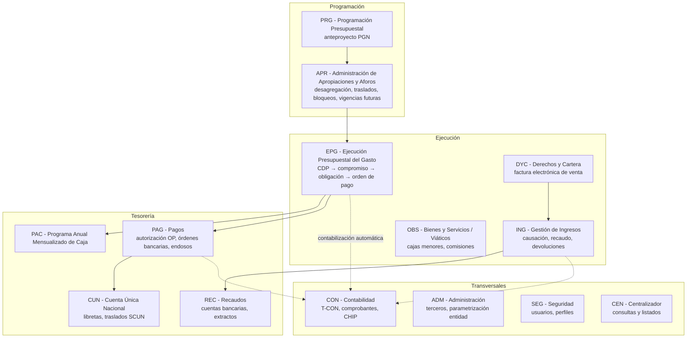
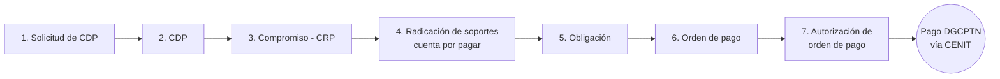
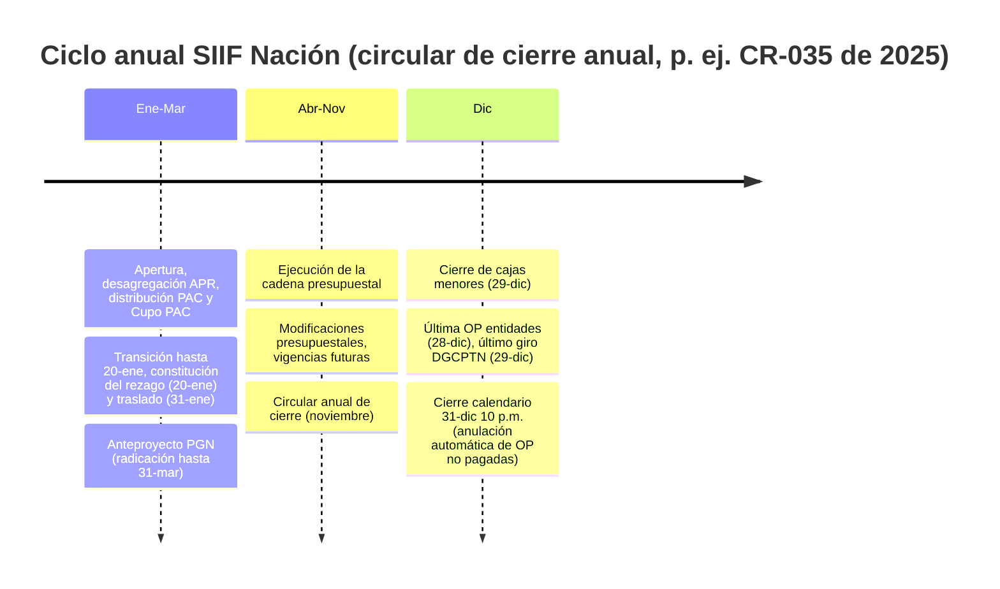

# Modelo detallado del SIIF Nación

**Sistema Integrado de Información Financiera — Ministerio de Hacienda y Crédito Público de Colombia**

> Documento maestro de síntesis. Cada sección remite a un capítulo detallado (01 a 20) construido a partir de la página oficial de MinHacienda (minhacienda.gov.co/siif), sus instructivos, circulares externas y guías oficiales republicadas por entidades usuarias (MinDefensa/DIMAR, DIAN, ICBF, Rama Judicial, entre otras). La metodología de verificación y las fuentes están en el capítulo [21](21-verificacion-y-fuentes.md).

---

## 1. Qué es el SIIF Nación

El SIIF Nación es la **herramienta modular, transversal y transaccional** mediante la cual las entidades del **Presupuesto General de la Nación (PGN)** realizan su gestión financiera pública de forma estandarizada, segura, **en línea y en tiempo real**. Es una iniciativa del MHCP que consolida la información financiera de las entidades del PGN y controla la ejecución presupuestal y financiera de la Administración Central y Descentralizada (excepto las empresas estatales).

- **Definición legal vigente** (Decreto 2674 de 2012, compilado en la Parte 9 del Decreto 1068 de 2015): sistema que *"coordina, integra, centraliza y estandariza la gestión financiera pública nacional"*.
- **Carácter oficial de la información**: lo registrado en SIIF es fuente válida para CDP, informes presupuestales, contabilidad, rezago e informes a órganos de control. La veracidad de las cifras es responsabilidad exclusiva de las entidades usuarias.
- **Obligatoriedad**: todas las entidades y órganos del PGN (art. 2.9.1.1.3 y 2.9.1.1.5 del Decreto 1068 de 2015). Prohibido adquirir software financiero que duplique al SIIF.

### Historia y versiones

| Versión | Período | Norma | Características |
|---|---|---|---|
| SIIF I | ~2000–2010 | Ley 298/1996 art. 8; Decretos 178/2003 y 2789/2004 | Integración básica presupuesto-contabilidad; dos niveles (central/descentralizado) |
| SIIF Nación II | 1-ene-2011 → hoy | CONPES 3361/2005; Decreto 2674/2012; Decreto 1068/2015 Parte 9 | 100% web, en línea y tiempo real, pago a beneficiario final, macroprocesos estandarizados |

**No existe una versión oficial "SIIF III"**: la modernización actual es incremental y se canaliza por el Proyecto de Modernización de la Administración Financiera Pública (MAFP) con apoyo BID/CAF (chatbot, portal de pagos, Gestor de Información Financiera con billeteras digitales, interoperabilidad). Ver capítulo [20](20-novedades-2024-2026.md).

### Gobernanza

| Órgano | Composición / titular | Función |
|---|---|---|
| Comité Directivo | Preside el Viceministro General; Contador General, Directores de Presupuesto (DGPPN), Crédito Público y Tesoro (DGCPTN) y Tecnología | Dirección estratégica; decisiones de obligatorio cumplimiento |
| Comité Operativo y de Seguridad | Preside el Administrador SIIF | Puede deshabilitar usuarios y exceptuar el pago a beneficiario final |
| Administrador SIIF Nación | Funcionario de alto nivel del Viceministerio General del MHCP | Administración funcional y técnica; circulares externas |
| Coordinador SIIF Entidad | Directivo/asesor designado por el Secretario General de cada entidad | Enlace oficial; seguridad y administración de usuarios en la entidad |

---

## 2. Mapa de módulos (macroprocesos)

| Módulo | Capítulo | Función principal |
|---|---|---|
| PRG – Programación Presupuestal | [03](03-programacion-presupuestal-apr.md) | Anteproyecto de PGN por versiones (entidades) y etapas Proyecto/Ley/Decreto (DGPPN) |
| APR – Administración de Apropiaciones y Aforos | [03](03-programacion-presupuestal-apr.md) | Desagregación del Decreto de Liquidación, asignación a subunidades/dependencias, modificaciones, bloqueos, vigencias futuras |
| EPG – Ejecución Presupuestal del Gasto | [02](02-epg-cadena-presupuestal.md) | Cadena presupuestal completa del gasto |
| ING – Gestión de Ingresos | [04](04-ing-ingresos.md) | Causación, recaudo, documentos de recaudo por clasificar, devoluciones |
| PAC | [05](05-pac.md) | Distribución de PAC y Cupo PAC, modificaciones, INPANUT |
| PAG / CUN / REC – Tesorería y SCUN | [06](06-tesoreria-cun.md) | Autorización y pago de órdenes, libretas SCUN, traslados, endosos, embargos, DIAN |
| CON – Contabilidad | [07](07-contabilidad-con.md) | Contabilidad automática (T-CON), comprobantes manuales, cierres, CHIP |
| OBS / Bienes y Servicios | [08](08-bienes-servicios-cajas-menores.md) | PAA/UNSPSC, cajas menores, viáticos y comisiones |
| SEG – Seguridad | [09](09-seguridad-usuarios-seg.md) | Usuarios, perfiles, firma digital, horarios |
| DYC – Derechos y Cartera | [16](16-derechos-cartera-facturacion.md) | Factura electrónica de venta, notas débito/crédito, cartera |
| ADM – Administración | [14](14-terceros-cuentas-bancarias.md) | Terceros, cuentas bancarias, parametrización de la entidad |
| CEN – Centralizador | [13](13-reportes-consultas.md) | Consultas tipo listado transversales |

---

## 3. La cadena presupuestal del gasto (núcleo del sistema)

Cinco etapas oficiales, siete pasos transaccionales. Cada paso tiene perfil y ruta de menú propios (detalle completo en el capítulo [02](02-epg-cadena-presupuestal.md)):

| # | Paso | Perfil | Ruta de transacción |
|---|---|---|---|
| 1 | Solicitud de CDP | Gestión Administrativa / Gestión Presupuesto Gastos | `EPG / Solicitud de CDP / Crear` |
| 2 | CDP | Gestión Presupuesto Gastos | `EPG / CDP / Gastos / Crear` |
| 3 | Compromiso (CRP) | Gestión Presupuesto Gastos | `EPG / Compromiso / Vigencia Actual / Crear` |
| 4 | Radicación de soportes | Central de Cuentas por Pagar | `EPG / Radicación Soportes / Radicar` |
| 5 | Obligación | Gestión Contable | `EPG / Obligación / Crear` |
| 6 | Orden de pago | Pagador Central / Regional | `EPG / Orden de Pago Presupuestal de Gasto / Crear` |
| 7 | Autorización | Pagador Central / Regional | `PAG / Administrar Órdenes de Pago / Autorizar` |

Reglas estructurales:

- **Encadenamiento hacia atrás**: adicionar un compromiso exige adicionar primero la solicitud y el CDP; reducir una solicitud certificada exige reducir primero el CDP. Las reducciones solo proceden sobre saldos no consumidos por la instancia siguiente.
- **Estados de la orden de pago**: Generada → Aprobada / Pendiente de Autorización → Pagada; excepciones Bloqueada y Anulada (una OP *Pagada* puede volver a *Bloqueada* si el banco rechaza el abono).
- **La obligación concentra la lógica contable**: tipo de gasto, tipo de operación (crédito, TCON009), uso contable (débito, TCON007/TCON012) y atributo contable (48 códigos) que define si contabiliza en la obligación (transacción EPG066) o en el pago. Desde el Decreto 412 de 2018 es obligatoria la carpeta **Usos Presupuestales** al máximo nivel del CCP.
- **Pago a beneficiario final** (art. 2.9.1.2.1, Decreto 1068/2015): abono directo a cuenta bancaria registrada y validada; el *Traslado a Pagaduría* es excepcional (nóminas, pensiones, deducciones, servicios públicos) y lo autoriza el Comité Operativo y de Seguridad.

---

## 4. Conceptos transversales

### Catálogos y clasificadores (capítulo [17](17-catalogo-clasificacion-presupuestal.md))
- **CCP – Catálogo de Clasificación Presupuestal** (Resolución 0042 de 2019 DGPPN): 8 clasificadores principales + 2 auxiliares. Rubros de gasto: `A` funcionamiento, `B` deuda, `C` inversión. Marcas por posición: nivel *Desagregado*, *Afecta Apropiación*, *Requiere Usos Presupuestales*.
- **Catálogo Institucional (PCI)**: Unidad Ejecutora (6 dígitos = sección presupuestal) → Subunidades. Ver capítulo [12](12-entidades-usuarias.md).
- **Fuentes y situación de fondos** (capítulo [18](18-csf-ssf-fuentes.md)): fuente *Nación* o *Propios*; recursos *CSF* (giro del Tesoro) o *SSF*. Determinan quién carga extractos, quién paga (13-01-01-DT para SCUN) y a dónde van los reintegros.

### PAC y SCUN
- **PAC**: tope mensual de pago aprobado por el CONFIS, distribuido por la DGCPTN a las Unidades Ejecutoras; la UE distribuye **Cupo PAC** a subunidades. Tres vigencias: Actual, Rezago Año Anterior, Rezago Año Siguiente. Indicador **INPANUT** (márgenes 5%/10%) con sanciones por incumplimiento.
- **SCUN**: la DGCPTN administra los recursos trasladados como "banco de las entidades" mediante **libretas** por UE; cuenta 61016986 del Banco de la República; contabilidad en el auxiliar 190801002 (REA DTN-SCUN).

### Terceros y cuentas bancarias (capítulo [14](14-terceros-cuentas-bancarias.md))
- Terceros universales validados en línea contra **DIAN** (NIT/RUT) y **Registraduría** (cédulas).
- Estados de cuenta bancaria: Registro Previo → Registrada → **Activa** (única que permite pagar) / Inválida; validación por prenotificación **CENIT** (mínimo 3 días hábiles).

### Contabilidad automática
- Tablas de eventos contables **T-CON** parametrizadas por la Contaduría General de la Nación (TCON01 a TCON99); comprobantes manuales por **tipologías** T01–T80 (TCON95); reportes formales a **CHIP**: CGN2015.001, CGN2015.002, CGN2016.01.

---

## 5. Perfiles y seguridad (capítulo [09](09-seguridad-usuarios-seg.md))

- **Dos familias de perfiles**: *Administrativos* (MHCP, CGN, DGCPTN; sin restricción horaria) y *de Negocio* (`Entidad – …`; horario 6:00 a.m.–12:30 p.m. y 1:00–11:00 p.m., extendido por circular en cierres).
- **Autenticación de triple factor**: usuario + contraseña (teclado virtual, vence cada 30 días) + **certificado de firma digital** en token criptográfico (obligatorio desde el 1-abr-2016, Circular Externa 005 de 2014); se admiten tokens virtuales OTP.
- **Segregación de funciones** (Circulares 013/2021 y 044/2022): no se combinan Gestión Presupuesto Gastos, Central de Cuentas por Pagar, Pagador Central/Regional; ni Programador/Consolidador; ni Autorizador Endoso/Pagador.
- **Gestión de usuarios**: Coordinador SIIF → Registrador de Usuarios → `SEG / Entidades y Usuarios / Trámite de Privilegios / Solicitud de Administración de Usuarios UE`; soportes por la Sede Electrónica del MHCP. Cuentas: expiración a 15 días sin ingreso, eliminación a 90.
- **Acceso**: portal VPN SSL — producción `portal2.siifnacion.gov.co`, capacitación `portal3.siifnacion.gov.co/capacitacion`. Soporte: (601) 602 1270 op. 1 / 01-8000-910071.

---

## 6. Ciclo anual de operación (capítulo [15](15-cierre-vigencia.md))

- **Rezago presupuestal** = reservas (compromisos no obligados a 31-dic) + cuentas por pagar (obligaciones no pagadas a 31-dic); se constituye a más tardar el 20-ene y fenece si no se ejecuta a 31-dic del año siguiente.
- **Cierre contable**: registros hasta mediados de febrero; cierre por la CGN en marzo (clase 7 y grupo 59 en cero, conciliaciones, recíprocas).

---

## 7. Interoperabilidad (capítulo [19](19-interoperabilidad.md))

| Sistema | Entidad | Naturaleza del enlace |
|---|---|---|
| SECOP II / TVEC | Colombia Compra Eficiente | Validación en línea de CDP y RP desde el contrato electrónico (botón "Consultar SIIF") |
| SUIFP / PIIP (BPIN) | DNP | Código BPIN en apropiaciones de inversión; concepto previo DNP en trámites |
| DIAN | DIAN | Sincronización RUT de terceros; factura electrónica (recepción obligatoria desde 1-abr-2021 y FEV propia del SIIF en DYC); pago de retenciones por compensación (MUISCA) |
| CHIP | Contaduría General | Formularios trimestrales CGN2015.001/002, CGN2016.01 |
| SEBRA / CUD / CENIT | Banco de la República | Pagos a beneficiario final (ACH CENIT), traslados al SCUN (SEBRA-CUD), prenotificación de cuentas |
| SPGR | MHCP (regalías) | Plataforma compartida, presupuesto separado; contabilidad única en SIIF |
| PTE / datos abiertos | MHCP | Portal de Transparencia Económica (www.pte.gov.co) alimentado por SIIF |

---

## 8. Catálogo documental oficial

El portal **minhacienda.gov.co/siif** organiza la documentación en: Información General · Formatos · Capacitaciones en Línea · Capacitación · Estadísticas · Acceso Consulta de Pagos · Normativa (Circulares, Comunicados, Decretos) · **Ciclo de Negocios** (guías por macroproceso, incluida la carpeta Cargas Masivas con ~37 estructuras de archivos planos) · **Aspectos Técnicos** (~10 documentos: manual VPN SSL, guía del componente de firma digital, esquema de interconexión, ancho de banda, canales de contingencia, lista de chequeo, configuración de clientes/servidores).

Complementan: las circulares externas anuales (cambios de versión, cierre de vigencia), la *Guía de entrada al SIIF Nación* (v14, mayo 2025) y las guías financieras numeradas del Ministerio de Defensa que documentan procedimientos SIIF estándar (p. ej. Guía 12 – Ejecución presupuestal del gasto, Guía 65 – Perfiles). Cada capítulo de este modelo incluye su tabla de documentos oficiales con enlaces.

### Normatividad esencial (capítulo [10](10-normatividad.md))

| Norma | Contenido |
|---|---|
| Ley 298 de 1996, art. 8 | Creación legal del SIIF |
| Decreto 111 de 1996 | Estatuto Orgánico del Presupuesto (fundamento sustantivo) |
| Decreto 2674 de 2012 | Reglamento de operación vigente (deroga 2789/2004 y 4318/2006) |
| Decreto 1068 de 2015, Parte 9 | Compilación vigente (DUR Sector Hacienda) |
| Decreto 412 de 2018 | Registro de ejecución y usos presupuestales |
| Resolución 0042 de 2019 DGPPN | Catálogo de Clasificación Presupuestal |
| Circulares externas del Administrador SIIF | Operación: versiones, cierre anual, perfiles, seguridad |

---

## 9. Índice de capítulos

1. [Visión general e historia](01-vision-general.md)
2. [EPG y cadena presupuestal](02-epg-cadena-presupuestal.md)
3. [Programación presupuestal y APR](03-programacion-presupuestal-apr.md)
4. [ING – Ingresos](04-ing-ingresos.md)
5. [PAC](05-pac.md)
6. [Tesorería y SCUN](06-tesoreria-cun.md)
7. [CON – Contabilidad](07-contabilidad-con.md)
8. [Bienes y servicios, cajas menores y viáticos](08-bienes-servicios-cajas-menores.md)
9. [SEG – Seguridad y usuarios](09-seguridad-usuarios-seg.md)
10. [Normatividad](10-normatividad.md)
11. [Arquitectura técnica](11-arquitectura-tecnica.md)
12. [Entidades usuarias](12-entidades-usuarias.md)
13. [Reportes y consultas](13-reportes-consultas.md)
14. [Terceros y cuentas bancarias](14-terceros-cuentas-bancarias.md)
15. [Cierre de vigencia y rezago](15-cierre-vigencia.md)
16. [DYC – Derechos y Cartera / facturación electrónica](16-derechos-cartera-facturacion.md)
17. [Catálogo de Clasificación Presupuestal y usos](17-catalogo-clasificacion-presupuestal.md)
18. [CSF/SSF, fuentes y recursos administrados](18-csf-ssf-fuentes.md)
19. [Interoperabilidad](19-interoperabilidad.md)
20. [Novedades 2024–2026](20-novedades-2024-2026.md)
21. [Verificación y fuentes](21-verificacion-y-fuentes.md)
